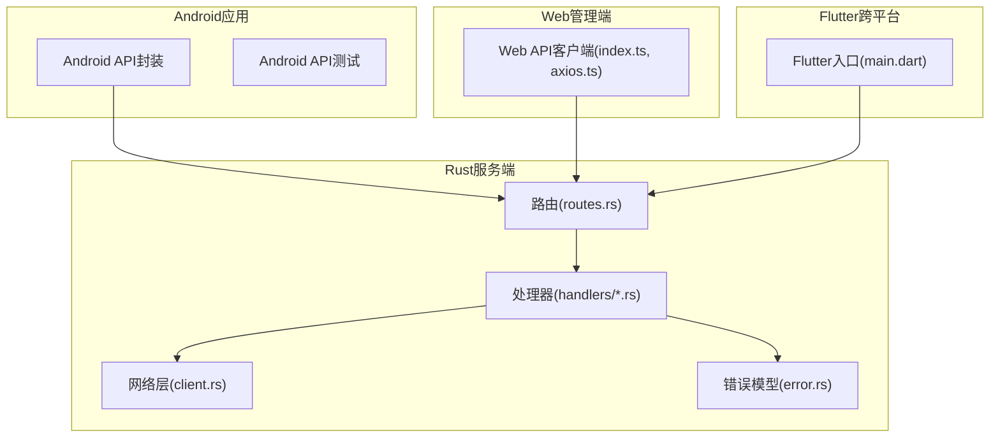
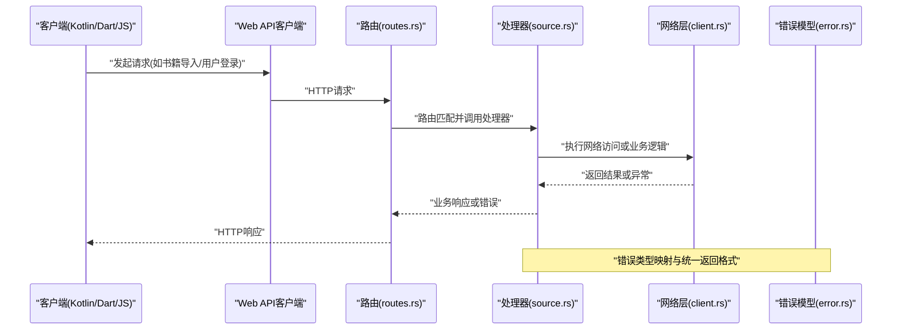
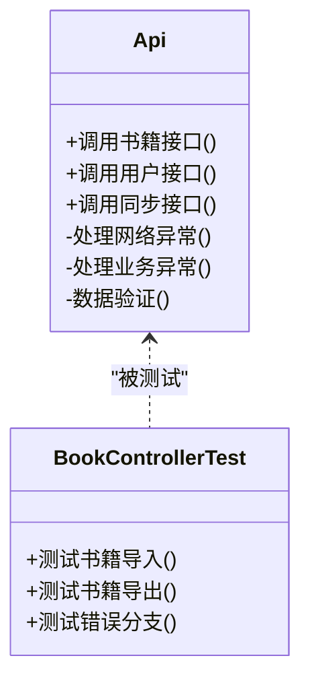
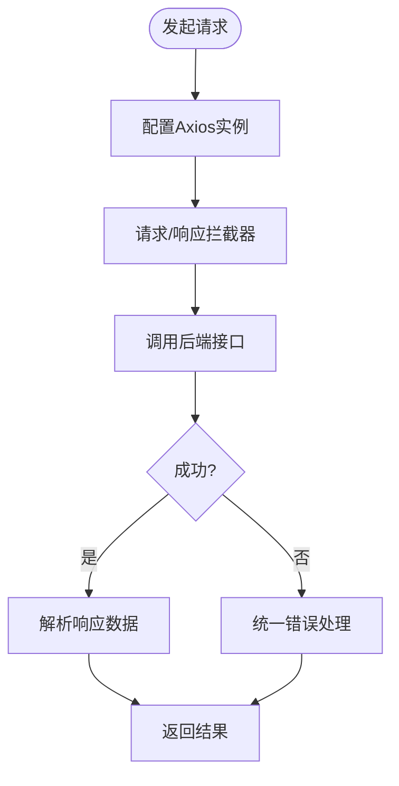
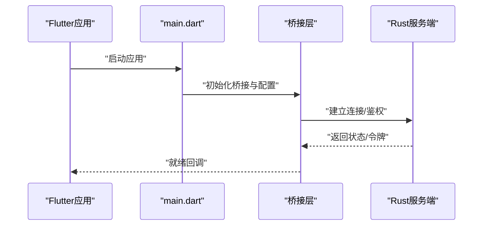
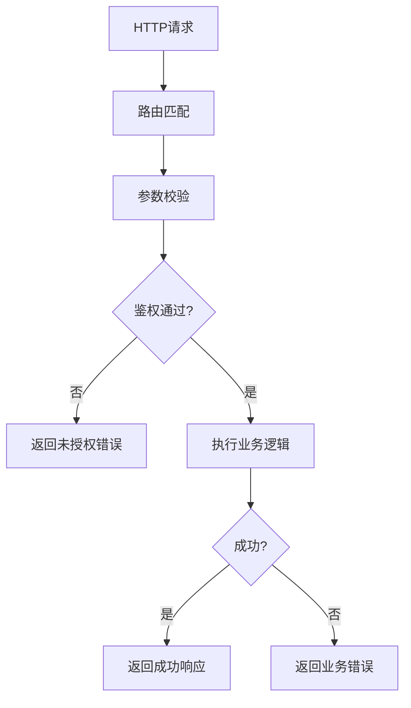
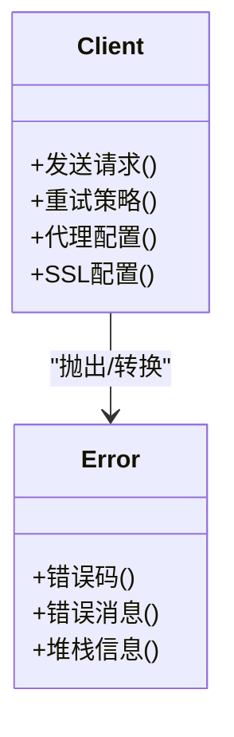
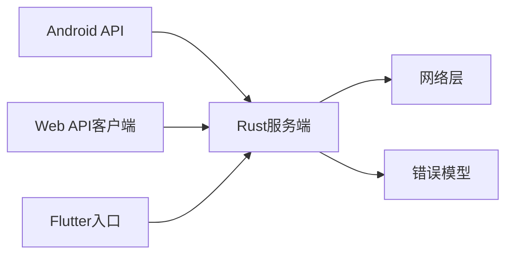

# API使用示例

<cite>
**本文引用的文件**   
- [README.md](file://README.md)
- [app/src/main/java/io/legado/app/api/Api.kt](file://app/src/main/java/io/legado/app/api/Api.kt)
- [app/src/test/java/io/legado/app/api/controller/BookControllerTest.kt](file://app/src/test/java/io/legado/app/api/controller/BookControllerTest.kt)
- [modules/web/src/api/index.ts](file://modules/web/src/api/index.ts)
- [modules/web/src/api/axios.ts](file://modules/web/src/api/axios.ts)
- [flutter_legado/lib/src/main.dart](file://flutter_legado/lib/src/main.dart)
- [rust/legado-server/src/routes.rs](file://rust/legado-server/src/routes.rs)
- [rust/legado-server/src/handlers/source.rs](file://rust/legado-server/src/handlers/source.rs)
- [rust/legado-net/src/client.rs](file://rust/legado-net/src/client.rs)
- [rust/legado-core/src/error.rs](file://rust/legado-core/src/error.rs)
</cite>

## 目录
1. [简介](#简介)
2. [项目结构](#项目结构)
3. [核心组件](#核心组件)
4. [架构总览](#架构总览)
5. [详细组件分析](#详细组件分析)
6. [依赖关系分析](#依赖关系分析)
7. [性能考虑](#性能考虑)
8. [故障排除指南](#故障排除指南)
9. [结论](#结论)
10. [附录](#附录)

## 简介
本文件面向开发者与测试人员，提供Legado项目的API使用示例与实践指南。内容涵盖：
- 多语言调用示例（Kotlin、Dart、JavaScript）
- 常见业务场景（书籍导入导出、用户登录注册、数据同步）
- 错误处理模式（网络异常、业务异常、数据验证错误）
- API测试方法（单元测试、集成测试、Mock数据）
- 性能优化技巧（请求合并、缓存策略、批量操作）
- 调试工具与故障排除

## 项目结构
Legado采用多模块架构，包含Android应用、Flutter跨平台前端、Web管理端以及Rust后端服务。API相关的关键位置如下：
- Android端API封装与测试位于 app 模块
- Web端API客户端位于 modules/web
- Flutter端入口位于 flutter_legado
- Rust服务端路由与处理器位于 rust/legado-server
- 网络层与错误模型位于 rust/legado-net 与 rust/legado-core

图表来源 
- [rust/legado-server/src/routes.rs](file://rust/legado-server/src/routes.rs)
- [rust/legado-server/src/handlers/source.rs](file://rust/legado-server/src/handlers/source.rs)
- [rust/legado-net/src/client.rs](file://rust/legado-net/src/client.rs)
- [rust/legado-core/src/error.rs](file://rust/legado-core/src/error.rs)
- [modules/web/src/api/index.ts](file://modules/web/src/api/index.ts)
- [modules/web/src/api/axios.ts](file://modules/web/src/api/axios.ts)
- [app/src/main/java/io/legado/app/api/Api.kt](file://app/src/main/java/io/legado/app/api/Api.kt)
- [flutter_legado/lib/src/main.dart](file://flutter_legado/lib/src/main.dart)

章节来源
- [README.md](file://README.md)

## 核心组件
- Android API封装：提供对后端服务的统一调用接口，便于在Android端进行业务逻辑编排与错误处理。
- Web API客户端：基于Axios的HTTP客户端封装，用于Web管理端与服务端交互。
- Flutter入口：跨平台应用的启动点，负责初始化与桥接后端能力。
- Rust服务端路由与处理器：定义RESTful接口并实现具体业务逻辑。
- 网络层与错误模型：统一的网络请求、重试、代理、SSL配置与错误类型定义。

章节来源
- [app/src/main/java/io/legado/app/api/Api.kt](file://app/src/main/java/io/legado/app/api/Api.kt)
- [modules/web/src/api/index.ts](file://modules/web/src/api/index.ts)
- [modules/web/src/api/axios.ts](file://modules/web/src/api/axios.ts)
- [flutter_legado/lib/src/main.dart](file://flutter_legado/lib/src/main.dart)
- [rust/legado-server/src/routes.rs](file://rust/legado-server/src/routes.rs)
- [rust/legado-server/src/handlers/source.rs](file://rust/legado-server/src/handlers/source.rs)
- [rust/legado-net/src/client.rs](file://rust/legado-net/src/client.rs)
- [rust/legado-core/src/error.rs](file://rust/legado-core/src/error.rs)

## 架构总览
下图展示了从客户端到服务端的典型请求流程，包括路由分发、处理器执行、网络访问与错误返回。

图表来源 
- [modules/web/src/api/index.ts](file://modules/web/src/api/index.ts)
- [rust/legado-server/src/routes.rs](file://rust/legado-server/src/routes.rs)
- [rust/legado-server/src/handlers/source.rs](file://rust/legado-server/src/handlers/source.rs)
- [rust/legado-net/src/client.rs](file://rust/legado-net/src/client.rs)
- [rust/legado-core/src/error.rs](file://rust/legado-core/src/error.rs)

## 详细组件分析

### Android API封装与测试
- API封装职责：集中管理HTTP请求、参数校验、错误处理与重试策略。
- 测试用例：通过单元测试覆盖关键路径，确保接口契约稳定。

图表来源 
- [app/src/main/java/io/legado/app/api/Api.kt](file://app/src/main/java/io/legado/app/api/Api.kt)
- [app/src/test/java/io/legado/app/api/controller/BookControllerTest.kt](file://app/src/test/java/io/legado/app/api/controller/BookControllerTest.kt)

章节来源
- [app/src/main/java/io/legado/app/api/Api.kt](file://app/src/main/java/io/legado/app/api/Api.kt)
- [app/src/test/java/io/legado/app/api/controller/BookControllerTest.kt](file://app/src/test/java/io/legado/app/api/controller/BookControllerTest.kt)

### Web API客户端
- Axios封装：统一设置超时、拦截器、错误提示与重试。
- 接口组织：按功能域划分模块，便于维护与扩展。

图表来源 
- [modules/web/src/api/axios.ts](file://modules/web/src/api/axios.ts)
- [modules/web/src/api/index.ts](file://modules/web/src/api/index.ts)

章节来源
- [modules/web/src/api/index.ts](file://modules/web/src/api/index.ts)
- [modules/web/src/api/axios.ts](file://modules/web/src/api/axios.ts)

### Flutter入口与桥接
- 启动流程：初始化全局配置、日志、网络栈与本地存储。
- 桥接能力：通过插件或通道调用Rust后端能力，实现跨平台一致性。

图表来源 
- [flutter_legado/lib/src/main.dart](file://flutter_legado/lib/src/main.dart)

章节来源
- [flutter_legado/lib/src/main.dart](file://flutter_legado/lib/src/main.dart)

### Rust服务端路由与处理器
- 路由定义：RESTful风格，支持路径参数与查询参数。
- 处理器实现：业务逻辑、数据校验、权限控制与错误返回。

图表来源 
- [rust/legado-server/src/routes.rs](file://rust/legado-server/src/routes.rs)
- [rust/legado-server/src/handlers/source.rs](file://rust/legado-server/src/handlers/source.rs)

章节来源
- [rust/legado-server/src/routes.rs](file://rust/legado-server/src/routes.rs)
- [rust/legado-server/src/handlers/source.rs](file://rust/legado-server/src/handlers/source.rs)

### 网络层与错误模型
- 网络层：统一请求构建、重试、代理、SSL配置与速率限制。
- 错误模型：标准化错误码、消息与堆栈信息，便于客户端统一处理。

图表来源 
- [rust/legado-net/src/client.rs](file://rust/legado-net/src/client.rs)
- [rust/legado-core/src/error.rs](file://rust/legado-core/src/error.rs)

章节来源
- [rust/legado-net/src/client.rs](file://rust/legado-net/src/client.rs)
- [rust/legado-core/src/error.rs](file://rust/legado-core/src/error.rs)

## 依赖关系分析
- Android API依赖Rust服务端接口契约，需保持版本兼容。
- Web API客户端依赖Axios库，需关注拦截器与错误处理的一致性。
- Flutter入口依赖桥接层，确保跨平台行为一致。
- Rust服务端依赖网络层与错误模型，保证稳定性与可观测性。

图表来源 
- [app/src/main/java/io/legado/app/api/Api.kt](file://app/src/main/java/io/legado/app/api/Api.kt)
- [modules/web/src/api/index.ts](file://modules/web/src/api/index.ts)
- [flutter_legado/lib/src/main.dart](file://flutter_legado/lib/src/main.dart)
- [rust/legado-server/src/routes.rs](file://rust/legado-server/src/routes.rs)
- [rust/legado-net/src/client.rs](file://rust/legado-net/src/client.rs)
- [rust/legado-core/src/error.rs](file://rust/legado-core/src/error.rs)

章节来源
- [app/src/main/java/io/legado/app/api/Api.kt](file://app/src/main/java/io/legado/app/api/Api.kt)
- [modules/web/src/api/index.ts](file://modules/web/src/api/index.ts)
- [flutter_legado/lib/src/main.dart](file://flutter_legado/lib/src/main.dart)
- [rust/legado-server/src/routes.rs](file://rust/legado-server/src/routes.rs)
- [rust/legado-net/src/client.rs](file://rust/legado-net/src/client.rs)
- [rust/legado-core/src/error.rs](file://rust/legado-core/src/error.rs)

## 性能考虑
- 请求合并：将多个小请求合并为批量接口，减少握手开销。
- 缓存策略：合理使用HTTP缓存与本地缓存，降低重复请求。
- 批量操作：服务端提供批量写入/更新接口，提升吞吐。
- 重试与退避：在网络不稳定时自动重试，避免雪崩。
- 压缩传输：启用Gzip/Brotli压缩，减少带宽占用。

[本节为通用指导，不直接分析具体文件]

## 故障排除指南
- 网络异常：检查代理、SSL配置与超时设置；查看重试策略是否合理。
- 业务异常：核对参数校验规则与权限控制；定位处理器中的错误分支。
- 数据验证错误：确认请求体结构与字段类型；使用Mock数据进行边界测试。
- 调试工具：启用服务端日志与客户端抓包；使用断点与单步调试。

章节来源
- [rust/legado-net/src/client.rs](file://rust/legado-net/src/client.rs)
- [rust/legado-core/src/error.rs](file://rust/legado-core/src/error.rs)
- [rust/legado-server/src/handlers/source.rs](file://rust/legado-server/src/handlers/source.rs)

## 结论
通过统一的API封装与标准化的错误模型，Legato在多端（Android、Web、Flutter）实现了稳定的服务调用。结合合理的性能优化与完善的测试策略，可有效提升系统的可靠性与可维护性。建议在实际项目中遵循本文的最佳实践，持续迭代与优化。

[本节为总结性内容，不直接分析具体文件]

## 附录
- 多语言调用示例：参考各端API封装与客户端代码，按需调整参数与错误处理。
- 常见业务场景：书籍导入导出、用户登录注册、数据同步等，均遵循统一接口契约。
- 测试方法：单元测试覆盖核心路径，集成测试验证端到端流程，Mock数据用于隔离外部依赖。

[本节为补充说明，不直接分析具体文件]