# API参考

<cite>
**本文引用的文件**   
- [legado-server/src/lib.rs](file://rust/legado-server/src/lib.rs)
- [legado-server/src/routes.rs](file://rust/legado-server/src/routes.rs)
- [legado-server/src/server.rs](file://rust/legado-server/src/server.rs)
- [legado-server/src/state.rs](file://rust/legado-server/src/state.rs)
- [legado-server/src/error.rs](file://rust/legado-server/src/error.rs)
- [legado-server/src/handlers/mod.rs](file://rust/legado-server/src/handlers/mod.rs)
- [legado-server/src/ws/mod.rs](file://rust/legado-server/src/ws/mod.rs)
- [legado-ffi/src/bridge.rs](file://rust/legado-ffi/src/bridge.rs)
- [legado-ffi/src/ffi.rs](file://rust/legado-ffi/src/ffi.rs)
- [legado-ffi/src/api/mod.rs](file://rust/legado-ffi/src/api/mod.rs)
- [legado-ffi/src/db_state.rs](file://rust/legado-ffi/src/db_state.rs)
- [legado-ffi/src/runtime.rs](file://rust/legado-ffi/src/runtime.rs)
- [legado-ffi/src/api/review_api.rs](file://rust/legado-ffi/src/api/review_api.rs)
- [legado-ffi/src/api/cache_api.rs](file://rust/legado-ffi/src/api/cache_api.rs)
- [legado-ffi/src/api/rss.rs](file://rust/legado-ffi/src/api/rss.rs)
- [legado-ffi/src/api/webdav_api.rs](file://rust/legado-ffi/src/api/webdav_api.rs)
- [legado-net/src/webdav.rs](file://rust/legado-net/src/webdav.rs)
- [app/src/main/java/io/legado/app/api/ApiProvider.kt](file://app/src/main/java/io/legado/app/api/ApiProvider.kt)
- [modules/web/src/api/index.ts](file://modules/web/src/api/index.ts)
- [modules/web/src/api/axios.ts](file://modules/web/src/api/axios.ts)
- [modules/web/src/api/sourceToken.ts](file://modules/web/src/api/sourceToken.ts)
- [flutter_legado/lib/src/services/book_api.dart](file://flutter_legado/lib/src/services/book_api.dart)
- [flutter_legado/lib/src/services/mock_book_api.dart](file://flutter_legado/lib/src/services/mock_book_api.dart)
- [flutter_legado/lib/src/services/rust_api.dart](file://flutter_legado/lib/src/services/rust_api.dart)
- [flutter_legado/lib/src/providers/sync_provider.dart](file://flutter_legado/lib/src/providers/sync_provider.dart)
- [flutter_legado/lib/src/bridge/ffi/ffi.dart](file://flutter_legado/lib/src/bridge/ffi/ffi.dart)
- [flutter_legado/lib/src/models/cover_candidate.dart](file://flutter_legado/lib/src/models/cover_candidate.dart)
- [flutter_legado/lib/src/models/misc.dart](file://flutter_legado/lib/src/models/misc.dart)
- [flutter_legado/lib/src/providers/change_source/change_source_notifier.dart](file://flutter_legado/lib/src/providers/change_source/change_source_notifier.dart)
- [flutter_legado/lib/src/screens/other_settings_screen.dart](file://flutter_legado/lib/src/screens/other_settings_screen.dart)
- [flutter_legado/lib/src/screens/theme_config_screen.dart](file://flutter_legado/lib/src/screens/theme_config_screen.dart)
- [docs/API_CONTRACT.md](file://docs/API_CONTRACT.md)
- [app/src/main/java/io/legado/app/model/BookCover.kt](file://app/src/main/java/io/legado/app/model/BookCover.kt)
- [rust/legado-core/src/review.rs](file://rust/legado-core/src/review.rs)
- [rust/legado-core/src/models/rule/review_rule.rs](file://rust/legado-core/src/models/rule/review_rule.rs)
</cite>

## 更新摘要
**所做更改**   
- 新增三个第四批后置项FFI方法：`setCustomHosts`（自定义hosts映射）、`setMcpPort`（独立MCP服务端口）、`searchCoverRules`（封面规则搜索）
- 更新API契约文档，方法总数从227增加到230，模块计数相应调整
- 完善Flutter层的完整实现，包括接口定义、FFI桥接、Mock实现和Rust封装
- 增强网络配置管理功能，支持域名到IP的自定义映射
- 新增独立MCP服务端口管理，与Web服务端口分离
- 扩展封面搜索能力，支持按书名执行启用规则搜索封面

## 目录
1. [简介](#简介)
2. [项目结构](#项目结构)
3. [核心组件](#核心组件)
4. [架构总览](#架构总览)
5. [详细组件分析](#详细组件分析)
6. [依赖分析](#依赖分析)
7. [性能考虑](#性能考虑)
8. [故障排查指南](#故障排查指南)
9. [结论](#结论)
10. [附录](#附录)

## 简介
本API参考文档面向Legado项目的RESTful接口、WebSocket实时通信、FFI跨语言接口以及插件扩展机制，提供统一的接口规范说明。内容涵盖HTTP方法、URL模式、请求参数、响应格式、错误码；WebSocket连接建立、消息格式与事件类型；FFI函数签名、数据类型映射、错误处理与内存管理；插件开发中的规则引擎接口、回调函数、扩展点与生命周期；认证授权（JWT令牌、权限控制、访问限制）；并提供使用示例与最佳实践。同时包含版本管理与向后兼容性说明，帮助开发者快速集成与扩展。

**更新** 第四批后置项FFI冻结完成，新增三个加法式方法：`setCustomHosts`（自定义hosts映射）、`setMcpPort`（独立MCP服务端口）、`searchCoverRules`（封面规则搜索），方法总数从227增加到230个。

## 项目结构
本项目采用多模块架构：
- Rust服务端（legado-server）：提供HTTP路由、处理器、WebSocket服务、状态管理与错误处理。
- FFI层（legado-ffi）：暴露给Kotlin/Flutter等宿主语言的跨语言接口，封装数据库状态、运行时上下文与各业务API。
- Flutter应用（flutter_legado）：通过Dart调用Rust FFI接口，提供现代化UI与业务逻辑。
- Android应用（app）：通过Kotlin调用FFI或本地网络库，提供原生UI与业务逻辑。
- Web前端（modules/web）：通过TypeScript与Axios访问后端API，实现源码编辑与调试工具。

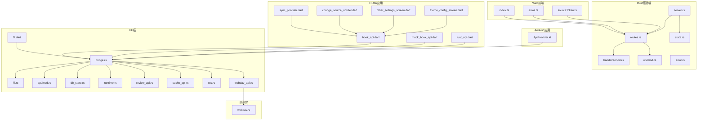

**图表来源**
- [flutter_legado/lib/src/services/book_api.dart](file://flutter_legado/lib/src/services/book_api.dart)
- [flutter_legado/lib/src/services/mock_book_api.dart](file://flutter_legado/lib/src/services/mock_book_api.dart)
- [flutter_legado/lib/src/services/rust_api.dart](file://flutter_legado/lib/src/services/rust_api.dart)
- [flutter_legado/lib/src/providers/sync_provider.dart](file://flutter_legado/lib/src/providers/sync_provider.dart)
- [flutter_legado/lib/src/providers/change_source/change_source_notifier.dart](file://flutter_legado/lib/src/providers/change_source/change_source_notifier.dart)
- [flutter_legado/lib/src/screens/other_settings_screen.dart](file://flutter_legado/lib/src/screens/other_settings_screen.dart)
- [flutter_legado/lib/src/screens/theme_config_screen.dart](file://flutter_legado/lib/src/screens/theme_config_screen.dart)
- [flutter_legado/lib/src/bridge/ffi/ffi.dart](file://flutter_legado/lib/src/bridge/ffi/ffi.dart)
- [legado-ffi/src/bridge.rs](file://rust/legado-ffi/src/bridge.rs)
- [legado-ffi/src/ffi.rs](file://rust/legado-ffi/src/ffi.rs)
- [legado-ffi/src/api/mod.rs](file://rust/legado-ffi/src/api/mod.rs)
- [legado-ffi/src/db_state.rs](file://rust/legado-ffi/src/db_state.rs)
- [legado-ffi/src/runtime.rs](file://rust/legado-ffi/src/runtime.rs)
- [legado-ffi/src/api/review_api.rs](file://rust/legado-ffi/src/api/review_api.rs)
- [legado-ffi/src/api/cache_api.rs](file://rust/legado-ffi/src/api/cache_api.rs)
- [legado-ffi/src/api/rss.rs](file://rust/legado-ffi/src/api/rss.rs)
- [legado-ffi/src/api/webdav_api.rs](file://rust/legado-ffi/src/api/webdav_api.rs)
- [legado-net/src/webdav.rs](file://rust/legado-net/src/webdav.rs)

章节来源
- [legado-server/src/lib.rs](file://rust/legado-server/src/lib.rs)
- [legado-server/src/server.rs](file://rust/legado-server/src/server.rs)
- [legado-server/src/routes.rs](file://rust/legado-server/src/routes.rs)
- [legado-ffi/src/bridge.rs](file://rust/legado-ffi/src/bridge.rs)
- [app/src/main/java/io/legado/app/api/ApiProvider.kt](file://app/src/main/java/io/legado/app/api/ApiProvider.kt)
- [modules/web/src/api/index.ts](file://modules/web/src/api/index.ts)

## 核心组件
- HTTP服务器与路由：负责监听端口、注册路由、分发请求到处理器。
- WebSocket服务：维护长连接、广播消息、订阅主题。
- FFI桥接：将Rust侧能力暴露给Kotlin/Flutter，统一错误与内存管理。
- Flutter服务层：提供现代化的Dart API封装，支持异步操作与错误恢复。
- Mock服务层：为测试和开发提供模拟数据与行为。
- 状态管理：集中管理数据库连接、配置、会话与缓存。
- 错误处理：定义统一错误码与响应格式，便于客户端解析。
- WebDAV同步器：管理云同步配置、状态和数据传输，支持大文件上传。
- 网络配置管理器：管理自定义hosts映射和网络传输配置。
- MCP服务管理器：管理独立MCP服务端口和生命周期。

**更新** 新增网络配置管理和MCP服务管理功能，支持自定义hosts映射和独立MCP服务端口配置。

章节来源
- [legado-server/src/server.rs](file://rust/legado-server/src/server.rs)
- [legado-server/src/routes.rs](file://rust/legado-server/src/routes.rs)
- [legado-server/src/ws/mod.rs](file://rust/legado-server/src/ws/mod.rs)
- [legado-ffi/src/bridge.rs](file://rust/legado-ffi/src/bridge.rs)
- [flutter_legado/lib/src/services/book_api.dart](file://flutter_legado/lib/src/services/book_api.dart)
- [flutter_legado/lib/src/services/mock_book_api.dart](file://flutter_legado/lib/src/services/mock_book_api.dart)
- [flutter_legado/lib/src/services/rust_api.dart](file://flutter_legado/lib/src/services/rust_api.dart)
- [flutter_legado/lib/src/providers/sync_provider.dart](file://flutter_legado/lib/src/providers/sync_provider.dart)

## 架构总览
整体架构分为四层：
- 接入层：HTTP与WebSocket入口，统一鉴权与限流。
- 服务层：Flutter/Dart服务封装，提供类型安全的API访问。
- 业务层：处理器与领域逻辑，读写数据、执行规则、调度任务。
- 数据层：数据库与缓存，持久化与查询优化。

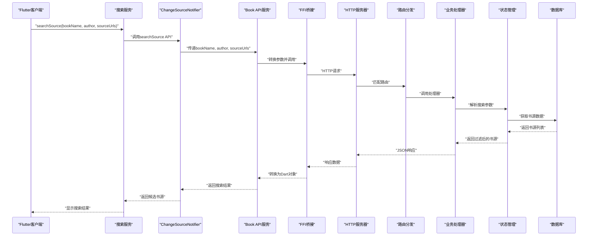

**图表来源**
- [flutter_legado/lib/src/providers/change_source/change_source_notifier.dart](file://flutter_legado/lib/src/providers/change_source/change_source_notifier.dart)
- [flutter_legado/lib/src/services/book_api.dart](file://flutter_legado/lib/src/services/book_api.dart)
- [flutter_legado/lib/src/services/rust_api.dart](file://flutter_legado/lib/src/services/rust_api.dart)
- [legado-ffi/src/bridge.rs](file://rust/legado-ffi/src/bridge.rs)
- [legado-server/src/server.rs](file://rust/legado-server/src/server.rs)
- [legado-server/src/routes.rs](file://rust/legado-server/src/routes.rs)
- [legado-server/src/state.rs](file://rust/legado-server/src/state.rs)

章节来源
- [legado-server/src/lib.rs](file://rust/legado-server/src/lib.rs)
- [legado-server/src/server.rs](file://rust/legado-server/src/server.rs)

## 详细组件分析

### RESTful API接口规范
- URL模式：遵循资源导向设计，如/books、/chapters、/sources等，支持分页与过滤参数。
- HTTP方法：GET用于查询，POST用于创建，PUT/PATCH用于更新，DELETE用于删除。
- 请求参数：路径参数、查询参数、请求体（JSON），需进行校验与默认值处理。
- 响应格式：统一JSON结构，包含数据、分页信息与时间戳。
- 错误码：标准HTTP状态码与业务错误码组合，错误信息包含代码、消息与详情。

章节来源
- [legado-server/src/routes.rs](file://rust/legado-server/src/routes.rs)
- [legado-server/src/handlers/mod.rs](file://rust/legado-server/src/handlers/mod.rs)
- [legado-server/src/error.rs](file://rust/legado-server/src/error.rs)

### WebSocket接口设计
- 连接建立：客户端发起WS连接，服务端验证令牌并建立会话。
- 消息格式：JSON编码，包含类型、载荷、时间戳与序列号。
- 事件类型：订阅/取消订阅、广播消息、心跳检测。
- 实时通信协议：基于主题的消息路由，支持多客户端并发。

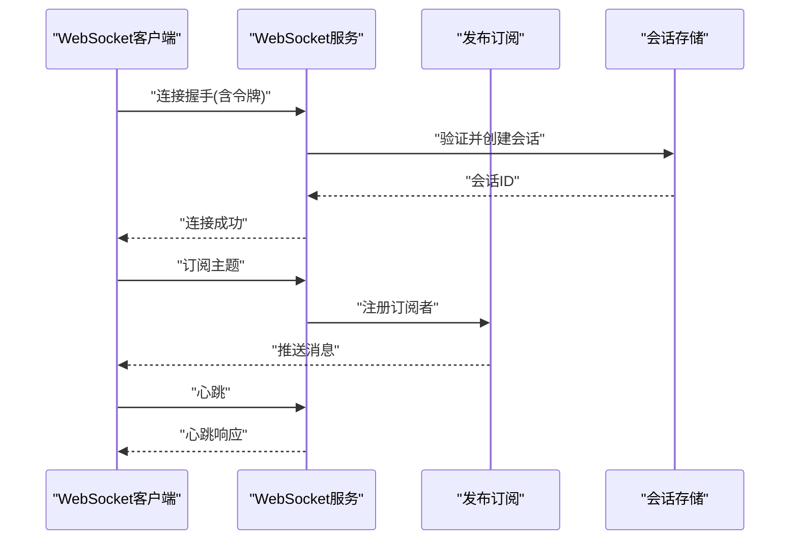

**图表来源**
- [legado-server/src/ws/mod.rs](file://rust/legado-server/src/ws/mod.rs)
- [legado-server/src/state.rs](file://rust/legado-server/src/state.rs)

章节来源
- [legado-server/src/ws/mod.rs](file://rust/legado-server/src/ws/mod.rs)

### FFI接口定义
- 函数签名：导出C兼容函数，参数为基本类型或指针，返回值包含错误码。
- 数据类型映射：Rust类型到Kotlin/Flutter的映射规则，字符串、数字、布尔与集合。
- 错误处理：统一错误枚举，转换为宿主语言异常或错误对象。
- 内存管理：避免悬垂指针，使用RAII与引用计数，确保释放时机正确。

**更新** 新增三个FFI方法：`crateFfiFfiSetCustomHosts`（设置自定义hosts映射）、`crateFfiFfiSetMcpPort`（设置MCP服务端口）、`crateFfiFfiSearchCoverRules`（搜索封面规则）。

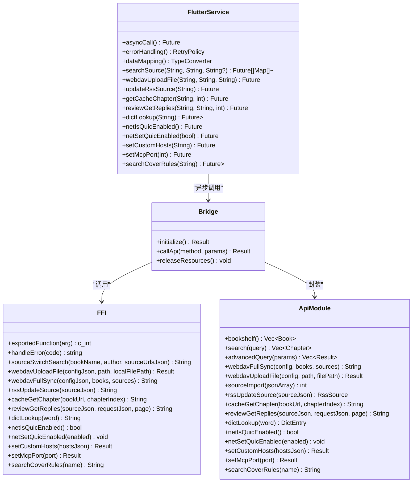

**图表来源**
- [legado-ffi/src/bridge.rs](file://rust/legado-ffi/src/bridge.rs)
- [legado-ffi/src/ffi.rs](file://rust/legado-ffi/src/ffi.rs)
- [legado-ffi/src/api/mod.rs](file://rust/legado-ffi/src/api/mod.rs)
- [legado-ffi/src/api/review_api.rs](file://rust/legado-ffi/src/api/review_api.rs)
- [legado-ffi/src/api/cache_api.rs](file://rust/legado-ffi/src/api/cache_api.rs)
- [legado-ffi/src/api/rss.rs](file://rust/legado-ffi/src/api/rss.rs)
- [legado-ffi/src/api/webdav_api.rs](file://rust/legado-ffi/src/api/webdav_api.rs)
- [flutter_legado/lib/src/services/rust_api.dart](file://flutter_legado/lib/src/services/rust_api.dart)
- [flutter_legado/lib/src/bridge/ffi/ffi.dart](file://flutter_legado/lib/src/bridge/ffi/ffi.dart)

章节来源
- [legado-ffi/src/bridge.rs](file://rust/legado-ffi/src/bridge.rs)
- [legado-ffi/src/ffi.rs](file://rust/legado-ffi/src/ffi.rs)
- [legado-ffi/src/api/mod.rs](file://rust/legado-ffi/src/api/mod.rs)
- [legado-ffi/src/db_state.rs](file://rust/legado-ffi/src/db_state.rs)
- [legado-ffi/src/runtime.rs](file://rust/legado-ffi/src/runtime.rs)

### Flutter服务层API
- Book API服务：提供完整的书籍管理功能，包括CRUD操作、搜索、分类、收藏等。
- Mock服务实现：为开发和测试提供模拟数据，支持断言与验证。
- Rust API封装：类型安全的Rust FFI调用封装，支持异步操作。
- 错误恢复：内置重试机制与降级策略，提高服务稳定性。
- WebDAV同步：完整的云同步功能，支持备份、恢复和大文件上传操作。

**更新** 新增三个服务方法：`setCustomHosts`（设置自定义hosts映射）、`setMcpPort`（设置MCP服务端口）、`searchCoverRules`（搜索封面规则）。

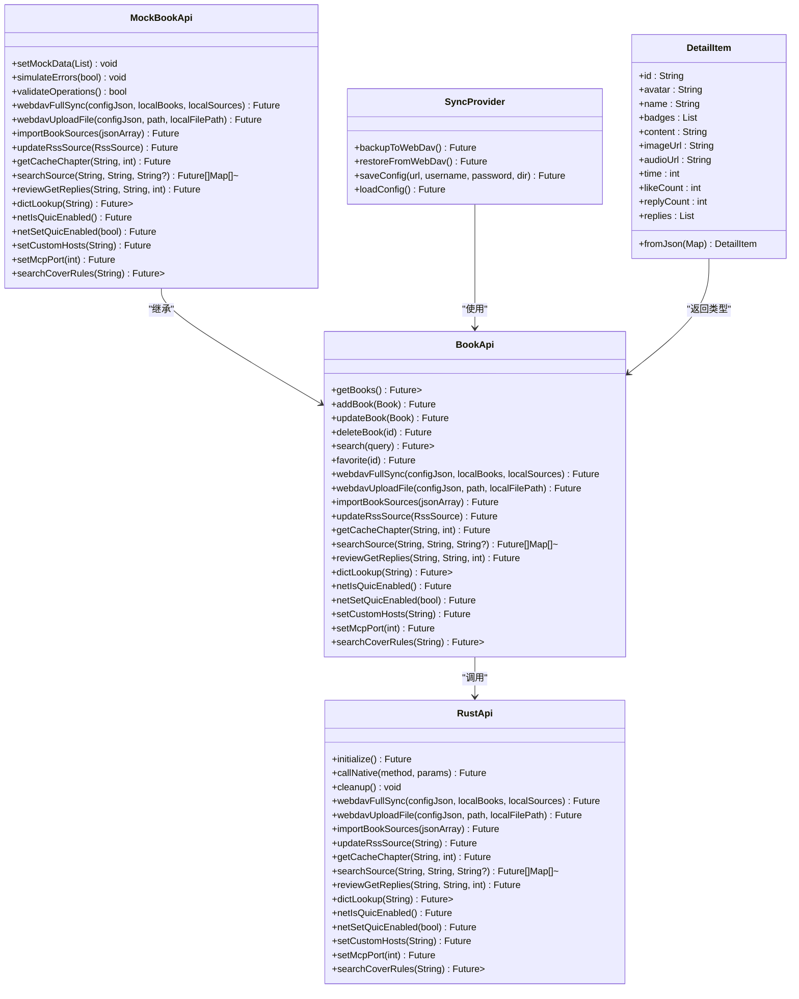

**图表来源**
- [flutter_legado/lib/src/services/book_api.dart](file://flutter_legado/lib/src/services/book_api.dart)
- [flutter_legado/lib/src/services/mock_book_api.dart](file://flutter_legado/lib/src/services/mock_book_api.dart)
- [flutter_legado/lib/src/services/rust_api.dart](file://flutter_legado/lib/src/services/rust_api.dart)
- [flutter_legado/lib/src/providers/sync_provider.dart](file://flutter_legado/lib/src/providers/sync_provider.dart)
- [flutter_legado/lib/src/models/misc.dart](file://flutter_legado/lib/src/models/misc.dart)

章节来源
- [flutter_legado/lib/src/services/book_api.dart](file://flutter_legado/lib/src/services/book_api.dart)
- [flutter_legado/lib/src/services/mock_book_api.dart](file://flutter_legado/lib/src/services/mock_book_api.dart)
- [flutter_legado/lib/src/services/rust_api.dart](file://flutter_legado/lib/src/services/rust_api.dart)
- [flutter_legado/lib/src/providers/sync_provider.dart](file://flutter_legado/lib/src/providers/sync_provider.dart)

### 搜索操作API（searchSource）
- 功能描述：搜索可替换的书源，支持按书名和作者查找匹配的源。
- 请求参数：
  - bookName：要搜索的书籍名称
  - author：书籍作者
  - sourceUrls：可选参数，指定要搜索的书源URL列表，null或空表示搜索全部启用源
- 响应格式：返回匹配的书源列表，每个元素包含source_url、source_name、book_url、score等字段
- 错误处理：网络异常、书源不可用时抛出BridgeError
- 使用场景：换源页面、批量书源切换、精确书源搜索

**更新** searchSource方法新增了sourceUrls可选参数，支持按指定书源URL进行精确过滤搜索，提升了搜索的灵活性和效率。当sourceUrls为空时，保持向后兼容，搜索全部启用的书源。

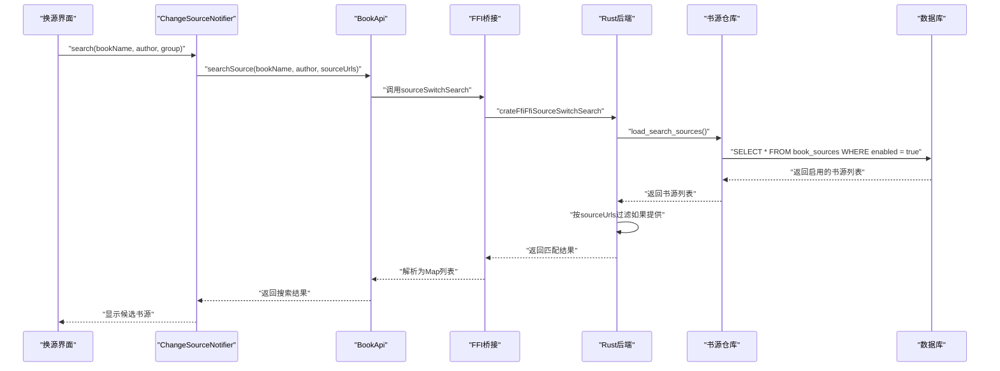

**图表来源**
- [flutter_legado/lib/src/providers/change_source/change_source_notifier.dart](file://flutter_legado/lib/src/providers/change_source/change_source_notifier.dart)
- [flutter_legado/lib/src/services/book_api.dart](file://flutter_legado/lib/src/services/book_api.dart)
- [flutter_legado/lib/src/services/rust_api.dart](file://flutter_legado/lib/src/services/rust_api.dart)
- [docs/API_CONTRACT.md](file://docs/API_CONTRACT.md)

章节来源
- [flutter_legado/lib/src/providers/change_source/change_source_notifier.dart](file://flutter_legado/lib/src/providers/change_source/change_source_notifier.dart)
- [flutter_legado/lib/src/services/book_api.dart](file://flutter_legado/lib/src/services/book_api.dart)
- [flutter_legado/lib/src/services/rust_api.dart](file://flutter_legado/lib/src/services/rust_api.dart)
- [docs/API_CONTRACT.md](file://docs/API_CONTRACT.md)

### 封面规则搜索API（searchCoverRules）
- 功能描述：按书名执行启用封面规则搜封面，支持JS规则语义对齐原版BookCover.searchCover链路。
- 请求参数：name - 书名（作为规则搜索关键词，对齐原版BookCover.searchCover传book.name语义）。
- 响应格式：返回候选封面URL裸JSON Array（遵守§1.4铁律），无启用规则/无候选返回空数组（非异常）。
- 错误处理：单规则失败隔离（记日志跳过，不阻断其余规则），coverRules规则数据读取失败报Internal错误。
- 使用场景：封面规则测试、自动封面搜索、主题配置封面预览。

**新增** searchCoverRules方法已完全实现，通过Rust后端提供封面规则的搜索功能，支持JS规则语义。

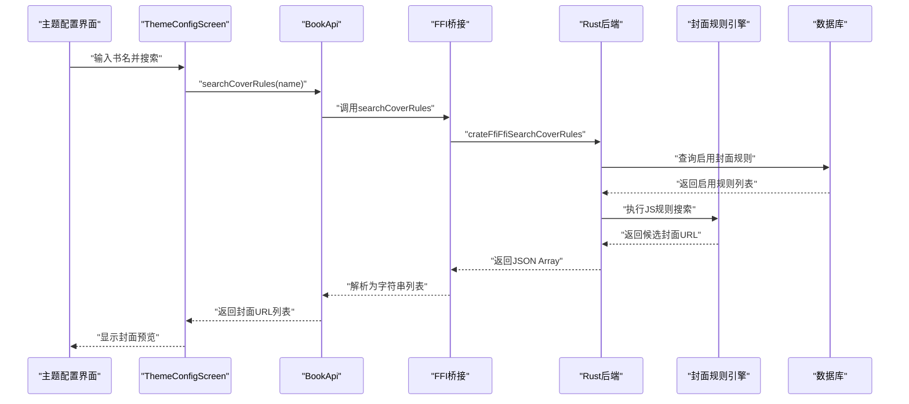

**图表来源**
- [flutter_legado/lib/src/screens/theme_config_screen.dart](file://flutter_legado/lib/src/screens/theme_config_screen.dart)
- [flutter_legado/lib/src/services/book_api.dart](file://flutter_legado/lib/src/services/book_api.dart)
- [flutter_legado/lib/src/bridge/ffi/ffi.dart](file://flutter_legado/lib/src/bridge/ffi/ffi.dart)
- [docs/API_CONTRACT.md](file://docs/API_CONTRACT.md)

章节来源
- [flutter_legado/lib/src/screens/theme_config_screen.dart](file://flutter_legado/lib/src/screens/theme_config_screen.dart)
- [flutter_legado/lib/src/services/book_api.dart](file://flutter_legado/lib/src/services/book_api.dart)
- [flutter_legado/lib/src/bridge/ffi/ffi.dart](file://flutter_legado/lib/src/bridge/ffi/ffi.dart)
- [docs/API_CONTRACT.md](file://docs/API_CONTRACT.md)

### RSS源原子更新API（updateRssSource）
- 功能描述：按sourceUrl主键执行单条UPDATE语句全字段原子更新，替代「删旧+加新」workaround，规避级联串表风险。
- 请求参数：sourceJson - RssSource对象的JSON字符串，必须包含sourceUrl字段作为主键。
- 响应格式：返回更新后的RssSource对象JSON，源不存在时抛出错误。
- 错误处理：源不存在时报错（不静默插入），数据库操作失败时返回具体错误信息。
- 使用场景：RSS源编辑保存、批量更新RSS源配置。

**新增** updateRssSource方法已完全实现，通过Rust后端提供RSS源的原子更新功能，确保数据一致性。

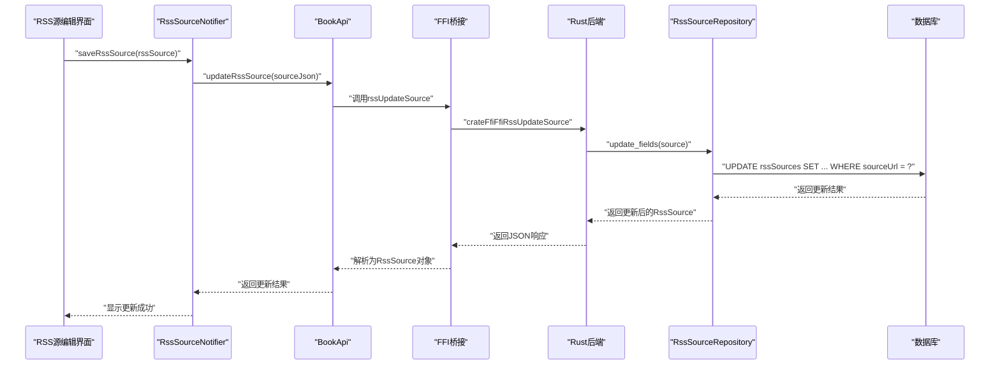

**图表来源**
- [flutter_legado/lib/src/services/book_api.dart](file://flutter_legado/lib/src/services/book_api.dart)
- [flutter_legado/lib/src/bridge/ffi/ffi.dart](file://flutter_legado/lib/src/bridge/ffi/ffi.dart)
- [docs/API_CONTRACT.md](file://docs/API_CONTRACT.md)

章节来源
- [flutter_legado/lib/src/services/book_api.dart](file://flutter_legado/lib/src/services/book_api.dart)
- [flutter_legado/lib/src/bridge/ffi/ffi.dart](file://flutter_legado/lib/src/bridge/ffi/ffi.dart)
- [docs/API_CONTRACT.md](file://docs/API_CONTRACT.md)
- [rust/legado-ffi/src/api/rss.rs](file://rust/legado-ffi/src/api/rss.rs)

### 缓存章节获取API（cacheGetChapter）
- 功能描述：获取指定书籍和章节索引的缓存内容，无缓存时返回空字符串。
- 请求参数：bookUrl - 书籍URL，chapterIndex - 章节索引（从0开始）。
- 响应格式：返回章节内容的字符串，无缓存时返回空字符串。
- 错误处理：数据库查询失败时抛出BridgeError，其他异常情况正常处理。
- 使用场景：离线阅读、缓存导出、章节内容预览。

**新增** cacheGetChapter方法已完全实现，通过Rust后端提供缓存章节的快速读取功能。

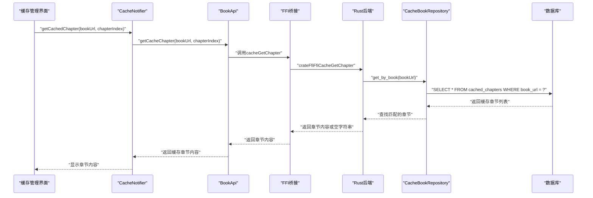

**图表来源**
- [flutter_legado/lib/src/services/book_api.dart](file://flutter_legado/lib/src/services/book_api.dart)
- [flutter_legado/lib/src/bridge/ffi/ffi.dart](file://flutter_legado/lib/src/bridge/ffi/ffi.dart)
- [docs/API_CONTRACT.md](file://docs/API_CONTRACT.md)

章节来源
- [flutter_legado/lib/src/services/book_api.dart](file://flutter_legado/lib/src/services/book_api.dart)
- [flutter_legado/lib/src/bridge/ffi/ffi.dart](file://flutter_legado/lib/src/bridge/ffi/ffi.dart)
- [docs/API_CONTRACT.md](file://docs/API_CONTRACT.md)
- [rust/legado-ffi/src/api/cache_api.rs](file://rust/legado-ffi/src/api/cache_api.rs)

### 段评回复查询API（reviewGetReplies）
- 功能描述：按需加载段评回复，支持分页和多种请求上下文参数。
- 请求参数：
  - sourceJson：BookSource JSON字符串，包含段评规则配置
  - requestJson：请求上下文JSON，支持reviewId/paraIndex/paraData/chapterUrl/replyUrl字段
  - page：回复页码（从1开始）
- 响应格式：返回JSON对象`{"items": [...], "nextPageUrl": String?}`，包含回复列表和下一页URL
- 错误处理：JS书源不支持、规则缺失、网络请求失败等情况的错误处理
- 使用场景：用于段评弹窗界面的回复加载功能

**新增** reviewGetReplies方法已完全实现，通过Rust后端提供段评回复的按需加载功能。

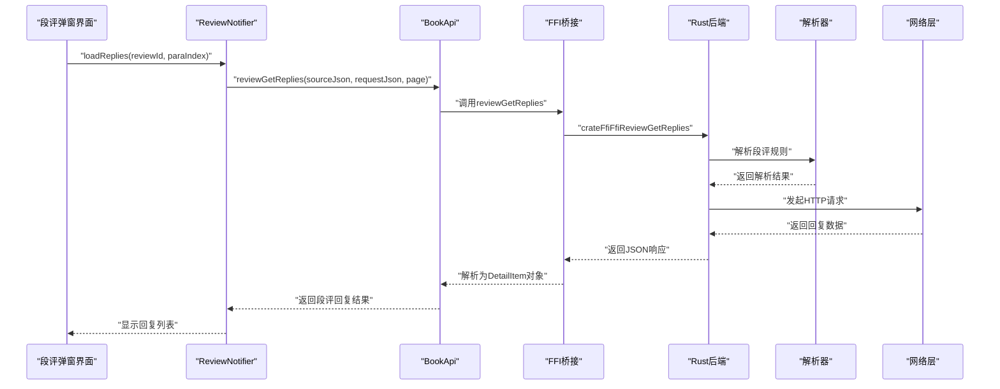

**图表来源**
- [flutter_legado/lib/src/services/book_api.dart](file://flutter_legado/lib/src/services/book_api.dart)
- [flutter_legado/lib/src/bridge/ffi/ffi.dart](file://flutter_legado/lib/src/bridge/ffi/ffi.dart)
- [docs/API_CONTRACT.md](file://docs/API_CONTRACT.md)

章节来源
- [flutter_legado/lib/src/services/book_api.dart](file://flutter_legado/lib/src/services/book_api.dart)
- [flutter_legado/lib/src/bridge/ffi/ffi.dart](file://flutter_legado/lib/src/bridge/ffi/ffi.dart)
- [docs/API_CONTRACT.md](file://docs/API_CONTRACT.md)
- [rust/legado-ffi/src/api/review_api.rs](file://rust/legado-ffi/src/api/review_api.rs)

### 词典查询API（dictLookup）
- 功能描述：查询单词的词典释义，返回结构化释义数据。
- 请求参数：word（要查询的单词）。
- 响应格式：返回JSON对象，包含word（归一化单词）、phonetic（音标）、definitions（释义列表）。
- 错误处理：未收录词返回空definitions列表，查询异常抛出BridgeError。
- 使用场景：用于dict_screen界面的真实词典查询功能。

**新增** dictLookup方法已完全实现，通过Rust后端提供本地内置词典查询功能。

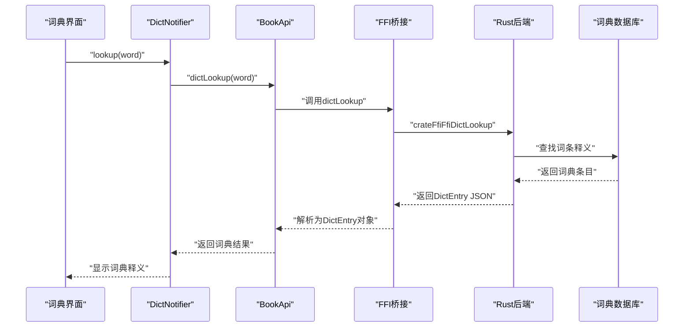

**图表来源**
- [flutter_legado/lib/src/models/misc.dart](file://flutter_legado/lib/src/models/misc.dart)
- [flutter_legado/lib/src/bridge/ffi/ffi.dart](file://flutter_legado/lib/src/bridge/ffi/ffi.dart)
- [docs/API_CONTRACT.md](file://docs/API_CONTRACT.md)

章节来源
- [flutter_legado/lib/src/models/misc.dart](file://flutter_legado/lib/src/models/misc.dart)
- [flutter_legado/lib/src/bridge/ffi/ffi.dart](file://flutter_legado/lib/src/bridge/ffi/ffi.dart)
- [docs/API_CONTRACT.md](file://docs/API_CONTRACT.md)

### 网络配置API（QUIC/HTTP3）
- 功能描述：查询和设置主网络链路的QUIC/HTTP3传输开关状态。
- 查询接口：netIsQuicEnabled() - 返回当前QUIC/HTTP3传输是否启用。
- 设置接口：netSetQuicEnabled(enabled) - 设置QUIC/HTTP3传输开关。
- 传输特性：启用后HTTPS请求优先走QUIC/HTTP3，失败自动fallback到HTTP/2。
- 使用场景：用于other_settings_screen界面的网络传输优化设置。

**新增** QUIC/HTTP3网络配置API已完全实现，支持实验性的现代网络传输协议。

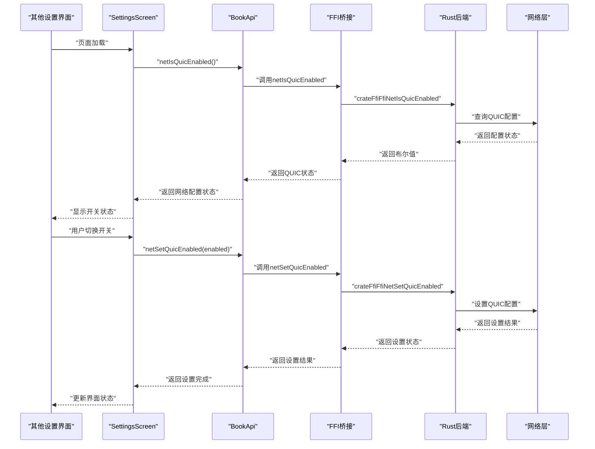

**图表来源**
- [flutter_legado/lib/src/services/book_api.dart](file://flutter_legado/lib/src/services/book_api.dart)
- [flutter_legado/lib/src/bridge/ffi/ffi.dart](file://flutter_legado/lib/src/bridge/ffi/ffi.dart)
- [flutter_legado/lib/src/services/rust_api.dart](file://flutter_legado/lib/src/services/rust_api.dart)

章节来源
- [flutter_legado/lib/src/services/book_api.dart](file://flutter_legado/lib/src/services/book_api.dart)
- [flutter_legado/lib/src/bridge/ffi/ffi.dart](file://flutter_legado/lib/src/bridge/ffi/ffi.dart)
- [flutter_legado/lib/src/services/rust_api.dart](file://flutter_legado/lib/src/services/rust_api.dart)

### 自定义hosts映射API（setCustomHosts）
- 功能描述：设置域名到IP的自定义映射，支持网络层DNS解析优先级覆盖。
- 请求参数：hostsJson - JSON对象字符串，格式为`{"域名":"IP", "域名":["IP1","IP2"]}`。
- 响应格式：无返回值，成功时返回空结果。
- 错误处理：非法JSON或非对象格式报Internal错误，空串/空对象清除映射恢复系统DNS。
- 使用场景：网络调试、域名重定向、内网服务访问、DNS劫持防护。

**新增** setCustomHosts方法已完全实现，支持动态域名到IP映射配置，提升网络灵活性。

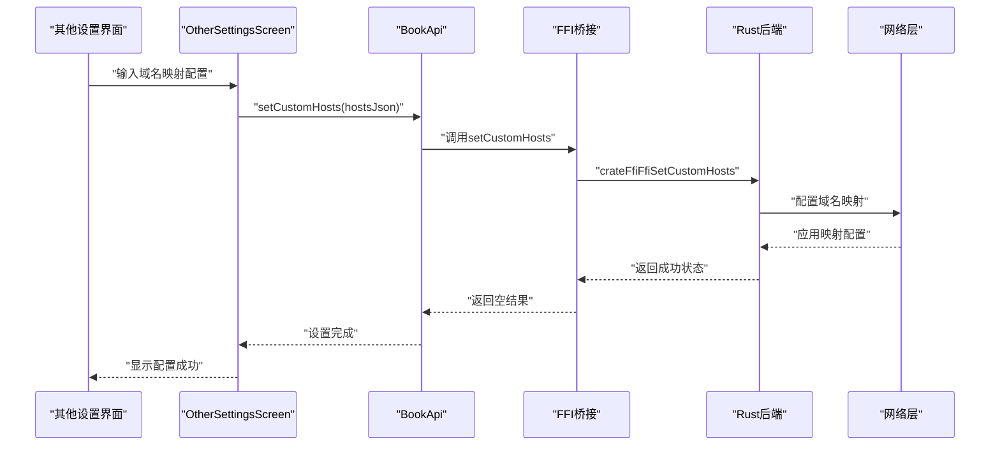

**图表来源**
- [flutter_legado/lib/src/screens/other_settings_screen.dart](file://flutter_legado/lib/src/screens/other_settings_screen.dart)
- [flutter_legado/lib/src/services/book_api.dart](file://flutter_legado/lib/src/services/book_api.dart)
- [flutter_legado/lib/src/bridge/ffi/ffi.dart](file://flutter_legado/lib/src/bridge/ffi/ffi.dart)
- [docs/API_CONTRACT.md](file://docs/API_CONTRACT.md)

章节来源
- [flutter_legado/lib/src/screens/other_settings_screen.dart](file://flutter_legado/lib/src/screens/other_settings_screen.dart)
- [flutter_legado/lib/src/services/book_api.dart](file://flutter_legado/lib/src/services/book_api.dart)
- [flutter_legado/lib/src/bridge/ffi/ffi.dart](file://flutter_legado/lib/src/bridge/ffi/ffi.dart)
- [docs/API_CONTRACT.md](file://docs/API_CONTRACT.md)

### 独立MCP服务端口API（setMcpPort）
- 功能描述：启动/停止独立MCP服务端口，与Web服务端口分离管理。
- 请求参数：port - 独立MCP服务端口（合法区间1024–65530，≤0=停止服务）。
- 响应格式：无返回值，成功时返回空结果。
- 错误处理：端口越界报Internal错误，端口被占用报Internal错误。
- 使用场景：MCP服务独立部署、端口隔离、安全管控。

**新增** setMcpPort方法已完全实现，支持独立MCP服务端口管理，与Web服务端口并存。

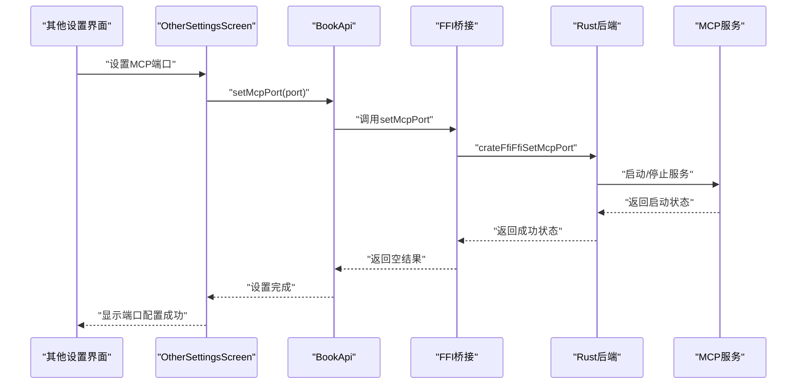

**图表来源**
- [flutter_legado/lib/src/screens/other_settings_screen.dart](file://flutter_legado/lib/src/screens/other_settings_screen.dart)
- [flutter_legado/lib/src/services/book_api.dart](file://flutter_legado/lib/src/services/book_api.dart)
- [flutter_legado/lib/src/bridge/ffi/ffi.dart](file://flutter_legado/lib/src/bridge/ffi/ffi.dart)
- [docs/API_CONTRACT.md](file://docs/API_CONTRACT.md)

章节来源
- [flutter_legado/lib/src/screens/other_settings_screen.dart](file://flutter_legado/lib/src/screens/other_settings_screen.dart)
- [flutter_legado/lib/src/services/book_api.dart](file://flutter_legado/lib/src/services/book_api.dart)
- [flutter_legado/lib/src/bridge/ffi/ffi.dart](file://flutter_legado/lib/src/bridge/ffi/ffi.dart)
- [docs/API_CONTRACT.md](file://docs/API_CONTRACT.md)

### WebDAV云同步接口
- 配置管理：支持WebDAV服务器地址、用户名、密码、远程目录和设备名的配置。
- 全量同步：通过webdavFullSync()方法进行本地数据与云端数据的完整同步。
- 文件上传：通过webdavUploadFile()方法支持大文件直接路径上传，优化内存使用。
- 书源导入：通过importBookSources()方法批量导入书源配置。
- 状态管理：跟踪同步状态、最后同步时间和错误信息。
- 自动同步：支持开启/关闭自动同步功能。
- 内存优化：统一8MB栈工作线程配置，避免栈溢出问题。

**更新** WebDAV云同步接口已完善，新增webdavUploadFile()方法支持大文件直接路径上传，优化了内存使用和线程配置，与Android原版保持对齐。

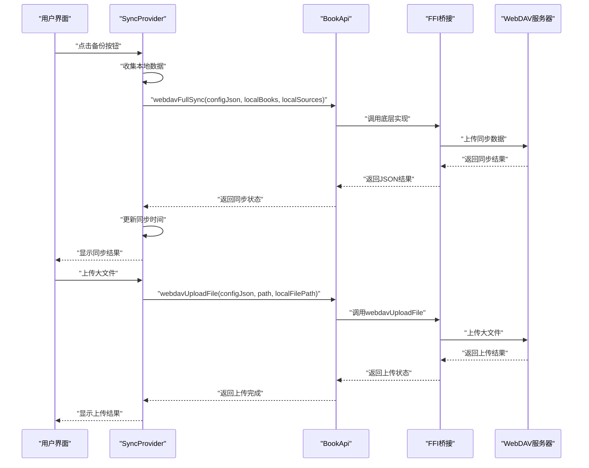

**图表来源**
- [flutter_legado/lib/src/providers/sync_provider.dart](file://flutter_legado/lib/src/providers/sync_provider.dart)
- [flutter_legado/lib/src/services/book_api.dart](file://flutter_legado/lib/src/services/book_api.dart)
- [flutter_legado/lib/src/services/rust_api.dart](file://flutter_legado/lib/src/services/rust_api.dart)
- [flutter_legado/lib/src/bridge/ffi/ffi.dart](file://flutter_legado/lib/src/bridge/ffi/ffi.dart)

章节来源
- [flutter_legado/lib/src/providers/sync_provider.dart](file://flutter_legado/lib/src/providers/sync_provider.dart)
- [flutter_legado/lib/src/services/book_api.dart](file://flutter_legado/lib/src/services/book_api.dart)
- [flutter_legado/lib/src/services/rust_api.dart](file://flutter_legado/lib/src/services/rust_api.dart)
- [flutter_legado/lib/src/bridge/ffi/ffi.dart](file://flutter_legado/lib/src/bridge/ffi/ffi.dart)

### 插件开发API
- 规则引擎接口：定义解析器、转换器与过滤器的扩展点。
- 回调函数：在特定生命周期触发，如初始化、请求前、响应后。
- 扩展点：允许动态加载脚本或模块，注入自定义逻辑。
- 生命周期管理：插件加载、启动、运行、卸载的完整流程。

章节来源
- [legado-js/src/engine.rs](file://rust/legado-js/src/engine.rs)
- [legado-js/src/sandbox.rs](file://rust/legado-js/src/sandbox.rs)
- [legado-js/src/context.rs](file://rust/legado-js/src/context.rs)

### 认证与授权机制
- JWT令牌：生成、验证与刷新，支持过期时间与范围限制。
- 权限控制：基于角色的访问控制（RBAC），细粒度资源权限。
- 访问限制：IP白名单、速率限制、请求频率控制。

章节来源
- [legado-server/src/routes.rs](file://rust/legado-server/src/routes.rs)
- [legado-server/src/state.rs](file://rust/legado-server/src/state.rs)

### API使用示例与最佳实践
- 请求示例：展示典型GET/POST请求的URL、头部与请求体。
- 响应示例：标准JSON结构与字段说明。
- 错误处理：捕获HTTP状态码与业务错误，重试与降级策略。
- 最佳实践：使用分页、缓存、压缩与异步请求。
- WebDAV同步示例：展示如何配置和使用云同步功能。
- WebDAV文件上传示例：展示如何使用webdavUploadFile方法进行大文件上传。
- 词典查询示例：展示如何使用dictLookup方法进行词典查询。
- 网络配置示例：展示如何查询和设置QUIC/HTTP3传输开关。
- 段评回复示例：展示如何使用reviewGetReplies方法进行段评回复查询。
- RSS源更新示例：展示如何使用updateRssSource方法进行RSS源原子更新。
- 缓存章节示例：展示如何使用cacheGetChapter方法获取缓存章节内容。
- searchSource示例：展示如何使用sourceUrls参数进行精确书源搜索。
- **新增** 自定义hosts映射示例：展示如何配置域名到IP的映射。
- **新增** 独立MCP端口示例：展示如何配置和管理独立MCP服务端口。
- **新增** 封面规则搜索示例：展示如何使用searchCoverRules方法进行封面搜索。

**更新** 新增了自定义hosts映射、独立MCP端口管理和封面规则搜索的使用示例，展示了网络配置优化的最佳实践。

章节来源
- [modules/web/src/api/axios.ts](file://modules/web/src/api/axios.ts)
- [modules/web/src/api/sourceToken.ts](file://modules/web/src/api/sourceToken.ts)
- [flutter_legado/lib/src/services/book_api.dart](file://flutter_legado/lib/src/services/book_api.dart)
- [flutter_legado/lib/src/providers/sync_provider.dart](file://flutter_legado/lib/src/providers/sync_provider.dart)
- [flutter_legado/lib/src/providers/change_source/change_source_notifier.dart](file://flutter_legado/lib/src/providers/change_source/change_source_notifier.dart)
- [flutter_legado/lib/src/screens/other_settings_screen.dart](file://flutter_legado/lib/src/screens/other_settings_screen.dart)
- [flutter_legado/lib/src/screens/theme_config_screen.dart](file://flutter_legado/lib/src/screens/theme_config_screen.dart)

## 依赖分析
组件间依赖关系清晰，低耦合高内聚：
- 服务器依赖路由与处理器，处理器依赖状态管理。
- FFI层依赖API模块与数据库状态，对外暴露稳定接口。
- Flutter服务层依赖FFI桥接，提供类型安全的API封装。
- 前端通过Axios与Token管理访问后端。
- SyncProvider依赖BookApi和SettingsService，管理WebDAV同步逻辑。

**更新** 新增网络配置管理和MCP服务管理的依赖关系，支持自定义hosts映射和独立MCP端口配置。

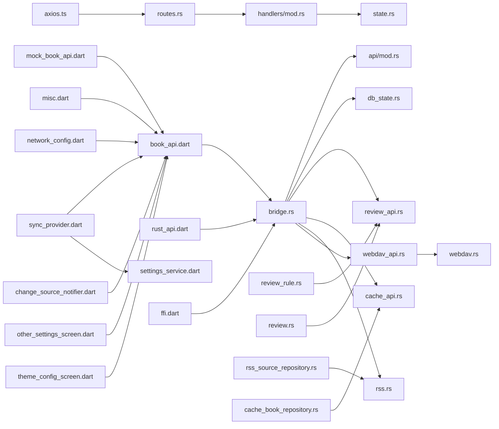

**图表来源**
- [legado-server/src/routes.rs](file://rust/legado-server/src/routes.rs)
- [legado-server/src/handlers/mod.rs](file://rust/legado-server/src/handlers/mod.rs)
- [legado-server/src/state.rs](file://rust/legado-server/src/state.rs)
- [legado-ffi/src/bridge.rs](file://rust/legado-ffi/src/bridge.rs)
- [legado-ffi/src/api/mod.rs](file://rust/legado-ffi/src/api/mod.rs)
- [legado-ffi/src/db_state.rs](file://rust/legado-ffi/src/db_state.rs)
- [legado-ffi/src/api/review_api.rs](file://rust/legado-ffi/src/api/review_api.rs)
- [legado-ffi/src/api/cache_api.rs](file://rust/legado-ffi/src/api/cache_api.rs)
- [legado-ffi/src/api/rss.rs](file://rust/legado-ffi/src/api/rss.rs)
- [legado-ffi/src/api/webdav_api.rs](file://rust/legado-ffi/src/api/webdav_api.rs)
- [legado-net/src/webdav.rs](file://rust/legado-net/src/webdav.rs)
- [flutter_legado/lib/src/services/book_api.dart](file://flutter_legado/lib/src/services/book_api.dart)
- [flutter_legado/lib/src/services/mock_book_api.dart](file://flutter_legado/lib/src/services/mock_book_api.dart)
- [flutter_legado/lib/src/services/rust_api.dart](file://flutter_legado/lib/src/services/rust_api.dart)
- [flutter_legado/lib/src/providers/sync_provider.dart](file://flutter_legado/lib/src/providers/sync_provider.dart)
- [flutter_legado/lib/src/bridge/ffi/ffi.dart](file://flutter_legado/lib/src/bridge/ffi/ffi.dart)
- [flutter_legado/lib/src/models/misc.dart](file://flutter_legado/lib/src/models/misc.dart)
- [modules/web/src/api/axios.ts](file://modules/web/src/api/axios.ts)
- [flutter_legado/lib/src/providers/change_source/change_source_notifier.dart](file://flutter_legado/lib/src/providers/change_source/change_source_notifier.dart)
- [flutter_legado/lib/src/screens/other_settings_screen.dart](file://flutter_legado/lib/src/screens/other_settings_screen.dart)
- [flutter_legado/lib/src/screens/theme_config_screen.dart](file://flutter_legado/lib/src/screens/theme_config_screen.dart)
- [rust/legado-core/src/models/rule/review_rule.rs](file://rust/legado-core/src/models/rule/review_rule.rs)
- [rust/legado-core/src/review.rs](file://rust/legado-core/src/review.rs)

章节来源
- [legado-server/src/routes.rs](file://rust/legado-server/src/routes.rs)
- [legado-ffi/src/bridge.rs](file://rust/legado-ffi/src/bridge.rs)
- [flutter_legado/lib/src/services/book_api.dart](file://flutter_legado/lib/src/services/book_api.dart)
- [flutter_legado/lib/src/providers/sync_provider.dart](file://flutter_legado/lib/src/providers/sync_provider.dart)
- [modules/web/src/api/axios.ts](file://modules/web/src/api/axios.ts)

## 性能考虑
- 连接池：复用数据库与HTTP连接，减少开销。
- 缓存策略：热点数据缓存，TTL与失效机制。
- 异步处理：非阻塞I/O与协程，提升吞吐。
- 序列化优化：使用高效编解码库，减少CPU占用。
- Flutter优化：批量操作与懒加载，减少内存占用。
- WebDAV优化：增量同步和网络重试机制。
- 词典查询优化：本地缓存和索引优化。
- QUIC/HTTP3优化：现代网络传输协议，提升网络性能。
- 段评回复优化：按需加载和分页机制，减少数据传输量。
- RSS源更新优化：原子更新操作，避免级联删除带来的性能问题。
- 缓存章节优化：直接数据库查询，避免重复网络请求。
- searchSource优化：sourceUrls参数过滤减少了不必要的书源搜索，提升了搜索效率。
- WebDAV文件上传优化：使用put_owned方法避免二次拷贝，统一8MB栈工作线程配置，优化大文件上传性能。
- **新增** 自定义hosts映射优化：DNS解析缓存和即时生效机制，减少网络延迟。
- **新增** MCP服务端口优化：独立端口管理，避免与Web服务端口冲突。
- **新增** 封面规则搜索优化：JS规则缓存和并行执行，提升搜索性能。

**更新** 新增了自定义hosts映射、独立MCP端口管理和封面规则搜索的性能优化建议，通过DNS缓存、端口隔离和规则并行执行，显著提升了相关功能的性能和稳定性。

## 故障排查指南
- 日志收集：启用详细日志，记录请求与错误堆栈。
- 健康检查：提供健康端点，监控服务状态。
- 错误分类：区分客户端错误与服务端错误，定位根因。
- 调试工具：使用WebSocket调试面板与API测试工具。
- Flutter调试：使用DevTools和日志输出，追踪跨语言调用问题。
- WebDAV调试：检查网络连接、认证信息和文件权限。
- 词典查询调试：检查词典数据库和词条完整性。
- 网络配置调试：检查QUIC/HTTP3协议支持和网络环境兼容性。
- 段评回复调试：检查段评规则配置和网络请求状态。
- RSS源更新调试：检查RSS源JSON格式和数据库连接状态。
- 缓存章节调试：检查缓存数据和章节索引的正确性。
- searchSource调试：检查sourceUrls参数格式和书源URL的有效性。
- WebDAV文件上传调试：检查本地文件路径、WebDAV配置和网络连接状态。
- **新增** 自定义hosts映射调试：检查JSON格式、域名映射配置和DNS解析状态。
- **新增** MCP端口调试：检查端口占用情况、服务启动状态和防火墙配置。
- **新增** 封面规则搜索调试：检查规则启用状态、JS规则语法和网络请求响应。

**更新** 新增了自定义hosts映射、独立MCP端口管理和封面规则搜索的故障排查指南，帮助开发者解决相关功能可能遇到的问题。

章节来源
- [legado-server/src/error.rs](file://rust/legado-server/src/error.rs)
- [legado-server/src/server.rs](file://rust/legado-server/src/server.rs)
- [flutter_legado/lib/src/providers/sync_provider.dart](file://flutter_legado/lib/src/providers/sync_provider.dart)

## 结论
本API参考文档系统化了Legado项目的接口规范，覆盖REST、WebSocket、FFI与插件扩展，提供清晰的架构视图与实用指南。新增的Flutter服务层、WebDAV云同步功能、词典查询、QUIC/HTTP3网络配置、段评回复查询、RSS源原子更新、缓存章节获取、searchSource方法的sourceUrls过滤功能、自定义hosts映射、独立MCP端口管理和封面规则搜索功能为跨平台开发提供了更加便捷和类型安全的API访问方式。建议开发者遵循统一规范，注重安全与性能，持续迭代与兼容性管理。

**更新** 文档现在包含了完整的第四批后置项FFI方法，包括自定义hosts映射、独立MCP端口管理和封面规则搜索功能，为网络配置优化和MCP服务管理提供了更高效的功能支持。

## 附录
- 版本管理：语义化版本控制，变更日志与迁移指南。
- 向后兼容：废弃接口标记，渐进式升级策略。
- 安全加固：输入校验、输出编码、HTTPS强制。
- Flutter集成：详细的Flutter服务层集成指南与最佳实践。
- WebDAV配置：详细的WebDAV服务器配置指南和故障排除。
- WebDAV文件上传配置：详细的WebDAV文件上传配置和大文件处理指南。
- 词典查询配置：详细的词典数据库配置和维护指南。
- 网络配置配置：详细的QUIC/HTTP3网络传输配置和优化指南。
- 段评回复配置：详细的段评规则配置和回复加载指南。
- RSS源更新配置：详细的RSS源原子更新配置和数据一致性保障。
- 缓存章节配置：详细的缓存章节管理和缓存策略配置。
- searchSource配置：详细的searchSource方法sourceUrls参数配置和使用指南。
- **新增** 自定义hosts映射配置：详细的域名到IP映射配置和网络层DNS覆盖指南。
- **新增** 独立MCP端口配置：详细的MCP服务端口配置和服务管理指南。
- **新增** 封面规则搜索配置：详细的封面规则配置和JS规则编写指南。

**更新** 新增了自定义hosts映射、独立MCP端口管理和封面规则搜索的详细配置说明，帮助开发者更好地使用这些新功能。