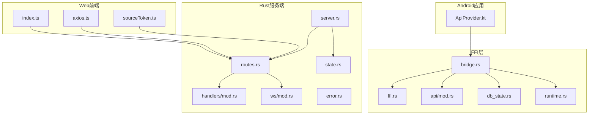
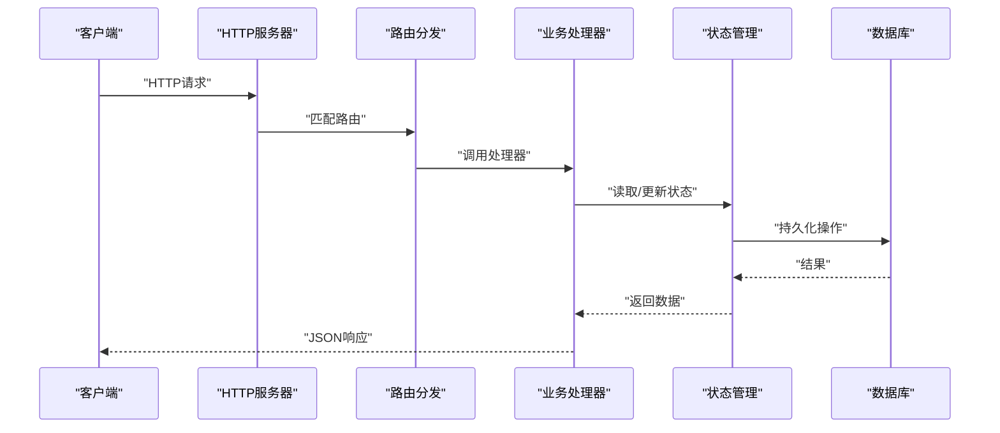
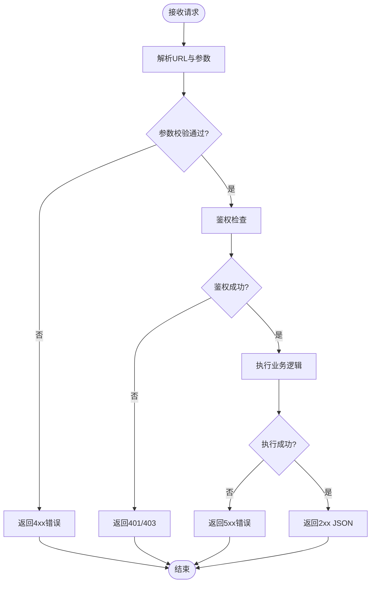
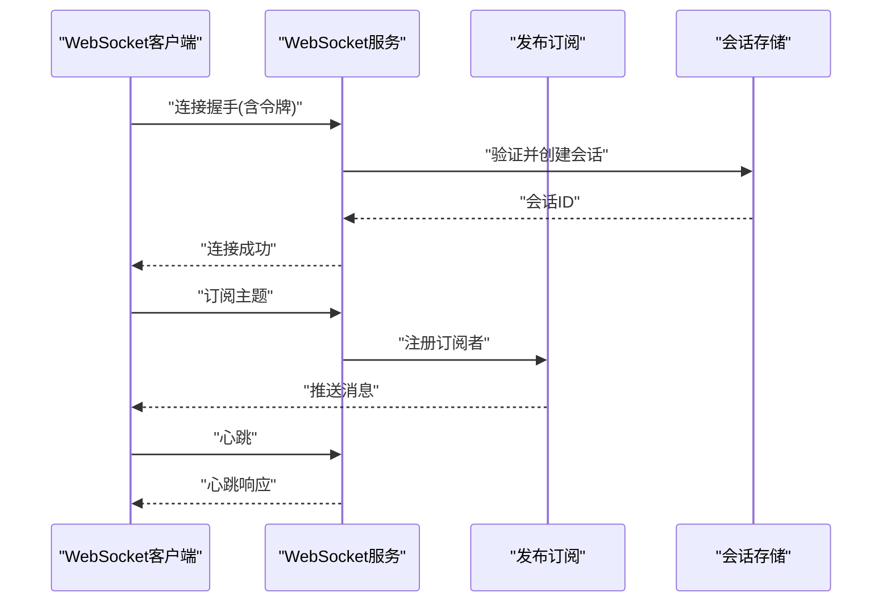
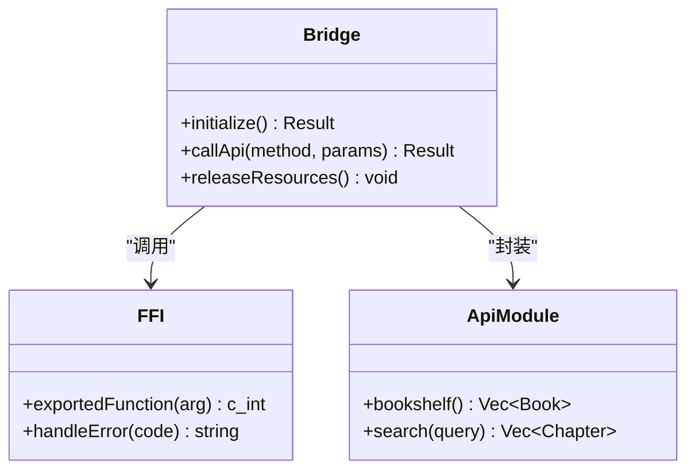
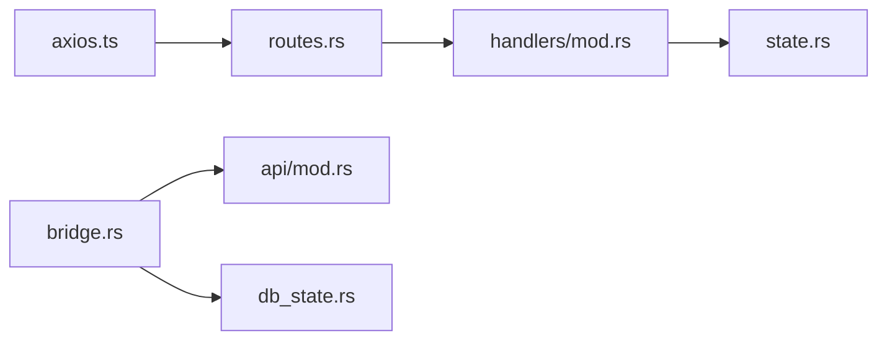

# API参考

<cite>
**本文引用的文件**   
- [legado-server/src/lib.rs](file://rust/legado-server/src/lib.rs)
- [legado-server/src/routes.rs](file://rust/legado-server/src/routes.rs)
- [legado-server/src/server.rs](file://rust/legado-server/src/server.rs)
- [legado-server/src/state.rs](file://rust/legado-server/src/state.rs)
- [legado-server/src/error.rs](file://rust/legado-server/src/error.rs)
- [legado-server/src/handlers/mod.rs](file://rust/legado-server/src/handlers/mod.rs)
- [legado-server/src/ws/mod.rs](file://rust/legado-server/src/ws/mod.rs)
- [legado-ffi/src/bridge.rs](file://rust/legado-ffi/src/bridge.rs)
- [legado-ffi/src/ffi.rs](file://rust/legado-ffi/src/ffi.rs)
- [legado-ffi/src/api/mod.rs](file://rust/legado-ffi/src/api/mod.rs)
- [legado-ffi/src/db_state.rs](file://rust/legado-ffi/src/db_state.rs)
- [legado-ffi/src/runtime.rs](file://rust/legado-ffi/src/runtime.rs)
- [app/src/main/java/io/legado/app/api/ApiProvider.kt](file://app/src/main/java/io/legado/app/api/ApiProvider.kt)
- [modules/web/src/api/index.ts](file://modules/web/src/api/index.ts)
- [modules/web/src/api/axios.ts](file://modules/web/src/api/axios.ts)
- [modules/web/src/api/sourceToken.ts](file://modules/web/src/api/sourceToken.ts)
</cite>

## 目录
1. [简介](#简介)
2. [项目结构](#项目结构)
3. [核心组件](#核心组件)
4. [架构总览](#架构总览)
5. [详细组件分析](#详细组件分析)
6. [依赖分析](#依赖分析)
7. [性能考虑](#性能考虑)
8. [故障排查指南](#故障排查指南)
9. [结论](#结论)
10. [附录](#附录)

## 简介
本API参考文档面向Legado项目的RESTful接口、WebSocket实时通信、FFI跨语言接口以及插件扩展机制，提供统一的接口规范说明。内容涵盖HTTP方法、URL模式、请求参数、响应格式、错误码；WebSocket连接建立、消息格式与事件类型；FFI函数签名、数据类型映射、错误处理与内存管理；插件开发中的规则引擎接口、回调函数、扩展点与生命周期；认证授权（JWT令牌、权限控制、访问限制）；并提供使用示例与最佳实践。同时包含版本管理与向后兼容性说明，帮助开发者快速集成与扩展。

## 项目结构
本项目采用多模块架构：
- Rust服务端（legado-server）：提供HTTP路由、处理器、WebSocket服务、状态管理与错误处理。
- FFI层（legado-ffi）：暴露给Kotlin/Flutter等宿主语言的跨语言接口，封装数据库状态、运行时上下文与各业务API。
- Android应用（app）：通过Kotlin调用FFI或本地网络库，提供UI与业务逻辑。
- Web前端（modules/web）：通过TypeScript与Axios访问后端API，实现源码编辑与调试工具。

图表来源
- [legado-server/src/server.rs](file://rust/legado-server/src/server.rs)
- [legado-server/src/routes.rs](file://rust/legado-server/src/routes.rs)
- [legado-server/src/handlers/mod.rs](file://rust/legado-server/src/handlers/mod.rs)
- [legado-server/src/ws/mod.rs](file://rust/legado-server/src/ws/mod.rs)
- [legado-server/src/state.rs](file://rust/legado-server/src/state.rs)
- [legado-server/src/error.rs](file://rust/legado-server/src/error.rs)
- [legado-ffi/src/bridge.rs](file://rust/legado-ffi/src/bridge.rs)
- [legado-ffi/src/ffi.rs](file://rust/legado-ffi/src/ffi.rs)
- [legado-ffi/src/api/mod.rs](file://rust/legado-ffi/src/api/mod.rs)
- [legado-ffi/src/db_state.rs](file://rust/legado-ffi/src/db_state.rs)
- [legado-ffi/src/runtime.rs](file://rust/legado-ffi/src/runtime.rs)
- [app/src/main/java/io/legado/app/api/ApiProvider.kt](file://app/src/main/java/io/legado/app/api/ApiProvider.kt)
- [modules/web/src/api/index.ts](file://modules/web/src/api/index.ts)
- [modules/web/src/api/axios.ts](file://modules/web/src/api/axios.ts)
- [modules/web/src/api/sourceToken.ts](file://modules/web/src/api/sourceToken.ts)

章节来源
- [legado-server/src/lib.rs](file://rust/legado-server/src/lib.rs)
- [legado-server/src/server.rs](file://rust/legado-server/src/server.rs)
- [legado-server/src/routes.rs](file://rust/legado-server/src/routes.rs)
- [legado-ffi/src/bridge.rs](file://rust/legado-ffi/src/bridge.rs)
- [app/src/main/java/io/legado/app/api/ApiProvider.kt](file://app/src/main/java/io/legado/app/api/ApiProvider.kt)
- [modules/web/src/api/index.ts](file://modules/web/src/api/index.ts)

## 核心组件
- HTTP服务器与路由：负责监听端口、注册路由、分发请求到处理器。
- WebSocket服务：维护长连接、广播消息、订阅主题。
- FFI桥接：将Rust侧能力暴露给Kotlin/Flutter，统一错误与内存管理。
- 状态管理：集中管理数据库连接、配置、会话与缓存。
- 错误处理：定义统一错误码与响应格式，便于客户端解析。

章节来源
- [legado-server/src/server.rs](file://rust/legado-server/src/server.rs)
- [legado-server/src/routes.rs](file://rust/legado-server/src/routes.rs)
- [legado-server/src/ws/mod.rs](file://rust/legado-server/src/ws/mod.rs)
- [legado-ffi/src/bridge.rs](file://rust/legado-ffi/src/bridge.rs)
- [legado-server/src/state.rs](file://rust/legado-server/src/state.rs)
- [legado-server/src/error.rs](file://rust/legado-server/src/error.rs)

## 架构总览
整体架构分为三层：
- 接入层：HTTP与WebSocket入口，统一鉴权与限流。
- 业务层：处理器与领域逻辑，读写数据、执行规则、调度任务。
- 数据层：数据库与缓存，持久化与查询优化。

图表来源
- [legado-server/src/server.rs](file://rust/legado-server/src/server.rs)
- [legado-server/src/routes.rs](file://rust/legado-server/src/routes.rs)
- [legado-server/src/state.rs](file://rust/legado-server/src/state.rs)

章节来源
- [legado-server/src/lib.rs](file://rust/legado-server/src/lib.rs)
- [legado-server/src/server.rs](file://rust/legado-server/src/server.rs)

## 详细组件分析

### RESTful API接口规范
- URL模式：遵循资源导向设计，如/books、/chapters、/sources等，支持分页与过滤参数。
- HTTP方法：GET用于查询，POST用于创建，PUT/PATCH用于更新，DELETE用于删除。
- 请求参数：路径参数、查询参数、请求体（JSON），需进行校验与默认值处理。
- 响应格式：统一JSON结构，包含数据、分页信息与时间戳。
- 错误码：标准HTTP状态码与业务错误码组合，错误信息包含代码、消息与详情。

章节来源
- [legado-server/src/routes.rs](file://rust/legado-server/src/routes.rs)
- [legado-server/src/handlers/mod.rs](file://rust/legado-server/src/handlers/mod.rs)
- [legado-server/src/error.rs](file://rust/legado-server/src/error.rs)

### WebSocket接口设计
- 连接建立：客户端发起WS连接，服务端验证令牌并建立会话。
- 消息格式：JSON编码，包含类型、载荷、时间戳与序列号。
- 事件类型：订阅/取消订阅、广播消息、心跳检测。
- 实时通信协议：基于主题的消息路由，支持多客户端并发。

图表来源
- [legado-server/src/ws/mod.rs](file://rust/legado-server/src/ws/mod.rs)
- [legado-server/src/state.rs](file://rust/legado-server/src/state.rs)

章节来源
- [legado-server/src/ws/mod.rs](file://rust/legado-server/src/ws/mod.rs)

### FFI接口定义
- 函数签名：导出C兼容函数，参数为基本类型或指针，返回值包含错误码。
- 数据类型映射：Rust类型到Kotlin/Flutter的映射规则，字符串、数字、布尔与集合。
- 错误处理：统一错误枚举，转换为宿主语言异常或错误对象。
- 内存管理：避免悬垂指针，使用RAII与引用计数，确保释放时机正确。

图表来源
- [legado-ffi/src/bridge.rs](file://rust/legado-ffi/src/bridge.rs)
- [legado-ffi/src/ffi.rs](file://rust/legado-ffi/src/ffi.rs)
- [legado-ffi/src/api/mod.rs](file://rust/legado-ffi/src/api/mod.rs)

章节来源
- [legado-ffi/src/bridge.rs](file://rust/legado-ffi/src/bridge.rs)
- [legado-ffi/src/ffi.rs](file://rust/legado-ffi/src/ffi.rs)
- [legado-ffi/src/api/mod.rs](file://rust/legado-ffi/src/api/mod.rs)
- [legado-ffi/src/db_state.rs](file://rust/legado-ffi/src/db_state.rs)
- [legado-ffi/src/runtime.rs](file://rust/legado-ffi/src/runtime.rs)

### 插件开发API
- 规则引擎接口：定义解析器、转换器与过滤器的扩展点。
- 回调函数：在特定生命周期触发，如初始化、请求前、响应后。
- 扩展点：允许动态加载脚本或模块，注入自定义逻辑。
- 生命周期管理：插件加载、启动、运行、卸载的完整流程。

章节来源
- [legado-js/src/engine.rs](file://rust/legado-js/src/engine.rs)
- [legado-js/src/sandbox.rs](file://rust/legado-js/src/sandbox.rs)
- [legado-js/src/context.rs](file://rust/legado-js/src/context.rs)

### 认证与授权机制
- JWT令牌：生成、验证与刷新，支持过期时间与范围限制。
- 权限控制：基于角色的访问控制（RBAC），细粒度资源权限。
- 访问限制：IP白名单、速率限制、请求频率控制。

章节来源
- [legado-server/src/routes.rs](file://rust/legado-server/src/routes.rs)
- [legado-server/src/state.rs](file://rust/legado-server/src/state.rs)

### API使用示例与最佳实践
- 请求示例：展示典型GET/POST请求的URL、头部与请求体。
- 响应示例：标准JSON结构与字段说明。
- 错误处理：捕获HTTP状态码与业务错误，重试与降级策略。
- 最佳实践：使用分页、缓存、压缩与异步请求。

章节来源
- [modules/web/src/api/axios.ts](file://modules/web/src/api/axios.ts)
- [modules/web/src/api/sourceToken.ts](file://modules/web/src/api/sourceToken.ts)

## 依赖分析
组件间依赖关系清晰，低耦合高内聚：
- 服务器依赖路由与处理器，处理器依赖状态管理。
- FFI层依赖API模块与数据库状态，对外暴露稳定接口。
- 前端通过Axios与Token管理访问后端。

图表来源
- [legado-server/src/routes.rs](file://rust/legado-server/src/routes.rs)
- [legado-server/src/handlers/mod.rs](file://rust/legado-server/src/handlers/mod.rs)
- [legado-server/src/state.rs](file://rust/legado-server/src/state.rs)
- [legado-ffi/src/bridge.rs](file://rust/legado-ffi/src/bridge.rs)
- [legado-ffi/src/api/mod.rs](file://rust/legado-ffi/src/api/mod.rs)
- [legado-ffi/src/db_state.rs](file://rust/legado-ffi/src/db_state.rs)
- [modules/web/src/api/axios.ts](file://modules/web/src/api/axios.ts)

章节来源
- [legado-server/src/routes.rs](file://rust/legado-server/src/routes.rs)
- [legado-ffi/src/bridge.rs](file://rust/legado-ffi/src/bridge.rs)
- [modules/web/src/api/axios.ts](file://modules/web/src/api/axios.ts)

## 性能考虑
- 连接池：复用数据库与HTTP连接，减少开销。
- 缓存策略：热点数据缓存，TTL与失效机制。
- 异步处理：非阻塞I/O与协程，提升吞吐。
- 序列化优化：使用高效编解码库，减少CPU占用。

[本节为通用指导，无需具体文件引用]

## 故障排查指南
- 日志收集：启用详细日志，记录请求与错误堆栈。
- 健康检查：提供健康端点，监控服务状态。
- 错误分类：区分客户端错误与服务端错误，定位根因。
- 调试工具：使用WebSocket调试面板与API测试工具。

章节来源
- [legado-server/src/error.rs](file://rust/legado-server/src/error.rs)
- [legado-server/src/server.rs](file://rust/legado-server/src/server.rs)

## 结论
本API参考文档系统化了Legado项目的接口规范，覆盖REST、WebSocket、FFI与插件扩展，提供清晰的架构视图与实用指南。建议开发者遵循统一规范，注重安全与性能，持续迭代与兼容性管理。

[本节为总结性内容，无需具体文件引用]

## 附录
- 版本管理：语义化版本控制，变更日志与迁移指南。
- 向后兼容：废弃接口标记，渐进式升级策略。
- 安全加固：输入校验、输出编码、HTTPS强制。

[本节为补充信息，无需具体文件引用]