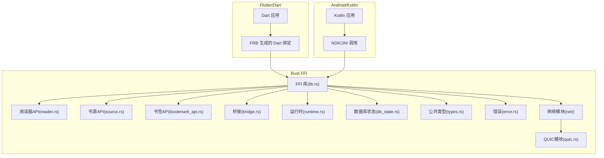
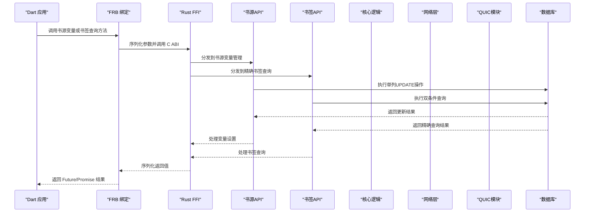
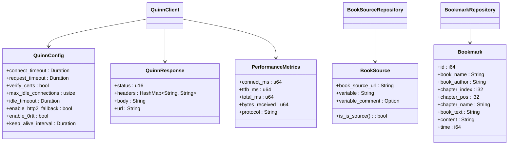
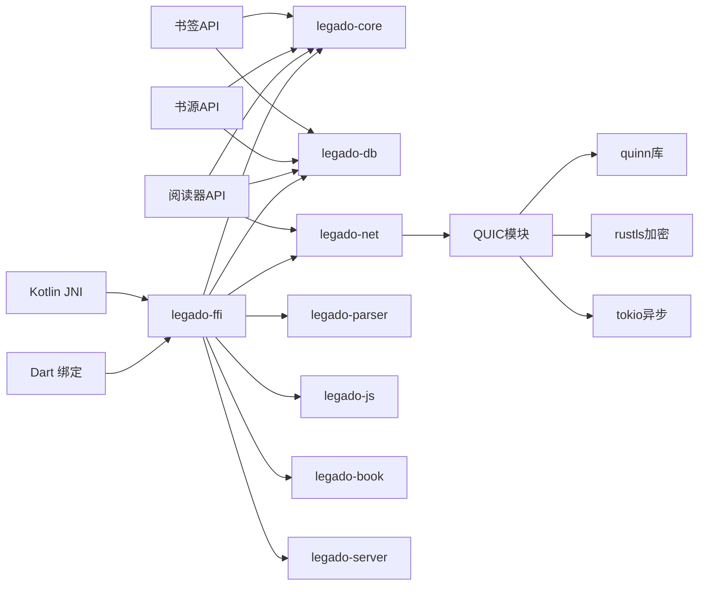

# FFI跨语言接口

<cite>
**本文引用的文件**   
- [rust/legado-ffi/src/lib.rs](file://rust/legado-ffi/src/lib.rs)
- [rust/legado-ffi/Cargo.toml](file://rust/legado-ffi/Cargo.toml)
- [rust/legado-net/src/quic.rs](file://rust/legado-net/src/quic.rs)
- [flutter_legado/flutter_rust_bridge.yaml](file://flutter_legado/flutter_rust_bridge.yaml)
- [app/build.gradle](file://app/build.gradle)
- [gradle.properties](file://gradle.properties)
- [rust/legado-ffi/src/api/reader.rs](file://rust/legado-ffi/src/api/reader.rs)
- [rust/legado-core/src/models/book_source.rs](file://rust/legado-core/src/models/book_source.rs)
- [rust/legado-db/src/repository/book_repository.rs](file://rust/legado-db/src/repository/book_repository.rs)
- [rust/legado-core/src/models/book.rs](file://rust/legado-core/src/models/book.rs)
- [rust/legado-ffi/src/api/source.rs](file://rust/legado-ffi/src/api/source.rs)
- [rust/legado-ffi/src/api/bookmark_api.rs](file://rust/legado-ffi/src/api/bookmark_api.rs)
- [rust/legado-ffi/src/ffi.rs](file://rust/legado-ffi/src/ffi.rs)
- [rust/legado-db/src/repository/book_source_repository.rs](file://rust/legado-db/src/repository/book_source_repository.rs)
- [rust/legado-db/src/repository/bookmark_repository.rs](file://rust/legado-db/src/repository/bookmark_repository.rs)
- [flutter_legado/lib/src/bridge/ffi/ffi.dart](file://flutter_legado/lib/src/bridge/ffi/ffi.dart)
</cite>

## 更新摘要
**变更内容**   
- 新增`setSourceVariable`方法用于书源自定义变量管理，支持单列UPDATE语义的精确更新
- 新增`getBookmarksByBook`方法用于按书名和作者精确查询书签，避免同名书籍混入
- 增强了FFI接口的数据一致性和查询精度，提供更好的用户体验
- 完善了书源变量管理和书签查询的功能完整性

## 目录
1. [简介](#简介)
2. [项目结构](#项目结构)
3. [核心组件](#核心组件)
4. [架构总览](#架构总览)
5. [详细组件分析](#详细组件分析)
6. [QUIC协议支持详解](#quic协议支持详解)
7. [书籍来源处理增强](#书籍来源处理增强)
8. [书源变量管理](#书源变量管理)
9. [书签查询优化](#书签查询优化)
10. [依赖关系分析](#依赖关系分析)
11. [性能考量](#性能考量)
12. [故障排查指南](#故障排查指南)
13. [结论](#结论)
14. [附录](#附录)

## 简介
本文件面向使用 Rust 与 Android/Kotlin、Flutter/Dart 进行跨语言集成的开发者，系统性说明 Legado 项目中 FFI（外部函数接口）的调用方式、数据类型映射、内存管理、异步模式、错误传播以及各平台集成最佳实践。文档以代码仓库中的 FFI 实现为依据，提供可追溯的文件来源与图示，帮助读者快速理解并安全地扩展接口。

**最新更新**：新增了QUIC协议支持模块，提供高性能网络传输能力，包括QUIC客户端创建、HTTP请求发送、性能测试和连接管理等8个核心函数，显著提升了网络传输效率和连接复用能力。同时增强了阅读器API的书籍来源处理功能，修复了搜索后直接阅读时的书源识别问题。**最新增强**：新增了书源变量管理功能和精确书签查询功能，进一步提升了FFI接口的完整性和数据一致性。

## 项目结构
Legado 将 FFI 相关能力集中在 Rust 侧的 legado-ffi crate 中，并通过 flutter_rust_bridge（FRB）为 Flutter/Dart 生成桥接代码；Android/Kotlin 侧通过 Gradle 构建 Rust 原生库并在应用层调用。关键目录与职责：
- Rust FFI 入口与导出：位于 rust/legado-ffi/src 下，包含桥接、运行时、数据库状态、错误类型等。
- 阅读器API：位于 rust/legado-ffi/src/api/reader.rs，提供章节列表获取与正文读取能力。
- 书源管理API：位于 rust/legado-ffi/src/api/source.rs，提供书源的增删改查和变量管理功能。
- 书签管理API：位于 rust/legado-ffi/src/api/bookmark_api.rs，提供书签的CRUD操作和精确查询。
- QUIC协议支持：位于 rust/legado-net/src/quic.rs，提供基于quinn的QUIC客户端实现。
- Flutter 桥接配置：位于 flutter_legado/flutter_rust_bridge.yaml，定义 FRB 的生成规则与目标语言。
- Android 构建：位于 app/build.gradle 与 gradle.properties，负责编译 Rust 到 .so 并打包进 APK。



**图表来源** 
- [rust/legado-ffi/src/lib.rs](file://rust/legado-ffi/src/lib.rs)
- [rust/legado-ffi/src/api/reader.rs](file://rust/legado-ffi/src/api/reader.rs)
- [rust/legado-ffi/src/api/source.rs](file://rust/legado-ffi/src/api/source.rs)
- [rust/legado-ffi/src/api/bookmark_api.rs](file://rust/legado-ffi/src/api/bookmark_api.rs)
- [rust/legado-net/src/quic.rs](file://rust/legado-net/src/quic.rs)

**章节来源**
- [rust/legado-ffi/src/lib.rs](file://rust/legado-ffi/src/lib.rs)
- [flutter_legado/flutter_rust_bridge.yaml](file://flutter_legado/flutter_rust_bridge.yaml)
- [app/build.gradle](file://app/build.gradle)
- [gradle.properties](file://gradle.properties)

## 核心组件
- FFI 库入口与导出：统一暴露给 Dart 和 Kotlin 的函数集合，负责路由到具体业务模块。
- 桥接层：处理跨语言参数编解码、生命周期与所有权转移。
- 运行时：封装线程模型、协程/回调调度、资源初始化与清理。
- 数据库状态：维护 SQLite/持久化连接的生命周期与并发访问策略。
- 公共类型与错误：定义跨语言共享的数据结构与错误码/异常信息。
- **新增QUIC模块**：提供高性能网络传输能力，支持QUIC协议和HTTP/3请求。
- **增强的阅读器API**：改进书籍来源处理逻辑，确保正确的书源关联和数据完整性。
- **新增书源变量管理**：提供精确的单列UPDATE操作，支持书源自定义变量的设置和清除。
- **新增精确书签查询**：支持按书名和作者双重条件查询，避免同名书籍混入。

**章节来源**
- [rust/legado-ffi/src/lib.rs](file://rust/legado-ffi/src/lib.rs)
- [rust/legado-ffi/src/api/reader.rs](file://rust/legado-ffi/src/api/reader.rs)
- [rust/legado-ffi/src/api/source.rs](file://rust/legado-ffi/src/api/source.rs)
- [rust/legado-ffi/src/api/bookmark_api.rs](file://rust/legado-ffi/src/api/bookmark_api.rs)
- [rust/legado-net/src/quic.rs](file://rust/legado-net/src/quic.rs)

## 架构总览
下图展示 Flutter/Dart 与 Android/Kotlin 如何通过 FRB 与 JNI/NDK 调用 Rust FFI，以及数据在跨语言边界上的流转路径。



**图表来源** 
- [rust/legado-ffi/src/lib.rs](file://rust/legado-ffi/src/lib.rs)
- [rust/legado-ffi/src/api/source.rs](file://rust/legado-ffi/src/api/source.rs)
- [rust/legado-ffi/src/api/bookmark_api.rs](file://rust/legado-ffi/src/api/bookmark_api.rs)
- [rust/legado-net/src/quic.rs](file://rust/legado-net/src/quic.rs)

## 详细组件分析

### FFI 库入口与导出（lib.rs）
- 职责：集中导出跨语言可调用的函数，注册 FRB 接口，统一错误包装与日志。
- 关键点：
  - 对外暴露的函数需遵循 C ABI，确保跨语言稳定。
  - 对复杂对象采用句柄/指针传递，避免大对象拷贝。
  - 错误类型统一转换为跨语言可识别的错误码或字符串。
  - **新增**：统一管理QUIC协议支持模块，提供统一的调用入口。

**章节来源**
- [rust/legado-ffi/src/lib.rs](file://rust/legado-ffi/src/lib.rs)

### 阅读器API增强（reader.rs）
- 职责：提供章节列表获取与章节内容读取能力，支持在线书源与本地书籍两种模式。
- **重要增强**：改进了refresh_toc函数中书籍记录的origin和origin_name字段填充逻辑
- 主要功能：
  - `get_chapters`：获取指定书籍的章节列表
  - `refresh_toc`：从网络刷新书籍目录，现在能正确处理书籍来源关联
  - `fetch_chapter_content`：获取章节正文内容（在线抓取，带 DB 缓存）
  - `get_chapter_content_full`：一次调用获取章节正文（合并获取和抓取）
  - 内容净化：应用替换规则和简繁转换
- **新增优化**：解决了搜索后直接阅读时出现的'book source not found: loc_book'错误

**章节来源**
- [rust/legado-ffi/src/api/reader.rs](file://rust/legado-ffi/src/api/reader.rs)

### 书源变量管理（source.rs）
- 职责：提供书源的增删改查和自定义变量管理功能。
- **新增功能**：`set_source_variable`方法用于精确设置书源自定义变量
- 主要功能：
  - `list_sources`：获取所有书源
  - `add_source`：添加新書源
  - `update_source`：更新书源信息
  - `delete_source`：删除书源
  - `enable_source/disable_source`：启用/禁用书源
  - `import_sources/export_sources`：批量导入导出书源
  - `list_enabled_sources`：获取启用的书源
  - **新增**：`set_source_variable`：设置书源自定义变量（单列UPDATE语义）
- **核心特性**：
  - 单列UPDATE语义：仅更新variable字段，避免全行更新风险
  - 空串清除：传入空字符串表示清除该变量
  - 错误处理：书源不存在时返回Internal错误

**章节来源**
- [rust/legado-ffi/src/api/source.rs](file://rust/legado-ffi/src/api/source.rs)

### 书签管理API（bookmark_api.rs）
- 职责：提供书签的增删查搜索操作，通过 BookmarkRepository 访问数据库。
- **新增功能**：`get_bookmarks_by_book`方法支持按书名和作者精确查询
- 主要功能：
  - `get_bookmarks`：获取书籍的所有书签（按book_name查询）
  - **新增**：`get_bookmarks_by_book`：按书名+作者获取某本书的所有书签
  - `add_bookmark`：添加书签，返回新书签的 id
  - `delete_bookmark`：删除书签
  - `search_bookmarks`：搜索书签（按关键词模糊匹配）
  - `get_all_bookmarks`：获取所有书签
- **核心特性**：
  - 精确查询：按书名和作者双重条件过滤，避免同名书籍混入
  - 向后兼容：保留原有的`get_bookmarks`方法签名
  - 排序优化：按时间倒序排列，最新的书签优先显示

**章节来源**
- [rust/legado-ffi/src/api/bookmark_api.rs](file://rust/legado-ffi/src/api/bookmark_api.rs)

### QUIC协议支持模块（quic.rs）
- 职责：提供基于quinn的QUIC客户端实现，支持HTTP/3请求和高性能网络传输。
- 主要功能：
  - `quicCreateClient`：创建QUIC客户端实例
  - `quicGet`：发送GET请求（HTTP/3）
  - `quicPost`：发送POST请求（HTTP/3）
  - `quicPerformanceTest`：执行性能测试并返回指标
  - `quicIsInitialized`：检查QUIC模块是否已初始化
  - `quicCleanup`：清理连接池和资源
  - `netSetQuicEnabled`：设置QUIC启用状态
  - `netIsQuicEnabled`：查询QUIC启用状态
- 核心特性：
  - 连接池管理：自动管理QUIC连接的生命周期
  - 零RTT连接：支持快速连接建立
  - 多路复用：单个连接支持多个并发请求
  - 性能监控：详细的连接耗时和传输指标
- 数据类型：QuinnConfig、QuinnResponse、PerformanceMetrics
- 错误处理：网络连接错误、超时、证书验证失败等

**章节来源**
- [rust/legado-net/src/quic.rs](file://rust/legado-net/src/quic.rs)



**图表来源** 
- [rust/legado-net/src/quic.rs](file://rust/legado-net/src/quic.rs)
- [rust/legado-core/src/models/book_source.rs](file://rust/legado-core/src/models/book_source.rs)

## QUIC协议支持详解

### QUIC客户端配置（QuinnConfig）
- 连接超时：默认10秒，控制连接建立的最大等待时间
- 请求超时：默认60秒，限制单个请求的处理时长
- 证书验证：默认启用，确保HTTPS安全性
- 连接池大小：默认8个空闲连接，平衡内存使用和连接复用
- HTTP/2降级：默认启用，在不支持QUIC时回退到HTTP/2
- 0-RTT支持：默认启用，加速重复连接的建立
- Keep-Alive间隔：默认15秒，保持连接活跃

### 性能监控指标（PerformanceMetrics）
- 连接耗时：QUIC连接建立的毫秒数
- 首字节时间：从请求发送到收到第一个响应字节的时间
- 总耗时：整个请求处理的总时间
- 接收字节数：响应体的大小统计
- 协议版本：使用的协议标识（h3/h2）

### 连接池管理机制
- 自动清理：定期清理过期和空闲的连接
- 智能复用：根据主机名复用已有的连接
- 容量控制：限制最大空闲连接数量
- 超时处理：自动关闭长时间未使用的连接

**章节来源**
- [rust/legado-net/src/quic.rs](file://rust/legado-net/src/quic.rs)

## 书籍来源处理增强

### refresh_toc函数增强
- **问题修复**：解决了搜索后直接阅读时出现的'book source not found: loc_book'错误
- **核心改进**：在刷新目录时正确填充书籍记录的origin和origin_name字段
- **处理逻辑**：
  1. 检查书籍记录是否存在，不存在则创建并设置正确的书源信息
  2. 对于已有记录但origin为空或为本地标记的情况，更新为当前书源
  3. 确保origin_name字段也同步更新，避免显示问题
  4. 保护现有真实书源不被覆盖

### 书籍来源数据结构
- **BookSource**：书源实体，包含书源的完整配置信息
- **Book**：书籍实体，包含origin和originName字段用于关联书源
- **BookRepository**：书籍数据访问层，提供CRUD操作

### 数据一致性保证
- 使用事务确保书籍记录和章节数据的原子性更新
- 防止并发访问导致的数据不一致
- 提供错误处理和回滚机制

**章节来源**
- [rust/legado-ffi/src/api/reader.rs:337-454](file://rust/legado-ffi/src/api/reader.rs#L337-L454)
- [rust/legado-core/src/models/book_source.rs:70-188](file://rust/legado-core/src/models/book_source.rs#L70-L188)
- [rust/legado-db/src/repository/book_repository.rs:276-420](file://rust/legado-db/src/repository/book_repository.rs#L276-L420)
- [rust/legado-core/src/models/book.rs:82-196](file://rust/legado-core/src/models/book.rs#L82-L196)

## 书源变量管理

### setSourceVariable方法详解
- **职责**：提供书源自定义变量的精确设置功能，采用单列UPDATE语义
- **核心特性**：
  - 单列更新：仅更新`variable`字段，避免全行更新带来的性能开销和数据竞争
  - 空串清除：传入空字符串表示清除该变量，符合原版行为
  - 错误处理：书源不存在时返回Internal错误，便于上层处理
- **数据库操作**：
  ```sql
  UPDATE book_sources SET variable = ? WHERE bookSourceUrl = ?
  ```
- **FFI接口**：
  - Rust端：`set_source_variable(source_url: &str, variable: &str)`
  - Dart端：`setSourceVariable({required String sourceUrl, required String variable})`

### 书源变量数据结构
- **BookSource.variable**：存储书源的自定义变量内容
- **BookSource.variableComment**：变量说明注释，用于UI展示
- **序列化支持**：使用`lenient_string`反序列化器，容忍显式null值

### 使用场景
- 书源登录状态管理
- 用户偏好设置存储
- 动态配置参数传递
- 临时会话数据存储

**章节来源**
- [rust/legado-ffi/src/api/source.rs:98-112](file://rust/legado-ffi/src/api/source.rs#L98-L112)
- [rust/legado-db/src/repository/book_source_repository.rs:158-172](file://rust/legado-db/src/repository/book_source_repository.rs#L158-L172)
- [rust/legado-core/src/models/book_source.rs:150-161](file://rust/legado-core/src/models/book_source.rs#L150-L161)
- [flutter_legado/lib/src/bridge/ffi/ffi.dart:89-101](file://flutter_legado/lib/src/bridge/ffi/ffi.dart#L89-L101)

## 书签查询优化

### getBookmarksByBook方法详解
- **职责**：按书名和作者双重条件精确查询书签，避免同名书籍混入
- **核心特性**：
  - 精确匹配：同时匹配bookName和bookAuthor两个字段
  - 向后兼容：保留原有的`get_bookmarks`方法，仅按书名查询
  - 排序优化：按时间倒序排列，最新的书签优先显示
- **数据库操作**：
  ```sql
  SELECT id, bookName, bookAuthor, chapterIndex, chapterPos,
         chapterName, bookText, content, time
  FROM bookmarks WHERE bookName = ? AND bookAuthor = ?
  ORDER BY time DESC
  ```
- **FFI接口**：
  - Rust端：`get_bookmarks_by_book(book_name: &str, book_author: &str)`
  - Dart端：`getBookmarksByBook({required String bookName, required String bookAuthor})`

### 问题解决场景
- **同名书籍区分**：解决不同作者的同名书籍书签混淆问题
- **数据准确性**：确保用户只看到自己书籍的书签
- **用户体验**：提供更精准的书签查找体验

### 测试用例验证
- 同名不同作者的书签互不混入
- 作者不匹配时返回空列表
- 保持原有按书名查询的行为不变

**章节来源**
- [rust/legado-ffi/src/api/bookmark_api.rs:19-29](file://rust/legado-ffi/src/api/bookmark_api.rs#L19-L29)
- [rust/legado-db/src/repository/bookmark_repository.rs:91-114](file://rust/legado-db/src/repository/bookmark_repository.rs#L91-L114)
- [rust/legado-ffi/src/ffi.rs:931-942](file://rust/legado-ffi/src/ffi.rs#L931-L942)
- [flutter_legado/lib/src/bridge/ffi/ffi.dart:674-685](file://flutter_legado/lib/src/bridge/ffi/ffi.dart#L674-L685)

## 依赖关系分析
Rust FFI 模块依赖核心业务库（core）、数据库（db）、网络（net）等，对外仅暴露稳定的 C ABI。Flutter/Dart 通过 FRB 生成绑定，Android/Kotlin 通过 JNI/NDK 调用。



**图表来源** 
- [rust/legado-ffi/Cargo.toml](file://rust/legado-ffi/Cargo.toml)
- [rust/legado-net/src/quic.rs](file://rust/legado-net/src/quic.rs)

**章节来源**
- [rust/legado-ffi/src/lib.rs](file://rust/legado-ffi/src/lib.rs)
- [rust/legado-ffi/Cargo.toml](file://rust/legado-ffi/Cargo.toml)

## 性能考量
- 零拷贝传输：优先使用指针/句柄传递大对象，避免频繁序列化。
- 批量操作：合并多次调用为单次批处理，减少跨语言开销。
- 异步并行：利用线程池与协程提升吞吐，注意背压与限流。
- 内存池：复用常用对象，降低 GC 压力。
- 监控与埋点：记录耗时与错误率，定位瓶颈。
- **新增优化**：针对QUIC协议的性能优化，包括连接池管理、零RTT握手、多路复用和性能监控。
- **书籍来源优化**：改进书籍来源关联逻辑，减少不必要的数据库查询和更新操作。
- **书源变量优化**：采用单列UPDATE语义，避免全表扫描和锁竞争。
- **书签查询优化**：精确匹配查询条件，减少不必要的数据传输。

## 故障排查指南
- 常见错误：
  - 类型不匹配：检查 FRB 配置与类型映射。
  - 内存泄漏：确认句柄释放与生命周期管理。
  - 异步回调丢失：验证线程切换与事件循环。
  - 崩溃与段错误：检查空指针与越界访问。
  - **新增问题**：QUIC相关的网络连接错误、超时、证书验证失败、连接池耗尽等问题。
  - **书籍来源问题**：'book source not found: loc_book'错误，通常出现在搜索后直接阅读场景。
  - **书源变量问题**：setSourceVariable调用失败，检查书源URL是否正确存在。
  - **书签查询问题**：getBookmarksByBook返回空结果，检查书名和作者是否完全匹配。
- 调试技巧：
  - 启用详细日志与堆栈跟踪。
  - 使用 Valgrind/AddressSanitizer 检测内存问题。
  - 分模块隔离测试，逐步缩小范围。
  - **新增调试**：针对QUIC协议的专项调试工具和性能监控指标。
  - **书籍来源调试**：检查书籍记录的origin和originName字段是否正确设置。
  - **书源变量调试**：验证variable字段的更新操作和数据库状态。
  - **书签查询调试**：确认数据库索引和查询条件的正确性。

**章节来源**
- [rust/legado-net/src/quic.rs](file://rust/legado-net/src/quic.rs)
- [rust/legado-ffi/src/api/reader.rs](file://rust/legado-ffi/src/api/reader.rs)
- [rust/legado-ffi/src/api/source.rs](file://rust/legado-ffi/src/api/source.rs)
- [rust/legado-ffi/src/api/bookmark_api.rs](file://rust/legado-ffi/src/api/bookmark_api.rs)

## 结论
Legado 的 FFI 设计以稳定性与性能为核心，通过 FRB 与 JNI/NDK 实现跨语言高效通信。随着新增的QUIC协议支持模块和改进的书籍来源处理功能，跨语言接口的网络传输能力和数据完整性得到了显著增强。QUIC模块提供了完整的HTTP/3支持，包括连接管理、性能监控和错误处理等功能。增强的阅读器API确保了书籍来源的正确关联，解决了搜索后直接阅读时的书源识别问题。**最新增强**：新增的书源变量管理功能提供了精确的单列UPDATE操作，避免了全行更新的风险；精确书签查询功能解决了同名书籍混入的问题，提升了数据准确性。新增的8个核心函数覆盖了QUIC客户端的完整生命周期管理，而改进的refresh_toc函数保证了书籍记录的origin和originName字段的正确填充。**新增的setSourceVariable和getBookmarksByBook方法**进一步完善了FFI接口的功能完整性，为上层应用提供了更强大和精确的数据管理能力。遵循本文档的类型映射、内存管理与异步模式规范，可安全扩展接口并保障跨平台一致性。建议在新功能开发中严格遵循错误传播与资源清理最佳实践，持续监控性能指标。

## 附录
- 类型映射速查：
  - i32/i64/u32/u64 → int/long
  - f32/f64 → float/double
  - bool → boolean
  - String → string
  - Vec<T> → List<T>
  - HashMap<K,V> → Map<K,V>
  - Option<T> → nullable T
- 异步模式：
  - Dart：Future/Promise
  - Kotlin：Coroutine/Callback
  - Rust：async/await + 回调
- 集成步骤：
  - 配置 FRB 与 Gradle
  - 生成绑定代码
  - 调用示例与错误处理
- **QUIC API使用指南**：
  - 客户端创建：使用quicCreateClient初始化QUIC客户端
  - HTTP请求：通过quicGet和quicPost发送HTTP/3请求
  - 性能监控：使用quicPerformanceTest获取传输指标
  - 连接管理：通过quicCleanup清理资源，netSetQuicEnabled控制启用状态
- **书籍来源处理指南**：
  - 目录刷新：使用refresh_toc确保正确的书籍来源关联
  - 数据验证：检查origin和originName字段是否正确设置
  - 错误处理：处理'book source not found'等异常情况
  - 最佳实践：在搜索后直接阅读时确保书籍记录包含正确的书源信息
- **书源变量管理指南**：
  - 变量设置：使用setSourceVariable精确设置书源变量
  - 变量清除：传入空字符串清除变量
  - 错误处理：处理书源不存在等异常情况
  - 最佳实践：在书源登录和配置时使用变量管理
- **书签查询指南**：
  - 精确查询：使用getBookmarksByBook按书名和作者查询
  - 兼容性：保留原有get_bookmarks方法的使用
  - 性能优化：利用数据库索引提高查询效率
  - 最佳实践：在需要区分同名书籍时使用精确查询方法