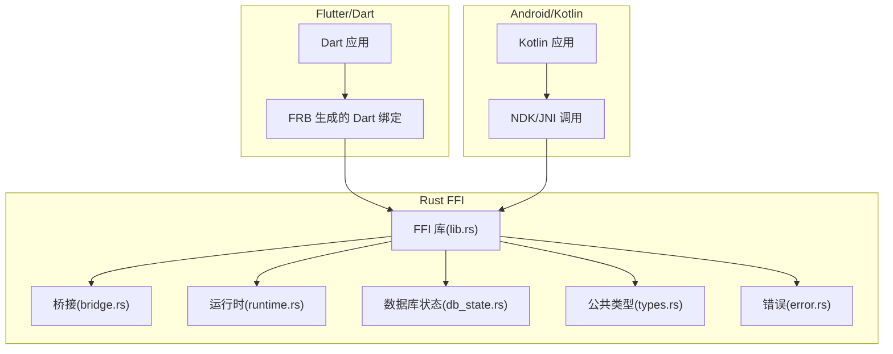
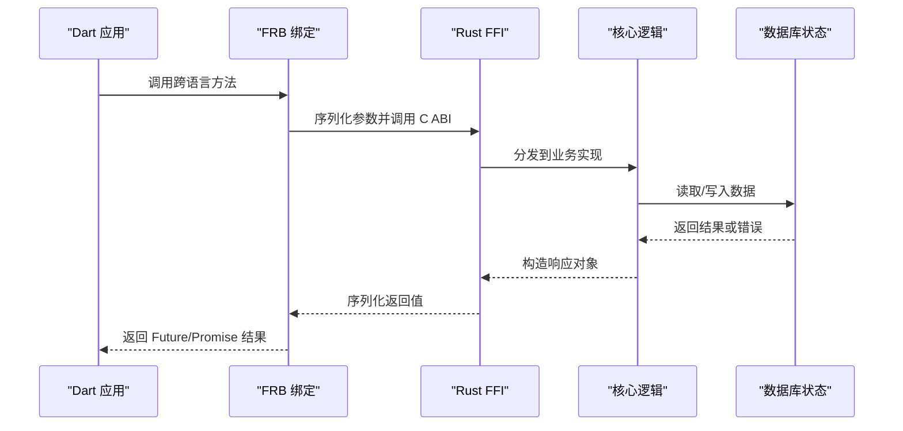
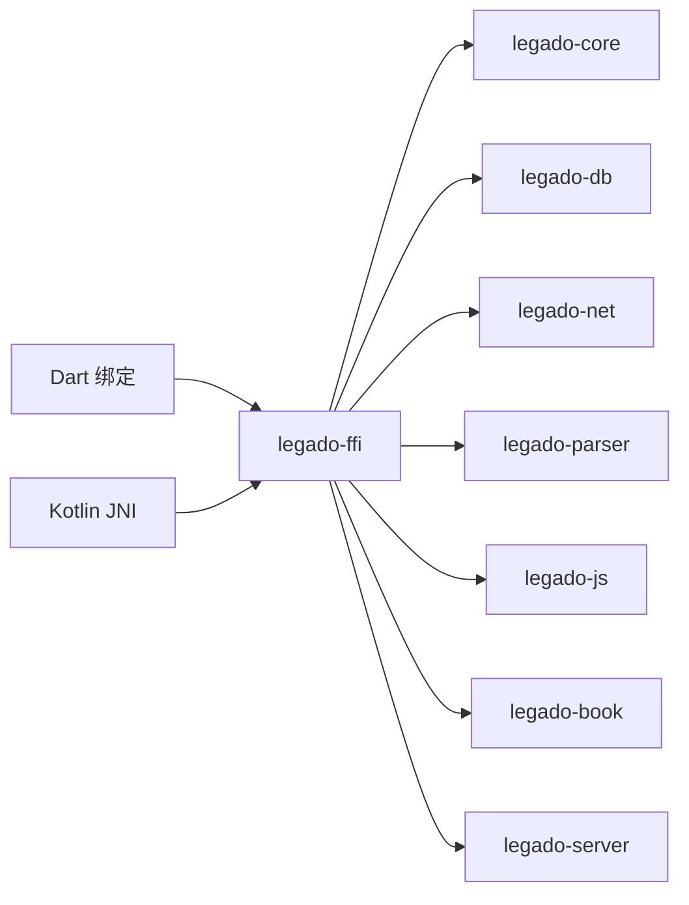

# FFI跨语言接口

<cite>
**本文引用的文件**   
- [rust/legado-ffi/src/lib.rs](file://rust/legado-ffi/src/lib.rs)
- [rust/legado-ffi/src/bridge.rs](file://rust/legado-ffi/src/bridge.rs)
- [rust/legado-ffi/src/ffi.rs](file://rust/legado-ffi/src/ffi.rs)
- [rust/legado-ffi/src/frb_generated.rs](file://rust/legado-ffi/src/frb_generated.rs)
- [rust/legado-ffi/src/db_state.rs](file://rust/legado-ffi/src/db_state.rs)
- [rust/legado-ffi/src/runtime.rs](file://rust/legado-ffi/src/runtime.rs)
- [rust/legado-core/src/types.rs](file://rust/legado-core/src/types.rs)
- [rust/legado-core/src/error.rs](file://rust/legado-core/src/error.rs)
- [flutter_legado/flutter_rust_bridge.yaml](file://flutter_legado/flutter_rust_bridge.yaml)
- [app/build.gradle](file://app/build.gradle)
- [gradle.properties](file://gradle.properties)
</cite>

## 目录
1. [简介](#简介)
2. [项目结构](#项目结构)
3. [核心组件](#核心组件)
4. [架构总览](#架构总览)
5. [详细组件分析](#详细组件分析)
6. [依赖关系分析](#依赖关系分析)
7. [性能考量](#性能考量)
8. [故障排查指南](#故障排查指南)
9. [结论](#结论)
10. [附录](#附录)

## 简介
本文件面向使用 Rust 与 Android/Kotlin、Flutter/Dart 进行跨语言集成的开发者，系统性说明 Legado 项目中 FFI（外部函数接口）的调用方式、数据类型映射、内存管理、异步模式、错误传播以及各平台集成最佳实践。文档以代码仓库中的 FFI 实现为依据，提供可追溯的文件来源与图示，帮助读者快速理解并安全地扩展接口。

## 项目结构
Legado 将 FFI 相关能力集中在 Rust 侧的 legado-ffi crate 中，并通过 flutter_rust_bridge（FRB）为 Flutter/Dart 生成桥接代码；Android/Kotlin 侧通过 Gradle 构建 Rust 原生库并在应用层调用。关键目录与职责：
- Rust FFI 入口与导出：位于 rust/legado-ffi/src 下，包含桥接、运行时、数据库状态、错误类型等。
- Flutter 桥接配置：位于 flutter_legado/flutter_rust_bridge.yaml，定义 FRB 的生成规则与目标语言。
- Android 构建：位于 app/build.gradle 与 gradle.properties，负责编译 Rust 到 .so 并打包进 APK。

**图表来源** 
- [rust/legado-ffi/src/lib.rs](file://rust/legado-ffi/src/lib.rs)
- [rust/legado-ffi/src/bridge.rs](file://rust/legado-ffi/src/bridge.rs)
- [rust/legado-ffi/src/runtime.rs](file://rust/legado-ffi/src/runtime.rs)
- [rust/legado-ffi/src/db_state.rs](file://rust/legado-ffi/src/db_state.rs)
- [rust/legado-core/src/types.rs](file://rust/legado-core/src/types.rs)
- [rust/legado-core/src/error.rs](file://rust/legado-core/src/error.rs)

**章节来源**
- [rust/legado-ffi/src/lib.rs](file://rust/legado-ffi/src/lib.rs)
- [flutter_legado/flutter_rust_bridge.yaml](file://flutter_legado/flutter_rust_bridge.yaml)
- [app/build.gradle](file://app/build.gradle)
- [gradle.properties](file://gradle.properties)

## 核心组件
- FFI 库入口与导出：统一暴露给 Dart 和 Kotlin 的函数集合，负责路由到具体业务模块。
- 桥接层：处理跨语言参数编解码、生命周期与所有权转移。
- 运行时：封装线程模型、协程/回调调度、资源初始化与清理。
- 数据库状态：维护 SQLite/持久化连接的生命周期与并发访问策略。
- 公共类型与错误：定义跨语言共享的数据结构与错误码/异常信息。

**章节来源**
- [rust/legado-ffi/src/bridge.rs](file://rust/legado-ffi/src/bridge.rs)
- [rust/legado-ffi/src/runtime.rs](file://rust/legado-ffi/src/runtime.rs)
- [rust/legado-ffi/src/db_state.rs](file://rust/legado-ffi/src/db_state.rs)
- [rust/legado-core/src/types.rs](file://rust/legado-core/src/types.rs)
- [rust/legado-core/src/error.rs](file://rust/legado-core/src/error.rs)

## 架构总览
下图展示 Flutter/Dart 与 Android/Kotlin 如何通过 FRB 与 JNI/NDK 调用 Rust FFI，以及数据在跨语言边界上的流转路径。

**图表来源** 
- [rust/legado-ffi/src/lib.rs](file://rust/legado-ffi/src/lib.rs)
- [rust/legado-ffi/src/frb_generated.rs](file://rust/legado-ffi/src/frb_generated.rs)
- [rust/legado-ffi/src/db_state.rs](file://rust/legado-ffi/src/db_state.rs)

## 详细组件分析

### FFI 库入口与导出（lib.rs）
- 职责：集中导出跨语言可调用的函数，注册 FRB 接口，统一错误包装与日志。
- 关键点：
  - 对外暴露的函数需遵循 C ABI，确保跨语言稳定。
  - 对复杂对象采用句柄/指针传递，避免大对象拷贝。
  - 错误类型统一转换为跨语言可识别的错误码或字符串。

**章节来源**
- [rust/legado-ffi/src/lib.rs](file://rust/legado-ffi/src/lib.rs)

### 桥接层（bridge.rs）
- 职责：处理 Dart/Kotlin 与 Rust 之间的参数编解码、生命周期管理与内存所有权。
- 关键点：
  - 基本类型直接映射（如 i32、f64、bool、String）。
  - 复杂对象通过结构体序列化/反序列化或句柄引用。
  - 集合类型（Vec、HashMap）按约定序列化为数组/字典。
  - 生命周期：由 FRB 或 JNI 管理临时缓冲，避免悬垂指针。

**章节来源**
- [rust/legado-ffi/src/bridge.rs](file://rust/legado-ffi/src/bridge.rs)

### 运行时（runtime.rs）
- 职责：管理线程池、异步任务调度、资源初始化与清理。
- 关键点：
  - 支持回调与 Future/Promise 模式，保证跨语言异步一致性。
  - 错误传播：将 Rust 错误转换为上层可捕获的异常或错误对象。
  - 资源清理：在进程退出或上下文销毁时释放句柄与缓存。

**章节来源**
- [rust/legado-ffi/src/runtime.rs](file://rust/legado-ffi/src/runtime.rs)

### 数据库状态（db_state.rs）
- 职责：维护数据库连接、事务与并发访问控制。
- 关键点：
  - 单例或受控实例，避免多连接竞争。
  - 读写分离与锁机制，防止死锁与数据不一致。
  - 迁移与版本管理，确保数据结构演进兼容。

**章节来源**
- [rust/legado-ffi/src/db_state.rs](file://rust/legado-ffi/src/db_state.rs)

### 公共类型与错误（types.rs, error.rs）
- 职责：定义跨语言共享的数据结构与错误语义。
- 关键点：
  - 类型映射表：Rust 类型与 Dart/Kotlin 类型的对应关系。
  - 错误码规范：区分网络、解析、IO、业务错误，便于上层处理。
  - 可选字段与默认值：明确空值语义，避免歧义。

**章节来源**
- [rust/legado-core/src/types.rs](file://rust/legado-core/src/types.rs)
- [rust/legado-core/src/error.rs](file://rust/legado-core/src/error.rs)

### Flutter 桥接配置（flutter_rust_bridge.yaml）
- 职责：定义 FRB 生成规则，包括输入输出类型、异步模式、错误处理。
- 关键点：
  - 指定 Rust 源文件与 Dart 输出目录。
  - 配置 Future/Promise 行为与回调签名。
  - 自定义类型映射与序列化策略。

**章节来源**
- [flutter_legado/flutter_rust_bridge.yaml](file://flutter_legado/flutter_rust_bridge.yaml)

### Android 构建集成（build.gradle, gradle.properties）
- 职责：编译 Rust 为 .so 并打包进 APK，配置 NDK 工具链。
- 关键点：
  - 设置 target_abi 与优化级别。
  - 链接依赖库与符号保留规则。
  - 调试与发布版本的差异化配置。

**章节来源**
- [app/build.gradle](file://app/build.gradle)
- [gradle.properties](file://gradle.properties)

## 依赖关系分析
Rust FFI 模块依赖核心业务库（core）、数据库（db）、网络（net）等，对外仅暴露稳定的 C ABI。Flutter/Dart 通过 FRB 生成绑定，Android/Kotlin 通过 JNI/NDK 调用。

**图表来源** 
- [rust/legado-ffi/src/lib.rs](file://rust/legado-ffi/src/lib.rs)
- [rust/Cargo.toml](file://rust/Cargo.toml)

**章节来源**
- [rust/legado-ffi/src/lib.rs](file://rust/legado-ffi/src/lib.rs)
- [rust/Cargo.toml](file://rust/Cargo.toml)

## 性能考量
- 零拷贝传输：优先使用指针/句柄传递大对象，避免频繁序列化。
- 批量操作：合并多次调用为单次批处理，减少跨语言开销。
- 异步并行：利用线程池与协程提升吞吐，注意背压与限流。
- 内存池：复用常用对象，降低 GC 压力。
- 监控与埋点：记录耗时与错误率，定位瓶颈。

[本节为通用指导，无需特定文件来源]

## 故障排查指南
- 常见错误：
  - 类型不匹配：检查 FRB 配置与类型映射。
  - 内存泄漏：确认句柄释放与生命周期管理。
  - 异步回调丢失：验证线程切换与事件循环。
  - 崩溃与段错误：检查空指针与越界访问。
- 调试技巧：
  - 启用详细日志与堆栈跟踪。
  - 使用 Valgrind/AddressSanitizer 检测内存问题。
  - 分模块隔离测试，逐步缩小范围。

**章节来源**
- [rust/legado-core/src/error.rs](file://rust/legado-core/src/error.rs)
- [rust/legado-ffi/src/runtime.rs](file://rust/legado-ffi/src/runtime.rs)

## 结论
Legado 的 FFI 设计以稳定性与性能为核心，通过 FRB 与 JNI/NDK 实现跨语言高效通信。遵循本文档的类型映射、内存管理与异步模式规范，可安全扩展接口并保障跨平台一致性。建议在新功能开发中严格遵循错误传播与资源清理最佳实践，持续监控性能指标。

[本节为总结性内容，无需特定文件来源]

## 附录
- 类型映射速查：
  - i32/i64/u32/u64 → int/long
  - f32/f64 → float/double
  - bool → boolean
  - String → string
  - Vec<T> → List<T>
  - HashMap<K,V> → Map<K,V>
  - Option<T> → nullable T
- 异步模式：
  - Dart：Future/Promise
  - Kotlin：Coroutine/Callback
  - Rust：async/await + 回调
- 集成步骤：
  - 配置 FRB 与 Gradle
  - 生成绑定代码
  - 调用示例与错误处理

[本节为参考信息，无需特定文件来源]