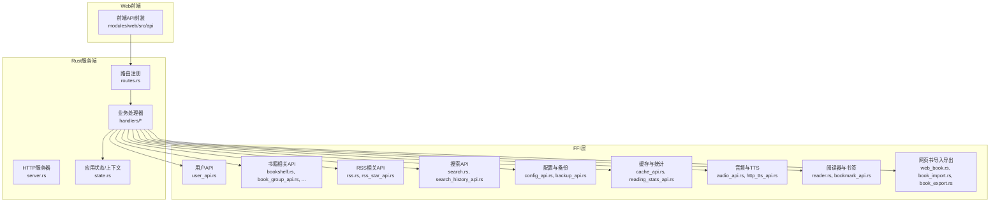
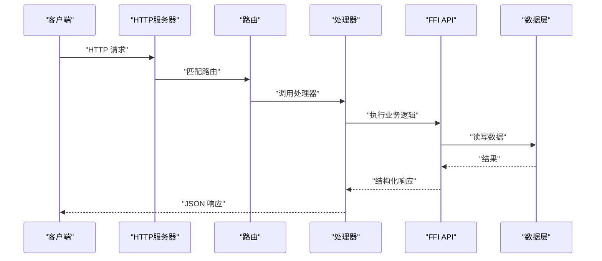
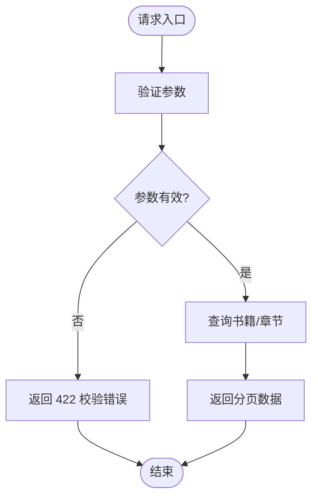
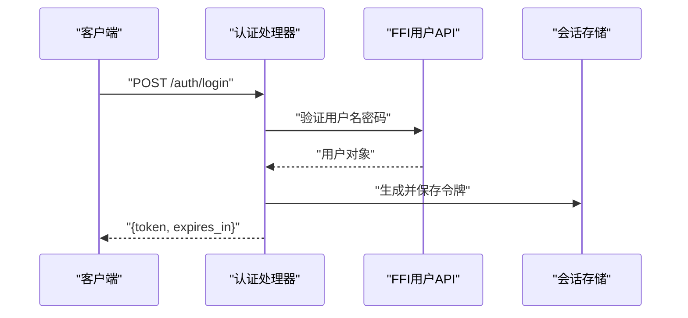
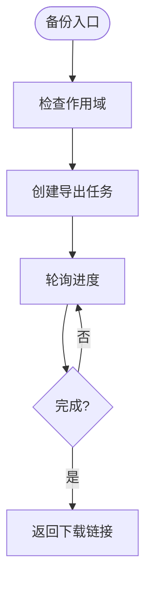
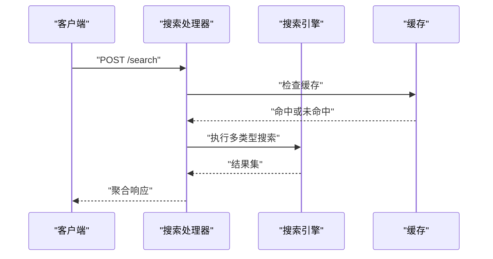
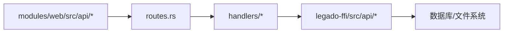

# RESTful API接口

<cite>
**本文引用的文件**   
- [routes.rs](file://rust/legado-server/src/routes.rs)
- [server.rs](file://rust/legado-server/src/server.rs)
- [lib.rs](file://rust/legado-server/src/lib.rs)
- [state.rs](file://rust/legado-server/src/state.rs)
- [error.rs](file://rust/legado-server/src/error.rs)
- [handlers/mod.rs](file://rust/legado-server/src/handlers/mod.rs)
- [bookshelf.rs](file://rust/legado-server/src/handlers/bookshelf.rs)
- [source.rs](file://rust/legado-server/src/handlers/source.rs)
- [rss.rs](file://rust/legado-server/src/handlers/rss.rs)
- [search.rs](file://rust/legado-server/src/handlers/search.rs)
- [user_api.rs](file://rust/legado-ffi/src/api/user_api.rs)
- [config_api.rs](file://rust/legado-ffi/src/api/config_api.rs)
- [backup_api.rs](file://rust/legado-ffi/src/api/backup_api.rs)
- [cache_api.rs](file://rust/legado-ffi/src/api/cache_api.rs)
- [read_record_api.rs](file://rust/legado-ffi/src/api/read_record_api.rs)
- [reading_stats_api.rs](file://rust/legado-ffi/src/api/reading_stats_api.rs)
- [replace_rule_api.rs](file://rust/legado-ffi/src/api/replace_rule_api.rs)
- [http_tts_api.rs](file://rust/legado-ffi/src/api/http_tts_api.rs)
- [audio_api.rs](file://rust/legado-ffi/src/api/audio_api.rs)
- [reader.rs](file://rust/legado-ffi/src/api/reader.rs)
- [web_book.rs](file://rust/legado-ffi/src/api/web_book.rs)
- [book_group_api.rs](file://rust/legado-ffi/src/api/book_group_api.rs)
- [bookmark_api.rs](file://rust/legado-ffi/src/api/bookmark_api.rs)
- [book_import.rs](file://rust/legado-ffi/src/api/book_import.rs)
- [book_export.rs](file://rust/legado-ffi/src/api/book_export.rs)
- [txt_search_api.rs](file://rust/legado-ffi/src/api/txt_search_api.rs)
- [search_history_api.rs](file://rust/legado-ffi/src/api/search_history_api.rs)
- [source_switch.rs](file://rust/legado-ffi/src/api/source_switch.rs)
- [rss_star_api.rs](file://rust/legado-ffi/src/api/rss_star_api.rs)
- [api/index.ts](file://modules/web/src/api/index.ts)
- [api/axios.ts](file://modules/web/src/api/axios.ts)
- [api/api.ts](file://modules/web/src/api/api.ts)
- [api/sourceToken.ts](file://modules/web/src/api/sourceToken.ts)
</cite>

## 目录
1. [简介](#简介)
2. [项目结构](#项目结构)
3. [核心组件](#核心组件)
4. [架构总览](#架构总览)
5. [详细组件分析](#详细组件分析)
6. [依赖分析](#依赖分析)
7. [性能考虑](#性能考虑)
8. [故障排查指南](#故障排查指南)
9. [结论](#结论)
10. [附录](#附录)

## 简介
本文件为 Legado 项目的 RESTful API 接口文档，面向开发者与集成方，覆盖书籍管理、用户认证、同步服务、RSS 订阅等核心能力。文档基于仓库中的服务端路由、处理器与 FFI API 定义进行整理，提供统一的 URL 模式、HTTP 方法、请求参数格式、响应数据结构、状态码与错误处理说明，并给出分页、搜索过滤、版本管理与兼容性建议及最佳实践。

## 项目结构
Legado 的 Web API 由 Rust 服务端模块提供，前端通过 modules/web 中的 TypeScript 客户端调用。关键路径如下：
- 服务端路由与服务器启动位于 rust/legado-server
- 业务处理器位于 rust/legado-server/src/handlers
- FFI API（对外暴露的函数）位于 rust/legado-ffi/src/api
- 前端 API 客户端位于 modules/web/src/api



图表来源
- [routes.rs:1-200](file://rust/legado-server/src/routes.rs#L1-L200)
- [server.rs:1-120](file://rust/legado-server/src/server.rs#L1-L120)
- [lib.rs:1-120](file://rust/legado-server/src/lib.rs#L1-L120)
- [state.rs:1-120](file://rust/legado-server/src/state.rs#L1-L120)

章节来源
- [routes.rs:1-200](file://rust/legado-server/src/routes.rs#L1-L200)
- [server.rs:1-120](file://rust/legado-server/src/server.rs#L1-L120)
- [lib.rs:1-120](file://rust/legado-server/src/lib.rs#L1-L120)
- [state.rs:1-120](file://rust/legado-server/src/state.rs#L1-L120)

## 核心组件
- 路由与服务器
  - 路由注册集中管理所有 HTTP 端点，统一前缀与分组
  - 服务器负责监听端口、TLS 配置、中间件与错误处理
- 处理器（Handlers）
  - 按功能域划分：书籍、源、RSS、搜索、用户、配置、缓存、音频、阅读器等
  - 每个处理器实现具体业务逻辑，调用 FFI API 与数据库
- FFI API
  - 将 Rust 内部能力暴露给上层处理器，包含数据访问、网络请求、解析与转换
- 应用状态
  - 共享上下文（如数据库连接、配置、缓存、任务调度）在处理器间复用

章节来源
- [handlers/mod.rs:1-120](file://rust/legado-server/src/handlers/mod.rs#L1-L120)
- [state.rs:1-120](file://rust/legado-server/src/state.rs#L1-L120)
- [lib.rs:1-120](file://rust/legado-server/src/lib.rs#L1-L120)

## 架构总览
整体采用“前端 TS 客户端 -> Rust 路由 -> 处理器 -> FFI API -> 数据层”的分层架构。请求进入后由路由分发到对应处理器，处理器调用 FFI 层完成业务操作，最终返回 JSON 响应。错误通过统一错误类型处理，保证一致的状态码与消息格式。



图表来源
- [routes.rs:1-200](file://rust/legado-server/src/routes.rs#L1-L200)
- [server.rs:1-120](file://rust/legado-server/src/server.rs#L1-L120)
- [handlers/mod.rs:1-120](file://rust/legado-server/src/handlers/mod.rs#L1-L120)

## 详细组件分析

### 通用约定
- 基础路径
  - 所有端点以 /api/v1 为前缀（示例），实际前缀由路由注册决定
- 请求格式
  - Content-Type: application/json
  - 请求体使用 JSON；部分上传接口支持 multipart/form-data
- 响应格式
  - 成功：{ code: 0, data: <对象或数组>, message: "ok" }
  - 失败：{ code: <错误码>, message: "<描述>", details: <可选> }
- 状态码
  - 200 成功；400 参数错误；401 未授权；403 禁止；404 未找到；409 冲突；422 校验失败；500 服务器错误
- 分页机制
  - 查询列表接口通常支持 page、size、sort、order 等参数
  - 响应中包含 total、page、size、items 字段
- 搜索与过滤
  - 支持关键词、标签、时间范围、排序等过滤条件
  - 模糊匹配与正则引擎由后端解析器提供

章节来源
- [error.rs:1-120](file://rust/legado-server/src/error.rs#L1-L120)
- [handlers/mod.rs:1-120](file://rust/legado-server/src/handlers/mod.rs#L1-L120)

### 书籍管理 API
- 列表与搜索
  - GET /api/v1/books
    - 查询参数：keyword、tag、category、sort、order、page、size
    - 响应：分页对象 { total, page, size, items: Book[] }
  - POST /api/v1/books/search
    - 请求体：{ keyword, filters, sort, page, size }
    - 响应：搜索结果集合
- 详情与章节
  - GET /api/v1/books/{id}
    - 路径参数：id
    - 响应：Book 详情
  - GET /api/v1/books/{id}/chapters
    - 查询参数：page、size、sort
    - 响应：章节列表
- 收藏与分组
  - PUT /api/v1/books/{id}/favorite
    - 请求体：{ favorite: boolean }
    - 响应：更新后的 Book
  - GET /api/v1/book-groups
    - 响应：分组列表
  - POST /api/v1/book-groups
    - 请求体：Group 信息
    - 响应：创建结果
- 导入与导出
  - POST /api/v1/books/import
    - 支持 multipart/form-data 上传 EPUB/TXT/PDF/MOBI
    - 响应：导入任务 ID 或结果
  - GET /api/v1/books/export
    - 查询参数：ids、format
    - 响应：下载链接或流式内容



图表来源
- [bookshelf.rs:1-200](file://rust/legado-server/src/handlers/bookshelf.rs#L1-L200)
- [book_group_api.rs:1-120](file://rust/legado-ffi/src/api/book_group_api.rs#L1-L120)
- [book_import.rs:1-120](file://rust/legado-ffi/src/api/book_import.rs#L1-L120)
- [book_export.rs:1-120](file://rust/legado-ffi/src/api/book_export.rs#L1-L120)

章节来源
- [bookshelf.rs:1-200](file://rust/legado-server/src/handlers/bookshelf.rs#L1-L200)
- [book_group_api.rs:1-120](file://rust/legado-ffi/src/api/book_group_api.rs#L1-L120)
- [book_import.rs:1-120](file://rust/legado-ffi/src/api/book_import.rs#L1-L120)
- [book_export.rs:1-120](file://rust/legado-ffi/src/api/book_export.rs#L1-L120)

### 用户认证 API
- 登录与令牌
  - POST /api/v1/auth/login
    - 请求体：{ username, password }
    - 响应：{ token, expires_in }
  - POST /api/v1/auth/logout
    - 无请求体
    - 响应：{ message: "已登出" }
  - POST /api/v1/auth/refresh
    - 请求体：{ refresh_token }
    - 响应：新令牌
- 用户信息
  - GET /api/v1/users/me
    - 响应：当前用户信息
  - PUT /api/v1/users/me
    - 请求体：用户资料更新
    - 响应：更新结果



图表来源
- [user_api.rs:1-120](file://rust/legado-ffi/src/api/user_api.rs#L1-L120)
- [handlers/mod.rs:1-120](file://rust/legado-server/src/handlers/mod.rs#L1-L120)

章节来源
- [user_api.rs:1-120](file://rust/legado-ffi/src/api/user_api.rs#L1-L120)

### 同步服务 API
- 配置与备份
  - GET /api/v1/config
    - 响应：系统配置快照
  - PUT /api/v1/config
    - 请求体：配置项键值对
    - 响应：更新结果
  - POST /api/v1/backup/export
    - 请求体：{ scope: "all|books|sources|rss", include_media: boolean }
    - 响应：导出任务 ID
  - GET /api/v1/backup/import
    - 支持 multipart/form-data 上传备份包
    - 响应：导入任务 ID
- 缓存清理
  - DELETE /api/v1/cache/clear
    - 请求体：{ type: "image|chapter|download" }
    - 响应：清理结果



图表来源
- [config_api.rs:1-120](file://rust/legado-ffi/src/api/config_api.rs#L1-L120)
- [backup_api.rs:1-120](file://rust/legado-ffi/src/api/backup_api.rs#L1-L120)
- [cache_api.rs:1-120](file://rust/legado-ffi/src/api/cache_api.rs#L1-L120)

章节来源
- [config_api.rs:1-120](file://rust/legado-ffi/src/api/config_api.rs#L1-L120)
- [backup_api.rs:1-120](file://rust/legado-ffi/src/api/backup_api.rs#L1-L120)
- [cache_api.rs:1-120](file://rust/legado-ffi/src/api/cache_api.rs#L1-L120)

### RSS 订阅 API
- 订阅源管理
  - GET /api/v1/rss/sources
    - 响应：订阅源列表
  - POST /api/v1/rss/sources
    - 请求体：Source 信息
    - 响应：创建结果
  - PUT /api/v1/rss/sources/{id}
    - 请求体：更新信息
    - 响应：更新结果
  - DELETE /api/v1/rss/sources/{id}
    - 响应：删除结果
- 文章与星标
  - GET /api/v1/rss/articles
    - 查询参数：source_id、page、size、status
    - 响应：文章分页
  - PUT /api/v1/rss/articles/{id}/star
    - 请求体：{ starred: boolean }
    - 响应：更新结果

```mermaid
classDiagram
class RssSource {
+string id
+string name
+string url
+string category
+boolean enabled
+datetime updated_at
}
class RssArticle {
+string id
+string title
+string content
+string source_id
+boolean starred
+datetime published_at
}
RssSource ||--o{ RssArticle : "发布"
```

图表来源
- [rss.rs:1-200](file://rust/legado-server/src/handlers/rss.rs#L1-L200)
- [rss_star_api.rs:1-120](file://rust/legado-ffi/src/api/rss_star_api.rs#L1-L120)

章节来源
- [rss.rs:1-200](file://rust/legado-server/src/handlers/rss.rs#L1-L200)
- [rss_star_api.rs:1-120](file://rust/legado-ffi/src/api/rss_star_api.rs#L1-L120)

### 搜索 API
- 全局搜索
  - POST /api/v1/search
    - 请求体：{ query, types: ["book","source","rss"], filters, page, size }
    - 响应：聚合搜索结果
- 搜索历史
  - GET /api/v1/search/history
    - 响应：历史记录列表
  - DELETE /api/v1/search/history/{id}
    - 响应：删除结果



图表来源
- [search.rs:1-200](file://rust/legado-server/src/handlers/search.rs#L1-L200)
- [search_history_api.rs:1-120](file://rust/legado-ffi/src/api/search_history_api.rs#L1-L120)

章节来源
- [search.rs:1-200](file://rust/legado-server/src/handlers/search.rs#L1-L200)
- [search_history_api.rs:1-120](file://rust/legado-ffi/src/api/search_history_api.rs#L1-L120)

### 其他辅助 API
- 替换规则
  - GET /api/v1/replace-rules
  - POST /api/v1/replace-rules
  - PUT /api/v1/replace-rules/{id}
  - DELETE /api/v1/replace-rules/{id}
- 听书与 TTS
  - GET /api/v1/audio/status
  - POST /api/v1/audio/play
  - POST /api/v1/http-tts/synthesize
- 阅读器与书签
  - GET /api/v1/reader/state
  - PUT /api/v1/reader/state
  - GET /api/v1/bookmarks
  - POST /api/v1/bookmarks
- 网页书
  - POST /api/v1/web-book/import
  - GET /api/v1/web-book/export

章节来源
- [replace_rule_api.rs:1-120](file://rust/legado-ffi/src/api/replace_rule_api.rs#L1-L120)
- [audio_api.rs:1-120](file://rust/legado-ffi/src/api/audio_api.rs#L1-L120)
- [http_tts_api.rs:1-120](file://rust/legado-ffi/src/api/http_tts_api.rs#L1-L120)
- [reader.rs:1-120](file://rust/legado-ffi/src/api/reader.rs#L1-L120)
- [bookmark_api.rs:1-120](file://rust/legado-ffi/src/api/bookmark_api.rs#L1-L120)
- [web_book.rs:1-120](file://rust/legado-ffi/src/api/web_book.rs#L1-L120)

## 依赖分析
- 路由依赖处理器，处理器依赖 FFI API，FFI API 依赖数据层与网络库
- 状态对象在处理器间共享，避免重复初始化资源
- 前端通过 axios 封装统一拦截器，处理鉴权与错误



图表来源
- [routes.rs:1-200](file://rust/legado-server/src/routes.rs#L1-L200)
- [handlers/mod.rs:1-120](file://rust/legado-server/src/handlers/mod.rs#L1-L120)
- [api/index.ts:1-120](file://modules/web/src/api/index.ts#L1-L120)
- [api/axios.ts:1-120](file://modules/web/src/api/axios.ts#L1-L120)

章节来源
- [routes.rs:1-200](file://rust/legado-server/src/routes.rs#L1-L200)
- [handlers/mod.rs:1-120](file://rust/legado-server/src/handlers/mod.rs#L1-L120)
- [api/index.ts:1-120](file://modules/web/src/api/index.ts#L1-L120)
- [api/axios.ts:1-120](file://modules/web/src/api/axios.ts#L1-L120)

## 性能考虑
- 分页与限流
  - 默认限制每页最大条目数，防止大响应
  - 对高频接口启用速率限制
- 缓存策略
  - 搜索结果与静态资源启用短期缓存
  - 图片与章节内容使用 CDN 或本地缓存
- 并发与异步
  - 长耗时任务（导入/导出）采用异步任务队列
  - 数据库查询使用连接池与索引优化
- 压缩与传输
  - 启用 gzip/brotli 压缩
  - 合理设置超时与重试策略

[本节为通用指导，不直接分析具体文件]

## 故障排查指南
- 常见错误码
  - 400：请求参数缺失或格式错误
  - 401：未携带有效令牌或令牌过期
  - 403：权限不足
  - 404：资源不存在
  - 422：数据校验失败
  - 500：服务器内部错误
- 调试建议
  - 开启详细日志，记录请求 ID 与链路追踪
  - 使用健康检查端点确认服务状态
  - 针对慢查询定位数据库热点与锁竞争

章节来源
- [error.rs:1-120](file://rust/legado-server/src/error.rs#L1-L120)
- [server.rs:1-120](file://rust/legado-server/src/server.rs#L1-L120)

## 结论
Legado 的 RESTful API 采用清晰的分层架构与统一的错误处理，提供书籍管理、用户认证、同步服务、RSS 订阅等完整能力。通过分页、搜索过滤与异步任务，满足高并发与大数据量场景。建议在生产环境启用缓存、压缩与限流，并结合监控与日志进行持续优化。

[本节为总结性内容，不直接分析具体文件]

## 附录
- 版本管理与向后兼容
  - 所有端点以 /api/v1 前缀标识版本
  - 新增字段保持可选，废弃字段保留一段时间并提供迁移提示
  - 重大变更通过新版本前缀（如 /api/v2）发布，旧版本继续维护
- 最佳实践
  - 客户端应实现幂等重试与退避策略
  - 敏感操作需二次确认与审计日志
  - 定期轮换令牌与密钥

[本节为补充说明，不直接分析具体文件]