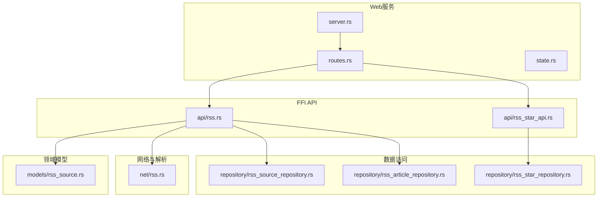
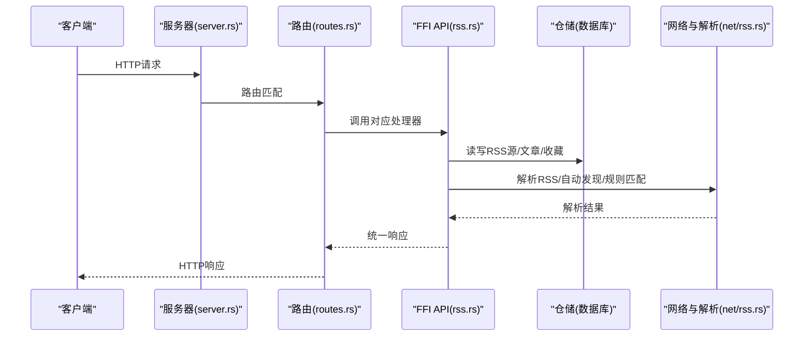
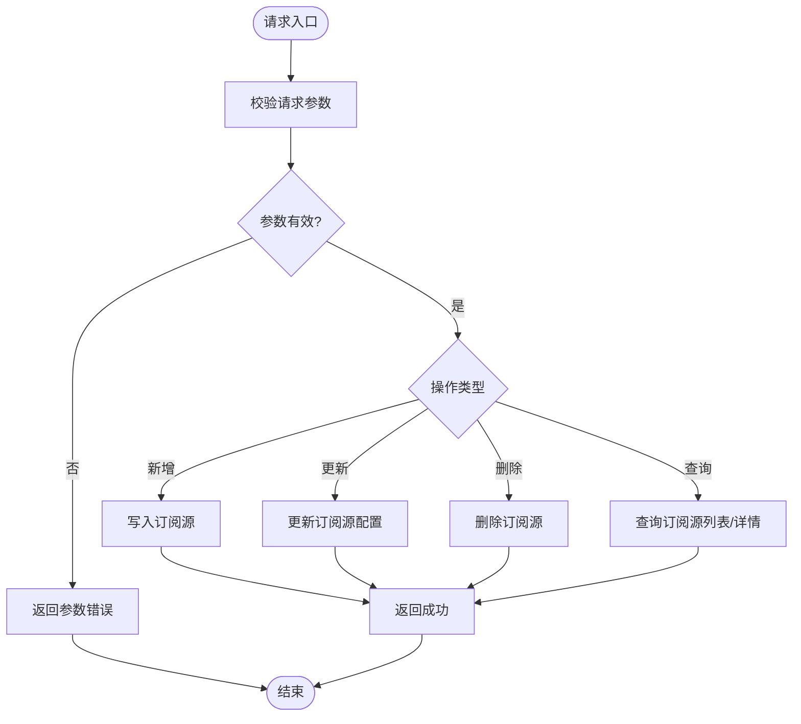
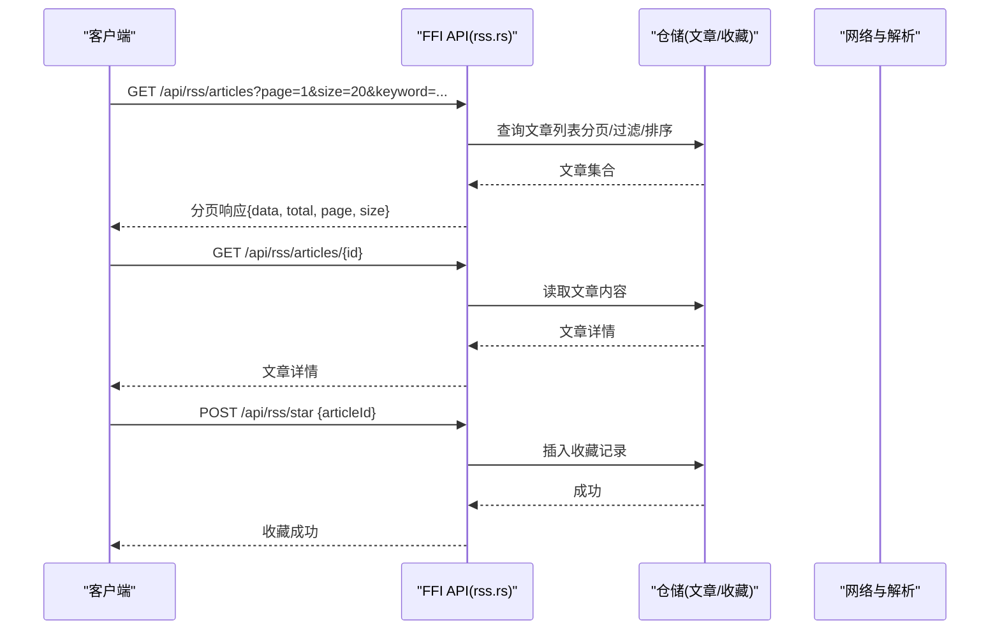
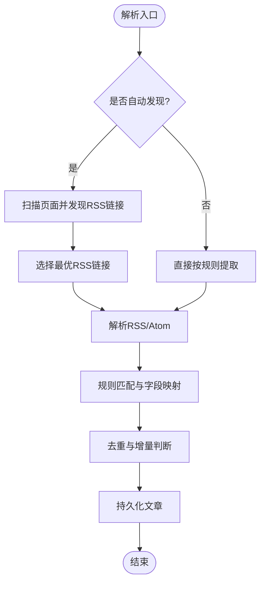
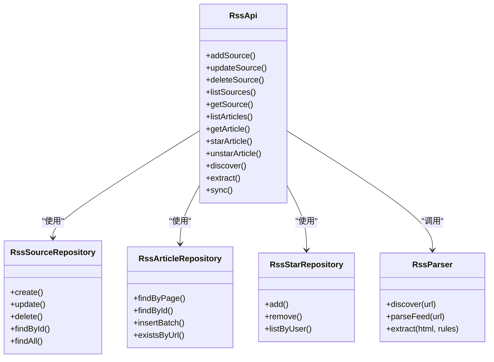

# RSS订阅API

<cite>
**本文引用的文件**   
- [rss.rs](file://rust/legado-ffi/src/api/rss.rs)
- [rss_star_api.rs](file://rust/legado-ffi/src/api/rss_star_api.rs)
- [rss_source_repository.rs](file://rust/legado-db/src/repository/rss_source_repository.rs)
- [rss_article_repository.rs](file://rust/legado-db/src/repository/rss_article_repository.rs)
- [rss_star_repository.rs](file://rust/legado-db/src/repository/rss_star_repository.rs)
- [rss.rs](file://rust/legado-net/src/rss.rs)
- [routes.rs](file://rust/legado-server/src/routes.rs)
- [server.rs](file://rust/legado-server/src/server.rs)
- [state.rs](file://rust/legado-server/src/state.rs)
- [error.rs](file://rust/legado-server/src/error.rs)
- [rss_source.rs](file://rust/legado-core/src/models/rss_source.rs)
- [rss_article_repository.rs](file://rust/legado-db/src/repository/rss_article_repository.rs)
</cite>

## 目录
1. [简介](#简介)
2. [项目结构](#项目结构)
3. [核心组件](#核心组件)
4. [架构总览](#架构总览)
5. [详细组件分析](#详细组件分析)
6. [依赖关系分析](#依赖关系分析)
7. [性能与优化](#性能与优化)
8. [故障排查指南](#故障排查指南)
9. [结论](#结论)
10. [附录：接口清单与示例](#附录接口清单与示例)

## 简介
本文件为Legado项目的RSS订阅RESTful API文档，面向开发者提供完整的接口说明。内容涵盖：
- RSS源管理：添加、删除、更新订阅源配置
- 文章管理：列表获取、内容读取、收藏管理
- 订阅源解析：自动发现、规则匹配、内容提取
- 分页、搜索过滤、排序选项
- 实时更新、增量抓取、错误重试等性能优化特性

## 项目结构
本项目采用Rust多模块架构，RSS相关能力分布在以下模块：
- FFI层对外暴露API（legado-ffi）
- 数据库访问（legado-db）
- 网络与RSS解析（legado-net）
- Web服务路由与状态（legado-server）
- 领域模型（legado-core）

**图示来源** 
- [server.rs](file://rust/legado-server/src/server.rs)
- [routes.rs](file://rust/legado-server/src/routes.rs)
- [state.rs](file://rust/legado-server/src/state.rs)
- [rss.rs](file://rust/legado-ffi/src/api/rss.rs)
- [rss_star_api.rs](file://rust/legado-ffi/src/api/rss_star_api.rs)
- [rss_source_repository.rs](file://rust/legado-db/src/repository/rss_source_repository.rs)
- [rss_article_repository.rs](file://rust/legado-db/src/repository/rss_article_repository.rs)
- [rss_star_repository.rs](file://rust/legado-db/src/repository/rss_star_repository.rs)
- [rss.rs](file://rust/legado-net/src/rss.rs)
- [rss_source.rs](file://rust/legado-core/src/models/rss_source.rs)

**章节来源**
- [server.rs](file://rust/legado-server/src/server.rs)
- [routes.rs](file://rust/legado-server/src/routes.rs)
- [state.rs](file://rust/legado-server/src/state.rs)

## 核心组件
- FFI API层：定义HTTP端点处理逻辑，负责参数校验、调用仓储与业务服务、返回统一响应格式。
- 仓储层：封装对SQLite的CRUD操作，提供RSS源、文章、收藏的增删改查与批量操作。
- 网络与解析：实现RSS/Atom解析、自动发现、规则匹配与内容提取。
- 领域模型：定义RSS源、文章、收藏的数据结构与约束。

**章节来源**
- [rss.rs](file://rust/legado-ffi/src/api/rss.rs)
- [rss_star_api.rs](file://rust/legado-ffi/src/api/rss_star_api.rs)
- [rss_source_repository.rs](file://rust/legado-db/src/repository/rss_source_repository.rs)
- [rss_article_repository.rs](file://rust/legado-db/src/repository/rss_article_repository.rs)
- [rss_star_repository.rs](file://rust/legado-db/src/repository/rss_star_repository.rs)
- [rss.rs](file://rust/legado-net/src/rss.rs)
- [rss_source.rs](file://rust/legado-core/src/models/rss_source.rs)

## 架构总览
整体请求流程从Web服务接收HTTP请求，经路由分发到FFI API处理器，再由仓储层访问数据库或调用网络解析模块完成业务逻辑。

**图示来源** 
- [server.rs](file://rust/legado-server/src/server.rs)
- [routes.rs](file://rust/legado-server/src/routes.rs)
- [rss.rs](file://rust/legado-ffi/src/api/rss.rs)
- [rss_article_repository.rs](file://rust/legado-db/src/repository/rss_article_repository.rs)
- [rss_source_repository.rs](file://rust/legado-db/src/repository/rss_source_repository.rs)
- [rss.rs](file://rust/legado-net/src/rss.rs)

## 详细组件分析

### RSS源管理API
- 功能范围：新增订阅源、删除订阅源、更新订阅源配置、查询订阅源列表、按ID获取详情。
- 典型端点：
  - POST /api/rss/sources：新增订阅源
  - PUT /api/rss/sources/{id}：更新订阅源配置
  - DELETE /api/rss/sources/{id}：删除订阅源
  - GET /api/rss/sources：列出所有订阅源
  - GET /api/rss/sources/{id}：获取订阅源详情
- 请求参数：
  - 名称、URL、分组、抓取间隔、UA、Cookie、代理、解析规则等
- 响应字段：
  - 源ID、名称、URL、分组、状态、最后更新时间、错误信息等

**图示来源** 
- [rss.rs](file://rust/legado-ffi/src/api/rss.rs)
- [rss_source_repository.rs](file://rust/legado-db/src/repository/rss_source_repository.rs)

**章节来源**
- [rss.rs](file://rust/legado-ffi/src/api/rss.rs)
- [rss_source_repository.rs](file://rust/legado-db/src/repository/rss_source_repository.rs)

### 文章管理API
- 功能范围：文章列表获取、文章内容读取、收藏管理（收藏/取消收藏）、按条件筛选与排序。
- 典型端点：
  - GET /api/rss/articles：获取文章列表（支持分页、搜索、排序）
  - GET /api/rss/articles/{id}：获取文章内容
  - POST /api/rss/star：收藏文章
  - DELETE /api/rss/star/{articleId}：取消收藏
  - GET /api/rss/star：获取收藏列表
- 分页机制：
  - page：页码（默认1）
  - size：每页数量（默认20，最大可配置）
- 搜索过滤：
  - keyword：关键词（标题/摘要/正文）
  - sourceId：按订阅源过滤
  - dateFrom/dateTo：时间范围
- 排序选项：
  - sort：publishedAt、createdAt、title
  - order：asc、desc

**图示来源** 
- [rss.rs](file://rust/legado-ffi/src/api/rss.rs)
- [rss_article_repository.rs](file://rust/legado-db/src/repository/rss_article_repository.rs)
- [rss_star_repository.rs](file://rust/legado-db/src/repository/rss_star_repository.rs)

**章节来源**
- [rss.rs](file://rust/legado-ffi/src/api/rss.rs)
- [rss_article_repository.rs](file://rust/legado-db/src/repository/rss_article_repository.rs)
- [rss_star_repository.rs](file://rust/legado-db/src/repository/rss_star_repository.rs)

### 订阅源解析API
- 功能范围：自动发现RSS链接、规则匹配、内容提取、增量抓取。
- 典型端点：
  - POST /api/rss/parse/discover：自动发现RSS链接
  - POST /api/rss/parse/extract：根据规则提取内容
  - POST /api/rss/sync：触发增量抓取（基于上次时间与去重）
- 自动发现：
  - 输入：目标页面URL
  - 输出：候选RSS链接列表（含权重）
- 规则匹配：
  - 输入：HTML/JSON、选择器或XPath表达式
  - 输出：结构化条目（标题、摘要、链接、发布时间等）
- 增量抓取：
  - 依据：订阅源的最后抓取时间、文章唯一标识（URL或哈希）
  - 策略：跳过已存在条目、仅拉取新增

**图示来源** 
- [rss.rs](file://rust/legado-net/src/rss.rs)
- [rss.rs](file://rust/legado-ffi/src/api/rss.rs)

**章节来源**
- [rss.rs](file://rust/legado-net/src/rss.rs)
- [rss.rs](file://rust/legado-ffi/src/api/rss.rs)

## 依赖关系分析
- FFI API依赖仓储层进行数据存取，依赖网络模块进行RSS解析与抓取。
- 仓储层依赖SQLite数据库，通过Repository模式隔离SQL细节。
- 网络模块依赖HTTP客户端与中间件（如重试、限流、代理）。
- 领域模型在各层之间传递，保证数据结构一致性。

**图示来源** 
- [rss.rs](file://rust/legado-ffi/src/api/rss.rs)
- [rss_source_repository.rs](file://rust/legado-db/src/repository/rss_source_repository.rs)
- [rss_article_repository.rs](file://rust/legado-db/src/repository/rss_article_repository.rs)
- [rss_star_repository.rs](file://rust/legado-db/src/repository/rss_star_repository.rs)
- [rss.rs](file://rust/legado-net/src/rss.rs)

**章节来源**
- [rss.rs](file://rust/legado-ffi/src/api/rss.rs)
- [rss_source_repository.rs](file://rust/legado-db/src/repository/rss_source_repository.rs)
- [rss_article_repository.rs](file://rust/legado-db/src/repository/rss_article_repository.rs)
- [rss_star_repository.rs](file://rust/legado-db/src/repository/rss_star_repository.rs)
- [rss.rs](file://rust/legado-net/src/rss.rs)

## 性能与优化
- 增量抓取：基于最后抓取时间与文章唯一标识，避免重复下载与入库。
- 分页与懒加载：文章列表默认分页，减少内存占用与传输体积。
- 并发与限流：网络请求支持并发控制与速率限制，防止被目标站点封禁。
- 缓存策略：对RSS元数据与封面图进行短期缓存，降低重复请求。
- 错误重试：对网络异常与超时进行指数退避重试，提高稳定性。
- 资源清理：定期清理过期缓存与无用临时文件，保持系统健康。

[本节为通用指导，不直接分析具体文件]

## 故障排查指南
- 常见错误：
  - 参数校验失败：检查必填字段与格式
  - 网络超时/连接失败：检查代理、SSL配置与目标站点可达性
  - 解析失败：检查规则表达式与页面结构变化
  - 重复入库：确认去重键（URL或哈希）是否正确
- 调试建议：
  - 启用详细日志，定位请求链路
  - 使用独立工具验证RSS链接与规则
  - 逐步缩小问题范围（单源测试、单条规则测试）

**章节来源**
- [error.rs](file://rust/legado-server/src/error.rs)

## 结论
本API围绕RSS订阅的核心场景提供了完整的能力：源管理、文章管理、解析与抓取。通过分层架构与仓储模式，保证了可扩展性与可维护性；结合增量抓取、分页、重试等优化手段，提升了性能与稳定性。建议在集成时遵循统一的请求/响应规范，并结合日志与监控快速定位问题。

[本节为总结性内容，不直接分析具体文件]

## 附录：接口清单与示例

### 订阅源管理
- 新增订阅源
  - 方法：POST
  - 路径：/api/rss/sources
  - 请求体：名称、URL、分组、抓取间隔、UA、Cookie、代理、解析规则等
  - 响应：源ID、名称、URL、分组、状态、错误信息
- 更新订阅源
  - 方法：PUT
  - 路径：/api/rss/sources/{id}
  - 请求体：需要更新的字段
  - 响应：更新后的源信息
- 删除订阅源
  - 方法：DELETE
  - 路径：/api/rss/sources/{id}
  - 响应：成功标志
- 列出订阅源
  - 方法：GET
  - 路径：/api/rss/sources
  - 响应：源列表（分页可选）
- 获取订阅源详情
  - 方法：GET
  - 路径：/api/rss/sources/{id}
  - 响应：源详情

### 文章管理
- 获取文章列表
  - 方法：GET
  - 路径：/api/rss/articles
  - 查询参数：page、size、keyword、sourceId、dateFrom、dateTo、sort、order
  - 响应：{ data: 文章数组, total, page, size }
- 获取文章内容
  - 方法：GET
  - 路径：/api/rss/articles/{id}
  - 响应：文章详情（标题、正文、发布时间、链接等）
- 收藏文章
  - 方法：POST
  - 路径：/api/rss/star
  - 请求体：articleId
  - 响应：收藏成功
- 取消收藏
  - 方法：DELETE
  - 路径：/api/rss/star/{articleId}
  - 响应：取消成功
- 获取收藏列表
  - 方法：GET
  - 路径：/api/rss/star
  - 查询参数：page、size、keyword
  - 响应：收藏文章列表（分页）

### 订阅源解析
- 自动发现
  - 方法：POST
  - 路径：/api/rss/parse/discover
  - 请求体：url
  - 响应：候选RSS链接列表（含权重）
- 规则提取
  - 方法：POST
  - 路径：/api/rss/parse/extract
  - 请求体：html/json、rules（选择器/XPath）
  - 响应：结构化条目数组
- 增量抓取
  - 方法：POST
  - 路径：/api/rss/sync
  - 请求体：sourceId、since（可选）
  - 响应：抓取统计（新增、跳过、失败）

[本节为接口清单，不直接分析具体文件]