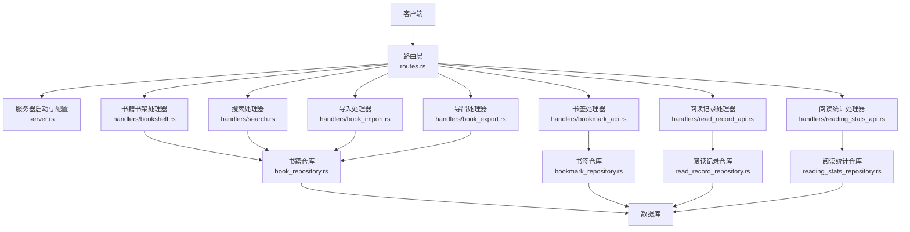
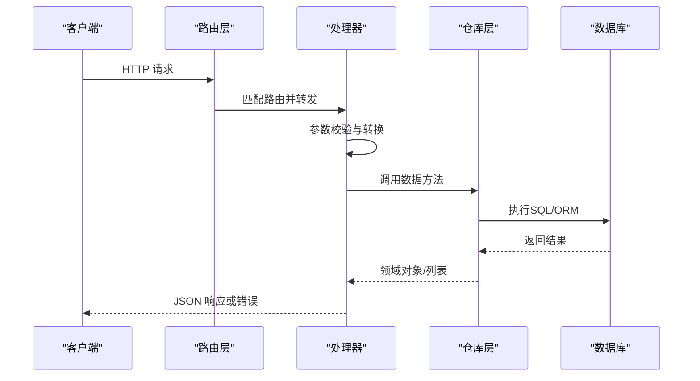
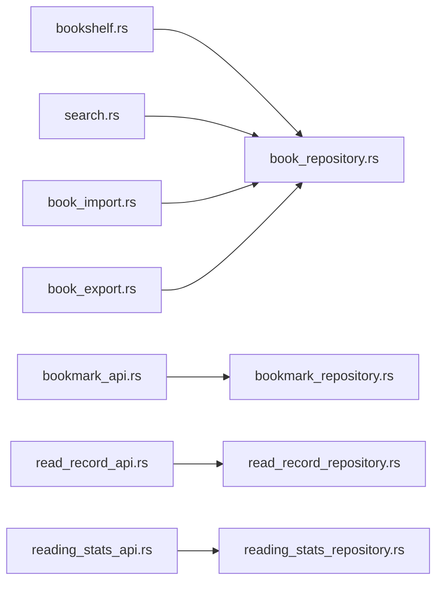

# 书籍管理API

<cite>
**本文档引用的文件**   
- [routes.rs](file://rust/legado-server/src/routes.rs)
- [server.rs](file://rust/legado-server/src/server.rs)
- [handlers/bookshelf.rs](file://rust/legado-server/src/handlers/bookshelf.rs)
- [handlers/search.rs](file://rust/legado-server/src/handlers/search.rs)
- [handlers/book_import.rs](file://rust/legado-server/src/handlers/book_import.rs)
- [handlers/book_export.rs](file://rust/legado-server/src/handlers/book_export.rs)
- [handlers/bookmark_api.rs](file://rust/legado-server/src/handlers/bookmark_api.rs)
- [handlers/read_record_api.rs](file://rust/legado-server/src/handlers/read_record_api.rs)
- [handlers/reading_stats_api.rs](file://rust/legado-server/src/handlers/reading_stats_api.rs)
- [book_repository.rs](file://rust/legado-db/src/repository/book_repository.rs)
- [bookmark_repository.rs](file://rust/legado-db/src/repository/bookmark_repository.rs)
- [read_record_repository.rs](file://rust/legado-db/src/repository/read_record_repository.rs)
- [reading_stats_repository.rs](file://rust/legado-db/src/repository/reading_stats_repository.rs)
- [book.rs](file://rust/legado-core/src/models/book.rs)
- [error.rs](file://rust/legado-server/src/error.rs)
</cite>

## 目录
1. [简介](#简介)
2. [项目结构](#项目结构)
3. [核心组件](#核心组件)
4. [架构总览](#架构总览)
5. [详细组件分析](#详细组件分析)
6. [依赖分析](#依赖分析)
7. [性能考虑](#性能考虑)
8. [故障排查指南](#故障排查指南)
9. [结论](#结论)
10. [附录](#附录)

## 简介
本文件为Legado项目的“书籍管理RESTful API”接口文档，覆盖书籍CRUD、搜索、导入导出、元数据管理、阅读进度同步与书签管理等能力。文档面向开发者与集成方，提供端点URL模式、请求参数、响应数据结构、分页机制、错误处理与示例说明，帮助快速对接并稳定使用。

## 项目结构
后端服务由Rust实现，采用分层架构：路由层 -> 处理器（Handlers）-> 领域仓库（Repositories）-> 数据库。Web前端位于modules/web，通过HTTP调用后端API。

图表来源
- [routes.rs](file://rust/legado-server/src/routes.rs)
- [server.rs](file://rust/legado-server/src/server.rs)
- [handlers/bookshelf.rs](file://rust/legado-server/src/handlers/bookshelf.rs)
- [handlers/search.rs](file://rust/legado-server/src/handlers/search.rs)
- [handlers/book_import.rs](file://rust/legado-server/src/handlers/book_import.rs)
- [handlers/book_export.rs](file://rust/legado-server/src/handlers/book_export.rs)
- [handlers/bookmark_api.rs](file://rust/legado-server/src/handlers/bookmark_api.rs)
- [handlers/read_record_api.rs](file://rust/legado-server/src/handlers/read_record_api.rs)
- [handlers/reading_stats_api.rs](file://rust/legado-server/src/handlers/reading_stats_api.rs)
- [book_repository.rs](file://rust/legado-db/src/repository/book_repository.rs)
- [bookmark_repository.rs](file://rust/legado-db/src/repository/bookmark_repository.rs)
- [read_record_repository.rs](file://rust/legado-db/src/repository/read_record_repository.rs)
- [reading_stats_repository.rs](file://rust/legado-db/src/repository/reading_stats_repository.rs)

章节来源
- [routes.rs](file://rust/legado-server/src/routes.rs)
- [server.rs](file://rust/legado-server/src/server.rs)

## 核心组件
- 路由层：集中定义HTTP路径与方法映射，将请求分发到对应处理器。
- 处理器（Handlers）：解析请求参数、调用仓库层、封装响应与错误。
- 仓库层（Repositories）：封装数据库访问逻辑，提供增删改查与批量操作。
- 模型（Models）：定义书籍、书签、阅读记录等数据结构。
- 错误处理：统一错误码与消息格式，便于客户端一致处理。

章节来源
- [routes.rs](file://rust/legado-server/src/routes.rs)
- [error.rs](file://rust/legado-server/src/error.rs)
- [book.rs](file://rust/legado-core/src/models/book.rs)

## 架构总览
整体遵循“请求-路由-处理器-仓库-数据库”的清晰链路，保证职责分离与可测试性。所有对外暴露的REST接口均经过路由层注册，处理器负责参数校验与业务编排，仓库层专注数据持久化。

图表来源
- [routes.rs](file://rust/legado-server/src/routes.rs)
- [handlers/bookshelf.rs](file://rust/legado-server/src/handlers/bookshelf.rs)
- [book_repository.rs](file://rust/legado-db/src/repository/book_repository.rs)

## 详细组件分析

### 书籍CRUD接口
- 添加书籍
  - URL模式：POST /api/books
  - 请求体：包含书名、作者、封面、分类、标签、源信息、本地路径等字段（以实际处理器定义为准）。
  - 响应：成功返回书籍对象；失败返回错误对象。
- 删除书籍
  - URL模式：DELETE /api/books/{id}
  - 路径参数：id（书籍ID）
  - 响应：成功返回空或状态；失败返回错误对象。
- 更新书籍信息
  - URL模式：PUT /api/books/{id}
  - 路径参数：id（书籍ID）
  - 请求体：需要更新的字段集合（部分更新）。
  - 响应：返回更新后的书籍对象或错误。
- 获取书籍列表
  - URL模式：GET /api/books
  - 查询参数：page、pageSize、keyword、category、sort、order 等。
  - 响应：分页对象，包含数据列表与分页元信息。

数据验证规则
- ID必须为正整数。
- 关键字长度限制与特殊字符过滤。
- 分类与标签需符合枚举或白名单。
- 文件大小与类型在导入时校验。

分页机制
- 支持page与pageSize参数，默认值由服务端设定。
- 返回列表包含total、hasNext等分页元信息。

错误处理
- 统一错误码与消息，如参数缺失、权限不足、资源不存在等。

章节来源
- [handlers/bookshelf.rs](file://rust/legado-server/src/handlers/bookshelf.rs)
- [book_repository.rs](file://rust/legado-db/src/repository/book_repository.rs)
- [book.rs](file://rust/legado-core/src/models/book.rs)

### 书籍搜索API
- 搜索端点
  - URL模式：GET /api/search
  - 查询参数：
    - keyword：关键词（支持模糊匹配）
    - category：分类过滤
    - sort：排序字段（如更新时间、评分、标题）
    - order：排序方向（asc/desc）
    - page、pageSize：分页
  - 响应：搜索结果列表与分页元信息。

搜索算法要点
- 关键词匹配优先命中标题与作者。
- 分类过滤基于分类ID或名称。
- 排序支持多字段组合（按优先级）。

章节来源
- [handlers/search.rs](file://rust/legado-server/src/handlers/search.rs)
- [book_repository.rs](file://rust/legado-db/src/repository/book_repository.rs)

### 书籍导入导出API
- 导入
  - URL模式：POST /api/import
  - 请求：multipart/form-data，支持epub/txt/pdf/mobi/umd等多种格式。
  - 行为：解析元数据、去重、入库、生成目录。
  - 响应：导入任务ID或结果摘要。
- 导出
  - URL模式：GET /api/export
  - 查询参数：ids（批量ID）、format（json/csv/zip等）、scope（全部/指定分类）。
  - 响应：下载文件或任务状态。

导入流程图

图表来源
- [handlers/book_import.rs](file://rust/legado-server/src/handlers/book_import.rs)
- [book_repository.rs](file://rust/legado-db/src/repository/book_repository.rs)

章节来源
- [handlers/book_import.rs](file://rust/legado-server/src/handlers/book_import.rs)
- [handlers/book_export.rs](file://rust/legado-server/src/handlers/book_export.rs)

### 书籍元数据管理
- 元数据读取与更新
  - URL模式：GET /api/books/{id}/metadata、PUT /api/books/{id}/metadata
  - 功能：读取/更新封面、作者、描述、分类、标签、出版信息等。
  - 校验：字段合法性与长度限制。
- 批量元数据修正
  - URL模式：POST /api/books/batch/update-metadata
  - 请求体：批量ID与字段映射。

章节来源
- [handlers/bookshelf.rs](file://rust/legado-server/src/handlers/bookshelf.rs)
- [book_repository.rs](file://rust/legado-db/src/repository/book_repository.rs)

### 阅读进度同步
- 读取记录
  - URL模式：GET /api/read-record/{bookId}、PUT /api/read-record/{bookId}
  - 字段：当前章节、页码、阅读时间、位置偏移等。
  - 行为：增量更新，避免并发冲突。
- 同步策略
  - 支持最后写入优先或合并策略（按时间戳）。

章节来源
- [handlers/read_record_api.rs](file://rust/legado-server/src/handlers/read_record_api.rs)
- [read_record_repository.rs](file://rust/legado-db/src/repository/read_record_repository.rs)

### 书签管理
- 书签CRUD
  - URL模式：
    - GET /api/bookmarks?bookId=...
    - POST /api/bookmarks
    - PUT /api/bookmarks/{id}
    - DELETE /api/bookmarks/{id}
  - 字段：书签位置、章节、备注、创建时间。
- 批量操作
  - URL模式：POST /api/bookmarks/batch
  - 行为：批量新增/更新/删除。

章节来源
- [handlers/bookmark_api.rs](file://rust/legado-server/src/handlers/bookmark_api.rs)
- [bookmark_repository.rs](file://rust/legado-db/src/repository/bookmark_repository.rs)

### 阅读统计
- 统计接口
  - URL模式：GET /api/stats/reading
  - 参数：时间范围、书籍ID、维度（日/周/月）。
  - 响应：阅读时长、章节数、活跃度等指标。

章节来源
- [handlers/reading_stats_api.rs](file://rust/legado-server/src/handlers/reading_stats_api.rs)
- [reading_stats_repository.rs](file://rust/legado-db/src/repository/reading_stats_repository.rs)

## 依赖分析
处理器与仓库之间的依赖关系如下：

图表来源
- [handlers/bookshelf.rs](file://rust/legado-server/src/handlers/bookshelf.rs)
- [handlers/search.rs](file://rust/legado-server/src/handlers/search.rs)
- [handlers/book_import.rs](file://rust/legado-server/src/handlers/book_import.rs)
- [handlers/book_export.rs](file://rust/legado-server/src/handlers/book_export.rs)
- [handlers/bookmark_api.rs](file://rust/legado-server/src/handlers/bookmark_api.rs)
- [handlers/read_record_api.rs](file://rust/legado-server/src/handlers/read_record_api.rs)
- [handlers/reading_stats_api.rs](file://rust/legado-server/src/handlers/reading_stats_api.rs)
- [book_repository.rs](file://rust/legado-db/src/repository/book_repository.rs)
- [bookmark_repository.rs](file://rust/legado-db/src/repository/bookmark_repository.rs)
- [read_record_repository.rs](file://rust/legado-db/src/repository/read_record_repository.rs)
- [reading_stats_repository.rs](file://rust/legado-db/src/repository/reading_stats_repository.rs)

章节来源
- [routes.rs](file://rust/legado-server/src/routes.rs)

## 性能考虑
- 分页与限流：合理设置pageSize上限，避免大结果集拖慢响应。
- 索引优化：对高频查询字段（标题、作者、分类）建立索引。
- 导入异步化：大文件导入建议异步任务，返回任务ID供轮询。
- 缓存策略：对热点书籍元数据与搜索结果进行短期缓存。
- 并发控制：阅读记录与书签更新采用乐观锁或版本号避免冲突。

[本节为通用指导，不直接分析具体文件]

## 故障排查指南
- 常见错误
  - 参数缺失或类型错误：检查请求体与查询参数是否符合规范。
  - 资源不存在：确认ID有效性及权限。
  - 导入失败：检查文件格式、大小与编码。
- 错误响应格式
  - 统一包含code、message、data等字段，便于客户端统一处理。
- 日志定位
  - 查看处理器与仓库层的日志输出，定位异常堆栈。

章节来源
- [error.rs](file://rust/legado-server/src/error.rs)

## 结论
本API文档覆盖了书籍管理的核心能力与高级特性，提供了清晰的端点定义、数据模型与错误处理规范。建议集成方严格遵循参数校验与分页约定，结合异步导入与缓存策略提升稳定性与性能。

[本节为总结性内容，不直接分析具体文件]

## 附录
- 术语表
  - 书籍：指电子书实体，包含元数据与内容引用。
  - 书签：读者在阅读过程中标记的关键位置。
  - 阅读记录：记录读者的阅读进度与时间。
  - 导入/导出：批量数据的输入与输出操作。
- 版本兼容
  - 接口变更遵循向后兼容原则，废弃字段保留一段时间。

[本节为补充信息，不直接分析具体文件]