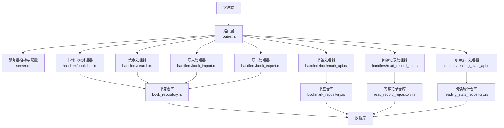
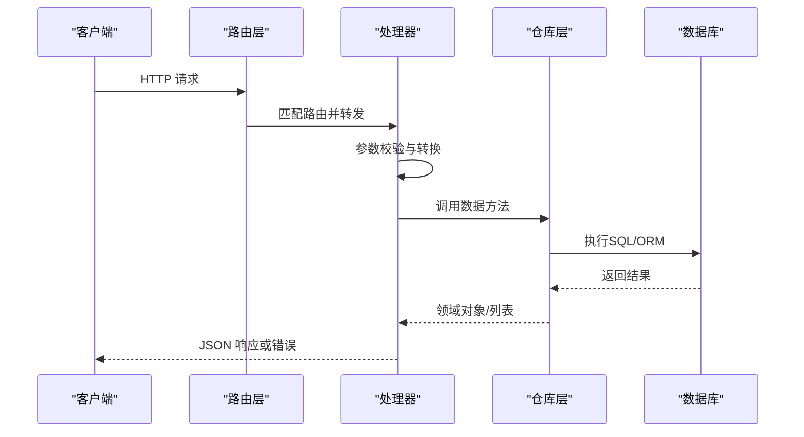
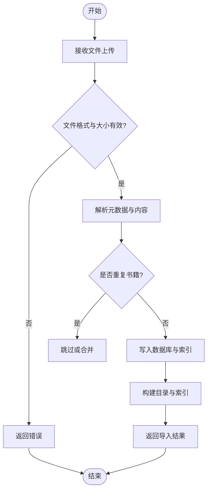
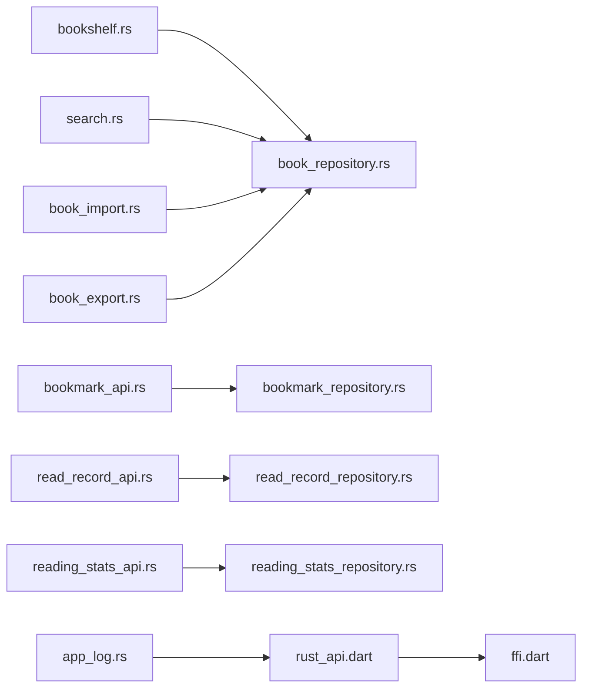

# 书籍管理API

<cite>
**本文档引用的文件**   
- [routes.rs](file://rust/legado-server/src/routes.rs)
- [bookshelf.rs](file://rust/legado-server/src/handlers/bookshelf.rs)
- [search.rs](file://rust/legado-server/src/handlers/search.rs)
- [book_group_api.rs](file://rust/legado-ffi/src/api/book_group_api.rs)
- [book_repository.rs](file://rust/legado-db/src/repository/book_repository.rs)
- [book.rs](file://rust/legado-core/src/models/book.rs)
- [error.rs](file://rust/legado-server/src/error.rs)
- [app_log.rs](file://rust/legado-core/src/app_log.rs)
- [rust_api.dart](file://flutter_legado/lib/src/services/rust_api.dart)
- [ffi.dart](file://flutter_legado/lib/src/bridge/ffi/ffi.dart)
</cite>

## 更新摘要
**变更内容**   
- 新增应用日志API方法（appLogPush, appLogList, appLogClear, appLogClearAll, appLogExport）以满足合同§2.38要求
- 在rust_api.dart中通过FFI绑定实现应用日志功能
- 补充应用日志系统的完整接口文档，包括三级日志管理和导出功能
- 更新FFI桥接层的应用日志调用方式

## 目录
1. [简介](#简介)
2. [项目结构](#项目结构)
3. [核心组件](#核心组件)
4. [架构总览](#架构总览)
5. [详细组件分析](#详细组件分析)
6. [依赖分析](#依赖分析)
7. [性能考虑](#性能考虑)
8. [故障排查指南](#故障排查指南)
9. [结论](#结论)
10. [附录](#附录)

## 简介
本文件为Legado项目的"书籍管理RESTful API"接口文档，覆盖书籍CRUD、搜索、导入导出、元数据管理、阅读进度同步与书签管理等能力。文档面向开发者与集成方，提供端点URL模式、请求参数、响应数据结构、分页机制、错误处理与示例说明，帮助快速对接并稳定使用。

## 项目结构
后端服务由Rust实现，采用分层架构：路由层 -> 处理器（Handlers）-> 领域仓库（Repositories）-> 数据库。Web前端位于modules/web，通过HTTP调用后端API。Flutter客户端通过FFI桥接层调用Rust核心功能。

图表来源
- [routes.rs](file://rust/legado-server/src/routes.rs)
- [bookshelf.rs](file://rust/legado-server/src/handlers/bookshelf.rs)
- [book_repository.rs](file://rust/legado-db/src/repository/book_repository.rs)

章节来源
- [routes.rs](file://rust/legado-server/src/routes.rs)

## 核心组件
- 路由层：集中定义HTTP路径与方法映射，将请求分发到对应处理器。
- 处理器（Handlers）：解析请求参数、调用仓库层、封装响应与错误。
- 仓库层（Repositories）：封装数据库访问逻辑，提供增删改查与批量操作。
- 模型（Models）：定义书籍、书签、阅读记录等数据结构。
- 错误处理：统一错误码与消息格式，便于客户端一致处理。
- FFI桥接层：Flutter与Rust之间的跨语言调用接口。

章节来源
- [routes.rs](file://rust/legado-server/src/routes.rs)
- [error.rs](file://rust/legado-server/src/error.rs)
- [book.rs](file://rust/legado-core/src/models/book.rs)

## 架构总览
整体遵循"请求-路由-处理器-仓库-数据库"的清晰链路，保证职责分离与可测试性。所有对外暴露的REST接口均经过路由层注册，处理器负责参数校验与业务编排，仓库层专注数据持久化。Flutter客户端通过FFI桥接层直接调用Rust核心功能。

图表来源
- [routes.rs](file://rust/legado-server/src/routes.rs)
- [bookshelf.rs](file://rust/legado-server/src/handlers/bookshelf.rs)
- [book_repository.rs](file://rust/legado-db/src/repository/book_repository.rs)

## 详细组件分析

### 书籍CRUD接口
- 添加书籍
  - URL模式：POST /api/books
  - 请求体：CreateBookRequest结构，包含book_url、name、author、origin、origin_name、cover_url、intro等字段
  - 响应：成功返回201状态码和书籍对象；失败返回错误对象
- 删除书籍
  - URL模式：DELETE /api/books/{book_url}
  - 路径参数：book_url（书籍URL标识）
  - 响应：成功返回删除确认信息；失败返回错误对象
- 更新书籍信息
  - URL模式：PUT /api/books/{book_url}
  - 路径参数：book_url（书籍URL标识）
  - 请求体：需要更新的字段集合（部分更新）
  - 响应：返回更新后的书籍对象或错误
- 获取书籍列表
  - URL模式：GET /api/books
  - 响应：包含books数组和total总数的JSON对象
- 获取单本书籍详情
  - URL模式：GET /api/books/{book_url}
  - 路径参数：book_url（书籍URL标识）
  - 响应：书籍详细信息或未找到错误

数据验证规则
- book_url必须为非空字符串
- name字段必填且长度限制
- author、origin等可选字段需符合字符串格式
- cover_url需为有效URL格式

章节来源
- [bookshelf.rs:17-27](file://rust/legado-server/src/handlers/bookshelf.rs#L17-L27)
- [bookshelf.rs:29-108](file://rust/legado-server/src/handlers/bookshelf.rs#L29-L108)
- [book_repository.rs](file://rust/legado-db/src/repository/book_repository.rs)
- [book.rs](file://rust/legado-core/src/models/book.rs)

### 书籍搜索API
- 搜索端点
  - URL模式：POST /api/search
  - 请求体：包含关键词、分类、排序等搜索条件
  - 响应：搜索结果列表与分页元信息
- 多源搜索
  - URL模式：POST /api/search/multi
  - 功能：支持多个书源的并行搜索
- 取消搜索
  - URL模式：POST /api/search/cancel
  - 功能：取消正在进行的搜索任务

搜索算法要点
- 关键词匹配优先命中标题与作者
- 分类过滤基于分类ID或名称
- 排序支持多字段组合（按优先级）

章节来源
- [routes.rs:68-70](file://rust/legado-server/src/routes.rs#L68-L70)
- [search.rs](file://rust/legado-server/src/handlers/search.rs)
- [book_repository.rs](file://rust/legado-db/src/repository/book_repository.rs)

### 书籍分组管理API
**新增** 书籍分组管理功能，支持分组的增删改查操作

- 获取所有分组
  - URL模式：GET /api/book-groups
  - 响应：按order升序排列的分组列表
- 添加分组
  - URL模式：POST /api/book-groups
  - 请求体：group_name、cover、order等字段
  - 响应：新创建的分组ID
- 更新分组
  - URL模式：PUT /api/book-groups/{id}
  - 路径参数：id（分组ID）
  - 请求体：需要更新的字段
  - 响应：更新结果布尔值
- 删除分组
  - URL模式：DELETE /api/book-groups/{id}
  - 路径参数：id（分组ID）
  - 响应：删除结果布尔值
- 设置显示状态
  - URL模式：PUT /api/book-groups/{id}/show
  - 路径参数：id（分组ID）
  - 请求体：show布尔值
  - 响应：设置结果布尔值

**序列化规范**
BookGroupDto使用#[serde(rename_all = "camelCase")]属性，确保JSON字段名采用驼峰命名：
- group_id → groupId
- group_name → groupName  
- cover → cover
- order → order
- show → show

章节来源
- [book_group_api.rs:12-24](file://rust/legado-ffi/src/api/book_group_api.rs#L12-L24)
- [book_group_api.rs:26-107](file://rust/legado-ffi/src/api/book_group_api.rs#L26-L107)

### 书籍导入导出API
- 导入
  - URL模式：POST /api/import
  - 请求：multipart/form-data，支持epub/txt/pdf/mobi/umd等多种格式
  - 行为：解析元数据、去重、入库、生成目录
  - 响应：导入任务ID或结果摘要
- 导出
  - URL模式：GET /api/export
  - 查询参数：ids（批量ID）、format（json/csv/zip等）、scope（全部/指定分类）
  - 响应：下载文件或任务状态

导入流程图

章节来源
- [book_import.rs](file://rust/legado-ffi/src/api/book_import.rs)
- [book_export.rs](file://rust/legado-server/src/handlers/book_export.rs)

### 书籍元数据管理
- 元数据读取与更新
  - URL模式：GET /api/books/{id}/metadata、PUT /api/books/{id}/metadata
  - 功能：读取/更新封面、作者、描述、分类、标签、出版信息等
  - 校验：字段合法性与长度限制
- 批量元数据修正
  - URL模式：POST /api/books/batch/update-metadata
  - 请求体：批量ID与字段映射

章节来源
- [bookshelf.rs](file://rust/legado-server/src/handlers/bookshelf.rs)
- [book_repository.rs](file://rust/legado-db/src/repository/book_repository.rs)

### 阅读进度同步
- 读取记录
  - URL模式：GET /api/read-record/{bookId}、PUT /api/read-record/{bookId}
  - 字段：当前章节、页码、阅读时间、位置偏移等
  - 行为：增量更新，避免并发冲突
- 同步策略
  - 支持最后写入优先或合并策略（按时间戳）

章节来源
- [read_record_api.rs](file://rust/legado-server/src/handlers/read_record_api.rs)
- [read_record_repository.rs](file://rust/legado-db/src/repository/read_record_repository.rs)

### 书签管理
- 书签CRUD
  - URL模式：
    - GET /api/bookmarks?bookId=...
    - POST /api/bookmarks
    - PUT /api/bookmarks/{id}
    - DELETE /api/bookmarks/{id}
  - 字段：书签位置、章节、备注、创建时间
- 批量操作
  - URL模式：POST /api/bookmarks/batch
  - 行为：批量新增/更新/删除

章节来源
- [bookmark_api.rs](file://rust/legado-server/src/handlers/bookmark_api.rs)
- [bookmark_repository.rs](file://rust/legado-db/src/repository/bookmark_repository.rs)

### 阅读统计
- 统计接口
  - URL模式：GET /api/stats/reading
  - 参数：时间范围、书籍ID、维度（日/周/月）
  - 响应：阅读时长、章节数、活跃度等指标

章节来源
- [reading_stats_api.rs](file://rust/legado-server/src/handlers/reading_stats_api.rs)
- [reading_stats_repository.rs](file://rust/legado-db/src/repository/reading_stats_repository.rs)

### 应用日志管理API
**新增** 应用日志管理系统，支持三级日志（message/crash/http）的存储、查询、清理和导出功能

#### 日志写入
- 方法：appLogPush
- 参数：level（日志级别：message/crash/http，大小写不敏感）、message（日志消息）
- 行为：向指定级别的环形缓冲写入日志条目，最新条目在队首
- 响应：无返回值（异步写入）

#### 日志查询
- 方法：appLogList
- 参数：level（指定日志级别）
- 响应：JSON数组格式的日志列表，每项包含timestamp（毫秒）、level、message字段
- 排序：最新日志在前（队首）

#### 日志清理
- 方法：appLogClear
- 参数：level（指定要清理的日志级别）
- 行为：清空指定级别的所有日志
- 响应：无返回值

- 方法：appLogClearAll
- 参数：无
- 行为：清空所有级别（message/crash/http）的日志
- 响应：无返回值

#### 日志导出
- 方法：appLogExport
- 参数：无
- 行为：将所有级别日志合并并按时间升序格式化输出
- 响应：格式化文本字符串，超过64,000字符时自动截断并添加标记

**日志系统特性**
- 三级独立缓冲：每级容量上限500条，互不干扰
- 线程安全：使用Mutex保护并发访问
- 环形淘汰：超出容量时自动淘汰最旧条目
- 时间戳格式：yyyy-MM-dd HH:mm:ss.SSS（UTC时间）
- 导出格式：每行包含时间戳、级别标签和消息内容

章节来源
- [app_log.rs:1-200](file://rust/legado-core/src/app_log.rs#L1-L200)
- [app_log.rs:200-504](file://rust/legado-core/src/app_log.rs#L200-L504)
- [rust_api.dart:735-754](file://flutter_legado/lib/src/services/rust_api.dart#L735-L754)
- [ffi.dart:1240-1263](file://flutter_legado/lib/src/bridge/ffi/ffi.dart#L1240-L1263)

## 依赖分析
处理器与仓库之间的依赖关系如下：

图表来源
- [routes.rs](file://rust/legado-server/src/routes.rs)
- [bookshelf.rs](file://rust/legado-server/src/handlers/bookshelf.rs)
- [search.rs](file://rust/legado-server/src/handlers/search.rs)
- [book_import.rs](file://rust/legado-ffi/src/api/book_import.rs)
- [book_export.rs](file://rust/legado-server/src/handlers/book_export.rs)
- [bookmark_api.rs](file://rust/legado-server/src/handlers/bookmark_api.rs)
- [read_record_api.rs](file://rust/legado-server/src/handlers/read_record_api.rs)
- [reading_stats_api.rs](file://rust/legado-server/src/handlers/reading_stats_api.rs)
- [book_repository.rs](file://rust/legado-db/src/repository/book_repository.rs)
- [bookmark_repository.rs](file://rust/legado-db/src/repository/bookmark_repository.rs)
- [read_record_repository.rs](file://rust/legado-db/src/repository/read_record_repository.rs)
- [reading_stats_repository.rs](file://rust/legado-db/src/repository/reading_stats_repository.rs)
- [app_log.rs](file://rust/legado-core/src/app_log.rs)
- [rust_api.dart](file://flutter_legado/lib/src/services/rust_api.dart)
- [ffi.dart](file://flutter_legado/lib/src/bridge/ffi/ffi.dart)

章节来源
- [routes.rs](file://rust/legado-server/src/routes.rs)

## 性能考虑
- 分页与限流：合理设置pageSize上限，避免大结果集拖慢响应
- 索引优化：对高频查询字段（标题、作者、分类）建立索引
- 导入异步化：大文件导入建议异步任务，返回任务ID供轮询
- 缓存策略：对热点书籍元数据与搜索结果进行短期缓存
- 并发控制：阅读记录与书签更新采用乐观锁或版本号避免冲突
- 日志缓冲：应用日志采用环形缓冲设计，避免内存溢出
- 导出限制：日志导出限制64KB字符，防止响应过大

## 故障排查指南
- 常见错误
  - 参数缺失或类型错误：检查请求体与查询参数是否符合规范
  - 资源不存在：确认ID有效性及权限
  - 导入失败：检查文件格式、大小与编码
  - 日志级别无效：确认level参数为message/crash/http之一
- 错误响应格式
  - 统一包含code、message、data等字段，便于客户端统一处理
- 日志定位
  - 查看处理器与仓库层的日志输出，定位异常堆栈
  - 使用应用日志API查询message/crash/http级别的日志信息

章节来源
- [error.rs](file://rust/legado-server/src/error.rs)

## 结论
本API文档覆盖了书籍管理的核心能力与高级特性，提供了清晰的端点定义、数据模型与错误处理规范。新增的应用日志管理系统为调试和问题排查提供了强有力的工具。建议集成方严格遵循参数校验与分页约定，结合异步导入与缓存策略提升稳定性与性能。

## 附录
- 术语表
  - 书籍：指电子书实体，包含元数据与内容引用
  - 书签：读者在阅读过程中标记的关键位置
  - 阅读记录：记录读者的阅读进度与时间
  - 导入/导出：批量数据的输入与输出操作
  - 书籍分组：用于组织和管理书籍的分类容器
  - 应用日志：系统运行时的消息、崩溃和HTTP请求日志
- 版本兼容
  - 接口变更遵循向后兼容原则，废弃字段保留一段时间
- 序列化规范
  - BookGroupDto使用camelCase命名约定，确保与Dart侧JsonKey注解对齐
  - 日志条目使用snake_case命名（timestamp/level/message）
- FFI桥接
  - Flutter通过FFI层直接调用Rust核心功能
  - 支持异步调用和错误处理