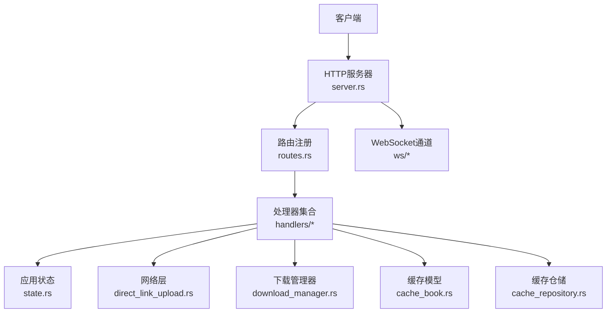
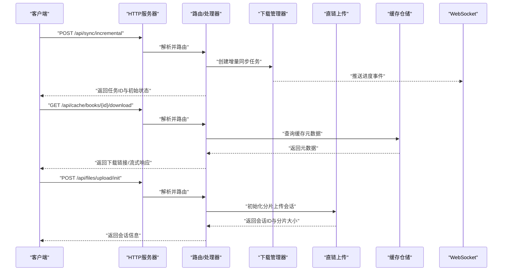
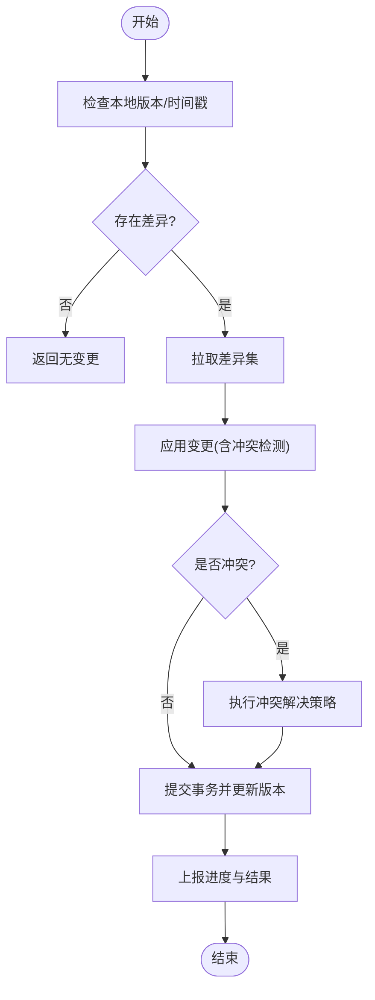
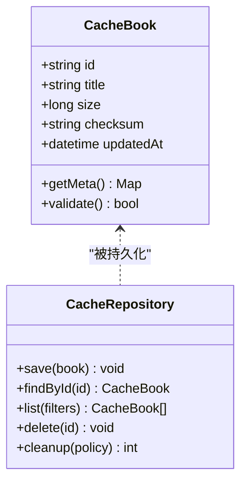
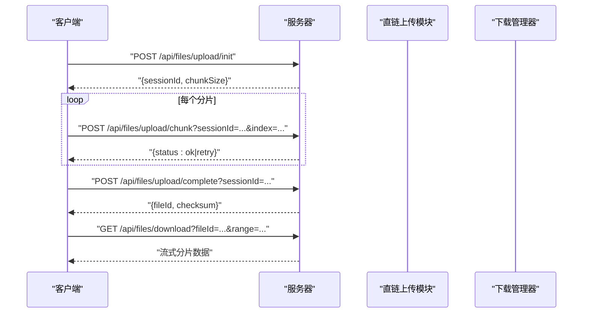
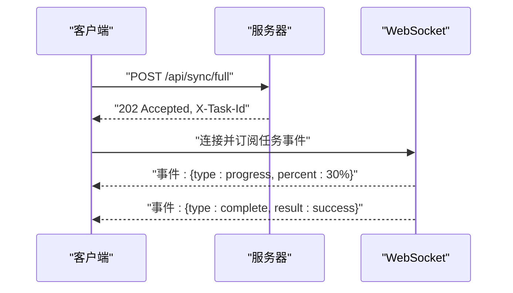
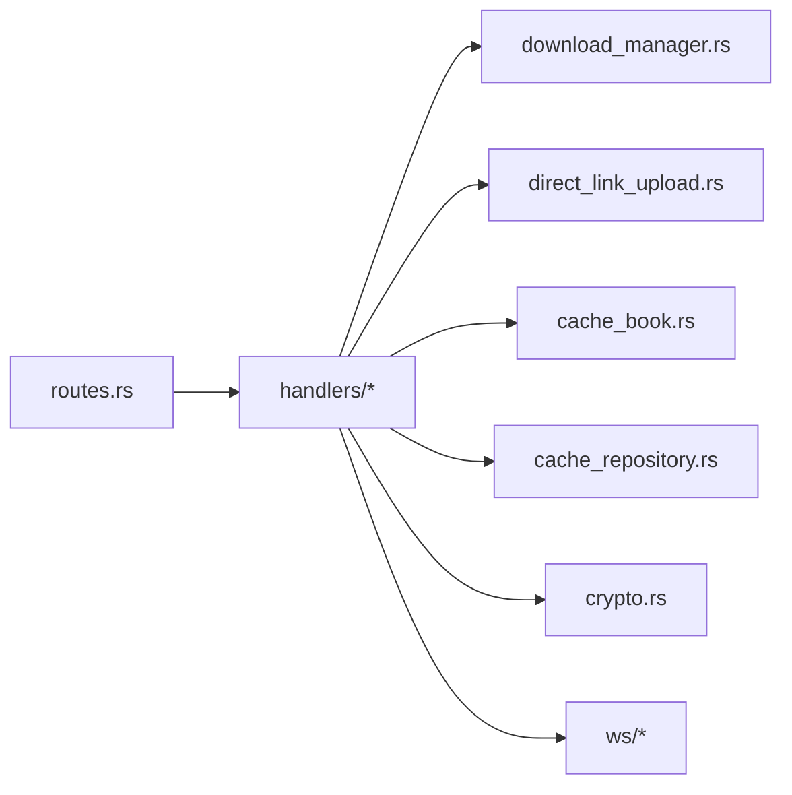

# 同步服务API

<cite>
**本文引用的文件**   
- [rust/legado-server/src/routes.rs](file://rust/legado-server/src/routes.rs)
- [rust/legado-server/src/server.rs](file://rust/legado-server/src/server.rs)
- [rust/legado-server/src/state.rs](file://rust/legado-server/src/state.rs)
- [rust/legado-server/src/handlers/mod.rs](file://rust/legado-server/src/handlers/mod.rs)
- [rust/legado-server/src/ws/mod.rs](file://rust/legado-server/src/ws/mod.rs)
- [rust/legado-net/src/direct_link_upload.rs](file://rust/legado-net/src/direct_link_upload.rs)
- [rust/legado-core/src/download_manager.rs](file://rust/legado-core/src/download_manager.rs)
- [rust/legado-core/src/crypto.rs](file://rust/legado-core/src/crypto.rs)
- [rust/legado-core/src/cache_book.rs](file://rust/legado-core/src/cache_book.rs)
- [rust/legado-db/src/repository/cache_repository.rs](file://rust/legado-db/src/repository/cache_repository.rs)
- [modules/web/public/scripts/sync.js](file://modules/web/public/scripts/sync.js)
</cite>

## 目录
1. [简介](#简介)
2. [项目结构](#项目结构)
3. [核心组件](#核心组件)
4. [架构总览](#架构总览)
5. [详细组件分析](#详细组件分析)
6. [依赖关系分析](#依赖关系分析)
7. [性能考虑](#性能考虑)
8. [故障排查指南](#故障排查指南)
9. [结论](#结论)
10. [附录：接口清单与示例](#附录接口清单与示例)

## 简介
本文件为Legado项目的“同步服务”RESTful API文档，聚焦数据同步、缓存管理与文件传输三大能力。内容覆盖增量同步、全量同步、冲突解决、书籍缓存上传/下载/清理、大文件分块上传与断点续传、并发下载、状态跟踪与进度报告、错误恢复机制，以及数据压缩、加密传输与版本控制等高级特性。读者可据此快速集成客户端或自动化流程。

## 项目结构
同步服务由Rust后端提供HTTP与WebSocket能力，结合网络层、下载管理器、缓存与数据库仓储实现完整的数据同步链路。关键位置如下：
- HTTP路由与服务启动：routes.rs、server.rs
- 应用状态与会话：state.rs
- 处理器（Handlers）：handlers/*
- WebSocket通道（用于进度与事件推送）：ws/*
- 直链上传与大文件传输：direct_link_upload.rs
- 下载管理（断点续传、并发下载）：download_manager.rs
- 加密工具：crypto.rs
- 书籍缓存模型与操作：cache_book.rs
- 缓存仓储（持久化）：cache_repository.rs
- Web端同步脚本（参考调用方式）：sync.js

图表来源 
- [rust/legado-server/src/server.rs](file://rust/legado-server/src/server.rs)
- [rust/legado-server/src/routes.rs](file://rust/legado-server/src/routes.rs)
- [rust/legado-server/src/state.rs](file://rust/legado-server/src/state.rs)
- [rust/legado-server/src/handlers/mod.rs](file://rust/legado-server/src/handlers/mod.rs)
- [rust/legado-server/src/ws/mod.rs](file://rust/legado-server/src/ws/mod.rs)
- [rust/legado-net/src/direct_link_upload.rs](file://rust/legado-net/src/direct_link_upload.rs)
- [rust/legado-core/src/download_manager.rs](file://rust/legado-core/src/download_manager.rs)
- [rust/legado-core/src/cache_book.rs](file://rust/legado-core/src/cache_book.rs)
- [rust/legado-db/src/repository/cache_repository.rs](file://rust/legado-db/src/repository/cache_repository.rs)

章节来源
- [rust/legado-server/src/server.rs](file://rust/legado-server/src/server.rs)
- [rust/legado-server/src/routes.rs](file://rust/legado-server/src/routes.rs)
- [rust/legado-server/src/state.rs](file://rust/legado-server/src/state.rs)
- [rust/legado-server/src/handlers/mod.rs](file://rust/legado-server/src/handlers/mod.rs)
- [rust/legado-server/src/ws/mod.rs](file://rust/legado-server/src/ws/mod.rs)
- [rust/legado-net/src/direct_link_upload.rs](file://rust/legado-net/src/direct_link_upload.rs)
- [rust/legado-core/src/download_manager.rs](file://rust/legado-core/src/download_manager.rs)
- [rust/legado-core/src/cache_book.rs](file://rust/legado-core/src/cache_book.rs)
- [rust/legado-db/src/repository/cache_repository.rs](file://rust/legado-db/src/repository/cache_repository.rs)

## 核心组件
- 路由与控制器：集中定义REST端点，将请求分发至对应处理器。
- 下载管理器：负责分块、断点续传、并发下载与任务调度。
- 直链上传：支持大文件分片上传、校验与合并。
- 缓存系统：书籍缓存的增删改查、批量导出/导入、清理策略。
- 加密与安全：传输加密、内容签名、口令保护。
- 状态与进度：通过HTTP响应头与WebSocket事件上报任务状态与进度。

章节来源
- [rust/legado-server/src/routes.rs](file://rust/legado-server/src/routes.rs)
- [rust/legado-server/src/handlers/mod.rs](file://rust/legado-server/src/handlers/mod.rs)
- [rust/legado-core/src/download_manager.rs](file://rust/legado-core/src/download_manager.rs)
- [rust/legado-net/src/direct_link_upload.rs](file://rust/legado-net/src/direct_link_upload.rs)
- [rust/legado-core/src/cache_book.rs](file://rust/legado-core/src/cache_book.rs)
- [rust/legado-core/src/crypto.rs](file://rust/legado-core/src/crypto.rs)

## 架构总览
下图展示从客户端到各子系统的调用路径，包括同步、缓存与文件传输的关键交互。

图表来源 
- [rust/legado-server/src/server.rs](file://rust/legado-server/src/server.rs)
- [rust/legado-server/src/routes.rs](file://rust/legado-server/src/routes.rs)
- [rust/legado-server/src/handlers/mod.rs](file://rust/legado-server/src/handlers/mod.rs)
- [rust/legado-core/src/download_manager.rs](file://rust/legado-core/src/download_manager.rs)
- [rust/legado-net/src/direct_link_upload.rs](file://rust/legado-net/src/direct_link_upload.rs)
- [rust/legado-db/src/repository/cache_repository.rs](file://rust/legado-db/src/repository/cache_repository.rs)
- [rust/legado-server/src/ws/mod.rs](file://rust/legado-server/src/ws/mod.rs)

## 详细组件分析

### 数据同步API
- 增量同步：基于时间戳或版本号拉取差异数据，支持选择性字段更新与冲突检测。
- 全量同步：按快照或全量数据集进行一致性同步，适合冷启动或修复不一致。
- 冲突解决：服务端优先策略、客户端优先策略或合并策略；冲突记录可查询与回滚。

典型流程（增量同步）：

图表来源 
- [rust/legado-server/src/handlers/mod.rs](file://rust/legado-server/src/handlers/mod.rs)
- [rust/legado-core/src/download_manager.rs](file://rust/legado-core/src/download_manager.rs)

章节来源
- [rust/legado-server/src/routes.rs](file://rust/legado-server/src/routes.rs)
- [rust/legado-server/src/handlers/mod.rs](file://rust/legado-server/src/handlers/mod.rs)

### 缓存管理API（书籍缓存）
- 上传：将书籍缓存打包上传，支持校验与去重。
- 下载：按书籍ID或批次获取缓存，支持流式传输与范围请求。
- 清理：按策略清理过期或冗余缓存，释放空间。
- 元数据：查询缓存列表、统计、健康检查。

图表来源 
- [rust/legado-core/src/cache_book.rs](file://rust/legado-core/src/cache_book.rs)
- [rust/legado-db/src/repository/cache_repository.rs](file://rust/legado-db/src/repository/cache_repository.rs)

章节来源
- [rust/legado-core/src/cache_book.rs](file://rust/legado-core/src/cache_book.rs)
- [rust/legado-db/src/repository/cache_repository.rs](file://rust/legado-db/src/repository/cache_repository.rs)

### 文件传输API（大文件分块上传、断点续传、并发下载）
- 分块上传：初始化会话、逐块上传、校验与合并。
- 断点续传：记录已上传分片，支持中断后继续。
- 并发下载：多连接并行下载分片，自动重试与完整性校验。

图表来源 
- [rust/legado-net/src/direct_link_upload.rs](file://rust/legado-net/src/direct_link_upload.rs)
- [rust/legado-core/src/download_manager.rs](file://rust/legado-core/src/download_manager.rs)

章节来源
- [rust/legado-net/src/direct_link_upload.rs](file://rust/legado-net/src/direct_link_upload.rs)
- [rust/legado-core/src/download_manager.rs](file://rust/legado-core/src/download_manager.rs)

### 状态跟踪与进度报告
- HTTP响应头：包含任务ID、当前进度百分比、剩余时间估算等。
- WebSocket事件：实时推送任务开始、进度、完成、失败等事件。
- 轮询接口：提供任务状态查询接口，便于非WS环境使用。

图表来源 
- [rust/legado-server/src/ws/mod.rs](file://rust/legado-server/src/ws/mod.rs)
- [rust/legado-server/src/routes.rs](file://rust/legado-server/src/routes.rs)

章节来源
- [rust/legado-server/src/ws/mod.rs](file://rust/legado-server/src/ws/mod.rs)
- [rust/legado-server/src/routes.rs](file://rust/legado-server/src/routes.rs)

### 安全与高级特性（压缩、加密、版本控制）
- 数据压缩：对传输体启用Gzip/Brotli压缩，减少带宽占用。
- 加密传输：TLS强制、可选内容级加密与签名。
- 版本控制：同步对象附带版本号/时间戳，支持幂等与回滚。

章节来源
- [rust/legado-core/src/crypto.rs](file://rust/legado-core/src/crypto.rs)
- [rust/legado-server/src/server.rs](file://rust/legado-server/src/server.rs)

## 依赖关系分析
- 路由层依赖处理器，处理器依赖下载管理器、直链上传、缓存仓储与加密工具。
- 下载管理器与直链上传模块共同支撑文件传输能力。
- 缓存仓储与缓存模型形成稳定的数据访问边界。
- WebSocket模块与处理器协作，提供实时状态推送。

图表来源 
- [rust/legado-server/src/routes.rs](file://rust/legado-server/src/routes.rs)
- [rust/legado-server/src/handlers/mod.rs](file://rust/legado-server/src/handlers/mod.rs)
- [rust/legado-core/src/download_manager.rs](file://rust/legado-core/src/download_manager.rs)
- [rust/legado-net/src/direct_link_upload.rs](file://rust/legado-net/src/direct_link_upload.rs)
- [rust/legado-core/src/cache_book.rs](file://rust/legado-core/src/cache_book.rs)
- [rust/legado-db/src/repository/cache_repository.rs](file://rust/legado-db/src/repository/cache_repository.rs)
- [rust/legado-core/src/crypto.rs](file://rust/legado-core/src/crypto.rs)
- [rust/legado-server/src/ws/mod.rs](file://rust/legado-server/src/ws/mod.rs)

章节来源
- [rust/legado-server/src/routes.rs](file://rust/legado-server/src/routes.rs)
- [rust/legado-server/src/handlers/mod.rs](file://rust/legado-server/src/handlers/mod.rs)
- [rust/legado-core/src/download_manager.rs](file://rust/legado-core/src/download_manager.rs)
- [rust/legado-net/src/direct_link_upload.rs](file://rust/legado-net/src/direct_link_upload.rs)
- [rust/legado-core/src/cache_book.rs](file://rust/legado-core/src/cache_book.rs)
- [rust/legado-db/src/repository/cache_repository.rs](file://rust/legado-db/src/repository/cache_repository.rs)
- [rust/legado-core/src/crypto.rs](file://rust/legado-core/src/crypto.rs)
- [rust/legado-server/src/ws/mod.rs](file://rust/legado-server/src/ws/mod.rs)

## 性能考虑
- 分块与并发：合理设置分片大小与并发数，平衡内存与吞吐。
- 流式处理：避免一次性加载大文件到内存，采用流式读写。
- 缓存命中：利用ETag/Last-Modified与校验和减少重复传输。
- 压缩策略：根据内容类型选择合适压缩算法，权衡CPU与带宽。
- 资源限流：对高频接口实施速率限制，防止过载。

[本节为通用指导，不直接分析具体文件]

## 故障排查指南
- 常见错误码：
  - 400 参数错误：检查请求体结构与必填字段。
  - 401/403 鉴权失败：确认令牌与权限配置。
  - 404 资源不存在：核对ID与路径。
  - 409 冲突：查看冲突详情并选择解决策略。
  - 413 请求过大：调整分片大小或启用压缩。
  - 429 限流：降低频率或等待退避。
  - 500/502/503 服务端错误：查看日志与依赖服务状态。
- 调试建议：
  - 开启详细日志与追踪ID。
  - 使用WebSocket订阅事件定位问题阶段。
  - 校验分片完整性与顺序。
  - 检查网络代理与TLS配置。

章节来源
- [rust/legado-server/src/routes.rs](file://rust/legado-server/src/routes.rs)
- [rust/legado-server/src/ws/mod.rs](file://rust/legado-server/src/ws/mod.rs)

## 结论
本同步服务API围绕数据同步、缓存管理与文件传输构建，具备高可靠、可扩展与易集成的特点。通过分块上传、断点续传、并发下载与WebSocket实时反馈，满足大规模数据同步场景需求。配合压缩、加密与版本控制，确保传输效率与安全性。建议在生产环境启用限流、监控与审计，以保障稳定性与可观测性。

[本节为总结，不直接分析具体文件]

## 附录：接口清单与示例
以下为常用端点与示例说明（请求/响应格式以JSON为主，部分接口支持流式响应）。

- 数据同步
  - POST /api/sync/incremental
    - 请求体：{lastVersion, lastTimestamp, filters}
    - 响应体：{taskId, status, progress, changes[]}
    - 示例：见[sync.js](file://modules/web/public/scripts/sync.js)
  - POST /api/sync/full
    - 请求体：{scope, strategy}
    - 响应体：{taskId, status, progress}
  - GET /api/sync/task/{taskId}
    - 响应体：{status, progress, error?, resolvedConflicts[]}

- 缓存管理（书籍缓存）
  - POST /api/cache/books/upload
    - 请求体：multipart/form-data（包体+校验信息）
    - 响应体：{bookId, checksum, size, status}
  - GET /api/cache/books/{bookId}/download
    - 响应体：流式数据或下载链接
  - DELETE /api/cache/books/{bookId}
    - 响应体：{deleted: true}
  - GET /api/cache/books
    - 查询参数：page, pageSize, filter
    - 响应体：{items[], total}

- 文件传输
  - POST /api/files/upload/init
    - 请求体：{fileName, fileSize, checksum}
    - 响应体：{sessionId, chunkSize}
  - POST /api/files/upload/chunk
    - 查询参数：sessionId, index
    - 请求体：二进制分片
    - 响应体：{status: ok|retry}
  - POST /api/files/upload/complete
    - 查询参数：sessionId
    - 响应体：{fileId, checksum, url}
  - GET /api/files/download
    - 查询参数：fileId, range
    - 响应体：流式数据

- 状态与进度
  - WebSocket /api/ws/events
    - 事件类型：progress, complete, failed, conflict
    - 消息体：{type, taskId, percent, message}

- 高级特性
  - 压缩：Accept-Encoding: gzip, br
  - 加密：Content-Signature, X-Encrypted-Body
  - 版本控制：If-None-Match, If-Modified-Since

章节来源
- [modules/web/public/scripts/sync.js](file://modules/web/public/scripts/sync.js)
- [rust/legado-server/src/routes.rs](file://rust/legado-server/src/routes.rs)
- [rust/legado-net/src/direct_link_upload.rs](file://rust/legado-net/src/direct_link_upload.rs)
- [rust/legado-core/src/download_manager.rs](file://rust/legado-core/src/download_manager.rs)
- [rust/legado-core/src/cache_book.rs](file://rust/legado-core/src/cache_book.rs)
- [rust/legado-db/src/repository/cache_repository.rs](file://rust/legado-db/src/repository/cache_repository.rs)
- [rust/legado-server/src/ws/mod.rs](file://rust/legado-server/src/ws/mod.rs)