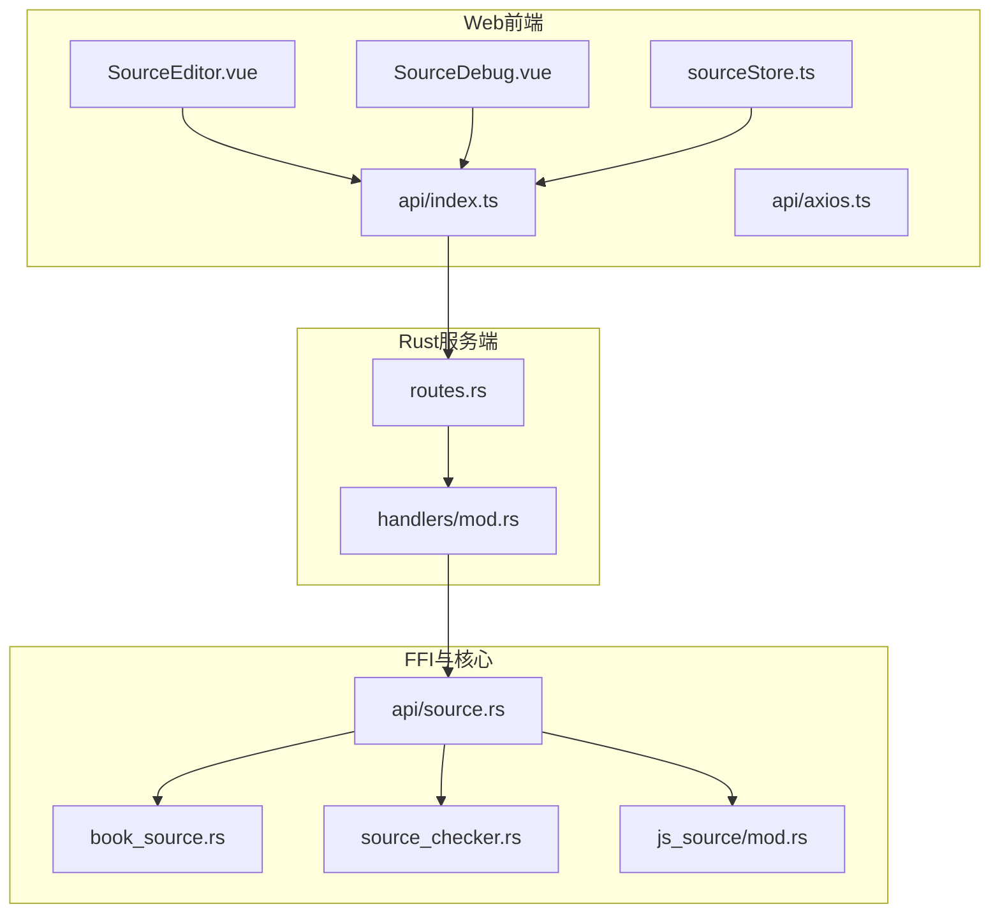
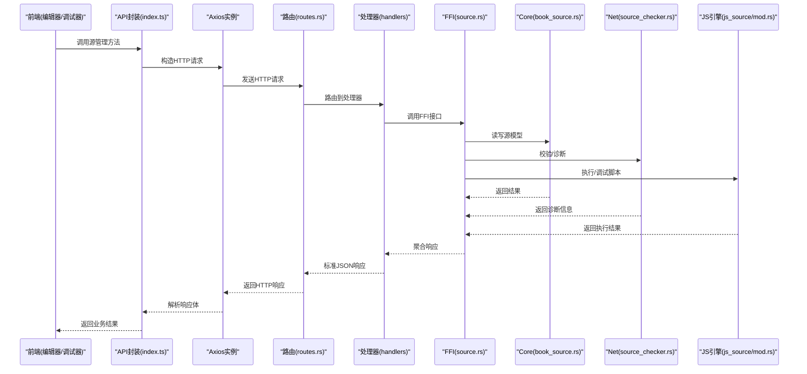
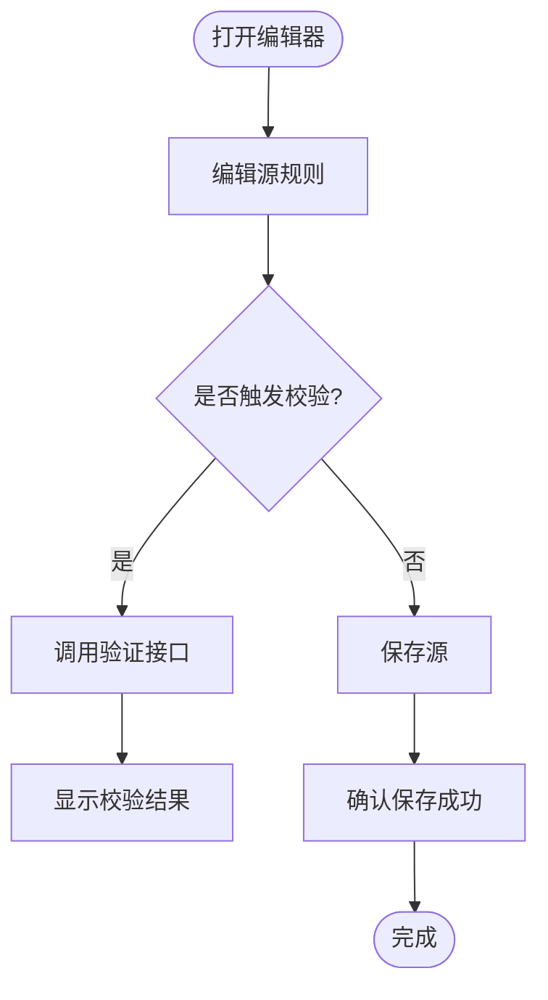
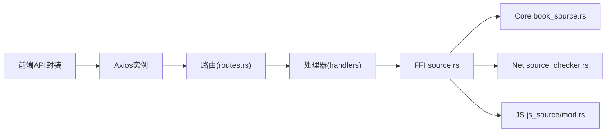

# 源管理API

<cite>
**本文档引用的文件**
- [modules/web/src/api/index.ts](file://modules/web/src/api/index.ts)
- [modules/web/src/api/axios.ts](file://modules/web/src/api/axios.ts)
- [modules/web/src/components/SourceDebug.vue](file://modules/web/src/components/SourceDebug.vue)
- [modules/web/src/pages/source/SourceEditor.vue](file://modules/web/src/pages/source/SourceEditor.vue)
- [modules/web/src/store/sourceStore.ts](file://modules/web/src/store/sourceStore.ts)
- [rust/legado-server/src/routes.rs](file://rust/legado-server/src/routes.rs)
- [rust/legado-server/src/handlers/mod.rs](file://rust/legado-server/src/handlers/mod.rs)
- [rust/legado-ffi/src/api/source.rs](file://rust/legado-ffi/src/api/source.rs)
- [rust/legado-core/src/models/book_source.rs](file://rust/legado-core/src/models/book_source.rs)
- [rust/legado-net/src/source_checker.rs](file://rust/legado-net/src/source_checker.rs)
- [rust/legado-js/src/js_source/mod.rs](file://rust/legado-js/src/js_source/mod.rs)
</cite>

## 目录
1. [简介](#简介)
2. [项目结构](#项目结构)
3. [核心组件](#核心组件)
4. [架构总览](#架构总览)
5. [详细组件分析](#详细组件分析)
6. [依赖分析](#依赖分析)
7. [性能考虑](#性能考虑)
8. [故障排查指南](#故障排查指南)
9. [结论](#结论)
10. [附录](#附录)

## 简介
本文件面向Legado项目的“源管理RESTful API”，聚焦网络源的CRUD操作、调试工具接口与批量操作能力，并补充JavaScript引擎集成、动态加载与热重载等高级特性说明。文档以“由浅入深”的方式组织：先给出系统整体架构与数据流，再深入到各接口的请求/响应约定、错误处理与最佳实践，最后提供性能优化建议与常见问题排查方法。

## 项目结构
本项目采用多模块协作方式：
- Web前端（Vue）负责源编辑、调试与交互
- Rust服务端暴露HTTP路由与处理器
- FFI层桥接Rust核心能力到上层服务
- Core/Net/Parser/JS等子库提供模型、网络、解析与脚本引擎能力

图表来源
- [modules/web/src/pages/source/SourceEditor.vue](file://modules/web/src/pages/source/SourceEditor.vue)
- [modules/web/src/components/SourceDebug.vue](file://modules/web/src/components/SourceDebug.vue)
- [modules/web/src/store/sourceStore.ts](file://modules/web/src/store/sourceStore.ts)
- [modules/web/src/api/index.ts](file://modules/web/src/api/index.ts)
- [modules/web/src/api/axios.ts](file://modules/web/src/api/axios.ts)
- [rust/legado-server/src/routes.rs](file://rust/legado-server/src/routes.rs)
- [rust/legado-server/src/handlers/mod.rs](file://rust/legado-server/src/handlers/mod.rs)
- [rust/legado-ffi/src/api/source.rs](file://rust/legado-ffi/src/api/source.rs)
- [rust/legado-core/src/models/book_source.rs](file://rust/legado-core/src/models/book_source.rs)
- [rust/legado-net/src/source_checker.rs](file://rust/legado-net/src/source_checker.rs)
- [rust/legado-js/src/js_source/mod.rs](file://rust/legado-js/src/js_source/mod.rs)

章节来源
- [modules/web/src/pages/source/SourceEditor.vue](file://modules/web/src/pages/source/SourceEditor.vue)
- [modules/web/src/components/SourceDebug.vue](file://modules/web/src/components/SourceDebug.vue)
- [modules/web/src/store/sourceStore.ts](file://modules/web/src/store/sourceStore.ts)
- [modules/web/src/api/index.ts](file://modules/web/src/api/index.ts)
- [modules/web/src/api/axios.ts](file://modules/web/src/api/axios.ts)
- [rust/legado-server/src/routes.rs](file://rust/legado-server/src/routes.rs)
- [rust/legado-server/src/handlers/mod.rs](file://rust/legado-server/src/handlers/mod.rs)
- [rust/legado-ffi/src/api/source.rs](file://rust/legado-ffi/src/api/source.rs)
- [rust/legado-core/src/models/book_source.rs](file://rust/legado-core/src/models/book_source.rs)
- [rust/legado-net/src/source_checker.rs](file://rust/legado-net/src/source_checker.rs)
- [rust/legado-js/src/js_source/mod.rs](file://rust/legado-js/src/js_source/mod.rs)

## 核心组件
- 源模型与持久化：通过Core层的BookSource模型定义源的元数据、规则字段与状态；FFI的source模块对外暴露增删改查、验证与批量操作的统一入口。
- 网络校验与调试：Net层的source_checker负责连通性、超时、重试、UA与SSL配置；调试组件支持规则测试、请求模拟与结果预览。
- JavaScript引擎：Js引擎用于执行源脚本、动态加载与热重载，便于开发者快速迭代规则逻辑。

章节来源
- [rust/legado-core/src/models/book_source.rs](file://rust/legado-core/src/models/book_source.rs)
- [rust/legado-ffi/src/api/source.rs](file://rust/legado-ffi/src/api/source.rs)
- [rust/legado-net/src/source_checker.rs](file://rust/legado-net/src/source_checker.rs)
- [rust/legado-js/src/js_source/mod.rs](file://rust/legado-js/src/js_source/mod.rs)

## 架构总览
源管理的HTTP调用链路如下：前端通过统一的API封装发起请求，路由分发到对应处理器，处理器调用FFI的源管理接口，最终访问Core模型与Net校验/JS引擎。

图表来源
- [modules/web/src/api/index.ts](file://modules/web/src/api/index.ts)
- [modules/web/src/api/axios.ts](file://modules/web/src/api/axios.ts)
- [rust/legado-server/src/routes.rs](file://rust/legado-server/src/routes.rs)
- [rust/legado-server/src/handlers/mod.rs](file://rust/legado-server/src/handlers/mod.rs)
- [rust/legado-ffi/src/api/source.rs](file://rust/legado-ffi/src/api/source.rs)
- [rust/legado-core/src/models/book_source.rs](file://rust/legado-core/src/models/book_source.rs)
- [rust/legado-net/src/source_checker.rs](file://rust/legado-net/src/source_checker.rs)
- [rust/legado-js/src/js_source/mod.rs](file://rust/legado-js/src/js_source/mod.rs)

## 详细组件分析

### 源CRUD接口
- 新增源
  - 功能：创建新的网络源，包含基本信息与规则字段
  - 典型请求：POST /api/sources
  - 典型响应：返回新建源的ID与基础信息
- 更新源
  - 功能：修改已有源的规则或配置
  - 典型请求：PUT /api/sources/{id}
  - 典型响应：返回更新后的源对象
- 删除源
  - 功能：从存储中移除指定源
  - 典型请求：DELETE /api/sources/{id}
  - 典型响应：返回删除确认
- 查询源
  - 功能：按ID或条件获取源列表/详情
  - 典型请求：GET /api/sources, GET /api/sources/{id}
  - 典型响应：返回源对象或列表

章节来源
- [rust/legado-ffi/src/api/source.rs](file://rust/legado-ffi/src/api/source.rs)
- [rust/legado-core/src/models/book_source.rs](file://rust/legado-core/src/models/book_source.rs)

### 源验证接口
- 功能：对源进行语法与运行时校验，包括规则语法检查、网络可达性、解析成功率等
- 典型请求：POST /api/sources/{id}/validate
- 典型响应：返回校验结果、错误信息与诊断摘要

章节来源
- [rust/legado-net/src/source_checker.rs](file://rust/legado-net/src/source_checker.rs)
- [rust/legado-ffi/src/api/source.rs](file://rust/legado-ffi/src/api/source.rs)

### 源调试接口
- 规则测试：输入URL与参数，执行规则并返回匹配结果
- 网络请求模拟：构造请求头、Cookie、代理等，查看原始响应
- 解析结果预览：展示解析后的结构化数据，便于定位问题
- 典型请求：POST /api/sources/debug/test
- 典型响应：返回请求日志、响应体与解析结果

章节来源
- [modules/web/src/components/SourceDebug.vue](file://modules/web/src/components/SourceDebug.vue)
- [rust/legado-ffi/src/api/source.rs](file://rust/legado-ffi/src/api/source.rs)

### 批量操作接口
- 批量导入：一次性导入多个源（如从JSON/ZIP包）
- 批量验证：对多个源并行执行校验，汇总结果
- 批量更新：对一组源进行规则或配置的批量修改
- 典型请求：POST /api/sources/batch/import, POST /api/sources/batch/validate, PUT /api/sources/batch/update
- 典型响应：返回每个任务的状态与结果明细

章节来源
- [rust/legado-ffi/src/api/source.rs](file://rust/legado-ffi/src/api/source.rs)

### JavaScript引擎集成
- 动态加载：支持在运行期加载/卸载源脚本，便于热更新
- 热重载：在不重启服务的情况下刷新脚本上下文
- 沙箱隔离：限制脚本权限，保障稳定性与安全
- 典型请求：POST /api/sources/debug/reload, POST /api/sources/debug/exec
- 典型响应：返回加载状态、执行日志与异常堆栈

章节来源
- [rust/legado-js/src/js_source/mod.rs](file://rust/legado-js/src/js_source/mod.rs)
- [rust/legado-ffi/src/api/source.rs](file://rust/legado-ffi/src/api/source.rs)

### 前端交互流程
- SourceEditor负责编辑源规则，调用API封装进行保存与校验
- SourceDebug提供调试面板，支持规则测试、请求模拟与结果预览
- sourceStore集中管理源状态与缓存，减少重复请求

图表来源
- [modules/web/src/pages/source/SourceEditor.vue](file://modules/web/src/pages/source/SourceEditor.vue)
- [modules/web/src/components/SourceDebug.vue](file://modules/web/src/components/SourceDebug.vue)
- [modules/web/src/store/sourceStore.ts](file://modules/web/src/store/sourceStore.ts)
- [modules/web/src/api/index.ts](file://modules/web/src/api/index.ts)

章节来源
- [modules/web/src/pages/source/SourceEditor.vue](file://modules/web/src/pages/source/SourceEditor.vue)
- [modules/web/src/components/SourceDebug.vue](file://modules/web/src/components/SourceDebug.vue)
- [modules/web/src/store/sourceStore.ts](file://modules/web/src/store/sourceStore.ts)
- [modules/web/src/api/index.ts](file://modules/web/src/api/index.ts)

## 依赖分析
- 前端依赖：
  - api/index.ts：统一封装源管理相关API调用
  - api/axios.ts：HTTP客户端配置（超时、拦截器、错误处理）
  - store/sourceStore.ts：状态管理与缓存
- 后端依赖：
  - routes.rs：HTTP路由注册
  - handlers/mod.rs：请求处理逻辑
  - api/source.rs：FFI源管理接口
  - core/models/book_source.rs：源数据模型
  - net/source_checker.rs：网络校验与诊断
  - js_source/mod.rs：脚本引擎与动态加载

图表来源
- [modules/web/src/api/index.ts](file://modules/web/src/api/index.ts)
- [modules/web/src/api/axios.ts](file://modules/web/src/api/axios.ts)
- [rust/legado-server/src/routes.rs](file://rust/legado-server/src/routes.rs)
- [rust/legado-server/src/handlers/mod.rs](file://rust/legado-server/src/handlers/mod.rs)
- [rust/legado-ffi/src/api/source.rs](file://rust/legado-ffi/src/api/source.rs)
- [rust/legado-core/src/models/book_source.rs](file://rust/legado-core/src/models/book_source.rs)
- [rust/legado-net/src/source_checker.rs](file://rust/legado-net/src/source_checker.rs)
- [rust/legado-js/src/js_source/mod.rs](file://rust/legado-js/src/js_source/mod.rs)

章节来源
- [modules/web/src/api/index.ts](file://modules/web/src/api/index.ts)
- [modules/web/src/api/axios.ts](file://modules/web/src/api/axios.ts)
- [rust/legado-server/src/routes.rs](file://rust/legado-server/src/routes.rs)
- [rust/legado-server/src/handlers/mod.rs](file://rust/legado-server/src/handlers/mod.rs)
- [rust/legado-ffi/src/api/source.rs](file://rust/legado-ffi/src/api/source.rs)
- [rust/legado-core/src/models/book_source.rs](file://rust/legado-core/src/models/book_source.rs)
- [rust/legado-net/src/source_checker.rs](file://rust/legado-net/src/source_checker.rs)
- [rust/legado-js/src/js_source/mod.rs](file://rust/legado-js/src/js_source/mod.rs)

## 性能考虑
- 并发与限流：批量验证与导入应使用并发控制与速率限制，避免压垮目标站点与服务端资源
- 缓存策略：对频繁读取的源元数据与校验结果做短期缓存，降低重复计算
- 超时与重试：合理设置网络超时与重试次数，提升鲁棒性
- 脚本执行隔离：JS引擎沙箱隔离，限制CPU与内存使用，防止恶意或低效脚本影响整体性能

[本节为通用指导，不直接分析具体文件]

## 故障排查指南
- 常见错误
  - 规则语法错误：检查规则表达式与关键字，使用调试器的“规则测试”定位
  - 网络不可达：检查代理、SSL证书、UA与域名解析
  - 解析失败：核对XPath/JSONPath选择器与响应结构变化
  - 脚本异常：查看执行日志与堆栈，逐步缩小范围
- 排查步骤
  - 使用调试器进行最小化复现
  - 开启详细日志，记录请求头、响应体与中间结果
  - 分步验证：先网络连通，再规则匹配，最后脚本执行
  - 对比历史版本，定位变更点

章节来源
- [modules/web/src/components/SourceDebug.vue](file://modules/web/src/components/SourceDebug.vue)
- [rust/legado-net/src/source_checker.rs](file://rust/legado-net/src/source_checker.rs)
- [rust/legado-js/src/js_source/mod.rs](file://rust/legado-js/src/js_source/mod.rs)

## 结论
源管理API围绕“CRUD + 验证 + 调试 + 批量 + JS引擎”构建，形成从开发到运维的完整闭环。通过清晰的接口约定、完善的调试工具与高性能的底层实现，开发者可以高效地编写与维护网络源。建议在团队内建立规范化的规则编写与测试流程，结合自动化校验与监控，持续提升质量与稳定性。

[本节为总结性内容，不直接分析具体文件]

## 附录
- 请求示例与响应示例
  - 新增源：POST /api/sources，请求体包含源名称、类型、规则字段；响应返回新源ID与基础信息
  - 更新源：PUT /api/sources/{id}，请求体包含需更新的字段；响应返回更新后的源对象
  - 删除源：DELETE /api/sources/{id}，响应返回删除确认
  - 查询源：GET /api/sources/{id}，响应返回源详情
  - 验证源：POST /api/sources/{id}/validate，响应返回校验结果与诊断摘要
  - 调试测试：POST /api/sources/debug/test，请求体包含URL、参数与规则；响应返回请求日志、响应体与解析结果
  - 批量导入：POST /api/sources/batch/import，请求体为源集合；响应返回每项导入状态
  - 批量验证：POST /api/sources/batch/validate，请求体为源ID列表；响应返回每项验证结果
  - 批量更新：PUT /api/sources/batch/update，请求体为更新映射；响应返回每项更新状态
  - 脚本重载：POST /api/sources/debug/reload，响应返回加载状态与日志
- 兼容性检查
  - 规则语法兼容：不同版本的解析器差异与迁移建议
  - 网络协议兼容：HTTP/HTTPS、代理、Cookie与UA策略
  - JS引擎兼容：脚本API版本与特性矩阵

[本节为补充信息，不直接分析具体文件]