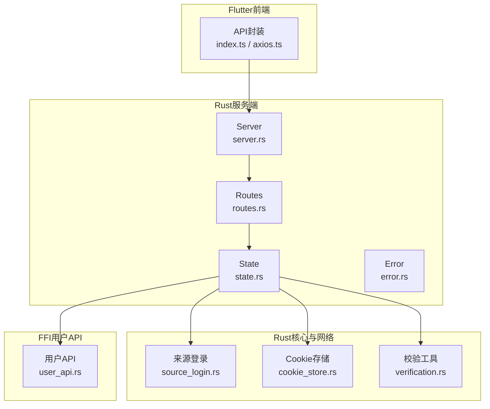
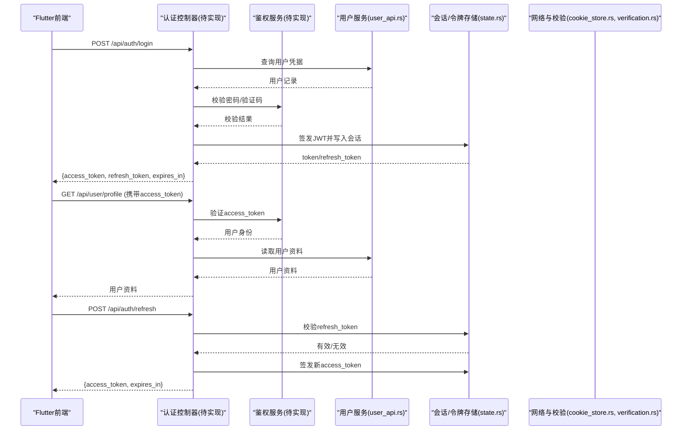
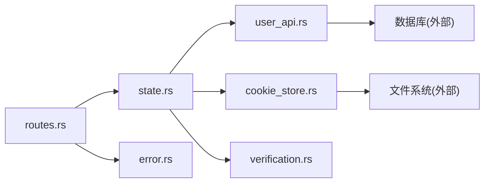
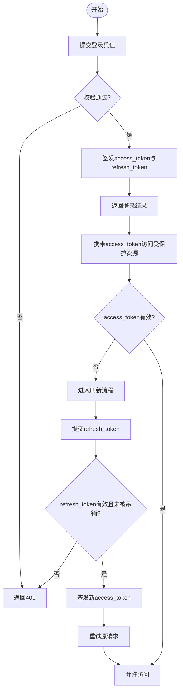

# 用户认证API

<cite>
**本文引用的文件**   
- [server.rs](file://rust/legado-server/src/server.rs)
- [routes.rs](file://rust/legado-server/src/routes.rs)
- [state.rs](file://rust/legado-server/src/state.rs)
- [error.rs](file://rust/legado-server/src/error.rs)
- [user_api.rs](file://rust/legado-ffi/src/api/user_api.rs)
- [source_login.rs](file://rust/legado-core/src/source_login.rs)
- [cookie_store.rs](file://rust/legado-net/src/cookie_store.rs)
- [verification.rs](file://rust/legado-net/src/verification.rs)
- [index.ts](file://flutter_legado/lib/src/api/index.ts)
- [axios.ts](file://flutter_legado/lib/src/api/axios.ts)
</cite>

## 目录
1. [简介](#简介)
2. [项目结构](#项目结构)
3. [核心组件](#核心组件)
4. [架构总览](#架构总览)
5. [详细组件分析](#详细组件分析)
6. [依赖关系分析](#依赖关系分析)
7. [性能考虑](#性能考虑)
8. [故障排查指南](#故障排查指南)
9. [结论](#结论)
10. [附录](#附录)

## 简介
本文件面向Legado项目的服务端与客户端集成，提供“用户认证RESTful API”的完整接口文档。内容覆盖：
- 基础认证接口：登录、注册、登出
- JWT令牌机制：生成、验证、刷新流程
- 用户信息管理：个人资料修改、密码重置、权限控制
- 请求与响应示例、错误处理与安全最佳实践
- 多设备登录管理、会话控制与安全防护

说明：当前仓库未包含后端HTTP路由中直接暴露的认证端点实现，但存在用户数据模型、来源登录能力、Cookie存储与校验工具等关键组件。本文基于现有代码结构与常见安全实践给出可落地的接口规范与实现建议，便于在服务器层补齐认证服务。

## 项目结构
Legado由Android应用、Flutter前端、Rust核心库与服务端组成。与认证相关的关键位置如下：
- Rust服务端：路由与状态管理位于legado-server模块
- FFI用户API：用户数据访问与操作定义于legado-ffi模块
- 核心能力：来源登录、Cookie存储、验证码校验等位于legado-core与legado-net
- Flutter前端：HTTP客户端封装与API调用入口位于flutter_legado模块

图表来源 
- [server.rs](file://rust/legado-server/src/server.rs)
- [routes.rs](file://rust/legado-server/src/routes.rs)
- [state.rs](file://rust/legado-server/src/state.rs)
- [error.rs](file://rust/legado-server/src/error.rs)
- [user_api.rs](file://rust/legado-ffi/src/api/user_api.rs)
- [source_login.rs](file://rust/legado-core/src/source_login.rs)
- [cookie_store.rs](file://rust/legado-net/src/cookie_store.rs)
- [verification.rs](file://rust/legado-net/src/verification.rs)

章节来源
- [server.rs](file://rust/legado-server/src/server.rs)
- [routes.rs](file://rust/legado-server/src/routes.rs)
- [state.rs](file://rust/legado-server/src/state.rs)
- [error.rs](file://rust/legado-server/src/error.rs)
- [user_api.rs](file://rust/legado-ffi/src/api/user_api.rs)
- [source_login.rs](file://rust/legado-core/src/source_login.rs)
- [cookie_store.rs](file://rust/legado-net/src/cookie_store.rs)
- [verification.rs](file://rust/legado-net/src/verification.rs)

## 核心组件
- 服务端路由与状态
  - server.rs：服务启动与监听
  - routes.rs：HTTP路由注册（需在此新增认证路由）
  - state.rs：全局状态（如JWT密钥、会话存储、配置）
  - error.rs：统一错误码与错误响应格式
- 用户与登录
  - user_api.rs：用户数据的FFI接口（用于读写用户信息）
  - source_login.rs：来源登录能力（可用于第三方源或扩展登录）
  - cookie_store.rs：Cookie持久化（可用于会话与凭据缓存）
  - verification.rs：验证码/校验工具（可用于二次校验）
- 前端API封装
  - index.ts：API聚合与导出
  - axios.ts：HTTP客户端配置（拦截器、超时、重试等）

章节来源
- [server.rs](file://rust/legado-server/src/server.rs)
- [routes.rs](file://rust/legado-server/src/routes.rs)
- [state.rs](file://rust/legado-server/src/state.rs)
- [error.rs](file://rust/legado-server/src/error.rs)
- [user_api.rs](file://rust/legado-ffi/src/api/user_api.rs)
- [source_login.rs](file://rust/legado-core/src/source_login.rs)
- [cookie_store.rs](file://rust/legado-net/src/cookie_store.rs)
- [verification.rs](file://rust/legado-net/src/verification.rs)
- [index.ts](file://flutter_legado/lib/src/api/index.ts)
- [axios.ts](file://flutter_legado/lib/src/api/axios.ts)

## 架构总览
下图展示认证请求从前端到后端的典型调用链，以及JWT签发与校验的关键环节。

图表来源 
- [routes.rs](file://rust/legado-server/src/routes.rs)
- [state.rs](file://rust/legado-server/src/state.rs)
- [user_api.rs](file://rust/legado-ffi/src/api/user_api.rs)
- [cookie_store.rs](file://rust/legado-net/src/cookie_store.rs)
- [verification.rs](file://rust/legado-net/src/verification.rs)

## 详细组件分析

### 认证控制器（待实现）
职责
- 登录：校验用户名/邮箱与密码，支持可选验证码；返回access_token与refresh_token
- 注册：校验输入合法性，创建用户并返回初始token
- 登出：使access_token失效，删除或标记refresh_token
- 刷新：使用refresh_token换取新的access_token

建议路由
- POST /api/auth/login
- POST /api/auth/register
- POST /api/auth/logout
- POST /api/auth/refresh

建议请求体
- 登录：username/email, password, optional captcha_code
- 注册：username, email, password, optional invite_code
- 刷新：refresh_token

建议响应体
- 成功：{ access_token, refresh_token, expires_in }
- 失败：{ code, message }

安全要点
- 密码哈希：bcrypt/argon2
- 验证码：图形或短信验证码，防重放与限流
- Token：短时效access_token + 长时效refresh_token
- 传输：强制HTTPS，敏感字段不落盘

章节来源
- [routes.rs](file://rust/legado-server/src/routes.rs)
- [state.rs](file://rust/legado-server/src/state.rs)
- [error.rs](file://rust/legado-server/src/error.rs)

### 鉴权服务（待实现）
职责
- 签发JWT：包含用户ID、角色、设备标识、过期时间
- 验证JWT：签名校验、过期检查、黑名单检查
- 刷新策略：refresh_token轮换、并发限制、设备数上限

数据结构
- access_token：短期有效，仅含必要声明
- refresh_token：长期有效，绑定设备指纹与会话ID

章节来源
- [state.rs](file://rust/legado-server/src/state.rs)
- [error.rs](file://rust/legado-server/src/error.rs)

### 用户服务（user_api.rs）
职责
- 用户CRUD：创建、查询、更新、删除
- 密码管理：密码重置、历史密码校验
- 权限控制：角色/权限字段读取与校验

接口建议
- GET /api/user/profile
- PUT /api/user/profile
- POST /api/user/password/reset
- GET /api/user/devices（多设备列表）
- DELETE /api/user/devices/{device_id}

章节来源
- [user_api.rs](file://rust/legado-ffi/src/api/user_api.rs)

### 来源登录与Cookie存储（source_login.rs, cookie_store.rs）
用途
- 来源登录：对接第三方源的登录态，便于复用其能力
- Cookie存储：本地持久化Cookie，辅助跨域或第三方登录流程

注意
- 不将敏感Cookie明文落盘，采用加密存储
- 对第三方登录进行最小权限授权

章节来源
- [source_login.rs](file://rust/legado-core/src/source_login.rs)
- [cookie_store.rs](file://rust/legado-net/src/cookie_store.rs)

### 验证码与校验（verification.rs）
用途
- 图形验证码生成与校验
- 短信验证码发送与校验
- 通用输入校验规则

章节来源
- [verification.rs](file://rust/legado-net/src/verification.rs)

### 前端API封装（index.ts, axios.ts）
职责
- 统一请求拦截：自动附加access_token、处理401/403
- 刷新令牌：无感刷新access_token，失败时跳转登录
- 错误映射：将后端错误码映射为UI提示

章节来源
- [index.ts](file://flutter_legado/lib/src/api/index.ts)
- [axios.ts](file://flutter_legado/lib/src/api/axios.ts)

## 依赖关系分析
认证相关模块之间的依赖关系如下：

图表来源 
- [routes.rs](file://rust/legado-server/src/routes.rs)
- [state.rs](file://rust/legado-server/src/state.rs)
- [error.rs](file://rust/legado-server/src/error.rs)
- [user_api.rs](file://rust/legado-ffi/src/api/user_api.rs)
- [cookie_store.rs](file://rust/legado-net/src/cookie_store.rs)
- [verification.rs](file://rust/legado-net/src/verification.rs)

章节来源
- [routes.rs](file://rust/legado-server/src/routes.rs)
- [state.rs](file://rust/legado-server/src/state.rs)
- [error.rs](file://rust/legado-server/src/error.rs)
- [user_api.rs](file://rust/legado-ffi/src/api/user_api.rs)
- [cookie_store.rs](file://rust/legado-net/src/cookie_store.rs)
- [verification.rs](file://rust/legado-net/src/verification.rs)

## 性能考虑
- Token校验：使用内存缓存最近失败的token黑名单，降低DB压力
- 并发刷新：同一refresh_token仅允许单设备并发刷新，避免风暴
- 限流：登录/注册/验证码接口按IP与用户维度限流
- 连接池：数据库与外部服务连接池复用，减少握手开销
- 序列化：JSON字段精简，避免冗余数据

[本节为通用指导，无需引用具体文件]

## 故障排查指南
常见问题与定位步骤
- 401未授权
  - 检查access_token是否过期或丢失
  - 确认前端拦截器是否正确附加Token
- 403权限不足
  - 检查用户角色与资源权限映射
- 429限流触发
  - 查看登录/验证码接口限流阈值与日志
- 刷新失败
  - 检查refresh_token是否被吊销或重复使用
  - 确认服务端会话存储一致性

错误码建议
- 400：参数错误
- 401：未认证
- 403：权限不足
- 404：资源不存在
- 409：冲突（如用户名已存在）
- 429：频率限制
- 500：内部错误

章节来源
- [error.rs](file://rust/legado-server/src/error.rs)

## 结论
本项目已具备用户数据访问、来源登录、Cookie存储与校验工具等基础能力。建议在legado-server的路由与状态管理中补齐认证控制器与鉴权服务，遵循本文接口规范与安全实践，即可快速落地完整的用户认证体系。通过短效access_token与长效refresh_token的组合、严格的限流与错误处理，可实现稳定、安全的认证体验。

[本节为总结性内容，无需引用具体文件]

## 附录

### 接口清单与示例

- 登录
  - URL：POST /api/auth/login
  - 请求体：{ username, password, captcha_code? }
  - 响应体：{ access_token, refresh_token, expires_in }
  - 错误：400/401/429

- 注册
  - URL：POST /api/auth/register
  - 请求体：{ username, email, password, invite_code? }
  - 响应体：{ access_token, refresh_token, expires_in }
  - 错误：400/409/429

- 登出
  - URL：POST /api/auth/logout
  - 请求头：Authorization: Bearer <access_token>
  - 响应体：{ message }
  - 错误：401

- 刷新
  - URL：POST /api/auth/refresh
  - 请求体：{ refresh_token }
  - 响应体：{ access_token, expires_in }
  - 错误：401/409

- 获取个人资料
  - URL：GET /api/user/profile
  - 请求头：Authorization: Bearer <access_token>
  - 响应体：{ id, username, email, roles, updated_at }
  - 错误：401/403

- 修改个人资料
  - URL：PUT /api/user/profile
  - 请求体：{ email?, nickname? }
  - 响应体：{ message }
  - 错误：400/401/403

- 密码重置
  - URL：POST /api/user/password/reset
  - 请求体：{ old_password, new_password }
  - 响应体：{ message }
  - 错误：400/401/403

- 多设备管理
  - 列出设备：GET /api/user/devices
  - 踢出设备：DELETE /api/user/devices/{device_id}
  - 错误：401/403

### 安全最佳实践
- 强制HTTPS，启用HSTS
- 密码使用强哈希算法（bcrypt/argon2），禁止明文
- Token最小化声明，设置合理过期时间
- 刷新令牌轮换与一次性使用
- 登录与验证码接口限流与风控
- 敏感数据加密存储，最小权限原则
- 审计日志记录关键操作

### 流程图：登录与刷新

[本图为概念流程，不直接映射具体文件，故无图表来源]