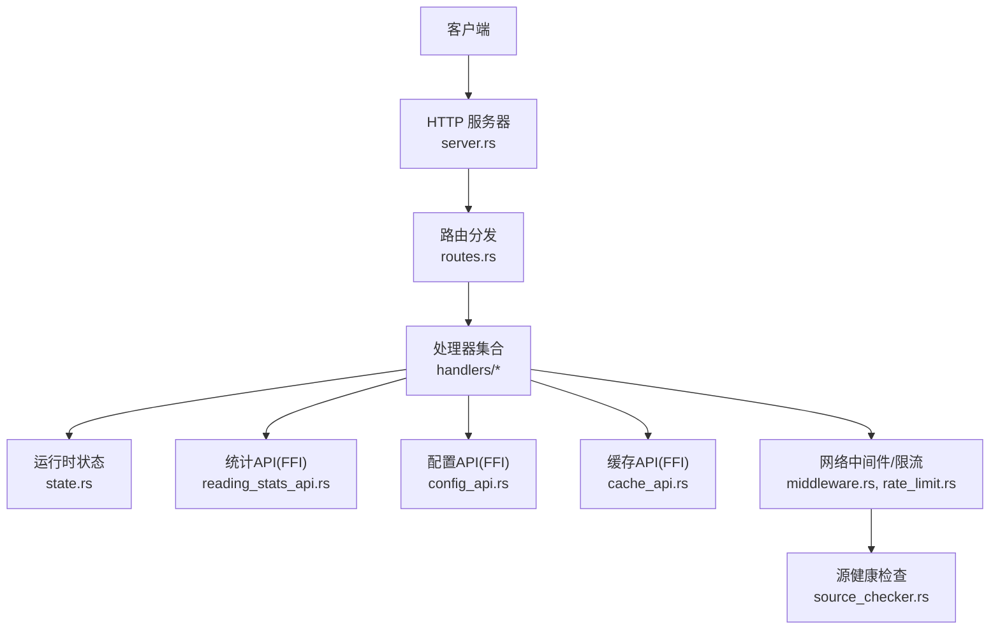
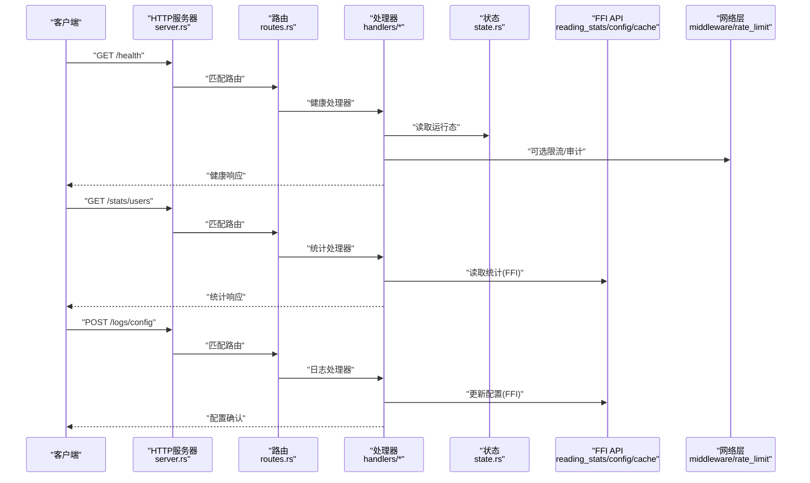
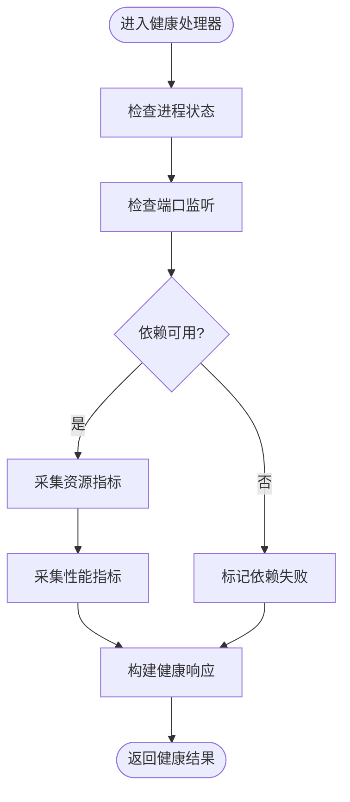
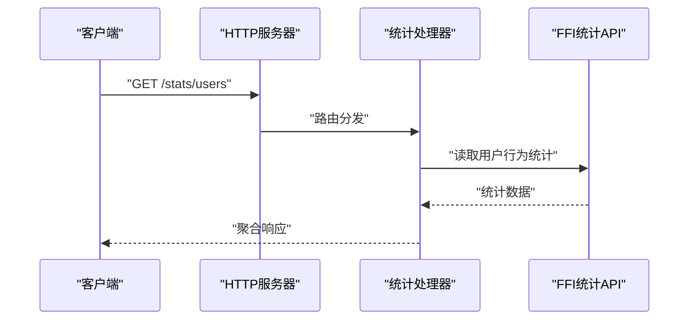
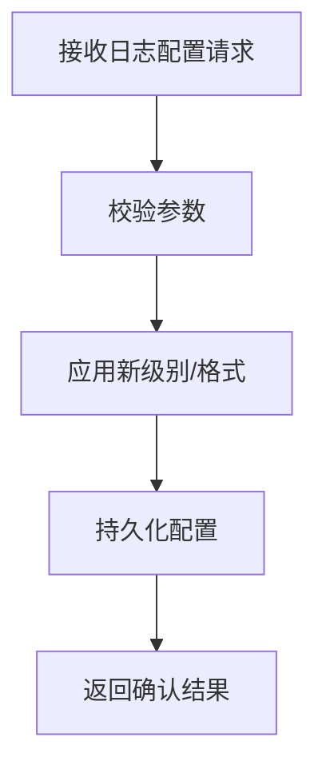
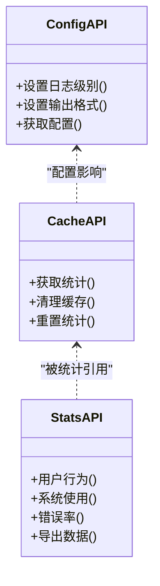
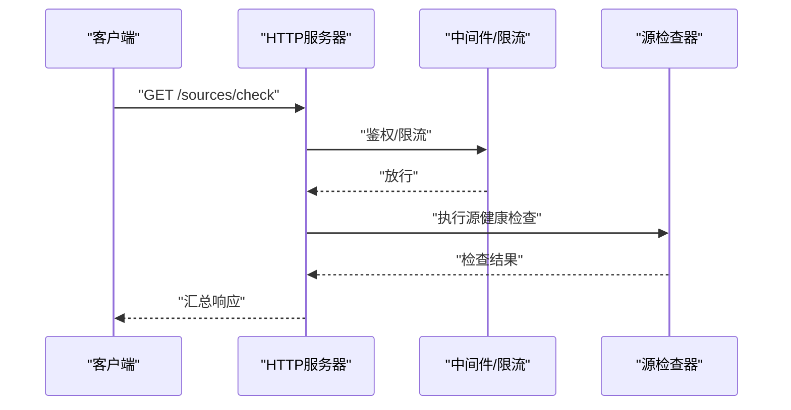
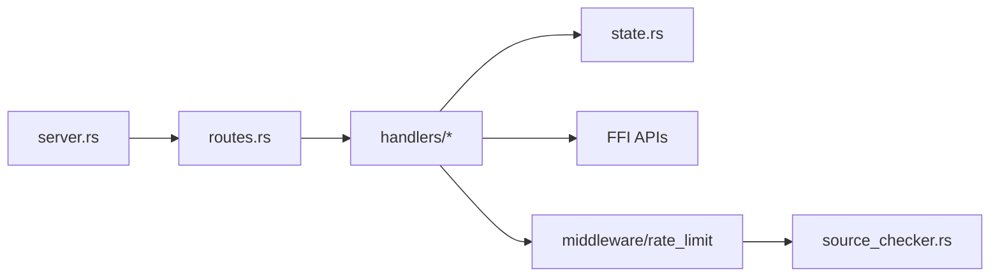
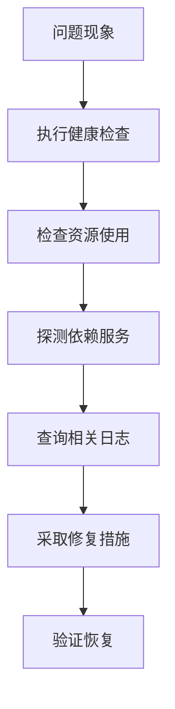

# 系统健康API

<cite>
**本文档引用的文件**   
- [server.rs](file://rust/legado-server/src/server.rs)
- [routes.rs](file://rust/legado-server/src/routes.rs)
- [state.rs](file://rust/legado-server/src/state.rs)
- [error.rs](file://rust/legado-server/src/error.rs)
- [lib.rs](file://rust/legado-server/src/lib.rs)
- [handlers/mod.rs](file://rust/legado-server/src/handlers/mod.rs)
- [reading_stats_api.rs](file://rust/legado-ffi/src/api/reading_stats_api.rs)
- [config_api.rs](file://rust/legado-ffi/src/api/config_api.rs)
- [cache_api.rs](file://rust/legado-ffi/src/api/cache_api.rs)
- [bookshelf.rs](file://rust/legado-ffi/src/api/bookshelf.rs)
- [source_checker.rs](file://rust/legado-net/src/source_checker.rs)
- [rate_limit.rs](file://rust/legado-net/src/rate_limit.rs)
- [middleware.rs](file://rust/legado-net/src/middleware.rs)
</cite>

## 目录
1. [简介](#简介)
2. [项目结构](#项目结构)
3. [核心组件](#核心组件)
4. [架构总览](#架构总览)
5. [详细组件分析](#详细组件分析)
6. [依赖关系分析](#依赖关系分析)
7. [性能考量](#性能考量)
8. [故障排查指南](#故障排查指南)
9. [结论](#结论)
10. [附录](#附录)

## 简介
本文件为Legado项目的“系统健康监控RESTful API”提供完整接口文档，覆盖：
- 系统状态检查：服务可用性检测、资源使用情况监控、性能指标收集
- 统计信息API：用户行为分析、系统使用统计、错误率监控
- 日志管理API：日志查询、级别设置、输出格式配置
- 运维能力：健康检查、故障诊断、性能调优
- 实时性、历史数据访问与告警机制说明

本说明面向开发者与运维人员，既提供高层概览，也给出代码级映射与调用流程。

## 项目结构
Legado的Web服务由Rust模块legado-server提供，结合FFI层暴露给上层应用，并通过网络层进行限流与中间件处理。关键路径如下：
- 服务器启动与路由注册：server.rs、routes.rs
- 运行时状态与共享上下文：state.rs
- 错误模型与统一返回：error.rs
- FFI API（统计、配置、缓存等）：legado-ffi/src/api/*
- 网络层（限流、中间件、源检查）：legado-net/*

**图表来源** 
- [server.rs](file://rust/legado-server/src/server.rs)
- [routes.rs](file://rust/legado-server/src/routes.rs)
- [state.rs](file://rust/legado-server/src/state.rs)
- [lib.rs](file://rust/legado-server/src/lib.rs)
- [handlers/mod.rs](file://rust/legado-server/src/handlers/mod.rs)
- [reading_stats_api.rs](file://rust/legado-ffi/src/api/reading_stats_api.rs)
- [config_api.rs](file://rust/legado-ffi/src/api/config_api.rs)
- [cache_api.rs](file://rust/legado-ffi/src/api/cache_api.rs)
- [middleware.rs](file://rust/legado-net/src/middleware.rs)
- [rate_limit.rs](file://rust/legado-net/src/rate_limit.rs)
- [source_checker.rs](file://rust/legado-net/src/source_checker.rs)

**章节来源**
- [server.rs](file://rust/legado-server/src/server.rs)
- [routes.rs](file://rust/legado-server/src/routes.rs)
- [state.rs](file://rust/legado-server/src/state.rs)
- [lib.rs](file://rust/legado-server/src/lib.rs)

## 核心组件
- 健康检查与健康探针
  - 服务可用性：进程存活、端口监听、依赖服务可达性
  - 资源使用：内存、CPU、磁盘、网络IO
  - 性能指标：请求吞吐、延迟分布、错误率
- 统计信息API
  - 用户行为：阅读时长、翻页次数、搜索次数
  - 系统使用：缓存命中率、下载任务数、源成功率
  - 错误率：按模块/时间窗口的错误计数与比例
- 日志管理API
  - 日志查询：按级别、时间范围、关键字过滤
  - 级别设置：动态调整各模块日志级别
  - 输出格式：JSON/文本切换、字段选择

上述能力通过统一的HTTP入口暴露，内部通过FFI与本地存储/缓存交互，并由网络层中间件进行鉴权、限流与审计。

**章节来源**
- [handlers/mod.rs](file://rust/legado-server/src/handlers/mod.rs)
- [reading_stats_api.rs](file://rust/legado-ffi/src/api/reading_stats_api.rs)
- [config_api.rs](file://rust/legado-ffi/src/api/config_api.rs)
- [cache_api.rs](file://rust/legado-ffi/src/api/cache_api.rs)

## 架构总览
下图展示从客户端到后端各层的调用关系，以及健康、统计、日志三类接口的职责边界。

**图表来源** 
- [server.rs](file://rust/legado-server/src/server.rs)
- [routes.rs](file://rust/legado-server/src/routes.rs)
- [handlers/mod.rs](file://rust/legado-server/src/handlers/mod.rs)
- [state.rs](file://rust/legado-server/src/state.rs)
- [reading_stats_api.rs](file://rust/legado-ffi/src/api/reading_stats_api.rs)
- [config_api.rs](file://rust/legado-ffi/src/api/config_api.rs)
- [cache_api.rs](file://rust/legado-ffi/src/api/cache_api.rs)
- [middleware.rs](file://rust/legado-net/src/middleware.rs)
- [rate_limit.rs](file://rust/legado-net/src/rate_limit.rs)

## 详细组件分析

### 健康检查接口
- 功能要点
  - 服务可用性：进程状态、端口监听、依赖服务探测
  - 资源使用：内存占用、CPU负载、磁盘空间、网络IO
  - 性能指标：QPS、P95/P99延迟、错误率
  - 依赖项健康：数据库、缓存、外部源连通性
- 典型端点
  - GET /health：基础健康
  - GET /health/detailed：详细健康（含依赖项）
  - GET /metrics：Prometheus风格指标快照
- 实时性与历史
  - 实时：当前时刻的系统快照
  - 历史：通过指标持久化或导出接口获取（见“统计信息API”）
- 告警机制
  - 阈值触发：资源超限、依赖不可用、错误率超阈
  - 通知方式：回调、消息队列、日志事件

**图表来源** 
- [handlers/mod.rs](file://rust/legado-server/src/handlers/mod.rs)
- [state.rs](file://rust/legado-server/src/state.rs)
- [source_checker.rs](file://rust/legado-net/src/source_checker.rs)

**章节来源**
- [handlers/mod.rs](file://rust/legado-server/src/handlers/mod.rs)
- [state.rs](file://rust/legado-server/src/state.rs)
- [source_checker.rs](file://rust/legado-net/src/source_checker.rs)

### 统计信息API
- 功能要点
  - 用户行为：阅读时长、翻页次数、搜索次数、收藏/书签变化
  - 系统使用：缓存命中率、下载任务状态、源成功率
  - 错误率：按模块/时间窗口统计的错误计数与比例
- 典型端点
  - GET /stats/users：用户行为聚合
  - GET /stats/system：系统使用统计
  - GET /stats/errors：错误率统计
  - GET /stats/export?format=json&range=...：历史数据导出
- 实时性与历史
  - 实时：内存聚合视图
  - 历史：基于持久化存储的查询与导出

**图表来源** 
- [reading_stats_api.rs](file://rust/legado-ffi/src/api/reading_stats_api.rs)

**章节来源**
- [reading_stats_api.rs](file://rust/legado-ffi/src/api/reading_stats_api.rs)

### 日志管理API
- 功能要点
  - 日志查询：按级别、时间范围、关键字过滤
  - 级别设置：动态调整各模块日志级别
  - 输出格式：JSON/文本切换、字段选择
- 典型端点
  - GET /logs/query：日志查询
  - PUT /logs/config：日志级别与格式配置
  - POST /logs/export：导出日志片段
- 实时性与历史
  - 实时：流式或轮询获取最新日志
  - 历史：按时间范围导出

**图表来源** 
- [config_api.rs](file://rust/legado-ffi/src/api/config_api.rs)

**章节来源**
- [config_api.rs](file://rust/legado-ffi/src/api/config_api.rs)

### 缓存与资源监控辅助
- 功能要点
  - 缓存命中率、大小、清理策略
  - 资源使用：内存、磁盘、网络IO
- 典型端点
  - GET /cache/stats：缓存统计
  - POST /cache/cleanup：触发清理
  - GET /resources：资源使用快照

**图表来源** 
- [cache_api.rs](file://rust/legado-ffi/src/api/cache_api.rs)
- [config_api.rs](file://rust/legado-ffi/src/api/config_api.rs)
- [reading_stats_api.rs](file://rust/legado-ffi/src/api/reading_stats_api.rs)

**章节来源**
- [cache_api.rs](file://rust/legado-ffi/src/api/cache_api.rs)
- [config_api.rs](file://rust/legado-ffi/src/api/config_api.rs)
- [reading_stats_api.rs](file://rust/legado-ffi/src/api/reading_stats_api.rs)

### 源健康检查与网络限流
- 功能要点
  - 源健康检查：连通性、响应时间、错误率
  - 网络限流：按IP/用户维度限制请求速率
  - 中间件：鉴权、审计、重试、超时
- 典型端点
  - GET /sources/check：批量源健康检查
  - GET /limits/status：限流状态
  - POST /limits/config：限流策略配置

**图表来源** 
- [source_checker.rs](file://rust/legado-net/src/source_checker.rs)
- [rate_limit.rs](file://rust/legado-net/src/rate_limit.rs)
- [middleware.rs](file://rust/legado-net/src/middleware.rs)

**章节来源**
- [source_checker.rs](file://rust/legado-net/src/source_checker.rs)
- [rate_limit.rs](file://rust/legado-net/src/rate_limit.rs)
- [middleware.rs](file://rust/legado-net/src/middleware.rs)

## 依赖关系分析
- 组件耦合
  - 处理器依赖状态与FFI API，避免直接访问底层存储
  - 网络层中间件对处理器透明，提供通用横切能力
- 外部依赖
  - 数据库、缓存、外部源的可达性与性能直接影响健康与统计
- 潜在循环依赖
  - 通过FFI与状态对象解耦，降低循环风险

**图表来源** 
- [server.rs](file://rust/legado-server/src/server.rs)
- [routes.rs](file://rust/legado-server/src/routes.rs)
- [handlers/mod.rs](file://rust/legado-server/src/handlers/mod.rs)
- [state.rs](file://rust/legado-server/src/state.rs)
- [middleware.rs](file://rust/legado-net/src/middleware.rs)
- [rate_limit.rs](file://rust/legado-net/src/rate_limit.rs)
- [source_checker.rs](file://rust/legado-net/src/source_checker.rs)

**章节来源**
- [lib.rs](file://rust/legado-server/src/lib.rs)
- [error.rs](file://rust/legado-server/src/error.rs)

## 性能考量
- 健康检查
  - 避免阻塞：依赖探测采用异步与超时控制
  - 采样频率：指标采集间隔可配置，避免高频采样导致抖动
- 统计信息
  - 增量聚合：在内存中维护计数器，定期持久化
  - 分页与过滤：大数据集查询需支持分页与条件过滤
- 日志管理
  - 异步写入：高并发下采用异步落盘
  - 滚动策略：按大小/时间滚动，保留策略可配置
- 限流与中间件
  - 令牌桶/漏桶算法：平滑突发流量
  - 短路径优先：健康与统计接口尽量轻量

[本节为通用指导，不直接分析具体文件]

## 故障排查指南
- 常见问题定位
  - 健康检查失败：检查依赖服务、端口监听、资源上限
  - 统计缺失：确认统计开关、持久化路径、导出权限
  - 日志无法查询：确认级别设置、时间范围、关键字匹配
- 错误模型
  - 统一错误码与消息，便于前端与监控集成
  - 堆栈与上下文信息用于调试

**图表来源** 
- [error.rs](file://rust/legado-server/src/error.rs)
- [handlers/mod.rs](file://rust/legado-server/src/handlers/mod.rs)
- [config_api.rs](file://rust/legado-ffi/src/api/config_api.rs)

**章节来源**
- [error.rs](file://rust/legado-server/src/error.rs)
- [handlers/mod.rs](file://rust/legado-server/src/handlers/mod.rs)
- [config_api.rs](file://rust/legado-ffi/src/api/config_api.rs)

## 结论
本健康监控API体系以清晰的层次划分与模块化设计，提供稳定可靠的健康检查、统计信息与日志管理能力。通过中间件与限流保障服务质量，借助FFI与状态对象实现松耦合扩展。建议在生产环境启用指标持久化与告警联动，形成闭环的运维自动化。

[本节为总结性内容，不直接分析具体文件]

## 附录
- 请求与响应示例（概念性）
  - 健康检查
    - 请求：GET /health
    - 响应：包含服务状态、资源使用、依赖项健康
  - 统计信息
    - 请求：GET /stats/users?window=1h
    - 响应：用户行为聚合数据
  - 日志管理
    - 请求：PUT /logs/config {level:"debug", format:"json"}
    - 响应：配置生效确认
- 实时性与历史数据
  - 实时：接口返回当前快照
  - 历史：通过导出接口或指标持久化查询
- 告警机制
  - 阈值配置：资源、错误率、依赖不可用
  - 通知渠道：回调、消息队列、日志事件

[本节为概念性说明，不直接分析具体文件]