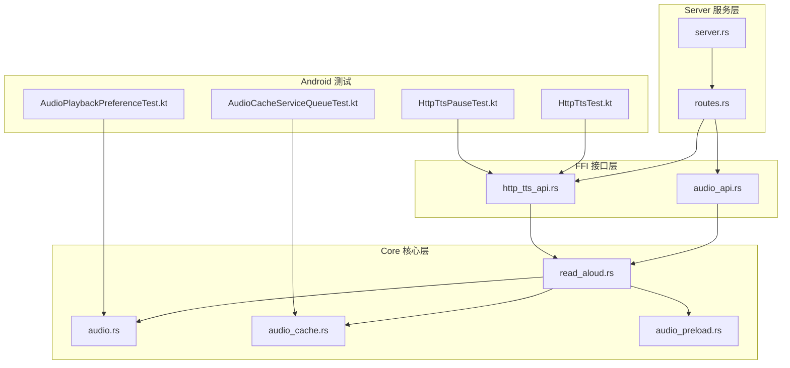
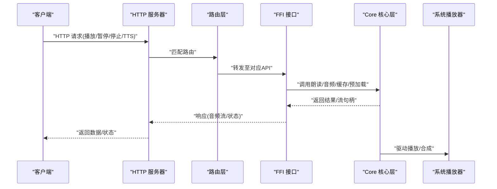
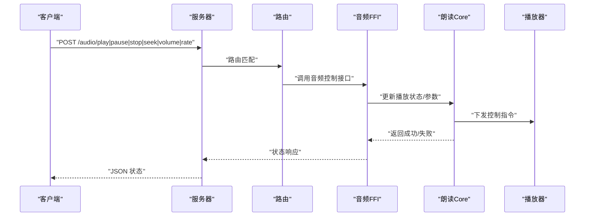
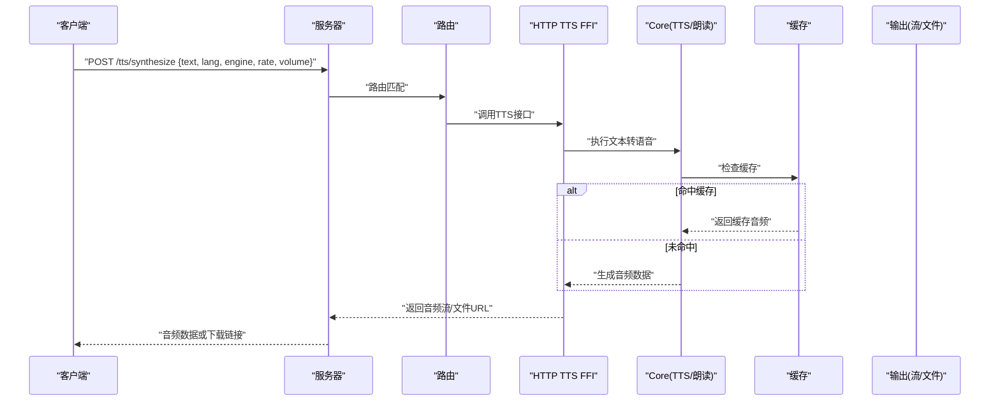
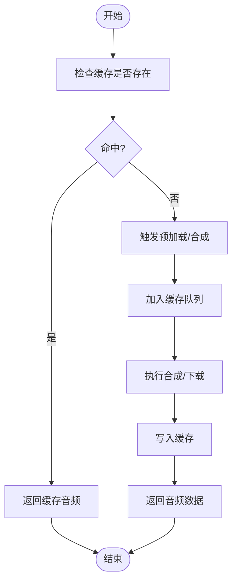
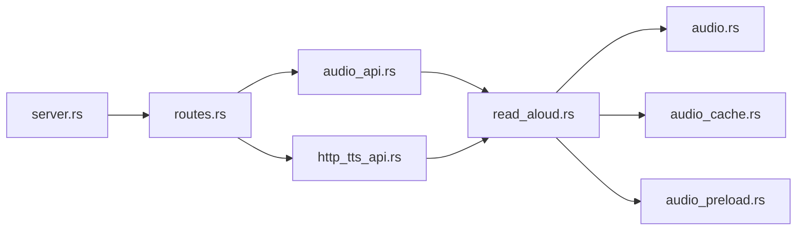

# 音频TTS API

<cite>
**本文引用的文件**   
- [audio_api.rs](file://rust/legado-ffi/src/api/audio_api.rs)
- [http_tts_api.rs](file://rust/legado-ffi/src/api/http_tts_api.rs)
- [read_aloud.rs](file://rust/legado-core/src/read_aloud.rs)
- [audio.rs](file://rust/legado-core/src/audio.rs)
- [audio_cache.rs](file://rust/legado-core/src/audio_cache.rs)
- [audio_preload.rs](file://rust/legado-core/src/audio_preload.rs)
- [server.rs](file://rust/legado-server/src/server.rs)
- [routes.rs](file://rust/legado-server/src/routes.rs)
- [HttpTtsTest.kt](file://app/src/androidTest/java/io/legado/app/HttpTtsTest.kt)
- [AudioPlaybackPreferenceTest.kt](file://app/src/test/java/io/legado/app/model/AudioPlaybackPreferenceTest.kt)
- [AudioCacheServiceQueueTest.kt](file://app/src/test/java/io/legado/app/service/AudioCacheServiceQueueTest.kt)
- [HttpTtsPauseTest.kt](file://app/src/test/java/io/legado/app/service/HttpTtsPauseTest.kt)
</cite>

## 目录
1. [简介](#简介)
2. [项目结构](#项目结构)
3. [核心组件](#核心组件)
4. [架构总览](#架构总览)
5. [详细组件分析](#详细组件分析)
6. [依赖关系分析](#依赖关系分析)
7. [性能考虑](#性能考虑)
8. [故障排查指南](#故障排查指南)
9. [结论](#结论)
10. [附录](#附录)

## 简介
本文件面向开发者与集成方，系统化梳理Legado中的音频播放控制与HTTP TTS（文本转语音）能力，覆盖RESTful接口、音频流处理、实时播放与缓冲策略、多语言与引擎切换、离线播放等高级特性。文档以仓库实际实现为依据，提供端到端调用流程、关键数据结构与错误处理要点，帮助快速对接与二次开发。

## 项目结构
本项目在Rust层通过FFI暴露API，并在Android测试中验证HTTP TTS与播放行为；服务端模块负责路由与请求分发。与音频/TTS相关的关键位置如下：
- FFI API层：音频与HTTP TTS的对外接口定义
- Core层：朗读、音频、缓存、预加载等核心逻辑
- Server层：HTTP路由与服务入口
- Android测试：对HTTP TTS与播放行为的断言与用例

图表来源
- [audio_api.rs](file://rust/legado-ffi/src/api/audio_api.rs)
- [http_tts_api.rs](file://rust/legado-ffi/src/api/http_tts_api.rs)
- [read_aloud.rs](file://rust/legado-core/src/read_aloud.rs)
- [audio.rs](file://rust/legado-core/src/audio.rs)
- [audio_cache.rs](file://rust/legado-core/src/audio_cache.rs)
- [audio_preload.rs](file://rust/legado-core/src/audio_preload.rs)
- [server.rs](file://rust/legado-server/src/server.rs)
- [routes.rs](file://rust/legado-server/src/routes.rs)
- [HttpTtsTest.kt](file://app/src/androidTest/java/io/legado/app/HttpTtsTest.kt)
- [HttpTtsPauseTest.kt](file://app/src/test/java/io/legado/app/service/HttpTtsPauseTest.kt)
- [AudioCacheServiceQueueTest.kt](file://app/src/test/java/io/legado/app/service/AudioCacheServiceQueueTest.kt)
- [AudioPlaybackPreferenceTest.kt](file://app/src/test/java/io/legado/app/model/AudioPlaybackPreferenceTest.kt)

章节来源
- [server.rs](file://rust/legado-server/src/server.rs)
- [routes.rs](file://rust/legado-server/src/routes.rs)
- [audio_api.rs](file://rust/legado-ffi/src/api/audio_api.rs)
- [http_tts_api.rs](file://rust/legado-ffi/src/api/http_tts_api.rs)

## 核心组件
- 音频播放控制（FFI/HTTP）
  - 播放、暂停、停止、跳转、音量调节、语速调节、循环模式、进度查询等
  - 基于Core层的朗读与音频管理，支持本地与网络音频流
- HTTP TTS（文本转语音）
  - 文本输入、语音合成、语速/音量/音调控制、多语言与引擎选择
  - 返回音频流或可下载音频文件，支持缓存与重试
- 音频缓存与预加载
  - 队列化缓存、TTL过期、预加载下一段内容，降低首帧延迟
- 服务端路由与状态
  - 统一路由注册、请求校验、错误码与日志

章节来源
- [audio_api.rs](file://rust/legado-ffi/src/api/audio_api.rs)
- [http_tts_api.rs](file://rust/legado-ffi/src/api/http_tts_api.rs)
- [read_aloud.rs](file://rust/legado-core/src/read_aloud.rs)
- [audio.rs](file://rust/legado-core/src/audio.rs)
- [audio_cache.rs](file://rust/legado-core/src/audio_cache.rs)
- [audio_preload.rs](file://rust/legado-core/src/audio_preload.rs)

## 架构总览
下图展示从HTTP请求到音频播放/合成的整体链路：客户端通过服务端路由进入FFI接口，再调用Core层的朗读与音频子系统，最终由系统播放器输出。

图表来源
- [server.rs](file://rust/legado-server/src/server.rs)
- [routes.rs](file://rust/legado-server/src/routes.rs)
- [audio_api.rs](file://rust/legado-ffi/src/api/audio_api.rs)
- [http_tts_api.rs](file://rust/legado-ffi/src/api/http_tts_api.rs)
- [read_aloud.rs](file://rust/legado-core/src/read_aloud.rs)
- [audio.rs](file://rust/legado-core/src/audio.rs)

## 详细组件分析

### 音频播放控制API
- 功能范围
  - 播放/暂停/停止：控制当前播放任务的生命周期
  - 跳转：按时间或章节定位
  - 音量/语速：运行时参数调整
  - 状态查询：当前播放位置、时长、是否正在播放
- 典型交互
  - 客户端发起控制请求，服务端路由到FFI音频API，FFI调用Core朗读/音频模块执行操作并返回状态

图表来源
- [audio_api.rs](file://rust/legado-ffi/src/api/audio_api.rs)
- [read_aloud.rs](file://rust/legado-core/src/read_aloud.rs)
- [audio.rs](file://rust/legado-core/src/audio.rs)

章节来源
- [audio_api.rs](file://rust/legado-ffi/src/api/audio_api.rs)
- [read_aloud.rs](file://rust/legado-core/src/read_aloud.rs)
- [audio.rs](file://rust/legado-core/src/audio.rs)

### HTTP TTS（文本转语音）API
- 功能范围
  - 文本输入、语音合成、语速/音量/音调控制
  - 多语言与语音引擎选择
  - 返回音频流或文件下载链接
  - 可选缓存命中与重试
- 典型交互
  - 客户端提交文本与参数，服务端路由到FFI HTTP TTS接口，Core层进行合成并返回音频流或文件路径

图表来源
- [http_tts_api.rs](file://rust/legado-ffi/src/api/http_tts_api.rs)
- [read_aloud.rs](file://rust/legado-core/src/read_aloud.rs)
- [audio_cache.rs](file://rust/legado-core/src/audio_cache.rs)

章节来源
- [http_tts_api.rs](file://rust/legado-ffi/src/api/http_tts_api.rs)
- [read_aloud.rs](file://rust/legado-core/src/read_aloud.rs)
- [audio_cache.rs](file://rust/legado-core/src/audio_cache.rs)

### 音频缓存与预加载
- 缓存策略
  - 队列式缓存、TTL过期、去重、并发安全
- 预加载
  - 根据阅读/播放进度预取下一段音频，减少等待
- 与播放联动
  - 播放时优先命中缓存，未命中则触发后台合成与缓存

图表来源
- [audio_cache.rs](file://rust/legado-core/src/audio_cache.rs)
- [audio_preload.rs](file://rust/legado-core/src/audio_preload.rs)

章节来源
- [audio_cache.rs](file://rust/legado-core/src/audio_cache.rs)
- [audio_preload.rs](file://rust/legado-core/src/audio_preload.rs)

### 服务端路由与状态管理
- 路由注册
  - 集中式路由配置，将HTTP路径映射到FFI接口
- 状态管理
  - 播放状态、TTS任务状态、错误码与日志记录

章节来源
- [server.rs](file://rust/legado-server/src/server.rs)
- [routes.rs](file://rust/legado-server/src/routes.rs)

## 依赖关系分析
- FFI层依赖Core层完成具体业务逻辑
- Server层通过路由将外部请求分发到FFI接口
- Android测试覆盖HTTP TTS与播放行为，确保接口契约稳定

图表来源
- [server.rs](file://rust/legado-server/src/server.rs)
- [routes.rs](file://rust/legado-server/src/routes.rs)
- [audio_api.rs](file://rust/legado-ffi/src/api/audio_api.rs)
- [http_tts_api.rs](file://rust/legado-ffi/src/api/http_tts_api.rs)
- [read_aloud.rs](file://rust/legado-core/src/read_aloud.rs)
- [audio.rs](file://rust/legado-core/src/audio.rs)
- [audio_cache.rs](file://rust/legado-core/src/audio_cache.rs)
- [audio_preload.rs](file://rust/legado-core/src/audio_preload.rs)

章节来源
- [server.rs](file://rust/legado-server/src/server.rs)
- [routes.rs](file://rust/legado-server/src/routes.rs)
- [audio_api.rs](file://rust/legado-ffi/src/api/audio_api.rs)
- [http_tts_api.rs](file://rust/legado-ffi/src/api/http_tts_api.rs)
- [read_aloud.rs](file://rust/legado-core/src/read_aloud.rs)
- [audio.rs](file://rust/legado-core/src/audio.rs)
- [audio_cache.rs](file://rust/legado-core/src/audio_cache.rs)
- [audio_preload.rs](file://rust/legado-core/src/audio_preload.rs)

## 性能考虑
- 音频流处理
  - 使用流式传输避免大文件内存占用
  - 合理设置缓冲区大小，平衡延迟与稳定性
- 缓存与预加载
  - 启用TTL与去重，减少重复合成/下载
  - 预加载下一段内容，提升连续播放体验
- 并发与队列
  - 缓存队列限制并发数，防止资源争用
  - 任务优先级与超时控制，保障主流程稳定
- 网络与重试
  - 对TTS与远程音频源实施指数退避重试
  - 失败快速回退到本地缓存或降级策略

[本节为通用指导，不直接分析具体文件]

## 故障排查指南
- 常见问题
  - TTS合成失败：检查文本编码、语言与引擎配置、网络连通性
  - 播放卡顿：检查缓存命中率、预加载策略、网络带宽
  - 状态不同步：核对播放状态查询与控制接口的时序
- 调试建议
  - 查看服务端日志与错误码
  - 使用Android测试用例复现问题（如HTTP TTS暂停、缓存队列行为）
  - 逐步隔离：先验证路由与FFI接口，再深入Core层

章节来源
- [HttpTtsTest.kt](file://app/src/androidTest/java/io/legado/app/HttpTtsTest.kt)
- [HttpTtsPauseTest.kt](file://app/src/test/java/io/legado/app/service/HttpTtsPauseTest.kt)
- [AudioCacheServiceQueueTest.kt](file://app/src/test/java/io/legado/app/service/AudioCacheServiceQueueTest.kt)
- [AudioPlaybackPreferenceTest.kt](file://app/src/test/java/io/legado/app/model/AudioPlaybackPreferenceTest.kt)

## 结论
Legado的音频与TTS能力通过清晰的分层架构与完善的缓存/预加载机制，提供了稳定高效的播放与合成体验。借助FFI与Server路由，外部系统可以便捷地接入播放控制与TTS服务。建议在集成时重点关注流式传输、缓存策略与错误重试，以获得最佳的用户体验与系统稳定性。

[本节为总结性内容，不直接分析具体文件]

## 附录
- 接口设计建议
  - 统一错误码与消息体结构
  - 明确幂等性与重试语义
  - 提供健康检查与状态查询接口
- 扩展方向
  - 多引擎热切换与动态配置
  - 离线包管理与增量更新
  - 更细粒度的QoS与带宽自适应

[本节为概念性内容，不直接分析具体文件]