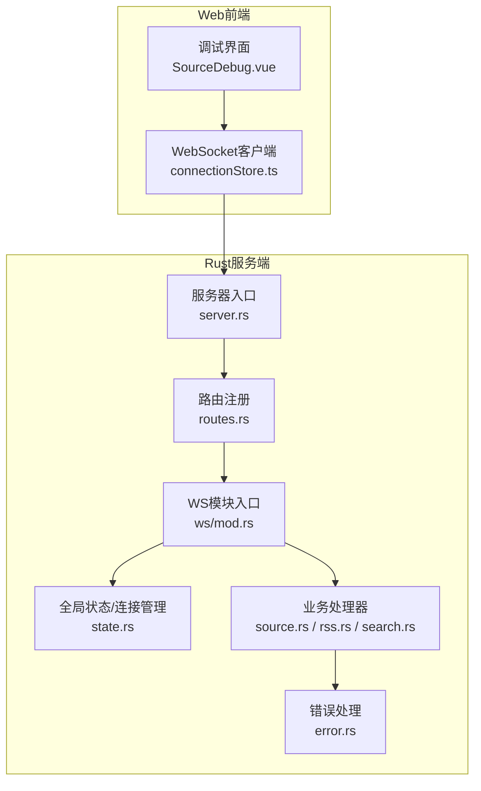
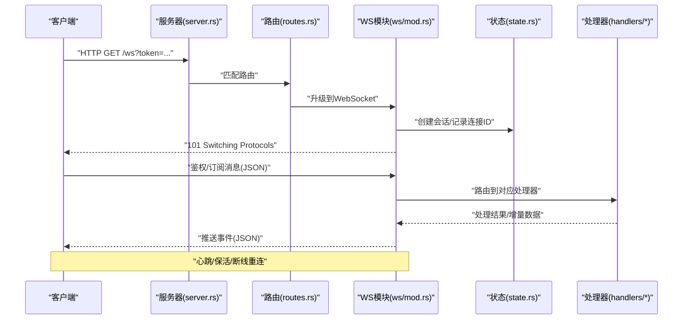
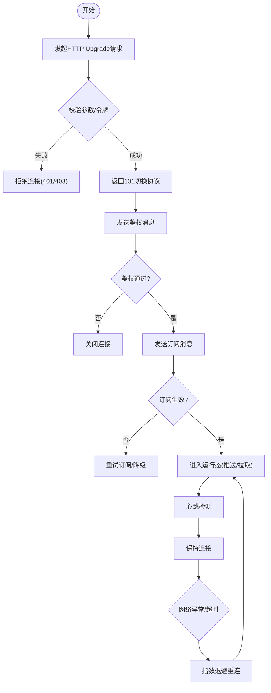
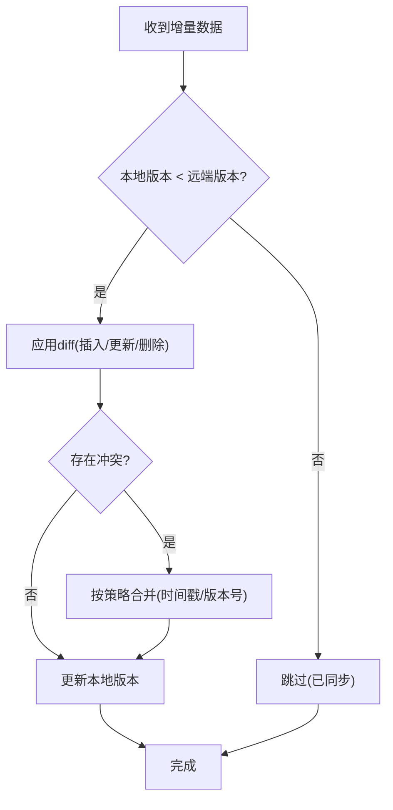
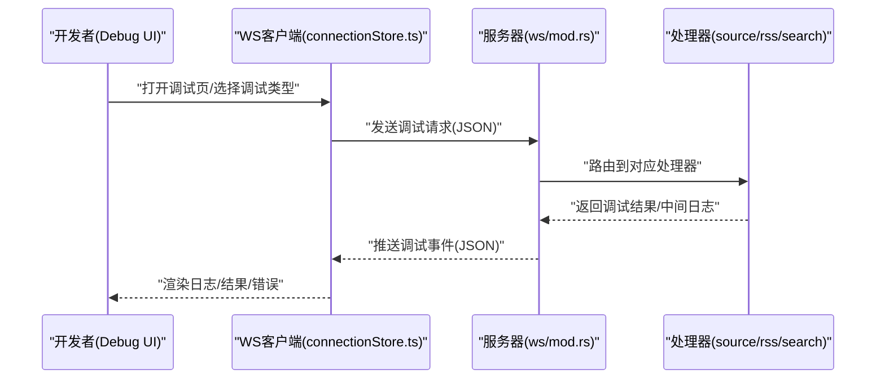
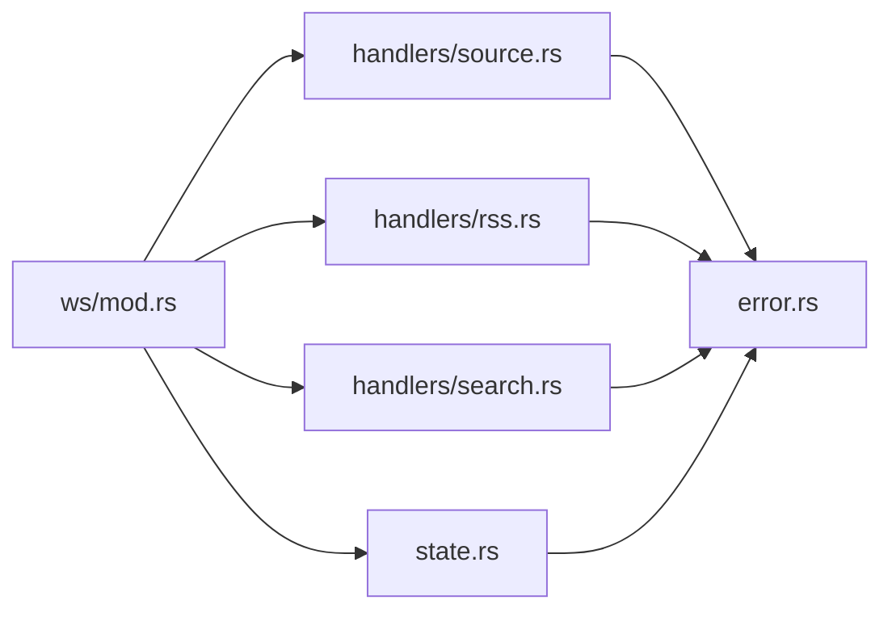

# WebSocket实时通信接口

<cite>
**本文引用的文件**   
- [server.rs](file://rust/legado-server/src/server.rs)
- [routes.rs](file://rust/legado-server/src/routes.rs)
- [state.rs](file://rust/legado-server/src/state.rs)
- [lib.rs](file://rust/legado-server/src/lib.rs)
- [error.rs](file://rust/legado-server/src/error.rs)
- [ws/mod.rs](file://rust/legado-server/src/ws/mod.rs)
- [handlers/source.rs](file://rust/legado-server/src/handlers/source.rs)
- [handlers/rss.rs](file://rust/legado-server/src/handlers/rss.rs)
- [handlers/search.rs](file://rust/legado-server/src/handlers/search.rs)
- [connectionStore.ts](file://modules/web/src/store/connectionStore.ts)
- [api/index.ts](file://modules/web/src/api/index.ts)
- [SourceDebug.vue](file://modules/web/src/components/SourceDebug.vue)
</cite>

## 目录
1. [简介](#简介)
2. [项目结构](#项目结构)
3. [核心组件](#核心组件)
4. [架构总览](#架构总览)
5. [详细组件分析](#详细组件分析)
6. [依赖关系分析](#依赖关系分析)
7. [性能考虑](#性能考虑)
8. [故障排查指南](#故障排查指南)
9. [结论](#结论)
10. [附录](#附录)

## 简介
本文件面向开发者与集成方，系统化说明Legado服务端WebSocket实时通信能力。内容涵盖连接建立流程、握手协议、连接状态管理；消息格式定义（JSON结构、事件类型、数据传输格式）；实时同步机制（增量更新、冲突解决、断线重连策略）；调试相关WebSocket接口（书籍源调试、RSS源调试、搜索调试等开发工具接口）；并提供连接示例、消息示例、错误处理与异常恢复机制，以及客户端集成指南和性能优化建议。

## 项目结构
本项目采用多模块架构：
- Rust后端服务：提供HTTP与WebSocket路由、会话状态管理、错误处理与处理器分发。
- Web前端模块：提供调试页面与WebSocket连接管理、消息收发封装。
- Flutter/Rust桥接：用于跨平台能力，但WebSocket主要位于Rust服务端与Web前端之间。

**图表来源** 
- [server.rs](file://rust/legado-server/src/server.rs)
- [routes.rs](file://rust/legado-server/src/routes.rs)
- [state.rs](file://rust/legado-server/src/state.rs)
- [ws/mod.rs](file://rust/legado-server/src/ws/mod.rs)
- [handlers/source.rs](file://rust/legado-server/src/handlers/source.rs)
- [handlers/rss.rs](file://rust/legado-server/src/handlers/rss.rs)
- [handlers/search.rs](file://rust/legado-server/src/handlers/search.rs)
- [error.rs](file://rust/legado-server/src/error.rs)

**章节来源**
- [server.rs](file://rust/legado-server/src/server.rs)
- [routes.rs](file://rust/legado-server/src/routes.rs)
- [state.rs](file://rust/legado-server/src/state.rs)
- [lib.rs](file://rust/legado-server/src/lib.rs)

## 核心组件
- 服务器与路由
  - 负责启动HTTP服务、注册WebSocket路径、将请求分发给WS模块与处理器。
- WS模块
  - 实现握手升级、连接生命周期管理、消息路由与广播。
- 连接状态管理
  - 维护活跃连接集合、会话上下文、订阅关系与限流/配额。
- 业务处理器
  - 针对书籍源、RSS、搜索等场景的消息处理与结果推送。
- 错误处理
  - 统一错误码、异常信息、重试与降级策略。

**章节来源**
- [ws/mod.rs](file://rust/legado-server/src/ws/mod.rs)
- [state.rs](file://rust/legado-server/src/state.rs)
- [handlers/source.rs](file://rust/legado-server/src/handlers/source.rs)
- [handlers/rss.rs](file://rust/legado-server/src/handlers/rss.rs)
- [handlers/search.rs](file://rust/legado-server/src/handlers/search.rs)
- [error.rs](file://rust/legado-server/src/error.rs)

## 架构总览
WebSocket通信整体流程如下：
- 客户端发起HTTP Upgrade请求到指定路径。
- 服务端完成握手并创建WS会话，加入连接池。
- 客户端发送鉴权或订阅消息，服务端校验后建立订阅通道。
- 服务端按事件类型推送增量数据，客户端根据消息字段进行本地同步。
- 断线时客户端执行指数退避重连，服务端清理无效连接。

**图表来源** 
- [server.rs](file://rust/legado-server/src/server.rs)
- [routes.rs](file://rust/legado-server/src/routes.rs)
- [ws/mod.rs](file://rust/legado-server/src/ws/mod.rs)
- [state.rs](file://rust/legado-server/src/state.rs)
- [handlers/source.rs](file://rust/legado-server/src/handlers/source.rs)
- [handlers/rss.rs](file://rust/legado-server/src/handlers/rss.rs)
- [handlers/search.rs](file://rust/legado-server/src/handlers/search.rs)

## 详细组件分析

### 连接建立与握手协议
- 握手路径
  - 客户端通过HTTP GET发起Upgrade请求，携带必要的查询参数（如鉴权令牌、设备标识）。
- 握手响应
  - 服务端返回101状态码，完成协议升级，随后进入双向消息通道。
- 初始消息
  - 客户端在连接成功后立即发送鉴权与订阅消息，包含会话ID、权限范围与订阅列表。
- 连接状态机
  - 空闲 -> 已认证 -> 已订阅 -> 运行中 -> 断开（可恢复）

**图表来源** 
- [ws/mod.rs](file://rust/legado-server/src/ws/mod.rs)
- [state.rs](file://rust/legado-server/src/state.rs)

**章节来源**
- [ws/mod.rs](file://rust/legado-server/src/ws/mod.rs)
- [state.rs](file://rust/legado-server/src/state.rs)

### 消息格式定义
- 通用结构
  - 所有消息为JSON对象，包含以下字段：
    - type: 事件类型（字符串）
    - id: 消息唯一标识（字符串/数字）
    - ts: 时间戳（毫秒）
    - payload: 负载数据（对象/数组）
    - error: 错误信息（可选，对象）
- 事件类型
  - auth: 鉴权
  - subscribe: 订阅
  - unsubscribe: 取消订阅
  - heartbeat: 心跳
  - book_source_debug: 书籍源调试
  - rss_source_debug: RSS源调试
  - search_debug: 搜索调试
  - data: 数据推送（增量更新）
  - ack: 确认
  - error: 错误通知
- 数据传输格式
  - 增量更新使用diff结构，包含新增、修改、删除的条目列表及版本号。
  - 批量推送支持分页字段（page、pageSize、total）。

示例（以文字描述代替代码片段）：
- 鉴权消息：type=auth，payload包含token、deviceId、version。
- 订阅消息：type=subscribe，payload包含channels（如book_source、rss、search）、filters（过滤条件）。
- 数据推送：type=data，payload包含channel、action（insert/update/delete）、items[]、version。
- 错误通知：type=error，payload包含code、message、retryable。

**章节来源**
- [ws/mod.rs](file://rust/legado-server/src/ws/mod.rs)
- [handlers/source.rs](file://rust/legado-server/src/handlers/source.rs)
- [handlers/rss.rs](file://rust/legado-server/src/handlers/rss.rs)
- [handlers/search.rs](file://rust/legado-server/src/handlers/search.rs)

### 实时同步机制
- 增量更新
  - 服务端维护数据版本与变更日志，推送时仅下发差异项，减少带宽消耗。
- 冲突解决
  - 基于版本号与时间戳合并策略，优先保留最新写入；对冲突字段提供回滚与人工干预接口。
- 断线重连
  - 客户端实现指数退避与最大重试次数限制；重连后从最近版本号拉取缺失数据。
- 幂等性
  - 所有写入操作支持idempotent键，避免重复提交导致的数据不一致。

**图表来源** 
- [state.rs](file://rust/legado-server/src/state.rs)
- [handlers/source.rs](file://rust/legado-server/src/handlers/source.rs)

**章节来源**
- [state.rs](file://rust/legado-server/src/state.rs)
- [handlers/source.rs](file://rust/legado-server/src/handlers/source.rs)
- [handlers/rss.rs](file://rust/legado-server/src/handlers/rss.rs)
- [handlers/search.rs](file://rust/legado-server/src/handlers/search.rs)

### 调试相关WebSocket接口
- 书籍源调试
  - 事件：book_source_debug
  - 用途：模拟书籍源抓取、解析、缓存命中情况，便于规则调试。
  - 输入：sourceId、url、headers、rules、debugFlags。
  - 输出：请求日志、解析结果、错误堆栈、耗时统计。
- RSS源调试
  - 事件：rss_source_debug
  - 用途：验证RSS抓取与文章解析规则，查看分类、标签、封面等元数据。
  - 输入：feedUrl、fetchOptions、parseRules。
  - 输出：文章列表、元数据、错误详情。
- 搜索调试
  - 事件：search_debug
  - 用途：调试搜索关键词、索引命中率、排序与分页逻辑。
  - 输入：keyword、filters、sort、page、pageSize。
  - 输出：搜索结果、命中详情、性能指标。

**图表来源** 
- [connectionStore.ts](file://modules/web/src/store/connectionStore.ts)
- [SourceDebug.vue](file://modules/web/src/components/SourceDebug.vue)
- [ws/mod.rs](file://rust/legado-server/src/ws/mod.rs)
- [handlers/source.rs](file://rust/legado-server/src/handlers/source.rs)
- [handlers/rss.rs](file://rust/legado-server/src/handlers/rss.rs)
- [handlers/search.rs](file://rust/legado-server/src/handlers/search.rs)

**章节来源**
- [handlers/source.rs](file://rust/legado-server/src/handlers/source.rs)
- [handlers/rss.rs](file://rust/legado-server/src/handlers/rss.rs)
- [handlers/search.rs](file://rust/legado-server/src/handlers/search.rs)
- [connectionStore.ts](file://modules/web/src/store/connectionStore.ts)
- [SourceDebug.vue](file://modules/web/src/components/SourceDebug.vue)

### 错误处理与异常恢复
- 错误分类
  - 认证失败、权限不足、参数校验错误、业务异常、网络异常。
- 错误码与消息
  - 统一error.code与error.message，附带retryable标志指示是否可自动重试。
- 恢复策略
  - 客户端根据retryable与错误码决定重试间隔与上限；服务端提供降级接口与只读模式。
- 日志与追踪
  - 每个请求分配traceId，便于前后端联合定位问题。

**章节来源**
- [error.rs](file://rust/legado-server/src/error.rs)
- [ws/mod.rs](file://rust/legado-server/src/ws/mod.rs)

## 依赖关系分析
- 模块耦合
  - WS模块依赖状态管理与处理器；处理器依赖数据库与外部网络库；错误处理贯穿全链路。
- 外部依赖
  - HTTP服务器框架、WebSocket库、序列化库、异步运行时。
- 潜在循环依赖
  - 处理器与状态管理应保持单向依赖，避免循环调用。

**图表来源** 
- [ws/mod.rs](file://rust/legado-server/src/ws/mod.rs)
- [state.rs](file://rust/legado-server/src/state.rs)
- [handlers/source.rs](file://rust/legado-server/src/handlers/source.rs)
- [handlers/rss.rs](file://rust/legado-server/src/handlers/rss.rs)
- [handlers/search.rs](file://rust/legado-server/src/handlers/search.rs)
- [error.rs](file://rust/legado-server/src/error.rs)

**章节来源**
- [lib.rs](file://rust/legado-server/src/lib.rs)
- [routes.rs](file://rust/legado-server/src/routes.rs)

## 性能考虑
- 连接管理
  - 限制单进程最大连接数，启用连接池与复用；定期清理空闲连接。
- 消息压缩
  - 对大Payload启用gzip/deflate压缩，降低带宽占用。
- 批处理与节流
  - 聚合高频小消息为批次推送；对写操作实施限流与背压。
- 内存与CPU
  - 避免大对象常驻内存；使用零拷贝序列化；合理设置协程/线程池大小。
- 监控与告警
  - 暴露QPS、延迟、错误率、连接数等指标，配置阈值告警。

[本节为通用指导，不直接分析具体文件]

## 故障排查指南
- 常见问题
  - 握手失败：检查URL、端口、防火墙、证书与代理设置。
  - 鉴权失败：核对token有效期、权限范围与设备绑定。
  - 订阅无数据：确认频道名称、过滤条件与服务端订阅状态。
  - 频繁断线：检查网络质量、心跳间隔与服务器负载。
- 诊断步骤
  - 开启调试日志，捕获traceId；对比客户端与服务端时间戳。
  - 使用抓包工具验证握手与消息序列；检查JSON结构与字段完整性。
  - 逐步缩小订阅范围，定位问题频道或处理器。
- 恢复措施
  - 客户端指数退避重连；服务端重启健康检查与资源回收。

**章节来源**
- [error.rs](file://rust/legado-server/src/error.rs)
- [ws/mod.rs](file://rust/legado-server/src/ws/mod.rs)

## 结论
本WebSocket实时通信方案以清晰的握手流程、统一的JSON消息格式与稳健的状态管理为基础，结合增量同步、冲突解决与断线重连策略，满足高并发与低延迟的实时需求。调试接口覆盖书籍源、RSS与搜索等关键场景，便于开发与排障。通过性能优化与监控告警，系统可在复杂网络环境下保持稳定可靠。

[本节为总结性内容，不直接分析具体文件]

## 附录
- 客户端集成要点
  - 初始化连接：构建URL与参数，建立WebSocket连接。
  - 鉴权与订阅：连接成功后立即发送鉴权与订阅消息。
  - 消息处理：根据type分发处理，维护本地状态与版本。
  - 心跳与重连：实现心跳检测与指数退避重连。
  - 错误处理：依据error.code与retryable制定重试与降级策略。
- 参考实现位置
  - 连接管理：connectionStore.ts
  - API封装：api/index.ts
  - 调试界面：SourceDebug.vue

**章节来源**
- [connectionStore.ts](file://modules/web/src/store/connectionStore.ts)
- [api/index.ts](file://modules/web/src/api/index.ts)
- [SourceDebug.vue](file://modules/web/src/components/SourceDebug.vue)