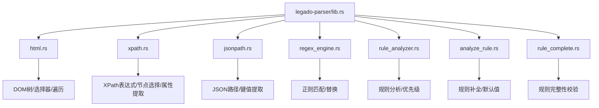
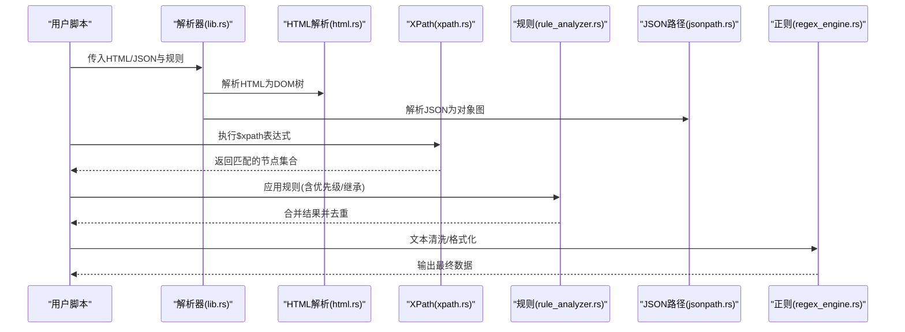
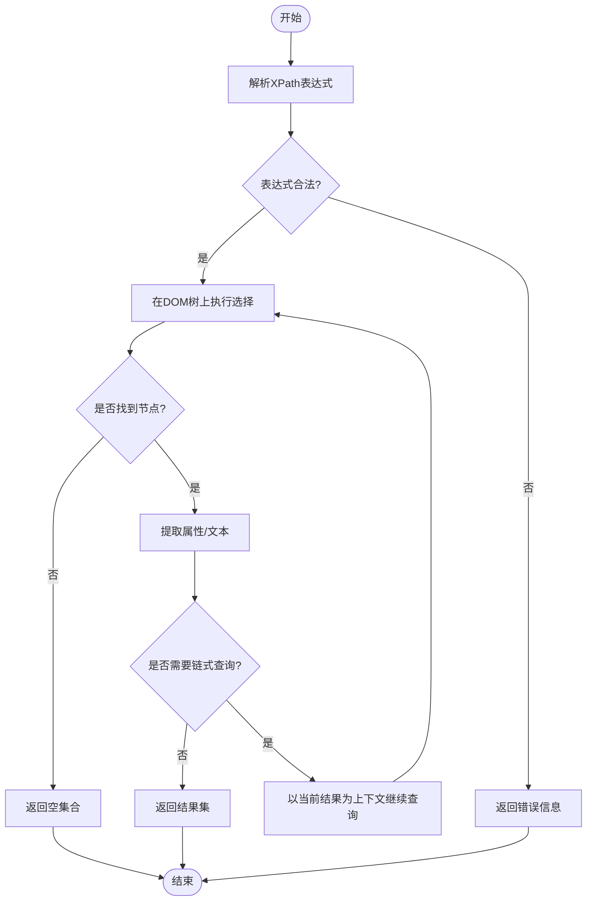
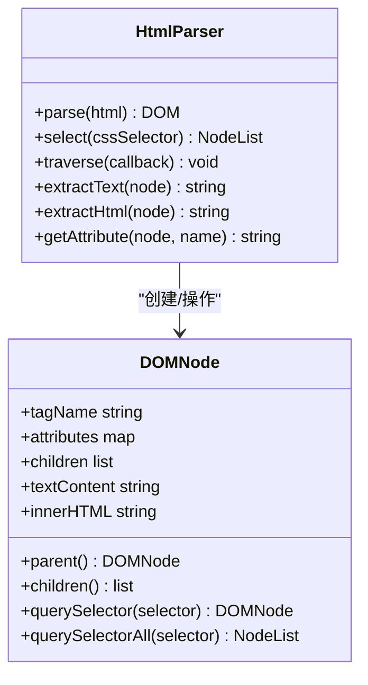
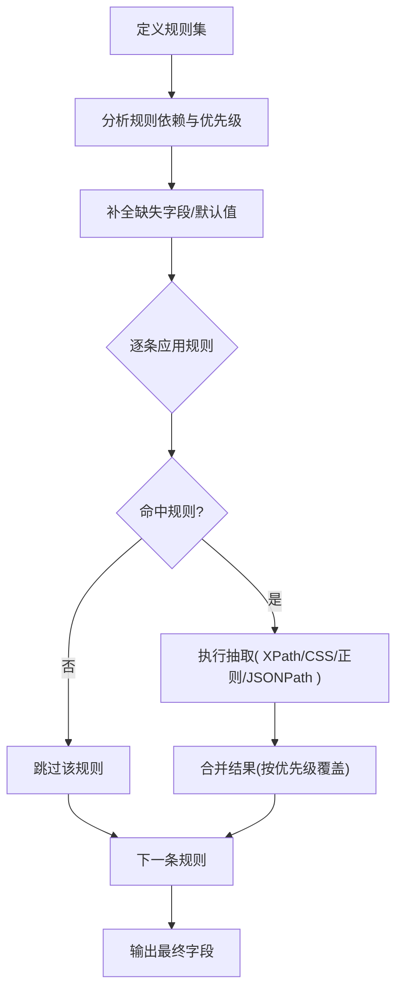
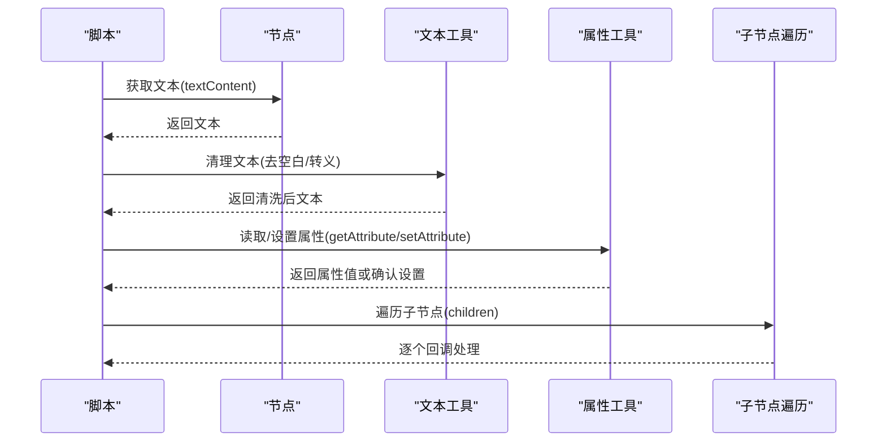
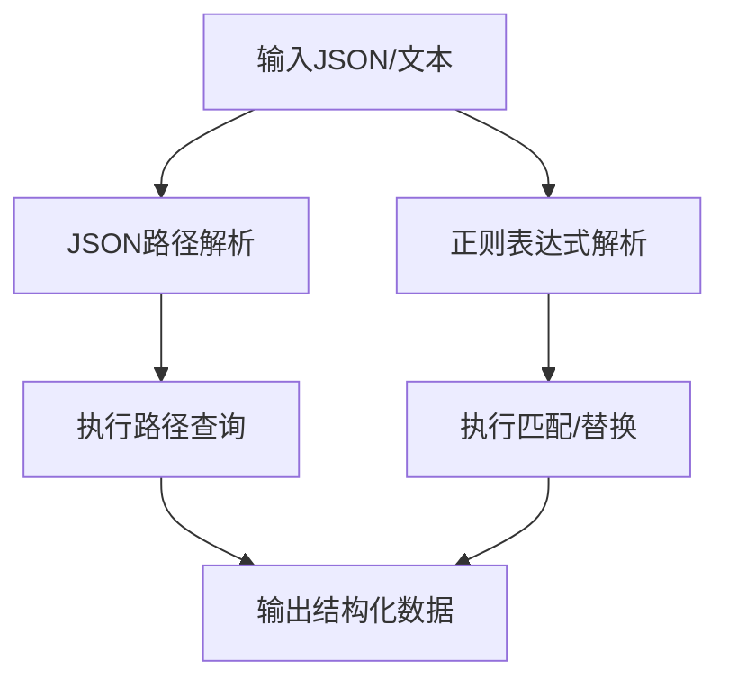
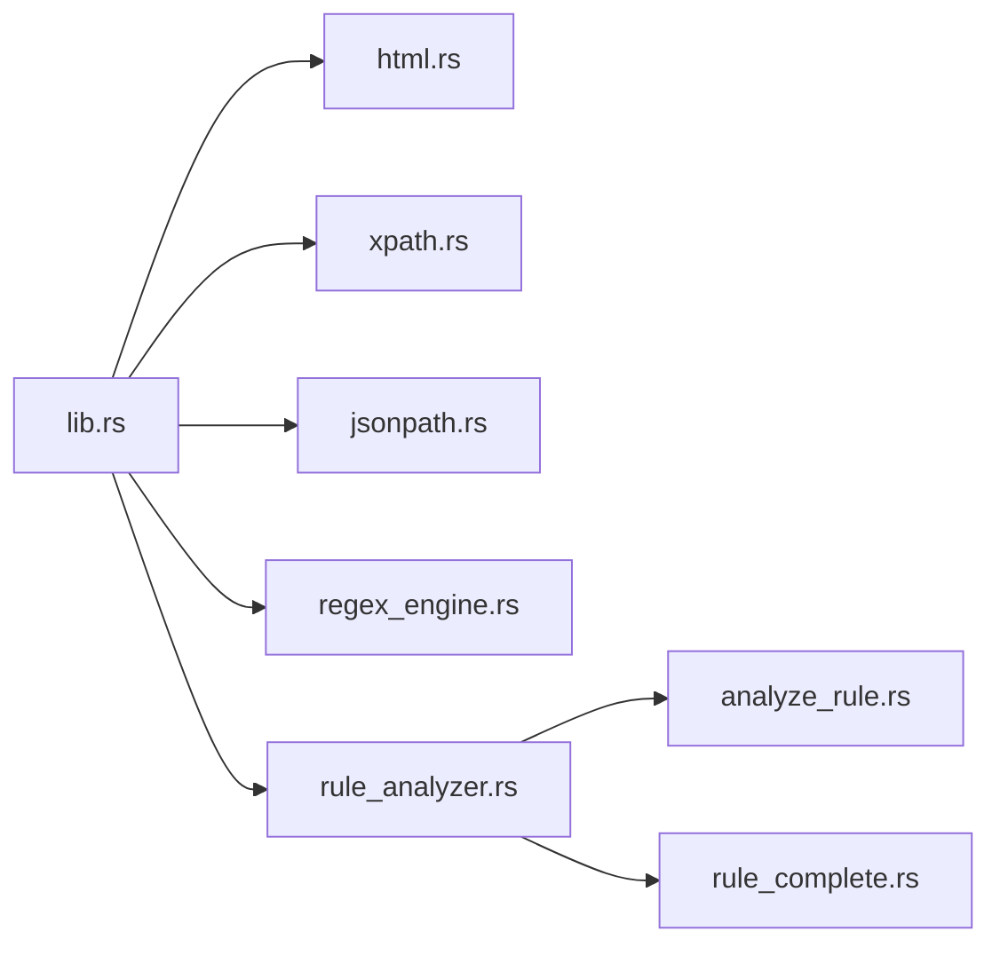

# DOM解析API

<cite>
**本文引用的文件**   
- [lib.rs](file://rust/legado-parser/src/lib.rs)
- [html.rs](file://rust/legado-parser/src/html.rs)
- [xpath.rs](file://rust/legado-parser/src/xpath.rs)
- [jsonpath.rs](file://rust/legado-parser/src/jsonpath.rs)
- [regex_engine.rs](file://rust/legado-parser/src/regex_engine.rs)
- [rule_analyzer.rs](file://rust/legado-parser/src/rule_analyzer.rs)
- [analyze_rule.rs](file://rust/legado-parser/src/analyze_rule.rs)
- [rule_complete.rs](file://rust/legado-parser/src/rule_complete.rs)
</cite>

## 目录
1. [简介](#简介)
2. [项目结构](#项目结构)
3. [核心组件](#核心组件)
4. [架构总览](#架构总览)
5. [详细组件分析](#详细组件分析)
6. [依赖关系分析](#依赖关系分析)
7. [性能考虑](#性能考虑)
8. [故障排查指南](#故障排查指南)
9. [结论](#结论)
10. [附录](#附录)

## 简介
本文件面向Legado项目的DOM解析API，重点说明以下能力：
- $xpath对象的使用方法：XPath表达式语法、节点选择、属性提取
- HTML解析器功能：CSS选择器支持、标签遍历、内容提取
- 规则匹配机制：规则定义、优先级、继承关系
- 元素操作：文本获取、属性设置、子节点遍历
- 解析性能优化技巧与常见问题解决方案
- 丰富的解析示例与调试方法

该文档基于仓库中的解析模块（legado-parser）及相关实现进行梳理，力求为开发者提供从概念到实践的完整参考。

## 项目结构
解析相关代码集中在Rust的legado-parser模块中，主要文件包括：
- lib.rs：模块入口与对外暴露的解析能力
- html.rs：HTML解析与DOM树构建、选择器与遍历
- xpath.rs：XPath表达式解析与执行
- jsonpath.rs：JSON路径解析与执行（用于JSON数据抽取）
- regex_engine.rs：正则引擎封装与调用
- rule_analyzer.rs / analyze_rule.rs / rule_complete.rs：规则分析与补全、优先级与继承处理

图表来源
- [lib.rs](file://rust/legado-parser/src/lib.rs)
- [html.rs](file://rust/legado-parser/src/html.rs)
- [xpath.rs](file://rust/legado-parser/src/xpath.rs)
- [jsonpath.rs](file://rust/legado-parser/src/jsonpath.rs)
- [regex_engine.rs](file://rust/legado-parser/src/regex_engine.rs)
- [rule_analyzer.rs](file://rust/legado-parser/src/rule_analyzer.rs)
- [analyze_rule.rs](file://rust/legado-parser/src/analyze_rule.rs)
- [rule_complete.rs](file://rust/legado-parser/src/rule_complete.rs)

章节来源
- [lib.rs](file://rust/legado-parser/src/lib.rs)
- [html.rs](file://rust/legado-parser/src/html.rs)
- [xpath.rs](file://rust/legado-parser/src/xpath.rs)
- [jsonpath.rs](file://rust/legado-parser/src/jsonpath.rs)
- [regex_engine.rs](file://rust/legado-parser/src/regex_engine.rs)
- [rule_analyzer.rs](file://rust/legado-parser/src/rule_analyzer.rs)
- [analyze_rule.rs](file://rust/legado-parser/src/analyze_rule.rs)
- [rule_complete.rs](file://rust/legado-parser/src/rule_complete.rs)

## 核心组件
- $xpath对象：提供XPath表达式执行接口，支持节点选择、属性读取、文本提取、上下文限定等
- HTML解析器：将原始HTML字符串解析为DOM树，支持CSS选择器定位、标签遍历、内容提取
- 规则系统：通过规则定义描述如何从DOM或JSON中提取目标字段，包含优先级与继承机制
- 正则引擎：在规则或后处理阶段使用正则进行文本清洗、格式化与提取
- JSON路径：对JSON数据进行路径式访问与过滤

章节来源
- [xpath.rs](file://rust/legado-parser/src/xpath.rs)
- [html.rs](file://rust/legado-parser/src/html.rs)
- [rule_analyzer.rs](file://rust/legado-parser/src/rule_analyzer.rs)
- [regex_engine.rs](file://rust/legado-parser/src/regex_engine.rs)
- [jsonpath.rs](file://rust/legado-parser/src/jsonpath.rs)

## 架构总览
下图展示了从输入到输出的整体流程：HTML或JSON输入经解析器生成结构化数据，$xpath与CSS选择器用于定位节点，规则系统根据优先级与继承关系组合多个抽取策略，最终输出目标字段。

图表来源
- [lib.rs](file://rust/legado-parser/src/lib.rs)
- [html.rs](file://rust/legado-parser/src/html.rs)
- [xpath.rs](file://rust/legado-parser/src/xpath.rs)
- [rule_analyzer.rs](file://rust/legado-parser/src/rule_analyzer.rs)
- [jsonpath.rs](file://rust/legado-parser/src/jsonpath.rs)
- [regex_engine.rs](file://rust/legado-parser/src/regex_engine.rs)

## 详细组件分析

### $xpath对象与XPath表达式
- 表达式语法：支持标准XPath常用轴、谓词、函数与运算符；可在上下文中限定搜索范围
- 节点选择：按标签名、属性、层级关系与条件筛选返回节点集合
- 属性提取：从选中节点读取属性值或文本内容，支持批量提取与默认值回退
- 上下文与链式调用：可基于前一步结果继续查询，形成链式选择

图表来源
- [xpath.rs](file://rust/legado-parser/src/xpath.rs)

章节来源
- [xpath.rs](file://rust/legado-parser/src/xpath.rs)

### HTML解析器与CSS选择器
- HTML解析：将原始HTML转换为DOM树，处理常见不规范标记与嵌套
- CSS选择器：支持基础选择器（标签、类、ID、属性、伪类等），用于快速定位节点
- 标签遍历：提供深度优先或广度优先遍历，便于批量处理与统计
- 内容提取：从节点及其子树中提取文本、HTML片段或特定属性

图表来源
- [html.rs](file://rust/legado-parser/src/html.rs)

章节来源
- [html.rs](file://rust/legado-parser/src/html.rs)

### 规则匹配机制（定义、优先级、继承）
- 规则定义：每个字段可通过一个或多个规则描述抽取逻辑，支持XPath/CSS/正则/JSONPath等多种策略
- 优先级：多条规则按优先级排序，高优先级先执行并可覆盖低优先级结果
- 继承关系：父级规则可被子级规则继承或覆盖，便于复用通用抽取逻辑
- 规则补全：缺失字段时自动填充默认值或派生值

图表来源
- [rule_analyzer.rs](file://rust/legado-parser/src/rule_analyzer.rs)
- [analyze_rule.rs](file://rust/legado-parser/src/analyze_rule.rs)
- [rule_complete.rs](file://rust/legado-parser/src/rule_complete.rs)

章节来源
- [rule_analyzer.rs](file://rust/legado-parser/src/rule_analyzer.rs)
- [analyze_rule.rs](file://rust/legado-parser/src/analyze_rule.rs)
- [rule_complete.rs](file://rust/legado-parser/src/rule_complete.rs)

### 元素操作（文本、属性、子节点）
- 文本获取：从节点或其子树提取纯文本，去除多余空白与换行
- 属性设置：读取或更新节点的属性值，支持批量操作
- 子节点遍历：按顺序访问子节点，支持条件过滤与聚合计算

图表来源
- [html.rs](file://rust/legado-parser/src/html.rs)

章节来源
- [html.rs](file://rust/legado-parser/src/html.rs)

### JSON路径与正则引擎
- JSON路径：通过路径表达式访问嵌套对象与数组，支持过滤与投影
- 正则引擎：在规则或后处理阶段进行模式匹配、替换与提取

图表来源
- [jsonpath.rs](file://rust/legado-parser/src/jsonpath.rs)
- [regex_engine.rs](file://rust/legado-parser/src/regex_engine.rs)

章节来源
- [jsonpath.rs](file://rust/legado-parser/src/jsonpath.rs)
- [regex_engine.rs](file://rust/legado-parser/src/regex_engine.rs)

## 依赖关系分析
- 模块耦合：lib.rs作为入口协调各子模块；html.rs与xpath.rs分别负责DOM与XPath；rule_*系列负责规则生命周期管理
- 外部依赖：正则引擎与JSON路径为独立能力，供规则与后处理复用
- 循环依赖：通过分层设计避免循环引用，确保解析流程单向推进

图表来源
- [lib.rs](file://rust/legado-parser/src/lib.rs)
- [html.rs](file://rust/legado-parser/src/html.rs)
- [xpath.rs](file://rust/legado-parser/src/xpath.rs)
- [jsonpath.rs](file://rust/legado-parser/src/jsonpath.rs)
- [regex_engine.rs](file://rust/legado-parser/src/regex_engine.rs)
- [rule_analyzer.rs](file://rust/legado-parser/src/rule_analyzer.rs)
- [analyze_rule.rs](file://rust/legado-parser/src/analyze_rule.rs)
- [rule_complete.rs](file://rust/legado-parser/src/rule_complete.rs)

章节来源
- [lib.rs](file://rust/legado-parser/src/lib.rs)
- [rule_analyzer.rs](file://rust/legado-parser/src/rule_analyzer.rs)

## 性能考虑
- 选择器优化：优先使用精确的选择器（如ID、类名），减少回溯与全树扫描
- 缓存与复用：对频繁使用的XPath/CSS表达式进行编译与缓存，避免重复解析
- 流式处理：对大文档采用分块或惰性遍历，降低内存占用
- 规则合并：合并相邻规则以减少多次遍历，利用批量操作提升吞吐
- 正则优化：预编译正则、限制匹配范围，避免灾难性回溯

[本节为通用指导，不直接分析具体文件]

## 故障排查指南
- 表达式错误：检查XPath/CSS/JSONPath语法合法性，逐步缩小范围定位问题节点
- 规则冲突：查看优先级与继承关系，确认是否存在覆盖或遗漏
- 性能瓶颈：启用调试日志，记录关键步骤耗时，识别热点路径
- 数据异常：验证输入格式与编码，必要时增加清洗与校验步骤

章节来源
- [xpath.rs](file://rust/legado-parser/src/xpath.rs)
- [html.rs](file://rust/legado-parser/src/html.rs)
- [rule_analyzer.rs](file://rust/legado-parser/src/rule_analyzer.rs)

## 结论
Legado的DOM解析API通过$xpath对象、HTML解析器与规则系统协同工作，提供了强大的节点选择、内容提取与数据处理能力。合理运用选择器、规则优先级与正则工具，可以在保证准确性的同时获得良好的性能表现。建议在实际使用中结合调试手段持续优化表达式与规则配置。

[本节为总结性内容，不直接分析具体文件]

## 附录
- 常见用法示例（概念性）
  - 使用$xpath选择标题与正文：通过XPath定位h1/h2与段落节点，提取文本并拼接
  - 使用CSS选择器抓取列表项：选择ul/li并按需过滤属性
  - 规则继承与覆盖：父规则定义通用字段，子规则覆盖特定站点差异
  - 正则清洗：去除多余空格、换行与HTML标签残留
- 调试建议
  - 打印中间结果与选择器命中情况
  - 逐步简化表达式，定位失败点
  - 对比不同规则的优先级与覆盖效果

[本节为概念性内容，不直接分析具体文件]