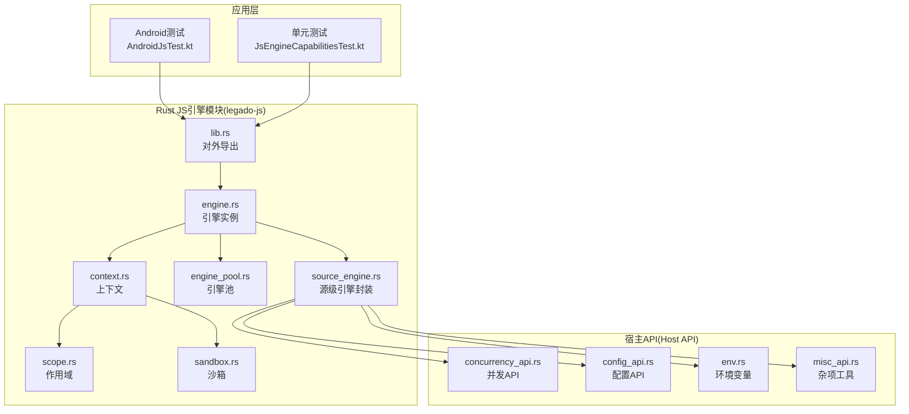
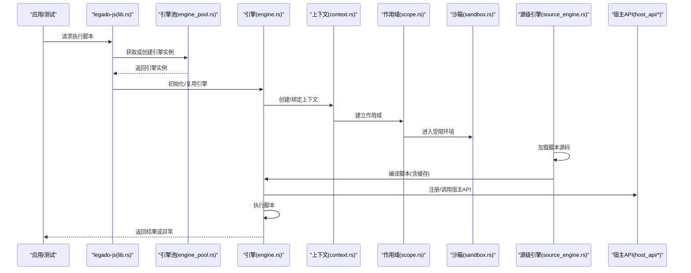
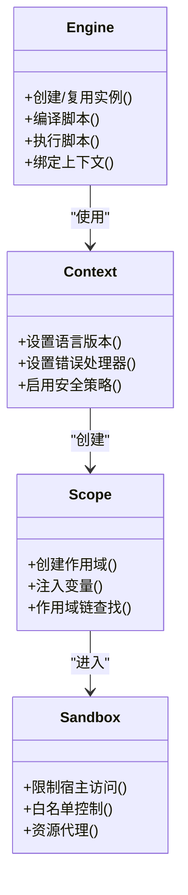
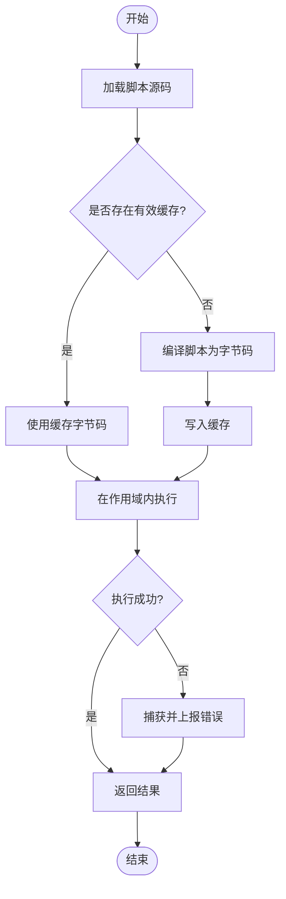
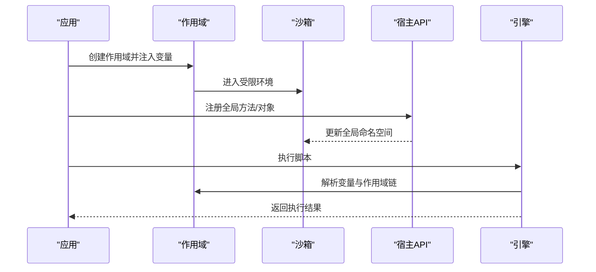
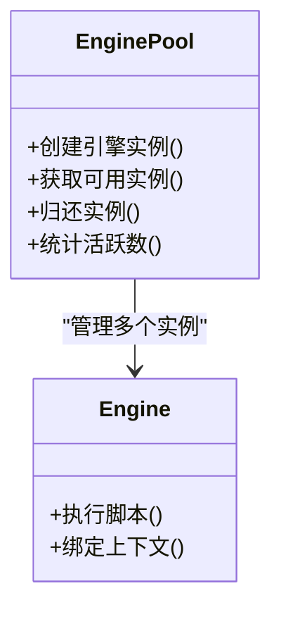
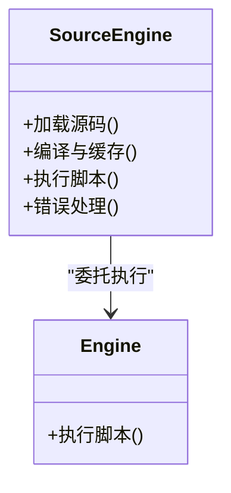
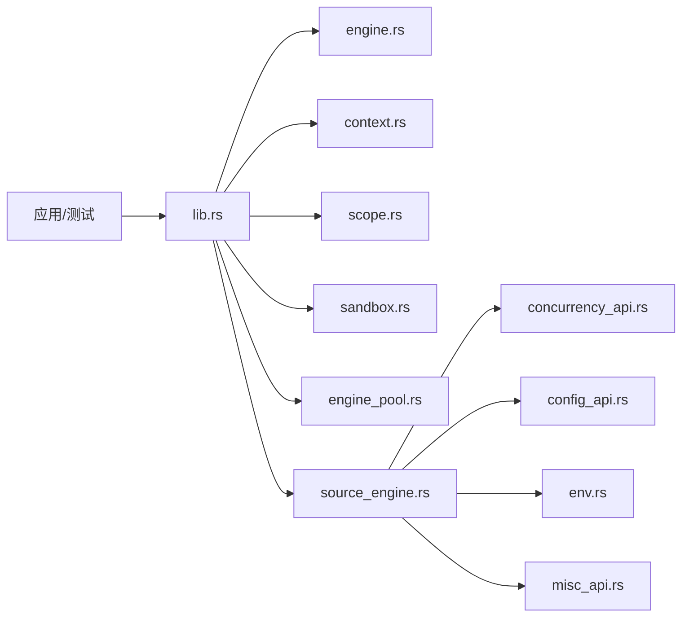

# JavaScript引擎API

<cite>
**本文引用的文件**   
- [engine.rs](file://rust/legado-js/src/engine.rs)
- [context.rs](file://rust/legado-js/src/context.rs)
- [sandbox.rs](file://rust/legado-js/src/sandbox.rs)
- [scope.rs](file://rust/legado-js/src/scope.rs)
- [engine_pool.rs](file://rust/legado-js/src/engine_pool.rs)
- [source_engine.rs](file://rust/legado-js/src/source_engine.rs)
- [lib.rs](file://rust/legado-js/src/lib.rs)
- [concurrency_api.rs](file://rust/legado-js/src/host_api/concurrency_api.rs)
- [config_api.rs](file://rust/legado-js/src/host_api/config_api.rs)
- [env.rs](file://rust/legado-js/src/host_api/env.rs)
- [misc_api.rs](file://rust/legado-js/src/host_api/misc_api.rs)
- [AndroidJsTest.kt](file://app/src/androidTest/java/io/legado/app/AndroidJsTest.kt)
- [JsEngineCapabilitiesTest.kt](file://app/src/test/java/io/legado/app/JsEngineCapabilitiesTest.kt)
</cite>

## 目录
1. [简介](#简介)
2. [项目结构](#项目结构)
3. [核心组件](#核心组件)
4. [架构总览](#架构总览)
5. [详细组件分析](#详细组件分析)
6. [依赖关系分析](#依赖关系分析)
7. [性能与并发优化](#性能与并发优化)
8. [故障排查指南](#故障排查指南)
9. [结论](#结论)
10. [附录](#附录)

## 简介
本文件面向需要在Legado中集成和扩展Rhino JavaScript引擎的开发者，系统性说明引擎初始化、上下文管理、沙箱环境设置、脚本执行生命周期（编译、缓存、执行）、变量绑定与全局对象注入、以及性能优化与并发策略。文档同时给出关键流程图与类图，帮助快速理解代码结构与调用链。

## 项目结构
Legado在Rust侧通过legado-js模块提供JavaScript引擎能力，并在Android测试用例中验证其功能。核心目录与职责如下：
- Rust lego-js模块：引擎实例、上下文、作用域、沙箱、引擎池、源级引擎封装等
- Host API：向JS暴露的系统能力（并发、配置、环境变量、杂项工具）
- Android测试：对引擎能力进行端到端验证

图表来源 
- [engine.rs](file://rust/legado-js/src/engine.rs)
- [context.rs](file://rust/legado-js/src/context.rs)
- [sandbox.rs](file://rust/legado-js/src/sandbox.rs)
- [scope.rs](file://rust/legado-js/src/scope.rs)
- [engine_pool.rs](file://rust/legado-js/src/engine_pool.rs)
- [source_engine.rs](file://rust/legado-js/src/source_engine.rs)
- [lib.rs](file://rust/legado-js/src/lib.rs)
- [concurrency_api.rs](file://rust/legado-js/src/host_api/concurrency_api.rs)
- [config_api.rs](file://rust/legado-js/src/host_api/config_api.rs)
- [env.rs](file://rust/legado-js/src/host_api/env.rs)
- [misc_api.rs](file://rust/legado-js/src/host_api/misc_api.rs)
- [AndroidJsTest.kt](file://app/src/androidTest/java/io/legado/app/AndroidJsTest.kt)
- [JsEngineCapabilitiesTest.kt](file://app/src/test/java/io/legado/app/JsEngineCapabilitiesTest.kt)

章节来源
- [lib.rs](file://rust/legado-js/src/lib.rs)
- [engine.rs](file://rust/legado-js/src/engine.rs)
- [context.rs](file://rust/legado-js/src/context.rs)
- [sandbox.rs](file://rust/legado-js/src/sandbox.rs)
- [scope.rs](file://rust/legado-js/src/scope.rs)
- [engine_pool.rs](file://rust/legado-js/src/engine_pool.rs)
- [source_engine.rs](file://rust/legado-js/src/source_engine.rs)

## 核心组件
- 引擎实例(engine.rs)：负责创建和管理Rhino引擎实例，提供脚本编译与执行入口。
- 上下文(context.rs)：管理JS运行时的上下文状态，包括安全策略、语言版本、错误处理等。
- 作用域(scope.rs)：定义脚本执行的作用域边界，支持变量隔离与作用域链操作。
- 沙箱(sandbox.rs)：为脚本提供受限的执行环境，限制访问宿主资源，确保安全性。
- 引擎池(engine_pool.rs)：维护一组可复用的引擎实例，降低创建开销，提升吞吐。
- 源级引擎(source_engine.rs)：面向“数据源”场景的封装，统一加载、编译、缓存与执行流程。
- 宿主API(host_api/*)：向JS暴露系统能力，如并发、配置、环境变量、通用工具函数等。

章节来源
- [engine.rs](file://rust/legado-js/src/engine.rs)
- [context.rs](file://rust/legado-js/src/context.rs)
- [scope.rs](file://rust/legado-js/src/scope.rs)
- [sandbox.rs](file://rust/legado-js/src/sandbox.rs)
- [engine_pool.rs](file://rust/legado-js/src/engine_pool.rs)
- [source_engine.rs](file://rust/legado-js/src/source_engine.rs)
- [concurrency_api.rs](file://rust/legado-js/src/host_api/concurrency_api.rs)
- [config_api.rs](file://rust/legado-js/src/host_api/config_api.rs)
- [env.rs](file://rust/legado-js/src/host_api/env.rs)
- [misc_api.rs](file://rust/legado-js/src/host_api/misc_api.rs)

## 架构总览
下图展示从应用层到引擎层的调用路径，以及脚本执行的关键阶段（加载、编译、缓存、执行）。

图表来源 
- [lib.rs](file://rust/legado-js/src/lib.rs)
- [engine_pool.rs](file://rust/legado-js/src/engine_pool.rs)
- [engine.rs](file://rust/legado-js/src/engine.rs)
- [context.rs](file://rust/legado-js/src/context.rs)
- [scope.rs](file://rust/legado-js/src/scope.rs)
- [sandbox.rs](file://rust/legado-js/src/sandbox.rs)
- [source_engine.rs](file://rust/legado-js/src/source_engine.rs)
- [concurrency_api.rs](file://rust/legado-js/src/host_api/concurrency_api.rs)
- [config_api.rs](file://rust/legado-js/src/host_api/config_api.rs)
- [env.rs](file://rust/legado-js/src/host_api/env.rs)
- [misc_api.rs](file://rust/legado-js/src/host_api/misc_api.rs)

## 详细组件分析

### 引擎实例与上下文管理
- 引擎实例负责生命周期管理与脚本执行入口，通常由引擎池分配与回收。
- 上下文包含语言特性开关、错误处理器、安全策略等；作用域用于隔离变量与函数。
- 沙箱限制脚本对宿主资源的访问，保证执行安全。

图表来源 
- [engine.rs](file://rust/legado-js/src/engine.rs)
- [context.rs](file://rust/legado-js/src/context.rs)
- [scope.rs](file://rust/legado-js/src/scope.rs)
- [sandbox.rs](file://rust/legado-js/src/sandbox.rs)

章节来源
- [engine.rs](file://rust/legado-js/src/engine.rs)
- [context.rs](file://rust/legado-js/src/context.rs)
- [scope.rs](file://rust/legado-js/src/scope.rs)
- [sandbox.rs](file://rust/legado-js/src/sandbox.rs)

### 脚本执行生命周期（编译、缓存、执行）
- 加载：从文件或内存读取脚本源码。
- 编译：将源码编译为可执行字节码，并写入缓存（按脚本标识键）。
- 执行：在指定作用域内执行已编译脚本，必要时调用宿主API。
- 缓存命中：若存在有效缓存，则跳过编译直接执行。

图表来源 
- [source_engine.rs](file://rust/legado-js/src/source_engine.rs)
- [engine.rs](file://rust/legado-js/src/engine.rs)

章节来源
- [source_engine.rs](file://rust/legado-js/src/source_engine.rs)
- [engine.rs](file://rust/legado-js/src/engine.rs)

### 变量绑定与全局对象注入
- 作用域注入：在作用域创建时注入变量与方法，供脚本访问。
- 全局对象：可通过宿主API向全局对象添加方法或属性，实现扩展点。
- 隔离机制：不同作用域之间的变量互不可见，避免污染。

图表来源 
- [scope.rs](file://rust/legado-js/src/scope.rs)
- [sandbox.rs](file://rust/legado-js/src/sandbox.rs)
- [concurrency_api.rs](file://rust/legado-js/src/host_api/concurrency_api.rs)
- [config_api.rs](file://rust/legado-js/src/host_api/config_api.rs)
- [env.rs](file://rust/legado-js/src/host_api/env.rs)
- [misc_api.rs](file://rust/legado-js/src/host_api/misc_api.rs)
- [engine.rs](file://rust/legado-js/src/engine.rs)

章节来源
- [scope.rs](file://rust/legado-js/src/scope.rs)
- [sandbox.rs](file://rust/legado-js/src/sandbox.rs)
- [concurrency_api.rs](file://rust/legado-js/src/host_api/concurrency_api.rs)
- [config_api.rs](file://rust/legado-js/src/host_api/config_api.rs)
- [env.rs](file://rust/legado-js/src/host_api/env.rs)
- [misc_api.rs](file://rust/legado-js/src/host_api/misc_api.rs)
- [engine.rs](file://rust/legado-js/src/engine.rs)

### 引擎池与并发执行策略
- 引擎池维护固定数量的引擎实例，减少频繁创建销毁的开销。
- 线程安全：每个引擎实例通常绑定单线程上下文，避免跨线程共享。
- 并发策略：任务分发到空闲引擎实例，支持限流与队列化。

图表来源 
- [engine_pool.rs](file://rust/legado-js/src/engine_pool.rs)
- [engine.rs](file://rust/legado-js/src/engine.rs)

章节来源
- [engine_pool.rs](file://rust/legado-js/src/engine_pool.rs)
- [engine.rs](file://rust/legado-js/src/engine.rs)

### 源级引擎封装
- 面向数据源的统一封装，屏蔽底层引擎差异。
- 提供加载、编译、缓存、执行的标准化接口。
- 便于在不同数据源间复用相同的执行策略。

图表来源 
- [source_engine.rs](file://rust/legado-js/src/source_engine.rs)
- [engine.rs](file://rust/legado-js/src/engine.rs)

章节来源
- [source_engine.rs](file://rust/legado-js/src/source_engine.rs)
- [engine.rs](file://rust/legado-js/src/engine.rs)

### 宿主API扩展点
- 并发API：提供异步执行、任务调度、线程池接入等能力。
- 配置API：允许脚本读取或修改运行时配置。
- 环境变量：暴露进程环境变量，便于脚本感知运行环境。
- 杂项工具：字符串、日期、加密、JSON等常用工具函数。

章节来源
- [concurrency_api.rs](file://rust/legado-js/src/host_api/concurrency_api.rs)
- [config_api.rs](file://rust/legado-js/src/host_api/config_api.rs)
- [env.rs](file://rust/legado-js/src/host_api/env.rs)
- [misc_api.rs](file://rust/legado-js/src/host_api/misc_api.rs)

## 依赖关系分析
- 应用层通过lib.rs对外导出能力，内部依赖engine、context、scope、sandbox、engine_pool、source_engine等模块。
- source_engine依赖engine与host_api，形成“执行+扩展”的解耦结构。
- 测试用例验证引擎能力，确保行为稳定。

图表来源 
- [lib.rs](file://rust/legado-js/src/lib.rs)
- [engine.rs](file://rust/legado-js/src/engine.rs)
- [context.rs](file://rust/legado-js/src/context.rs)
- [scope.rs](file://rust/legado-js/src/scope.rs)
- [sandbox.rs](file://rust/legado-js/src/sandbox.rs)
- [engine_pool.rs](file://rust/legado-js/src/engine_pool.rs)
- [source_engine.rs](file://rust/legado-js/src/source_engine.rs)
- [concurrency_api.rs](file://rust/legado-js/src/host_api/concurrency_api.rs)
- [config_api.rs](file://rust/legado-js/src/host_api/config_api.rs)
- [env.rs](file://rust/legado-js/src/host_api/env.rs)
- [misc_api.rs](file://rust/legado-js/src/host_api/misc_api.rs)

章节来源
- [lib.rs](file://rust/legado-js/src/lib.rs)
- [engine.rs](file://rust/legado-js/src/engine.rs)
- [source_engine.rs](file://rust/legado-js/src/source_engine.rs)

## 性能与并发优化
- 内存管理：合理设置上下文与对象生命周期，避免长时间持有大对象；利用引擎池复用实例。
- 线程安全：每个引擎实例绑定单线程上下文，禁止跨线程共享；通过引擎池进行任务分发。
- 并发执行：采用队列与限流策略，避免过载；优先复用缓存字节码以减少编译开销。
- 缓存策略：按脚本标识键缓存编译结果，支持失效与更新机制。

[本节为通用指导，不直接分析具体文件]

## 故障排查指南
- 常见问题：
  - 脚本执行超时：检查并发队列长度与引擎池大小，适当扩容。
  - 内存溢出：排查大对象引用与未释放上下文，缩短作用域生命周期。
  - 权限不足：确认沙箱白名单与宿主API授权。
  - 缓存不一致：清理缓存后重试，确保脚本标识唯一。
- 调试建议：
  - 启用错误处理器，记录堆栈与上下文信息。
  - 使用测试用例定位问题，参考AndroidJsTest.kt与JsEngineCapabilitiesTest.kt。

章节来源
- [AndroidJsTest.kt](file://app/src/androidTest/java/io/legado/app/AndroidJsTest.kt)
- [JsEngineCapabilitiesTest.kt](file://app/src/test/java/io/legado/app/JsEngineCapabilitiesTest.kt)

## 结论
Legado的JavaScript引擎通过清晰的模块化设计，实现了安全的沙箱执行、高效的编译缓存、稳定的并发策略与灵活的宿主API扩展。开发者可基于此快速集成与定制脚本执行能力，满足多样化业务需求。

## 附录
- 术语表：
  - 引擎实例：Rhino引擎的运行实体
  - 上下文：脚本运行的环境与配置
  - 作用域：变量可见性与生命周期的边界
  - 沙箱：受限执行环境
  - 宿主API：向脚本暴露的系统能力

[本节为概念性内容，不直接分析具体文件]