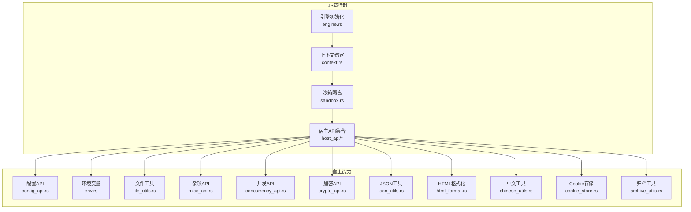
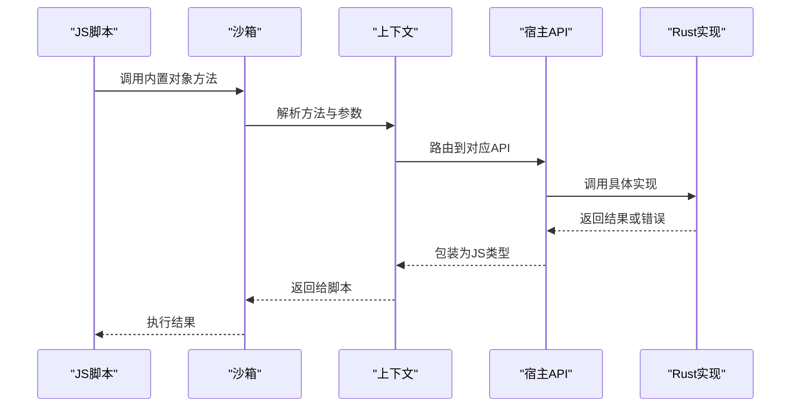
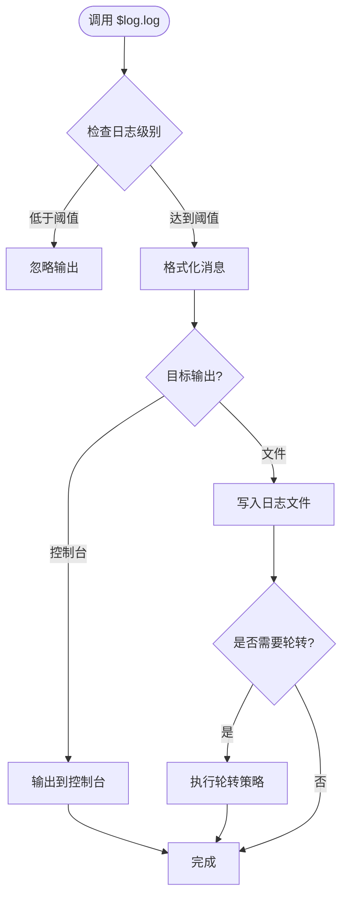

# 内置对象和方法

<cite>
**本文档引用的文件**   
- [legado-js/src/lib.rs](file://rust/legado-js/src/lib.rs)
- [legado-js/src/engine.rs](file://rust/legado-js/src/engine.rs)
- [legado-js/src/sandbox.rs](file://rust/legado-js/src/sandbox.rs)
- [legado-js/src/context.rs](file://rust/legado-js/src/context.rs)
- [legado-js/src/host_api/mod.rs](file://rust/legado-js/src/host_api/mod.rs)
- [legado-js/src/host_api/config_api.rs](file://rust/legado-js/src/host_api/config_api.rs)
- [legado-js/src/host_api/env.rs](file://rust/legado-js/src/host_api/env.rs)
- [legado-js/src/host_api/file_utils.rs](file://rust/legado-js/src/host_api/file_utils.rs)
- [legado-js/src/host_api/misc_api.rs](file://rust/legado-js/src/host_api/misc_api.rs)
- [legado-js/src/host_api/concurrency_api.rs](file://rust/legado-js/src/host_api/concurrency_api.rs)
- [legado-js/src/host_api/crypto_api.rs](file://rust/legado-js/src/host_api/crypto_api.rs)
- [legado-js/src/host_api/json_utils.rs](file://rust/legado-js/src/host_api/json_utils.rs)
- [legado-js/src/host_api/html_format.rs](file://rust/legado-js/src/host_api/html_format.rs)
- [legado-js/src/host_api/chinese_utils.rs](file://rust/legado-js/src/host_api/chinese_utils.rs)
- [legado-js/src/host_api/cookie_store.rs](file://rust/legado-js/src/host_api/cookie_store.rs)
- [legado-js/src/host_api/archive_utils.rs](file://rust/legado-js/src/host_api/archive_utils.rs)
</cite>

## 目录
1. [简介](#简介)
2. [项目结构](#项目结构)
3. [核心组件](#核心组件)
4. [架构总览](#架构总览)
5. [详细组件分析](#详细组件分析)
6. [依赖关系分析](#依赖关系分析)
7. [性能考虑](#性能考虑)
8. [故障排查指南](#故障排查指南)
9. [结论](#结论)
10. [附录](#附录)

## 简介
本文件面向Legado的JavaScript脚本环境，系统化梳理并说明所有可用的内置对象与方法，包括但不限于：$js、$config、$storage、$log等。内容覆盖方法签名、参数类型与返回值说明；环境变量与配置访问（应用信息、用户设置、系统属性）；日志记录（级别、输出格式、文件管理）；文件操作、系统调用与平台特定功能API；并提供参考手册与使用示例路径，帮助开发者快速上手与排错。

## 项目结构
Legado的JS运行时由Rust模块提供，核心位于rust/legado-js目录。该模块负责：
- 初始化JS引擎与上下文
- 暴露宿主API到JS世界（配置、环境、文件、并发、加密、JSON、HTML格式化、中文工具、Cookie存储、归档工具等）
- 沙箱隔离执行脚本

**图表来源**
- [legado-js/src/engine.rs](file://rust/legado-js/src/engine.rs)
- [legado-js/src/context.rs](file://rust/legado-js/src/context.rs)
- [legado-js/src/sandbox.rs](file://rust/legado-js/src/sandbox.rs)
- [legado-js/src/host_api/mod.rs](file://rust/legado-js/src/host_api/mod.rs)

**章节来源**
- [legado-js/src/lib.rs](file://rust/legado-js/src/lib.rs)
- [legado-js/src/engine.rs](file://rust/legado-js/src/engine.rs)
- [legado-js/src/context.rs](file://rust/legado-js/src/context.rs)
- [legado-js/src/sandbox.rs](file://rust/legado-js/src/sandbox.rs)

## 核心组件
本节概述JS脚本可访问的核心内置对象及其职责边界。每个对象均通过宿主API层暴露给JS世界，并在沙箱中安全运行。

- $js：JS运行时基础能力封装，包含常用工具、平台信息与扩展入口。
- $config：应用与用户配置访问，支持读取/写入持久化键值对与结构化配置。
- $storage：本地存储接口，用于跨会话数据持久化（如缓存、临时数据）。
- $log：日志记录器，支持多级别、格式化输出与文件管理。
- 其他常用对象：$http、$file、$json、$crypto、$env、$misc、$archive、$cookie等（详见后续章节）。

**章节来源**
- [legado-js/src/host_api/mod.rs](file://rust/legado-js/src/host_api/mod.rs)
- [legado-js/src/sandbox.rs](file://rust/legado-js/src/sandbox.rs)

## 架构总览
下图展示从JS脚本到宿主能力的调用链：脚本在沙箱内执行，通过上下文绑定访问宿主API，最终由Rust实现具体能力。

**图表来源**
- [legado-js/src/sandbox.rs](file://rust/legado-js/src/sandbox.rs)
- [legado-js/src/context.rs](file://rust/legado-js/src/context.rs)
- [legado-js/src/host_api/mod.rs](file://rust/legado-js/src/host_api/mod.rs)

## 详细组件分析

### $js 对象
- 职责：提供JS运行时基础能力，包括平台信息、版本、扩展入口等。
- 主要属性与方法（示例）：
  - platform：获取运行平台标识（Android/iOS/Web等）
  - version：获取运行时版本
  - extend(name, fn)：注册自定义扩展函数
  - utils.*：通用工具方法（编码、时间戳、随机数等）
- 参数与返回：各方法遵循JS原生类型约定，错误以异常抛出。
- 使用建议：优先使用$js.utils中的稳定工具，避免直接依赖平台差异。

**章节来源**
- [legado-js/src/host_api/misc_api.rs](file://rust/legado-js/src/host_api/misc_api.rs)
- [legado-js/src/context.rs](file://rust/legado-js/src/context.rs)

### $config 对象
- 职责：访问应用与用户配置，支持键值与结构化配置读写。
- 主要方法（示例）：
  - get(key, default?)：读取配置项，支持默认值
  - set(key, value)：写入配置项
  - has(key)：判断是否存在某配置项
  - remove(key)：删除配置项
  - getAll()：导出全部配置为对象
  - reset()：恢复默认配置
- 数据类型：支持字符串、数字、布尔、数组、对象等JS类型。
- 持久化：自动持久化至应用配置存储。
- 错误处理：非法键名或权限不足时抛出异常。

**章节来源**
- [legado-js/src/host_api/config_api.rs](file://rust/legado-js/src/host_api/config_api.rs)

### $storage 对象
- 职责：提供轻量级本地存储，适用于缓存与临时数据。
- 主要方法（示例）：
  - put(key, value, options?)：存入数据，支持过期时间等选项
  - get(key)：读取数据
  - remove(key)：删除数据
  - clear()：清空所有数据
  - keys()：列出所有键
- 数据结构：支持基本类型与序列化对象。
- 性能：适合小数据量高频读写，大数据建议使用文件系统。

**章节来源**
- [legado-js/src/host_api/misc_api.rs](file://rust/legado-js/src/host_api/misc_api.rs)

### $log 对象
- 职责：统一日志记录，支持多级别、格式化输出与文件管理。
- 日志级别：
  - debug：调试信息
  - info：一般信息
  - warn：警告信息
  - error：错误信息
- 方法（示例）：
  - log(level, message, ...args)：通用日志输出
  - debug/info/warn/error(message, ...args)：快捷方法
  - file(path, options?)：指定输出文件与格式
  - rotate(maxSize, maxFiles)：日志轮转策略
- 输出格式：支持时间戳、级别、模块名、消息体。
- 文件管理：自动创建目录、按大小/数量轮转、压缩归档。

**图表来源**
- [legado-js/src/host_api/misc_api.rs](file://rust/legado-js/src/host_api/misc_api.rs)

**章节来源**
- [legado-js/src/host_api/misc_api.rs](file://rust/legado-js/src/host_api/misc_api.rs)

### 环境变量与系统信息（$env）
- 职责：访问环境变量与系统属性。
- 主要属性（示例）：
  - appInfo：应用名称、版本、包名等
  - system：操作系统、设备型号、内存、CPU等
  - network：网络状态、IP、代理等
  - user：当前用户ID、语言、时区等
- 只读性：大部分属性为只读，修改需通过$setEnv等方法（如有）。

**章节来源**
- [legado-js/src/host_api/env.rs](file://rust/legado-js/src/host_api/env.rs)

### 文件操作（$file）
- 职责：文件系统访问，支持读写、遍历、元数据操作。
- 主要方法（示例）：
  - read(path, encoding?)：读取文件内容
  - write(path, content, options?)：写入文件，支持追加模式
  - exists(path)：判断文件是否存在
  - delete(path)：删除文件或目录
  - list(dir)：列出目录内容
  - stat(path)：获取文件元数据（大小、时间等）
  - copy(src, dest)：复制文件
  - move(src, dest)：移动文件
- 编码：支持UTF-8、GBK等常见编码。
- 权限：受系统权限控制，需确保应用具备相应权限。

**章节来源**
- [legado-js/src/host_api/file_utils.rs](file://rust/legado-js/src/host_api/file_utils.rs)

### 并发与异步（$async）
- 职责：提供线程池与异步任务调度。
- 主要方法（示例）：
  - execute(task)：提交任务到线程池
  - delay(ms)：延迟执行
  - timeout(ms, task)：带超时的任务执行
  - parallel(tasks)：并行执行多个任务
  - serial(tasks)：串行执行多个任务
- 错误处理：任务异常会传播到调用方。

**章节来源**
- [legado-js/src/host_api/concurrency_api.rs](file://rust/legado-js/src/host_api/concurrency_api.rs)

### 加密与哈希（$crypto）
- 职责：提供常用加密算法与哈希函数。
- 主要方法（示例）：
  - md5(data)：MD5哈希
  - sha1(data)：SHA1哈希
  - sha256(data)：SHA256哈希
  - aesEncrypt(data, key, iv?)：AES加密
  - aesDecrypt(data, key, iv?)：AES解密
  - base64Encode(data)：Base64编码
  - base64Decode(data)：Base64解码
- 输入输出：支持字符串与字节数组。

**章节来源**
- [legado-js/src/host_api/crypto_api.rs](file://rust/legado-js/src/host_api/crypto_api.rs)

### JSON处理（$json）
- 职责：JSON序列化与反序列化。
- 主要方法（示例）：
  - parse(text)：解析JSON字符串
  - stringify(obj, space?)：序列化为JSON字符串
  - format(obj, indent?)：格式化输出
- 错误处理：无效JSON会抛出异常。

**章节来源**
- [legado-js/src/host_api/json_utils.rs](file://rust/legado-js/src/host_api/json_utils.rs)

### HTML格式化（$html）
- 职责：HTML清理、格式化与转换。
- 主要方法（示例）：
  - clean(html)：清理危险标签与属性
  - format(html, options?)：格式化HTML
  - toText(html)：提取纯文本
  - escape(text)：转义特殊字符
- 安全性：默认启用XSS防护。

**章节来源**
- [legado-js/src/host_api/html_format.rs](file://rust/legado-js/src/host_api/html_format.rs)

### 中文工具（$cn）
- 职责：中文文本处理，如繁简转换、拼音、分词等。
- 主要方法（示例）：
  - toTraditional(text)：简体转繁体
  - toSimplified(text)：繁体转简体
  - pinyin(text)：转换为拼音
  - segment(text)：中文分词
- 性能：大文本建议分批处理。

**章节来源**
- [legado-js/src/host_api/chinese_utils.rs](file://rust/legado-js/src/host_api/chinese_utils.rs)

### Cookie存储（$cookie）
- 职责：管理Cookie，支持域名与作用域。
- 主要方法（示例）：
  - set(name, value, options?)：设置Cookie
  - get(name)：获取指定Cookie
  - getAll()：获取所有Cookie
  - remove(name)：删除Cookie
  - clear()：清空所有Cookie
- 作用域：支持路径、域名、过期时间等选项。

**章节来源**
- [legado-js/src/host_api/cookie_store.rs](file://rust/legado-js/src/host_api/cookie_store.rs)

### 归档工具（$archive）
- 职责：压缩与解压常见归档格式。
- 主要方法（示例）：
  - zip.compress(files, output)：压缩为ZIP
  - zip.decompress(input, outputDir)：解压ZIP
  - tar.compress(files, output)：压缩为TAR
  - tar.decompress(input, outputDir)：解压TAR
- 格式支持：ZIP、TAR、GZIP等。

**章节来源**
- [legado-js/src/host_api/archive_utils.rs](file://rust/legado-js/src/host_api/archive_utils.rs)

### 杂项工具（$misc）
- 职责：提供通用工具函数，如时间、随机、编码等。
- 主要方法（示例）：
  - now()：当前时间戳
  - uuid()：生成UUID
  - random(min, max)：随机数
  - encodeURI(url)：URL编码
  - decodeURI(url)：URL解码
  - sleep(ms)：阻塞式延迟（谨慎使用）

**章节来源**
- [legado-js/src/host_api/misc_api.rs](file://rust/legado-js/src/host_api/misc_api.rs)

## 依赖关系分析
JS内置对象与宿主API的依赖关系如下：

```mermaid
classDiagram
class JSRuntime {
+platform
+version
+extend(name, fn)
}
class ConfigAPI {
+get(key, default)
+set(key, value)
+has(key)
+remove(key)
+getAll()
+reset()
}
class StorageAPI {
+put(key, value, options)
+get(key)
+remove(key)
+clear()
+keys()
}
class LogAPI {
+log(level, message, args)
+debug(message, args)
+info(message, args)
+warn(message, args)
+error(message, args)
+file(path, options)
+rotate(maxSize, maxFiles)
}
class EnvAPI {
+appInfo
+system
+network
+user
}
class FileAPI {
+read(path, encoding)
+write(path, content, options)
+exists(path)
+delete(path)
+list(dir)
+stat(path)
+copy(src, dest)
+move(src, dest)
}
class AsyncAPI {
+execute(task)
+delay(ms)
+timeout(ms, task)
+parallel(tasks)
+serial(tasks)
}
class CryptoAPI {
+md5(data)
+sha1(data)
+sha256(data)
+aesEncrypt(data, key, iv)
+aesDecrypt(data, key, iv)
+base64Encode(data)
+base64Decode(data)
}
class JSONAPI {
+parse(text)
+stringify(obj, space)
+format(obj, indent)
}
class HTMLAPI {
+clean(html)
+format(html, options)
+toText(html)
+escape(text)
}
class ChineseAPI {
+toTraditional(text)
+toSimplified(text)
+pinyin(text)
+segment(text)
}
class CookieAPI {
+set(name, value, options)
+get(name)
+getAll()
+remove(name)
+clear()
}
class ArchiveAPI {
+zip.compress(files, output)
+zip.decompress(input, outputDir)
+tar.compress(files, output)
+tar.decompress(input, outputDir)
}
class MiscAPI {
+now()
+uuid()
+random(min, max)
+encodeURI(url)
+decodeURI(url)
+sleep(ms)
}
JSRuntime --> ConfigAPI : "使用"
JSRuntime --> StorageAPI : "使用"
JSRuntime --> LogAPI : "使用"
JSRuntime --> EnvAPI : "使用"
JSRuntime --> FileAPI : "使用"
JSRuntime --> AsyncAPI : "使用"
JSRuntime --> CryptoAPI : "使用"
JSRuntime --> JSONAPI : "使用"
JSRuntime --> HTMLAPI : "使用"
JSRuntime --> ChineseAPI : "使用"
JSRuntime --> CookieAPI : "使用"
JSRuntime --> ArchiveAPI : "使用"
JSRuntime --> MiscAPI : "使用"
```

**图表来源**
- [legado-js/src/host_api/mod.rs](file://rust/legado-js/src/host_api/mod.rs)
- [legado-js/src/context.rs](file://rust/legado-js/src/context.rs)

**章节来源**
- [legado-js/src/host_api/mod.rs](file://rust/legado-js/src/host_api/mod.rs)

## 性能考虑
- 日志输出：生产环境建议关闭debug级别，减少I/O开销。
- 文件操作：批量操作时使用合并写入，避免频繁磁盘访问。
- 并发任务：合理设置线程池大小，避免过多上下文切换。
- 加密计算：大文件加密建议分块处理，降低内存占用。
- JSON处理：避免深层嵌套对象，必要时使用流式处理。

## 故障排查指南
- 权限问题：检查应用是否具备文件读写、网络访问等权限。
- 配置错误：验证配置键名与数据类型是否正确。
- 日志文件：确认日志目录存在且可写，检查轮转策略是否合理。
- 并发异常：查看线程池队列长度与任务超时设置。
- 加密失败：检查密钥长度与IV参数是否符合算法要求。

## 结论
Legado的JS内置对象提供了丰富的宿主能力，涵盖配置、存储、日志、文件、并发、加密、JSON、HTML、中文、Cookie、归档等领域。开发者可通过统一的API访问这些能力，构建强大的自动化脚本。建议遵循最佳实践，合理使用资源，确保脚本稳定高效运行。

## 附录
- 使用示例路径：请参考各API模块中的测试用例与示例脚本。
- 错误代码：查阅各API的错误码定义与处理建议。
- 更新日志：关注版本变更中的API增减与行为变化。