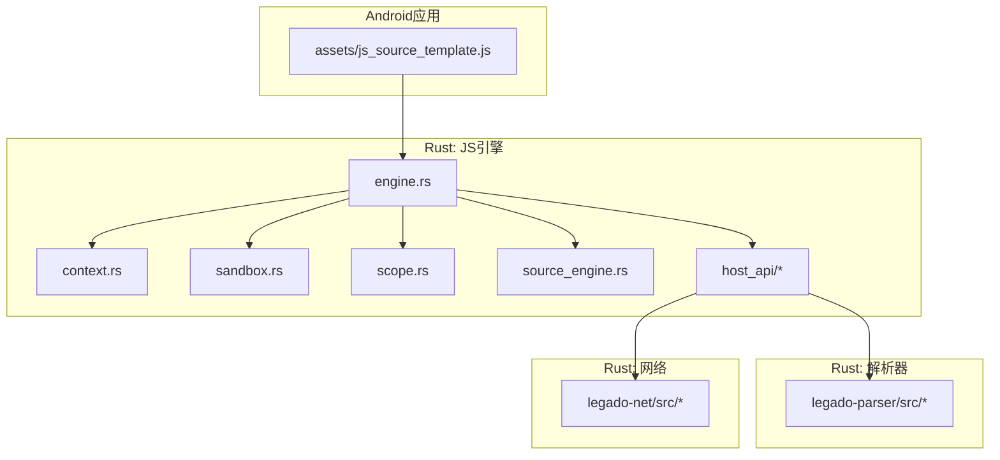
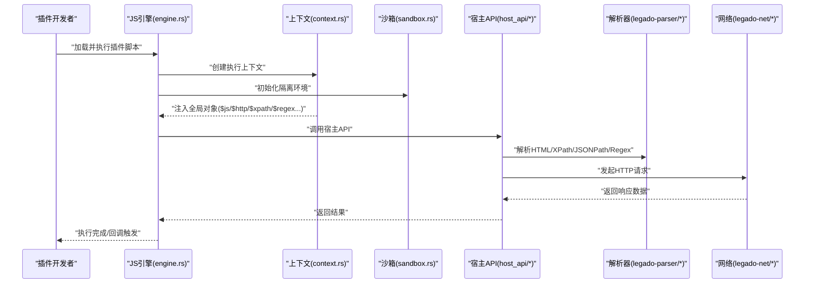
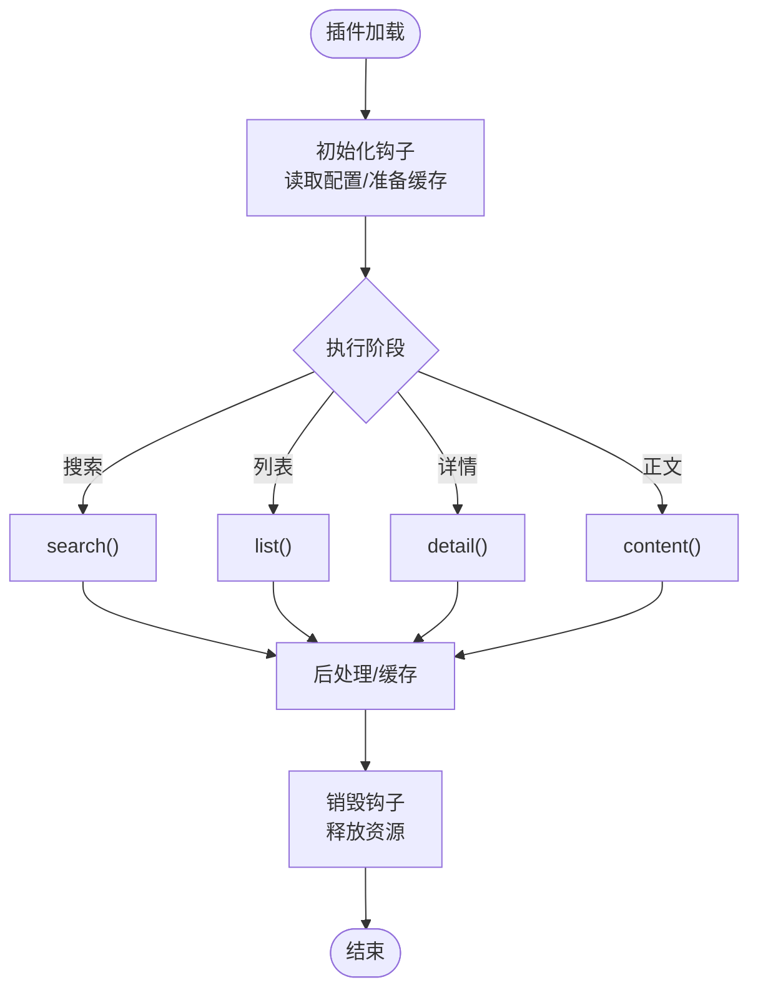
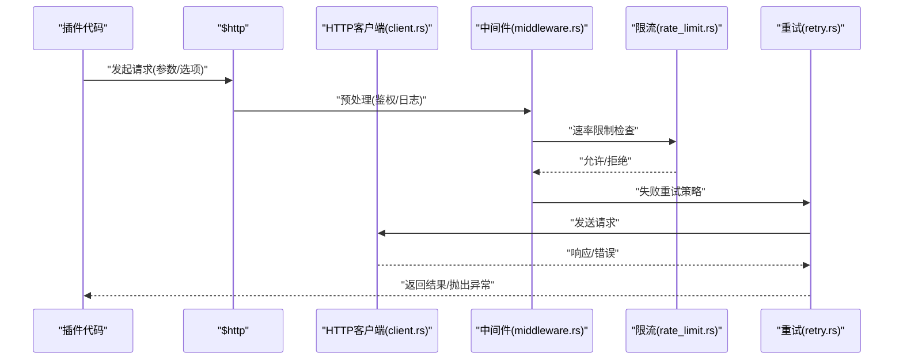
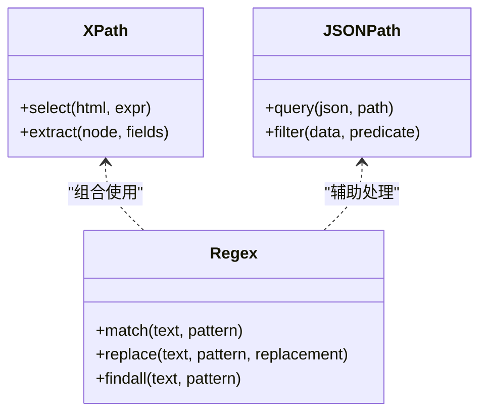
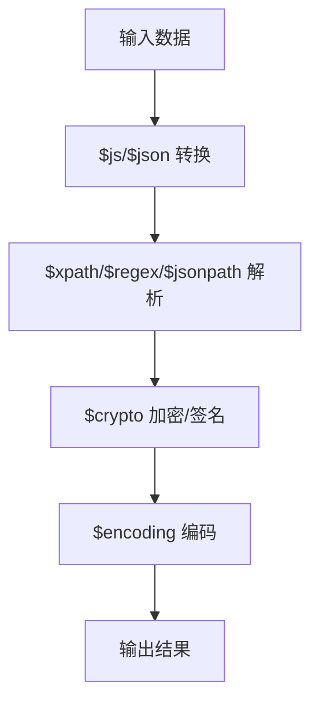
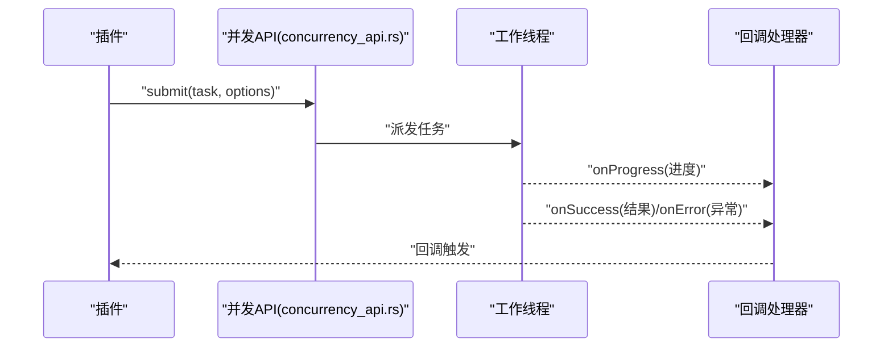
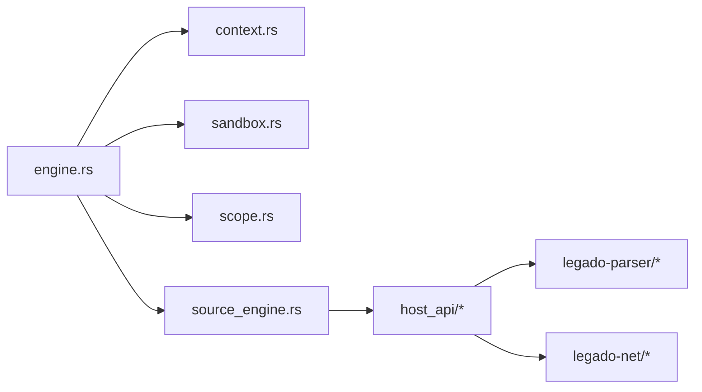
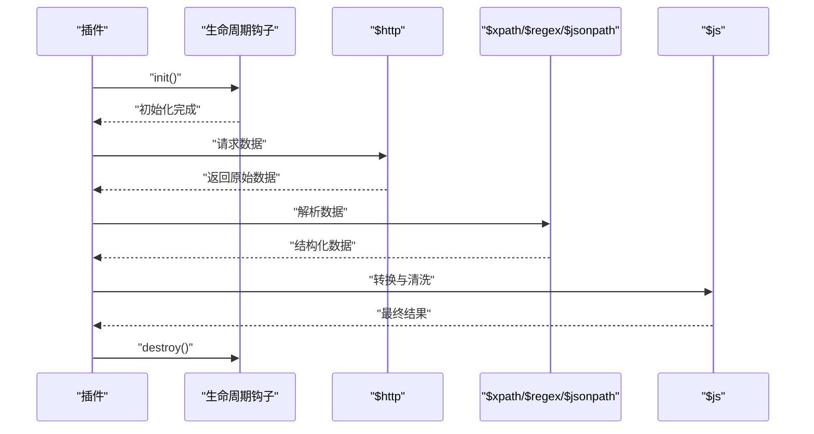

# 插件开发API

<cite>
**本文引用的文件**   
- [README.md](file://README.md)
- [engine.rs](file://rust/legado-js/src/engine.rs)
- [context.rs](file://rust/legado-js/src/context.rs)
- [sandbox.rs](file://rust/legado-js/src/sandbox.rs)
- [scope.rs](file://rust/legado-js/src/scope.rs)
- [source_engine.rs](file://rust/legado-js/src/source_engine.rs)
- [mod.rs (host_api)](file://rust/legado-js/src/host_api/mod.rs)
- [concurrency_api.rs](file://rust/legado-js/src/host_api/concurrency_api.rs)
- [config_api.rs](file://rust/legado-js/src/host_api/config_api.rs)
- [cookie_store.rs](file://rust/legado-js/src/host_api/cookie_store.rs)
- [crypto_api.rs](file://rust/legado-js/src/host_api/crypto_api.rs)
- [encoding.rs](file://rust/legado-js/src/host_api/encoding.rs)
- [file_utils.rs](file://rust/legado-js/src/host_api/file_utils.rs)
- [html_format.rs](file://rust/legado-js/src/host_api/html_format.rs)
- [json_utils.rs](file://rust/legado-js/src/host_api/json_utils.rs)
- [misc_api.rs](file://rust/legado-js/src/host_api/misc_api.rs)
- [env.rs](file://rust/legado-js/src/host_api/env.rs)
- [lib.rs (legado-js)](file://rust/legado-js/src/lib.rs)
- [lib.rs (legado-parser)](file://rust/legado-parser/src/lib.rs)
- [xpath.rs](file://rust/legado-parser/src/xpath.rs)
- [regex_engine.rs](file://rust/legado-parser/src/regex_engine.rs)
- [jsonpath.rs](file://rust/legado-parser/src/jsonpath.rs)
- [html.rs](file://rust/legado-parser/src/html.rs)
- [client.rs](file://rust/legado-net/src/client.rs)
- [request.rs](file://rust/legado-net/src/request.rs)
- [response.rs](file://rust/legado-net/src/response.rs)
- [middleware.rs](file://rust/legado-net/src/middleware.rs)
- [rate_limit.rs](file://rust/legado-net/src/rate_limit.rs)
- [retry.rs](file://rust/legado-net/src/retry.rs)
- [js_source_template.js](file://app/src/main/assets/js_source_template.js)
</cite>

## 目录
1. [简介](#简介)
2. [项目结构](#项目结构)
3. [核心组件](#核心组件)
4. [架构总览](#架构总览)
5. [详细组件分析](#详细组件分析)
6. [依赖关系分析](#依赖关系分析)
7. [性能考虑](#性能考虑)
8. [故障排查指南](#故障排查指南)
9. [结论](#结论)
10. [附录：API参考与示例](#附录api参考与示例)

## 简介
本文件面向Legado的JavaScript规则引擎插件开发者，系统性说明扩展接口、生命周期钩子、回调机制以及内置对象与方法。内容覆盖网络请求、HTML解析、数据处理等核心能力，并提供调试技巧与性能优化建议，帮助开发者快速构建稳定高效的插件。

## 项目结构
Legado的JS插件能力由Rust侧的JS引擎模块（legado-js）、解析器（legado-parser）、网络层（legado-net）共同支撑，Android端提供资源模板与宿主环境。关键路径如下：
- JS引擎与沙箱：rust/legado-js/src
- 解析工具：rust/legado-parser/src
- 网络客户端：rust/legado-net/src
- Android资源模板：app/src/main/assets/js_source_template.js

**图表来源** 
- [engine.rs](file://rust/legado-js/src/engine.rs)
- [context.rs](file://rust/legado-js/src/context.rs)
- [sandbox.rs](file://rust/legado-js/src/sandbox.rs)
- [scope.rs](file://rust/legado-js/src/scope.rs)
- [source_engine.rs](file://rust/legado-js/src/source_engine.rs)
- [mod.rs (host_api)](file://rust/legado-js/src/host_api/mod.rs)
- [lib.rs (legado-parser)](file://rust/legado-parser/src/lib.rs)
- [client.rs](file://rust/legado-net/src/client.rs)
- [js_source_template.js](file://app/src/main/assets/js_source_template.js)

**章节来源**
- [README.md](file://README.md)
- [js_source_template.js](file://app/src/main/assets/js_source_template.js)

## 核心组件
- JS引擎与上下文
  - engine.rs：负责Rhino引擎实例管理、脚本加载与执行入口。
  - context.rs：维护脚本执行上下文，注入全局对象与变量。
  - sandbox.rs：隔离执行环境，限制不安全能力，保障插件安全。
  - scope.rs：作用域管理，控制变量可见性与生命周期。
  - source_engine.rs：面向“源”（Source）的生命周期编排与调度。

- 宿主API（Host API）
  - host_api/mod.rs：统一暴露给JS的API集合。
  - concurrency_api.rs：并发与异步任务封装。
  - config_api.rs：配置读写与持久化。
  - cookie_store.rs：Cookie存储与同步。
  - crypto_api.rs：加密解密工具。
  - encoding.rs：编码解码工具。
  - file_utils.rs：文件操作辅助。
  - html_format.rs：HTML格式化与清理。
  - json_utils.rs：JSON序列化/反序列化工具。
  - misc_api.rs：杂项工具方法。
  - env.rs：运行环境与元信息。

- 解析器（Parser）
  - xpath.rs：XPath查询支持。
  - regex_engine.rs：正则表达式引擎集成。
  - jsonpath.rs：JSONPath查询支持。
  - html.rs：HTML解析与选择器支持。

- 网络（Net）
  - client.rs：HTTP客户端封装。
  - request.rs / response.rs：请求与响应模型。
  - middleware.rs：请求拦截与处理链。
  - rate_limit.rs / retry.rs：限流与重试策略。

**章节来源**
- [engine.rs](file://rust/legado-js/src/engine.rs)
- [context.rs](file://rust/legado-js/src/context.rs)
- [sandbox.rs](file://rust/legado-js/src/sandbox.rs)
- [scope.rs](file://rust/legado-js/src/scope.rs)
- [source_engine.rs](file://rust/legado-js/src/source_engine.rs)
- [mod.rs (host_api)](file://rust/legado-js/src/host_api/mod.rs)
- [concurrency_api.rs](file://rust/legado-js/src/host_api/concurrency_api.rs)
- [config_api.rs](file://rust/legado-js/src/host_api/config_api.rs)
- [cookie_store.rs](file://rust/legado-js/src/host_api/cookie_store.rs)
- [crypto_api.rs](file://rust/legado-js/src/host_api/crypto_api.rs)
- [encoding.rs](file://rust/legado-js/src/host_api/encoding.rs)
- [file_utils.rs](file://rust/legado-js/src/host_api/file_utils.rs)
- [html_format.rs](file://rust/legado-js/src/host_api/html_format.rs)
- [json_utils.rs](file://rust/legado-js/src/host_api/json_utils.rs)
- [misc_api.rs](file://rust/legado-js/src/host_api/misc_api.rs)
- [env.rs](file://rust/legado-js/src/host_api/env.rs)
- [lib.rs (legado-parser)](file://rust/legado-parser/src/lib.rs)
- [xpath.rs](file://rust/legado-parser/src/xpath.rs)
- [regex_engine.rs](file://rust/legado-parser/src/regex_engine.rs)
- [jsonpath.rs](file://rust/legado-parser/src/jsonpath.rs)
- [html.rs](file://rust/legado-parser/src/html.rs)
- [client.rs](file://rust/legado-net/src/client.rs)
- [request.rs](file://rust/legado-net/src/request.rs)
- [response.rs](file://rust/legado-net/src/response.rs)
- [middleware.rs](file://rust/legado-net/src/middleware.rs)
- [rate_limit.rs](file://rust/legado-net/src/rate_limit.rs)
- [retry.rs](file://rust/legado-net/src/retry.rs)

## 架构总览
JS插件通过Rhino引擎在沙箱中执行，宿主通过Context注入全局对象（如$js、$http、$xpath、$regex等），并由Host API桥接至Rust实现。解析器与网络层作为底层能力被Host API调用，为插件提供统一的API。

**图表来源** 
- [engine.rs](file://rust/legado-js/src/engine.rs)
- [context.rs](file://rust/legado-js/src/context.rs)
- [sandbox.rs](file://rust/legado-js/src/sandbox.rs)
- [mod.rs (host_api)](file://rust/legado-js/src/host_api/mod.rs)
- [lib.rs (legado-parser)](file://rust/legado-parser/src/lib.rs)
- [client.rs](file://rust/legado-net/src/client.rs)

## 详细组件分析

### 生命周期与钩子
- 初始化阶段
  - 引擎启动时创建上下文与沙箱，注入全局对象与基础工具。
  - 插件脚本加载后，按约定调用初始化钩子（例如准备缓存、读取配置）。
- 执行阶段
  - 根据Source定义的方法名（如搜索、列表、详情、正文）分发到对应函数。
  - 使用$js进行数据转换，$http进行网络请求，$xpath/$regex进行解析。
- 销毁阶段
  - 释放临时资源，清理缓存或关闭连接。

**图表来源** 
- [source_engine.rs](file://rust/legado-js/src/source_engine.rs)
- [engine.rs](file://rust/legado-js/src/engine.rs)
- [context.rs](file://rust/legado-js/src/context.rs)

**章节来源**
- [source_engine.rs](file://rust/legado-js/src/source_engine.rs)
- [engine.rs](file://rust/legado-js/src/engine.rs)
- [context.rs](file://rust/legado-js/src/context.rs)

### 网络请求API（$http）
- 功能要点
  - 基于Rust网络层封装，支持请求拦截、限流、重试、Cookie同步。
  - 提供统一请求/响应模型，便于插件处理。
- 典型用法
  - 发起GET/POST请求，设置Headers、Body、超时。
  - 处理响应体（文本/JSON/二进制），错误码与异常捕获。
  - 结合中间件实现鉴权、日志、重试等横切逻辑。

**图表来源** 
- [client.rs](file://rust/legado-net/src/client.rs)
- [request.rs](file://rust/legado-net/src/request.rs)
- [response.rs](file://rust/legado-net/src/response.rs)
- [middleware.rs](file://rust/legado-net/src/middleware.rs)
- [rate_limit.rs](file://rust/legado-net/src/rate_limit.rs)
- [retry.rs](file://rust/legado-net/src/retry.rs)

**章节来源**
- [client.rs](file://rust/legado-net/src/client.rs)
- [request.rs](file://rust/legado-net/src/request.rs)
- [response.rs](file://rust/legado-net/src/response.rs)
- [middleware.rs](file://rust/legado-net/src/middleware.rs)
- [rate_limit.rs](file://rust/legado-net/src/rate_limit.rs)
- [retry.rs](file://rust/legado-net/src/retry.rs)

### HTML解析API（$xpath、$regex、$jsonpath）
- $xpath
  - 基于XPath对HTML/XML进行节点选择与数据提取。
- $regex
  - 使用正则表达式匹配与替换，适合复杂文本抽取。
- $jsonpath
  - 对JSON数据进行路径式查询与过滤。

**图表来源** 
- [xpath.rs](file://rust/legado-parser/src/xpath.rs)
- [regex_engine.rs](file://rust/legado-parser/src/regex_engine.rs)
- [jsonpath.rs](file://rust/legado-parser/src/jsonpath.rs)
- [html.rs](file://rust/legado-parser/src/html.rs)

**章节来源**
- [xpath.rs](file://rust/legado-parser/src/xpath.rs)
- [regex_engine.rs](file://rust/legado-parser/src/regex_engine.rs)
- [jsonpath.rs](file://rust/legado-parser/src/jsonpath.rs)
- [html.rs](file://rust/legado-parser/src/html.rs)

### 数据处理与工具（$js、$json、$crypto、$encoding等）
- $js
  - 通用数据转换、类型判断、字符串与数组操作。
- $json
  - JSON序列化/反序列化、路径查询、格式校验。
- $crypto
  - 常用加密算法（哈希、对称/非对称加密）。
- $encoding
  - 字符集编解码（UTF-8、GBK等）。
- $file、$config、$cookie、$env、$misc
  - 文件读写、配置存取、Cookie管理、环境变量、杂项工具。

**图表来源** 
- [json_utils.rs](file://rust/legado-js/src/host_api/json_utils.rs)
- [crypto_api.rs](file://rust/legado-js/src/host_api/crypto_api.rs)
- [encoding.rs](file://rust/legado-js/src/host_api/encoding.rs)
- [file_utils.rs](file://rust/legado-js/src/host_api/file_utils.rs)
- [config_api.rs](file://rust/legado-js/src/host_api/config_api.rs)
- [cookie_store.rs](file://rust/legado-js/src/host_api/cookie_store.rs)
- [misc_api.rs](file://rust/legado-js/src/host_api/misc_api.rs)
- [env.rs](file://rust/legado-js/src/host_api/env.rs)

**章节来源**
- [json_utils.rs](file://rust/legado-js/src/host_api/json_utils.rs)
- [crypto_api.rs](file://rust/legado-js/src/host_api/crypto_api.rs)
- [encoding.rs](file://rust/legado-js/src/host_api/encoding.rs)
- [file_utils.rs](file://rust/legado-js/src/host_api/file_utils.rs)
- [config_api.rs](file://rust/legado-js/src/host_api/config_api.rs)
- [cookie_store.rs](file://rust/legado-js/src/host_api/cookie_store.rs)
- [misc_api.rs](file://rust/legado-js/src/host_api/misc_api.rs)
- [env.rs](file://rust/legado-js/src/host_api/env.rs)

### 回调与异步机制
- 异步任务
  - 通过并发API提交任务，支持Promise/Future风格回调。
- 错误处理
  - 统一异常捕获与错误码映射，便于上层处理。
- 进度报告
  - 可在长耗时任务中上报进度，供UI或监控展示。

**图表来源** 
- [concurrency_api.rs](file://rust/legado-js/src/host_api/concurrency_api.rs)

**章节来源**
- [concurrency_api.rs](file://rust/legado-js/src/host_api/concurrency_api.rs)

## 依赖关系分析
- JS引擎依赖上下文与沙箱，确保安全的执行环境。
- Host API聚合解析器与网络能力，向插件暴露统一接口。
- 解析器与网络层相互独立，通过Host API解耦。

**图表来源** 
- [engine.rs](file://rust/legado-js/src/engine.rs)
- [context.rs](file://rust/legado-js/src/context.rs)
- [sandbox.rs](file://rust/legado-js/src/sandbox.rs)
- [scope.rs](file://rust/legado-js/src/scope.rs)
- [source_engine.rs](file://rust/legado-js/src/source_engine.rs)
- [mod.rs (host_api)](file://rust/legado-js/src/host_api/mod.rs)
- [lib.rs (legado-parser)](file://rust/legado-parser/src/lib.rs)
- [client.rs](file://rust/legado-net/src/client.rs)

**章节来源**
- [engine.rs](file://rust/legado-js/src/engine.rs)
- [context.rs](file://rust/legado-js/src/context.rs)
- [sandbox.rs](file://rust/legado-js/src/sandbox.rs)
- [scope.rs](file://rust/legado-js/src/scope.rs)
- [source_engine.rs](file://rust/legado-js/src/source_engine.rs)
- [mod.rs (host_api)](file://rust/legado-js/src/host_api/mod.rs)
- [lib.rs (legado-parser)](file://rust/legado-parser/src/lib.rs)
- [client.rs](file://rust/legado-net/src/client.rs)

## 性能考虑
- 网络层
  - 启用合理重试与退避策略，避免雪崩；使用连接池与复用。
  - 利用中间件进行鉴权与缓存，减少重复请求。
- 解析层
  - 优先使用XPath/JSONPath进行结构化提取，避免过度正则。
  - 批量处理与惰性求值，降低内存占用。
- 并发与异步
  - 控制并发度，避免阻塞主线程；合理使用队列与背压。
- 缓存与配置
  - 将频繁访问的配置与数据缓存到本地，减少IO开销。
- 资源清理
  - 在销毁钩子中释放临时文件、关闭连接，防止泄漏。

[本节为通用指导，不直接分析具体文件]

## 故障排查指南
- 常见问题
  - 网络超时/失败：检查中间件、限流与重试配置；查看响应状态码与错误信息。
  - 解析失败：验证XPath/正则表达式语法；确认HTML结构与编码。
  - 异步回调未触发：检查任务是否被正确提交；确认回调注册位置。
- 调试技巧
  - 使用日志输出关键步骤；在Host API中添加打印点。
  - 借助模板脚本对比差异，定位问题范围。
- 错误处理
  - 统一捕获异常，记录堆栈；向上层返回明确错误码。

**章节来源**
- [client.rs](file://rust/legado-net/src/client.rs)
- [middleware.rs](file://rust/legado-net/src/middleware.rs)
- [retry.rs](file://rust/legado-net/src/retry.rs)
- [xpath.rs](file://rust/legado-parser/src/xpath.rs)
- [regex_engine.rs](file://rust/legado-parser/src/regex_engine.rs)
- [concurrency_api.rs](file://rust/legado-js/src/host_api/concurrency_api.rs)

## 结论
Legado的JS插件体系以Rhino引擎为核心，通过沙箱隔离与宿主API桥接，为插件提供网络、解析、数据处理等完整能力。遵循生命周期钩子与回调机制，可实现高内聚、低耦合的插件开发。合理利用限流、重试、缓存与并发控制，可显著提升稳定性与性能。

[本节为总结性内容，不直接分析具体文件]

## 附录：API参考与示例

### 全局对象与方法（概览）
- $js
  - 用途：通用数据转换与工具方法。
  - 常见能力：类型判断、字符串/数组操作、数值处理。
- $http
  - 用途：HTTP请求封装。
  - 常见能力：GET/POST、Headers/Body设置、超时、错误处理。
- $xpath
  - 用途：HTML/XML节点选择与数据提取。
  - 常见能力：选择器表达式、节点遍历、字段映射。
- $regex
  - 用途：正则表达式匹配与替换。
  - 常见能力：匹配、替换、查找全部。
- $jsonpath
  - 用途：JSON数据路径查询。
  - 常见能力：路径选择、条件过滤。
- $crypto
  - 用途：加密解密工具。
  - 常见能力：哈希、对称/非对称加密、签名。
- $encoding
  - 用途：字符集编解码。
  - 常见能力：UTF-8、GBK等编码转换。
- $file / $config / $cookie / $env / $misc
  - 用途：文件、配置、Cookie、环境变量、杂项工具。

**章节来源**
- [mod.rs (host_api)](file://rust/legado-js/src/host_api/mod.rs)
- [json_utils.rs](file://rust/legado-js/src/host_api/json_utils.rs)
- [crypto_api.rs](file://rust/legado-js/src/host_api/crypto_api.rs)
- [encoding.rs](file://rust/legado-js/src/host_api/encoding.rs)
- [file_utils.rs](file://rust/legado-js/src/host_api/file_utils.rs)
- [config_api.rs](file://rust/legado-js/src/host_api/config_api.rs)
- [cookie_store.rs](file://rust/legado-js/src/host_api/cookie_store.rs)
- [misc_api.rs](file://rust/legado-js/src/host_api/misc_api.rs)
- [env.rs](file://rust/legado-js/src/host_api/env.rs)
- [xpath.rs](file://rust/legado-parser/src/xpath.rs)
- [regex_engine.rs](file://rust/legado-parser/src/regex_engine.rs)
- [jsonpath.rs](file://rust/legado-parser/src/jsonpath.rs)
- [html.rs](file://rust/legado-parser/src/html.rs)
- [client.rs](file://rust/legado-net/src/client.rs)

### 插件开发示例（流程）
- 初始化
  - 读取配置、准备缓存、建立必要连接。
- 执行
  - 根据Source方法名调用对应函数，使用$http获取数据，用$xpath/$regex/$jsonpath解析，$js进行数据转换。
- 销毁
  - 释放资源、清理缓存。

**图表来源** 
- [source_engine.rs](file://rust/legado-js/src/source_engine.rs)
- [client.rs](file://rust/legado-net/src/client.rs)
- [xpath.rs](file://rust/legado-parser/src/xpath.rs)
- [regex_engine.rs](file://rust/legado-parser/src/regex_engine.rs)
- [jsonpath.rs](file://rust/legado-parser/src/jsonpath.rs)
- [json_utils.rs](file://rust/legado-js/src/host_api/json_utils.rs)

**章节来源**
- [source_engine.rs](file://rust/legado-js/src/source_engine.rs)
- [client.rs](file://rust/legado-net/src/client.rs)
- [xpath.rs](file://rust/legado-parser/src/xpath.rs)
- [regex_engine.rs](file://rust/legado-parser/src/regex_engine.rs)
- [jsonpath.rs](file://rust/legado-parser/src/jsonpath.rs)
- [json_utils.rs](file://rust/legado-js/src/host_api/json_utils.rs)

### 模板与最佳实践
- 模板脚本
  - 参考assets中的js_source_template.js，了解标准结构与约定。
- 最佳实践
  - 使用中间件统一处理鉴权与日志。
  - 合理设置超时与重试，提升鲁棒性。
  - 避免在主线程执行耗时操作，使用并发API。
  - 及时释放资源，避免内存泄漏。

**章节来源**
- [js_source_template.js](file://app/src/main/assets/js_source_template.js)
- [middleware.rs](file://rust/legado-net/src/middleware.rs)
- [retry.rs](file://rust/legado-net/src/retry.rs)
- [concurrency_api.rs](file://rust/legado-js/src/host_api/concurrency_api.rs)