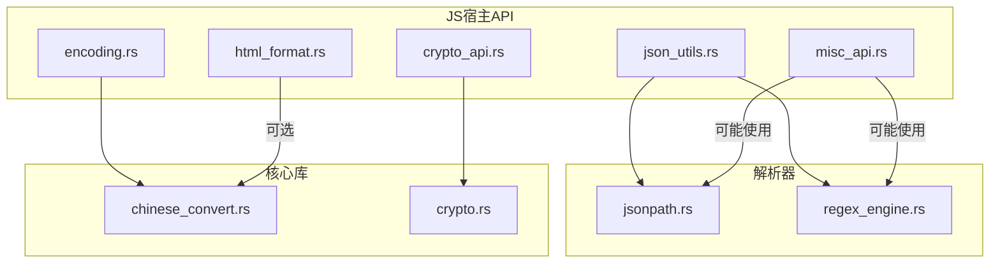
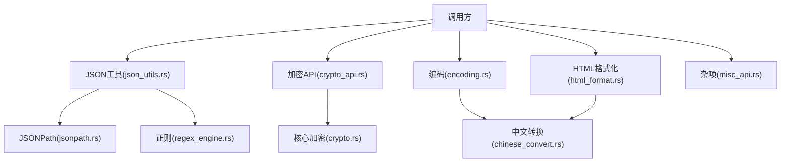
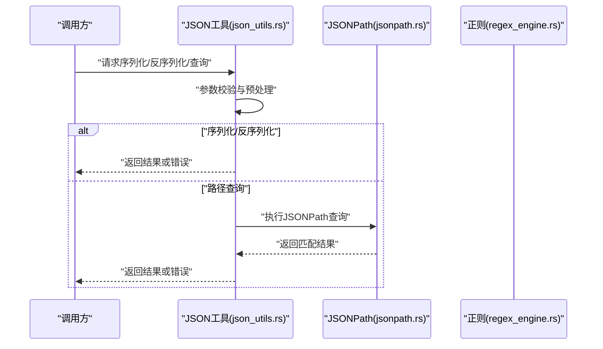
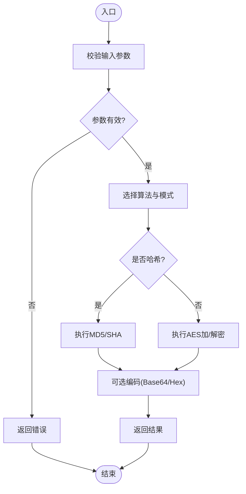
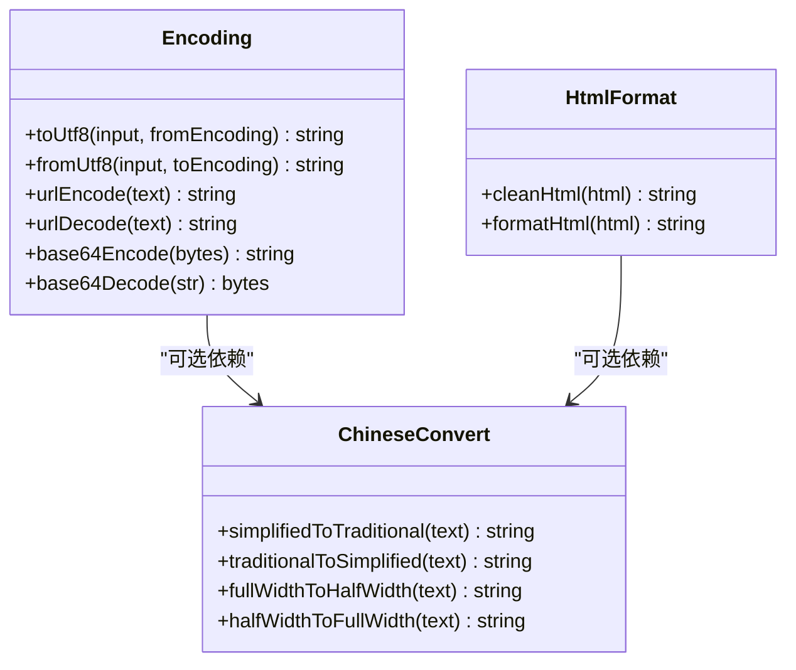
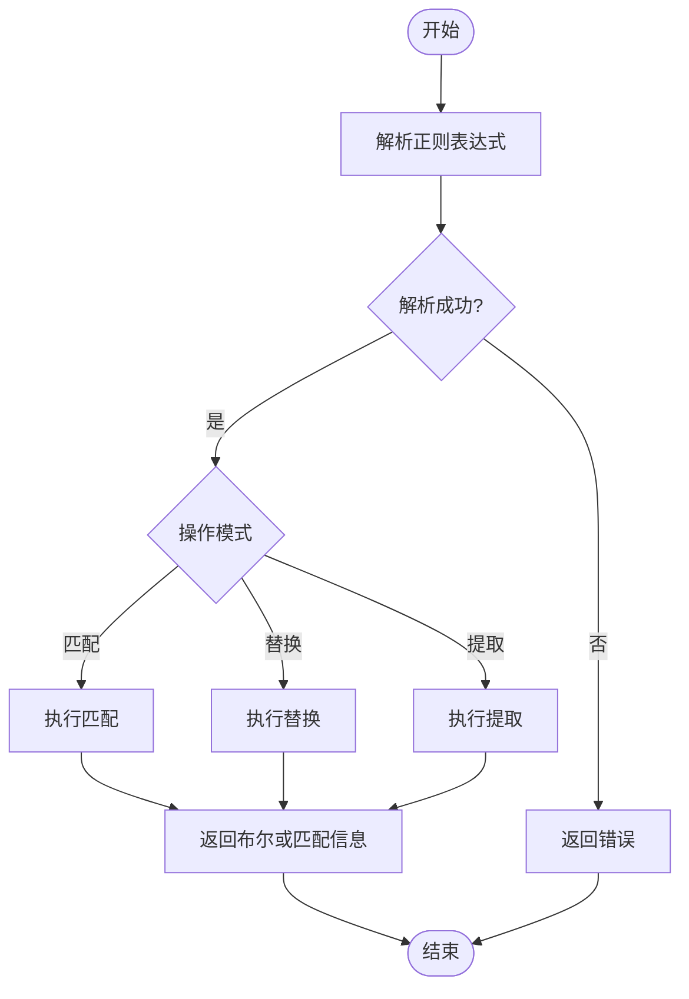
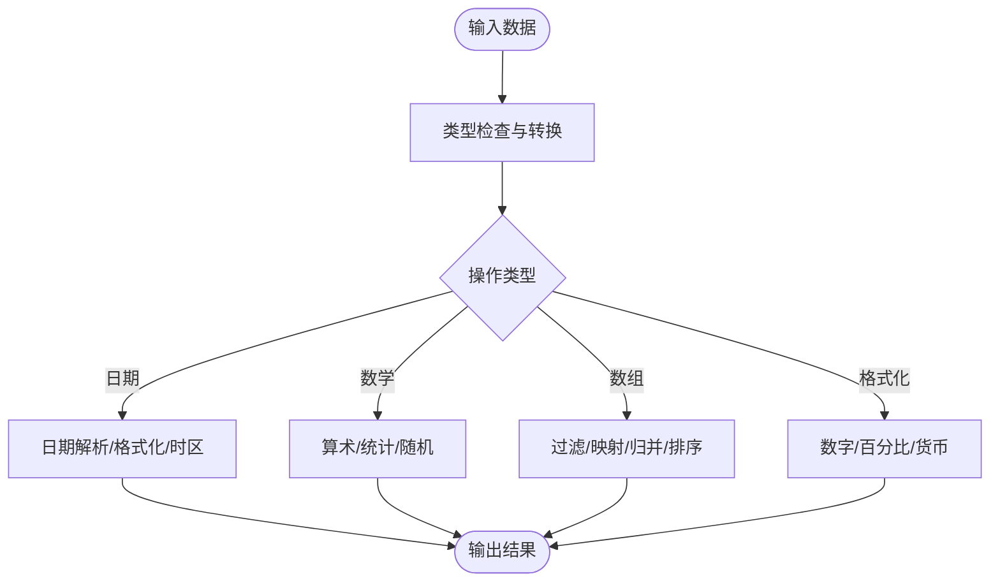
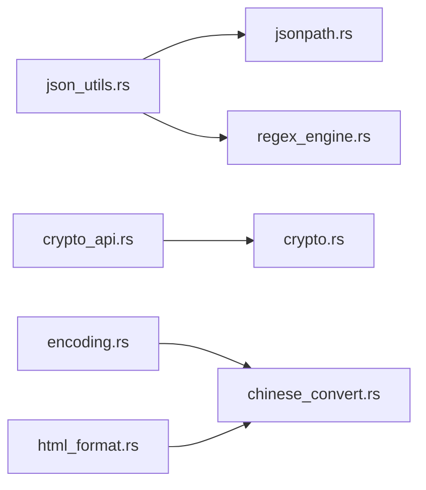

# 数据处理API

<cite>
**本文档引用的文件**   
- [legado-js/src/host_api/json_utils.rs](file://rust/legado-js/src/host_api/json_utils.rs)
- [legado-js/src/host_api/crypto_api.rs](file://rust/legado-js/src/host_api/crypto_api.rs)
- [legado-js/src/host_api/encoding.rs](file://rust/legado-js/src/host_api/encoding.rs)
- [legado-js/src/host_api/html_format.rs](file://rust/legado-js/src/host_api/html_format.rs)
- [legado-js/src/host_api/misc_api.rs](file://rust/legado-js/src/host_api/misc_api.rs)
- [legado-parser/src/jsonpath.rs](file://rust/legado-parser/src/jsonpath.rs)
- [legado-parser/src/regex_engine.rs](file://rust/legado-parser/src/regex_engine.rs)
- [legado-core/src/chinese_convert.rs](file://rust/legado-core/src/chinese_convert.rs)
- [legado-core/src/crypto.rs](file://rust/legado-core/src/crypto.rs)
</cite>

## 目录
1. [简介](#简介)
2. [项目结构](#项目结构)
3. [核心组件](#核心组件)
4. [架构总览](#架构总览)
5. [详细组件分析](#详细组件分析)
6. [依赖关系分析](#依赖关系分析)
7. [性能考虑](#性能考虑)
8. [故障排查指南](#故障排查指南)
9. [结论](#结论)
10. [附录](#附录)

## 简介
本文件面向Legado项目的“数据处理API”，聚焦以下能力：
- 字符串处理工具：编码转换、格式化、验证等
- JSON数据处理：序列化、反序列化、路径查询、数据校验
- 正则表达式工具：模式匹配、替换、提取
- 加密解密：MD5、SHA、AES等算法
- 日期时间处理、数学运算、数组操作等实用工具
- 数据类型转换与格式化工具

上述能力主要分布在Rust侧的JS宿主API（legado-js）、解析器（legado-parser）与核心库（legado-core）中，并通过FFI暴露给上层调用。

## 项目结构
从代码组织看，数据处理相关能力按职责分层：
- JS宿主API层：对外暴露JSON、加密、编码、HTML格式化、杂项工具等接口
- 解析器层：提供JSONPath查询与正则引擎
- 核心层：通用加密、中文转换等基础能力

图表来源
- [legado-js/src/host_api/json_utils.rs](file://rust/legado-js/src/host_api/json_utils.rs)
- [legado-js/src/host_api/crypto_api.rs](file://rust/legado-js/src/host_api/crypto_api.rs)
- [legado-js/src/host_api/encoding.rs](file://rust/legado-js/src/host_api/encoding.rs)
- [legado-js/src/host_api/html_format.rs](file://rust/legado-js/src/host_api/html_format.rs)
- [legado-js/src/host_api/misc_api.rs](file://rust/legado-js/src/host_api/misc_api.rs)
- [legado-parser/src/jsonpath.rs](file://rust/legado-parser/src/jsonpath.rs)
- [legado-parser/src/regex_engine.rs](file://rust/legado-parser/src/regex_engine.rs)
- [legado-core/src/chinese_convert.rs](file://rust/legado-core/src/chinese_convert.rs)
- [legado-core/src/crypto.rs](file://rust/legado-core/src/crypto.rs)

章节来源
- [legado-js/src/host_api/json_utils.rs](file://rust/legado-js/src/host_api/json_utils.rs)
- [legado-js/src/host_api/crypto_api.rs](file://rust/legado-js/src/host_api/crypto_api.rs)
- [legado-js/src/host_api/encoding.rs](file://rust/legado-js/src/host_api/encoding.rs)
- [legado-js/src/host_api/html_format.rs](file://rust/legado-js/src/host_api/html_format.rs)
- [legado-js/src/host_api/misc_api.rs](file://rust/legado-js/src/host_api/misc_api.rs)
- [legado-parser/src/jsonpath.rs](file://rust/legado-parser/src/jsonpath.rs)
- [legado-parser/src/regex_engine.rs](file://rust/legado-parser/src/regex_engine.rs)
- [legado-core/src/chinese_convert.rs](file://rust/legado-core/src/chinese_convert.rs)
- [legado-core/src/crypto.rs](file://rust/legado-core/src/crypto.rs)

## 核心组件
- JSON工具模块：提供序列化、反序列化、路径查询、数据校验等能力
- 加密模块：封装常用哈希与对称加密算法
- 编码模块：字符集转换与文本规范化
- HTML格式化模块：对HTML片段进行清理与格式化
- 正则引擎：提供匹配、替换、提取等功能
- 杂项工具：涵盖日期、数学、数组、类型转换等常用方法

章节来源
- [legado-js/src/host_api/json_utils.rs](file://rust/legado-js/src/host_api/json_utils.rs)
- [legado-js/src/host_api/crypto_api.rs](file://rust/legado-js/src/host_api/crypto_api.rs)
- [legado-js/src/host_api/encoding.rs](file://rust/legado-js/src/host_api/encoding.rs)
- [legado-js/src/host_api/html_format.rs](file://rust/legado-js/src/host_api/html_format.rs)
- [legado-js/src/host_api/misc_api.rs](file://rust/legado-js/src/host_api/misc_api.rs)
- [legado-parser/src/jsonpath.rs](file://rust/legado-parser/src/jsonpath.rs)
- [legado-parser/src/regex_engine.rs](file://rust/legado-parser/src/regex_engine.rs)
- [legado-core/src/chinese_convert.rs](file://rust/legado-core/src/chinese_convert.rs)
- [legado-core/src/crypto.rs](file://rust/legado-core/src/crypto.rs)

## 架构总览
下图展示了数据处理API的整体交互：上层通过JS宿主API调用JSON、加密、编码、HTML格式化与杂项工具；JSON工具依赖解析器的JSONPath与正则引擎；加密模块依赖核心库的加密实现；编码模块依赖核心库的中文转换能力。

图表来源
- [legado-js/src/host_api/json_utils.rs](file://rust/legado-js/src/host_api/json_utils.rs)
- [legado-js/src/host_api/crypto_api.rs](file://rust/legado-js/src/host_api/crypto_api.rs)
- [legado-js/src/host_api/encoding.rs](file://rust/legado-js/src/host_api/encoding.rs)
- [legado-js/src/host_api/html_format.rs](file://rust/legado-js/src/host_api/html_format.rs)
- [legado-js/src/host_api/misc_api.rs](file://rust/legado-js/src/host_api/misc_api.rs)
- [legado-parser/src/jsonpath.rs](file://rust/legado-parser/src/jsonpath.rs)
- [legado-parser/src/regex_engine.rs](file://rust/legado-parser/src/regex_engine.rs)
- [legado-core/src/chinese_convert.rs](file://rust/legado-core/src/chinese_convert.rs)
- [legado-core/src/crypto.rs](file://rust/legado-core/src/crypto.rs)

## 详细组件分析

### JSON数据处理API
- 功能范围
  - 序列化：将对象或数组序列化为JSON字符串
  - 反序列化：将JSON字符串解析为对象或数组
  - 路径查询：基于JSONPath表达式检索数据
  - 数据验证：对输入数据进行基本合法性检查
- 关键流程
  - 输入校验与预处理
  - 解析/序列化执行
  - 错误捕获与返回
  - 结果标准化输出

图表来源
- [legado-js/src/host_api/json_utils.rs](file://rust/legado-js/src/host_api/json_utils.rs)
- [legado-parser/src/jsonpath.rs](file://rust/legado-parser/src/jsonpath.rs)
- [legado-parser/src/regex_engine.rs](file://rust/legado-parser/src/regex_engine.rs)

章节来源
- [legado-js/src/host_api/json_utils.rs](file://rust/legado-js/src/host_api/json_utils.rs)
- [legado-parser/src/jsonpath.rs](file://rust/legado-parser/src/jsonpath.rs)

### 加密解密API
- 支持算法
  - 摘要哈希：MD5、SHA系列
  - 对称加密：AES
- 典型用法
  - 计算字符串或字节流的哈希值
  - 使用密钥与初始化向量进行加密/解密
  - 处理Base64与十六进制编解码
- 安全建议
  - 避免硬编码密钥
  - 合理选择模式与填充
  - 注意随机IV的使用与存储

图表来源
- [legado-js/src/host_api/crypto_api.rs](file://rust/legado-js/src/host_api/crypto_api.rs)
- [legado-core/src/crypto.rs](file://rust/legado-core/src/crypto.rs)

章节来源
- [legado-js/src/host_api/crypto_api.rs](file://rust/legado-js/src/host_api/crypto_api.rs)
- [legado-core/src/crypto.rs](file://rust/legado-core/src/crypto.rs)

### 字符串编码与格式化
- 编码转换
  - 常见字符集互转（如UTF-8与其他编码）
  - URL编码/解码
  - Base64编解码
- 文本格式化
  - HTML片段清理与格式化
  - 文本规范化（去除多余空白、换行处理等）
- 中文处理
  - 繁简转换
  - 全角半角转换

图表来源
- [legado-js/src/host_api/encoding.rs](file://rust/legado-js/src/host_api/encoding.rs)
- [legado-js/src/host_api/html_format.rs](file://rust/legado-js/src/host_api/html_format.rs)
- [legado-core/src/chinese_convert.rs](file://rust/legado-core/src/chinese_convert.rs)

章节来源
- [legado-js/src/host_api/encoding.rs](file://rust/legado-js/src/host_api/encoding.rs)
- [legado-js/src/host_api/html_format.rs](file://rust/legado-js/src/host_api/html_format.rs)
- [legado-core/src/chinese_convert.rs](file://rust/legado-core/src/chinese_convert.rs)

### 正则表达式工具
- 功能范围
  - 模式匹配：判断字符串是否匹配给定正则
  - 替换：全局或单次替换匹配内容
  - 提取：按分组提取子串
- 注意事项
  - 复杂正则的性能影响
  - 多语言字符集与Unicode属性
  - 边界条件与异常输入处理

图表来源
- [legado-parser/src/regex_engine.rs](file://rust/legado-parser/src/regex_engine.rs)

章节来源
- [legado-parser/src/regex_engine.rs](file://rust/legado-parser/src/regex_engine.rs)

### 杂项工具（日期、数学、数组、类型转换）
- 日期时间
  - 格式化与解析
  - 时区处理与时间戳转换
- 数学运算
  - 四则运算、取整、舍入、随机数
- 数组操作
  - 过滤、映射、归并、去重、排序
- 类型转换与格式化
  - 字符串与数值互转
  - 布尔值与空值处理
  - 通用格式化（数字、百分比、货币等）

图表来源
- [legado-js/src/host_api/misc_api.rs](file://rust/legado-js/src/host_api/misc_api.rs)

章节来源
- [legado-js/src/host_api/misc_api.rs](file://rust/legado-js/src/host_api/misc_api.rs)

## 依赖关系分析
- 组件耦合
  - JSON工具依赖解析器（JSONPath、正则）
  - 加密API依赖核心加密实现
  - 编码与HTML格式化可依赖中文转换
- 外部依赖
  - 解析器与核心库作为底层能力被上层复用
- 潜在循环依赖
  - 当前分层清晰，未见明显循环依赖

图表来源
- [legado-js/src/host_api/json_utils.rs](file://rust/legado-js/src/host_api/json_utils.rs)
- [legado-js/src/host_api/crypto_api.rs](file://rust/legado-js/src/host_api/crypto_api.rs)
- [legado-js/src/host_api/encoding.rs](file://rust/legado-js/src/host_api/encoding.rs)
- [legado-js/src/host_api/html_format.rs](file://rust/legado-js/src/host_api/html_format.rs)
- [legado-parser/src/jsonpath.rs](file://rust/legado-parser/src/jsonpath.rs)
- [legado-parser/src/regex_engine.rs](file://rust/legado-parser/src/regex_engine.rs)
- [legado-core/src/chinese_convert.rs](file://rust/legado-core/src/chinese_convert.rs)
- [legado-core/src/crypto.rs](file://rust/legado-core/src/crypto.rs)

章节来源
- [legado-js/src/host_api/json_utils.rs](file://rust/legado-js/src/host_api/json_utils.rs)
- [legado-js/src/host_api/crypto_api.rs](file://rust/legado-js/src/host_api/crypto_api.rs)
- [legado-js/src/host_api/encoding.rs](file://rust/legado-js/src/host_api/encoding.rs)
- [legado-js/src/host_api/html_format.rs](file://rust/legado-js/src/host_api/html_format.rs)
- [legado-parser/src/jsonpath.rs](file://rust/legado-parser/src/jsonpath.rs)
- [legado-parser/src/regex_engine.rs](file://rust/legado-parser/src/regex_engine.rs)
- [legado-core/src/chinese_convert.rs](file://rust/legado-core/src/chinese_convert.rs)
- [legado-core/src/crypto.rs](file://rust/legado-core/src/crypto.rs)

## 性能考虑
- JSON处理
  - 大文档反序列化时注意内存占用
  - JSONPath查询尽量精简表达式，避免深层嵌套
- 正则表达式
  - 复杂回溯可能导致性能下降，优先使用原子组与非回溯量词
  - 批量处理时预编译正则
- 加密
  - 哈希计算适合流式处理大文件
  - AES加解密建议使用硬件加速（若可用）
- 编码与格式化
  - 频繁编解码建议缓存中间结果
  - HTML格式化在大量文本场景下谨慎使用

[本节为通用指导，不直接分析具体文件]

## 故障排查指南
- JSON解析失败
  - 检查输入是否为合法JSON
  - 确认JSONPath表达式语法正确
  - 查看错误消息定位字段路径
- 正则匹配异常
  - 验证正则语法
  - 检查目标文本编码与Unicode属性
  - 关注贪婪/非贪婪量词的影响
- 加密结果不符预期
  - 核对算法、模式、填充与IV
  - 确认密钥与编码（Base64/Hex）一致
- 编码转换乱码
  - 确认源编码与目标编码
  - 检查BOM头与不可见字符

章节来源
- [legado-js/src/host_api/json_utils.rs](file://rust/legado-js/src/host_api/json_utils.rs)
- [legado-parser/src/jsonpath.rs](file://rust/legado-parser/src/jsonpath.rs)
- [legado-parser/src/regex_engine.rs](file://rust/legado-parser/src/regex_engine.rs)
- [legado-js/src/host_api/crypto_api.rs](file://rust/legado-js/src/host_api/crypto_api.rs)
- [legado-js/src/host_api/encoding.rs](file://rust/legado-js/src/host_api/encoding.rs)

## 结论
Legado的数据处理API以清晰的层次划分与模块化设计，提供了覆盖JSON、加密、编码、HTML格式化、正则与杂项工具的完整能力。通过合理的依赖管理与错误处理策略，能够在保证性能与安全的前提下满足多样化的数据处理需求。

[本节为总结性内容，不直接分析具体文件]

## 附录
- 术语说明
  - JSONPath：用于在JSON结构中定位数据的表达式语言
  - 正则引擎：提供模式匹配、替换与提取功能的组件
  - 对称加密：使用相同密钥进行加密与解密的算法（如AES）
  - 摘要哈希：将任意长度输入映射为固定长度输出的算法（如MD5、SHA）

[本节为概念性说明，不直接分析具体文件]