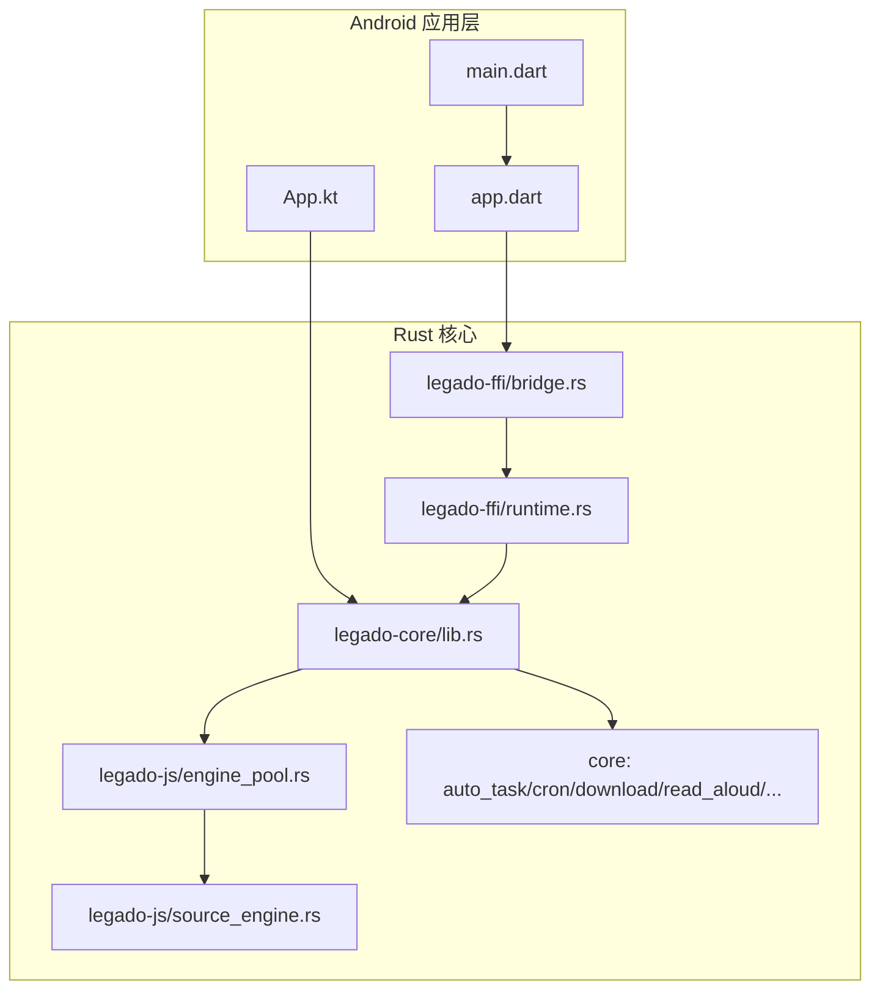
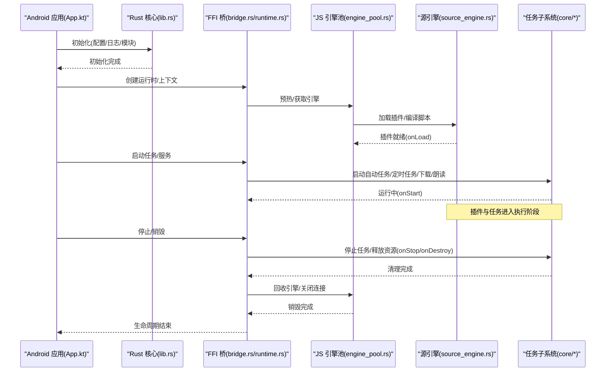
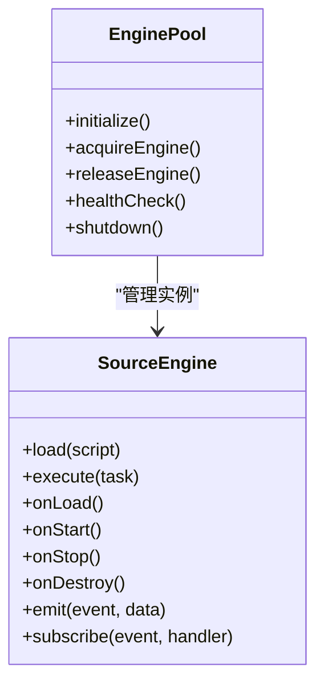
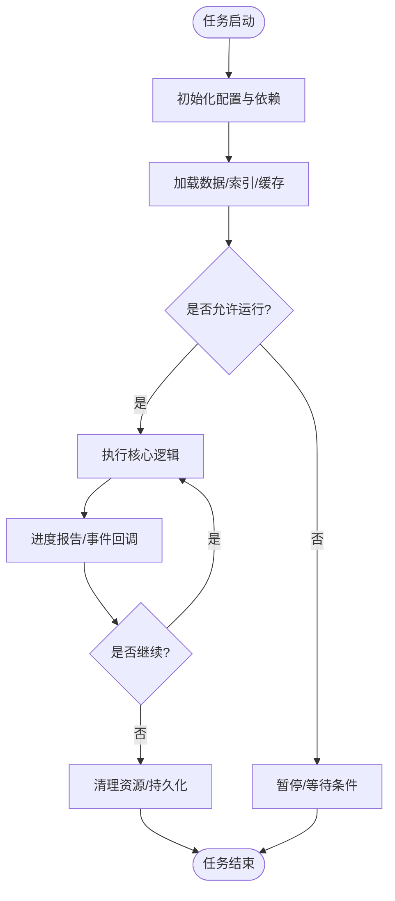
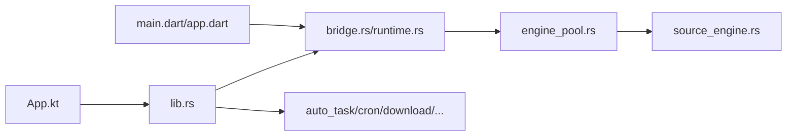

# 生命周期钩子

<cite>
**本文引用的文件**   
- [App.kt](file://app/src/main/java/io/legado/app/App.kt)
- [lib.rs](file://rust/legado-core/src/lib.rs)
- [bridge.rs](file://rust/legado-ffi/src/bridge.rs)
- [runtime.rs](file://rust/legado-ffi/src/runtime.rs)
- [engine_pool.rs](file://rust/legado-js/src/engine_pool.rs)
- [source_engine.rs](file://rust/legado-js/src/source_engine.rs)
- [auto_task.rs](file://rust/legado-core/src/auto_task.rs)
- [cron.rs](file://rust/legado-core/src/cron.rs)
- [download_manager.rs](file://rust/legado-core/src/download_manager.rs)
- [read_aloud.rs](file://rust/legado-core/src/read_aloud.rs)
- [audio_cache.rs](file://rust/legado-core/src/audio_cache.rs)
- [cache_book.rs](file://rust/legado-core/src/cache_book.rs)
- [read_state.rs](file://rust/legado-core/src/read_state.rs)
- [reading_stats.rs](file://rust/legado-core/src/reading_stats.rs)
- [review.rs](file://rust/legado-core/src/review.rs)
- [content_processor.rs](file://rust/legado-core/src/content_processor.rs)
- [search_engine.rs](file://rust/legado-core/src/search_engine.rs)
- [toc_updater.rs](file://rust/legado-core/src/toc_updater.rs)
- [source_lock.rs](file://rust/legado-core/src/source_lock.rs)
- [source_login.rs](file://rust/legado-core/src/source_login.rs)
- [error.rs](file://rust/legado-core/src/error.rs)
- [main.dart](file://flutter_legado/lib/main.dart)
- [app.dart](file://flutter_legado/lib/app.dart)
</cite>

## 目录
1. [简介](#简介)
2. [项目结构](#项目结构)
3. [核心组件](#核心组件)
4. [架构总览](#架构总览)
5. [详细组件分析](#详细组件分析)
6. [依赖关系分析](#依赖关系分析)
7. [性能考量](#性能考量)
8. [故障排查指南](#故障排查指南)
9. [结论](#结论)
10. [附录](#附录)

## 简介
本文件面向插件与扩展开发者，系统化阐述 Legado 的生命周期管理模型与钩子机制。内容覆盖初始化、加载、执行、销毁等阶段；说明 onInit/onLoad/onStart/onStop/onDestroy 等钩子的使用方式；介绍事件监听（自定义事件、系统事件、状态变化通知）；详述异步处理（任务调度、进度报告、错误处理）；给出生命周期状态管理与资源清理的最佳实践，并提供完整示例路径以便快速上手。

## 项目结构
Legado 采用多语言分层架构：Android 应用层负责 UI 与系统服务桥接；Rust 核心提供跨平台能力（网络、解析、数据库、JS 引擎池、下载、音频等）；Flutter 前端用于部分界面与交互。生命周期贯穿各层：
- Android 应用启动与进程级生命周期由 App.kt 协调。
- Rust 核心通过 lib.rs 暴露统一入口，并在 FFI 层（bridge.rs、runtime.rs）对外暴露生命周期控制。
- JS 引擎池与源引擎（engine_pool.rs、source_engine.rs）承担插件脚本的加载、运行与销毁。
- 后台任务（自动任务、定时任务、下载、朗读、缓存、阅读统计等）在 core 模块中实现各自的生命周期。
- Flutter 侧通过 main.dart/app.dart 管理页面与应用级状态，必要时与原生生命周期对齐。

**图示来源** 
- [App.kt](file://app/src/main/java/io/legado/app/App.kt)
- [lib.rs](file://rust/legado-core/src/lib.rs)
- [bridge.rs](file://rust/legado-ffi/src/bridge.rs)
- [runtime.rs](file://rust/legado-ffi/src/runtime.rs)
- [engine_pool.rs](file://rust/legado-js/src/engine_pool.rs)
- [source_engine.rs](file://rust/legado-js/src/source_engine.rs)
- [auto_task.rs](file://rust/legado-core/src/auto_task.rs)
- [cron.rs](file://rust/legado-core/src/cron.rs)
- [download_manager.rs](file://rust/legado-core/src/download_manager.rs)
- [read_aloud.rs](file://rust/legado-core/src/read_aloud.rs)
- [audio_cache.rs](file://rust/legado-core/src/audio_cache.rs)
- [cache_book.rs](file://rust/legado-core/src/cache_book.rs)
- [read_state.rs](file://rust/legado-core/src/read_state.rs)
- [reading_stats.rs](file://rust/legado-core/src/reading_stats.rs)
- [review.rs](file://rust/legado-core/src/review.rs)
- [content_processor.rs](file://rust/legado-core/src/content_processor.rs)
- [search_engine.rs](file://rust/legado-core/src/search_engine.rs)
- [toc_updater.rs](file://rust/legado-core/src/toc_updater.rs)
- [source_lock.rs](file://rust/legado-core/src/source_lock.rs)
- [source_login.rs](file://rust/legado-core/src/source_login.rs)

**章节来源**
- [App.kt](file://app/src/main/java/io/legado/app/App.kt)
- [lib.rs](file://rust/legado-core/src/lib.rs)
- [bridge.rs](file://rust/legado-ffi/src/bridge.rs)
- [runtime.rs](file://rust/legado-ffi/src/runtime.rs)
- [engine_pool.rs](file://rust/legado-js/src/engine_pool.rs)
- [source_engine.rs](file://rust/legado-js/src/source_engine.rs)

## 核心组件
- 应用与进程生命周期：App.kt 负责应用初始化、日志、崩溃收集、全局配置、与 Rust 核心的对接。
- Rust 核心入口：lib.rs 暴露统一的初始化、配置、模块注册与生命周期控制接口。
- FFI 桥接：bridge.rs 与 runtime.rs 将上层调用映射到 Rust 运行时，并管理线程、协程与资源。
- JS 引擎池与源引擎：engine_pool.rs 维护引擎实例、并发与内存；source_engine.rs 负责插件脚本的加载、编译、执行与销毁。
- 任务子系统：auto_task.rs、cron.rs、download_manager.rs、read_aloud.rs、audio_cache.rs、cache_book.rs、read_state.rs、reading_stats.rs、review.rs、content_processor.rs、search_engine.rs、toc_updater.rs、source_lock.rs、source_login.rs 等各自实现生命周期与状态机。
- Flutter 前端：main.dart/app.dart 管理页面生命周期，必要时与原生生命周期同步。

**章节来源**
- [App.kt](file://app/src/main/java/io/legado/app/App.kt)
- [lib.rs](file://rust/legado-core/src/lib.rs)
- [bridge.rs](file://rust/legado-ffi/src/bridge.rs)
- [runtime.rs](file://rust/legado-ffi/src/runtime.rs)
- [engine_pool.rs](file://rust/legado-js/src/engine_pool.rs)
- [source_engine.rs](file://rust/legado-js/src/source_engine.rs)
- [auto_task.rs](file://rust/legado-core/src/auto_task.rs)
- [cron.rs](file://rust/legado-core/src/cron.rs)
- [download_manager.rs](file://rust/legado-core/src/download_manager.rs)
- [read_aloud.rs](file://rust/legado-core/src/read_aloud.rs)
- [audio_cache.rs](file://rust/legado-core/src/audio_cache.rs)
- [cache_book.rs](file://rust/legado-core/src/cache_book.rs)
- [read_state.rs](file://rust/legado-core/src/read_state.rs)
- [reading_stats.rs](file://rust/legado-core/src/reading_stats.rs)
- [review.rs](file://rust/legado-core/src/review.rs)
- [content_processor.rs](file://rust/legado-core/src/content_processor.rs)
- [search_engine.rs](file://rust/legado-core/src/search_engine.rs)
- [toc_updater.rs](file://rust/legado-core/src/toc_updater.rs)
- [source_lock.rs](file://rust/legado-core/src/source_lock.rs)
- [source_login.rs](file://rust/legado-core/src/source_login.rs)
- [main.dart](file://flutter_legado/lib/main.dart)
- [app.dart](file://flutter_legado/lib/app.dart)

## 架构总览
下图展示从应用启动到插件执行的典型生命周期流程，以及关键钩子触发点。

**图示来源** 
- [App.kt](file://app/src/main/java/io/legado/app/App.kt)
- [lib.rs](file://rust/legado-core/src/lib.rs)
- [bridge.rs](file://rust/legado-ffi/src/bridge.rs)
- [runtime.rs](file://rust/legado-ffi/src/runtime.rs)
- [engine_pool.rs](file://rust/legado-js/src/engine_pool.rs)
- [source_engine.rs](file://rust/legado-js/src/source_engine.rs)
- [auto_task.rs](file://rust/legado-core/src/auto_task.rs)
- [cron.rs](file://rust/legado-core/src/cron.rs)
- [download_manager.rs](file://rust/legado-core/src/download_manager.rs)
- [read_aloud.rs](file://rust/legado-core/src/read_aloud.rs)

## 详细组件分析

### 应用与进程生命周期（App.kt）
- 职责：应用初始化、全局配置、崩溃收集、日志、与 Rust 核心对接、前台服务/广播/接收器协调。
- 生命周期钩子：
  - onInit：应用首次启动时进行环境检查、权限申请、核心库初始化。
  - onStart：主流程启动，拉起必要服务与调度器。
  - onStop：应用退到后台或退出前，保存状态、暂停非关键任务。
  - onDestroy：进程终止前释放资源、关闭连接、持久化数据。
- 最佳实践：避免在 onInit 中进行耗时操作；使用延迟初始化；确保异常不会导致进程崩溃。

**章节来源**
- [App.kt](file://app/src/main/java/io/legado/app/App.kt)

### Rust 核心入口与运行时（lib.rs、bridge.rs、runtime.rs）
- lib.rs：统一暴露初始化、配置、模块注册、生命周期控制接口。
- bridge.rs：定义 FFI 函数，将上层调用映射到 Rust 内部实现。
- runtime.rs：管理线程/协程、事件循环、资源句柄、错误传播。
- 生命周期钩子：
  - onInit：加载配置、初始化数据库、网络栈、JS 引擎池。
  - onLoad：按需加载模块、建立连接、预热缓存。
  - onStart：启动后台任务、订阅系统事件、开启定时任务。
  - onStop：暂停任务、取消订阅、释放临时资源。
  - onDestroy：关闭连接、持久化状态、清理内存。
- 错误处理：统一错误类型与返回码，向上层传递可诊断信息。

**章节来源**
- [lib.rs](file://rust/legado-core/src/lib.rs)
- [bridge.rs](file://rust/legado-ffi/src/bridge.rs)
- [runtime.rs](file://rust/legado-ffi/src/runtime.rs)

### JS 引擎池与源引擎（engine_pool.rs、source_engine.rs）
- engine_pool.rs：维护引擎实例集合、并发限制、内存回收策略、健康检查。
- source_engine.rs：插件脚本加载、编译、执行、沙箱隔离、生命周期回调。
- 生命周期钩子（插件视角）：
  - onLoad：脚本加载后执行一次初始化（如读取配置、建立连接）。
  - onStart：开始执行业务逻辑（如抓取、解析、调度）。
  - onStop：暂停执行、保存中间状态。
  - onDestroy：释放资源、断开连接、清理缓存。
- 事件机制：支持自定义事件与系统事件（网络状态、存储变化），通过回调或消息队列上报。
- 异步处理：基于协程/任务队列，支持进度回调、错误重试、超时控制。

**图示来源** 
- [engine_pool.rs](file://rust/legado-js/src/engine_pool.rs)
- [source_engine.rs](file://rust/legado-js/src/source_engine.rs)

**章节来源**
- [engine_pool.rs](file://rust/legado-js/src/engine_pool.rs)
- [source_engine.rs](file://rust/legado-js/src/source_engine.rs)

### 任务子系统（auto_task.rs、cron.rs、download_manager.rs、read_aloud.rs、audio_cache.rs、cache_book.rs、read_state.rs、reading_stats.rs、review.rs、content_processor.rs、search_engine.rs、toc_updater.rs、source_lock.rs、source_login.rs）
- 共同特征：每个子系统都有明确的状态机与生命周期钩子，支持启动、暂停、恢复、销毁。
- 典型钩子：
  - onInit：准备数据源、校验配置、建立连接。
  - onLoad：预取元数据、构建索引、预热缓存。
  - onStart：开始轮询/拉取/播放/搜索等核心逻辑。
  - onStop：暂停任务、保存进度、释放锁。
  - onDestroy：清理缓存、关闭连接、持久化状态。
- 事件与状态：
  - 自定义事件：任务完成、失败、进度更新。
  - 系统事件：网络可用/不可用、存储空间不足、系统时间变更。
  - 状态变化通知：通过回调或消息总线通知上层。
- 异步处理：
  - 任务调度：基于定时器/队列/优先级。
  - 进度报告：分块进度、累计百分比、ETA。
  - 错误处理：重试策略、降级方案、用户提示。

**图示来源** 
- [auto_task.rs](file://rust/legado-core/src/auto_task.rs)
- [cron.rs](file://rust/legado-core/src/cron.rs)
- [download_manager.rs](file://rust/legado-core/src/download_manager.rs)
- [read_aloud.rs](file://rust/legado-core/src/read_aloud.rs)
- [audio_cache.rs](file://rust/legado-core/src/audio_cache.rs)
- [cache_book.rs](file://rust/legado-core/src/cache_book.rs)
- [read_state.rs](file://rust/legado-core/src/read_state.rs)
- [reading_stats.rs](file://rust/legado-core/src/reading_stats.rs)
- [review.rs](file://rust/legado-core/src/review.rs)
- [content_processor.rs](file://rust/legado-core/src/content_processor.rs)
- [search_engine.rs](file://rust/legado-core/src/search_engine.rs)
- [toc_updater.rs](file://rust/legado-core/src/toc_updater.rs)
- [source_lock.rs](file://rust/legado-core/src/source_lock.rs)
- [source_login.rs](file://rust/legado-core/src/source_login.rs)

**章节来源**
- [auto_task.rs](file://rust/legado-core/src/auto_task.rs)
- [cron.rs](file://rust/legado-core/src/cron.rs)
- [download_manager.rs](file://rust/legado-core/src/download_manager.rs)
- [read_aloud.rs](file://rust/legado-core/src/read_aloud.rs)
- [audio_cache.rs](file://rust/legado-core/src/audio_cache.rs)
- [cache_book.rs](file://rust/legado-core/src/cache_book.rs)
- [read_state.rs](file://rust/legado-core/src/read_state.rs)
- [reading_stats.rs](file://rust/legado-core/src/reading_stats.rs)
- [review.rs](file://rust/legado-core/src/review.rs)
- [content_processor.rs](file://rust/legado-core/src/content_processor.rs)
- [search_engine.rs](file://rust/legado-core/src/search_engine.rs)
- [toc_updater.rs](file://rust/legado-core/src/toc_updater.rs)
- [source_lock.rs](file://rust/legado-core/src/source_lock.rs)
- [source_login.rs](file://rust/legado-core/src/source_login.rs)

### Flutter 前端生命周期（main.dart、app.dart）
- main.dart：应用入口，设置主题、路由、国际化、与原生通信。
- app.dart：应用级状态管理、页面导航、生命周期钩子（如页面显示/隐藏）。
- 与原生生命周期对齐：当应用进入后台/前台时，通知 Rust 核心暂停/恢复任务。

**章节来源**
- [main.dart](file://flutter_legado/lib/main.dart)
- [app.dart](file://flutter_legado/lib/app.dart)

## 依赖关系分析
- 耦合与内聚：
  - App.kt 与 lib.rs 强耦合（初始化顺序、配置一致性）。
  - bridge.rs/runtime.rs 作为稳定边界，降低上层对内部实现的依赖。
  - engine_pool.rs 与 source_engine.rs 高内聚，封装插件生命周期。
  - 任务子系统相对独立，通过事件/回调解耦。
- 外部依赖：
  - 网络栈、数据库、文件系统、JS 引擎、系统服务。
- 潜在循环依赖：
  - 通过事件总线与接口抽象避免直接循环引用。
- 接口契约：
  - FFI 函数签名、错误码、回调协议需保持稳定。

**图示来源** 
- [App.kt](file://app/src/main/java/io/legado/app/App.kt)
- [lib.rs](file://rust/legado-core/src/lib.rs)
- [bridge.rs](file://rust/legado-ffi/src/bridge.rs)
- [runtime.rs](file://rust/legado-ffi/src/runtime.rs)
- [engine_pool.rs](file://rust/legado-js/src/engine_pool.rs)
- [source_engine.rs](file://rust/legado-js/src/source_engine.rs)
- [auto_task.rs](file://rust/legado-core/src/auto_task.rs)
- [cron.rs](file://rust/legado-core/src/cron.rs)
- [download_manager.rs](file://rust/legado-core/src/download_manager.rs)
- [read_aloud.rs](file://rust/legado-core/src/read_aloud.rs)

**章节来源**
- [App.kt](file://app/src/main/java/io/legado/app/App.kt)
- [lib.rs](file://rust/legado-core/src/lib.rs)
- [bridge.rs](file://rust/legado-ffi/src/bridge.rs)
- [runtime.rs](file://rust/legado-ffi/src/runtime.rs)
- [engine_pool.rs](file://rust/legado-js/src/engine_pool.rs)
- [source_engine.rs](file://rust/legado-js/src/source_engine.rs)
- [auto_task.rs](file://rust/legado-core/src/auto_task.rs)
- [cron.rs](file://rust/legado-core/src/cron.rs)
- [download_manager.rs](file://rust/legado-core/src/download_manager.rs)
- [read_aloud.rs](file://rust/legado-core/src/read_aloud.rs)

## 性能考量
- 初始化优化：延迟加载、按需初始化、预热关键资源。
- 并发控制：引擎池大小、任务队列长度、限流与背压。
- 内存管理：对象池、缓存 TTL、及时释放大对象。
- I/O 优化：批量写入、异步 I/O、压缩传输。
- 错误恢复：重试退避、熔断降级、优雅停机。

[本节为通用指导，不直接分析具体文件]

## 故障排查指南
- 常见问题：
  - 初始化失败：检查配置、权限、依赖库版本。
  - 插件加载失败：验证脚本语法、沙箱权限、依赖注入。
  - 任务卡死：查看队列堆积、锁竞争、超时设置。
  - 内存泄漏：确认资源释放、事件订阅移除、引擎回收。
- 调试建议：
  - 启用详细日志、错误堆栈、性能指标。
  - 使用断点与远程调试（JS 引擎、Rust 后端）。
  - 模拟异常场景（网络中断、存储不足、权限拒绝）。
- 错误类型与处理：参考 error.rs 中的错误分类与恢复策略。

**章节来源**
- [error.rs](file://rust/legado-core/src/error.rs)

## 结论
Legado 的生命周期管理以“清晰阶段、严格钩子、事件驱动、异步优先”为原则，贯穿应用、核心、插件与任务子系统。通过统一的初始化、加载、执行、销毁流程，结合完善的错误处理与资源清理策略，确保系统在复杂环境下稳定运行。开发者应遵循最佳实践，合理设计钩子与事件，充分利用引擎池与任务调度，提升性能与可维护性。

[本节为总结，不直接分析具体文件]

## 附录
- 完整生命周期示例（路径指引）：
  - 应用初始化与核心对接：[App.kt](file://app/src/main/java/io/legado/app/App.kt)
  - Rust 核心入口与运行时：[lib.rs](file://rust/legado-core/src/lib.rs)、[bridge.rs](file://rust/legado-ffi/src/bridge.rs)、[runtime.rs](file://rust/legado-ffi/src/runtime.rs)
  - JS 插件生命周期：[engine_pool.rs](file://rust/legado-js/src/engine_pool.rs)、[source_engine.rs](file://rust/legado-js/src/source_engine.rs)
  - 任务子系统示例：[auto_task.rs](file://rust/legado-core/src/auto_task.rs)、[cron.rs](file://rust/legado-core/src/cron.rs)、[download_manager.rs](file://rust/legado-core/src/download_manager.rs)、[read_aloud.rs](file://rust/legado-core/src/read_aloud.rs)
  - Flutter 前端生命周期：[main.dart](file://flutter_legado/lib/main.dart)、[app.dart](file://flutter_legado/lib/app.dart)

[本节为索引，不直接分析具体文件]