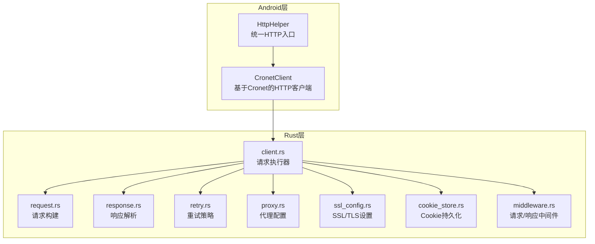
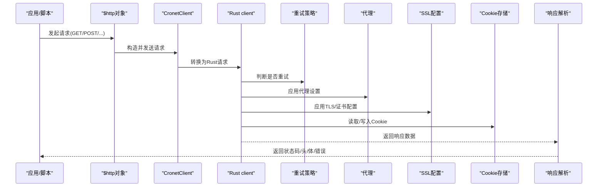
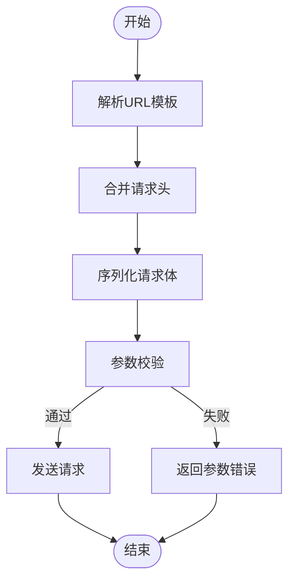
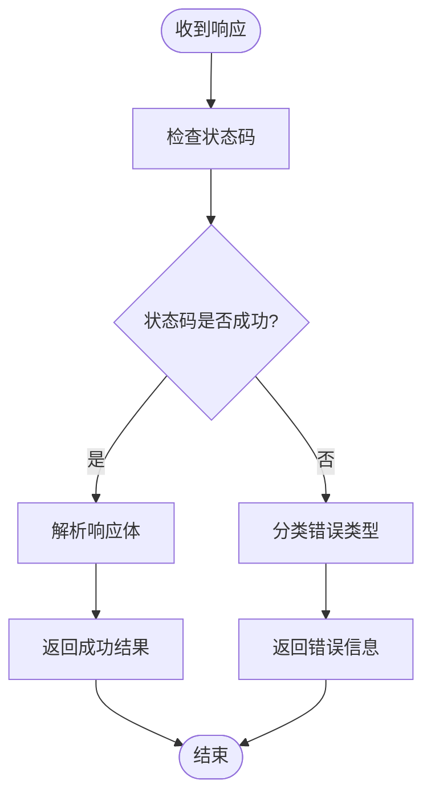
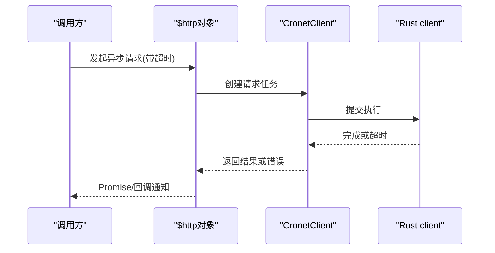
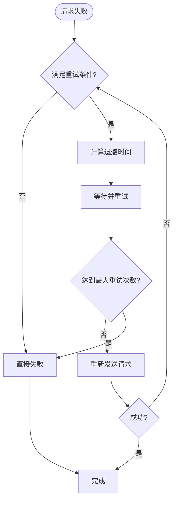
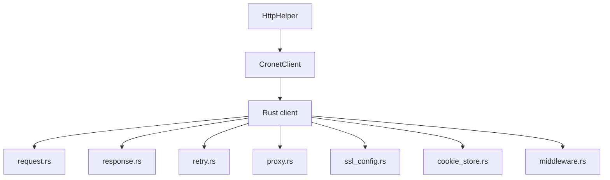

# 网络请求API

<cite>
**本文引用的文件**   
- [app/src/main/java/io/legado/app/help/HttpHelper.kt](file://app/src/main/java/io/legado/app/help/HttpHelper.kt)
- [app/src/main/java/io/legado/app/lib/cronet/CronetClient.kt](file://app/src/main/java/io/legado/app/lib/cronet/CronetClient.kt)
- [rust/legado-net/src/client.rs](file://rust/legado-net/src/client.rs)
- [rust/legado-net/src/request.rs](file://rust/legado-net/src/request.rs)
- [rust/legado-net/src/response.rs](file://rust/legado-net/src/response.rs)
- [rust/legado-net/src/retry.rs](file://rust/legado-net/src/retry.rs)
- [rust/legado-net/src/proxy.rs](file://rust/legado-net/src/proxy.rs)
- [rust/legado-net/src/ssl_config.rs](file://rust/legado-net/src/ssl_config.rs)
- [rust/legado-net/src/cookie_store.rs](file://rust/legado-net/src/cookie_store.rs)
- [rust/legado-net/src/middleware.rs](file://rust/legado-net/src/middleware.rs)
- [rust/legado-js/src/host_api/cookie_store.rs](file://rust/legado-js/src/host_api/cookie_store.rs)
- [app/src/androidTest/java/io/legado/app/HttpTest.kt](file://app/src/androidTest/java/io/legado/app/HttpTest.kt)
</cite>

## 目录
1. [简介](#简介)
2. [项目结构](#项目结构)
3. [核心组件](#核心组件)
4. [架构总览](#架构总览)
5. [详细组件分析](#详细组件分析)
6. [依赖关系分析](#依赖关系分析)
7. [性能考量](#性能考量)
8. [故障排查指南](#故障排查指南)
9. [结论](#结论)
10. [附录](#附录)

## 简介
本文件面向Legado项目的网络请求API，重点说明对外暴露的$http对象接口与底层实现。内容覆盖HTTP方法（GET、POST、PUT、DELETE等）、请求参数配置（URL模板、请求头、Cookie、代理）、响应处理（状态码检查、响应体解析、错误处理）、异步支持（Promise、回调、超时控制）、SSL证书、重定向与重试机制，并提供示例与最佳实践。文档同时给出代码级架构图与调用序列图，帮助开发者快速定位与扩展。

## 项目结构
Legado的网络能力由Android层与Rust层共同提供：
- Android层通过Cronet客户端封装HTTP能力，向上暴露统一的HTTP辅助接口。
- Rust层提供跨平台网络栈，包含请求构建、响应解析、重试、代理、SSL、Cookie存储与中间件等模块。
- JS侧通过host API访问Cookie存储等能力，便于脚本场景使用。

**图表来源** 
- [app/src/main/java/io/legado/app/help/HttpHelper.kt](file://app/src/main/java/io/legado/app/help/HttpHelper.kt)
- [app/src/main/java/io/legado/app/lib/cronet/CronetClient.kt](file://app/src/main/java/io/legado/app/lib/cronet/CronetClient.kt)
- [rust/legado-net/src/client.rs](file://rust/legado-net/src/client.rs)
- [rust/legado-net/src/request.rs](file://rust/legado-net/src/request.rs)
- [rust/legado-net/src/response.rs](file://rust/legado-net/src/response.rs)
- [rust/legado-net/src/retry.rs](file://rust/legado-net/src/retry.rs)
- [rust/legado-net/src/proxy.rs](file://rust/legado-net/src/proxy.rs)
- [rust/legado-net/src/ssl_config.rs](file://rust/legado-net/src/ssl_config.rs)
- [rust/legado-net/src/cookie_store.rs](file://rust/legado-net/src/cookie_store.rs)
- [rust/legado-net/src/middleware.rs](file://rust/legado-net/src/middleware.rs)

**章节来源**
- [app/src/main/java/io/legado/app/help/HttpHelper.kt](file://app/src/main/java/io/legado/app/help/HttpHelper.kt)
- [app/src/main/java/io/legado/app/lib/cronet/CronetClient.kt](file://app/src/main/java/io/legado/app/lib/cronet/CronetClient.kt)
- [rust/legado-net/src/client.rs](file://rust/legado-net/src/client.rs)

## 核心组件
- $http对象接口
  - HTTP方法：GET、POST、PUT、DELETE、PATCH、HEAD、OPTIONS等。
  - 请求配置：URL模板、查询参数、路径参数、请求头、Body、Cookie、代理、超时、SSL、重定向策略、重试策略。
  - 响应处理：状态码、响应头、响应体（文本/JSON/二进制）、错误信息。
  - 异步支持：Promise与回调函数；超时控制；取消请求（如底层支持）。
- 底层客户端
  - CronetClient：Android端基于Cronet的高性能HTTP客户端。
  - Rust client：跨平台请求执行器，集成重试、代理、SSL、Cookie、中间件。
- Cookie管理
  - 持久化Cookie存储，跨请求共享会话。
- 中间件
  - 统一拦截请求/响应，用于日志、鉴权、签名、压缩等。

**章节来源**
- [app/src/main/java/io/legado/app/help/HttpHelper.kt](file://app/src/main/java/io/legado/app/help/HttpHelper.kt)
- [app/src/main/java/io/legado/app/lib/cronet/CronetClient.kt](file://app/src/main/java/io/legado/app/lib/cronet/CronetClient.kt)
- [rust/legado-net/src/client.rs](file://rust/legado-net/src/client.rs)
- [rust/legado-net/src/cookie_store.rs](file://rust/legado-net/src/cookie_store.rs)
- [rust/legado-net/src/middleware.rs](file://rust/legado-net/src/middleware.rs)

## 架构总览
下图展示从上层调用到网络栈的完整流程，包括请求构建、中间件、重试、代理、SSL、Cookie与响应解析。

**图表来源** 
- [app/src/main/java/io/legado/app/help/HttpHelper.kt](file://app/src/main/java/io/legado/app/help/HttpHelper.kt)
- [app/src/main/java/io/legado/app/lib/cronet/CronetClient.kt](file://app/src/main/java/io/legado/app/lib/cronet/CronetClient.kt)
- [rust/legado-net/src/client.rs](file://rust/legado-net/src/client.rs)
- [rust/legado-net/src/retry.rs](file://rust/legado-net/src/retry.rs)
- [rust/legado-net/src/proxy.rs](file://rust/legado-net/src/proxy.rs)
- [rust/legado-net/src/ssl_config.rs](file://rust/legado-net/src/ssl_config.rs)
- [rust/legado-net/src/cookie_store.rs](file://rust/legado-net/src/cookie_store.rs)
- [rust/legado-net/src/response.rs](file://rust/legado-net/src/response.rs)

## 详细组件分析

### $http对象接口
- 支持的HTTP方法
  - GET、POST、PUT、DELETE、PATCH、HEAD、OPTIONS等。
- 请求参数配置
  - URL模板：支持路径参数与查询参数替换。
  - 请求头：自定义Header，如User-Agent、Content-Type、Authorization等。
  - Body：字符串、JSON、表单或二进制流。
  - Cookie：自动携带与更新，支持域名与路径匹配。
  - 代理：HTTP/HTTPS/SOCKS代理配置。
  - 超时：连接超时、读超时、写超时。
  - SSL：自定义证书、校验策略。
  - 重定向：允许/禁止重定向，最大跳转次数。
  - 重试：失败重试次数、退避策略、条件重试。
- 响应处理
  - 状态码：成功范围判定、错误码分类。
  - 响应头：获取所有头部字段。
  - 响应体：文本、JSON、字节流解析。
  - 错误处理：网络异常、超时、SSL错误、协议错误、业务错误。
- 异步支持
  - Promise：链式then/catch处理。
  - 回调：success/error回调模式。
  - 超时控制：可配置的超时时间。
  - 取消：若底层支持，可在必要时取消请求。

**章节来源**
- [app/src/main/java/io/legado/app/help/HttpHelper.kt](file://app/src/main/java/io/legado/app/help/HttpHelper.kt)
- [app/src/main/java/io/legado/app/lib/cronet/CronetClient.kt](file://app/src/main/java/io/legado/app/lib/cronet/CronetClient.kt)
- [rust/legado-net/src/request.rs](file://rust/legado-net/src/request.rs)
- [rust/legado-net/src/response.rs](file://rust/legado-net/src/response.rs)

### 请求构建与URL模板
- URL模板解析
  - 支持路径参数占位符与查询参数拼接。
  - 自动编码特殊字符，避免注入问题。
- 请求头合并
  - 默认头与用户自定义头合并，冲突时以用户为准。
- Body序列化
  - JSON自动序列化，表单编码，原始字节透传。
- 参数校验
  - 必填字段校验，类型检查，长度限制。

**图表来源** 
- [rust/legado-net/src/request.rs](file://rust/legado-net/src/request.rs)
- [rust/legado-net/src/middleware.rs](file://rust/legado-net/src/middleware.rs)

**章节来源**
- [rust/legado-net/src/request.rs](file://rust/legado-net/src/request.rs)
- [rust/legado-net/src/middleware.rs](file://rust/legado-net/src/middleware.rs)

### 响应解析与错误处理
- 状态码检查
  - 2xx视为成功，其他为失败；可配置自定义成功范围。
- 响应体解析
  - 文本：按指定编码解码。
  - JSON：自动反序列化为对象。
  - 二进制：直接返回字节流。
- 错误分类
  - 网络错误：连接失败、DNS解析失败。
  - 超时错误：连接/读/写超时。
  - SSL错误：证书无效、握手失败。
  - 协议错误：HTTP版本不兼容、非法响应。
  - 业务错误：服务端返回的错误码或消息。

**图表来源** 
- [rust/legado-net/src/response.rs](file://rust/legado-net/src/response.rs)

**章节来源**
- [rust/legado-net/src/response.rs](file://rust/legado-net/src/response.rs)

### 异步请求与超时控制
- Promise与回调
  - 支持Promise链式调用与回调函数两种模式。
  - 错误通过catch或error回调捕获。
- 超时控制
  - 可配置连接超时、读超时、写超时。
  - 超时触发后返回明确错误。
- 取消请求
  - 若底层支持，可通过取消令牌中断请求。

**图表来源** 
- [app/src/main/java/io/legado/app/lib/cronet/CronetClient.kt](file://app/src/main/java/io/legado/app/lib/cronet/CronetClient.kt)
- [rust/legado-net/src/client.rs](file://rust/legado-net/src/client.rs)

**章节来源**
- [app/src/main/java/io/legado/app/lib/cronet/CronetClient.kt](file://app/src/main/java/io/legado/app/lib/cronet/CronetClient.kt)
- [rust/legado-net/src/client.rs](file://rust/legado-net/src/client.rs)

### SSL证书配置
- 自定义证书
  - 支持加载本地证书文件或内存中的证书数据。
- 校验策略
  - 严格校验与宽松模式（仅调试）。
- 协议版本
  - 指定TLS最低/最高版本。

**章节来源**
- [rust/legado-net/src/ssl_config.rs](file://rust/legado-net/src/ssl_config.rs)

### 重定向处理
- 重定向开关
  - 允许或禁止跟随重定向。
- 最大跳转次数
  - 防止无限循环。
- 安全策略
  - 跨域重定向限制，敏感协议降级保护。

**章节来源**
- [rust/legado-net/src/client.rs](file://rust/legado-net/src/client.rs)

### 重试机制
- 重试条件
  - 网络错误、超时、特定状态码可重试。
- 退避策略
  - 指数退避、抖动随机化。
- 最大重试次数
  - 可配置上限，避免雪崩。

**图表来源** 
- [rust/legado-net/src/retry.rs](file://rust/legado-net/src/retry.rs)

**章节来源**
- [rust/legado-net/src/retry.rs](file://rust/legado-net/src/retry.rs)

### 代理配置
- 代理类型
  - HTTP、HTTPS、SOCKS。
- 认证
  - 用户名/密码认证。
- 绕过规则
  - 本地地址或特定域名不走代理。

**章节来源**
- [rust/legado-net/src/proxy.rs](file://rust/legado-net/src/proxy.rs)

### Cookie管理
- 持久化存储
  - Cookie跨进程/重启保留。
- 作用域
  - 域名、路径、安全标志、过期时间。
- 脚本访问
  - JS侧通过host API读写Cookie。

**章节来源**
- [rust/legado-net/src/cookie_store.rs](file://rust/legado-net/src/cookie_store.rs)
- [rust/legado-js/src/host_api/cookie_store.rs](file://rust/legado-js/src/host_api/cookie_store.rs)

### 中间件
- 统一拦截
  - 请求前：添加鉴权、签名、日志。
  - 响应后：解压、缓存、指标收集。
- 插件化
  - 可插拔中间件组合。

**章节来源**
- [rust/legado-net/src/middleware.rs](file://rust/legado-net/src/middleware.rs)

## 依赖关系分析
- Android层依赖Cronet，Rust层提供跨平台网络能力。
- $http对象作为统一入口，屏蔽底层差异。
- 中间件、重试、代理、SSL、Cookie等模块解耦，便于扩展与维护。

**图表来源** 
- [app/src/main/java/io/legado/app/help/HttpHelper.kt](file://app/src/main/java/io/legado/app/help/HttpHelper.kt)
- [app/src/main/java/io/legado/app/lib/cronet/CronetClient.kt](file://app/src/main/java/io/legado/app/lib/cronet/CronetClient.kt)
- [rust/legado-net/src/client.rs](file://rust/legado-net/src/client.rs)
- [rust/legado-net/src/request.rs](file://rust/legado-net/src/request.rs)
- [rust/legado-net/src/response.rs](file://rust/legado-net/src/response.rs)
- [rust/legado-net/src/retry.rs](file://rust/legado-net/src/retry.rs)
- [rust/legado-net/src/proxy.rs](file://rust/legado-net/src/proxy.rs)
- [rust/legado-net/src/ssl_config.rs](file://rust/legado-net/src/ssl_config.rs)
- [rust/legado-net/src/cookie_store.rs](file://rust/legado-net/src/cookie_store.rs)
- [rust/legado-net/src/middleware.rs](file://rust/legado-net/src/middleware.rs)

**章节来源**
- [app/src/main/java/io/legado/app/help/HttpHelper.kt](file://app/src/main/java/io/legado/app/help/HttpHelper.kt)
- [app/src/main/java/io/legado/app/lib/cronet/CronetClient.kt](file://app/src/main/java/io/legado/app/lib/cronet/CronetClient.kt)
- [rust/legado-net/src/client.rs](file://rust/legado-net/src/client.rs)

## 性能考量
- 连接复用与池化
  - 启用Keep-Alive，减少握手开销。
- 并发控制
  - 限制并发请求数，避免资源耗尽。
- 压缩传输
  - 启用Gzip/Brotli压缩，降低带宽。
- 缓存策略
  - 对静态资源启用缓存，提升响应速度。
- 超时与重试调优
  - 合理设置超时与重试次数，平衡可靠性与延迟。

[本节为通用指导，无需引用具体文件]

## 故障排查指南
- 常见问题
  - 连接失败：检查网络、代理、防火墙。
  - 超时：调整超时时间，检查服务端负载。
  - SSL错误：确认证书有效性与协议版本。
  - Cookie丢失：检查作用域与过期时间。
  - 重定向循环：限制最大跳转次数。
- 调试建议
  - 开启中间件日志，记录请求/响应。
  - 使用测试用例验证边界情况。

**章节来源**
- [app/src/androidTest/java/io/legado/app/HttpTest.kt](file://app/src/androidTest/java/io/legado/app/HttpTest.kt)

## 结论
Legado的$http对象提供了完整的HTTP能力，涵盖方法、配置、响应处理、异步支持与高级特性（SSL、代理、Cookie、重试、中间件）。通过Android与Rust双栈协同，既保证性能又具备跨平台能力。开发者可依据本文档快速上手与扩展，遵循最佳实践以获得稳定高效的网络请求体验。

[本节为总结，无需引用具体文件]

## 附录
- 示例与最佳实践
  - 使用URL模板简化动态路径。
  - 统一设置请求头与Cookie，避免重复配置。
  - 合理设置超时与重试，提升鲁棒性。
  - 使用中间件集中处理鉴权与日志。
  - 在调试环境启用宽松SSL校验，生产环境严格校验。

[本节为补充内容，无需引用具体文件]