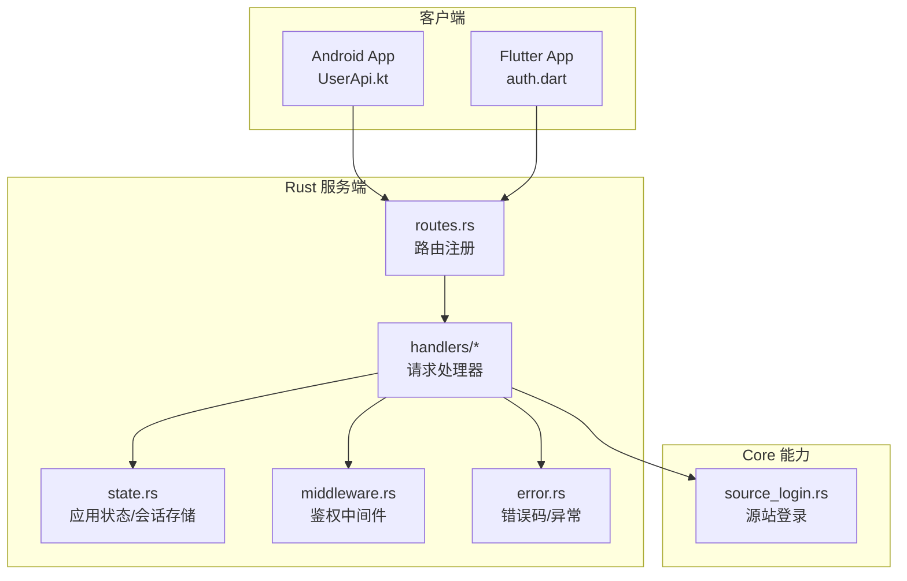
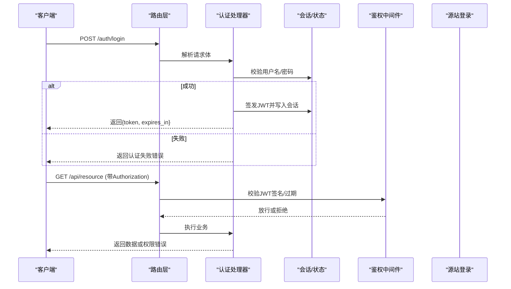
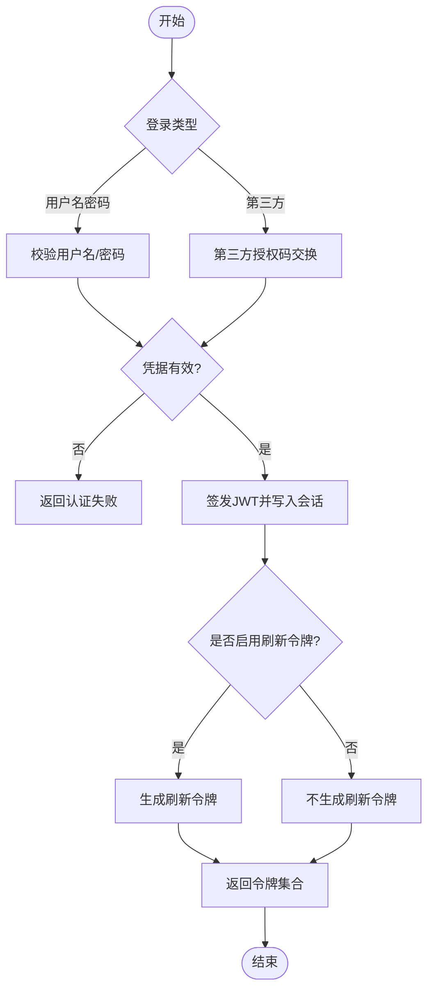
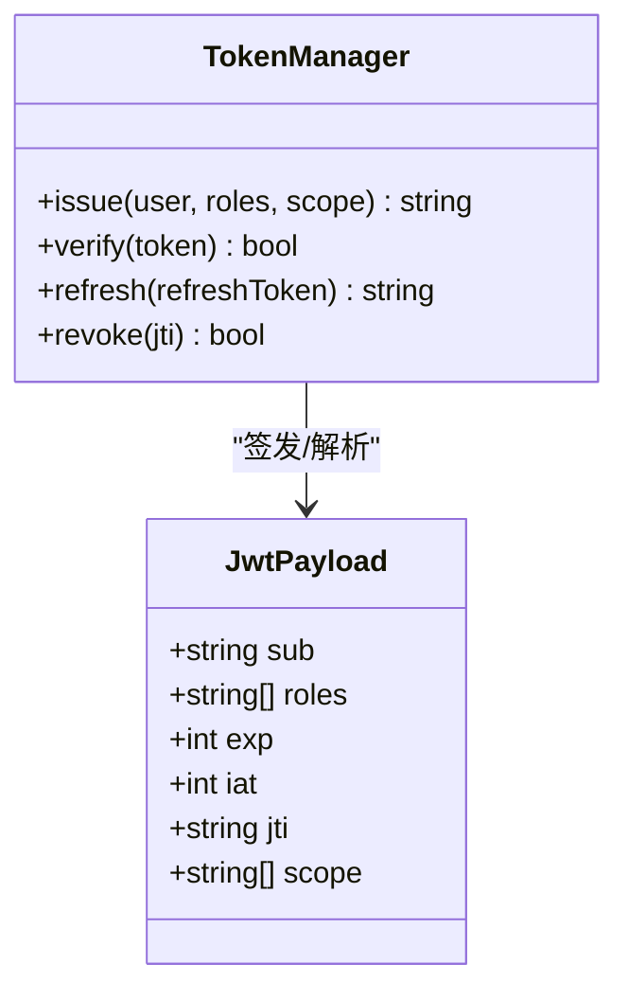
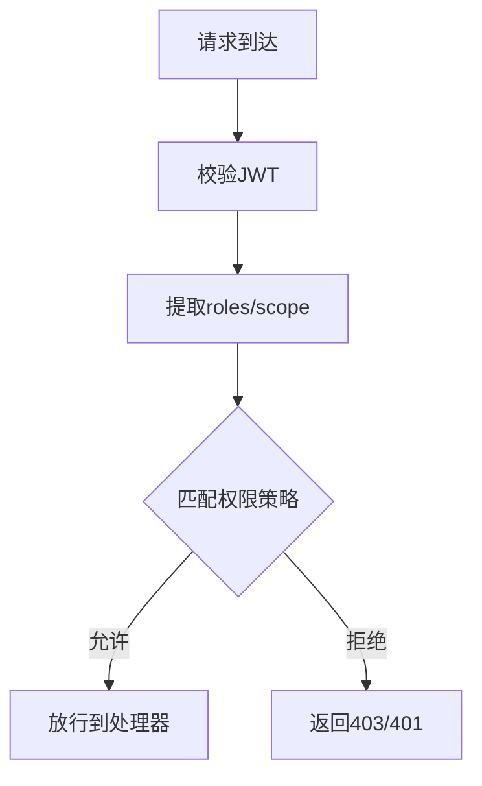
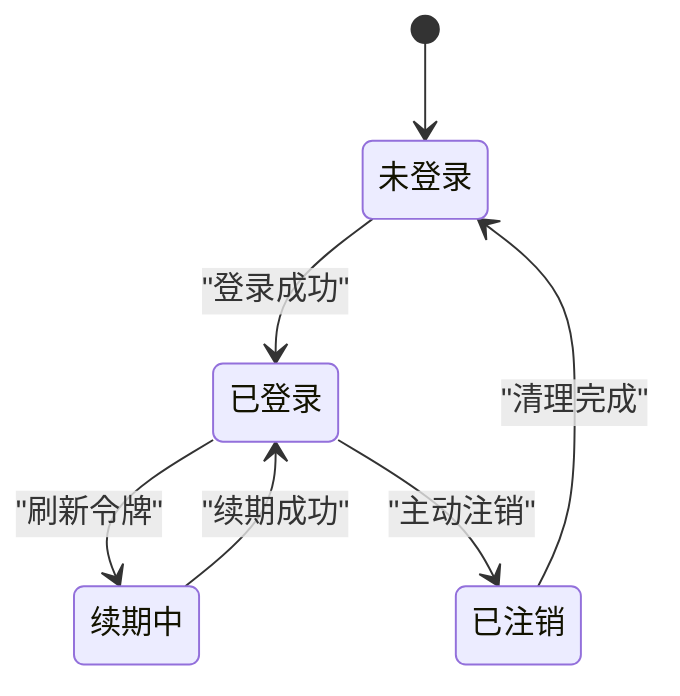
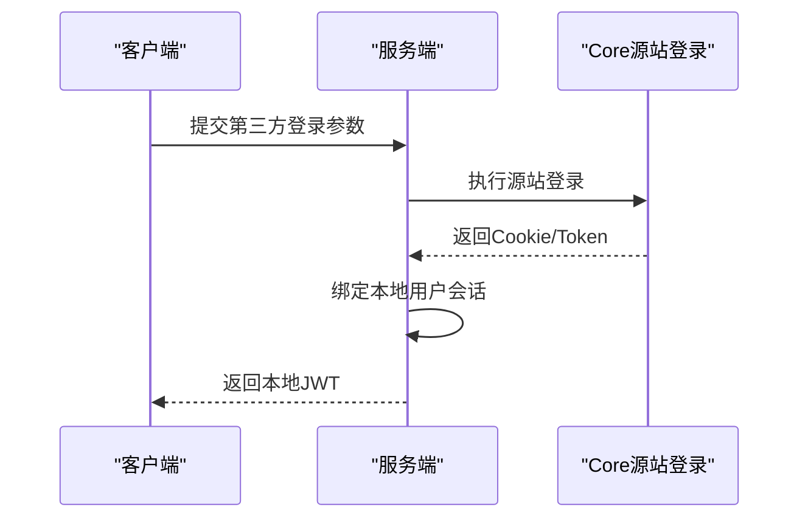
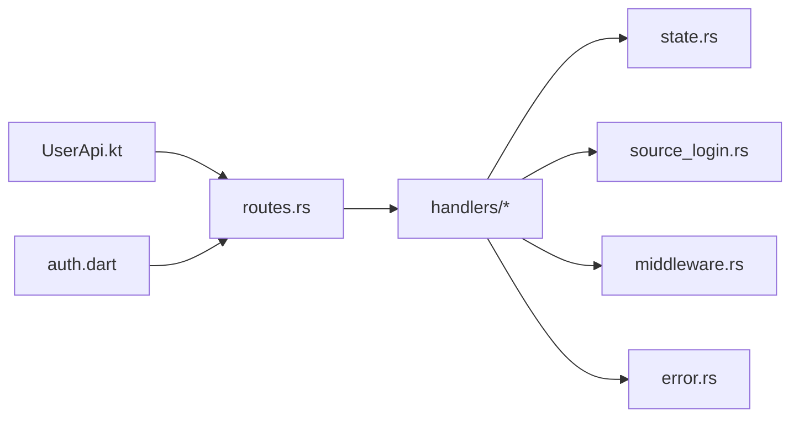

# 认证授权接口

<cite>
**本文引用的文件**   
- [rust/legado-server/src/routes.rs](file://rust/legado-server/src/routes.rs)
- [rust/legado-server/src/handlers/mod.rs](file://rust/legado-server/src/handlers/mod.rs)
- [rust/legado-server/src/state.rs](file://rust/legado-server/src/state.rs)
- [rust/legado-server/src/error.rs](file://rust/legado-server/src/error.rs)
- [rust/legado-ffi/src/api/user_api.rs](file://rust/legado-ffi/src/api/user_api.rs)
- [rust/legado-core/src/source_login.rs](file://rust/legado-core/src/source_login.rs)
- [rust/legado-net/src/middleware.rs](file://rust/legado-net/src/middleware.rs)
- [app/src/main/java/io/legado/app/api/UserApi.kt](file://app/src/main/java/io/legado/app/api/UserApi.kt)
- [flutter_legado/lib/src/auth.dart](file://flutter_legado/lib/src/auth.dart)
</cite>

## 目录
1. [简介](#简介)
2. [项目结构](#项目结构)
3. [核心组件](#核心组件)
4. [架构总览](#架构总览)
5. [详细组件分析](#详细组件分析)
6. [依赖分析](#依赖分析)
7. [性能考虑](#性能考虑)
8. [故障排查指南](#故障排查指南)
9. [结论](#结论)
10. [附录](#附录)

## 简介
本文件面向Legado项目的认证与授权子系统，聚焦以下目标：
- 用户登录认证流程：用户名密码登录、第三方登录、令牌刷新
- JWT令牌结构与验证：载荷字段、签名校验、过期处理
- 权限控制模型：角色定义、资源访问控制、API级别权限
- 会话管理：创建、续期、注销等生命周期操作
- 安全最佳实践：密码加密、CSRF防护、XSS防护等
- 完整示例与安全配置指南

说明：本项目为多端（Android/Flutter/Web）+ Rust后端服务组成的系统。认证相关能力由Rust服务端提供，客户端通过HTTP API调用；部分源站登录逻辑由core层实现。

## 项目结构
认证授权相关代码主要分布在以下模块：
- Rust服务端：路由、处理器、状态、错误处理、中间件
- FFI层：对外暴露的用户API
- Core层：源站登录逻辑
- 客户端：Android与Flutter的认证封装

图表来源
- [rust/legado-server/src/routes.rs](file://rust/legado-server/src/routes.rs)
- [rust/legado-server/src/handlers/mod.rs](file://rust/legado-server/src/handlers/mod.rs)
- [rust/legado-server/src/state.rs](file://rust/legado-server/src/state.rs)
- [rust/legado-server/src/middleware.rs](file://rust/legado-server/src/middleware.rs)
- [rust/legado-core/src/source_login.rs](file://rust/legado-core/src/source_login.rs)

章节来源
- [rust/legado-server/src/routes.rs](file://rust/legado-server/src/routes.rs)
- [rust/legado-server/src/handlers/mod.rs](file://rust/legado-server/src/handlers/mod.rs)
- [rust/legado-server/src/state.rs](file://rust/legado-server/src/state.rs)
- [rust/legado-server/src/middleware.rs](file://rust/legado-server/src/middleware.rs)
- [rust/legado-core/src/source_login.rs](file://rust/legado-core/src/source_login.rs)

## 核心组件
- 路由与控制器：统一注册认证相关接口，如登录、第三方登录、令牌刷新、登出、获取当前用户信息
- 会话与状态：维护用户会话、JWT签发与校验、令牌缓存与续期策略
- 中间件：在请求进入业务前进行鉴权、签名校验、速率限制等
- 错误处理：统一的认证失败、令牌过期、权限不足等错误返回
- 源站登录：对接第三方源的登录流程（Cookie/Token同步）

章节来源
- [rust/legado-server/src/routes.rs](file://rust/legado-server/src/routes.rs)
- [rust/legado-server/src/handlers/mod.rs](file://rust/legado-server/src/handlers/mod.rs)
- [rust/legado-server/src/state.rs](file://rust/legado-server/src/state.rs)
- [rust/legado-server/src/middleware.rs](file://rust/legado-server/src/middleware.rs)
- [rust/legado-server/src/error.rs](file://rust/legado-server/src/error.rs)
- [rust/legado-core/src/source_login.rs](file://rust/legado-core/src/source_login.rs)

## 架构总览
整体认证授权流程如下：
- 客户端发起登录请求（用户名密码或第三方）
- 服务端校验凭据，签发JWT（含用户标识、角色、过期时间等）
- 后续请求携带JWT，中间件校验签名与有效期
- 根据角色与资源策略决定允许/拒绝访问
- 支持令牌刷新与主动注销

图表来源
- [rust/legado-server/src/routes.rs](file://rust/legado-server/src/routes.rs)
- [rust/legado-server/src/handlers/mod.rs](file://rust/legado-server/src/handlers/mod.rs)
- [rust/legado-server/src/state.rs](file://rust/legado-server/src/state.rs)
- [rust/legado-server/src/middleware.rs](file://rust/legado-server/src/middleware.rs)
- [rust/legado-core/src/source_login.rs](file://rust/legado-core/src/source_login.rs)

## 详细组件分析

### 认证接口与流程
- 用户名密码登录
  - 输入：用户名、密码
  - 处理：校验凭据、生成JWT、写入会话
  - 输出：访问令牌、过期时间、可选刷新令牌
- 第三方登录
  - 输入：第三方平台授权码/回调参数
  - 处理：换取第三方令牌、绑定本地用户、签发JWT
  - 输出：访问令牌、过期时间
- 令牌刷新
  - 输入：刷新令牌（若启用）
  - 处理：校验刷新令牌有效性、签发新访问令牌
  - 输出：新的访问令牌及过期时间
- 注销
  - 输入：当前会话标识或令牌
  - 处理：失效会话、清除本地缓存
  - 输出：注销成功

图表来源
- [rust/legado-server/src/handlers/mod.rs](file://rust/legado-server/src/handlers/mod.rs)
- [rust/legado-server/src/state.rs](file://rust/legado-server/src/state.rs)
- [rust/legado-core/src/source_login.rs](file://rust/legado-core/src/source_login.rs)

章节来源
- [rust/legado-server/src/handlers/mod.rs](file://rust/legado-server/src/handlers/mod.rs)
- [rust/legado-server/src/state.rs](file://rust/legado-server/src/state.rs)
- [rust/legado-core/src/source_login.rs](file://rust/legado-core/src/source_login.rs)

### JWT令牌结构与验证
- 载荷字段建议
  - sub：用户唯一标识
  - roles：角色列表（用于RBAC）
  - exp：过期时间戳
  - iat：签发时间
  - jti：令牌唯一ID（便于撤销）
  - scope：可选作用域（细粒度权限）
- 签名与传输
  - 使用强算法（如RS256/ES256），私钥服务端保管
  - Authorization头携带Bearer Token
- 过期处理
  - 服务端校验exp，过期即拒绝
  - 客户端可提前刷新（接近过期阈值时）

图表来源
- [rust/legado-server/src/state.rs](file://rust/legado-server/src/state.rs)
- [rust/legado-server/src/middleware.rs](file://rust/legado-server/src/middleware.rs)

章节来源
- [rust/legado-server/src/state.rs](file://rust/legado-server/src/state.rs)
- [rust/legado-server/src/middleware.rs](file://rust/legado-server/src/middleware.rs)

### 权限控制模型（RBAC）
- 角色定义
  - 管理员、编辑、普通用户等
  - 角色可继承或组合
- 资源访问控制
  - 基于路径或资源的白名单/黑名单
  - 结合scope实现细粒度控制
- API级别权限
  - 每个接口声明所需角色或scope
  - 中间件统一拦截校验

图表来源
- [rust/legado-server/src/middleware.rs](file://rust/legado-server/src/middleware.rs)
- [rust/legado-server/src/handlers/mod.rs](file://rust/legado-server/src/handlers/mod.rs)

章节来源
- [rust/legado-server/src/middleware.rs](file://rust/legado-server/src/middleware.rs)
- [rust/legado-server/src/handlers/mod.rs](file://rust/legado-server/src/handlers/mod.rs)

### 会话管理
- 会话创建
  - 登录成功后建立会话，关联JWT与用户上下文
- 会话续期
  - 基于刷新令牌或滑动过期策略自动续期
- 会话注销
  - 主动失效会话，清理缓存与关联令牌

图表来源
- [rust/legado-server/src/state.rs](file://rust/legado-server/src/state.rs)
- [rust/legado-server/src/handlers/mod.rs](file://rust/legado-server/src/handlers/mod.rs)

章节来源
- [rust/legado-server/src/state.rs](file://rust/legado-server/src/state.rs)
- [rust/legado-server/src/handlers/mod.rs](file://rust/legado-server/src/handlers/mod.rs)

### 源站登录（第三方源）
- 功能概述
  - 将第三方源的登录态（Cookie/Token）与本地会话关联
  - 支持自动抓取与同步
- 典型流程
  - 客户端提交第三方凭据或授权码
  - Core层执行登录并获取Cookie/Token
  - 服务端将其映射到本地用户会话

图表来源
- [rust/legado-core/src/source_login.rs](file://rust/legado-core/src/source_login.rs)
- [rust/legado-server/src/handlers/mod.rs](file://rust/legado-server/src/handlers/mod.rs)

章节来源
- [rust/legado-core/src/source_login.rs](file://rust/legado-core/src/source_login.rs)
- [rust/legado-server/src/handlers/mod.rs](file://rust/legado-server/src/handlers/mod.rs)

### 客户端集成（Android/Flutter）
- Android
  - 通过UserApi封装登录、刷新、注销等接口
  - 本地安全存储令牌（避免明文持久化）
- Flutter
  - auth.dart统一管理认证状态与网络拦截器
  - 自动附加Authorization头与刷新逻辑

章节来源
- [app/src/main/java/io/legado/app/api/UserApi.kt](file://app/src/main/java/io/legado/app/api/UserApi.kt)
- [flutter_legado/lib/src/auth.dart](file://flutter_legado/lib/src/auth.dart)

## 依赖分析
- 路由层依赖处理器与中间件
- 处理器依赖状态管理与Core能力
- 中间件依赖错误处理与策略配置
- 客户端依赖服务端API契约

图表来源
- [rust/legado-server/src/routes.rs](file://rust/legado-server/src/routes.rs)
- [rust/legado-server/src/handlers/mod.rs](file://rust/legado-server/src/handlers/mod.rs)
- [rust/legado-server/src/state.rs](file://rust/legado-server/src/state.rs)
- [rust/legado-server/src/middleware.rs](file://rust/legado-server/src/middleware.rs)
- [rust/legado-server/src/error.rs](file://rust/legado-server/src/error.rs)
- [rust/legado-core/src/source_login.rs](file://rust/legado-core/src/source_login.rs)
- [app/src/main/java/io/legado/app/api/UserApi.kt](file://app/src/main/java/io/legado/app/api/UserApi.kt)
- [flutter_legado/lib/src/auth.dart](file://flutter_legado/lib/src/auth.dart)

章节来源
- [rust/legado-server/src/routes.rs](file://rust/legado-server/src/routes.rs)
- [rust/legado-server/src/handlers/mod.rs](file://rust/legado-server/src/handlers/mod.rs)
- [rust/legado-server/src/state.rs](file://rust/legado-server/src/state.rs)
- [rust/legado-server/src/middleware.rs](file://rust/legado-server/src/middleware.rs)
- [rust/legado-server/src/error.rs](file://rust/legado-server/src/error.rs)
- [rust/legado-core/src/source_login.rs](file://rust/legado-core/src/source_login.rs)
- [app/src/main/java/io/legado/app/api/UserApi.kt](file://app/src/main/java/io/legado/app/api/UserApi.kt)
- [flutter_legado/lib/src/auth.dart](file://flutter_legado/lib/src/auth.dart)

## 性能考虑
- 令牌校验尽量无状态化（仅校验签名与过期），减少服务端负载
- 刷新令牌采用一次性使用与快速轮换，降低重放风险
- 会话存储使用高效数据结构（内存/Redis），注意并发与过期清理
- 对高频接口实施限流与缓存策略，避免暴力破解

[本节为通用指导，无需引用具体文件]

## 故障排查指南
- 常见错误
  - 401 未认证：检查Authorization头与JWT有效性
  - 403 权限不足：检查roles/scope与接口策略
  - 408/429 超时/限流：检查网络与服务端限流配置
- 日志定位
  - 查看认证处理器与中间件的错误日志
  - 核对JWT签发与校验流程的时间戳与签名
- 调试建议
  - 使用最小化请求复现问题
  - 开启详细日志并捕获请求/响应头

章节来源
- [rust/legado-server/src/error.rs](file://rust/legado-server/src/error.rs)
- [rust/legado-server/src/middleware.rs](file://rust/legado-server/src/middleware.rs)
- [rust/legado-server/src/handlers/mod.rs](file://rust/legado-server/src/handlers/mod.rs)

## 结论
Legado的认证授权体系以JWT为核心，结合RBAC与中间件实现统一的鉴权控制。通过清晰的会话管理与刷新机制，兼顾安全性与用户体验。建议在部署中强化密钥管理、启用HTTPS、实施严格的权限策略与监控告警。

[本节为总结性内容，无需引用具体文件]

## 附录
- 安全最佳实践清单
  - 密码加密：服务端使用强哈希（如bcrypt/Argon2），禁止明文存储
  - CSRF防护：对写操作启用SameSite Cookie与CSRF Token
  - XSS防护：输出编码、启用CSP、避免内联脚本
  - 传输安全：强制HTTPS、HSTS、证书校验
  - 令牌安全：短过期、不可预测的jti、黑名单撤销
  - 审计与监控：记录登录与权限事件，设置告警阈值
- 配置要点
  - JWT算法与密钥轮换策略
  - 会话存储与过期清理任务
  - 中间件开关（限流、黑白名单、CORS）

[本节为通用指导，无需引用具体文件]