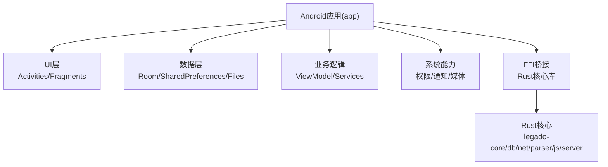
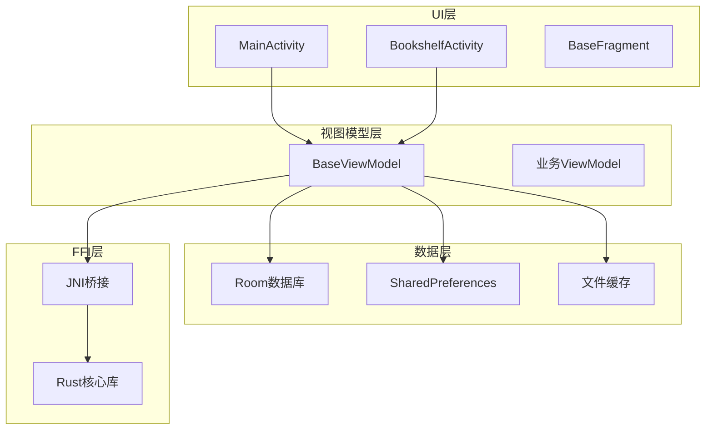
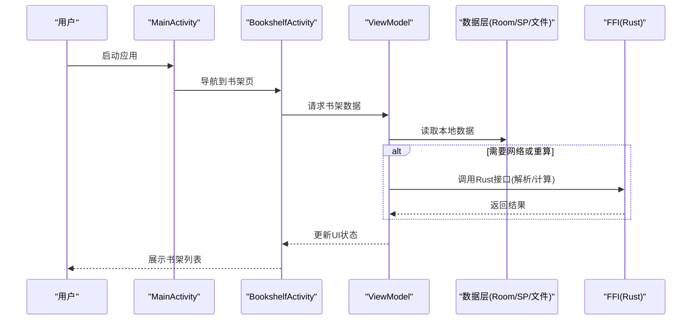
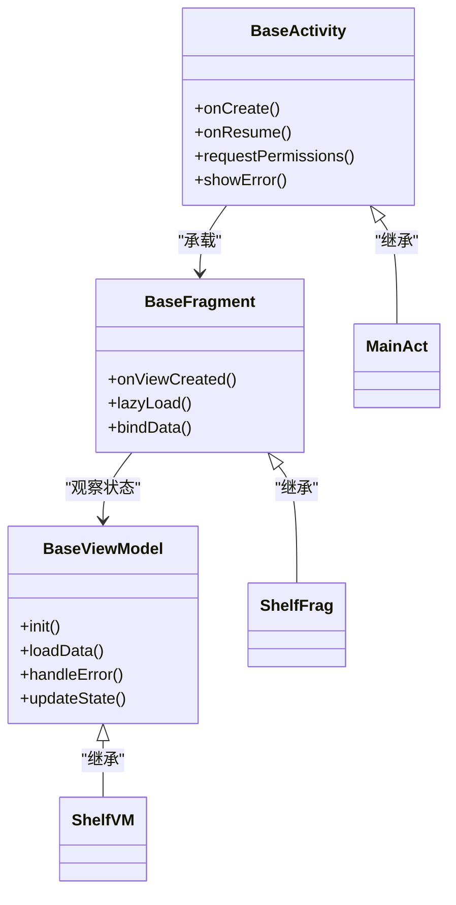
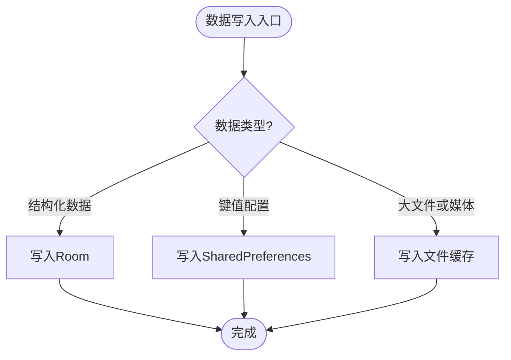
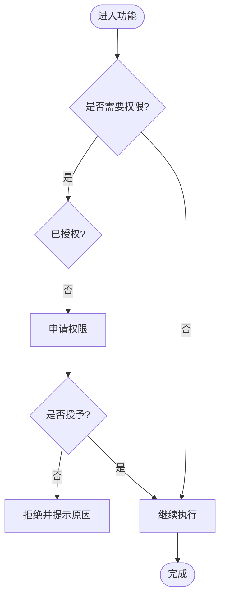
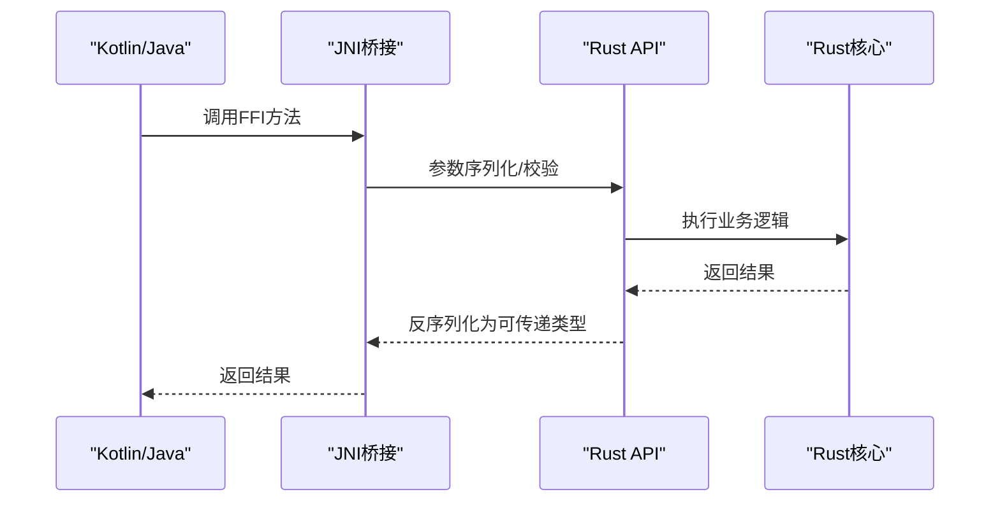
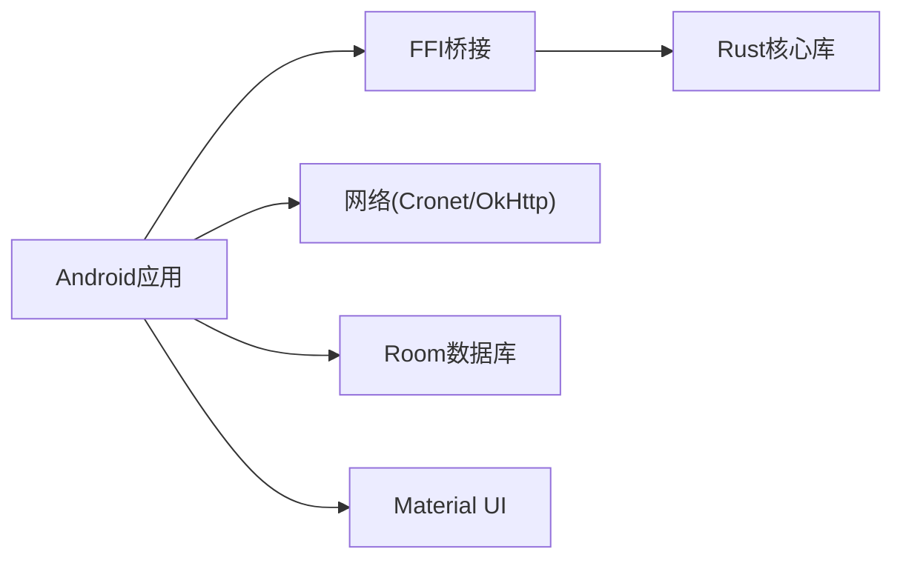

# Android原生应用

<cite>
**本文引用的文件**   
- [AndroidManifest.xml](file://app/src/main/AndroidManifest.xml)
- [App.kt](file://app/src/main/java/io/legado/app/App.kt)
- [MainActivity.kt](file://app/src/main/java/io/legado/app/ui/main/MainActivity.kt)
- [BookshelfActivity.kt](file://app/src/main/java/io/legado/app/ui/bookshelf/BookshelfActivity.kt)
- [BaseActivity.kt](file://app/src/main/java/io/legado/app/base/BaseActivity.kt)
- [BaseFragment.kt](file://app/src/main/java/io/legado/app/base/BaseFragment.kt)
- [BaseViewModel.kt](file://app/src/main/java/io/legado/app/base/BaseViewModel.kt)
- [AppDatabase.kt](file://app/src/main/java/io/legado/app/data/AppDatabase.kt)
- [RoomMigrationTest.kt](file://app/src/test/java/io/legado/app/MigrationTest.kt)
- [PermissionRationaleGateTest.kt](file://app/src/test/java/io/legado/app/base/PermissionRationaleGateTest.kt)
- [CronetDownloadTaskTest.kt](file://app/src/test/java/io/legado/app/ci/CronetDownloadTaskTest.kt)
- [build.gradle](file://app/build.gradle)
- [gradle.properties](file://gradle.properties)
- [settings.gradle](file://settings.gradle)
- [lib.rs](file://rust/legado-ffi/src/lib.rs)
- [bridge.rs](file://rust/legado-ffi/src/bridge.rs)
- [frb_generated.rs](file://rust/legado-ffi/src/frb_generated.rs)
- [bookshelf.rs](file://rust/legado-ffi/src/api/bookshelf.rs)
- [reader.rs](file://rust/legado-ffi/src/api/reader.rs)
- [config_api.rs](file://rust/legado-ffi/src/api/config_api.rs)
- [cache_api.rs](file://rust/legado-ffi/src/api/cache_api.rs)
- [storageHelp.md](file://app/src/main/assets/storageHelp.md)
- [privacyPolicy.md](file://app/src/main/assets/privacyPolicy.md)
</cite>

## 目录
1. [简介](#简介)
2. [项目结构](#项目结构)
3. [核心组件](#核心组件)
4. [架构总览](#架构总览)
5. [详细组件分析](#详细组件分析)
6. [依赖关系分析](#依赖关系分析)
7. [性能考量](#性能考量)
8. [故障排查指南](#故障排查指南)
9. [结论](#结论)
10. [附录](#附录)

## 简介
本文件面向Android原生应用的开发者与维护者，系统性梳理Legado的Android端整体架构与关键实现。内容覆盖：
- 应用入口、导航与主要活动页面（如 MainActivity、BookshelfActivity）
- MVVM模式落地（BaseActivity、BaseFragment、BaseViewModel等基础类）
- 数据存储方案（Room数据库、SharedPreferences、文件缓存）
- 权限管理与安全机制（存储权限、网络权限、文件访问控制）
- UI组件与布局设计（Material Design、响应式布局、主题切换）
- 与Rust核心库的FFI集成（JNI桥接、性能优化）
- 最佳实践与常见问题排查

## 项目结构
Android模块位于 app 目录下，采用Kotlin为主语言，资源与清单文件遵循标准Android工程组织；Rust核心通过FFI暴露API供Android调用。

图表来源
- [AndroidManifest.xml](file://app/src/main/AndroidManifest.xml)
- [App.kt](file://app/src/main/java/io/legado/app/App.kt)
- [lib.rs](file://rust/legado-ffi/src/lib.rs)

章节来源
- [AndroidManifest.xml](file://app/src/main/AndroidManifest.xml)
- [build.gradle](file://app/build.gradle)
- [gradle.properties](file://gradle.properties)
- [settings.gradle](file://settings.gradle)

## 核心组件
- 应用初始化与全局配置：Application子类负责初始化框架、日志、网络、数据库、主题、权限策略等。
- 主入口与导航：MainActivity作为根容器，承载底部导航或单页多片段导航。
- 书架页：BookshelfActivity展示书籍列表、筛选与搜索入口。
- 基础类：BaseActivity、BaseFragment、BaseViewModel提供生命周期、状态绑定、权限处理、错误提示等通用能力。
- 数据层：Room数据库实体与DAO、迁移脚本、SharedPreferences键值存储、文件缓存策略。
- FFI桥接：Rust侧API经FFI暴露给Kotlin/Java，用于高性能计算、解析、网络与IO。

章节来源
- [App.kt](file://app/src/main/java/io/legado/app/App.kt)
- [MainActivity.kt](file://app/src/main/java/io/legado/app/ui/main/MainActivity.kt)
- [BookshelfActivity.kt](file://app/src/main/java/io/legado/app/ui/bookshelf/BookshelfActivity.kt)
- [BaseActivity.kt](file://app/src/main/java/io/legado/app/base/BaseActivity.kt)
- [BaseFragment.kt](file://app/src/main/java/io/legado/app/base/BaseFragment.kt)
- [BaseViewModel.kt](file://app/src/main/java/io/legado/app/base/BaseViewModel.kt)
- [AppDatabase.kt](file://app/src/main/java/io/legado/app/data/AppDatabase.kt)

## 架构总览
应用采用MVVM分层，结合Android官方组件与Rust核心库的高性能能力。

图表来源
- [MainActivity.kt](file://app/src/main/java/io/legado/app/ui/main/MainActivity.kt)
- [BookshelfActivity.kt](file://app/src/main/java/io/legado/app/ui/bookshelf/BookshelfActivity.kt)
- [BaseViewModel.kt](file://app/src/main/java/io/legado/app/base/BaseViewModel.kt)
- [AppDatabase.kt](file://app/src/main/java/io/legado/app/data/AppDatabase.kt)
- [lib.rs](file://rust/legado-ffi/src/lib.rs)

## 详细组件分析

### 活动与导航：MainActivity与BookshelfActivity
- MainActivity作为应用根容器，负责导航容器与全局状态管理，通常使用Fragment或WebView容器承载子页面。
- BookshelfActivity为书架功能入口，包含列表展示、筛选、搜索与跳转至阅读器等功能。
- 导航方式建议基于Navigation Component或自定义Fragment栈，保证状态一致性与回退栈正确性。

图表来源
- [MainActivity.kt](file://app/src/main/java/io/legado/app/ui/main/MainActivity.kt)
- [BookshelfActivity.kt](file://app/src/main/java/io/legado/app/ui/bookshelf/BookshelfActivity.kt)
- [BaseViewModel.kt](file://app/src/main/java/io/legado/app/base/BaseViewModel.kt)
- [AppDatabase.kt](file://app/src/main/java/io/legado/app/data/AppDatabase.kt)
- [lib.rs](file://rust/legado-ffi/src/lib.rs)

章节来源
- [MainActivity.kt](file://app/src/main/java/io/legado/app/ui/main/MainActivity.kt)
- [BookshelfActivity.kt](file://app/src/main/java/io/legado/app/ui/bookshelf/BookshelfActivity.kt)

### MVVM基础类：BaseActivity、BaseFragment、BaseViewModel
- BaseActivity：统一生命周期、权限申请、主题设置、错误提示、日志埋点等。
- BaseFragment：封装Fragment通用行为，如懒加载、数据绑定、生命周期感知。
- BaseViewModel：集中处理协程调度、状态管理、错误处理、与数据层交互。

图表来源
- [BaseActivity.kt](file://app/src/main/java/io/legado/app/base/BaseActivity.kt)
- [BaseFragment.kt](file://app/src/main/java/io/legado/app/base/BaseFragment.kt)
- [BaseViewModel.kt](file://app/src/main/java/io/legado/app/base/BaseViewModel.kt)

章节来源
- [BaseActivity.kt](file://app/src/main/java/io/legado/app/base/BaseActivity.kt)
- [BaseFragment.kt](file://app/src/main/java/io/legado/app/base/BaseFragment.kt)
- [BaseViewModel.kt](file://app/src/main/java/io/legado/app/base/BaseViewModel.kt)

### 数据存储：Room、SharedPreferences、文件缓存
- Room数据库：定义实体、DAO与迁移策略，确保版本演进稳定可靠。
- SharedPreferences：保存轻量配置项（主题、字体、阅读偏好）。
- 文件缓存：图片、音频、临时文件的读写与清理策略。

图表来源
- [AppDatabase.kt](file://app/src/main/java/io/legado/app/data/AppDatabase.kt)
- [RoomMigrationTest.kt](file://app/src/test/java/io/legado/app/MigrationTest.kt)

章节来源
- [AppDatabase.kt](file://app/src/main/java/io/legado/app/data/AppDatabase.kt)
- [RoomMigrationTest.kt](file://app/src/test/java/io/legado/app/MigrationTest.kt)

### 权限管理与安全机制
- 存储权限：适配Android 11+分区存储，必要时引导用户授权。
- 网络权限：声明网络访问权限，处理HTTPS证书与代理。
- 文件访问控制：对外部存储与私有目录的安全访问策略。
- 隐私合规：在assets中提供隐私政策说明。

图表来源
- [AndroidManifest.xml](file://app/src/main/AndroidManifest.xml)
- [PermissionRationaleGateTest.kt](file://app/src/test/java/io/legado/app/base/PermissionRationaleGateTest.kt)
- [storageHelp.md](file://app/src/main/assets/storageHelp.md)
- [privacyPolicy.md](file://app/src/main/assets/privacyPolicy.md)

章节来源
- [AndroidManifest.xml](file://app/src/main/AndroidManifest.xml)
- [PermissionRationaleGateTest.kt](file://app/src/test/java/io/legado/app/base/PermissionRationaleGateTest.kt)
- [storageHelp.md](file://app/src/main/assets/storageHelp.md)
- [privacyPolicy.md](file://app/src/main/assets/privacyPolicy.md)

### UI组件与布局设计
- Material Design：使用Material Components构建一致的视觉体验。
- 响应式布局：支持横竖屏与不同屏幕尺寸。
- 主题切换：动态切换亮/暗主题与自定义色板。

章节来源
- [AndroidManifest.xml](file://app/src/main/AndroidManifest.xml)
- [build.gradle](file://app/build.gradle)

### 与Rust核心库的FFI集成
- Rust侧通过FFI暴露API，包括书架、阅读器、配置、缓存等模块。
- Android侧通过生成的桥接代码调用Rust函数，获得高性能计算与解析能力。
- 典型场景：电子书解析、文本搜索、音频预处理、网络请求中间件。

图表来源
- [lib.rs](file://rust/legado-ffi/src/lib.rs)
- [bridge.rs](file://rust/legado-ffi/src/bridge.rs)
- [frb_generated.rs](file://rust/legado-ffi/src/frb_generated.rs)
- [bookshelf.rs](file://rust/legado-ffi/src/api/bookshelf.rs)
- [reader.rs](file://rust/legado-ffi/src/api/reader.rs)
- [config_api.rs](file://rust/legado-ffi/src/api/config_api.rs)
- [cache_api.rs](file://rust/legado-ffi/src/api/cache_api.rs)

章节来源
- [lib.rs](file://rust/legado-ffi/src/lib.rs)
- [bridge.rs](file://rust/legado-ffi/src/bridge.rs)
- [frb_generated.rs](file://rust/legado-ffi/src/frb_generated.rs)
- [bookshelf.rs](file://rust/legado-ffi/src/api/bookshelf.rs)
- [reader.rs](file://rust/legado-ffi/src/api/reader.rs)
- [config_api.rs](file://rust/legado-ffi/src/api/config_api.rs)
- [cache_api.rs](file://rust/legado-ffi/src/api/cache_api.rs)

## 依赖关系分析
Android模块依赖Rust核心库提供的FFI接口，同时依赖Android系统与第三方库（如Cronet网络栈）。

图表来源
- [build.gradle](file://app/build.gradle)
- [lib.rs](file://rust/legado-ffi/src/lib.rs)

章节来源
- [build.gradle](file://app/build.gradle)
- [CronetDownloadTaskTest.kt](file://app/src/test/java/io/legado/app/ci/CronetDownloadTaskTest.kt)

## 性能考量
- 数据层：合理使用Room索引与分页查询，避免主线程阻塞。
- 网络层：启用连接复用、压缩与缓存策略，减少重复请求。
- FFI调用：批量处理与异步回调，降低跨语言调用开销。
- UI渲染：延迟加载与虚拟化列表，减少内存占用与卡顿。

## 故障排查指南
- 权限问题：检查AndroidManifest声明与运行时授权流程，参考测试用例验证路径。
- 数据库迁移：确认迁移脚本完整性与兼容性，运行迁移测试。
- 网络异常：查看Cronet下载任务与重试策略，定位超时与证书问题。
- FFI崩溃：核对参数序列化与返回值类型，检查Rust侧错误码与日志。

章节来源
- [PermissionRationaleGateTest.kt](file://app/src/test/java/io/legado/app/base/PermissionRationaleGateTest.kt)
- [RoomMigrationTest.kt](file://app/src/test/java/io/legado/app/MigrationTest.kt)
- [CronetDownloadTaskTest.kt](file://app/src/test/java/io/legado/app/ci/CronetDownloadTaskTest.kt)

## 结论
本项目以MVVM为核心架构，结合Android官方组件与Rust高性能能力，形成清晰的分层与稳定的扩展点。通过完善的权限与安全策略、灵活的数据存储方案以及良好的UI设计，满足复杂阅读与资源管理需求。建议在后续迭代中持续优化FFI调用效率与数据库查询性能，完善错误监控与日志体系。

## 附录
- 最佳实践
  - 将耗时操作放入后台线程，使用LiveData/Flow进行状态同步。
  - 对敏感配置进行加密存储，避免明文泄露。
  - 使用统一的错误码与提示文案，提升用户体验一致性。
- 参考文档
  - 存储帮助与隐私政策位于assets目录，便于用户理解与合规。