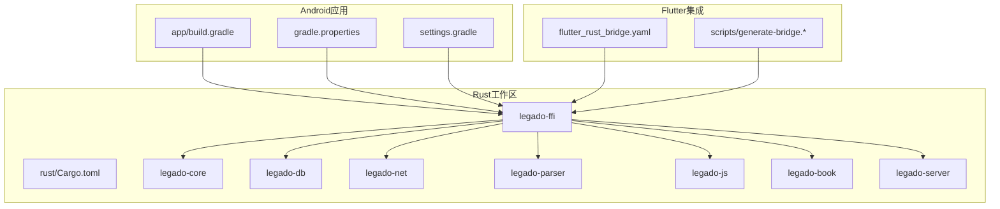
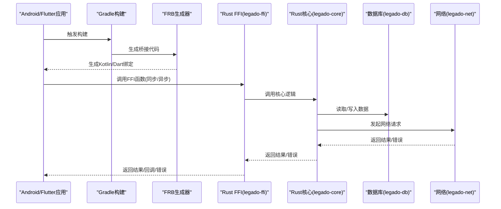
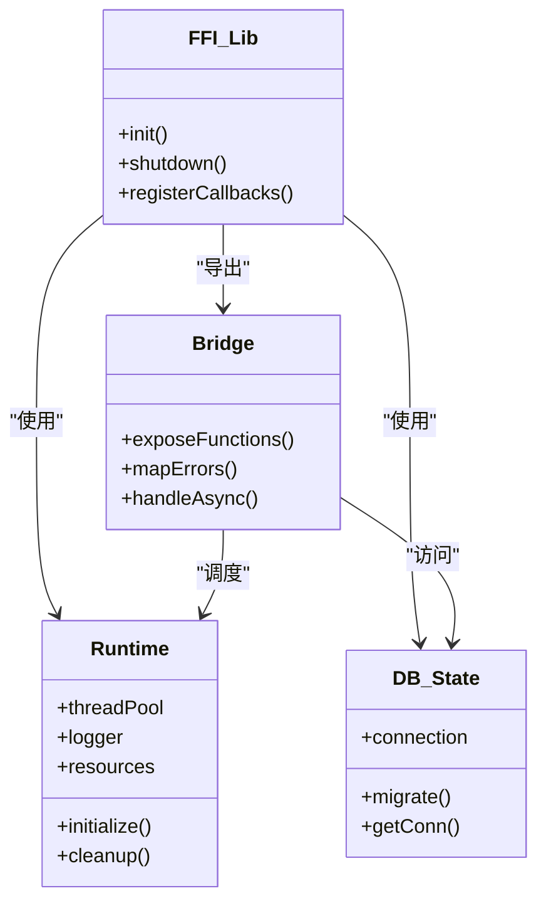
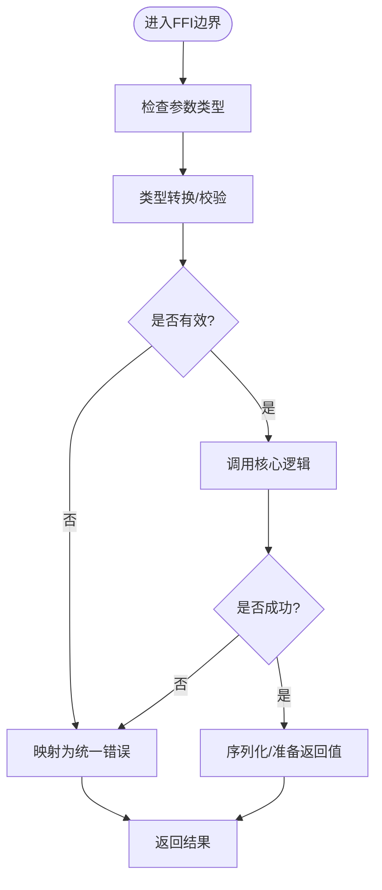
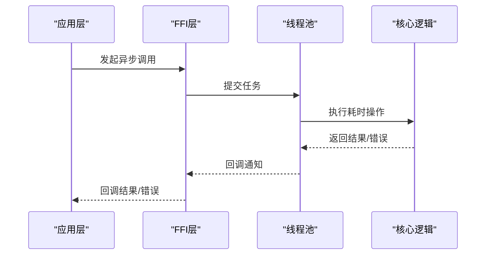
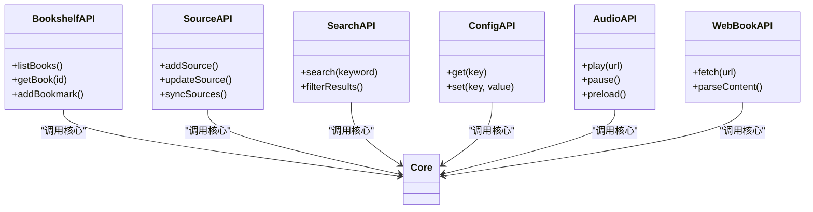
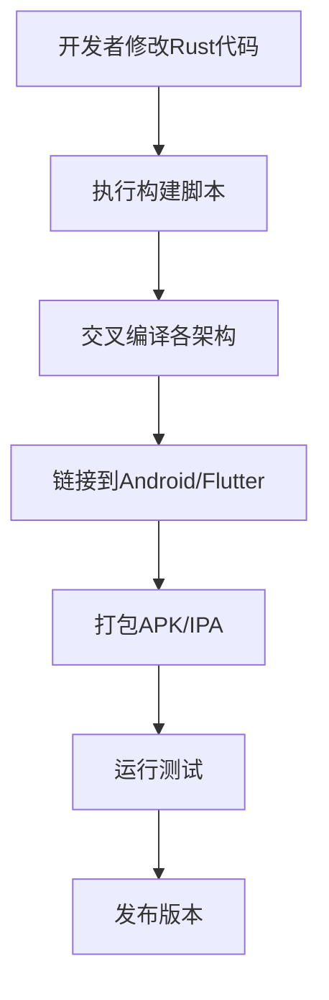
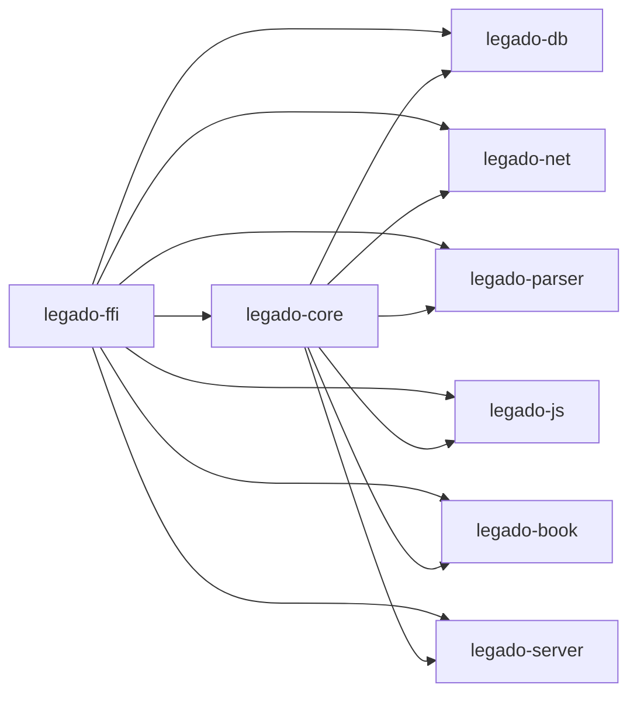

# FFI集成和Rust桥接

<cite>
**本文引用的文件**   
- [app/build.gradle](file://app/build.gradle)
- [gradle.properties](file://gradle.properties)
- [settings.gradle](file://settings.gradle)
- [rust/Cargo.toml](file://rust/Cargo.toml)
- [rust/legado-ffi/Cargo.toml](file://rust/legado-ffi/Cargo.toml)
- [rust/legado-core/Cargo.toml](file://rust/legado-core/Cargo.toml)
- [rust/legado-db/Cargo.toml](file://rust/legado-db/Cargo.toml)
- [rust/legado-net/Cargo.toml](file://rust/legado-net/Cargo.toml)
- [rust/legado-parser/Cargo.toml](file://rust/legado-parser/Cargo.toml)
- [rust/legado-js/Cargo.toml](file://rust/legado-js/Cargo.toml)
- [rust/legado-book/Cargo.toml](file://rust/legado-book/Cargo.toml)
- [rust/legado-server/Cargo.toml](file://rust/legado-server/Cargo.toml)
- [rust/legado-ffi/src/lib.rs](file://rust/legado-ffi/src/lib.rs)
- [rust/legado-ffi/src/bridge.rs](file://rust/legado-ffi/src/bridge.rs)
- [rust/legado-ffi/src/ffi.rs](file://rust/legado-ffi/src/ffi.rs)
- [rust/legado-ffi/src/frb_generated.rs](file://rust/legado-ffi/src/frb_generated.rs)
- [rust/legado-ffi/src/runtime.rs](file://rust/legado-ffi/src/runtime.rs)
- [rust/legado-ffi/src/db_state.rs](file://rust/legado-ffi/src/db_state.rs)
- [rust/legado-ffi/src/api/mod.rs](file://rust/legado-ffi/src/api/mod.rs)
- [rust/legado-ffi/src/api/bookshelf.rs](file://rust/legado-ffi/src/api/bookshelf.rs)
- [rust/legado-ffi/src/api/source.rs](file://rust/legado-ffi/src/api/source.rs)
- [rust/legado-ffi/src/api/search.rs](file://rust/legado-ffi/src/api/search.rs)
- [rust/legado-ffi/src/api/config_api.rs](file://rust/legado-ffi/src/api/config_api.rs)
- [rust/legado-ffi/src/api/audio_api.rs](file://rust/legado-ffi/src/api/audio_api.rs)
- [rust/legado-ffi/src/api/web_book.rs](file://rust/legado-ffi/src/api/web_book.rs)
- [rust/legado-core/src/lib.rs](file://rust/legado-core/src/lib.rs)
- [rust/legado-core/src/error.rs](file://rust/legado-core/src/error.rs)
- [rust/legado-core/src/types.rs](file://rust/legado-core/src/types.rs)
- [rust/legado-core/src/models/mod.rs](file://rust/legado-core/src/models/mod.rs)
- [rust/legado-db/src/lib.rs](file://rust/legado-db/src/lib.rs)
- [rust/legado-net/src/lib.rs](file://rust/legado-net/src/lib.rs)
- [rust/legado-parser/src/lib.rs](file://rust/legado-parser/src/lib.rs)
- [rust/legado-js/src/lib.rs](file://rust/legado-js/src/lib.rs)
- [rust/legado-book/src/lib.rs](file://rust/legado-book/src/lib.rs)
- [rust/legado-server/src/lib.rs](file://rust/legado-server/src/lib.rs)
- [flutter_leguto/flutter_rust_bridge.yaml](file://flutter_legado/flutter_rust_bridge.yaml)
- [flutter_legado/scripts/generate-bridge.sh](file://flutter_legado/scripts/generate-bridge.sh)
- [flutter_legado/scripts/generate-bridge.ps1](file://flutter_legado/scripts/generate-bridge.ps1)
- [Makefile](file://Makefile)
- [rust/scripts/build-android.sh](file://rust/scripts/build-android.sh)
- [rust/scripts/build-android.ps1](file://rust/scripts/build-android.ps1)
</cite>

## 目录
1. [简介](#简介)
2. [项目结构](#项目结构)
3. [核心组件](#核心组件)
4. [架构总览](#架构总览)
5. [详细组件分析](#详细组件分析)
6. [依赖分析](#依赖分析)
7. [性能考虑](#性能考虑)
8. [故障排查指南](#故障排查指南)
9. [结论](#结论)
10. [附录](#附录)

## 简介
本文件面向需要在Android应用中通过FFI与Rust核心库进行集成的开发者，系统性阐述JNI/Flutter Rust Bridge（FRB）桥接实现原理、数据类型转换、异常处理与内存管理；说明如何从Kotlin/Java或Flutter侧调用Rust函数、处理异步回调与错误传播；并给出构建系统集成（Gradle配置、交叉编译、依赖管理）、性能优化策略（线程池、批量操作、内存使用）以及调试技巧与常见问题解决方案。文档以仓库中的实际代码为依据，提供可追溯的源码路径与可视化图示，帮助读者快速上手与排障。

## 项目结构
本项目采用多模块Rust工程与Android/Flutter双端集成：
- Rust侧以Cargo Workspace组织多个crate：legado-core（领域模型与通用能力）、legado-ffi（对外暴露的FFI接口与FRB生成）、legado-db（数据库访问）、legado-net（网络）、legado-parser（解析）、legado-js（脚本引擎）、legado-book（电子书格式处理）、legado-server（内置HTTP服务）。
- Android侧通过Gradle构建，集成Rust原生库；Flutter侧通过flutter_rust_bridge插件生成双向绑定。
- 构建脚本位于rust/scripts与flutter_legado/scripts，支持Android交叉编译与桥接代码生成。

**图表来源** 
- [app/build.gradle](file://app/build.gradle)
- [gradle.properties](file://gradle.properties)
- [settings.gradle](file://settings.gradle)
- [rust/Cargo.toml](file://rust/Cargo.toml)
- [flutter_legado/flutter_rust_bridge.yaml](file://flutter_legado/flutter_rust_bridge.yaml)

**章节来源**
- [app/build.gradle](file://app/build.gradle)
- [gradle.properties](file://gradle.properties)
- [settings.gradle](file://settings.gradle)
- [rust/Cargo.toml](file://rust/Cargo.toml)
- [flutter_legado/flutter_rust_bridge.yaml](file://flutter_legado/flutter_rust_bridge.yaml)

## 核心组件
- FFI层（legado-ffi）：统一对外暴露C/FFI接口，封装FRB生成的类型与调用，负责生命周期、状态管理与错误映射。
- 核心库（legado-core）：业务逻辑、数据模型、工具方法等，不直接暴露给外部语言，仅被FFI层调用。
- 数据库（legado-db）：SQLite/ORM相关能力，由FFI层按需初始化与复用连接。
- 网络（legado-net）：HTTP客户端、重试、代理、SSL配置等。
- 解析（legado-parser）：HTML/JSONPath/XPath规则解析与执行。
- JS引擎（legado-js）：Rhino脚本引擎宿主API，供动态规则执行。
- 书籍处理（legado-book）：EPUB/TXT/MOBI/PDF等格式读写与搜索。
- 服务器（legado-server）：可选的本地HTTP服务，便于调试与跨进程通信。

**章节来源**
- [rust/legado-ffi/src/lib.rs](file://rust/legado-ffi/src/lib.rs)
- [rust/legado-core/src/lib.rs](file://rust/legado-core/src/lib.rs)
- [rust/legado-db/src/lib.rs](file://rust/legado-db/src/lib.rs)
- [rust/legado-net/src/lib.rs](file://rust/legado-net/src/lib.rs)
- [rust/legado-parser/src/lib.rs](file://rust/legado-parser/src/lib.rs)
- [rust/legado-js/src/lib.rs](file://rust/legado-js/src/lib.rs)
- [rust/legado-book/src/lib.rs](file://rust/legado-book/src/lib.rs)
- [rust/legado-server/src/lib.rs](file://rust/legado-server/src/lib.rs)

## 架构总览
下图展示从Android/Flutter到Rust FFI层的调用链路，包括类型转换、异步回调与错误传播。

**图表来源** 
- [rust/legado-ffi/src/bridge.rs](file://rust/legado-ffi/src/bridge.rs)
- [rust/legado-ffi/src/frb_generated.rs](file://rust/legado-ffi/src/frb_generated.rs)
- [rust/legado-core/src/lib.rs](file://rust/legado-core/src/lib.rs)
- [rust/legado-db/src/lib.rs](file://rust/legado-db/src/lib.rs)
- [rust/legado-net/src/lib.rs](file://rust/legado-net/src/lib.rs)

## 详细组件分析

### FFI层与FRB集成
- FFI入口与模块组织：在legado-ffi中集中定义对外函数，按功能域拆分至api/*子模块，便于维护与权限控制。
- FRB生成：通过flutter_rust_bridge配置与脚本生成跨语言绑定，确保类型安全与零拷贝优化。
- 运行时管理：在runtime.rs中管理全局状态、线程池、日志与资源清理。
- 数据库状态：db_state.rs维护数据库连接与迁移，避免重复初始化。

**图表来源** 
- [rust/legado-ffi/src/lib.rs](file://rust/legado-ffi/src/lib.rs)
- [rust/legado-ffi/src/bridge.rs](file://rust/legado-ffi/src/bridge.rs)
- [rust/legado-ffi/src/runtime.rs](file://rust/legado-ffi/src/runtime.rs)
- [rust/legado-ffi/src/db_state.rs](file://rust/legado-ffi/src/db_state.rs)

**章节来源**
- [rust/legado-ffi/src/lib.rs](file://rust/legado-ffi/src/lib.rs)
- [rust/legado-ffi/src/bridge.rs](file://rust/legado-ffi/src/bridge.rs)
- [rust/legado-ffi/src/frb_generated.rs](file://rust/legado-ffi/src/frb_generated.rs)
- [rust/legado-ffi/src/runtime.rs](file://rust/legado-ffi/src/runtime.rs)
- [rust/legado-ffi/src/db_state.rs](file://rust/legado-ffi/src/db_state.rs)

### 数据类型转换与内存管理
- 基本类型：整数、布尔、字符串等在FFI边界进行显式转换，避免平台差异。
- 复杂对象：通过序列化/反序列化或零拷贝指针传递，减少GC压力。
- 内存管理：遵循“谁分配谁释放”原则，必要时使用RAII与智能指针；对大对象采用流式处理与分页。
- 异常与错误：将Rust Result/自定义错误映射为统一的错误码与消息，便于上层捕获与展示。

**图表来源** 
- [rust/legado-ffi/src/ffi.rs](file://rust/legado-ffi/src/ffi.rs)
- [rust/legado-core/src/error.rs](file://rust/legado-core/src/error.rs)
- [rust/legado-core/src/types.rs](file://rust/legado-core/src/types.rs)

**章节来源**
- [rust/legado-ffi/src/ffi.rs](file://rust/legado-ffi/src/ffi.rs)
- [rust/legado-core/src/error.rs](file://rust/legado-core/src/error.rs)
- [rust/legado-core/src/types.rs](file://rust/legado-core/src/types.rs)

### 异步调用、回调与错误传播
- 异步调用：通过线程池执行耗时任务，避免阻塞主线程；FRB支持Future/回调模式。
- 回调处理：在FFI层注册回调函数，将Rust侧事件推送至上层；注意线程切换与生命周期。
- 错误传播：统一错误类型，包含错误码、消息与堆栈信息；上层可按需降级或重试。

**图表来源** 
- [rust/legado-ffi/src/runtime.rs](file://rust/legado-ffi/src/runtime.rs)
- [rust/legado-ffi/src/bridge.rs](file://rust/legado-ffi/src/bridge.rs)

**章节来源**
- [rust/legado-ffi/src/runtime.rs](file://rust/legado-ffi/src/runtime.rs)
- [rust/legado-ffi/src/bridge.rs](file://rust/legado-ffi/src/bridge.rs)

### API示例：书架、源管理、搜索、配置、音频、网页书
以下API模块展示了常见业务场景的FFI封装，涵盖CRUD、网络请求、解析与媒体播放等。

- 书架管理：bookshelf.rs提供书籍列表、详情、收藏等操作。
- 源管理：source.rs用于订阅源的增删改查与状态同步。
- 搜索：search.rs实现关键词检索与结果聚合。
- 配置：config_api.rs读写应用设置与用户偏好。
- 音频：audio_api.rs管理播放队列、缓存与预加载。
- 网页书：web_book.rs处理在线书籍的抓取与渲染。

**图表来源** 
- [rust/legado-ffi/src/api/bookshelf.rs](file://rust/legado-ffi/src/api/bookshelf.rs)
- [rust/legado-ffi/src/api/source.rs](file://rust/legado-ffi/src/api/source.rs)
- [rust/legado-ffi/src/api/search.rs](file://rust/legado-ffi/src/api/search.rs)
- [rust/legado-ffi/src/api/config_api.rs](file://rust/legado-ffi/src/api/config_api.rs)
- [rust/legado-ffi/src/api/audio_api.rs](file://rust/legado-ffi/src/api/audio_api.rs)
- [rust/legado-ffi/src/api/web_book.rs](file://rust/legado-ffi/src/api/web_book.rs)

**章节来源**
- [rust/legado-ffi/src/api/mod.rs](file://rust/legado-ffi/src/api/mod.rs)
- [rust/legado-ffi/src/api/bookshelf.rs](file://rust/legado-ffi/src/api/bookshelf.rs)
- [rust/legado-ffi/src/api/source.rs](file://rust/legado-ffi/src/api/source.rs)
- [rust/legado-ffi/src/api/search.rs](file://rust/legado-ffi/src/api/search.rs)
- [rust/legado-ffi/src/api/config_api.rs](file://rust/legado-ffi/src/api/config_api.rs)
- [rust/legado-ffi/src/api/audio_api.rs](file://rust/legado-ffi/src/api/audio_api.rs)
- [rust/legado-ffi/src/api/web_book.rs](file://rust/legado-ffi/src/api/web_book.rs)

### 构建系统集成：Gradle、交叉编译与依赖管理
- Gradle配置：在app/build.gradle中声明NDK、Rust目标与链接选项；通过download.gradle或自定义任务拉取预编译库。
- 交叉编译：使用rust/scripts/build-android.*脚本针对arm64-v8a、armeabi-v7a、x86_64等架构编译静态库或动态库。
- 依赖管理：Cargo Workspace统一管理crate版本与特性开关；通过Cargo.lock锁定依赖树。
- Flutter桥接：flutter_rust_bridge.yaml定义类型映射与生成规则；generate-bridge.*脚本自动更新绑定代码。

**图表来源** 
- [app/build.gradle](file://app/build.gradle)
- [gradle.properties](file://gradle.properties)
- [rust/scripts/build-android.sh](file://rust/scripts/build-android.sh)
- [rust/scripts/build-android.ps1](file://rust/scripts/build-android.ps1)
- [flutter_legado/flutter_rust_bridge.yaml](file://flutter_legado/flutter_rust_bridge.yaml)
- [flutter_legado/scripts/generate-bridge.sh](file://flutter_legado/scripts/generate-bridge.sh)
- [flutter_legado/scripts/generate-bridge.ps1](file://flutter_legado/scripts/generate-bridge.ps1)

**章节来源**
- [app/build.gradle](file://app/build.gradle)
- [gradle.properties](file://gradle.properties)
- [settings.gradle](file://settings.gradle)
- [rust/scripts/build-android.sh](file://rust/scripts/build-android.sh)
- [rust/scripts/build-android.ps1](file://rust/scripts/build-android.ps1)
- [flutter_legado/flutter_rust_bridge.yaml](file://flutter_legado/flutter_rust_bridge.yaml)
- [flutter_legado/scripts/generate-bridge.sh](file://flutter_legado/scripts/generate-bridge.sh)
- [flutter_legado/scripts/generate-bridge.ps1](file://flutter_legado/scripts/generate-bridge.ps1)

## 依赖分析
Rust工作区内部依赖关系清晰，FFI层作为唯一对外出口，其他crate通过core抽象解耦。

**图表来源** 
- [rust/Cargo.toml](file://rust/Cargo.toml)
- [rust/legado-ffi/Cargo.toml](file://rust/legado-ffi/Cargo.toml)
- [rust/legado-core/Cargo.toml](file://rust/legado-core/Cargo.toml)

**章节来源**
- [rust/Cargo.toml](file://rust/Cargo.toml)
- [rust/legado-ffi/Cargo.toml](file://rust/legado-ffi/Cargo.toml)
- [rust/legado-core/Cargo.toml](file://rust/legado-core/Cargo.toml)

## 性能考虑
- 线程池管理：合理划分IO密集型与CPU密集型任务，避免线程饥饿；监控队列长度与任务耗时。
- 批量操作：合并小请求为大批次，减少上下文切换与锁竞争；使用流式处理降低内存峰值。
- 内存优化：避免不必要的拷贝，使用引用与切片；及时释放大对象，启用压缩与缓存策略。
- 网络优化：连接池、超时与重试策略；HTTP/2与GZIP压缩。
- 解析优化：规则预编译与缓存；正则表达式引擎选择与调优。

[本节为通用指导，无需特定源码引用]

## 故障排查指南
- 构建失败：检查NDK版本、Rust目标三元组与Cargo.lock一致性；清理构建缓存后重试。
- 运行时崩溃：启用Rust panic钩子与日志输出；使用ndk-stack定位崩溃位置。
- 内存泄漏：使用heaptrack或Android Profiler分析内存占用；确认FFI边界对象释放。
- 异步回调丢失：检查线程切换与生命周期；确保回调函数未被提前回收。
- 数据不一致：验证数据库迁移与事务隔离级别；添加一致性检查点。

**章节来源**
- [rust/legado-core/src/error.rs](file://rust/legado-core/src/error.rs)
- [rust/legado-ffi/src/runtime.rs](file://rust/legado-ffi/src/runtime.rs)

## 结论
通过FFI与FRB，Legado实现了高性能、类型安全的跨语言集成。合理的架构分层、严格的错误处理与内存管理，结合构建自动化与性能优化策略，确保了应用在Android与Flutter端的稳定与高效。建议持续监控关键指标，定期重构与优化，以提升整体质量。

[本节为总结性内容，无需特定源码引用]

## 附录
- 常用命令：
  - 生成桥接代码：执行flutter_legado/scripts/generate-bridge.*
  - 交叉编译：执行rust/scripts/build-android.*
  - 全量构建：在项目根目录执行Makefile目标
- 参考文件：
  - 构建配置：app/build.gradle、gradle.properties、settings.gradle
  - Rust工作区：rust/Cargo.toml与各crate的Cargo.toml
  - 桥接配置：flutter_legado/flutter_rust_bridge.yaml

**章节来源**
- [Makefile](file://Makefile)
- [app/build.gradle](file://app/build.gradle)
- [gradle.properties](file://gradle.properties)
- [settings.gradle](file://settings.gradle)
- [rust/Cargo.toml](file://rust/Cargo.toml)
- [flutter_legado/flutter_rust_bridge.yaml](file://flutter_legado/flutter_rust_bridge.yaml)