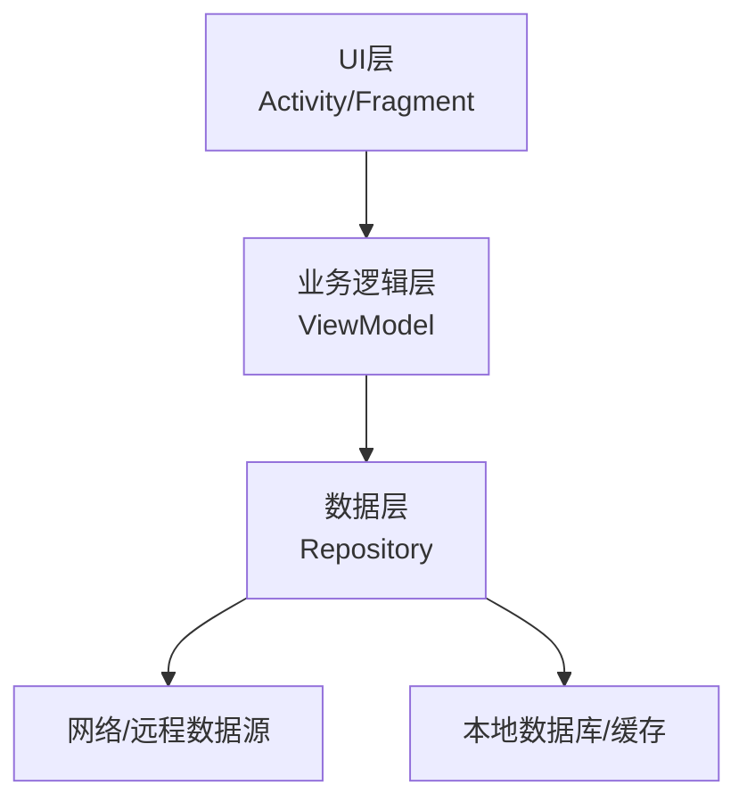
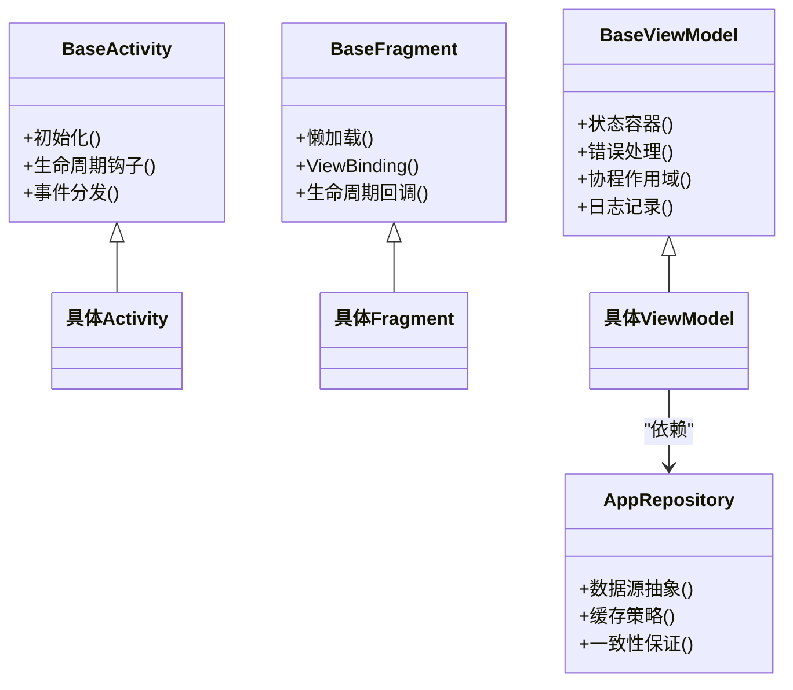
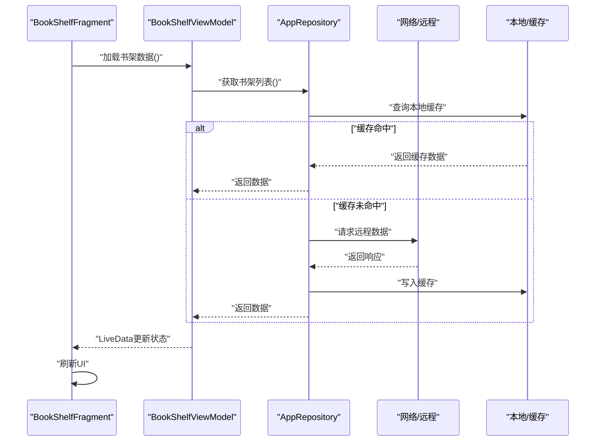
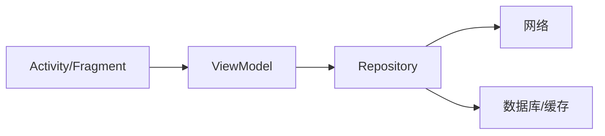

# MVVM架构模式

<cite>
**本文引用的文件**   
- [app/src/main/java/io/legado/app/base/BaseActivity.kt](file://app/src/main/java/io/legado/app/base/BaseActivity.kt)
- [app/src/main/java/io/legado/app/base/BaseFragment.kt](file://app/src/main/java/io/legado/app/base/BaseFragment.kt)
- [app/src/main/java/io/legado/app/base/BaseViewModel.kt](file://app/src/main/java/io/legado/app/base/BaseViewModel.kt)
- [app/src/main/java/io/legado/app/data/repository/AppRepository.kt](file://app/src/main/java/io/legado/app/data/repository/AppRepository.kt)
- [app/src/main/java/io/legado/app/ui/bookshelf/BookShelfViewModel.kt](file://app/src/main/java/io/legado/app/ui/bookshelf/BookShelfViewModel.kt)
- [app/src/main/java/io/legado/app/ui/bookshelf/BookShelfFragment.kt](file://app/src/main/java/io/legado/app/ui/bookshelf/BookShelfFragment.kt)
- [app/src/main/java/io/legado/app/utils/LogUtils.kt](file://app/src/main/java/io/legado/app/utils/LogUtils.kt)
- [app/src/main/java/io/legado/app/exception/AppException.kt](file://app/src/main/java/io/legado/app/exception/AppException.kt)
</cite>

## 目录
1. [简介](#简介)
2. [项目结构](#项目结构)
3. [核心组件](#核心组件)
4. [架构总览](#架构总览)
5. [详细组件分析](#详细组件分析)
6. [依赖关系分析](#依赖关系分析)
7. [性能考量](#性能考量)
8. [故障排查指南](#故障排查指南)
9. [结论](#结论)
10. [附录](#附录)

## 简介
本文件围绕MVVM架构模式，系统化梳理Legado项目中BaseActivity、BaseFragment、BaseViewModel等基础类的设计与继承关系，解释数据绑定机制（LiveData）、状态管理与UI更新策略，阐述ViewModel生命周期管理、内存泄漏防护与配置变更处理，说明Repository模式在数据层的应用（数据源抽象与缓存策略），并提供实现新MVVM组件的最佳实践、错误处理、日志记录与调试技巧。

## 项目结构
本项目采用分层架构：
- 表现层（UI）：Activity/Fragment负责视图渲染与用户交互
- 业务逻辑层（ViewModel）：持有UI相关状态，协调数据获取与业务规则
- 数据层（Repository + DAO/网络）：统一数据访问入口，屏蔽多数据源细节

图表来源
- [app/src/main/java/io/legado/app/base/BaseActivity.kt](file://app/src/main/java/io/legado/app/base/BaseActivity.kt)
- [app/src/main/java/io/legado/app/base/BaseFragment.kt](file://app/src/main/java/io/legado/app/base/BaseFragment.kt)
- [app/src/main/java/io/legado/app/base/BaseViewModel.kt](file://app/src/main/java/io/legado/app/base/BaseViewModel.kt)
- [app/src/main/java/io/legado/app/data/repository/AppRepository.kt](file://app/src/main/java/io/legado/app/data/repository/AppRepository.kt)

章节来源
- [app/src/main/java/io/legado/app/base/BaseActivity.kt](file://app/src/main/java/io/legado/app/base/BaseActivity.kt)
- [app/src/main/java/io/legado/app/base/BaseFragment.kt](file://app/src/main/java/io/legado/app/base/BaseFragment.kt)
- [app/src/main/java/io/legado/app/base/BaseViewModel.kt](file://app/src/main/java/io/legado/app/base/BaseViewModel.kt)
- [app/src/main/java/io/legado/app/data/repository/AppRepository.kt](file://app/src/main/java/io/legado/app/data/repository/AppRepository.kt)

## 核心组件
- BaseActivity：封装页面通用初始化、权限、主题、事件分发、生命周期钩子等，降低重复代码。
- BaseFragment：封装Fragment通用逻辑，如懒加载、ViewBinding、生命周期回调的统一处理。
- BaseViewModel：提供统一的ViewModel基类，包含状态容器、错误处理、协程作用域、日志与异常捕获。
- Repository：数据访问抽象，聚合网络与本地数据源，提供缓存与一致性策略。

章节来源
- [app/src/main/java/io/legado/app/base/BaseActivity.kt](file://app/src/main/java/io/legado/app/base/BaseActivity.kt)
- [app/src/main/java/io/legado/app/base/BaseFragment.kt](file://app/src/main/java/io/legado/app/base/BaseFragment.kt)
- [app/src/main/java/io/legado/app/base/BaseViewModel.kt](file://app/src/main/java/io/legado/app/base/BaseViewModel.kt)
- [app/src/main/java/io/legado/app/data/repository/AppRepository.kt](file://app/src/main/java/io/legado/app/data/repository/AppRepository.kt)

## 架构总览
MVVM通过清晰的职责划分提升可测试性与可维护性：
- UI仅订阅状态并渲染
- ViewModel集中管理状态与业务逻辑
- Repository统一数据访问，屏蔽底层差异

图表来源
- [app/src/main/java/io/legado/app/base/BaseActivity.kt](file://app/src/main/java/io/legado/app/base/BaseActivity.kt)
- [app/src/main/java/io/legado/app/base/BaseFragment.kt](file://app/src/main/java/io/legado/app/base/BaseFragment.kt)
- [app/src/main/java/io/legado/app/base/BaseViewModel.kt](file://app/src/main/java/io/legado/app/base/BaseViewModel.kt)
- [app/src/main/java/io/legado/app/data/repository/AppRepository.kt](file://app/src/main/java/io/legado/app/data/repository/AppRepository.kt)

## 详细组件分析

### BaseActivity与BaseFragment：UI基类设计
- 职责：统一初始化流程、权限申请、主题设置、生命周期钩子、事件拦截、View绑定等
- 设计要点：
  - 将跨页面共性逻辑下沉到基类，减少样板代码
  - 提供扩展点供子类覆盖，保持开闭原则
  - 避免持有重型对象引用，防止内存泄漏

章节来源
- [app/src/main/java/io/legado/app/base/BaseActivity.kt](file://app/src/main/java/io/legado/app/base/BaseActivity.kt)
- [app/src/main/java/io/legado/app/base/BaseFragment.kt](file://app/src/main/java/io/legado/app/base/BaseFragment.kt)

### BaseViewModel：状态与业务编排
- 职责：持有UI状态、执行业务逻辑、协调数据层、暴露LiveData给UI
- 关键点：
  - 使用LiveData或StateFlow作为状态载体，确保线程安全与生命周期感知
  - 统一错误处理与日志记录，便于问题定位
  - 使用协程作用域管理异步任务，避免泄露

章节来源
- [app/src/main/java/io/legado/app/base/BaseViewModel.kt](file://app/src/main/java/io/legado/app/base/BaseViewModel.kt)

### Repository模式：数据层抽象与缓存
- 职责：统一数据访问入口，屏蔽网络与本地差异，提供缓存与一致性策略
- 关键点：
  - 定义清晰接口，支持多数据源切换
  - 合理缓存策略（内存/磁盘）与失效策略
  - 错误分类与重试机制

章节来源
- [app/src/main/java/io/legado/app/data/repository/AppRepository.kt](file://app/src/main/java/io/legado/app/data/repository/AppRepository.kt)

### BookShelf示例：MVVM协作流程
以下序列图展示书架页面的典型调用链：Fragment发起请求，ViewModel编排业务，Repository拉取数据，最终LiveData驱动UI更新。

图表来源
- [app/src/main/java/io/legado/app/ui/bookshelf/BookShelfFragment.kt](file://app/src/main/java/io/legado/app/ui/bookshelf/BookShelfFragment.kt)
- [app/src/main/java/io/legado/app/ui/bookshelf/BookShelfViewModel.kt](file://app/src/main/java/io/legado/app/ui/bookshelf/BookShelfViewModel.kt)
- [app/src/main/java/io/legado/app/data/repository/AppRepository.kt](file://app/src/main/java/io/legado/app/data/repository/AppRepository.kt)

章节来源
- [app/src/main/java/io/legado/app/ui/bookshelf/BookShelfFragment.kt](file://app/src/main/java/io/legado/app/ui/bookshelf/BookShelfFragment.kt)
- [app/src/main/java/io/legado/app/ui/bookshelf/BookShelfViewModel.kt](file://app/src/main/java/io/legado/app/ui/bookshelf/BookShelfViewModel.kt)
- [app/src/main/java/io/legado/app/data/repository/AppRepository.kt](file://app/src/main/java/io/legado/app/data/repository/AppRepository.kt)

### LiveData数据绑定与UI更新策略
- 使用LiveData观察状态变化，自动在生命周期活跃时更新UI
- 推荐策略：
  - 单一状态源，避免多处修改导致竞态
  - 使用不可变数据结构，配合map/switchMap进行派生状态计算
  - 避免在UI层直接修改状态，所有变更应经ViewModel

章节来源
- [app/src/main/java/io/legado/app/ui/bookshelf/BookShelfViewModel.kt](file://app/src/main/java/io/legado/app/ui/bookshelf/BookShelfViewModel.kt)
- [app/src/main/java/io/legado/app/ui/bookshelf/BookShelfFragment.kt](file://app/src/main/java/io/legado/app/ui/bookshelf/BookShelfFragment.kt)

### ViewModel生命周期与配置变更处理
- 生命周期：
  - ViewModel在配置变更（如旋转屏幕）后存活，避免重复请求
  - Fragment/Activity销毁时ViewModel仍保留，直到所有者进程结束
- 最佳实践：
  - 不在ViewModel中持有Context或View引用
  - 使用SavedStateHandle持久化关键状态
  - 使用协程作用域管理任务，避免泄露

章节来源
- [app/src/main/java/io/legado/app/base/BaseViewModel.kt](file://app/src/main/java/io/legado/app/base/BaseViewModel.kt)

### 内存泄漏防护
- 常见风险：
  - 长生命周期对象持有短生命周期引用（如静态变量、单例持Context）
  - 观察者未正确移除
- 防护措施：
  - 使用弱引用或生命周期感知观察者
  - 在onDestroy/onCleared中清理资源
  - 避免在后台任务中引用UI组件

章节来源
- [app/src/main/java/io/legado/app/base/BaseActivity.kt](file://app/src/main/java/io/legado/app/base/BaseActivity.kt)
- [app/src/main/java/io/legado/app/base/BaseFragment.kt](file://app/src/main/java/io/legado/app/base/BaseFragment.kt)
- [app/src/main/java/io/legado/app/base/BaseViewModel.kt](file://app/src/main/java/io/legado/app/base/BaseViewModel.kt)

### Repository缓存策略
- 缓存层级：
  - 内存缓存：快速读取，适合热点数据
  - 磁盘缓存：持久化，断网可用
- 失效策略：
  - TTL过期
  - 主动失效（如用户操作触发）
  - 版本控制（Schema升级）

章节来源
- [app/src/main/java/io/legado/app/data/repository/AppRepository.kt](file://app/src/main/java/io/legado/app/data/repository/AppRepository.kt)

## 依赖关系分析
- 低耦合高内聚：
  - UI不直接依赖数据源，通过Repository解耦
  - ViewModel仅依赖Repository接口，便于替换实现
- 潜在循环依赖：
  - 避免ViewModel反向依赖UI
  - Repository不应依赖具体UI组件

图表来源
- [app/src/main/java/io/legado/app/base/BaseActivity.kt](file://app/src/main/java/io/legado/app/base/BaseActivity.kt)
- [app/src/main/java/io/legado/app/base/BaseFragment.kt](file://app/src/main/java/io/legado/app/base/BaseFragment.kt)
- [app/src/main/java/io/legado/app/base/BaseViewModel.kt](file://app/src/main/java/io/legado/app/base/BaseViewModel.kt)
- [app/src/main/java/io/legado/app/data/repository/AppRepository.kt](file://app/src/main/java/io/legado/app/data/repository/AppRepository.kt)

章节来源
- [app/src/main/java/io/legado/app/base/BaseActivity.kt](file://app/src/main/java/io/legado/app/base/BaseActivity.kt)
- [app/src/main/java/io/legado/app/base/BaseFragment.kt](file://app/src/main/java/io/legado/app/base/BaseFragment.kt)
- [app/src/main/java/io/legado/app/base/BaseViewModel.kt](file://app/src/main/java/io/legado/app/base/BaseViewModel.kt)
- [app/src/main/java/io/legado/app/data/repository/AppRepository.kt](file://app/src/main/java/io/legado/app/data/repository/AppRepository.kt)

## 性能考量
- 减少不必要的UI更新：合并状态变更，使用diff算法
- 懒加载与分页：按需加载数据，避免一次性加载大量内容
- 缓存命中率优化：合理设置TTL与缓存键
- 协程调度：使用IO线程执行I/O，主线程更新UI

## 故障排查指南
- 日志记录：
  - 统一日志工具，分级输出（DEBUG/INFO/WARN/ERROR）
  - 关键路径埋点，便于追踪问题
- 错误处理：
  - 定义统一异常类型，区分网络、数据、业务异常
  - 用户友好提示，避免崩溃
- 调试技巧：
  - 使用LeakCanary检测内存泄漏
  - 使用Network Profiler分析网络请求
  - 使用CPU/Memory Profiler定位性能瓶颈

章节来源
- [app/src/main/java/io/legado/app/utils/LogUtils.kt](file://app/src/main/java/io/legado/app/utils/LogUtils.kt)
- [app/src/main/java/io/legado/app/exception/AppException.kt](file://app/src/main/java/io/legado/app/exception/AppException.kt)

## 结论
通过BaseActivity、BaseFragment、BaseViewModel与Repository的协同，Legado实现了清晰的MVVM架构。该模式提升了代码可维护性、可测试性与用户体验。遵循本文最佳实践，可有效避免常见问题，构建稳定高效的Android应用。

## 附录
- 实现新MVVM组件步骤：
  1. 创建Fragment继承BaseFragment
  2. 创建ViewModel继承BaseViewModel
  3. 定义Repository接口与实现
  4. 在Fragment中观察LiveData并更新UI
  5. 添加日志与错误处理
- 参考示例：
  - [BookShelfFragment](file://app/src/main/java/io/legado/app/ui/bookshelf/BookShelfFragment.kt)
  - [BookShelfViewModel](file://app/src/main/java/io/legado/app/ui/bookshelf/BookShelfViewModel.kt)
  - [AppRepository](file://app/src/main/java/io/legado/app/data/repository/AppRepository.kt)