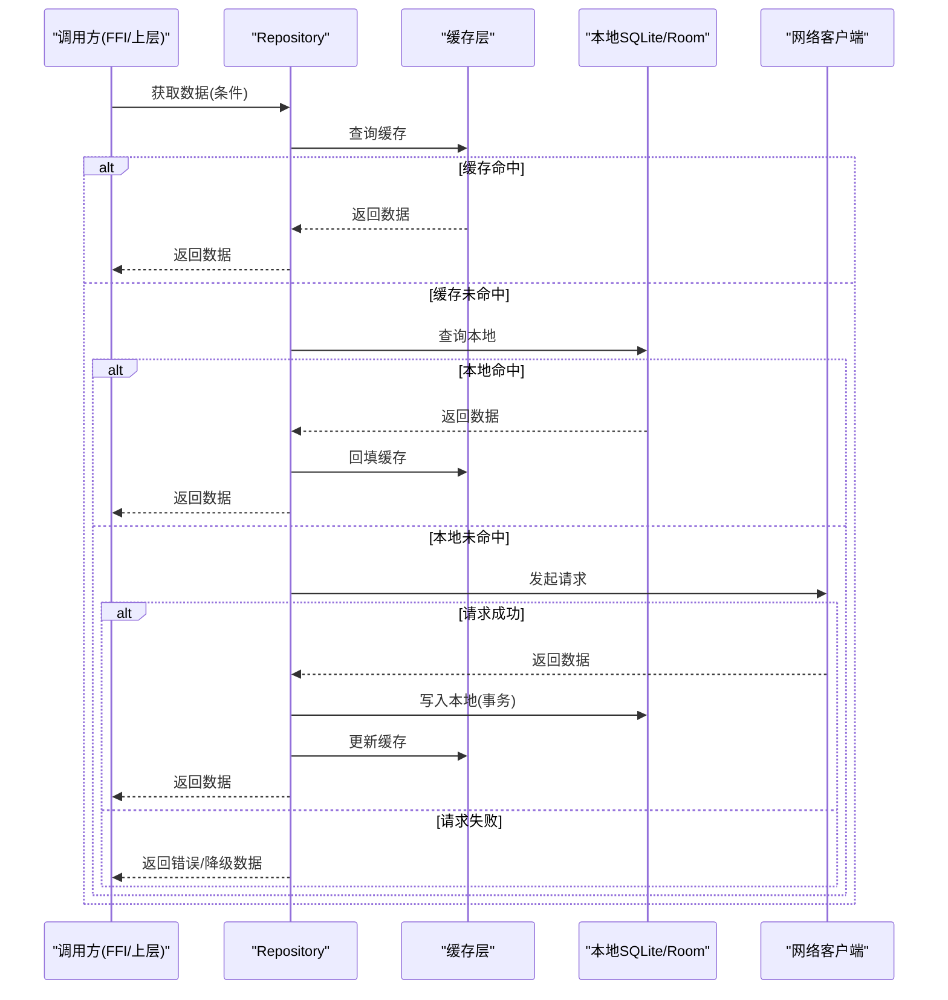
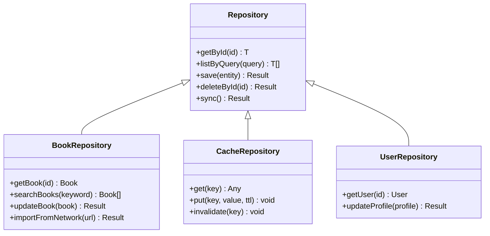
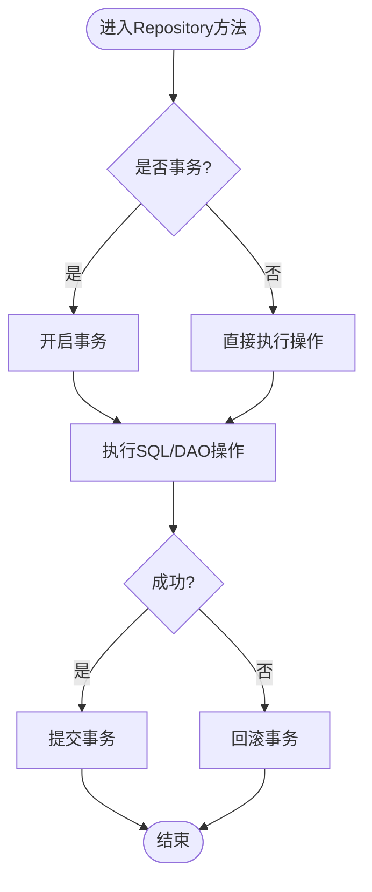
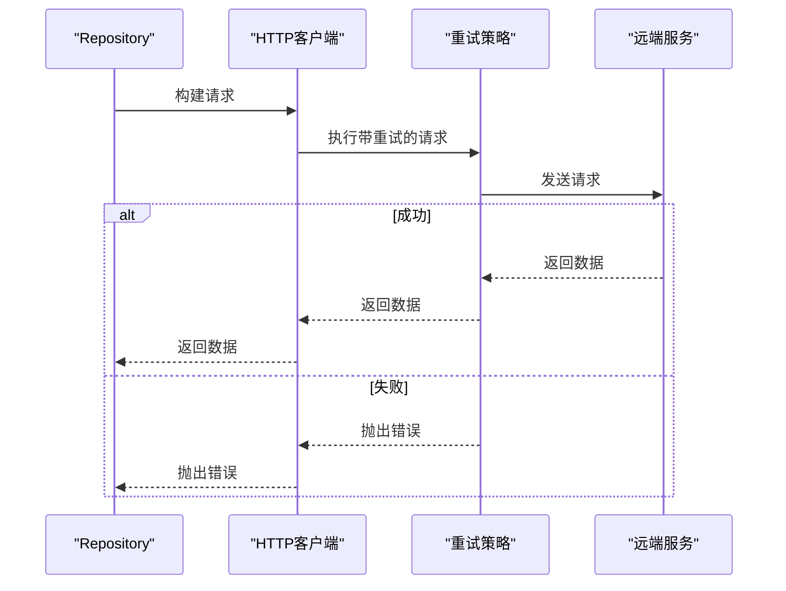
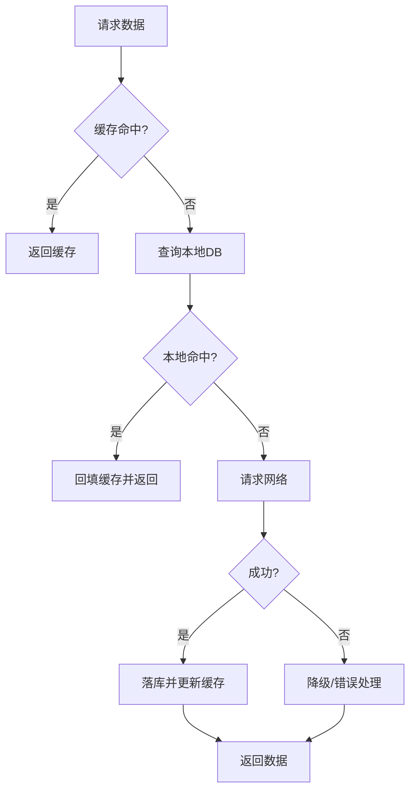
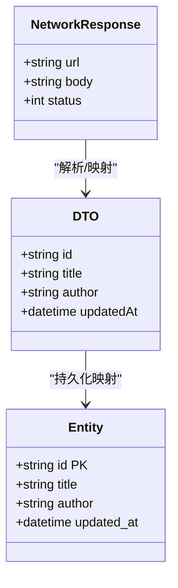
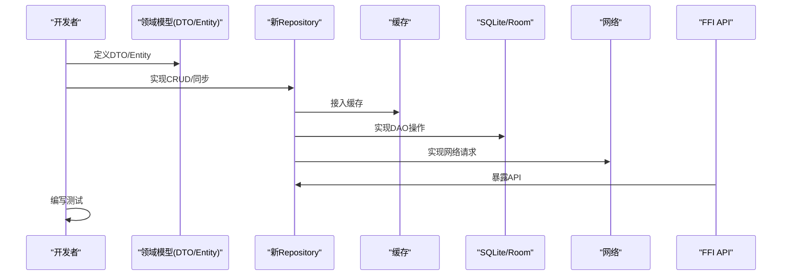
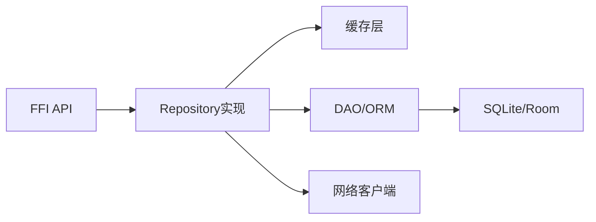

# Repository模式实现

<cite>
**本文档引用的文件**   
- [legado-db/src/lib.rs](file://rust/legado-db/src/lib.rs)
- [legado-db/src/connection.rs](file://rust/legado-db/src/connection.rs)
- [legado-db/src/migration.rs](file://rust/legado-db/src/migration.rs)
- [legado-db/src/repository/mod.rs](file://rust/legado-db/src/repository/mod.rs)
- [legado-db/src/repository/book_repository.rs](file://rust/legado-db/src/repository/book_repository.rs)
- [legado-db/src/repository/book_chapter_repository.rs](file://rust/legado-db/src/repository/book_chapter_repository.rs)
- [legado-db/src/repository/cache_repository.rs](file://rust/legado-db/src/repository/cache_repository.rs)
- [legado-db/src/repository/user_repository.rs](file://rust/legado-db/src/repository/user_repository.rs)
- [legado-db/src/schema.rs](file://rust/legado-db/src/schema.rs)
- [legado-db/src/default_data.rs](file://rust/legado-db/src/default_data.rs)
- [legado-db/src/import.rs](file://rust/legado-db/src/import.rs)
- [legado-core/src/models/mod.rs](file://rust/legado-core/src/models/mod.rs)
- [legado-core/src/models/book.rs](file://rust/legado-core/src/models/book.rs)
- [legado-core/src/models/book_chapter.rs](file://rust/legado-core/src/models/book_chapter.rs)
- [legado-ffi/src/api/bookshelf.rs](file://rust/legado-ffi/src/api/bookshelf.rs)
- [legado-ffi/src/api/cache_api.rs](file://rust/legado-ffi/src/api/cache_api.rs)
- [legado-net/src/client.rs](file://rust/legado-net/src/client.rs)
- [legado-net/src/retry.rs](file://rust/legado-net/src/retry.rs)
</cite>

## 目录
1. [简介](#简介)
2. [项目结构](#项目结构)
3. [核心组件](#核心组件)
4. [架构总览](#架构总览)
5. [详细组件分析](#详细组件分析)
6. [依赖关系分析](#依赖关系分析)
7. [性能考虑](#性能考虑)
8. [故障排查指南](#故障排查指南)
9. [结论](#结论)
10. [附录](#附录)

## 简介
本文件围绕Legado项目的Repository模式实现，系统性阐述数据访问层的抽象设计、多数据源管理、本地数据库（Room/Rust SQLite）与网络API的统一接口设计、缓存策略、数据同步与冲突解决机制、数据转换层与DTO模式应用，并给出新增Repository组件的实践步骤。同时覆盖事务处理、错误恢复与性能优化策略，帮助读者快速理解并扩展数据访问能力。

## 项目结构
本项目采用分层与模块化组织：
- Rust核心库 legad-core：领域模型与业务逻辑
- 数据库模块 legado-db：SQLite持久化、迁移、导入导出、Repository实现
- FFI桥接 legado-ffi：对外暴露给上层（Android/Kotlin或Flutter）的API
- 网络模块 legado-net：HTTP客户端、重试、代理、速率限制等
- Android应用 app：UI与集成层（含Room相关配置与迁移JSON）

```mermaid
graph TB
subgraph "应用层"
UI["Android/Flutter界面"]
end
subgraph "FFI桥接"
FFI["legado-ffi API"]
end
subgraph "数据访问层"
REPO["Repository(书籍/章节/缓存/用户等)"]
DAO["DAO/查询封装"]
end
subgraph "存储层"
DB["SQLite(Rust)"]
ROOM["Room(Android, 迁移JSON)"]
end
subgraph "网络层"
NET["legado-net HTTP客户端"]
RETRY["重试/限流/代理"]
end
UI --> FFI
FFI --> REPO
REPO --> DAO
DAO --> DB
REPO --> NET
NET --> RETRY
DB < --> ROOM
```

图表来源
- [legado-db/src/lib.rs](file://rust/legado-db/src/lib.rs)
- [legado-db/src/repository/mod.rs](file://rust/legado-db/src/repository/mod.rs)
- [legado-ffi/src/api/bookshelf.rs](file://rust/legado-ffi/src/api/bookshelf.rs)
- [legado-net/src/client.rs](file://rust/legado-net/src/client.rs)

章节来源
- [legado-db/src/lib.rs](file://rust/legado-db/src/lib.rs)
- [legado-db/src/repository/mod.rs](file://rust/legado-db/src/repository/mod.rs)
- [legado-ffi/src/api/bookshelf.rs](file://rust/legado-ffi/src/api/bookshelf.rs)
- [legado-net/src/client.rs](file://rust/legado-net/src/client.rs)

## 核心组件
- Repository抽象：统一对外的数据访问接口，屏蔽底层SQLite、Room与网络的差异
- 数据源管理：按实体域划分Repository，支持本地优先、网络回退的多数据源策略
- 数据转换层：将网络响应、数据库实体转换为领域DTO，保证上层一致性
- 缓存策略：内存+磁盘两级缓存，结合TTL与失效策略
- 同步与冲突：增量拉取、版本戳/时间戳比较、合并策略
- 事务与并发：读写分离、批量操作、锁粒度控制
- 错误恢复：重试、降级、兜底数据

章节来源
- [legado-db/src/repository/mod.rs](file://rust/legado-db/src/repository/mod.rs)
- [legado-db/src/repository/book_repository.rs](file://rust/legado-db/src/repository/book_repository.rs)
- [legado-db/src/repository/cache_repository.rs](file://rust/legado-db/src/repository/cache_repository.rs)
- [legado-core/src/models/mod.rs](file://rust/legado-core/src/models/mod.rs)

## 架构总览
Repository作为数据访问的统一门面，向上提供一致的API；向下协调SQLite、Room与网络资源。典型流程包括：
- 读取路径：先查缓存，未命中则查本地DB，再未命中则请求网络，成功后落库并更新缓存
- 写入路径：先写本地DB（事务），必要时触发异步同步到远端
- 同步路径：基于增量标记或版本号进行差异合并，冲突时按策略解决



图表来源
- [legado-db/src/repository/book_repository.rs](file://rust/legado-db/src/repository/book_repository.rs)
- [legado-db/src/repository/cache_repository.rs](file://rust/legado-db/src/repository/cache_repository.rs)
- [legado-net/src/client.rs](file://rust/legado-net/src/client.rs)
- [legado-net/src/retry.rs](file://rust/legado-net/src/retry.rs)

## 详细组件分析

### Repository抽象与多数据源管理
- 抽象接口：定义统一的CRUD、分页、搜索、批量操作等方法
- 数据源选择：根据配置与上下文决定使用本地还是网络，支持“本地优先”和“强制刷新”
- 多源聚合：同一实体的不同来源（如多个书源）通过ID映射与去重策略聚合



图表来源
- [legado-db/src/repository/mod.rs](file://rust/legado-db/src/repository/mod.rs)
- [legado-db/src/repository/book_repository.rs](file://rust/legado-db/src/repository/book_repository.rs)
- [legado-db/src/repository/cache_repository.rs](file://rust/legado-db/src/repository/cache_repository.rs)
- [legado-db/src/repository/user_repository.rs](file://rust/legado-db/src/repository/user_repository.rs)

章节来源
- [legado-db/src/repository/mod.rs](file://rust/legado-db/src/repository/mod.rs)
- [legado-db/src/repository/book_repository.rs](file://rust/legado-db/src/repository/book_repository.rs)
- [legado-db/src/repository/cache_repository.rs](file://rust/legado-db/src/repository/cache_repository.rs)
- [legado-db/src/repository/user_repository.rs](file://rust/legado-db/src/repository/user_repository.rs)

### 本地数据库（Room/Rust SQLite）与DAO
- 数据库连接：单例连接池，读写分离，事务边界清晰
- 迁移与导入：版本化迁移脚本、默认数据初始化、批量导入
- Schema与实体：强类型约束，索引优化查询路径



图表来源
- [legado-db/src/connection.rs](file://rust/legado-db/src/connection.rs)
- [legado-db/src/migration.rs](file://rust/legado-db/src/migration.rs)
- [legado-db/src/schema.rs](file://rust/legado-db/src/schema.rs)
- [legado-db/src/default_data.rs](file://rust/legado-db/src/default_data.rs)
- [legado-db/src/import.rs](file://rust/legado-db/src/import.rs)

章节来源
- [legado-db/src/connection.rs](file://rust/legado-db/src/connection.rs)
- [legado-db/src/migration.rs](file://rust/legado-db/src/migration.rs)
- [legado-db/src/schema.rs](file://rust/legado-db/src/schema.rs)
- [legado-db/src/default_data.rs](file://rust/legado-db/src/default_data.rs)
- [legado-db/src/import.rs](file://rust/legado-db/src/import.rs)

### 网络API与统一接口
- 客户端封装：统一请求头、鉴权、压缩、代理、超时
- 重试与退避：指数退避、抖动、熔断阈值
- 错误分类：网络异常、业务错误、超时、权限不足等



图表来源
- [legado-net/src/client.rs](file://rust/legado-net/src/client.rs)
- [legado-net/src/retry.rs](file://rust/legado-net/src/retry.rs)

章节来源
- [legado-net/src/client.rs](file://rust/legado-net/src/client.rs)
- [legado-net/src/retry.rs](file://rust/legado-net/src/retry.rs)

### 缓存策略、数据同步与冲突解决
- 缓存层级：内存缓存（短TTL）、磁盘缓存（长TTL）
- 失效策略：按Key、按Tag、按时间窗口
- 同步策略：增量拉取、全量替换、合并字段级差异
- 冲突解决：以服务端为准、时间戳最新、字段级合并



图表来源
- [legado-db/src/repository/cache_repository.rs](file://rust/legado-db/src/repository/cache_repository.rs)
- [legado-db/src/repository/book_repository.rs](file://rust/legado-db/src/repository/book_repository.rs)

章节来源
- [legado-db/src/repository/cache_repository.rs](file://rust/legado-db/src/repository/cache_repository.rs)
- [legado-db/src/repository/book_repository.rs](file://rust/legado-db/src/repository/book_repository.rs)

### 数据转换层与DTO模式
- DTO定义：面向上层的稳定数据结构
- 转换规则：网络响应→DTO、DTO→数据库实体、双向映射
- 校验与清洗：字段校验、空值处理、编码统一



图表来源
- [legado-core/src/models/book.rs](file://rust/legado-core/src/models/book.rs)
- [legado-core/src/models/book_chapter.rs](file://rust/legado-core/src/models/book_chapter.rs)
- [legado-core/src/models/mod.rs](file://rust/legado-core/src/models/mod.rs)

章节来源
- [legado-core/src/models/book.rs](file://rust/legado-core/src/models/book.rs)
- [legado-core/src/models/book_chapter.rs](file://rust/legado-core/src/models/book_chapter.rs)
- [legado-core/src/models/mod.rs](file://rust/legado-core/src/models/mod.rs)

### 新增Repository组件实践
步骤概览：
- 定义领域DTO与数据库实体
- 创建Repository接口与实现类
- 实现缓存层适配（可选）
- 实现网络拉取与本地落库
- 在FFI层暴露API供上层调用
- 编写单元测试与集成测试



图表来源
- [legado-db/src/repository/mod.rs](file://rust/legado-db/src/repository/mod.rs)
- [legado-ffi/src/api/bookshelf.rs](file://rust/legado-ffi/src/api/bookshelf.rs)
- [legado-db/src/repository/cache_repository.rs](file://rust/legado-db/src/repository/cache_repository.rs)

章节来源
- [legado-db/src/repository/mod.rs](file://rust/legado-db/src/repository/mod.rs)
- [legado-ffi/src/api/bookshelf.rs](file://rust/legado-ffi/src/api/bookshelf.rs)
- [legado-db/src/repository/cache_repository.rs](file://rust/legado-db/src/repository/cache_repository.rs)

## 依赖关系分析
- Repository对DAO/ORM的依赖：通过DAO封装SQL，避免Repository直接耦合SQL
- Repository对网络的依赖：通过HTTP客户端抽象，便于替换与测试
- FFI对上层的依赖：稳定的API契约，屏蔽内部实现变化
- 模块间解耦：通过接口与DTO减少循环依赖



图表来源
- [legado-ffi/src/api/bookshelf.rs](file://rust/legado-ffi/src/api/bookshelf.rs)
- [legado-db/src/repository/mod.rs](file://rust/legado-db/src/repository/mod.rs)
- [legado-net/src/client.rs](file://rust/legado-net/src/client.rs)

章节来源
- [legado-ffi/src/api/bookshelf.rs](file://rust/legado-ffi/src/api/bookshelf.rs)
- [legado-db/src/repository/mod.rs](file://rust/legado-db/src/repository/mod.rs)
- [legado-net/src/client.rs](file://rust/legado-net/src/client.rs)

## 性能考虑
- 查询优化：合理索引、分页游标、只取必要字段
- 批量操作：批量插入/更新，减少事务开销
- 缓存命中率：热点数据常驻内存，冷数据下沉磁盘
- 网络优化：连接复用、压缩、并行请求、超时控制
- 线程模型：读写分离、协程/线程池隔离IO密集型任务

[本节为通用指导，不直接分析具体文件]

## 故障排查指南
- 常见错误分类：网络超时、鉴权失败、数据不一致、事务冲突
- 日志与追踪：关键路径埋点、错误码标准化、堆栈信息收集
- 恢复策略：重试退避、降级返回、离线可用、数据修复脚本
- 调试工具：慢查询分析、缓存命中率统计、网络抓包

章节来源
- [legado-net/src/retry.rs](file://rust/legado-net/src/retry.rs)
- [legado-db/src/connection.rs](file://rust/legado-db/src/connection.rs)
- [legado-db/src/migration.rs](file://rust/legado-db/src/migration.rs)

## 结论
Repository模式在本项目中实现了数据访问的统一抽象与多数据源管理，结合缓存、同步与冲突解决机制，提供了稳定高效的数据服务能力。通过清晰的层次划分与DTO转换，既保证了上层接口的稳定性，又提升了可测试性与可维护性。建议在新功能开发中遵循此模式，持续优化查询与缓存策略，完善错误恢复与监控体系。

[本节为总结性内容，不直接分析具体文件]

## 附录
- 术语表：Repository、DTO、DAO、TTL、FFI、Room、SQLite
- 参考实现路径：
  - 书籍仓库：[book_repository.rs](file://rust/legado-db/src/repository/book_repository.rs)
  - 章节仓库：[book_chapter_repository.rs](file://rust/legado-db/src/repository/book_chapter_repository.rs)
  - 缓存仓库：[cache_repository.rs](file://rust/legado-db/src/repository/cache_repository.rs)
  - 用户仓库：[user_repository.rs](file://rust/legado-db/src/repository/user_repository.rs)
  - FFI接口：[bookshelf.rs](file://rust/legado-ffi/src/api/bookshelf.rs)、[cache_api.rs](file://rust/legado-ffi/src/api/cache_api.rs)
  - 网络客户端：[client.rs](file://rust/legado-net/src/client.rs)、[retry.rs](file://rust/legado-net/src/retry.rs)

[本节为参考资料，不直接分析具体文件]