# ViewModel生命周期管理

<cite>
**本文引用的文件**   
- [app/src/main/java/io/legado/app/base/BaseActivity.kt](file://app/src/main/java/io/legado/app/base/BaseActivity.kt)
- [app/src/main/java/io/legado/app/base/BaseFragment.kt](file://app/src/main/java/io/legado/app/base/BaseFragment.kt)
- [app/src/main/java/io/legado/app/ui/book/reader/ReaderActivity.kt](file://app/src/main/java/io/legado/app/ui/book/reader/ReaderActivity.kt)
- [app/src/main/java/io/legado/app/ui/book/reader/ReaderViewModel.kt](file://app/src/main/java/io/legado/app/ui/book/reader/ReaderViewModel.kt)
- [app/src/main/java/io/legado/app/ui/bookshelf/BookshelfViewModel.kt](file://app/src/main/java/io/legado/app/ui/bookshelf/BookshelfViewModel.kt)
- [app/src/main/java/io/legado/app/ui/login/LoginViewModel.kt](file://app/src/main/java/io/legado/app/ui/login/LoginViewModel.kt)
- [app/src/main/java/io/legado/app/utils/CoroutineExtensions.kt](file://app/src/main/java/io/legado/app/utils/CoroutineExtensions.kt)
- [app/src/main/java/io/legado/app/utils/LogUtils.kt](file://app/src/main/java/io/legado/app/utils/LogUtils.kt)
- [app/src/main/java/io/legado/app/exception/AppException.kt](file://app/src/main/java/io/legado/app/exception/AppException.kt)
</cite>

## 目录
1. [简介](#简介)
2. [项目结构](#项目结构)
3. [核心组件](#核心组件)
4. [架构总览](#架构总览)
5. [详细组件分析](#详细组件分析)
6. [依赖关系分析](#依赖关系分析)
7. [性能考量](#性能考量)
8. [故障排查指南](#故障排查指南)
9. [结论](#结论)
10. [附录](#附录)

## 简介
本文件聚焦于Legado项目中ViewModel的生命周期管理与最佳实践，围绕BaseViewModel设计模式、与UI组件（Activity/Fragment）的生命周期联动、配置变更处理与内存泄漏防护、协程管理与异步任务调度、状态管理策略（LiveData/StateFlow/事件总线）、错误处理与日志调试等方面展开。文档以代码级分析与图示为主，帮助读者快速掌握如何在实际工程中构建健壮、可维护的ViewModel组件。

## 项目结构
本项目采用Android模块化组织方式，UI层通过Activity/Fragment承载界面，ViewModel负责业务状态与异步逻辑，工具类提供协程扩展与日志能力，异常模块统一错误类型。与ViewModel生命周期相关的核心位置包括：
- base包：为Activity/Fragment提供统一基类，便于集中处理生命周期相关行为
- ui包：各功能页面的ViewModel实现，展示不同场景下的状态管理与协程使用
- utils包：协程扩展与日志工具，支撑异步任务与调试
- exception包：统一的异常定义，便于错误分类与处理

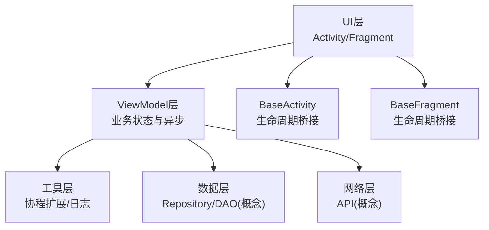

[本图为概念性结构图，不直接映射具体源码文件]

## 核心组件
- BaseViewModel：作为所有业务ViewModel的基类，封装通用能力，如协程作用域管理、取消语义、统一错误处理、日志记录等。
- LiveData与StateFlow：用于状态暴露与响应式更新；LiveData适合UI绑定，StateFlow适合跨层或后台流式数据。
- 协程扩展：提供生命周期安全的启动方式（如withLifecycleScope/coroutineScope），确保在合适的时机启动与取消任务。
- 错误与日志：统一异常类型与日志输出，便于定位问题与统计错误。

**章节来源**
- [app/src/main/java/io/legado/app/base/BaseActivity.kt](file://app/src/main/java/io/legado/app/base/BaseActivity.kt)
- [app/src/main/java/io/legado/app/base/BaseFragment.kt](file://app/src/main/java/io/legado/app/base/BaseFragment.kt)
- [app/src/main/java/io/legado/app/utils/CoroutineExtensions.kt](file://app/src/main/java/io/legado/app/utils/CoroutineExtensions.kt)
- [app/src/main/java/io/legado/app/utils/LogUtils.kt](file://app/src/main/java/io/legado/app/utils/LogUtils.kt)
- [app/src/main/java/io/legado/app/exception/AppException.kt](file://app/src/main/java/io/legado/app/exception/AppException.kt)

## 架构总览
下图展示了UI层、ViewModel层与工具层的交互关系，以及生命周期关键节点对协程与状态更新的影响。

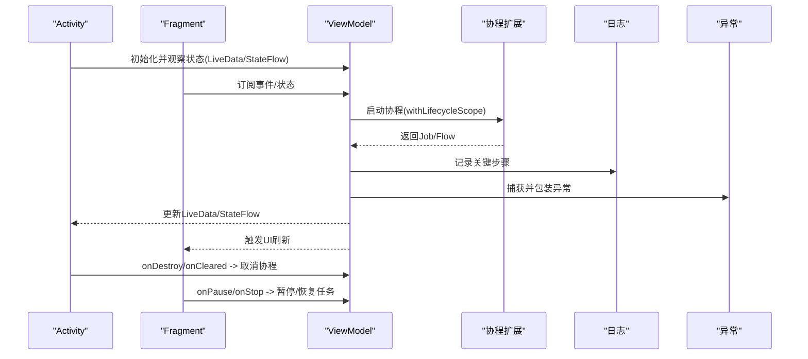

**图表来源**
- [app/src/main/java/io/legado/app/base/BaseActivity.kt](file://app/src/main/java/io/legado/app/base/BaseActivity.kt)
- [app/src/main/java/io/legado/app/base/BaseFragment.kt](file://app/src/main/java/io/legado/app/base/BaseFragment.kt)
- [app/src/main/java/io/legado/app/utils/CoroutineExtensions.kt](file://app/src/main/java/io/legado/app/utils/CoroutineExtensions.kt)
- [app/src/main/java/io/legado/app/utils/LogUtils.kt](file://app/src/main/java/io/legado/app/utils/LogUtils.kt)
- [app/src/main/java/io/legado/app/exception/AppException.kt](file://app/src/main/java/io/legado/app/exception/AppException.kt)

## 详细组件分析

### BaseViewModel设计模式与核心功能
- 职责边界：封装通用的协程作用域、取消语义、错误处理、日志记录；业务ViewModel继承后专注领域逻辑。
- 生命周期安全：基于UI生命周期提供的协程作用域，避免在销毁后继续执行导致内存泄漏。
- 状态暴露：推荐使用LiveData进行UI绑定，或使用StateFlow进行跨层/后台流式数据传递。
- 资源清理：在onCleared中释放长期运行的任务、关闭IO句柄、取消未完成的请求。

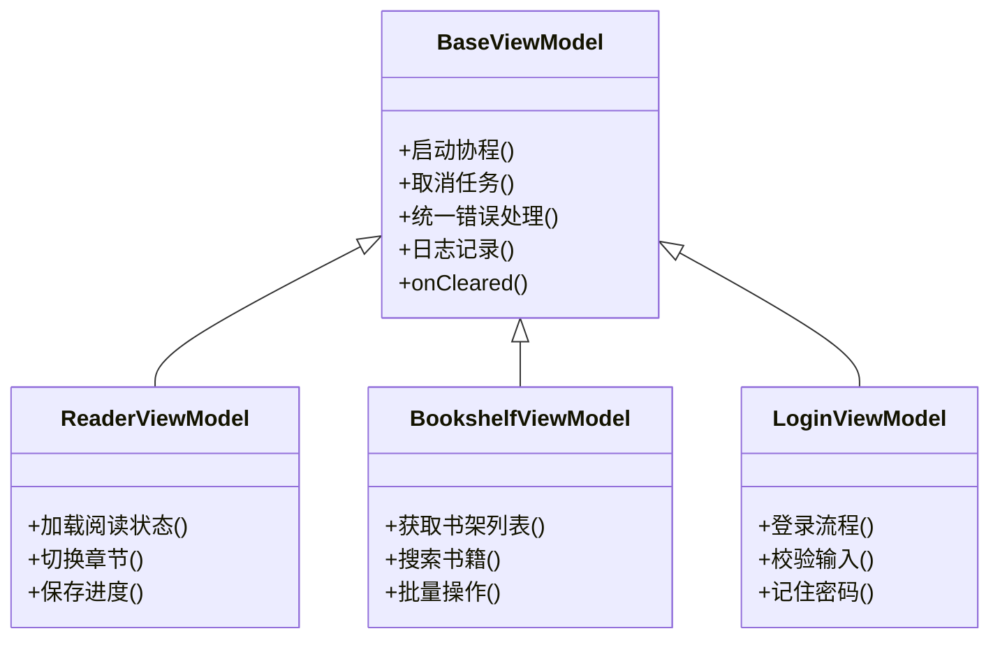

**图表来源**
- [app/src/main/java/io/legado/app/ui/book/reader/ReaderViewModel.kt](file://app/src/main/java/io/legado/app/ui/book/reader/ReaderViewModel.kt)
- [app/src/main/java/io/legado/app/ui/bookshelf/BookshelfViewModel.kt](file://app/src/main/java/io/legado/app/ui/bookshelf/BookshelfViewModel.kt)
- [app/src/main/java/io/legado/app/ui/login/LoginViewModel.kt](file://app/src/main/java/io/legado/app/ui/login/LoginViewModel.kt)

**章节来源**
- [app/src/main/java/io/legado/app/ui/book/reader/ReaderViewModel.kt](file://app/src/main/java/io/legado/app/ui/book/reader/ReaderViewModel.kt)
- [app/src/main/java/io/legado/app/ui/bookshelf/BookshelfViewModel.kt](file://app/src/main/java/io/legado/app/ui/bookshelf/BookshelfViewModel.kt)
- [app/src/main/java/io/legado/app/ui/login/LoginViewModel.kt](file://app/src/main/java/io/legado/app/ui/login/LoginViewModel.kt)

### ViewModel与UI组件的生命周期关系
- Activity/Fragment创建时初始化ViewModel，并在销毁前调用onCleared，确保协程被取消、资源释放。
- 配置变更（如屏幕旋转）时，系统会重建UI，但ViewModel不会重建，从而保持状态一致。
- BaseActivity/BaseFragment可在合适生命周期回调中协调ViewModel的状态同步与任务暂停/恢复。

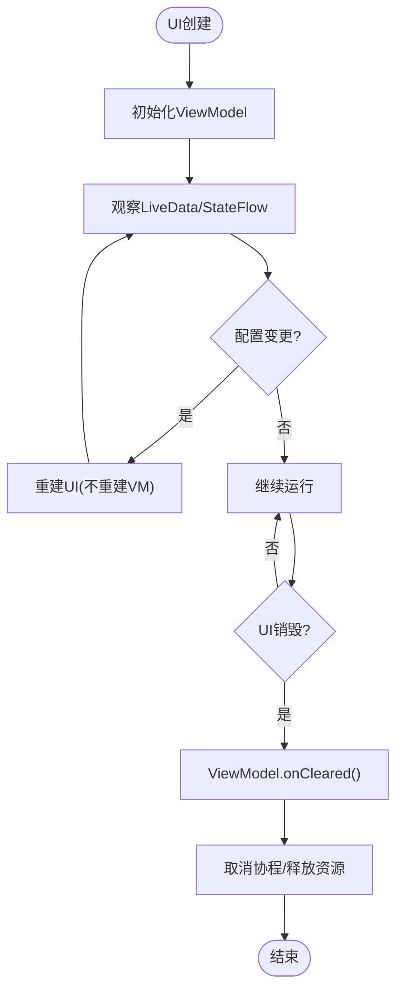

**图表来源**
- [app/src/main/java/io/legado/app/base/BaseActivity.kt](file://app/src/main/java/io/legado/app/base/BaseActivity.kt)
- [app/src/main/java/io/legado/app/base/BaseFragment.kt](file://app/src/main/java/io/legado/app/base/BaseFragment.kt)

**章节来源**
- [app/src/main/java/io/legado/app/base/BaseActivity.kt](file://app/src/main/java/io/legado/app/base/BaseActivity.kt)
- [app/src/main/java/io/legado/app/base/BaseFragment.kt](file://app/src/main/java/io/legado/app/base/BaseFragment.kt)

### 协程管理与异步任务调度
- 生命周期安全的协程启动：优先使用withLifecycleScope或viewModelScope，确保在UI可见期间执行，并在销毁时自动取消。
- 任务取消与资源清理：在onCleared中显式取消长时间运行的任务，避免内存泄漏；对于IO或网络请求，需检查取消标志并及时退出。
- Flow的使用：将异步结果转换为Flow，结合map/filter等操作符进行数据处理，提升可读性与组合性。

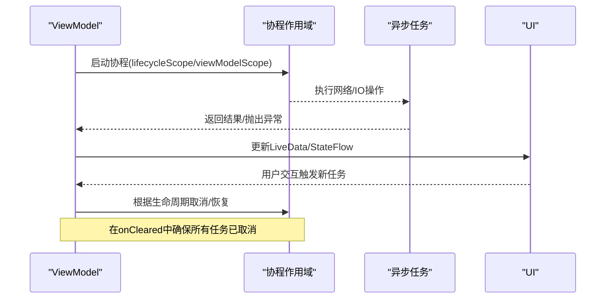

**图表来源**
- [app/src/main/java/io/legado/app/utils/CoroutineExtensions.kt](file://app/src/main/java/io/legado/app/utils/CoroutineExtensions.kt)

**章节来源**
- [app/src/main/java/io/legado/app/utils/CoroutineExtensions.kt](file://app/src/main/java/io/legado/app/utils/CoroutineExtensions.kt)

### 状态管理策略：LiveData、StateFlow与事件总线
- LiveData：适合UI绑定的状态容器，自动感知生命周期，避免空指针与重复更新。
- StateFlow：适用于跨层或后台流式数据，支持背压与热数据共享，常用于复杂业务状态。
- 事件总线：对于一次性事件（如Toast提示、导航跳转），建议使用单例事件通道或StateFlow的单值流，避免重复消费。

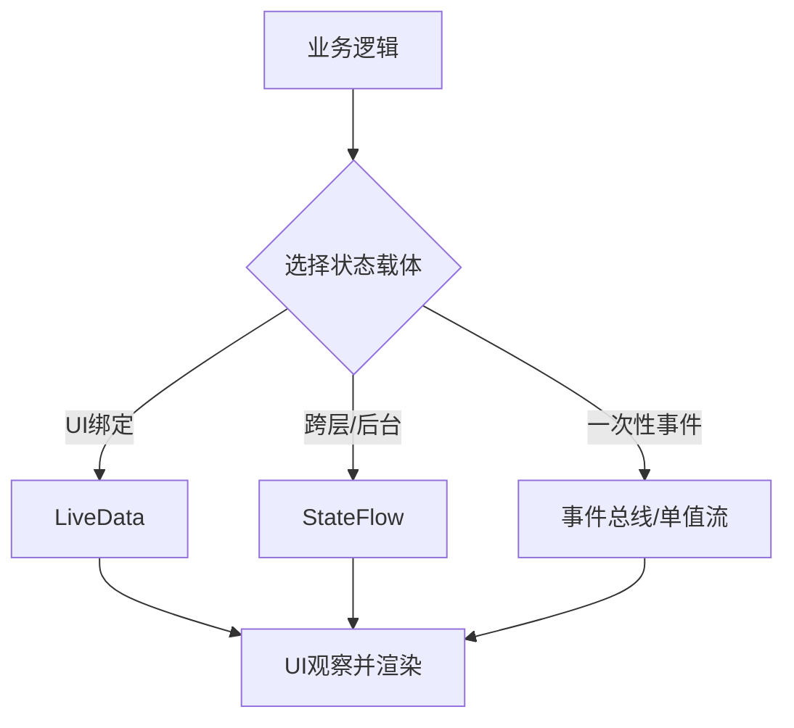

**图表来源**
- [app/src/main/java/io/legado/app/ui/book/reader/ReaderViewModel.kt](file://app/src/main/java/io/legado/app/ui/book/reader/ReaderViewModel.kt)
- [app/src/main/java/io/legado/app/ui/bookshelf/BookshelfViewModel.kt](file://app/src/main/java/io/legado/app/ui/bookshelf/BookshelfViewModel.kt)
- [app/src/main/java/io/legado/app/ui/login/LoginViewModel.kt](file://app/src/main/java/io/legado/app/ui/login/LoginViewModel.kt)

**章节来源**
- [app/src/main/java/io/legado/app/ui/book/reader/ReaderViewModel.kt](file://app/src/main/java/io/legado/app/ui/book/reader/ReaderViewModel.kt)
- [app/src/main/java/io/legado/app/ui/bookshelf/BookshelfViewModel.kt](file://app/src/main/java/io/legado/app/ui/bookshelf/BookshelfViewModel.kt)
- [app/src/main/java/io/legado/app/ui/login/LoginViewModel.kt](file://app/src/main/java/io/legado/app/ui/login/LoginViewModel.kt)

### 错误处理、日志记录与调试技巧
- 统一异常类型：通过AppException定义业务错误码与消息，便于前端展示与后端对接。
- 日志记录：使用LogUtils统一输出关键路径日志，区分Debug与Release级别，避免泄露敏感信息。
- 调试技巧：在ViewModel中打印关键状态变化、协程启动/取消、异常堆栈；结合UI层观察LiveData/StateFlow的变化。

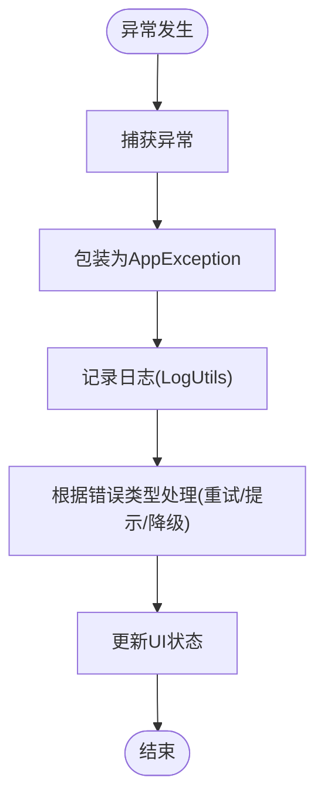

**图表来源**
- [app/src/main/java/io/legado/app/exception/AppException.kt](file://app/src/main/java/io/legado/app/exception/AppException.kt)
- [app/src/main/java/io/legado/app/utils/LogUtils.kt](file://app/src/main/java/io/legado/app/utils/LogUtils.kt)

**章节来源**
- [app/src/main/java/io/legado/app/exception/AppException.kt](file://app/src/main/java/io/legado/app/exception/AppException.kt)
- [app/src/main/java/io/legado/app/utils/LogUtils.kt](file://app/src/main/java/io/legado/app/utils/LogUtils.kt)

### 具体示例：阅读器ViewModel的生命周期与状态管理
- 场景：阅读器需要持久化阅读进度、切换章节、加载内容。
- 关键点：
  - 使用LiveData暴露当前章节、进度、加载状态。
  - 使用StateFlow管理用户设置（字体大小、主题）。
  - 在onCleared中保存进度、取消下载任务。
  - 配置变更时保持状态不变，避免重复加载。

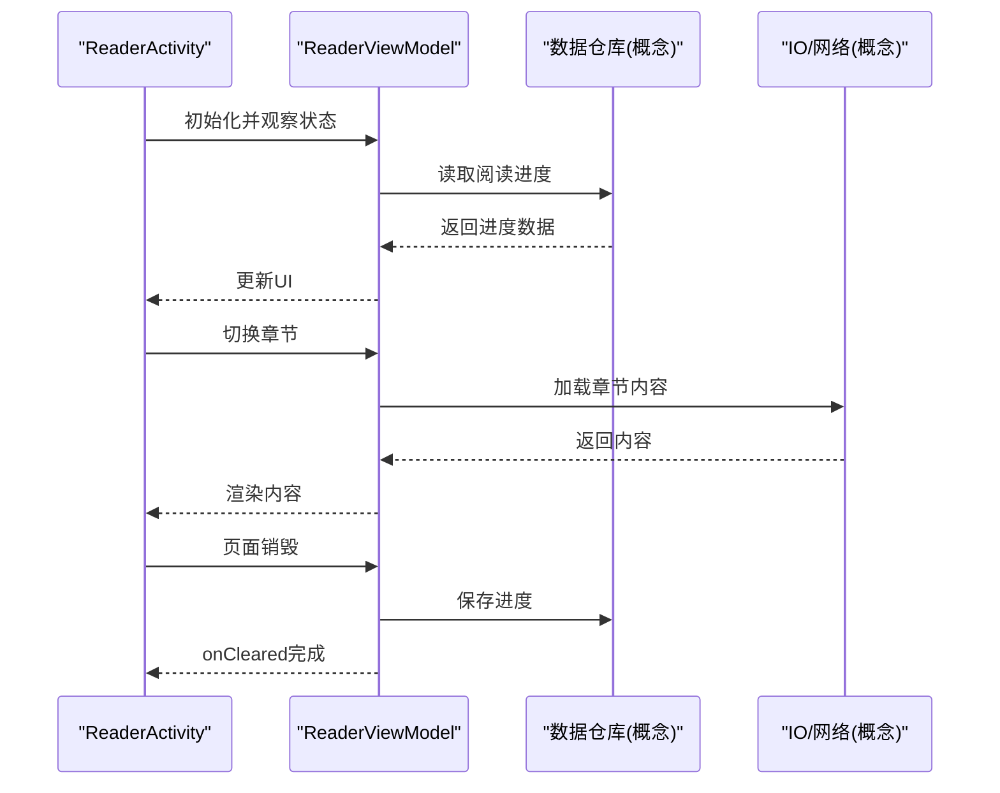

**图表来源**
- [app/src/main/java/io/legado/app/ui/book/reader/ReaderActivity.kt](file://app/src/main/java/io/legado/app/ui/book/reader/ReaderActivity.kt)
- [app/src/main/java/io/legado/app/ui/book/reader/ReaderViewModel.kt](file://app/src/main/java/io/legado/app/ui/book/reader/ReaderViewModel.kt)

**章节来源**
- [app/src/main/java/io/legado/app/ui/book/reader/ReaderActivity.kt](file://app/src/main/java/io/legado/app/ui/book/reader/ReaderActivity.kt)
- [app/src/main/java/io/legado/app/ui/book/reader/ReaderViewModel.kt](file://app/src/main/java/io/legado/app/ui/book/reader/ReaderViewModel.kt)

### 具体示例：书架ViewModel的异步任务与状态管理
- 场景：书架列表加载、搜索、批量操作。
- 关键点：
  - 使用LiveData暴露列表、分页状态、错误信息。
  - 使用StateFlow管理搜索关键词与过滤条件。
  - 在onCleared中取消未完成的网络请求与数据库查询。

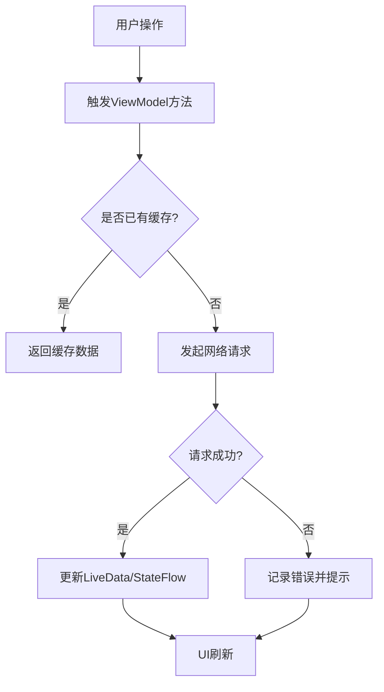

**图表来源**
- [app/src/main/java/io/legado/app/ui/bookshelf/BookshelfViewModel.kt](file://app/src/main/java/io/legado/app/ui/bookshelf/BookshelfViewModel.kt)

**章节来源**
- [app/src/main/java/io/legado/app/ui/bookshelf/BookshelfViewModel.kt](file://app/src/main/java/io/legado/app/ui/bookshelf/BookshelfViewModel.kt)

### 具体示例：登录ViewModel的错误处理与日志
- 场景：用户登录、输入校验、记住密码。
- 关键点：
  - 使用LiveData暴露登录状态、错误消息。
  - 使用StateFlow管理输入框状态。
  - 在异常分支记录日志并提示用户。

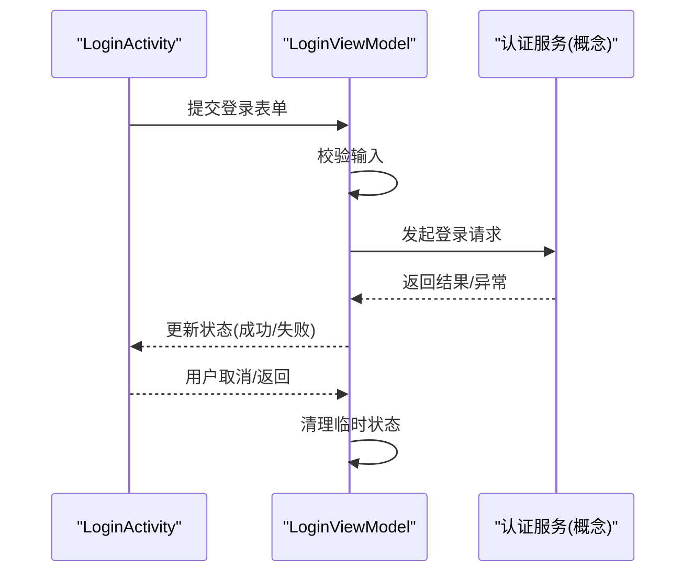

**图表来源**
- [app/src/main/java/io/legado/app/ui/login/LoginViewModel.kt](file://app/src/main/java/io/legado/app/ui/login/LoginViewModel.kt)

**章节来源**
- [app/src/main/java/io/legado/app/ui/login/LoginViewModel.kt](file://app/src/main/java/io/legado/app/ui/login/LoginViewModel.kt)

## 依赖关系分析
ViewModel依赖工具层（协程扩展、日志）与数据层（Repository/DAO/网络），并通过LiveData/StateFlow与UI层解耦。BaseActivity/BaseFragment提供生命周期桥接，确保ViewModel在正确的时机启动与停止任务。

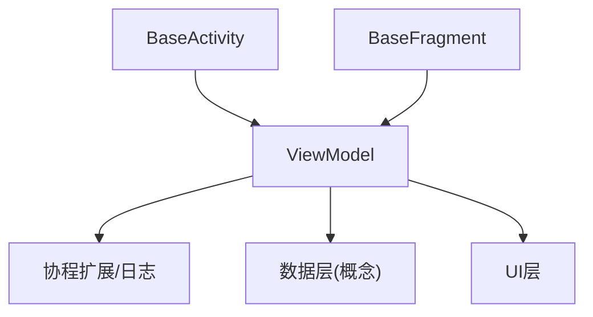

**图表来源**
- [app/src/main/java/io/legado/app/base/BaseActivity.kt](file://app/src/main/java/io/legado/app/base/BaseActivity.kt)
- [app/src/main/java/io/legado/app/base/BaseFragment.kt](file://app/src/main/java/io/legado/app/base/BaseFragment.kt)
- [app/src/main/java/io/legado/app/utils/CoroutineExtensions.kt](file://app/src/main/java/io/legado/app/utils/CoroutineExtensions.kt)
- [app/src/main/java/io/legado/app/utils/LogUtils.kt](file://app/src/main/java/io/legado/app/utils/LogUtils.kt)

**章节来源**
- [app/src/main/java/io/legado/app/base/BaseActivity.kt](file://app/src/main/java/io/legado/app/base/BaseActivity.kt)
- [app/src/main/java/io/legado/app/base/BaseFragment.kt](file://app/src/main/java/io/legado/app/base/BaseFragment.kt)
- [app/src/main/java/io/legado/app/utils/CoroutineExtensions.kt](file://app/src/main/java/io/legado/app/utils/CoroutineExtensions.kt)
- [app/src/main/java/io/legado/app/utils/LogUtils.kt](file://app/src/main/java/io/legado/app/utils/LogUtils.kt)

## 性能考量
- 避免在主线程执行耗时操作，使用协程切换到后台线程。
- 合理使用缓存，减少重复网络请求与数据库查询。
- 及时取消不必要的协程，避免内存泄漏与资源浪费。
- 使用StateFlow替代LiveData进行大数据量传输，减少对象创建与GC压力。

[本节为通用指导，不直接分析具体文件]

## 故障排查指南
- 常见问题：
  - 配置变更后状态丢失：确认ViewModel是否正确持有状态，避免在UI层存储。
  - 协程未取消导致内存泄漏：检查onCleared中是否显式取消任务。
  - 错误信息不明确：统一异常类型与日志输出，便于定位问题。
- 调试技巧：
  - 在关键路径添加日志，记录状态变化与异常堆栈。
  - 使用Android Studio的Memory Profiler检测内存泄漏。
  - 通过Logcat筛选特定标签，缩小问题范围。

**章节来源**
- [app/src/main/java/io/legado/app/utils/LogUtils.kt](file://app/src/main/java/io/legado/app/utils/LogUtils.kt)
- [app/src/main/java/io/legado/app/exception/AppException.kt](file://app/src/main/java/io/legado/app/exception/AppException.kt)

## 结论
通过BaseViewModel的统一抽象、生命周期安全的协程管理、合理的状态管理策略与完善的错误处理机制，Legado项目实现了健壮的ViewModel组件。开发者应遵循本文档的最佳实践，确保应用在高并发、配置变更等复杂场景下保持稳定与高效。

[本节为总结性内容，不直接分析具体文件]

## 附录
- 参考文件：
  - [app/src/main/java/io/legado/app/base/BaseActivity.kt](file://app/src/main/java/io/legado/app/base/BaseActivity.kt)
  - [app/src/main/java/io/legado/app/base/BaseFragment.kt](file://app/src/main/java/io/legado/app/base/BaseFragment.kt)
  - [app/src/main/java/io/legado/app/ui/book/reader/ReaderActivity.kt](file://app/src/main/java/io/legado/app/ui/book/reader/ReaderActivity.kt)
  - [app/src/main/java/io/legado/app/ui/book/reader/ReaderViewModel.kt](file://app/src/main/java/io/legado/app/ui/book/reader/ReaderViewModel.kt)
  - [app/src/main/java/io/legado/app/ui/bookshelf/BookshelfViewModel.kt](file://app/src/main/java/io/legado/app/ui/bookshelf/BookshelfViewModel.kt)
  - [app/src/main/java/io/legado/app/ui/login/LoginViewModel.kt](file://app/src/main/java/io/legado/app/ui/login/LoginViewModel.kt)
  - [app/src/main/java/io/legado/app/utils/CoroutineExtensions.kt](file://app/src/main/java/io/legado/app/utils/CoroutineExtensions.kt)
  - [app/src/main/java/io/legado/app/utils/LogUtils.kt](file://app/src/main/java/io/legado/app/utils/LogUtils.kt)
  - [app/src/main/java/io/legado/app/exception/AppException.kt](file://app/src/main/java/io/legado/app/exception/AppException.kt)

[本节为附录，不直接分析具体文件]