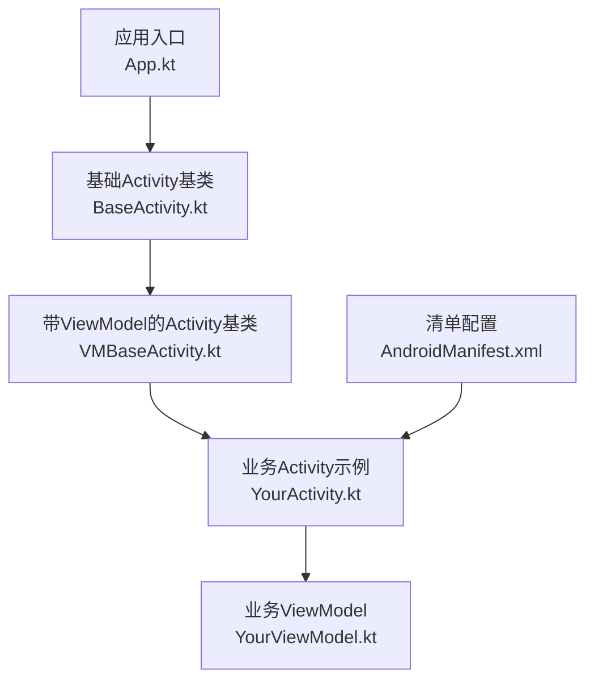
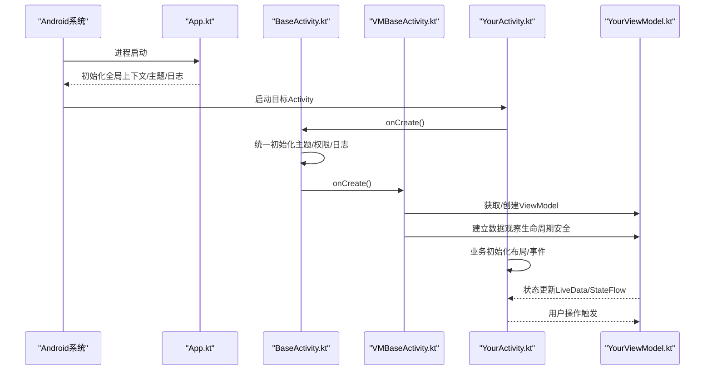
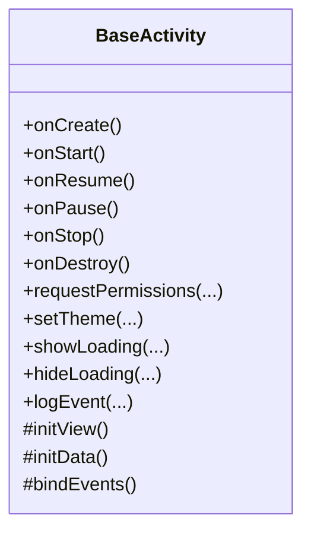
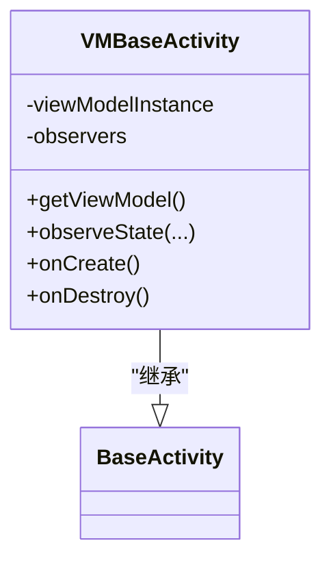
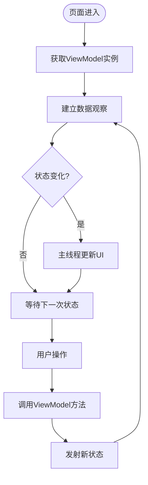
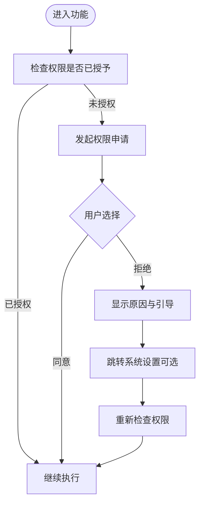
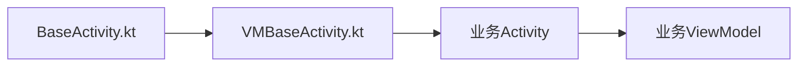

# 基础Activity框架

<cite>
**本文引用的文件**   
- [BaseActivity.kt](file://app/src/main/java/io/legado/app/base/BaseActivity.kt)
- [VMBaseActivity.kt](file://app/src/main/java/io/legado/app/base/VMBaseActivity.kt)
- [App.kt](file://app/src/main/java/io/legado/app/App.kt)
- [AndroidManifest.xml](file://app/src/main/AndroidManifest.xml)
</cite>

## 目录
1. [简介](#简介)
2. [项目结构](#项目结构)
3. [核心组件](#核心组件)
4. [架构总览](#架构总览)
5. [详细组件分析](#详细组件分析)
6. [依赖分析](#依赖分析)
7. [性能考虑](#性能考虑)
8. [故障排查指南](#故障排查指南)
9. [结论](#结论)
10. [附录](#附录)

## 简介
本文件面向希望基于本项目的基础Activity框架进行功能扩展的开发者，系统性阐述BaseActivity与VMBaseActivity的设计模式、继承关系与职责边界，覆盖生命周期管理、权限处理、主题设置、通用能力封装，以及ViewModel与Activity的绑定机制（数据观察与状态同步）。同时给出错误处理、日志记录与调试工具的使用建议，并提供创建新Activity并集成MVVM架构的最佳实践与常见问题解决方案。

## 项目结构
本项目采用按“包/模块”划分的组织方式，UI层集中在app/src/main/java/io/legado/app/ui下，基础能力集中在base包中。基础Activity框架位于：
- app/src/main/java/io/legado/app/base/BaseActivity.kt
- app/src/main/java/io/legado/app/base/VMBaseActivity.kt

应用入口与全局初始化位于：
- app/src/main/java/io/legado/app/App.kt

清单文件用于声明Activity及主题等配置：
- app/src/main/AndroidManifest.xml

图表来源 
- [App.kt](file://app/src/main/java/io/legado/app/App.kt)
- [BaseActivity.kt](file://app/src/main/java/io/legado/app/base/BaseActivity.kt)
- [VMBaseActivity.kt](file://app/src/main/java/io/legado/app/base/VMBaseActivity.kt)
- [AndroidManifest.xml](file://app/src/main/AndroidManifest.xml)

章节来源
- [App.kt](file://app/src/main/java/io/legado/app/App.kt)
- [AndroidManifest.xml](file://app/src/main/AndroidManifest.xml)

## 核心组件
- BaseActivity：所有Activity的统一基类，负责统一的生命周期钩子、权限申请流程、主题与样式注入、通用UI交互（如加载态、提示框）、日志埋点与异常兜底等。
- VMBaseActivity：在BaseActivity基础上引入ViewModel绑定与数据观察，提供统一的ViewModel实例获取、生命周期感知的数据订阅、状态同步与内存安全释放。

设计要点
- 分层清晰：BaseActivity聚焦“平台能力与通用行为”，VMBaseActivity聚焦“MVVM绑定与数据流”。
- 可插拔：通过抽象方法或回调接口让子类按需实现具体逻辑，避免基类臃肿。
- 安全释放：在onDestroy或对应生命周期节点清理观察者，防止内存泄漏。

章节来源
- [BaseActivity.kt](file://app/src/main/java/io/legado/app/base/BaseActivity.kt)
- [VMBaseActivity.kt](file://app/src/main/java/io/legado/app/base/VMBaseActivity.kt)

## 架构总览
下图展示了从应用启动到业务Activity运行的关键路径，以及BaseActivity与VMBaseActivity在整个调用链中的位置。

图表来源 
- [App.kt](file://app/src/main/java/io/legado/app/App.kt)
- [BaseActivity.kt](file://app/src/main/java/io/legado/app/base/BaseActivity.kt)
- [VMBaseActivity.kt](file://app/src/main/java/io/legado/app/base/VMBaseActivity.kt)

## 详细组件分析

### BaseActivity 分析
职责范围
- 生命周期钩子：集中处理onCreate/onStart/onResume/onPause/onStop/onDestroy中的公共逻辑。
- 权限处理：统一封装运行时权限申请、结果回调、拒绝策略与引导说明。
- 主题设置：根据配置动态切换主题、夜间模式、字体缩放等。
- 通用UI：加载态控制、Toast/Dialog封装、返回键拦截、沉浸式状态栏等。
- 日志与异常：统一打点、崩溃捕获、调试开关。

典型扩展点
- 抽象方法：如initView()/initData()/bindEvents()，由子类实现。
- 回调接口：如PermissionResultCallback、ThemeChangeListener。

图表来源 
- [BaseActivity.kt](file://app/src/main/java/io/legado/app/base/BaseActivity.kt)

章节来源
- [BaseActivity.kt](file://app/src/main/java/io/legado/app/base/BaseActivity.kt)

### VMBaseActivity 分析
职责范围
- ViewModel绑定：通过工厂或依赖注入获取ViewModel实例，确保与Activity生命周期一致。
- 数据观察：对LiveData/StateFlow等进行生命周期安全的observe，自动在合适时机取消订阅。
- 状态同步：将ViewModel中的状态映射到UI，保证线程安全与主线程更新。
- 资源释放：在onDestroy或对应节点清理观察者，避免内存泄漏。

与BaseActivity的关系
- 继承自BaseActivity，复用其生命周期、权限、主题与通用能力。
- 在BaseActivity的生命周期钩子中完成ViewModel的创建与观察注册。

图表来源 
- [VMBaseActivity.kt](file://app/src/main/java/io/legado/app/base/VMBaseActivity.kt)
- [BaseActivity.kt](file://app/src/main/java/io/legado/app/base/BaseActivity.kt)

章节来源
- [VMBaseActivity.kt](file://app/src/main/java/io/legado/app/base/VMBaseActivity.kt)
- [BaseActivity.kt](file://app/src/main/java/io/legado/app/base/BaseActivity.kt)

### MVVM 绑定与数据流
- 数据源：ViewModel持有业务状态与逻辑，暴露为不可变状态（如LiveData/StateFlow）。
- 观察机制：VMBaseActivity在合适的生命周期阶段建立观察，并在退出时自动释放。
- 状态同步：UI仅消费状态，不直接修改；用户操作通过ViewModel的方法驱动状态变更。

图表来源 
- [VMBaseActivity.kt](file://app/src/main/java/io/legado/app/base/VMBaseActivity.kt)

章节来源
- [VMBaseActivity.kt](file://app/src/main/java/io/legado/app/base/VMBaseActivity.kt)

### 权限处理流程
- 请求时机：在进入需要权限的功能前检查，必要时发起申请。
- 结果处理：成功则继续流程；拒绝则给出提示或降级方案；永久拒绝则引导至系统设置。
- 用户体验：使用统一的提示对话框与文案，保持体验一致。

图表来源 
- [BaseActivity.kt](file://app/src/main/java/io/legado/app/base/BaseActivity.kt)

章节来源
- [BaseActivity.kt](file://app/src/main/java/io/legado/app/base/BaseActivity.kt)

### 主题与样式管理
- 主题切换：支持日间/夜间模式、自定义主题色、字体大小等。
- 生效时机：在Activity创建前或首次渲染前应用，避免闪烁。
- 持久化：与全局配置联动，重启后保持一致。

章节来源
- [BaseActivity.kt](file://app/src/main/java/io/legado/app/base/BaseActivity.kt)
- [AndroidManifest.xml](file://app/src/main/AndroidManifest.xml)

### 错误处理、日志与调试
- 错误处理：统一异常捕获、友好提示、上报与降级。
- 日志记录：分级输出、开关控制、敏感信息脱敏。
- 调试工具：断点辅助、状态快照、耗时统计。

章节来源
- [BaseActivity.kt](file://app/src/main/java/io/legado/app/base/BaseActivity.kt)

## 依赖分析
- 内部依赖：BaseActivity与VMBaseActivity形成清晰的继承链，职责分离明确。
- 外部依赖：Android框架API（生命周期、权限、主题）、MVVM组件（ViewModel、LiveData/StateFlow）。
- 耦合度：基类与业务Activity低耦合，通过抽象方法与回调解耦。

图表来源 
- [BaseActivity.kt](file://app/src/main/java/io/legado/app/base/BaseActivity.kt)
- [VMBaseActivity.kt](file://app/src/main/java/io/legado/app/base/VMBaseActivity.kt)

章节来源
- [BaseActivity.kt](file://app/src/main/java/io/legado/app/base/BaseActivity.kt)
- [VMBaseActivity.kt](file://app/src/main/java/io/legado/app/base/VMBaseActivity.kt)

## 性能考虑
- 减少重复初始化：将通用初始化放入BaseActivity，避免每个Activity重复代码。
- 合理观察：仅在可见生命周期内观察数据，避免后台持续计算。
- 避免内存泄漏：及时取消观察者，谨慎持有Context引用。
- 主题切换开销：批量更新UI，避免频繁重绘。

[本节为通用指导，无需特定文件来源]

## 故障排查指南
常见问题与定位思路
- Activity启动白屏或主题错乱：检查主题设置时机与Manifest配置。
- 权限被拒导致崩溃：确认权限申请与结果处理分支是否完整。
- 内存泄漏：检查是否在onDestroy中清理了观察者与回调。
- 数据不同步：确认观察线程为主线程，且状态更新幂等。
- 日志过多影响性能：关闭调试日志或降低级别。

章节来源
- [BaseActivity.kt](file://app/src/main/java/io/legado/app/base/BaseActivity.kt)
- [VMBaseActivity.kt](file://app/src/main/java/io/legado/app/base/VMBaseActivity.kt)

## 结论
BaseActivity与VMBaseActivity构成了本项目UI层的稳定基石：前者统一平台能力与通用行为，后者专注MVVM绑定与数据流。遵循该框架可以显著提升代码一致性、可维护性与可测试性。建议在新增页面时优先继承VMBaseActivity，并通过抽象方法或回调扩展具体业务逻辑。

[本节为总结性内容，无需特定文件来源]

## 附录

### 如何创建新的Activity并集成MVVM（步骤指引）
- 新建Activity并继承VMBaseActivity。
- 在initView中完成布局与控件初始化。
- 在initData中准备初始数据与参数解析。
- 在bindEvents中绑定用户交互事件，调用ViewModel方法。
- 在ViewModel中定义状态与业务逻辑，暴露给UI观察。
- 如需权限，在BaseActivity提供的权限接口中申请并处理结果。
- 如需主题切换，调用BaseActivity的主题相关方法。

章节来源
- [BaseActivity.kt](file://app/src/main/java/io/legado/app/base/BaseActivity.kt)
- [VMBaseActivity.kt](file://app/src/main/java/io/legado/app/base/VMBaseActivity.kt)

### 最佳实践
- 单一职责：BaseActivity只做通用能力，VMBaseActivity只做绑定与数据流。
- 最小侵入：通过抽象方法或回调扩展，避免在基类中写业务逻辑。
- 安全观察：始终在主线程更新UI，生命周期结束时释放观察。
- 可测试性：将业务逻辑下沉到ViewModel，便于单元测试。
- 日志规范：分级输出，脱敏敏感信息，生产环境关闭调试日志。

[本节为通用指导，无需特定文件来源]

### 常见问题解决方案
- 权限申请无响应：检查是否在主线程调用，并确保Manifest中声明必要权限。
- 主题切换闪烁：在Application或Activity创建前设置主题，避免中途变更。
- LiveData/StateFlow未更新：确认观察作用域正确，且状态更新发生在主线程。
- 内存泄漏：使用弱引用或生命周期感知的观察，避免静态持有Context。

[本节为通用指导，无需特定文件来源]