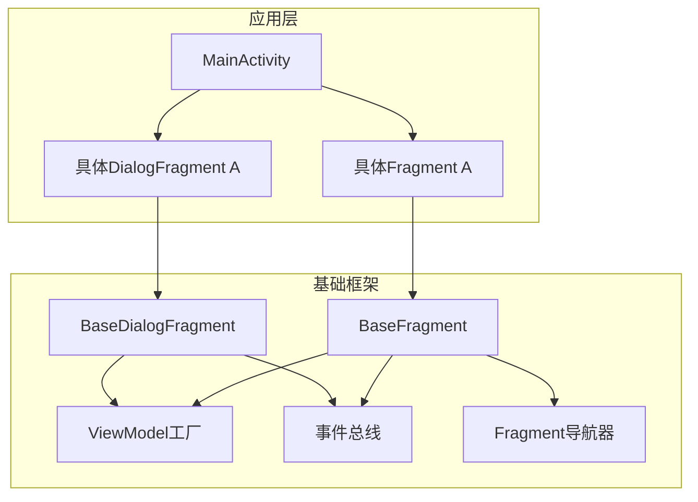
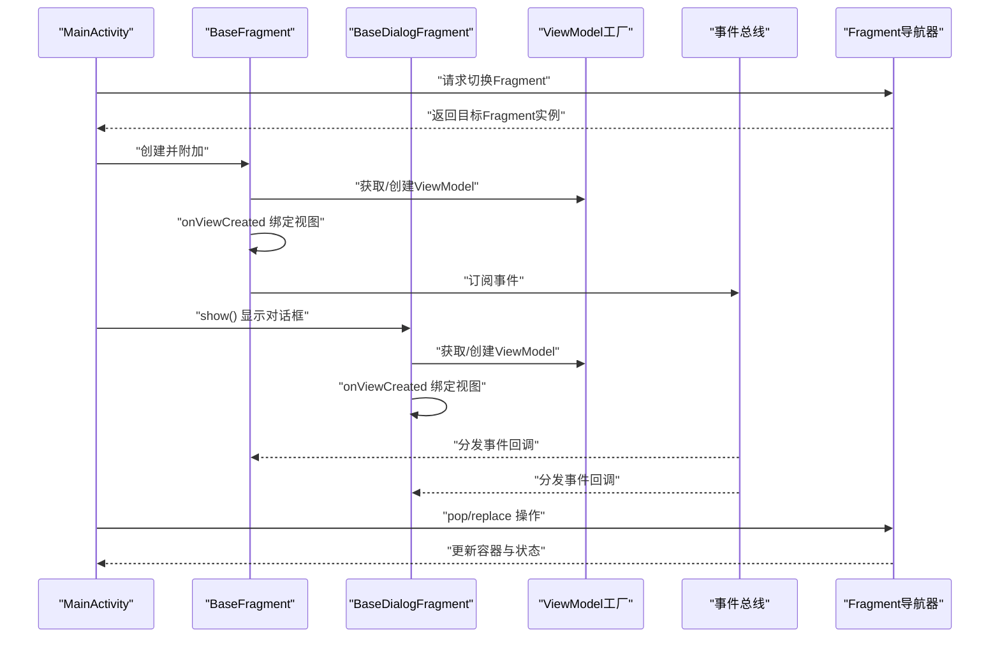
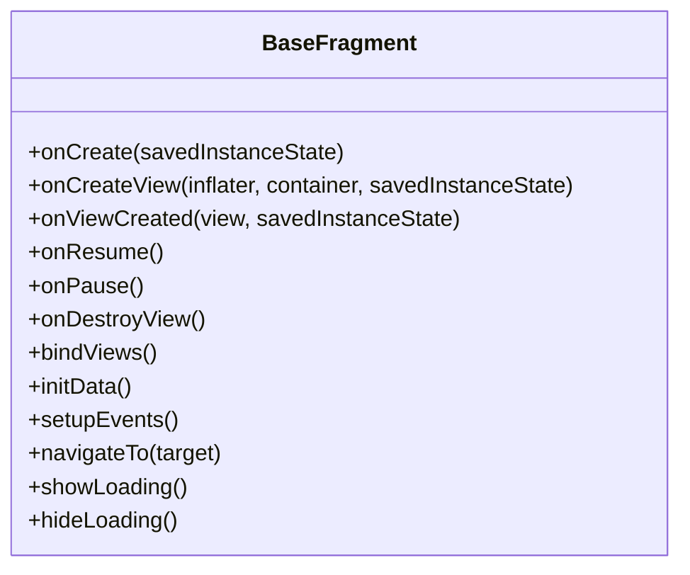
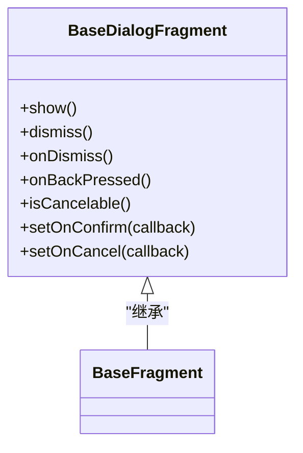
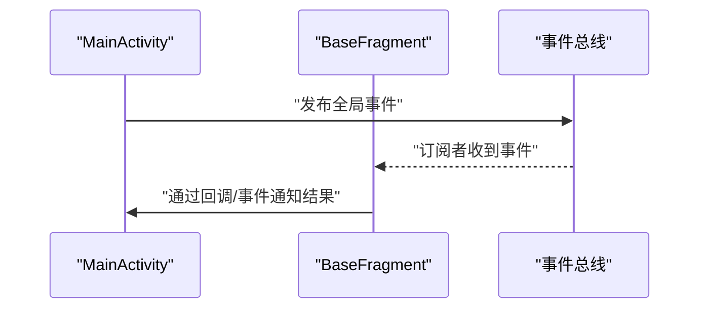
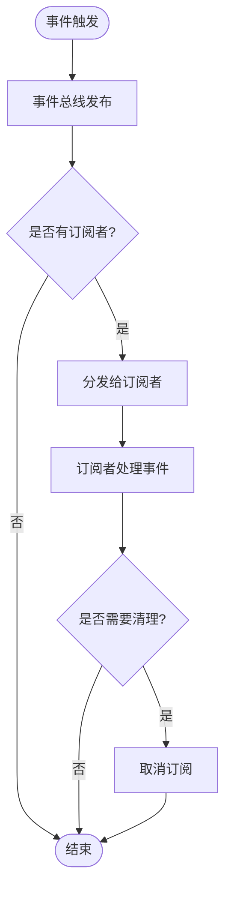
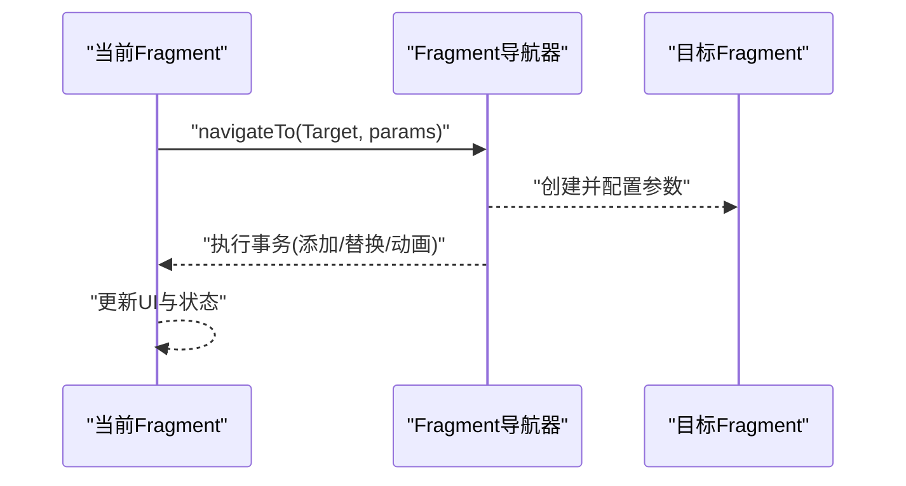
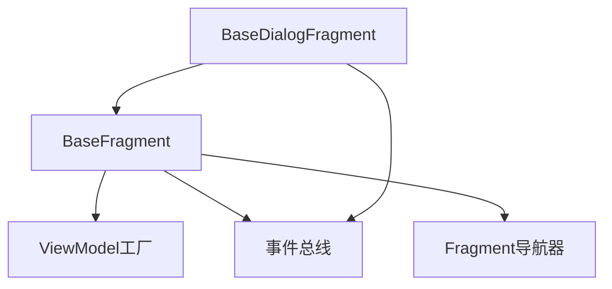

# 基础Fragment框架

<cite>
**本文档引用的文件**   
- [BaseFragment.kt](file://app/src/main/java/io/legado/app/base/BaseFragment.kt)
- [BaseDialogFragment.kt](file://app/src/main/java/io/legado/app/base/BaseDialogFragment.kt)
- [App.kt](file://app/src/main/java/io/legado/app/App.kt)
- [MainActivity.kt](file://app/src/main/java/io/legado/app/ui/main/MainActivity.kt)
- [ViewModelFactory.kt](file://app/src/main/java/io/legado/app/base/ViewModelFactory.kt)
- [EventBus.kt](file://app/src/main/java/io/legado/app/utils/EventBus.kt)
- [FragmentNavigator.kt](file://app/src/main/java/io/legado/app/ui/main/FragmentNavigator.kt)
</cite>

## 目录
1. [简介](#简介)
2. [项目结构](#项目结构)
3. [核心组件](#核心组件)
4. [架构总览](#架构总览)
5. [详细组件分析](#详细组件分析)
6. [依赖关系分析](#依赖关系分析)
7. [性能考虑](#性能考虑)
8. [故障排查指南](#故障排查指南)
9. [结论](#结论)
10. [附录](#附录)

## 简介
本文件面向Legado Android应用中的基础Fragment框架，系统性阐述BaseFragment与BaseDialogFragment的设计模式、生命周期管理、视图绑定、数据传递机制、与Activity的通信模式、事件处理与状态管理，以及对话框Fragment的特殊处理与安全注意事项。文档同时提供可复用的Fragment组件实现思路、性能优化技巧与内存管理最佳实践，帮助开发者快速构建稳定、高效且易维护的UI模块。

## 项目结构
在Legado应用中，Fragment基类位于app模块的base包中，围绕Fragment与DialogFragment提供统一的初始化、生命周期钩子、视图绑定、事件总线集成、导航与参数传递等能力。典型的使用方式是通过继承BaseFragment或BaseDialogFragment，并在子类中声明所需的数据、视图与业务逻辑，由基类统一编排生命周期与资源管理。

图表来源
- [MainActivity.kt](file://app/src/main/java/io/legado/app/ui/main/MainActivity.kt)
- [BaseFragment.kt](file://app/src/main/java/io/legado/app/base/BaseFragment.kt)
- [BaseDialogFragment.kt](file://app/src/main/java/io/legado/app/base/BaseDialogFragment.kt)
- [ViewModelFactory.kt](file://app/src/main/java/io/legado/app/base/ViewModelFactory.kt)
- [EventBus.kt](file://app/src/main/java/io/legado/app/utils/EventBus.kt)
- [FragmentNavigator.kt](file://app/src/main/java/io/legado/app/ui/main/FragmentNavigator.kt)

章节来源
- [BaseFragment.kt](file://app/src/main/java/io/legado/app/base/BaseFragment.kt)
- [BaseDialogFragment.kt](file://app/src/main/java/io/legado/app/base/BaseDialogFragment.kt)
- [App.kt](file://app/src/main/java/io/legado/app/App.kt)
- [MainActivity.kt](file://app/src/main/java/io/legado/app/ui/main/MainActivity.kt)
- [ViewModelFactory.kt](file://app/src/main/java/io/legado/app/base/ViewModelFactory.kt)
- [EventBus.kt](file://app/src/main/java/io/legado/app/utils/EventBus.kt)
- [FragmentNavigator.kt](file://app/src/main/java/io/legado/app/ui/main/FragmentNavigator.kt)

## 核心组件
- BaseFragment：封装Fragment通用能力，包括生命周期钩子、视图绑定、参数解析、事件订阅、导航跳转、加载状态管理等。
- BaseDialogFragment：在BaseFragment基础上扩展对话框相关能力，如显示/隐藏、模态行为、返回键处理、安全关闭等。
- ViewModel工厂：为Fragment/DialogFragment提供统一的ViewModel实例化与缓存策略。
- 事件总线：用于Fragment之间、Fragment与Activity之间的解耦通信。
- 导航器：集中管理Fragment的入栈、出栈、替换与动画。

章节来源
- [BaseFragment.kt](file://app/src/main/java/io/legado/app/base/BaseFragment.kt)
- [BaseDialogFragment.kt](file://app/src/main/java/io/legado/app/base/BaseDialogFragment.kt)
- [ViewModelFactory.kt](file://app/src/main/java/io/legado/app/base/ViewModelFactory.kt)
- [EventBus.kt](file://app/src/main/java/io/legado/app/utils/EventBus.kt)
- [FragmentNavigator.kt](file://app/src/main/java/io/legado/app/ui/main/FragmentNavigator.kt)

## 架构总览
下图展示了从Activity到Fragment/DialogFragment的生命周期与数据流，以及事件总线与导航器的协作方式。

图表来源
- [MainActivity.kt](file://app/src/main/java/io/legado/app/ui/main/MainActivity.kt)
- [BaseFragment.kt](file://app/src/main/java/io/legado/app/base/BaseFragment.kt)
- [BaseDialogFragment.kt](file://app/src/main/java/io/legado/app/base/BaseDialogFragment.kt)
- [ViewModelFactory.kt](file://app/src/main/java/io/legado/app/base/ViewModelFactory.kt)
- [EventBus.kt](file://app/src/main/java/io/legado/app/utils/EventBus.kt)
- [FragmentNavigator.kt](file://app/src/main/java/io/legado/app/ui/main/FragmentNavigator.kt)

## 详细组件分析

### BaseFragment 设计模式与功能封装
- 生命周期管理：统一封装onCreate/onCreateView/onViewCreated/onResume/onPause/onDestroyView等关键节点，确保视图与资源的安全初始化与释放。
- 视图绑定：提供安全的视图查找与绑定方法，避免空引用与重复查找开销。
- 数据传递：通过Bundle或参数对象进行跨Fragment数据传递，支持类型安全与默认值。
- 事件处理：集成事件总线，支持订阅/取消订阅，避免内存泄漏。
- 导航与状态：封装Fragment跳转、回退栈管理与加载状态展示。

图表来源
- [BaseFragment.kt](file://app/src/main/java/io/legado/app/base/BaseFragment.kt)

章节来源
- [BaseFragment.kt](file://app/src/main/java/io/legado/app/base/BaseFragment.kt)

### BaseDialogFragment 特殊处理与安全考虑
- 对话框生命周期：在BaseFragment基础上增加show/hide、dismiss、onDismiss等钩子，确保视图与资源正确管理。
- 模态与返回键：拦截返回键行为，防止意外退出；支持自定义确认/取消流程。
- 安全关闭：在后台任务或网络请求未完成时阻止关闭，避免数据不一致。
- 主题与样式：统一对话框外观与行为，提升用户体验一致性。

图表来源
- [BaseDialogFragment.kt](file://app/src/main/java/io/legado/app/base/BaseDialogFragment.kt)

章节来源
- [BaseDialogFragment.kt](file://app/src/main/java/io/legado/app/base/BaseDialogFragment.kt)

### 与Activity的通信模式
- 推荐通过事件总线或接口回调进行解耦通信，避免直接持有Activity引用。
- 使用ViewModel共享状态，减少Fragment与Activity之间的紧耦合。
- 对于需要结果返回的场景，采用回调或事件总线发布结果。

图表来源
- [EventBus.kt](file://app/src/main/java/io/legado/app/utils/EventBus.kt)
- [MainActivity.kt](file://app/src/main/java/io/legado/app/ui/main/MainActivity.kt)
- [BaseFragment.kt](file://app/src/main/java/io/legado/app/base/BaseFragment.kt)

章节来源
- [EventBus.kt](file://app/src/main/java/io/legado/app/utils/EventBus.kt)
- [MainActivity.kt](file://app/src/main/java/io/legado/app/ui/main/MainActivity.kt)
- [BaseFragment.kt](file://app/src/main/java/io/legado/app/base/BaseFragment.kt)

### 事件处理与状态管理
- 事件总线：集中式事件分发，支持按类型订阅与一次性消费。
- 状态管理：结合ViewModel与LiveData/StateFlow（若使用）进行状态同步，避免UI闪烁与重复渲染。
- 生命周期感知：在Fragment销毁时自动取消订阅，防止内存泄漏。

图表来源
- [EventBus.kt](file://app/src/main/java/io/legado/app/utils/EventBus.kt)

章节来源
- [EventBus.kt](file://app/src/main/java/io/legado/app/utils/EventBus.kt)

### 导航与参数传递
- 导航器：统一管理Fragment的入栈、出栈、替换与动画，避免分散的跳转逻辑。
- 参数传递：通过Bundle或参数对象传递，支持类型校验与默认值。
- 回退栈：合理管理回退栈，保证用户操作的连贯性。

图表来源
- [FragmentNavigator.kt](file://app/src/main/java/io/legado/app/ui/main/FragmentNavigator.kt)
- [BaseFragment.kt](file://app/src/main/java/io/legado/app/base/BaseFragment.kt)

章节来源
- [FragmentNavigator.kt](file://app/src/main/java/io/legado/app/ui/main/FragmentNavigator.kt)
- [BaseFragment.kt](file://app/src/main/java/io/legado/app/base/BaseFragment.kt)

### 可复用Fragment组件示例
- 定义一个通用的列表Fragment，继承BaseFragment，封装数据加载、分页、错误处理与重试逻辑。
- 通过参数对象传入筛选条件与回调函数，实现高度可配置的列表展示。
- 使用事件总线与父级Activity或其他Fragment通信，避免直接依赖。

章节来源
- [BaseFragment.kt](file://app/src/main/java/io/legado/app/base/BaseFragment.kt)
- [EventBus.kt](file://app/src/main/java/io/legado/app/utils/EventBus.kt)
- [FragmentNavigator.kt](file://app/src/main/java/io/legado/app/ui/main/FragmentNavigator.kt)

## 依赖关系分析
- BaseFragment依赖ViewModel工厂、事件总线与导航器，形成松耦合的UI基础层。
- BaseDialogFragment在BaseFragment基础上扩展对话框能力，保持与Activity和Fragment的解耦。
- 事件总线作为横向通信机制，贯穿各层，降低模块间耦合度。

图表来源
- [BaseFragment.kt](file://app/src/main/java/io/legado/app/base/BaseFragment.kt)
- [BaseDialogFragment.kt](file://app/src/main/java/io/legado/app/base/BaseDialogFragment.kt)
- [ViewModelFactory.kt](file://app/src/main/java/io/legado/app/base/ViewModelFactory.kt)
- [EventBus.kt](file://app/src/main/java/io/legado/app/utils/EventBus.kt)
- [FragmentNavigator.kt](file://app/src/main/java/io/legado/app/ui/main/FragmentNavigator.kt)

章节来源
- [BaseFragment.kt](file://app/src/main/java/io/legado/app/base/BaseFragment.kt)
- [BaseDialogFragment.kt](file://app/src/main/java/io/legado/app/base/BaseDialogFragment.kt)
- [ViewModelFactory.kt](file://app/src/main/java/io/legado/app/base/ViewModelFactory.kt)
- [EventBus.kt](file://app/src/main/java/io/legado/app/utils/EventBus.kt)
- [FragmentNavigator.kt](file://app/src/main/java/io/legado/app/ui/main/FragmentNavigator.kt)

## 性能考虑
- 视图绑定优化：避免重复查找视图，使用缓存或数据绑定框架提升性能。
- 懒加载：仅在必要时加载数据与资源，减少初始启动时间。
- 内存管理：及时取消事件订阅、释放大对象引用，避免内存泄漏。
- 异步处理：将耗时操作移至后台线程，避免阻塞主线程。
- 导航优化：合理使用Fragment复用与回退栈，减少不必要的重建。

## 故障排查指南
- 常见问题：
  - 视图为空：检查onViewCreated是否被调用，确保视图已正确绑定。
  - 事件未触发：确认订阅是否在正确的生命周期内注册，销毁时是否取消订阅。
  - 导航异常：检查Fragment标签是否唯一，事务是否正确提交。
  - 对话框无法关闭：检查isCancelable设置与返回键拦截逻辑。
- 调试建议：
  - 使用日志输出关键生命周期与方法调用。
  - 借助Android Profiler分析内存与CPU使用情况。
  - 逐步缩小问题范围，定位具体Fragment或事件源。

章节来源
- [BaseFragment.kt](file://app/src/main/java/io/legado/app/base/BaseFragment.kt)
- [BaseDialogFragment.kt](file://app/src/main/java/io/legado/app/base/BaseDialogFragment.kt)
- [EventBus.kt](file://app/src/main/java/io/legado/app/utils/EventBus.kt)
- [FragmentNavigator.kt](file://app/src/main/java/io/legado/app/ui/main/FragmentNavigator.kt)

## 结论
BaseFragment与BaseDialogFragment为Legado应用提供了统一、稳定且高效的Fragment基础框架。通过生命周期管理、视图绑定、事件总线与导航器的有机结合，开发者可以快速构建可复用、易维护的UI组件。遵循本文档的最佳实践与性能优化建议，可显著提升应用的稳定性与用户体验。

## 附录
- 参考文件路径：
  - BaseFragment：[BaseFragment.kt](file://app/src/main/java/io/legado/app/base/BaseFragment.kt)
  - BaseDialogFragment：[BaseDialogFragment.kt](file://app/src/main/java/io/legado/app/base/BaseDialogFragment.kt)
  - ViewModel工厂：[ViewModelFactory.kt](file://app/src/main/java/io/legado/app/base/ViewModelFactory.kt)
  - 事件总线：[EventBus.kt](file://app/src/main/java/io/legado/app/utils/EventBus.kt)
  - 导航器：[FragmentNavigator.kt](file://app/src/main/java/io/legado/app/ui/main/FragmentNavigator.kt)
  - 应用入口：[App.kt](file://app/src/main/java/io/legado/app/App.kt)
  - 主界面：[MainActivity.kt](file://app/src/main/java/io/legado/app/ui/main/MainActivity.kt)