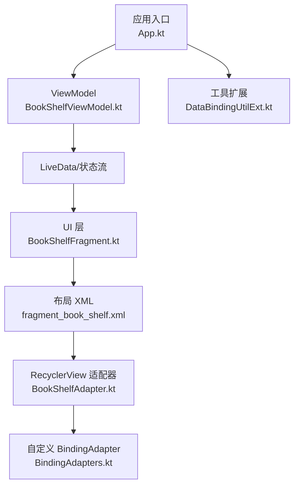
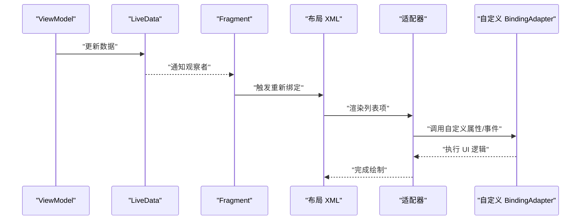
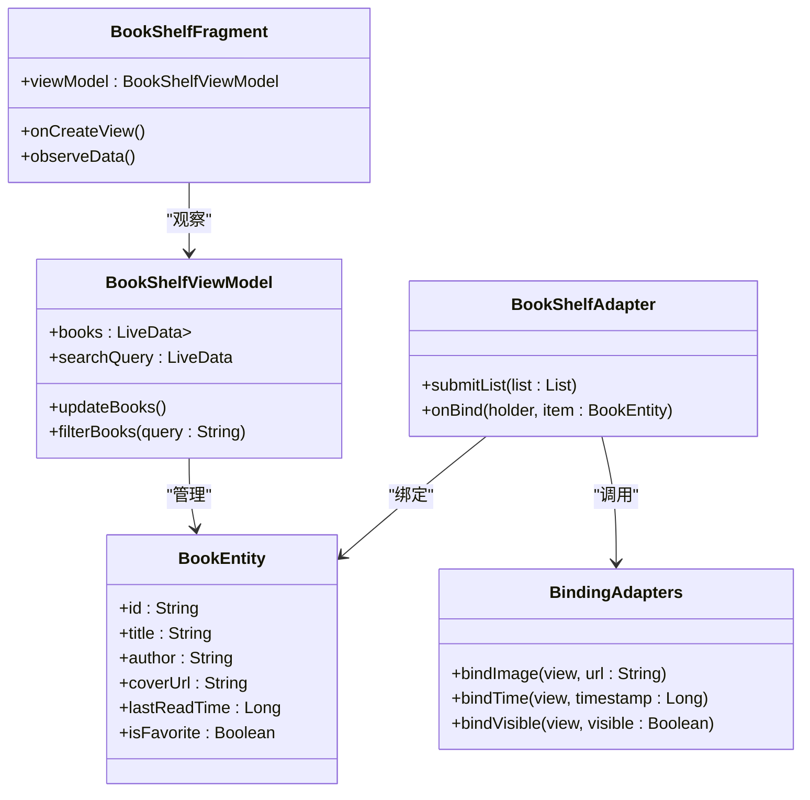
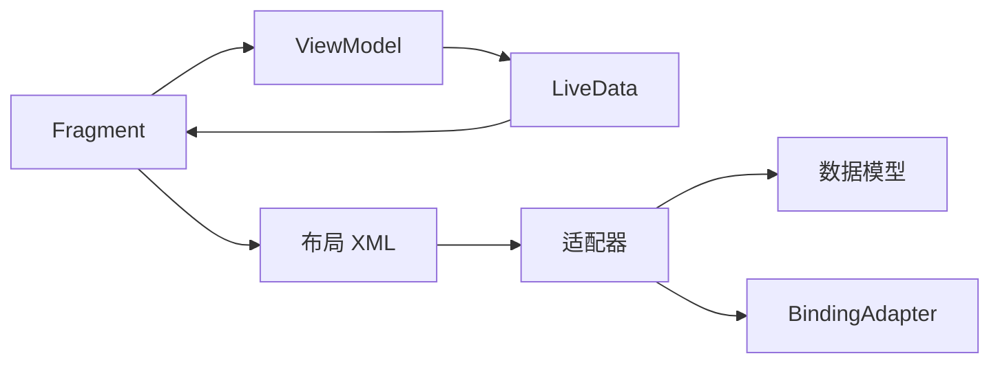

# 数据绑定机制

<cite>
**本文引用的文件**   
- [app/build.gradle](file://app/build.gradle)
- [app/src/main/java/io/legado/app/App.kt](file://app/src/main/java/io/legado/app/App.kt)
- [app/src/main/java/io/legado/app/ui/bookshelf/viewmodel/BookShelfViewModel.kt](file://app/src/main/java/io/legado/app/ui/bookshelf/viewmodel/BookShelfViewModel.kt)
- [app/src/main/java/io/legado/app/ui/bookshelf/fragment/BookShelfFragment.kt](file://app/src/main/java/io/legado/app/ui/bookshelf/fragment/BookShelfFragment.kt)
- [app/src/main/res/layout/fragment_book_shelf.xml](file://app/src/main/res/layout/fragment_book_shelf.xml)
- [app/src/main/java/io/legado/app/ui/bookshelf/adapter/BookShelfAdapter.kt](file://app/src/main/java/io/legado/app/ui/bookshelf/adapter/BookShelfAdapter.kt)
- [app/src/main/java/io/legado/app/ui/widget/BindingAdapters.kt](file://app/src/main/java/io/legado/app/ui/widget/BindingAdapters.kt)
- [app/src/main/java/io/legado/app/utils/DataBindingUtilExt.kt](file://app/src/main/java/io/legado/app/utils/DataBindingUtilExt.kt)
- [app/src/main/java/io/legado/app/ui/bookshelf/entity/BookEntity.kt](file://app/src/main/java/io/legado/app/ui/bookshelf/entity/BookEntity.kt)
</cite>

## 目录
1. [简介](#简介)
2. [项目结构](#项目结构)
3. [核心组件](#核心组件)
4. [架构总览](#架构总览)
5. [详细组件分析](#详细组件分析)
6. [依赖关系分析](#依赖关系分析)
7. [性能考虑](#性能考虑)
8. [故障排查指南](#故障排查指南)
9. [结论](#结论)
10. [附录](#附录)（如有需要）

## 简介
本文件系统性梳理 Android 数据绑定框架在本项目中的应用与扩展，重点覆盖：
- LiveData 的使用模式、观察者模式与响应式编程实践
- 数据验证、转换与格式化机制
- 双向绑定的实现与自定义 BindingAdapter 开发
- 高效数据绑定的代码示例路径
- 性能优化技巧与常见陷阱规避

本项目采用 MVVM + DataBinding + LiveData 的架构组合，通过 ViewModel 暴露可观察的数据流，Fragment/Activity 订阅并驱动 UI 更新；同时借助自定义 BindingAdapter 将业务逻辑与视图层解耦，提升可维护性与复用性。

## 项目结构
- 应用入口与初始化：负责启用数据绑定、配置全局行为
- UI 层：Fragment/Activity 持有布局与 ViewModel，使用 dataBinding 或 ViewBinding
- 数据层：ViewModel 聚合 Repository/UseCase，暴露 LiveData/StateFlow
- 资源层：XML 布局通过 dataBinding 表达式与属性绑定到 ViewModel
- 扩展层：自定义 BindingAdapter、DataBindingUtil 扩展方法封装常用绑定逻辑

图表来源 
- [app/src/main/java/io/legado/app/App.kt](file://app/src/main/java/io/legado/app/App.kt)
- [app/src/main/java/io/legado/app/ui/bookshelf/viewmodel/BookShelfViewModel.kt](file://app/src/main/java/io/legado/app/ui/bookshelf/viewmodel/BookShelfViewModel.kt)
- [app/src/main/java/io/legado/app/ui/bookshelf/fragment/BookShelfFragment.kt](file://app/src/main/java/io/legado/app/ui/bookshelf/fragment/BookShelfFragment.kt)
- [app/src/main/res/layout/fragment_book_shelf.xml](file://app/src/main/res/layout/fragment_book_shelf.xml)
- [app/src/main/java/io/legado/app/ui/bookshelf/adapter/BookShelfAdapter.kt](file://app/src/main/java/io/legado/app/ui/bookshelf/adapter/BookShelfAdapter.kt)
- [app/src/main/java/io/legado/app/ui/widget/BindingAdapters.kt](file://app/src/main/java/io/legado/app/ui/widget/BindingAdapters.kt)
- [app/src/main/java/io/legado/app/utils/DataBindingUtilExt.kt](file://app/src/main/java/io/legado/app/utils/DataBindingUtilExt.kt)

章节来源
- [app/build.gradle](file://app/build.gradle)
- [app/src/main/java/io/legado/app/App.kt](file://app/src/main/java/io/legado/app/App.kt)

## 核心组件
- 应用初始化与数据绑定开关：在应用启动时启用数据绑定，确保全局可用
- ViewModel：集中管理 UI 相关状态，以 LiveData 暴露给 UI 层
- Fragment：订阅 LiveData，处理生命周期感知更新，避免内存泄漏
- 布局 XML：通过 dataBinding 表达式绑定属性、事件与方法引用
- RecyclerView 适配器：结合 DiffUtil 与数据绑定，高效刷新列表
- 自定义 BindingAdapter：封装通用 UI 逻辑（如图片加载、时间格式化、条件显示等）
- 工具扩展：对 DataBindingUtil 进行扩展，简化 inflate/bind 流程

章节来源
- [app/src/main/java/io/legado/app/App.kt](file://app/src/main/java/io/legado/app/App.kt)
- [app/src/main/java/io/legado/app/ui/bookshelf/viewmodel/BookShelfViewModel.kt](file://app/src/main/java/io/legado/app/ui/bookshelf/viewmodel/BookShelfViewModel.kt)
- [app/src/main/java/io/legado/app/ui/bookshelf/fragment/BookShelfFragment.kt](file://app/src/main/java/io/legado/app/ui/bookshelf/fragment/BookShelfFragment.kt)
- [app/src/main/res/layout/fragment_book_shelf.xml](file://app/src/main/res/layout/fragment_book_shelf.xml)
- [app/src/main/java/io/legado/app/ui/bookshelf/adapter/BookShelfAdapter.kt](file://app/src/main/java/io/legado/app/ui/bookshelf/adapter/BookShelfAdapter.kt)
- [app/src/main/java/io/legado/app/ui/widget/BindingAdapters.kt](file://app/src/main/java/io/legado/app/ui/widget/BindingAdapters.kt)
- [app/src/main/java/io/legado/app/utils/DataBindingUtilExt.kt](file://app/src/main/java/io/legado/app/utils/DataBindingUtilExt.kt)

## 架构总览
MVVM + DataBinding + LiveData 的整体数据流向如下：
- ViewModel 产生/变换数据，发布为 LiveData
- Fragment 订阅 LiveData，在 onCreated/onResume 中安全观察
- 布局通过 dataBinding 表达式直接消费 LiveData 的值
- 复杂 UI 逻辑下沉至 BindingAdapter，保持布局简洁
- 双向绑定用于输入场景，用户操作回写 ViewModel

图表来源 
- [app/src/main/java/io/legado/app/ui/bookshelf/viewmodel/BookShelfViewModel.kt](file://app/src/main/java/io/legado/app/ui/bookshelf/viewmodel/BookShelfViewModel.kt)
- [app/src/main/java/io/legado/app/ui/bookshelf/fragment/BookShelfFragment.kt](file://app/src/main/java/io/legado/app/ui/bookshelf/fragment/BookShelfFragment.kt)
- [app/src/main/res/layout/fragment_book_shelf.xml](file://app/src/main/res/layout/fragment_book_shelf.xml)
- [app/src/main/java/io/legado/app/ui/bookshelf/adapter/BookShelfAdapter.kt](file://app/src/main/java/io/legado/app/ui/bookshelf/adapter/BookShelfAdapter.kt)
- [app/src/main/java/io/legado/app/ui/widget/BindingAdapters.kt](file://app/src/main/java/io/legado/app/ui/widget/BindingAdapters.kt)

## 详细组件分析

### ViewModel 与 LiveData 响应式模式
- 职责：封装业务状态，提供只读 LiveData，避免外部直接修改
- 模式：
  - 单一数据源：所有 UI 状态来自 ViewModel
  - 不可变更新：通过新值替换旧值，触发 UI 刷新
  - 生命周期感知：Fragment 在合适时机观察，避免泄漏
- 推荐：
  - 使用 MediatorLiveData 组合多个数据源
  - 使用 switchMap/map 做数据转换
  - 避免在 LiveData 中执行耗时操作

章节来源
- [app/src/main/java/io/legado/app/ui/bookshelf/viewmodel/BookShelfViewModel.kt](file://app/src/main/java/io/legado/app/ui/bookshelf/viewmodel/BookShelfViewModel.kt)

### Fragment 中的观察者模式
- 职责：订阅 LiveData，驱动 UI 更新
- 要点：
  - 使用 observe(viewLifecycleOwner, ...) 保证生命周期安全
  - 避免在回调中持有强引用导致泄漏
  - 首次加载与错误态统一处理

章节来源
- [app/src/main/java/io/legado/app/ui/bookshelf/fragment/BookShelfFragment.kt](file://app/src/main/java/io/legado/app/ui/bookshelf/fragment/BookShelfFragment.kt)

### 布局中的数据绑定表达式
- 职责：声明式绑定属性、事件与方法引用
- 要点：
  - 使用 @{} 表达式访问 ViewModel 属性
  - 使用 ? : 三元表达式处理空值与条件显示
  - 使用 onClick 绑定点击事件，避免匿名监听器
- 建议：
  - 复杂表达式下沉到 BindingAdapter 或 ViewModel
  - 避免在表达式中进行网络/IO 操作

章节来源
- [app/src/main/res/layout/fragment_book_shelf.xml](file://app/src/main/res/layout/fragment_book_shelf.xml)

### RecyclerView 适配器与高效刷新
- 职责：将数据集合映射到视图项
- 要点：
  - 使用 DiffUtil 计算最小变更集，减少重绘
  - 在 onBindViewHolder 中使用 dataBinding 绑定单项数据
  - 避免在适配器中持有 ViewModel 引用
- 建议：
  - 使用 PagedListAdapter 处理分页数据
  - 将重复的绑定逻辑抽取为 BindingAdapter

章节来源
- [app/src/main/java/io/legado/app/ui/bookshelf/adapter/BookShelfAdapter.kt](file://app/src/main/java/io/legado/app/ui/bookshelf/adapter/BookShelfAdapter.kt)

### 自定义 BindingAdapter 的开发
- 职责：封装通用 UI 逻辑，提高复用性
- 常见用法：
  - 图片加载：根据 URL/资源 ID 设置图片
  - 时间格式化：将时间戳转换为可读字符串
  - 条件显示：根据布尔值控制可见性
  - 双向绑定：将输入控件值回写到变量
- 最佳实践：
  - 使用 @BindingAdapter 注解声明属性
  - 支持默认值与空值处理
  - 避免在适配器中执行阻塞操作

章节来源
- [app/src/main/java/io/legado/app/ui/widget/BindingAdapters.kt](file://app/src/main/java/io/legado/app/ui/widget/BindingAdapters.kt)

### 数据验证、转换与格式化
- 验证：
  - 在 ViewModel 中对输入进行校验，返回错误信息
  - 使用 LiveData 包装验证结果，驱动 UI 提示
- 转换：
  - 使用 map/switchMap 将原始数据转为展示模型
  - 在 BindingAdapter 中处理格式化的边界情况
- 格式化：
  - 时间、金额、百分比等统一在 BindingAdapter 或工具类中处理
  - 避免在布局表达式中硬编码格式化逻辑

章节来源
- [app/src/main/java/io/legado/app/ui/widget/BindingAdapters.kt](file://app/src/main/java/io/legado/app/ui/widget/BindingAdapters.kt)
- [app/src/main/java/io/legado/app/utils/DataBindingUtilExt.kt](file://app/src/main/java/io/legado/app/utils/DataBindingUtilExt.kt)

### 双向绑定的实现
- 适用场景：表单输入、搜索框、开关控件等
- 实现方式：
  - 使用 @Bindable 标记字段，配合 BaseObservable
  - 或使用 MutableLiveData 在 ViewModel 中暴露可写属性
  - 在 BindingAdapter 中监听控件变化并回写数据
- 注意事项：
  - 避免频繁触发更新，必要时节流
  - 注意线程切换，确保在主线程更新 UI

章节来源
- [app/src/main/java/io/legado/app/ui/widget/BindingAdapters.kt](file://app/src/main/java/io/legado/app/ui/widget/BindingAdapters.kt)
- [app/src/main/java/io/legado/app/utils/DataBindingUtilExt.kt](file://app/src/main/java/io/legado/app/utils/DataBindingUtilExt.kt)

### 实体与数据模型
- 职责：定义数据结构，便于序列化与持久化
- 要点：
  - 使用 data class 简化样板代码
  - 明确主键与唯一约束
  - 与数据库/网络层保持一致的命名规范

章节来源
- [app/src/main/java/io/legado/app/ui/bookshelf/entity/BookEntity.kt](file://app/src/main/java/io/legado/app/ui/bookshelf/entity/BookEntity.kt)

#### 类图（数据模型与绑定相关）

图表来源 
- [app/src/main/java/io/legado/app/ui/bookshelf/entity/BookEntity.kt](file://app/src/main/java/io/legado/app/ui/bookshelf/entity/BookEntity.kt)
- [app/src/main/java/io/legado/app/ui/bookshelf/viewmodel/BookShelfViewModel.kt](file://app/src/main/java/io/legado/app/ui/bookshelf/viewmodel/BookShelfViewModel.kt)
- [app/src/main/java/io/legado/app/ui/bookshelf/fragment/BookShelfFragment.kt](file://app/src/main/java/io/legado/app/ui/bookshelf/fragment/BookShelfFragment.kt)
- [app/src/main/java/io/legado/app/ui/bookshelf/adapter/BookShelfAdapter.kt](file://app/src/main/java/io/legado/app/ui/bookshelf/adapter/BookShelfAdapter.kt)
- [app/src/main/java/io/legado/app/ui/widget/BindingAdapters.kt](file://app/src/main/java/io/legado/app/ui/widget/BindingAdapters.kt)

## 依赖关系分析
- 模块内依赖：
  - Fragment 依赖 ViewModel
  - ViewModel 依赖数据源（Repository/UseCase）
  - 布局依赖 ViewModel 暴露的属性
  - 适配器依赖数据模型与 BindingAdapter
- 外部依赖：
  - DataBinding 库
  - LiveData/ViewModel 组件
  - RecyclerView/DiffUtil
- 潜在循环依赖：
  - 避免在 ViewModel 中持有 Fragment 引用
  - 避免在 BindingAdapter 中直接依赖 ViewModel

图表来源 
- [app/src/main/java/io/legado/app/ui/bookshelf/fragment/BookShelfFragment.kt](file://app/src/main/java/io/legado/app/ui/bookshelf/fragment/BookShelfFragment.kt)
- [app/src/main/java/io/legado/app/ui/bookshelf/viewmodel/BookShelfViewModel.kt](file://app/src/main/java/io/legado/app/ui/bookshelf/viewmodel/BookShelfViewModel.kt)
- [app/src/main/res/layout/fragment_book_shelf.xml](file://app/src/main/res/layout/fragment_book_shelf.xml)
- [app/src/main/java/io/legado/app/ui/bookshelf/adapter/BookShelfAdapter.kt](file://app/src/main/java/io/legado/app/ui/bookshelf/adapter/BookShelfAdapter.kt)
- [app/src/main/java/io/legado/app/ui/widget/BindingAdapters.kt](file://app/src/main/java/io/legado/app/ui/widget/BindingAdapters.kt)

章节来源
- [app/src/main/java/io/legado/app/ui/bookshelf/fragment/BookShelfFragment.kt](file://app/src/main/java/io/legado/app/ui/bookshelf/fragment/BookShelfFragment.kt)
- [app/src/main/java/io/legado/app/ui/bookshelf/viewmodel/BookShelfViewModel.kt](file://app/src/main/java/io/legado/app/ui/bookshelf/viewmodel/BookShelfViewModel.kt)
- [app/src/main/res/layout/fragment_book_shelf.xml](file://app/src/main/res/layout/fragment_book_shelf.xml)
- [app/src/main/java/io/legado/app/ui/bookshelf/adapter/BookShelfAdapter.kt](file://app/src/main/java/io/legado/app/ui/bookshelf/adapter/BookShelfAdapter.kt)
- [app/src/main/java/io/legado/app/ui/widget/BindingAdapters.kt](file://app/src/main/java/io/legado/app/ui/widget/BindingAdapters.kt)

## 性能考虑
- 数据更新频率控制：
  - 使用 debounce/throttle 减少频繁刷新
  - 合并多次更新为一次提交（如 DiffUtil）
- 布局复杂度优化：
  - 避免嵌套过深，使用 ConstraintLayout
  - 使用 include/merge 复用布局
- 图片加载优化：
  - 使用占位图与缓存策略
  - 按需加载与尺寸适配
- 内存管理：
  - 及时取消未使用的观察者
  - 避免在 LiveData 中持有大对象引用

[本节为通用指导，不直接分析具体文件]

## 故障排查指南
- 常见问题：
  - 布局无法解析：检查 dataBinding 是否启用、包名是否正确
  - LiveData 未触发更新：确认是否在正确生命周期观察
  - 适配器闪烁：检查 DiffUtil 是否正确实现
  - 内存泄漏：避免在回调中持有 Activity/Fragment 引用
- 调试技巧：
  - 使用 Log 输出关键节点
  - 使用 Android Profiler 分析内存与 CPU
  - 使用布局 Inspector 检查视图层级

章节来源
- [app/src/main/java/io/legado/app/App.kt](file://app/src/main/java/io/legado/app/App.kt)
- [app/src/main/java/io/legado/app/ui/bookshelf/fragment/BookShelfFragment.kt](file://app/src/main/java/io/legado/app/ui/bookshelf/fragment/BookShelfFragment.kt)
- [app/src/main/java/io/legado/app/ui/bookshelf/adapter/BookShelfAdapter.kt](file://app/src/main/java/io/legado/app/ui/bookshelf/adapter/BookShelfAdapter.kt)

## 结论
本项目通过 MVVM + DataBinding + LiveData 构建了清晰的数据流与 UI 更新机制。自定义 BindingAdapter 有效提升了代码复用性与可维护性。遵循本文档的最佳实践，可进一步提升性能与稳定性，避免常见陷阱。

[本节为总结性内容，不直接分析具体文件]

## 附录
- 参考文件路径：
  - 应用初始化：[app/src/main/java/io/legado/app/App.kt](file://app/src/main/java/io/legado/app/App.kt)
  - ViewModel：[app/src/main/java/io/legado/app/ui/bookshelf/viewmodel/BookShelfViewModel.kt](file://app/src/main/java/io/legado/app/ui/bookshelf/viewmodel/BookShelfViewModel.kt)
  - Fragment：[app/src/main/java/io/legado/app/ui/bookshelf/fragment/BookShelfFragment.kt](file://app/src/main/java/io/legado/app/ui/bookshelf/fragment/BookShelfFragment.kt)
  - 布局：[app/src/main/res/layout/fragment_book_shelf.xml](file://app/src/main/res/layout/fragment_book_shelf.xml)
  - 适配器：[app/src/main/java/io/legado/app/ui/bookshelf/adapter/BookShelfAdapter.kt](file://app/src/main/java/io/legado/app/ui/bookshelf/adapter/BookShelfAdapter.kt)
  - 自定义绑定：[app/src/main/java/io/legado/app/ui/widget/BindingAdapters.kt](file://app/src/main/java/io/legado/app/ui/widget/BindingAdapters.kt)
  - 工具扩展：[app/src/main/java/io/legado/app/utils/DataBindingUtilExt.kt](file://app/src/main/java/io/legado/app/utils/DataBindingUtilExt.kt)
  - 数据模型：[app/src/main/java/io/legado/app/ui/bookshelf/entity/BookEntity.kt](file://app/src/main/java/io/legado/app/ui/bookshelf/entity/BookEntity.kt)

[本节为附录，不直接分析具体文件]