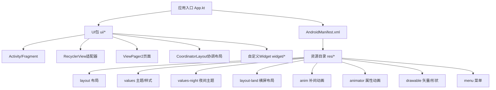
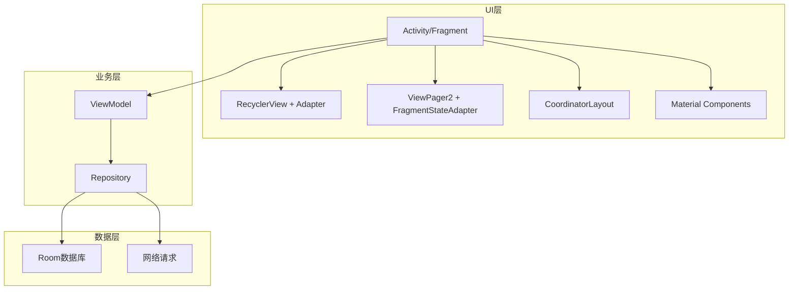
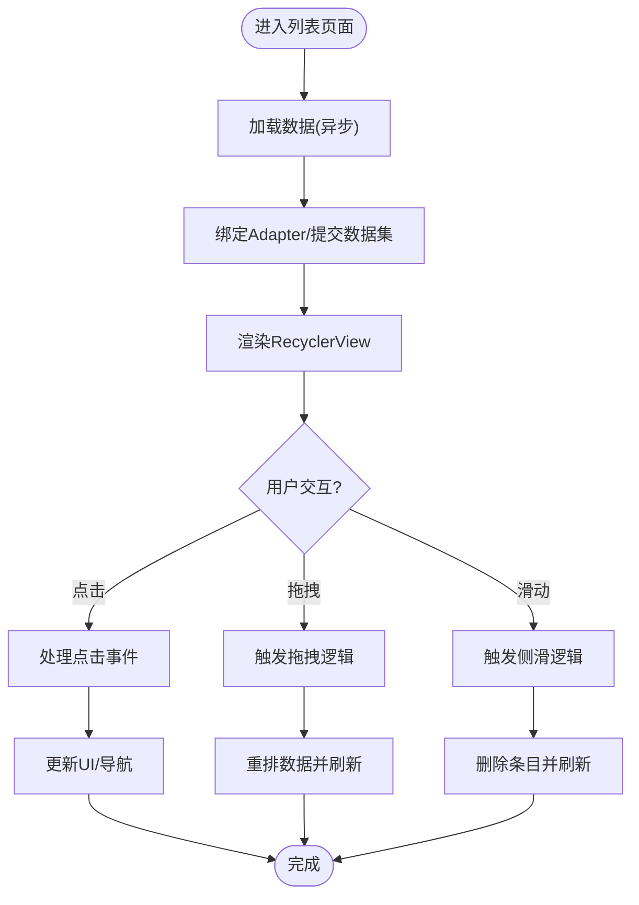
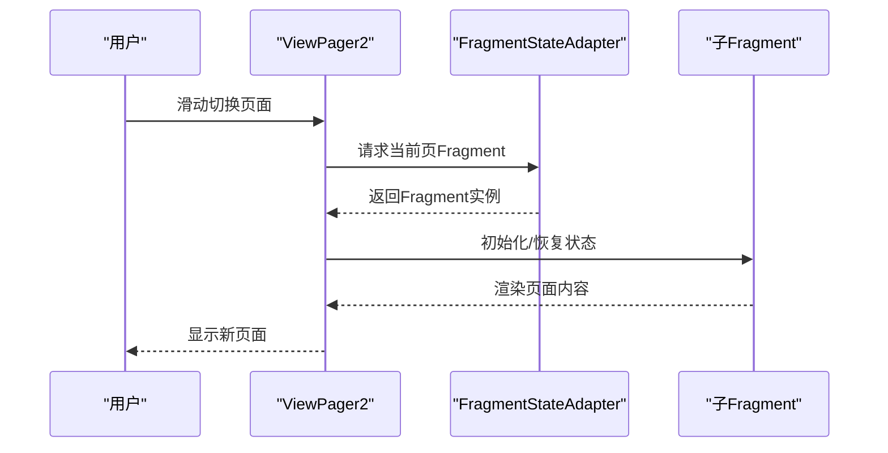
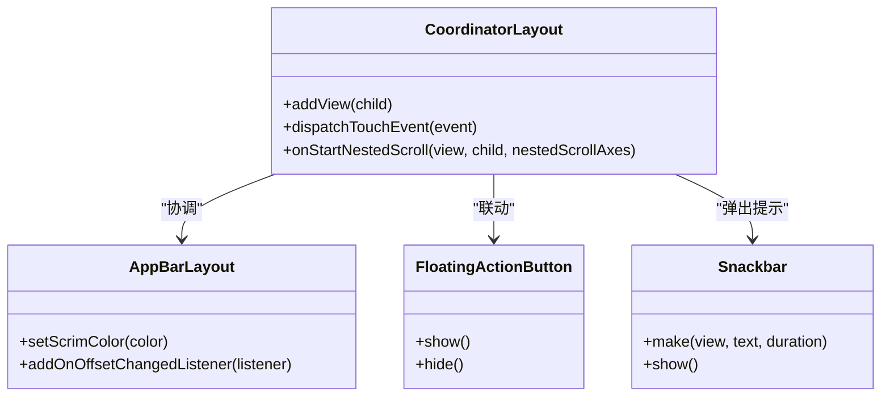
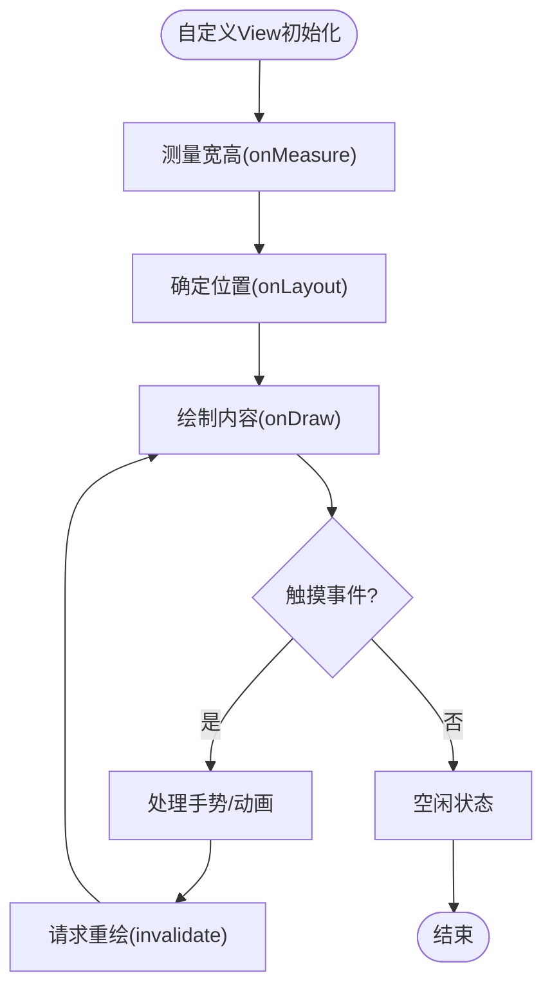
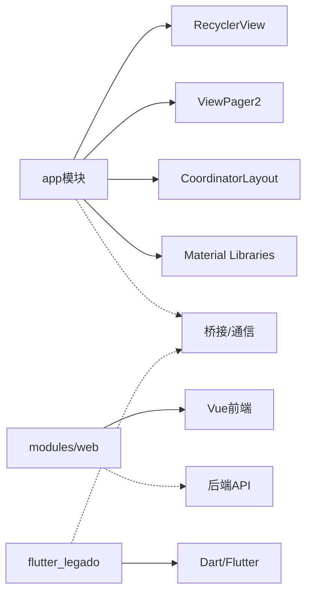

# UI组件和布局

<cite>
**本文引用的文件**   
- [App.kt](file://app/src/main/java/io/legado/app/App.kt)
- [AndroidManifest.xml](file://app/src/main/AndroidManifest.xml)
- [build.gradle](file://app/build.gradle)
- [layout目录](file://app/src/main/res/layout)
- [values主题与样式](file://app/src/main/res/values)
- [values-night夜间主题](file://app/src/main/res/values-night)
- [layout-land横屏布局](file://app/src/main/res/layout-land)
- [ui包结构](file://app/src/main/java/io/legado/app/ui)
- [widget自定义控件](file://app/src/main/java/io/legado/app/ui/widget)
- [anim动画资源](file://app/src/main/res/anim)
- [animator属性动画](file://app/src/main/res/animator)
- [drawable矢量与形状](file://app/src/main/res/drawable)
- [menu菜单资源](file://app/src/main/res/menu)
- [web模块入口](file://modules/web/src/main.ts)
- [Flutter主入口](file://flutter_legado/lib/main.dart)
</cite>

## 目录
1. [简介](#简介)
2. [项目结构](#项目结构)
3. [核心组件](#核心组件)
4. [架构总览](#架构总览)
5. [详细组件分析](#详细组件分析)
6. [依赖分析](#依赖分析)
7. [性能考虑](#性能考虑)
8. [故障排查指南](#故障排查指南)
9. [结论](#结论)
10. [附录](#附录)

## 简介
本文件聚焦于Legado项目的UI组件与布局设计，系统阐述Material Design组件的使用与扩展（RecyclerView、ViewPager2、CoordinatorLayout等），响应式布局策略（多屏幕适配、横竖屏切换、平板优化），自定义View开发（绘图、动画、交互），主题系统（动态换肤、夜间模式、颜色管理），并提供可复用UI组件与复杂布局/动画的实现思路。同时涵盖无障碍支持与性能优化建议，帮助读者快速掌握并高效扩展应用界面。

## 项目结构
本项目采用多模块组织：原生Android应用（app）、Web管理端（modules/web）、Flutter跨平台层（flutter_legado）以及Rust核心库（rust）。UI相关代码主要集中在app的java/io/legado/app/ui与res资源目录中，并通过AndroidManifest进行声明；主题与样式通过values与values-night区分；横屏布局通过layout-land提供；动画与绘制资源位于anim、animator、drawable等目录。

图表来源
- [App.kt:1-200](file://app/src/main/java/io/legado/app/App.kt#L1-L200)
- [AndroidManifest.xml:1-200](file://app/src/main/AndroidManifest.xml#L1-L200)
- [layout目录](file://app/src/main/res/layout)
- [values主题与样式](file://app/src/main/res/values)
- [values-night夜间主题](file://app/src/main/res/values-night)
- [layout-land横屏布局](file://app/src/main/res/layout-land)
- [anim动画资源](file://app/src/main/res/anim)
- [animator属性动画](file://app/src/main/res/animator)
- [drawable矢量与形状](file://app/src/main/res/drawable)
- [menu菜单资源](file://app/src/main/res/menu)

章节来源
- [App.kt:1-200](file://app/src/main/java/io/legado/app/App.kt#L1-L200)
- [AndroidManifest.xml:1-200](file://app/src/main/AndroidManifest.xml#L1-L200)
- [build.gradle:1-200](file://app/build.gradle#L1-L200)

## 核心组件
- RecyclerView：用于书籍列表、目录、搜索结果等长列表展示。结合DiffUtil实现高效刷新，配合ItemDecoration与ItemAnimator增强交互体验。
- ViewPager2：用于分页内容（如阅读器翻页、设置页签），支持垂直/水平滑动与嵌套滚动。
- CoordinatorLayout：作为顶层容器，协调AppBarLayout、FloatingActionButton、Snackbar等联动行为，实现Material Design的滚动与手势效果。
- Material Components：使用MaterialButton、TextInputLayout、TabLayout、BottomNavigationView等构建一致的视觉风格。
- ConstraintLayout：作为主要布局容器，提升复杂布局性能与灵活性。
- CardView/LinearLayout/RelativeLayout：组合使用以构建卡片化内容与基础布局。

章节来源
- [layout目录](file://app/src/main/res/layout)
- [ui包结构](file://app/src/main/java/io/legado/app/ui)

## 架构总览
UI层由Activity/Fragment承载页面生命周期，通过ViewModel管理状态，Repository访问数据源（本地数据库/网络）。UI组件通过Adapter/FragmentStateAdapter绑定数据，CoordinatorLayout协调滚动与悬浮元素，Theme与Style统一外观，Night Mode自动切换配色。

图表来源
- [ui包结构](file://app/src/main/java/io/legado/app/ui)
- [layout目录](file://app/src/main/res/layout)

## 详细组件分析

### RecyclerView定制与扩展
- 数据绑定：使用ListAdapter或RecyclerView.Adapter，结合DiffUtil减少不必要的刷新。
- 交互增强：ItemTouchHelper实现拖拽排序与侧滑删除；OnItemClickListener处理点击事件。
- 视觉定制：ItemDecoration添加分隔线、间距；ItemAnimator配置增删改动画。
- 性能优化：视图复用、预取、延迟加载图片、避免在onBindViewHolder中进行耗时操作。

图表来源
- [layout目录](file://app/src/main/res/layout)
- [ui包结构](file://app/src/main/java/io/legado/app/ui)

章节来源
- [layout目录](file://app/src/main/res/layout)
- [ui包结构](file://app/src/main/java/io/legado/app/ui)

### ViewPager2页面与嵌套滚动
- 页面管理：FragmentStateAdapter管理子Fragment，按需创建与销毁。
- 滑动控制：setOrientation设置方向；setUserInputEnabled禁用/启用用户输入。
- 嵌套滚动：与CoordinatorLayout配合实现顶部工具栏折叠、底部导航联动。
- 性能优化：offscreenPageLimit合理设置；懒加载数据；避免频繁重建Fragment。

图表来源
- [layout目录](file://app/src/main/res/layout)
- [ui包结构](file://app/src/main/java/io/legado/app/ui)

章节来源
- [layout目录](file://app/src/main/res/layout)
- [ui包结构](file://app/src/main/java/io/legado/app/ui)

### CoordinatorLayout协调布局
- AppBarLayout与Toolbar：实现滚动折叠、固定标题栏。
- FloatingActionButton：与Snackbar、BottomSheet联动，提供快捷操作。
- Behavior定制：自定义Behavior实现特殊滚动行为（如隐藏/显示、弹性回弹）。
- 嵌套滚动：NestedScrollView与RecyclerView协同，避免滚动冲突。

图表来源
- [layout目录](file://app/src/main/res/layout)
- [menu菜单资源](file://app/src/main/res/menu)

章节来源
- [layout目录](file://app/src/main/res/layout)
- [menu菜单资源](file://app/src/main/res/menu)

### 响应式布局与多设备适配
- 资源限定符：使用layout-land、sw600dp、w600dp-h900dp等适配横屏与平板。
- 约束布局：ConstraintLayout搭配Guideline、Barrier、Chains构建灵活布局。
- 密度无关像素：统一使用dp/sp，确保不同DPI设备一致性。
- 动态尺寸：根据屏幕宽度计算列数（网格布局）、字体大小（sp）、边距（dp）。

章节来源
- [layout-land横屏布局](file://app/src/main/res/layout-land)
- [values主题与样式](file://app/src/main/res/values)

### 自定义View开发
- 绘图：继承View/TextView，重写onDraw使用Canvas绘制图形、文本、图像。
- 动画：使用ValueAnimator/ObjectAnimator实现属性动画；结合Transition框架做页面过渡。
- 交互：处理MotionEvent实现触摸、手势识别（GestureDetector、ScaleGestureDetector）。
- 性能：避免在onDraw中分配对象；使用硬件加速；批量绘制。

图表来源
- [drawable矢量与形状](file://app/src/main/res/drawable)
- [anim动画资源](file://app/src/main/res/anim)
- [animator属性动画](file://app/src/main/res/animator)

章节来源
- [drawable矢量与形状](file://app/src/main/res/drawable)
- [anim动画资源](file://app/src/main/res/anim)
- [animator属性动画](file://app/src/main/res/animator)

### 主题系统与动态换肤
- 主题定义：在values/styles.xml中定义Theme，使用colorPrimary、colorAccent等Material属性。
- 夜间模式：values-night下覆盖颜色与背景，系统自动切换。
- 动态换肤：运行时修改Theme属性，使用Resources.Theme.applyStyle或自定义ColorManager。
- 字体与图标：通过TypefaceSpan与VectorDrawable实现字体与图标主题化。

章节来源
- [values主题与样式](file://app/src/main/res/values)
- [values-night夜间主题](file://app/src/main/res/values-night)

## 依赖分析
UI层依赖Material Components与AndroidX库，通过Gradle引入。核心依赖包括RecyclerView、ViewPager2、CoordinatorLayout、ConstraintLayout、MaterialDesign等。Web模块与Flutter模块分别提供Web管理与跨平台界面，与原生层通过桥接通信。

图表来源
- [build.gradle:1-200](file://app/build.gradle#L1-L200)
- [web模块入口](file://modules/web/src/main.ts)
- [Flutter主入口](file://flutter_legado/lib/main.dart)

章节来源
- [build.gradle:1-200](file://app/build.gradle#L1-L200)
- [web模块入口](file://modules/web/src/main.ts)
- [Flutter主入口](file://flutter_legado/lib/main.dart)

## 性能考虑
- 列表优化：使用DiffUtil、视图复用、延迟加载图片、限制item高度。
- 内存管理：避免大对象在onCreate/onBind中创建；及时释放Bitmap与动画资源。
- 绘制优化：减少onDraw中的对象分配；使用硬件加速；合并绘制调用。
- 动画优化：使用属性动画而非逐帧动画；避免在主线程执行耗时任务。
- 布局优化：优先ConstraintLayout；减少层级嵌套；使用merge/include复用布局。

## 故障排查指南
- 滚动冲突：检查NestedScrollView与RecyclerView嵌套，使用nestedScrollingEnabled与requestDisallowInterceptTouchEvent解决。
- 内存泄漏：确认Fragment/Activity生命周期内未持有外部引用；使用LeakCanary检测。
- 主题不生效：检查values-night是否覆盖正确；确认Theme在Application中设置。
- 动画卡顿：避免在onDraw中执行复杂计算；使用Traceview分析性能瓶颈。

## 结论
Legado的UI体系基于Material Design与AndroidX组件，通过RecyclerView、ViewPager2、CoordinatorLayout等构建高效、可定制的界面。响应式布局与主题系统确保多设备一致体验，自定义View与动画增强交互。遵循性能优化与无障碍最佳实践，可进一步提升用户体验与可维护性。

## 附录
- 无障碍支持：为关键控件设置contentDescription；确保焦点顺序合理；使用TalkBack兼容。
- 代码示例路径：参考layout目录中的XML布局与ui包中的Kotlin类，学习具体实现。
- 第三方库：查看build.gradle中依赖版本，确保兼容性。