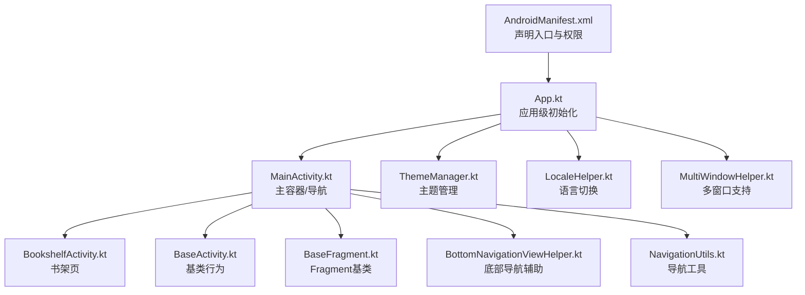
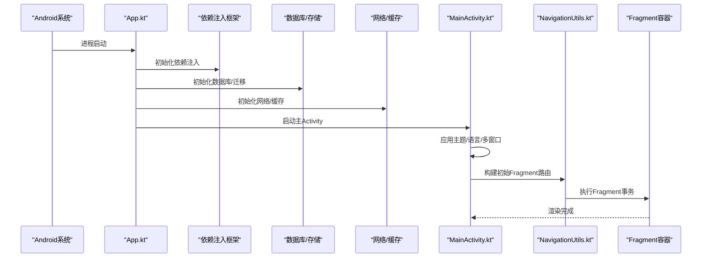
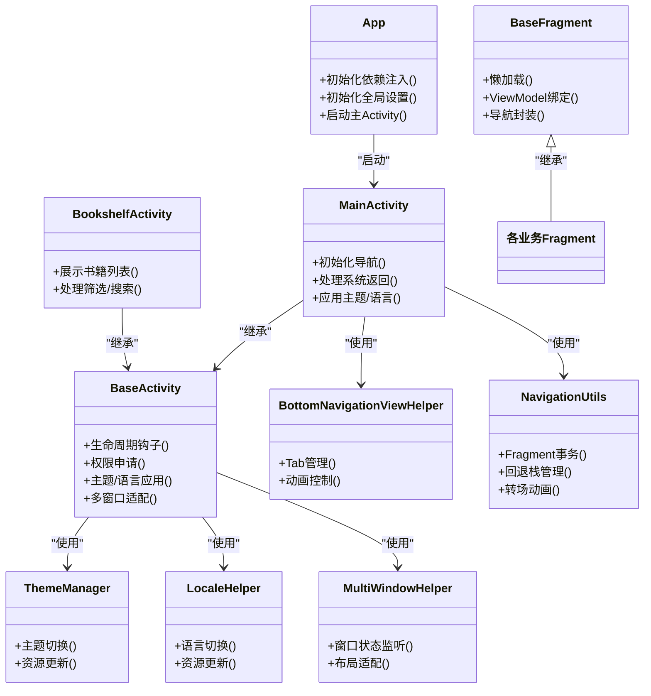

# 应用结构和导航

<cite>
**本文引用的文件**
- [App.kt](file://app/src/main/java/io/legado/app/App.kt)
- [AndroidManifest.xml](file://app/src/main/AndroidManifest.xml)
- [MainActivity.kt](file://app/src/main/java/io/legado/app/ui/main/MainActivity.kt)
- [BookshelfActivity.kt](file://app/src/main/java/io/legado/app/ui/bookshelf/BookshelfActivity.kt)
- [BaseActivity.kt](file://app/src/main/java/io/legado/app/base/BaseActivity.kt)
- [BaseFragment.kt](file://app/src/main/java/io/legado/app/base/BaseFragment.kt)
- [BottomNavigationViewHelper.kt](file://app/src/main/java/io/legado/app/utils/BottomNavigationViewHelper.kt)
- [ThemeManager.kt](file://app/src/main/java/io/legado/app/help/ThemeManager.kt)
- [LocaleHelper.kt](file://app/src/main/java/io/legado/app/help/LocaleHelper.kt)
- [MultiWindowHelper.kt](file://app/src/main/java/io/legado/app/help/MultiWindowHelper.kt)
- [NavigationUtils.kt](file://app/src/main/java/io/legado/app/utils/NavigationUtils.kt)
- [IntentData.kt](file://app/src/main/java/io/legado/app/data/IntentData.kt)
</cite>

## 目录
1. [简介](#简介)
2. [项目结构](#项目结构)
3. [核心组件](#核心组件)
4. [架构总览](#架构总览)
5. [详细组件分析](#详细组件分析)
6. [依赖关系分析](#依赖关系分析)
7. [性能考虑](#性能考虑)
8. [故障排查指南](#故障排查指南)
9. [结论](#结论)
10. [附录](#附录)

## 简介
本文件面向 Android 端的“Legado”应用，聚焦于应用结构与导航系统。内容涵盖：
- 应用启动流程与初始化（App.kt）
- 依赖注入配置与全局设置
- 主要活动页面职责与生命周期管理（MainActivity、BookshelfActivity 等）
- Fragment 导航架构（含 BottomNavigationView 集成、切换动画、状态保存）
- 主题系统、语言切换与多窗口支持
- 新增活动页面与页面间数据传递的实践示例

## 项目结构
Android 模块位于 app/src/main/java/io/legado/app，UI 层按功能划分包（ui/*），基础能力在 base/*，工具与帮助类在 utils/* 与 help/*。清单文件定义入口 Activity 与权限、主题、多窗口等系统能力。

图表来源
- [AndroidManifest.xml](file://app/src/main/AndroidManifest.xml)
- [App.kt](file://app/src/main/java/io/legado/app/App.kt)
- [MainActivity.kt](file://app/src/main/java/io/legado/app/ui/main/MainActivity.kt)
- [BookshelfActivity.kt](file://app/src/main/java/io/legado/app/ui/bookshelf/BookshelfActivity.kt)
- [BaseActivity.kt](file://app/src/main/java/io/legado/app/base/BaseActivity.kt)
- [BaseFragment.kt](file://app/src/main/java/io/legado/app/base/BaseFragment.kt)
- [BottomNavigationViewHelper.kt](file://app/src/main/java/io/legado/app/utils/BottomNavigationViewHelper.kt)
- [NavigationUtils.kt](file://app/src/main/java/io/legado/app/utils/NavigationUtils.kt)
- [ThemeManager.kt](file://app/src/main/java/io/legado/app/help/ThemeManager.kt)
- [LocaleHelper.kt](file://app/src/main/java/io/legado/app/help/LocaleHelper.kt)
- [MultiWindowHelper.kt](file://app/src/main/java/io/legado/app/help/MultiWindowHelper.kt)

章节来源
- [AndroidManifest.xml](file://app/src/main/AndroidManifest.xml)
- [App.kt](file://app/src/main/java/io/legado/app/App.kt)

## 核心组件
- App.kt：应用进程入口，负责依赖注入初始化、日志/崩溃收集、数据库/网络/存储等全局初始化，以及主题、语言、多窗口等全局设置。
- MainActivity.kt：主容器 Activity，承载底部导航与 Fragment 容器，处理系统返回、横竖屏、多窗口事件。
- BookshelfActivity.kt：书架页 Activity，展示书籍列表与筛选操作，通常作为默认首页或独立入口。
- BaseActivity.kt：所有 Activity 的基类，统一生命周期钩子、权限申请、主题/语言应用、多窗口适配等。
- BaseFragment.kt：Fragment 基类，封装懒加载、生命周期回调、ViewModel 绑定、导航跳转等通用逻辑。
- BottomNavigationViewHelper.kt：底部导航栏辅助类，提供选中态、图标切换、点击拦截、动画控制等。
- NavigationUtils.kt：导航工具，封装 Fragment 事务、回退栈、转场动画、参数传递等。
- ThemeManager.kt：主题管理器，负责深色模式、自定义主题色、夜间资源切换。
- LocaleHelper.kt：本地化工具，负责语言切换、资源更新、重启策略。
- MultiWindowHelper.kt：多窗口助手，处理分屏/画中画、尺寸变化、布局适配。

章节来源
- [App.kt](file://app/src/main/java/io/legado/app/App.kt)
- [MainActivity.kt](file://app/src/main/java/io/legado/app/ui/main/MainActivity.kt)
- [BookshelfActivity.kt](file://app/src/main/java/io/legado/app/ui/bookshelf/BookshelfActivity.kt)
- [BaseActivity.kt](file://app/src/main/java/io/legado/app/base/BaseActivity.kt)
- [BaseFragment.kt](file://app/src/main/java/io/legado/app/base/BaseFragment.kt)
- [BottomNavigationViewHelper.kt](file://app/src/main/java/io/legado/app/utils/BottomNavigationViewHelper.kt)
- [NavigationUtils.kt](file://app/src/main/java/io/legado/app/utils/NavigationUtils.kt)
- [ThemeManager.kt](file://app/src/main/java/io/legado/app/help/ThemeManager.kt)
- [LocaleHelper.kt](file://app/src/main/java/io/legado/app/help/LocaleHelper.kt)
- [MultiWindowHelper.kt](file://app/src/main/java/io/legado/app/help/MultiWindowHelper.kt)

## 架构总览
下图展示了从应用启动到主界面导航的关键调用链与组件交互。

图表来源
- [App.kt](file://app/src/main/java/io/legado/app/App.kt)
- [MainActivity.kt](file://app/src/main/java/io/legado/app/ui/main/MainActivity.kt)
- [NavigationUtils.kt](file://app/src/main/java/io/legado/app/utils/NavigationUtils.kt)

## 详细组件分析

### 应用启动与初始化（App.kt）
- 依赖注入：在进程启动时创建并配置 DI 容器，注册单例服务（数据库、网络、存储、配置中心等）。
- 全局初始化：初始化日志、崩溃收集、数据库版本迁移、缓存清理、网络客户端、字体/主题资源预热。
- 全局设置：读取用户偏好，应用主题、语言、多窗口模式、深色模式、字体大小等。
- 异常兜底：捕获未处理异常并上报，确保进程稳定。

章节来源
- [App.kt](file://app/src/main/java/io/legado/app/App.kt)

### 主容器与导航（MainActivity.kt）
- 职责：作为应用主容器，持有底部导航与 Fragment 容器；处理系统返回键、横竖屏切换、多窗口尺寸变化。
- 生命周期：onCreate 中完成主题/语言应用与导航初始化；onResume 恢复状态；onBackPressed 处理回退栈。
- 导航：通过 NavigationUtils 进行 Fragment 事务，维护回退栈与转场动画；与 BottomNavigationView 联动。

章节来源
- [MainActivity.kt](file://app/src/main/java/io/legado/app/ui/main/MainActivity.kt)
- [NavigationUtils.kt](file://app/src/main/java/io/legado/app/utils/NavigationUtils.kt)

### 书架页（BookshelfActivity.kt）
- 职责：展示书籍列表、搜索、筛选、排序、批量操作；可独立启动或作为默认首页。
- 生命周期：继承 BaseActivity，复用通用生命周期钩子；在 onCreate/onResume 中刷新数据与状态。
- 导航：跳转到详情页、阅读器、设置页等，使用统一的 Intent/Fragment 参数传递方式。

章节来源
- [BookshelfActivity.kt](file://app/src/main/java/io/legado/app/ui/bookshelf/BookshelfActivity.kt)
- [BaseActivity.kt](file://app/src/main/java/io/legado/app/base/BaseActivity.kt)

### 基类与通用能力（BaseActivity.kt / BaseFragment.kt）
- BaseActivity：统一权限申请、主题/语言应用、多窗口适配、生命周期钩子、错误提示、进度条控制。
- BaseFragment：统一懒加载、ViewModel 绑定、生命周期回调、导航封装、参数解析、状态保存与恢复。

章节来源
- [BaseActivity.kt](file://app/src/main/java/io/legado/app/base/BaseActivity.kt)
- [BaseFragment.kt](file://app/src/main/java/io/legado/app/base/BaseFragment.kt)

### 底部导航与切换动画（BottomNavigationViewHelper.kt）
- 功能：统一管理底部 Tab 的选中态、图标切换、点击拦截、禁用项、动画效果。
- 集成：与 MainActivity 的 Fragment 容器协作，实现无闪烁切换与平滑过渡。
- 扩展：支持动态添加/隐藏 Tab、角标、长按菜单等。

章节来源
- [BottomNavigationViewHelper.kt](file://app/src/main/java/io/legado/app/utils/BottomNavigationViewHelper.kt)
- [MainActivity.kt](file://app/src/main/java/io/legado/app/ui/main/MainActivity.kt)

### 导航工具（NavigationUtils.kt）
- 功能：封装 Fragment 事务、回退栈管理、转场动画、参数传递、状态保存与恢复。
- 方法：push/pop、replace、addToBackStack、setCustomAnimations、saveInstanceState、restoreState。
- 最佳实践：避免重复入栈、合理管理回退栈、保证数据一致性。

章节来源
- [NavigationUtils.kt](file://app/src/main/java/io/legado/app/utils/NavigationUtils.kt)

### 主题系统（ThemeManager.kt）
- 功能：管理浅色/深色主题、自定义主题色、夜间资源切换、字体大小与密度。
- 集成：在 BaseActivity 中应用主题，监听系统设置变化，持久化用户选择。
- 扩展：支持动态换肤、主题预览、热重载。

章节来源
- [ThemeManager.kt](file://app/src/main/java/io/legado/app/help/ThemeManager.kt)
- [BaseActivity.kt](file://app/src/main/java/io/legado/app/base/BaseActivity.kt)

### 语言切换（LocaleHelper.kt）
- 功能：切换应用语言、更新资源、必要时重启 Activity 以生效。
- 集成：在 BaseActivity 中应用语言，监听系统语言变化，持久化用户选择。
- 注意：避免频繁重启导致体验下降，可采用局部刷新策略。

章节来源
- [LocaleHelper.kt](file://app/src/main/java/io/legado/app/help/LocaleHelper.kt)
- [BaseActivity.kt](file://app/src/main/java/io/legado/app/base/BaseActivity.kt)

### 多窗口支持（MultiWindowHelper.kt）
- 功能：处理分屏/画中画、尺寸变化、布局适配、键盘弹出、焦点管理。
- 集成：在 BaseActivity 中监听窗口状态变化，动态调整 UI。
- 建议：为不同窗口尺寸提供备用布局，确保可读性与可操作性。

章节来源
- [MultiWindowHelper.kt](file://app/src/main/java/io/legado/app/help/MultiWindowHelper.kt)
- [BaseActivity.kt](file://app/src/main/java/io/legado/app/base/BaseActivity.kt)

### 新增活动页面与数据传递示例
- 新增活动步骤：
  - 在清单文件中声明新 Activity 及入口属性。
  - 创建 Activity 类并继承 BaseActivity，实现必要生命周期。
  - 在 MainActivity 的导航配置中添加路由（如需要）。
  - 使用 NavigationUtils 或 Intent 进行跳转。
- 数据传递方式：
  - Intent 携带 Bundle/Parcelable/Kotlin 序列化对象。
  - Fragment 之间通过 NavigationArgs/ViewModel/共享数据源。
  - 复杂数据建议使用 Repository/Store 并通过 ID 引用。

章节来源
- [AndroidManifest.xml](file://app/src/main/AndroidManifest.xml)
- [MainActivity.kt](file://app/src/main/java/io/legado/app/ui/main/MainActivity.kt)
- [NavigationUtils.kt](file://app/src/main/java/io/legado/app/utils/NavigationUtils.kt)
- [IntentData.kt](file://app/src/main/java/io/legado/app/data/IntentData.kt)

## 依赖关系分析
下图展示关键组件之间的依赖关系与调用方向。

图表来源
- [App.kt](file://app/src/main/java/io/legado/app/App.kt)
- [MainActivity.kt](file://app/src/main/java/io/legado/app/ui/main/MainActivity.kt)
- [BookshelfActivity.kt](file://app/src/main/java/io/legado/app/ui/bookshelf/BookshelfActivity.kt)
- [BaseActivity.kt](file://app/src/main/java/io/legado/app/base/BaseActivity.kt)
- [BaseFragment.kt](file://app/src/main/java/io/legado/app/base/BaseFragment.kt)
- [BottomNavigationViewHelper.kt](file://app/src/main/java/io/legado/app/utils/BottomNavigationViewHelper.kt)
- [NavigationUtils.kt](file://app/src/main/java/io/legado/app/utils/NavigationUtils.kt)
- [ThemeManager.kt](file://app/src/main/java/io/legado/app/help/ThemeManager.kt)
- [LocaleHelper.kt](file://app/src/main/java/io/legado/app/help/LocaleHelper.kt)
- [MultiWindowHelper.kt](file://app/src/main/java/io/legado/app/help/MultiWindowHelper.kt)

章节来源
- [App.kt](file://app/src/main/java/io/legado/app/App.kt)
- [MainActivity.kt](file://app/src/main/java/io/legado/app/ui/main/MainActivity.kt)
- [BaseActivity.kt](file://app/src/main/java/io/legado/app/base/BaseActivity.kt)

## 性能考虑
- 启动优化：延迟非关键初始化，按需加载资源，减少冷启动耗时。
- 导航性能：避免频繁 Fragment 重建，合理使用单例与 ViewModel，减少内存抖动。
- 列表性能：使用分页加载、视图回收、图片异步加载与缓存。
- 主题/语言切换：批量更新资源，避免逐控件刷新。
- 多窗口：为不同尺寸提供轻量布局，避免重绘开销。

## 故障排查指南
- 启动崩溃：检查 App.kt 中的依赖注入与全局初始化顺序，确认数据库/网络初始化成功。
- 导航异常：检查 NavigationUtils 的事务与回退栈管理，避免重复入栈或空引用。
- 主题/语言不生效：确认 BaseActivity 中应用顺序，必要时重启 Activity。
- 多窗口错乱：检查窗口尺寸监听与布局适配逻辑，确保备用布局可用。
- 数据丢失：检查 Fragment 状态保存与恢复逻辑，确保关键数据持久化。

章节来源
- [App.kt](file://app/src/main/java/io/legado/app/App.kt)
- [NavigationUtils.kt](file://app/src/main/java/io/legado/app/utils/NavigationUtils.kt)
- [BaseActivity.kt](file://app/src/main/java/io/legado/app/base/BaseActivity.kt)

## 结论
本文件系统化梳理了 Legado Android 应用的启动流程、导航架构与核心组件职责。通过统一的基类与工具库，实现了主题、语言、多窗口的全局管理与 Fragment 导航的标准化。遵循本文档的最佳实践，可高效扩展新功能并保持代码一致性与可维护性。

## 附录
- 清单文件：用于声明入口、权限、主题、多窗口等系统能力。
- 数据模型：IntentData 用于跨页面数据传递的结构化定义。
- 测试建议：对导航流程、主题/语言切换、多窗口适配编写单元测试与 UI 测试。

章节来源
- [AndroidManifest.xml](file://app/src/main/AndroidManifest.xml)
- [IntentData.kt](file://app/src/main/java/io/legado/app/data/IntentData.kt)