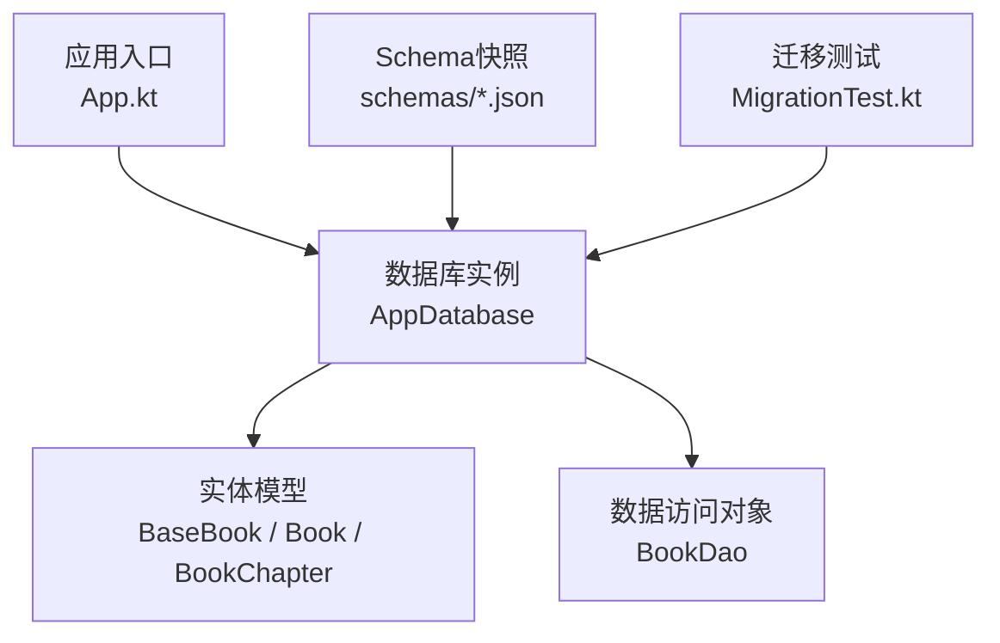
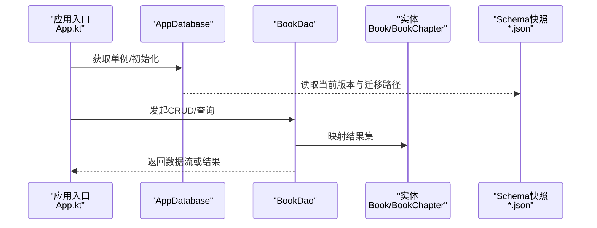
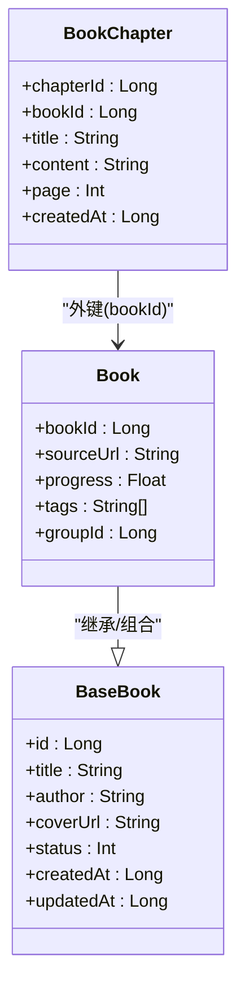
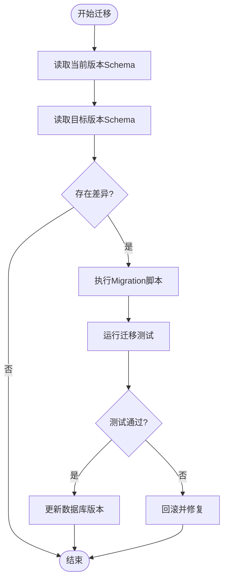
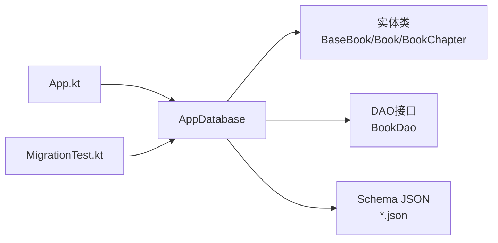

# Room数据库设计

<cite>
**本文档引用的文件**   
- [App.kt](file://app/src/main/java/io/legado/app/App.kt)
- [AppDatabase.java](file://app/schemas/io.legado.app.data.AppDatabase/1.json)
- [Book实体](file://app/src/main/java/io/legado/app/data/entities/Book.kt)
- [BaseBook实体](file://app/src/main/java/io/legado/app/data/entities/BaseBook.kt)
- [BookChapter实体](file://app/src/main/java/io/legado/app/data/entities/BookChapter.kt)
- [BookDao接口](file://app/src/main/java/io/legado/app/data/dao/BookDao.kt)
- [Migration测试](file://app/src/androidTest/java/io/legado/app/MigrationTest.kt)
</cite>

## 目录
1. [简介](#简介)
2. [项目结构](#项目结构)
3. [核心组件](#核心组件)
4. [架构总览](#架构总览)
5. [详细组件分析](#详细组件分析)
6. [依赖关系分析](#依赖关系分析)
7. [性能考虑](#性能考虑)
8. [故障排查指南](#故障排查指南)
9. [结论](#结论)
10. [附录](#附录)

## 简介
本文件面向Legado项目的Room数据库设计与实现，聚焦以下目标：
- AppDatabase主类的配置与初始化：数据库版本管理、迁移策略、连接池设置。
- 实体类设计模式：BaseBook、Book、BookChapter等核心实体的字段定义、关系映射与注解使用。
- DAO接口设计原则：CRUD操作、复杂查询、事务处理与异步操作。
- 数据库迁移机制：Schema文件管理与Migration实现。
- 数据操作示例：数据写入、查询优化与错误处理。
- 性能调优建议与最佳实践。

## 项目结构
本项目在Android模块中采用Room进行本地持久化，Schema快照按版本号保存在schemas目录下，便于迁移验证与回滚。核心代码位于app/src/main/java/io/legado/app下，包含App入口、data层（entities与dao）、以及迁移测试用例。

图表来源
- [App.kt](file://app/src/main/java/io/legado/app/App.kt)
- [AppDatabase.java](file://app/schemas/io.legado.app.data.AppDatabase/1.json)
- [Book实体](file://app/src/main/java/io/legado/app/data/entities/Book.kt)
- [BaseBook实体](file://app/src/main/java/io/legado/app/data/entities/BaseBook.kt)
- [BookChapter实体](file://app/src/main/java/io/legado/app/data/entities/BookChapter.kt)
- [BookDao接口](file://app/src/main/java/io/legado/app/data/dao/BookDao.kt)
- [Migration测试](file://app/src/androidTest/java/io/legado/app/MigrationTest.kt)

章节来源
- [App.kt](file://app/src/main/java/io/legado/app/App.kt)
- [AppDatabase.java](file://app/schemas/io.legado.app.data.AppDatabase/1.json)

## 核心组件
- AppDatabase：Room数据库的主类，负责数据库名称、版本、实体注册、DAO暴露、迁移策略与连接池参数配置。
- 实体类：BaseBook作为公共基类，Book与BookChapter继承或组合使用，定义字段、主键、索引与关联关系。
- DAO接口：提供增删改查、复杂查询、事务边界与协程/Flow异步能力。
- Schema与迁移：通过JSON快照记录各版本表结构；Migration用于跨版本增量升级。

章节来源
- [App.kt](file://app/src/main/java/io/legado/app/App.kt)
- [Book实体](file://app/src/main/java/io/legado/app/data/entities/Book.kt)
- [BaseBook实体](file://app/src/main/java/io/legado/app/data/entities/BaseBook.kt)
- [BookChapter实体](file://app/src/main/java/io/legado/app/data/entities/BookChapter.kt)
- [BookDao接口](file://app/src/main/java/io/legado/app/data/dao/BookDao.kt)

## 架构总览
下图展示从应用入口到数据库的调用链路与组件职责划分。

图表来源
- [App.kt](file://app/src/main/java/io/legado/app/App.kt)
- [AppDatabase.java](file://app/schemas/io.legado.app.data.AppDatabase/1.json)
- [Book实体](file://app/src/main/java/io/legado/app/data/entities/Book.kt)
- [BookChapter实体](file://app/src/main/java/io/legado/app/data/entities/BookChapter.kt)
- [BookDao接口](file://app/src/main/java/io/legado/app/data/dao/BookDao.kt)

## 详细组件分析

### AppDatabase主类：配置与初始化
- 数据库名称与版本：集中管理数据库名与当前版本，确保与Schema快照一致。
- 实体注册：声明所有@Entity类，使Room生成对应表结构。
- DAO暴露：以抽象方法形式暴露DAO，供上层注入使用。
- 迁移策略：通过addMigrations()注册Migration实例，支持多步升级。
- 连接池与线程：配置allowMainThreadQueries（通常为false）、maxConcurrency、journalMode、foreignKeysEnable等，保证并发与一致性。
- 回调与日志：可添加Callback用于统计或调试，启用SQL日志便于问题定位。

章节来源
- [App.kt](file://app/src/main/java/io/legado/app/App.kt)
- [AppDatabase.java](file://app/schemas/io.legado.app.data.AppDatabase/1.json)

### 实体类设计模式
- BaseBook：抽取书籍通用字段（如id、书名、作者、封面、状态、时间戳等），减少重复定义，提升复用性。
- Book：继承或组合BaseBook，扩展阅读进度、来源信息、标签、分组等字段；定义@PrimaryKey、@Index、@ColumnInfo等注解。
- BookChapter：定义章节id、所属bookId、标题、内容、页码、时间戳等；建立与Book的外键关系（可选）。
- 关系映射：使用@ForeignKey、@Relation、@Embedded等注解表达一对多、嵌入与复合主键。
- 命名与类型：统一使用Kotlin数据类型与默认值，避免空指针；对大文本字段使用TEXT并谨慎索引。

图表来源
- [BaseBook实体](file://app/src/main/java/io/legado/app/data/entities/BaseBook.kt)
- [Book实体](file://app/src/main/java/io/legado/app/data/entities/Book.kt)
- [BookChapter实体](file://app/src/main/java/io/legado/app/data/entities/BookChapter.kt)

章节来源
- [BaseBook实体](file://app/src/main/java/io/legado/app/data/entities/BaseBook.kt)
- [Book实体](file://app/src/main/java/io/legado/app/data/entities/Book.kt)
- [BookChapter实体](file://app/src/main/java/io/legado/app/data/entities/BookChapter.kt)

### DAO接口设计原则
- CRUD操作：为每个实体提供insert/update/delete/getById等方法，尽量使用批量API提升吞吐。
- 复杂查询：使用@Query编写SQL，结合@Bind、IN、JOIN、GROUP BY、HAVING等；对高频条件建立索引。
- 事务处理：使用@Transaction包裹多步操作，保证原子性与一致性。
- 异步操作：返回suspend函数或Flow，避免阻塞UI线程；对大数据集使用分页（Paging）或LIMIT/OFFSET。
- 返回值设计：优先使用数据类与密封类封装成功/失败状态，便于上层处理。

章节来源
- [BookDao接口](file://app/src/main/java/io/legado/app/data/dao/BookDao.kt)

### 数据库迁移机制
- Schema文件管理：每个版本一个JSON文件，记录完整表结构与索引，便于对比与回滚。
- Migration实现：针对每次变更编写Migration，执行ALTER TABLE、新增索引、重建视图等语句。
- 迁移测试：通过MigrationTest校验跨版本升级的正确性与数据完整性。
- 最佳实践：小步快跑、幂等迁移、保留旧字段过渡期、避免破坏性变更。

图表来源
- [Migration测试](file://app/src/androidTest/java/io/legado/app/MigrationTest.kt)
- [AppDatabase.java](file://app/schemas/io.legado.app.data.AppDatabase/1.json)

章节来源
- [Migration测试](file://app/src/androidTest/java/io/legado/app/MigrationTest.kt)
- [AppDatabase.java](file://app/schemas/io.legado.app.data.AppDatabase/1.json)

### 数据操作示例与最佳实践
- 插入与批量写入：使用insertAll或事务包裹批量插入，减少锁竞争。
- 查询优化：为常用过滤字段建立索引；避免SELECT *，只取必要列；使用EXPLAIN ANALYZE分析慢查询。
- 分页与流式：对列表使用Flow+分页，避免一次性加载大量数据。
- 错误处理：捕获SQLiteException与ConstraintException，区分唯一约束冲突与系统异常，给出用户友好提示。
- 缓存与失效：对热点数据使用内存缓存，配合版本号或时间戳控制失效。

章节来源
- [BookDao接口](file://app/src/main/java/io/legado/app/data/dao/BookDao.kt)
- [Migration测试](file://app/src/androidTest/java/io/legado/app/MigrationTest.kt)

## 依赖关系分析
- AppDatabase依赖实体类与DAO，并通过Schema快照验证版本一致性。
- DAO依赖实体类进行结果映射。
- 迁移逻辑依赖Schema JSON与MigrationTest保障升级正确性。

图表来源
- [App.kt](file://app/src/main/java/io/legado/app/App.kt)
- [AppDatabase.java](file://app/schemas/io.legado.app.data.AppDatabase/1.json)
- [Book实体](file://app/src/main/java/io/legado/app/data/entities/Book.kt)
- [BaseBook实体](file://app/src/main/java/io/legado/app/data/entities/BaseBook.kt)
- [BookChapter实体](file://app/src/main/java/io/legado/app/data/entities/BookChapter.kt)
- [BookDao接口](file://app/src/main/java/io/legado/app/data/dao/BookDao.kt)
- [Migration测试](file://app/src/androidTest/java/io/legado/app/MigrationTest.kt)

章节来源
- [App.kt](file://app/src/main/java/io/legado/app/App.kt)
- [AppDatabase.java](file://app/schemas/io.legado.app.data.AppDatabase/1.json)

## 性能考虑
- 连接池与并发：合理设置maxConcurrency与journalMode（WAL），提高并发读写性能。
- 索引策略：为高频查询字段建立索引，避免全表扫描；注意索引维护成本。
- 事务边界：将相关写操作合并到单一事务，减少提交开销。
- 查询优化：避免N+1查询，使用JOIN或批量查询；限制返回列与行数。
- I/O与存储：大文本字段避免频繁更新；必要时分表或归档历史数据。
- 监控与诊断：开启SQL日志与慢查询分析，定期评估索引命中率。

[本节为通用指导，不直接分析具体文件]

## 故障排查指南
- 常见错误：
  - 版本不一致：检查AppDatabase版本与Schema JSON是否匹配。
  - 迁移失败：查看MigrationTest输出，确认脚本幂等与兼容性。
  - 约束冲突：识别唯一约束或外键约束冲突，调整数据或迁移脚本。
  - 主线程查询：确保allowMainThreadQueries=false，避免ANR。
- 排查步骤：
  - 启用SQL日志，定位慢查询与异常堆栈。
  - 使用Room提供的Schema对比工具，检查表结构差异。
  - 在测试环境复现问题，逐步缩小范围。
  - 对关键路径增加断言与埋点，快速定位根因。

章节来源
- [Migration测试](file://app/src/androidTest/java/io/legado/app/MigrationTest.kt)
- [App.kt](file://app/src/main/java/io/legado/app/App.kt)

## 结论
通过统一的AppDatabase配置、清晰的实体分层、规范的DAO设计与完善的迁移机制，Legado实现了稳定高效的本地数据持久化。遵循索引与事务的最佳实践，结合Schema快照与迁移测试，可在演进过程中保持数据一致性与系统性能。

[本节为总结性内容，不直接分析具体文件]

## 附录
- 术语说明：
  - Schema：数据库表结构的描述文件，通常以JSON保存。
  - Migration：数据库版本升级脚本，用于增量修改表结构。
  - DAO：数据访问对象，封装CRUD与复杂查询。
  - Flow：Kotlin异步数据流，适合流式与响应式查询。
- 参考路径：
  - 数据库入口与配置：[App.kt](file://app/src/main/java/io/legado/app/App.kt)
  - Schema快照：[AppDatabase.java](file://app/schemas/io.legado.app.data.AppDatabase/1.json)
  - 实体定义：[BaseBook实体](file://app/src/main/java/io/legado/app/data/entities/BaseBook.kt)、[Book实体](file://app/src/main/java/io/legado/app/data/entities/Book.kt)、[BookChapter实体](file://app/src/main/java/io/legado/app/data/entities/BookChapter.kt)
  - DAO接口：[BookDao接口](file://app/src/main/java/io/legado/app/data/dao/BookDao.kt)
  - 迁移测试：[Migration测试](file://app/src/androidTest/java/io/legado/app/MigrationTest.kt)