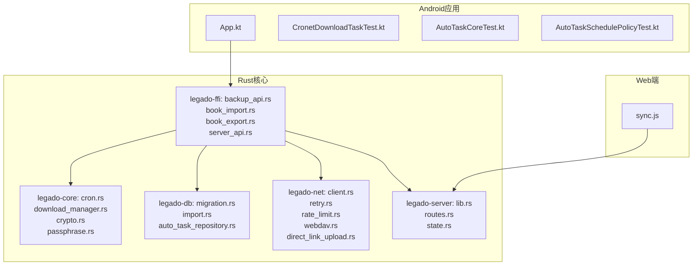
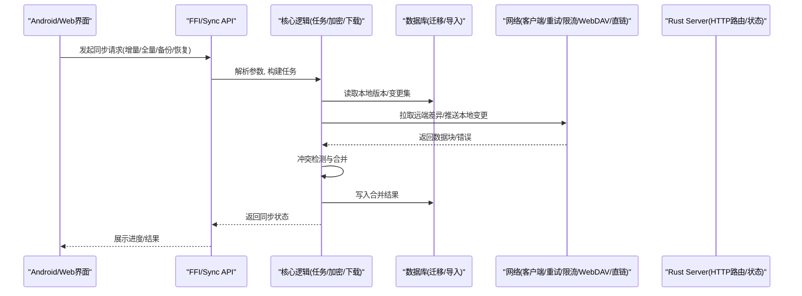
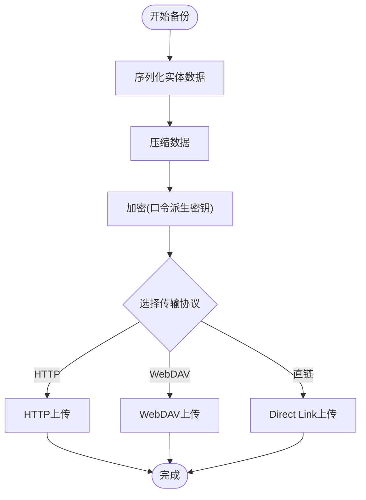
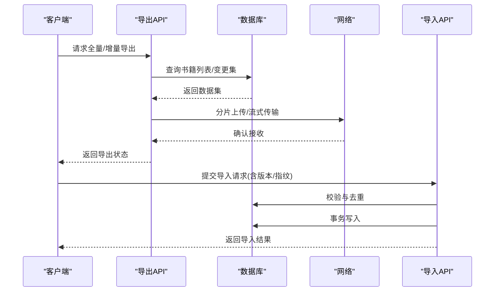
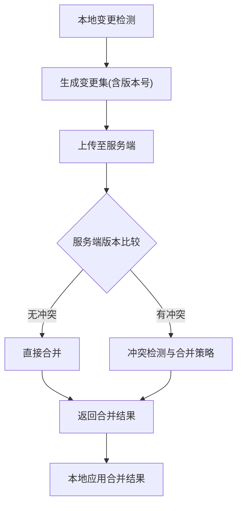
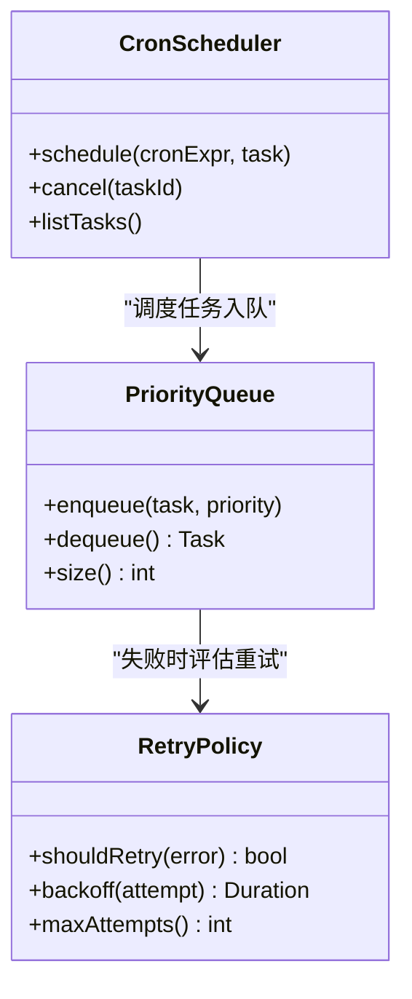
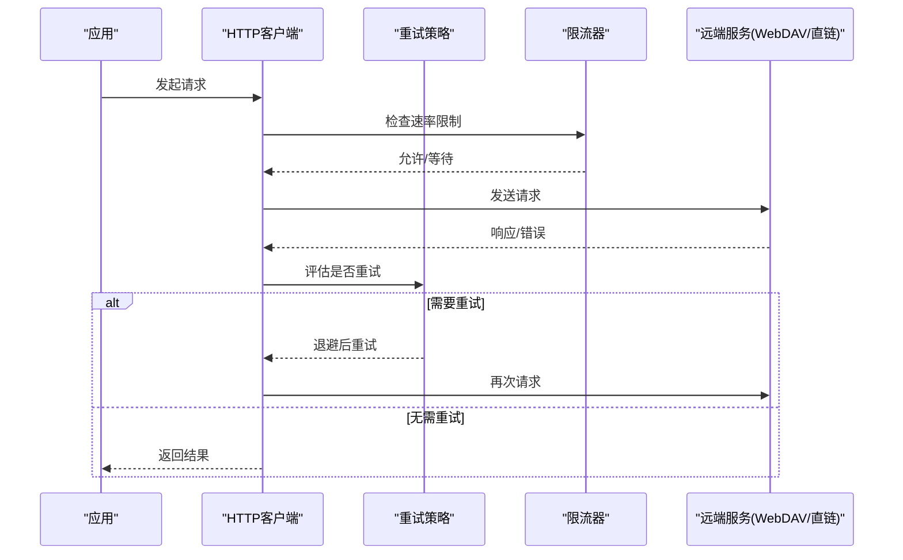
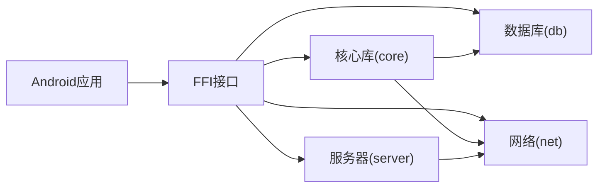

# 数据同步机制

<cite>
**本文档引用的文件**   
- [backup_api.rs](file://rust/legado-ffi/src/api/backup_api.rs)
- [book_import.rs](file://rust/legado-ffi/src/api/book_import.rs)
- [book_export.rs](file://rust/legado-ffi/src/api/book_export.rs)
- [server_api.rs](file://rust/legado-ffi/src/api/server_api.rs)
- [lib.rs](file://rust/legado-server/src/lib.rs)
- [routes.rs](file://rust/legado-server/src/routes.rs)
- [state.rs](file://rust/legado-server/src/state.rs)
- [client.rs](file://rust/legado-net/src/client.rs)
- [retry.rs](file://rust/legado-net/src/retry.rs)
- [rate_limit.rs](file://rust/legado-net/src/rate_limit.rs)
- [webdav.rs](file://rust/legado-net/src/webdav.rs)
- [direct_link_upload.rs](file://rust/legado-net/src/direct_link_upload.rs)
- [auto_task_repository.rs](file://rust/legado-db/src/repository/auto_task_repository.rs)
- [migration.rs](file://rust/legado-db/src/migration.rs)
- [import.rs](file://rust/legado-db/src/import.rs)
- [cron.rs](file://rust/legado-core/src/cron.rs)
- [download_manager.rs](file://rust/legado-core/src/download_manager.rs)
- [crypto.rs](file://rust/legado-core/src/crypto.rs)
- [passphrase.rs](file://rust/legado-core/src/passphrase.rs)
- [App.kt](file://app/src/main/java/io/legado/app/App.kt)
- [CronetDownloadTaskTest.kt](file://app/src/test/java/io/legado/app/ci/CronetDownloadTaskTest.kt)
- [AutoTaskCoreTest.kt](file://app/src/test/java/io/legado/app/model/AutoTaskCoreTest.kt)
- [AutoTaskSchedulePolicyTest.kt](file://app/src/test/java/io/legado/app/model/AutoTaskSchedulePolicyTest.kt)
- [sync.js](file://modules/web/scripts/sync.js)
</cite>

## 目录
1. [简介](#简介)
2. [项目结构](#项目结构)
3. [核心组件](#核心组件)
4. [架构总览](#架构总览)
5. [详细组件分析](#详细组件分析)
6. [依赖关系分析](#依赖关系分析)
7. [性能考虑](#性能考虑)
8. [故障排查指南](#故障排查指南)
9. [结论](#结论)
10. [附录](#附录)

## 简介
本文件面向Legado项目的数据同步机制，覆盖本地与云端之间的增量/全量同步策略、冲突解决算法、备份与恢复（序列化、压缩加密、传输协议）、多设备同步（版本号管理、变更检测、状态一致性）、任务调度（定时任务、优先级队列、失败重试），以及性能优化、网络异常处理与安全实现。文档以代码级分析为基础，结合架构图与流程图，帮助读者快速理解并落地实施。

## 项目结构
本项目采用多语言分层架构：
- Android应用层（Kotlin）：负责UI交互、系统级调度、下载与网络能力集成（如Cronet）。
- Rust核心库（legado-*）：提供数据库访问、任务调度、加密解密、网络客户端、WebDAV/Direct Link上传等能力。
- Web端（Vue/TS + Node脚本）：提供Web界面与同步脚本，便于在浏览器或Node环境中进行数据同步操作。

图表来源
- [App.kt](file://app/src/main/java/io/legado/app/App.kt)
- [CronetDownloadTaskTest.kt](file://app/src/test/java/io/legado/app/ci/CronetDownloadTaskTest.kt)
- [AutoTaskCoreTest.kt](file://app/src/test/java/io/legado/app/model/AutoTaskCoreTest.kt)
- [AutoTaskSchedulePolicyTest.kt](file://app/src/test/java/io/legado/app/model/AutoTaskSchedulePolicyTest.kt)
- [cron.rs](file://rust/legado-core/src/cron.rs)
- [download_manager.rs](file://rust/legado-core/src/download_manager.rs)
- [crypto.rs](file://rust/legado-core/src/crypto.rs)
- [passphrase.rs](file://rust/legado-core/src/passphrase.rs)
- [migration.rs](file://rust/legado-db/src/migration.rs)
- [import.rs](file://rust/legado-db/src/import.rs)
- [auto_task_repository.rs](file://rust/legado-db/src/repository/auto_task_repository.rs)
- [client.rs](file://rust/legado-net/src/client.rs)
- [retry.rs](file://rust/legado-net/src/retry.rs)
- [rate_limit.rs](file://rust/legado-net/src/rate_limit.rs)
- [webdav.rs](file://rust/legado-net/src/webdav.rs)
- [direct_link_upload.rs](file://rust/legado-net/src/direct_link_upload.rs)
- [backup_api.rs](file://rust/legado-ffi/src/api/backup_api.rs)
- [book_import.rs](file://rust/legado-ffi/src/api/book_import.rs)
- [book_export.rs](file://rust/legado-ffi/src/api/book_export.rs)
- [server_api.rs](file://rust/legado-ffi/src/api/server_api.rs)
- [lib.rs](file://rust/legado-server/src/lib.rs)
- [routes.rs](file://rust/legado-server/src/routes.rs)
- [state.rs](file://rust/legado-server/src/state.rs)
- [sync.js](file://modules/web/scripts/sync.js)

章节来源
- [App.kt](file://app/src/main/java/io/legado/app/App.kt)
- [lib.rs](file://rust/legado-server/src/lib.rs)
- [routes.rs](file://rust/legado-server/src/routes.rs)
- [state.rs](file://rust/legado-server/src/state.rs)

## 核心组件
- 备份与导入导出API（FFI）：对外暴露备份、恢复、书籍导入/导出接口，供Android与Web端调用。
- 服务器模块：提供HTTP路由与状态管理，承载同步相关接口。
- 网络客户端与工具：统一HTTP客户端、重试、限流、WebDAV与直链上传。
- 数据库与迁移：版本化迁移、批量导入、自动任务持久化。
- 核心逻辑：定时任务、下载管理器、加密与口令管理。
- Web端同步脚本：在浏览器/Node中驱动同步流程。

章节来源
- [backup_api.rs](file://rust/legado-ffi/src/api/backup_api.rs)
- [book_import.rs](file://rust/legado-ffi/src/api/book_import.rs)
- [book_export.rs](file://rust/legado-ffi/src/api/book_export.rs)
- [server_api.rs](file://rust/legado-ffi/src/api/server_api.rs)
- [client.rs](file://rust/legado-net/src/client.rs)
- [retry.rs](file://rust/legado-net/src/retry.rs)
- [rate_limit.rs](file://rust/legado-net/src/rate_limit.rs)
- [webdav.rs](file://rust/legado-net/src/webdav.rs)
- [direct_link_upload.rs](file://rust/legado-net/src/direct_link_upload.rs)
- [migration.rs](file://rust/legado-db/src/migration.rs)
- [import.rs](file://rust/legado-db/src/import.rs)
- [auto_task_repository.rs](file://rust/legado-db/src/repository/auto_task_repository.rs)
- [cron.rs](file://rust/legado-core/src/cron.rs)
- [download_manager.rs](file://rust/legado-core/src/download_manager.rs)
- [crypto.rs](file://rust/legado-core/src/crypto.rs)
- [passphrase.rs](file://rust/legado-core/src/passphrase.rs)
- [sync.js](file://modules/web/scripts/sync.js)

## 架构总览
整体同步架构由“客户端（Android/Web）—FFI/API—服务端—存储/网络”构成。Android通过FFI调用Rust API，Rust内部协调数据库、网络与加密模块；Web端通过HTTP与Rust Server交互。

图表来源
- [backup_api.rs](file://rust/legado-ffi/src/api/backup_api.rs)
- [server_api.rs](file://rust/legado-ffi/src/api/server_api.rs)
- [cron.rs](file://rust/legado-core/src/cron.rs)
- [download_manager.rs](file://rust/legado-core/src/download_manager.rs)
- [client.rs](file://rust/legado-net/src/client.rs)
- [retry.rs](file://rust/legado-net/src/retry.rs)
- [rate_limit.rs](file://rust/legado-net/src/rate_limit.rs)
- [webdav.rs](file://rust/legado-net/src/webdav.rs)
- [direct_link_upload.rs](file://rust/legado-net/src/direct_link_upload.rs)
- [migration.rs](file://rust/legado-db/src/migration.rs)
- [import.rs](file://rust/legado-db/src/import.rs)
- [lib.rs](file://rust/legado-server/src/lib.rs)
- [routes.rs](file://rust/legado-server/src/routes.rs)
- [state.rs](file://rust/legado-server/src/state.rs)

## 详细组件分析

### 备份与恢复（序列化、压缩、加密、传输）
- 序列化与打包：备份时按实体类型序列化（书籍、书签、阅读记录、规则等），打包为归档格式。
- 压缩与加密：使用核心加密模块对数据进行压缩与加密，口令由口令管理模块生成/校验。
- 传输协议：支持HTTP上传、WebDAV、Direct Link等多种方式，根据配置选择最优路径。
- 恢复流程：下载归档→解密解压→校验完整性→逐条导入数据库→更新版本标记。

图表来源
- [backup_api.rs](file://rust/legado-ffi/src/api/backup_api.rs)
- [crypto.rs](file://rust/legado-core/src/crypto.rs)
- [passphrase.rs](file://rust/legado-core/src/passphrase.rs)
- [webdav.rs](file://rust/legado-net/src/webdav.rs)
- [direct_link_upload.rs](file://rust/legado-net/src/direct_link_upload.rs)

章节来源
- [backup_api.rs](file://rust/legado-ffi/src/api/backup_api.rs)
- [crypto.rs](file://rust/legado-core/src/crypto.rs)
- [passphrase.rs](file://rust/legado-core/src/passphrase.rs)
- [webdav.rs](file://rust/legado-net/src/webdav.rs)
- [direct_link_upload.rs](file://rust/legado-net/src/direct_link_upload.rs)

### 书籍导入/导出（增量/全量）
- 全量导出：遍历本地书籍集合，按批次导出元数据与内容摘要，支持分页与并发。
- 增量导出：基于时间戳/版本号筛选变更条目，仅导出新增或修改的书籍信息。
- 导入流程：校验包体→去重→事务写入→索引重建→统计更新。

图表来源
- [book_export.rs](file://rust/legado-ffi/src/api/book_export.rs)
- [book_import.rs](file://rust/legado-ffi/src/api/book_import.rs)
- [import.rs](file://rust/legado-db/src/import.rs)

章节来源
- [book_export.rs](file://rust/legado-ffi/src/api/book_export.rs)
- [book_import.rs](file://rust/legado-ffi/src/api/book_import.rs)
- [import.rs](file://rust/legado-db/src/import.rs)

### 多设备同步（版本号、变更检测、一致性）
- 版本号管理：每个实体维护版本号/时间戳，用于判断是否需要同步。
- 变更检测：客户端计算本地变更集，服务端对比远端版本，生成差异。
- 一致性保证：采用乐观锁+冲突检测，合并策略优先保留最新时间戳或用户指定策略。

图表来源
- [auto_task_repository.rs](file://rust/legado-db/src/repository/auto_task_repository.rs)
- [migration.rs](file://rust/legado-db/src/migration.rs)
- [import.rs](file://rust/legado-db/src/import.rs)

章节来源
- [auto_task_repository.rs](file://rust/legado-db/src/repository/auto_task_repository.rs)
- [migration.rs](file://rust/legado-db/src/migration.rs)
- [import.rs](file://rust/legado-db/src/import.rs)

### 同步任务调度（定时任务、优先级队列、失败重试）
- 定时任务：基于cron表达式触发同步任务，支持周期性执行与一次性任务。
- 优先级队列：高优先级任务（如增量同步）优先执行，低优先级任务（如全量备份）延后。
- 失败重试：指数退避+最大重试次数，支持可配置的重试条件（网络错误、超时等）。

图表来源
- [cron.rs](file://rust/legado-core/src/cron.rs)
- [auto_task_repository.rs](file://rust/legado-db/src/repository/auto_task_repository.rs)
- [retry.rs](file://rust/legado-net/src/retry.rs)

章节来源
- [cron.rs](file://rust/legado-core/src/cron.rs)
- [auto_task_repository.rs](file://rust/legado-db/src/repository/auto_task_repository.rs)
- [retry.rs](file://rust/legado-net/src/retry.rs)

### 网络层（客户端、重试、限流、WebDAV、直链上传）
- 客户端：统一HTTP客户端封装，支持代理、SSL配置、Cookie管理。
- 重试与限流：可配置重试策略与速率限制，避免雪崩与资源耗尽。
- WebDAV与直链：适配不同云存储协议，提升上传成功率与速度。

图表来源
- [client.rs](file://rust/legado-net/src/client.rs)
- [retry.rs](file://rust/legado-net/src/retry.rs)
- [rate_limit.rs](file://rust/legado-net/src/rate_limit.rs)
- [webdav.rs](file://rust/legado-net/src/webdav.rs)
- [direct_link_upload.rs](file://rust/legado-net/src/direct_link_upload.rs)

章节来源
- [client.rs](file://rust/legado-net/src/client.rs)
- [retry.rs](file://rust/legado-net/src/retry.rs)
- [rate_limit.rs](file://rust/legado-net/src/rate_limit.rs)
- [webdav.rs](file://rust/legado-net/src/webdav.rs)
- [direct_link_upload.rs](file://rust/legado-net/src/direct_link_upload.rs)

### Web端同步脚本
- 功能：在浏览器或Node环境中调用后端同步API，支持增量/全量同步、备份/恢复。
- 用法：配置目标地址、认证信息，选择同步模式，监控任务状态。

章节来源
- [sync.js](file://modules/web/scripts/sync.js)

## 依赖关系分析
- Android层依赖FFI接口，间接依赖Rust核心库。
- Rust核心库之间解耦清晰：core/db/net/ffi/server各司其职。
- 外部依赖：HTTP客户端、加密库、数据库引擎、WebDAV协议栈。

图表来源
- [App.kt](file://app/src/main/java/io/legado/app/App.kt)
- [backup_api.rs](file://rust/legado-ffi/src/api/backup_api.rs)
- [cron.rs](file://rust/legado-core/src/cron.rs)
- [client.rs](file://rust/legado-net/src/client.rs)
- [lib.rs](file://rust/legado-server/src/lib.rs)

章节来源
- [App.kt](file://app/src/main/java/io/legado/app/App.kt)
- [backup_api.rs](file://rust/legado-ffi/src/api/backup_api.rs)
- [cron.rs](file://rust/legado-core/src/cron.rs)
- [client.rs](file://rust/legado-net/src/client.rs)
- [lib.rs](file://rust/legado-server/src/lib.rs)

## 性能考虑
- 增量同步优先：减少数据传输量，降低带宽与CPU开销。
- 并发与批处理：导入/导出采用分批与并发策略，提高吞吐。
- 缓存与索引：对频繁访问的数据建立缓存与索引，加速查询。
- 网络优化：启用连接复用、压缩传输、合理设置超时与重试。
- 资源控制：限流与优先级队列避免资源争用。

[本节为通用指导，不直接分析具体文件]

## 故障排查指南
- 同步失败：检查网络连通性、重试策略配置、限流阈值。
- 冲突未解决：查看冲突日志，确认合并策略与版本号一致性。
- 备份损坏：验证压缩包完整性、解密口令是否正确。
- 任务未执行：检查cron表达式、任务队列状态、权限与资源占用。

章节来源
- [retry.rs](file://rust/legado-net/src/retry.rs)
- [rate_limit.rs](file://rust/legado-net/src/rate_limit.rs)
- [crypto.rs](file://rust/legado-core/src/crypto.rs)
- [passphrase.rs](file://rust/legado-core/src/passphrase.rs)
- [cron.rs](file://rust/legado-core/src/cron.rs)

## 结论
Legado的数据同步机制以Rust为核心，结合Android与Web端，实现了高效、安全、可扩展的同步方案。通过增量/全量策略、冲突解决、备份恢复、任务调度与网络优化，满足多设备一致性与稳定性需求。建议在生产环境充分测试不同网络条件与数据规模下的表现，并根据业务场景调整策略参数。

[本节为总结，不直接分析具体文件]

## 附录
- 示例：如何在Android中调用备份API（参考FFI接口定义）
- 示例：如何在Web端使用sync.js进行同步（参考脚本说明）
- 示例：如何配置重试与限流（参考网络模块配置）

章节来源
- [backup_api.rs](file://rust/legado-ffi/src/api/backup_api.rs)
- [sync.js](file://modules/web/scripts/sync.js)
- [retry.rs](file://rust/legado-net/src/retry.rs)
- [rate_limit.rs](file://rust/legado-net/src/rate_limit.rs)