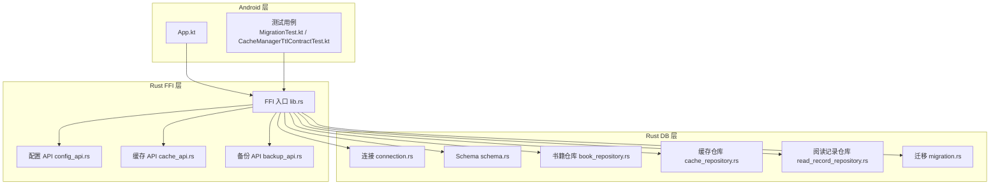
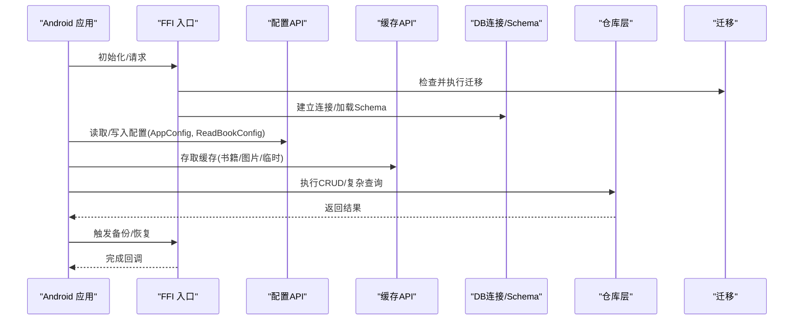
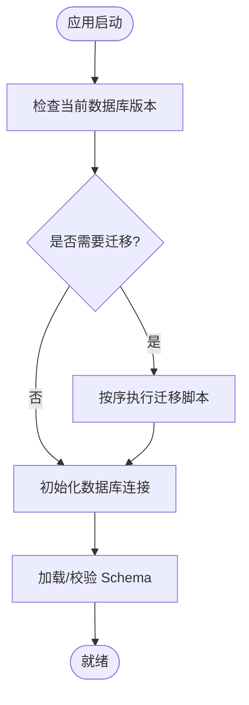
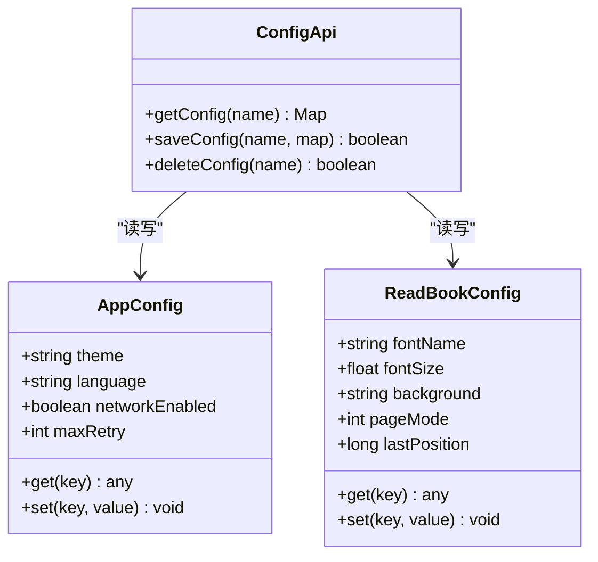
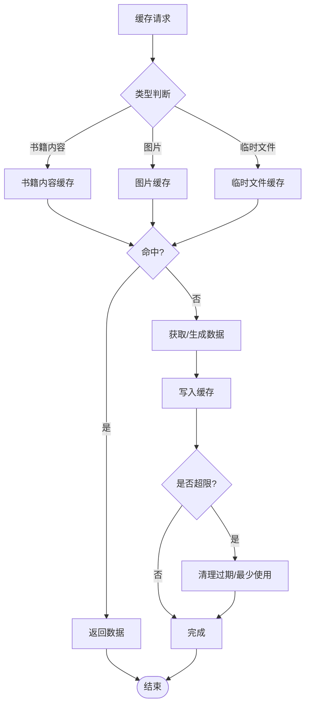
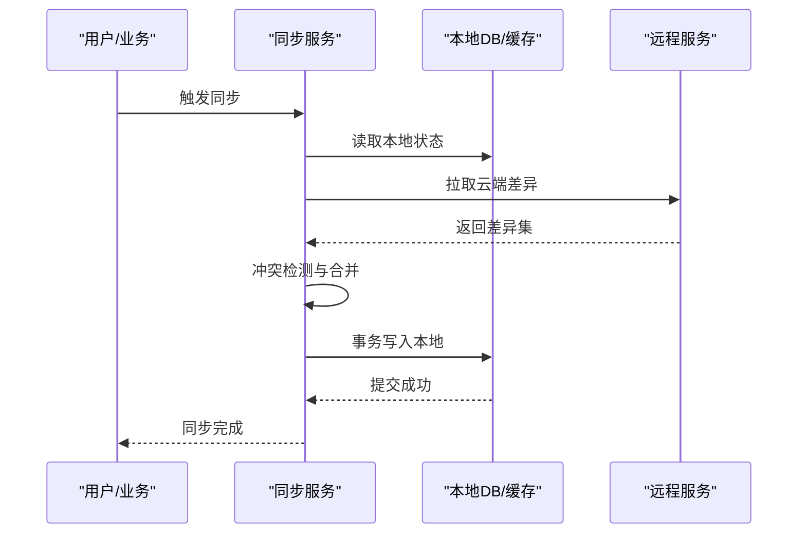
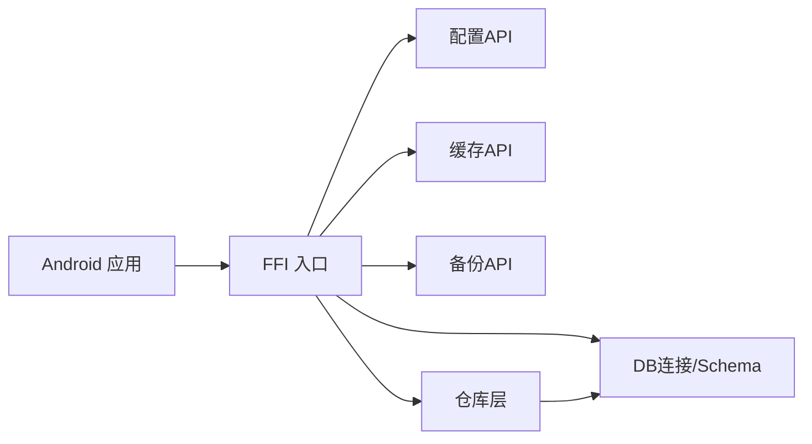

# 数据存储方案

<cite>
**本文引用的文件**   
- [App.kt](file://app/src/main/java/io/legado/app/App.kt)
- [AppDatabase.java](file://app/schemas/io.legado.app.data.AppDatabase/1.json)
- [migration.rs](file://rust/legado-db/src/migration.rs)
- [connection.rs](file://rust/legado-db/src/connection.rs)
- [schema.rs](file://rust/legado-db/src/schema.rs)
- [lib.rs (Rust FFI)](file://rust/legado-ffi/src/lib.rs)
- [config_api.rs](file://rust/legado-ffi/src/api/config_api.rs)
- [cache_api.rs](file://rust/legado-ffi/src/api/cache_api.rs)
- [backup_api.rs](file://rust/legado-ffi/src/api/backup_api.rs)
- [book_repository.rs](file://rust/legado-db/src/repository/book_repository.rs)
- [cache_repository.rs](file://rust/legado-db/src/repository/cache_repository.rs)
- [read_record_repository.rs](file://rust/legado-db/src/repository/read_record_repository.rs)
- [CacheManagerTtlContractTest.kt](file://app/src/test/java/io/legado/app/help/CacheManagerTtlContractTest.kt)
- [MigrationTest.kt](file://app/src/androidTest/java/io/legado/app/MigrationTest.kt)
</cite>

## 目录
1. [简介](#简介)
2. [项目结构](#项目结构)
3. [核心组件](#核心组件)
4. [架构总览](#架构总览)
5. [详细组件分析](#详细组件分析)
6. [依赖分析](#依赖分析)
7. [性能考虑](#性能考虑)
8. [故障排查指南](#故障排查指南)
9. [结论](#结论)
10. [附录](#附录)

## 简介
本文件系统性阐述 Legado 的数据存储方案，覆盖 Room 数据库设计（实体、DAO、迁移）、SharedPreferences 配置存储（AppConfig、ReadBookConfig 等）、文件缓存机制（书籍内容、图片、临时文件）、数据同步策略（本地与云端同步、冲突解决、一致性保证），并提供 CRUD 操作、复杂查询、备份恢复的实践指引与优化建议。文档面向不同技术背景的读者，既提供高层概览，也给出代码级映射与图示。

## 项目结构
Legado 采用 Android + Rust 混合架构：
- Android 层负责 UI、应用生命周期、偏好设置与部分业务编排。
- Rust 层通过 FFI 暴露稳定的 API，集中管理数据库连接、迁移、仓库访问、缓存与备份等核心能力。
- 数据库 Schema 以 JSON 形式保存在 app/schemas 目录，便于版本演进与迁移校验。

图表来源
- [App.kt](file://app/src/main/java/io/legado/app/App.kt)
- [lib.rs (Rust FFI)](file://rust/legado-ffi/src/lib.rs)
- [connection.rs](file://rust/legado-db/src/connection.rs)
- [schema.rs](file://rust/legado-db/src/schema.rs)
- [migration.rs](file://rust/legado-db/src/migration.rs)
- [book_repository.rs](file://rust/legado-db/src/repository/book_repository.rs)
- [cache_repository.rs](file://rust/legado-db/src/repository/cache_repository.rs)
- [read_record_repository.rs](file://rust/legado-db/src/repository/read_record_repository.rs)
- [config_api.rs](file://rust/legado-ffi/src/api/config_api.rs)
- [cache_api.rs](file://rust/legado-ffi/src/api/cache_api.rs)
- [backup_api.rs](file://rust/legado-ffi/src/api/backup_api.rs)

章节来源
- [App.kt](file://app/src/main/java/io/legado/app/App.kt)
- [lib.rs (Rust FFI)](file://rust/legado-ffi/src/lib.rs)

## 核心组件
- Room 数据库与迁移
  - 数据库定义与版本控制由 app/schemas 下的 JSON 文件维护，配合 Rust 侧的迁移模块实现跨版本升级。
  - 关键文件：AppDatabase 的初始版本 JSON、Rust 迁移脚本与连接初始化。
- SharedPreferences 配置存储
  - 用于保存应用全局配置与阅读器配置（如 AppConfig、ReadBookConfig）。
  - 通过 FFI 的配置 API 暴露读写接口，供上层统一调用。
- 文件缓存机制
  - 书籍内容、图片与临时文件按类型分目录缓存，支持 TTL 过期清理与容量上限控制。
  - 通过缓存 API 提供统一的增删改查与统计接口。
- 数据同步与一致性
  - 基于仓库模式封装 CRUD，结合事务与幂等写入策略保障一致性。
  - 提供备份/恢复 API 以支持本地与云端的增量或全量同步。

章节来源
- [AppDatabase.java](file://app/schemas/io.legado.app.data.AppDatabase/1.json)
- [migration.rs](file://rust/legado-db/src/migration.rs)
- [connection.rs](file://rust/legado-db/src/connection.rs)
- [schema.rs](file://rust/legado-db/src/schema.rs)
- [config_api.rs](file://rust/legado-ffi/src/api/config_api.rs)
- [cache_api.rs](file://rust/legado-ffi/src/api/cache_api.rs)
- [backup_api.rs](file://rust/legado-ffi/src/api/backup_api.rs)

## 架构总览
下图展示从 Android 到 Rust 的数据流与控制流，涵盖配置、缓存、数据库与备份路径。

图表来源
- [lib.rs (Rust FFI)](file://rust/legado-ffi/src/lib.rs)
- [config_api.rs](file://rust/legado-ffi/src/api/config_api.rs)
- [cache_api.rs](file://rust/legado-ffi/src/api/cache_api.rs)
- [connection.rs](file://rust/legado-db/src/connection.rs)
- [schema.rs](file://rust/legado-db/src/schema.rs)
- [migration.rs](file://rust/legado-db/src/migration.rs)
- [book_repository.rs](file://rust/legado-db/src/repository/book_repository.rs)
- [cache_repository.rs](file://rust/legado-db/src/repository/cache_repository.rs)
- [read_record_repository.rs](file://rust/legado-db/src/repository/read_record_repository.rs)

## 详细组件分析

### Room 数据库设计与迁移
- 实体与 DAO
  - 实体类对应数据库表，字段映射注解确保类型安全；DAO 接口声明增删改查与复杂查询方法。
  - 在 Rust 侧通过仓库封装具体 SQL 与事务边界，对外暴露稳定接口。
- 迁移策略
  - 使用 app/schemas 中的 JSON 描述各版本 Schema，Rust 迁移模块按版本号顺序执行迁移脚本。
  - 支持向前兼容与回滚策略，避免破坏性变更导致升级失败。
- 连接与 Schema
  - 连接模块负责数据库实例化、线程池与 WAL 模式配置；Schema 模块提供元数据校验与默认数据注入。

图表来源
- [connection.rs](file://rust/legado-db/src/connection.rs)
- [schema.rs](file://rust/legado-db/src/schema.rs)
- [migration.rs](file://rust/legado-db/src/migration.rs)

章节来源
- [AppDatabase.java](file://app/schemas/io.legado.app.data.AppDatabase/1.json)
- [connection.rs](file://rust/legado-db/src/connection.rs)
- [schema.rs](file://rust/legado-db/src/schema.rs)
- [migration.rs](file://rust/legado-db/src/migration.rs)

### SharedPreferences 配置存储（AppConfig、ReadBookConfig）
- 配置项分类
  - 应用级配置（AppConfig）：主题、语言、网络参数、插件开关等。
  - 阅读器配置（ReadBookConfig）：字体、行距、背景、翻页模式、阅读进度等。
- 存取方式
  - 通过 FFI 配置 API 提供 get/set/exists/clear 等方法，屏蔽底层 SharedPreferences 细节。
  - 支持序列化/反序列化复杂对象，保证配置结构的向后兼容。
- 最佳实践
  - 将频繁读写的键分组管理，避免主线程阻塞。
  - 对敏感信息加密存储，并提供导入导出能力。

图表来源
- [config_api.rs](file://rust/legado-ffi/src/api/config_api.rs)

章节来源
- [config_api.rs](file://rust/legado-ffi/src/api/config_api.rs)

### 文件缓存机制（书籍内容、图片、临时文件）
- 缓存分区
  - 书籍内容缓存：按书 ID 与章节维度组织，支持断点续读与预取。
  - 图片缓存：按 URL 哈希命名，支持缩略图与大图分离。
  - 临时文件：下载中间产物、解析缓存，定期清理。
- TTL 与容量控制
  - 支持基于时间的过期策略（TTL）与基于容量的 LRU 淘汰。
  - 后台任务周期性扫描并清理过期与超限文件。
- 统一接口
  - 通过缓存 API 提供 put/get/delete/clean/stats 等方法，屏蔽文件系统差异。

图表来源
- [cache_api.rs](file://rust/legado-ffi/src/api/cache_api.rs)
- [cache_repository.rs](file://rust/legado-db/src/repository/cache_repository.rs)

章节来源
- [cache_api.rs](file://rust/legado-ffi/src/api/cache_api.rs)
- [cache_repository.rs](file://rust/legado-db/src/repository/cache_repository.rs)
- [CacheManagerTtlContractTest.kt](file://app/src/test/java/io/legado/app/help/CacheManagerTtlContractTest.kt)

### 数据同步策略（本地与云端、冲突解决、一致性）
- 同步模型
  - 本地优先：读取优先走本地缓存/数据库，必要时异步拉取云端更新。
  - 写后同步：本地写入成功后，触发增量同步任务队列。
- 冲突解决
  - 时间戳对比与版本号合并策略，支持“最后写入胜出”或“字段级合并”。
  - 对不可自动合并的冲突，提供用户确认流程。
- 一致性保证
  - 使用事务包裹批量写入，失败回滚。
  - 幂等写入与去重键，避免重复同步造成数据膨胀。
- 备份与恢复
  - 提供全量/增量备份接口，支持压缩与校验。
  - 恢复时进行完整性校验与冲突提示。

图表来源
- [backup_api.rs](file://rust/legado-ffi/src/api/backup_api.rs)
- [book_repository.rs](file://rust/legado-db/src/repository/book_repository.rs)
- [read_record_repository.rs](file://rust/legado-db/src/repository/read_record_repository.rs)

章节来源
- [backup_api.rs](file://rust/legado-ffi/src/api/backup_api.rs)
- [book_repository.rs](file://rust/legado-db/src/repository/book_repository.rs)
- [read_record_repository.rs](file://rust/legado-db/src/repository/read_record_repository.rs)

### 典型用法示例（CRUD、复杂查询、备份恢复）
- 书籍数据 CRUD
  - 新增书籍：创建实体对象，调用仓库插入方法，返回主键。
  - 更新书籍：根据主键更新字段，注意并发锁与版本号。
  - 删除书籍：软删除标记或物理删除，联动清理缓存与索引。
  - 查询书籍：支持分页、排序、多条件组合与全文检索。
- 阅读记录与统计
  - 记录阅读进度、时长与频次，聚合统计报表。
- 备份与恢复
  - 备份：选择范围（全部/指定集合），生成压缩包并校验。
  - 恢复：上传备份包，校验通过后还原至目标库。

章节来源
- [book_repository.rs](file://rust/legado-db/src/repository/book_repository.rs)
- [read_record_repository.rs](file://rust/legado-db/src/repository/read_record_repository.rs)
- [backup_api.rs](file://rust/legado-ffi/src/api/backup_api.rs)

## 依赖分析
- 组件耦合
  - FFI 层作为唯一入口，解耦 Android 与 Rust 实现，降低耦合度。
  - 仓库层屏蔽 SQL 细节，对外暴露领域语义方法。
- 外部依赖
  - 数据库驱动与 SQLite 特性（WAL、索引、外键约束）。
  - 文件系统 I/O 与压缩库（用于备份与缓存）。
- 循环依赖
  - 通过接口与分层隔离避免循环依赖，确保可测试性与可替换性。

图表来源
- [lib.rs (Rust FFI)](file://rust/legado-ffi/src/lib.rs)
- [config_api.rs](file://rust/legado-ffi/src/api/config_api.rs)
- [cache_api.rs](file://rust/legado-ffi/src/api/cache_api.rs)
- [backup_api.rs](file://rust/legado-ffi/src/api/backup_api.rs)
- [connection.rs](file://rust/legado-db/src/connection.rs)
- [schema.rs](file://rust/legado-db/src/schema.rs)
- [book_repository.rs](file://rust/legado-db/src/repository/book_repository.rs)
- [cache_repository.rs](file://rust/legado-db/src/repository/cache_repository.rs)
- [read_record_repository.rs](file://rust/legado-db/src/repository/read_record_repository.rs)

章节来源
- [lib.rs (Rust FFI)](file://rust/legado-ffi/src/lib.rs)

## 性能考虑
- 数据库性能
  - 启用 WAL 模式提升并发读写性能。
  - 合理设计索引，避免全表扫描；对高频查询字段建立复合索引。
  - 批量写入使用事务包裹，减少磁盘落盘次数。
- 缓存性能
  - 图片使用缩略图与按需加载，避免大内存占用。
  - 设置合理的 TTL 与最大容量，防止缓存膨胀。
- I/O 与线程
  - 所有耗时操作放入后台线程，避免阻塞主线程。
  - 使用连接池与协程/线程池限制并发度，防止资源争用。
- 内存管理
  - 及时释放大对象引用，避免内存泄漏。
  - 对列表与流式数据采用分页与流式处理。

[本节为通用指导，不直接分析具体文件]

## 故障排查指南
- 迁移失败
  - 检查当前版本与目标版本的 Schema 差异，确认迁移脚本顺序与幂等性。
  - 参考迁移测试用例验证升级路径。
- 配置读写异常
  - 校验键名与数据类型，确保序列化格式兼容。
  - 检查权限与存储空间可用性。
- 缓存问题
  - 清理过期与损坏文件，重建索引。
  - 监控缓存命中率与淘汰率，调整 TTL 与容量阈值。
- 备份恢复失败
  - 校验备份包完整性与签名，确认目标库版本兼容。
  - 查看日志定位失败阶段（解压、校验、写入）。

章节来源
- [MigrationTest.kt](file://app/src/androidTest/java/io/legado/app/MigrationTest.kt)
- [cache_api.rs](file://rust/legado-ffi/src/api/cache_api.rs)
- [backup_api.rs](file://rust/legado-ffi/src/api/backup_api.rs)

## 结论
Legado 的数据存储方案以 Rust FFI 为核心，统一了配置、缓存、数据库与备份能力，具备良好的扩展性与稳定性。通过严格的迁移策略、完善的缓存管理与一致的同步模型，能够在复杂场景下保持高性能与数据一致性。建议持续优化索引与缓存策略，完善监控与告警，进一步提升用户体验与系统可靠性。

## 附录
- 术语说明
  - 实体：数据库表的 Kotlin/Rust 映射对象。
  - DAO：数据访问对象，定义对实体的操作方法。
  - 仓库：领域层的抽象，封装数据访问逻辑。
  - TTL：Time To Live，缓存条目存活时间。
- 相关测试
  - 迁移测试：验证数据库升级路径的正确性。
  - 缓存 TTL 合同测试：验证过期策略与清理行为。

章节来源
- [MigrationTest.kt](file://app/src/androidTest/java/io/legado/app/MigrationTest.kt)
- [CacheManagerTtlContractTest.kt](file://app/src/test/java/io/legado/app/help/CacheManagerTtlContractTest.kt)