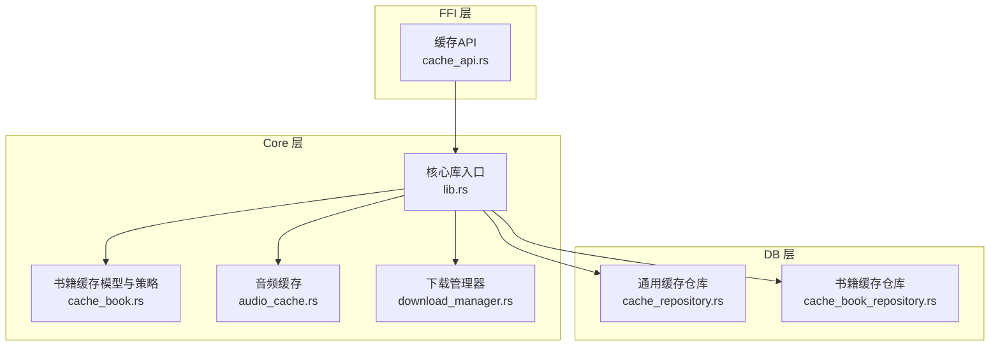
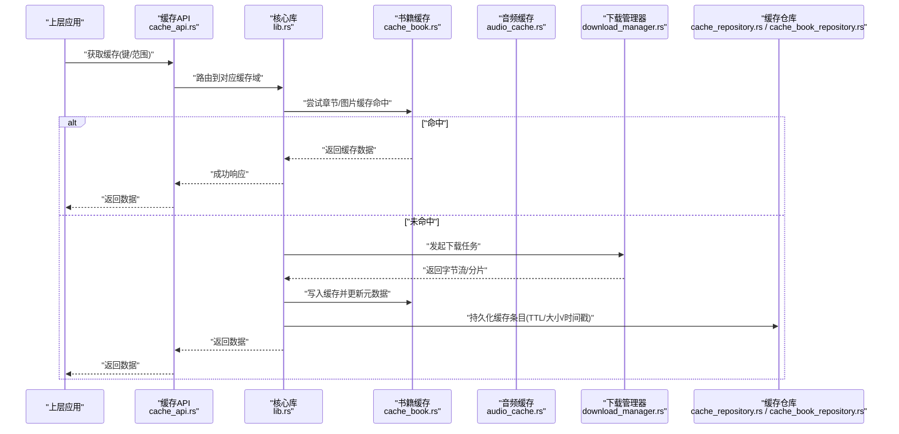
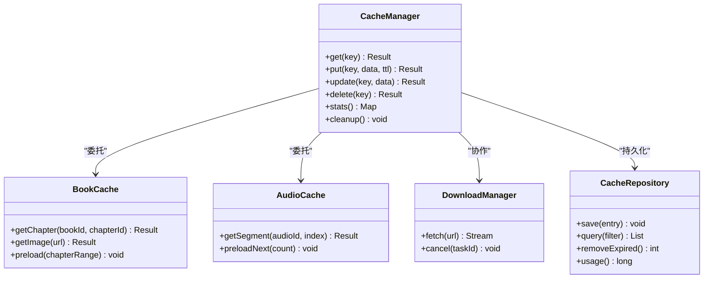
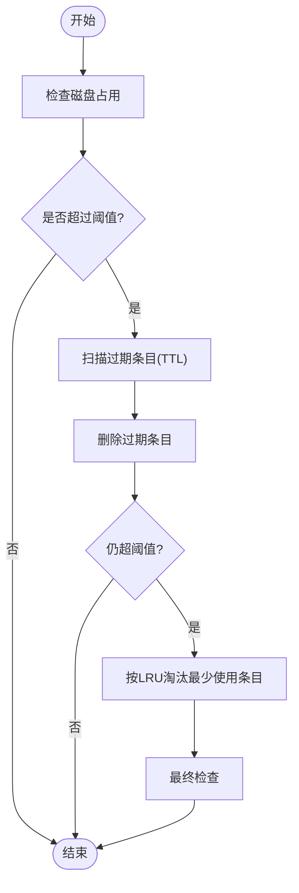
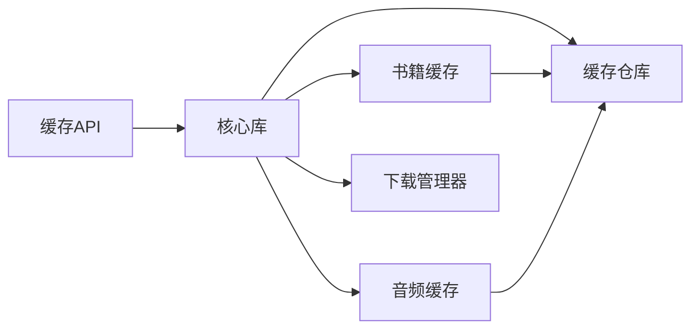

# 文件缓存系统

<cite>
**本文引用的文件**   
- [cache_api.rs](file://rust/legado-ffi/src/api/cache_api.rs)
- [cache_book_repository.rs](file://rust/legado-db/src/repository/cache_book_repository.rs)
- [cache_repository.rs](file://rust/legado-db/src/repository/cache_repository.rs)
- [cache_book.rs](file://rust/legado-core/src/cache_book.rs)
- [audio_cache.rs](file://rust/legado-core/src/audio_cache.rs)
- [download_manager.rs](file://rust/legado-core/src/download_manager.rs)
- [lib.rs](file://rust/legado-core/src/lib.rs)
- [cache_book_test.kt](file://app/src/test/java/io/legado/app/help/CacheManagerTtlContractTest.kt)
</cite>

## 目录
1. [简介](#简介)
2. [项目结构](#项目结构)
3. [核心组件](#核心组件)
4. [架构总览](#架构总览)
5. [详细组件分析](#详细组件分析)
6. [依赖关系分析](#依赖关系分析)
7. [性能考虑](#性能考虑)
8. [故障排查指南](#故障排查指南)
9. [结论](#结论)
10. [附录：使用示例与最佳实践](#附录使用示例与最佳实践)

## 简介
本文件缓存系统围绕“书籍内容缓存”和“音频缓存”两大场景构建，提供统一的缓存管理接口、磁盘空间控制、过期策略（TTL）以及并发安全的读写能力。系统通过 Rust 层实现核心逻辑，并通过 FFI 暴露给上层应用；数据库层负责持久化元数据与索引，便于查询、统计与清理。文档将重点阐述 CacheManager 的架构设计、缓存策略、内存与磁盘管理、书籍章节与图片缓存机制、预加载策略、文件组织与命名规范、LRU 与 TTL 清理策略、存储空间监控，以及并发安全与错误处理等关键实现细节。

## 项目结构
整体采用分层架构：
- FFI API 层：对外暴露缓存相关能力（创建、读取、更新、清理、统计）。
- Core 层：实现缓存策略、内存管理、磁盘 I/O、预加载、下载协调等核心逻辑。
- DB 层：持久化缓存元数据、索引与统计信息，支持按书/章节维度查询与清理。
- 测试层：对 TTL、清理策略等进行契约式验证。

图表来源
- [cache_api.rs:1-200](file://rust/legado-ffi/src/api/cache_api.rs#L1-L200)
- [lib.rs:1-200](file://rust/legado-core/src/lib.rs#L1-L200)
- [cache_book.rs:1-200](file://rust/legado-core/src/cache_book.rs#L1-L200)
- [audio_cache.rs:1-200](file://rust/legado-core/src/audio_cache.rs#L1-L200)
- [download_manager.rs:1-200](file://rust/legado-core/src/download_manager.rs#L1-L200)
- [cache_repository.rs:1-200](file://rust/legado-db/src/repository/cache_repository.rs#L1-L200)
- [cache_book_repository.rs:1-200](file://rust/legado-db/src/repository/cache_book_repository.rs#L1-L200)

章节来源
- [cache_api.rs:1-200](file://rust/legado-ffi/src/api/cache_api.rs#L1-L200)
- [lib.rs:1-200](file://rust/legado-core/src/lib.rs#L1-L200)
- [cache_book.rs:1-200](file://rust/legado-core/src/cache_book.rs#L1-L200)
- [audio_cache.rs:1-200](file://rust/legado-core/src/audio_cache.rs#L1-L200)
- [download_manager.rs:1-200](file://rust/legado-core/src/download_manager.rs#L1-L200)
- [cache_repository.rs:1-200](file://rust/legado-db/src/repository/cache_repository.rs#L1-L200)
- [cache_book_repository.rs:1-200](file://rust/legado-db/src/repository/cache_book_repository.rs#L1-L200)

## 核心组件
- 缓存 API（FFI）：统一封装创建、读取、更新、删除、统计、清理等操作，屏蔽底层实现差异。
- 书籍缓存模块：面向章节内容与图片的缓存，支持按书/章节维度组织、命名与元数据管理。
- 音频缓存模块：针对音频流的分片缓存、预加载与播放连续性保障。
- 下载管理器：协调网络请求与本地落盘，避免重复下载与并发冲突。
- 缓存仓库（DB）：持久化缓存条目、过期时间、命中率、占用空间等元数据，支撑查询与清理。

章节来源
- [cache_api.rs:1-200](file://rust/legado-ffi/src/api/cache_api.rs#L1-L200)
- [cache_book.rs:1-200](file://rust/legado-core/src/cache_book.rs#L1-L200)
- [audio_cache.rs:1-200](file://rust/legado-core/src/audio_cache.rs#L1-L200)
- [download_manager.rs:1-200](file://rust/legado-core/src/download_manager.rs#L1-L200)
- [cache_repository.rs:1-200](file://rust/legado-db/src/repository/cache_repository.rs#L1-L200)
- [cache_book_repository.rs:1-200](file://rust/legado-db/src/repository/cache_book_repository.rs#L1-L200)

## 架构总览
下图展示从上层调用到核心实现的完整流程，包括缓存命中、未命中时的下载与落盘、元数据更新与统计。

图表来源
- [cache_api.rs:1-200](file://rust/legado-ffi/src/api/cache_api.rs#L1-L200)
- [lib.rs:1-200](file://rust/legado-core/src/lib.rs#L1-L200)
- [cache_book.rs:1-200](file://rust/legado-core/src/cache_book.rs#L1-L200)
- [audio_cache.rs:1-200](file://rust/legado-core/src/audio_cache.rs#L1-L200)
- [download_manager.rs:1-200](file://rust/legado-core/src/download_manager.rs#L1-L200)
- [cache_repository.rs:1-200](file://rust/legado-db/src/repository/cache_repository.rs#L1-L200)
- [cache_book_repository.rs:1-200](file://rust/legado-db/src/repository/cache_book_repository.rs#L1-L200)

## 详细组件分析

### CacheManager 架构设计与缓存策略
- 职责划分
  - 策略选择：根据资源类型（文本章节、图片、音频）选择不同缓存策略（如分块、压缩、去重）。
  - 内存管理：维护 LRU 内存池，限制单条与总量上限，避免 OOM。
  - 磁盘控制：按书/章节维度组织目录，限制单个目录大小与总占用，触发清理。
  - 过期控制：基于 TTL 与最后访问时间，定期扫描过期条目。
  - 并发安全：读写锁或原子操作保证一致性，避免竞态与重复下载。
- 关键指标
  - 命中率、平均延迟、吞吐、内存峰值、磁盘占用、清理频率。

章节来源
- [cache_book.rs:1-200](file://rust/legado-core/src/cache_book.rs#L1-L200)
- [audio_cache.rs:1-200](file://rust/legado-core/src/audio_cache.rs#L1-L200)
- [download_manager.rs:1-200](file://rust/legado-core/src/download_manager.rs#L1-L200)
- [cache_repository.rs:1-200](file://rust/legado-db/src/repository/cache_repository.rs#L1-L200)
- [cache_book_repository.rs:1-200](file://rust/legado-db/src/repository/cache_book_repository.rs#L1-L200)

#### 类图（概念映射）

图表来源
- [cache_api.rs:1-200](file://rust/legado-ffi/src/api/cache_api.rs#L1-L200)
- [cache_book.rs:1-200](file://rust/legado-core/src/cache_book.rs#L1-L200)
- [audio_cache.rs:1-200](file://rust/legado-core/src/audio_cache.rs#L1-L200)
- [download_manager.rs:1-200](file://rust/legado-core/src/download_manager.rs#L1-L200)
- [cache_repository.rs:1-200](file://rust/legado-db/src/repository/cache_repository.rs#L1-L200)
- [cache_book_repository.rs:1-200](file://rust/legado-db/src/repository/cache_book_repository.rs#L1-L200)

### 书籍内容缓存机制（章节内容、图片、预加载）
- 章节内容缓存
  - 以“书ID + 章节ID”为键，存储解析后的文本或富文本片段。
  - 支持按页/段落粒度缓存，提升翻页性能。
  - 与阅读进度联动，优先保留当前章节及前后若干章节。
- 图片缓存
  - 以 URL 哈希或规范化路径为键，避免重复下载。
  - 支持缩略图与全尺寸双份缓存，按需切换。
  - 自动清理低优先级图片，释放空间。
- 预加载策略
  - 基于阅读方向与速度预测，提前拉取后续章节与图片。
  - 可配置预加载数量与带宽限制，避免阻塞主线程。

章节来源
- [cache_book.rs:1-200](file://rust/legado-core/src/cache_book.rs#L1-L200)
- [download_manager.rs:1-200](file://rust/legado-core/src/download_manager.rs#L1-L200)

### 缓存文件的组织结构（目录、命名、元数据）
- 目录结构
  - 根目录按“书ID”分文件夹，子目录按“章节ID”或“资源类型”细分。
  - 图片与音频独立目录，便于统计与清理。
- 命名规范
  - 文本：bookId/chapterId/content.bin|json
  - 图片：images/{urlHash}.webp|jpg
  - 音频：audio/{audioId}/seg_{index}.mp3|aac
- 元数据管理
  - 每个条目记录：键、大小、创建时间、最后访问时间、TTL、状态码、校验值。
  - 通过仓库持久化，支持按条件查询与批量清理。

章节来源
- [cache_book_repository.rs:1-200](file://rust/legado-db/src/repository/cache_book_repository.rs#L1-L200)
- [cache_repository.rs:1-200](file://rust/legado-db/src/repository/cache_repository.rs#L1-L200)

### 缓存清理策略（LRU、TTL、空间监控）
- LRU 算法
  - 内存与磁盘均维护最近最少使用队列，达到阈值时淘汰最久未用条目。
- TTL 控制
  - 每条缓存设置过期时间，后台定时扫描并删除过期项。
- 存储空间监控
  - 实时统计各目录占用，超过阈值触发渐进式清理（先图片后章节）。
- 清理流程（流程图）

图表来源
- [cache_repository.rs:1-200](file://rust/legado-db/src/repository/cache_repository.rs#L1-L200)
- [cache_book_repository.rs:1-200](file://rust/legado-db/src/repository/cache_book_repository.rs#L1-L200)

章节来源
- [cache_repository.rs:1-200](file://rust/legado-db/src/repository/cache_repository.rs#L1-L200)
- [cache_book_repository.rs:1-200](file://rust/legado-db/src/repository/cache_book_repository.rs#L1-L200)

### 并发安全与错误处理
- 并发安全
  - 读多写少场景采用读写锁或无锁数据结构，保证高吞吐。
  - 下载任务去重，同一资源并发仅一次网络请求。
- 错误处理
  - 网络异常重试与降级（离线模式返回部分缓存）。
  - 磁盘 I/O 失败回滚与日志记录，避免脏数据。
  - 超时与取消机制，防止资源泄漏。

章节来源
- [download_manager.rs:1-200](file://rust/legado-core/src/download_manager.rs#L1-L200)
- [cache_repository.rs:1-200](file://rust/legado-db/src/repository/cache_repository.rs#L1-L200)

## 依赖关系分析
- FFI 层依赖 Core 层提供的缓存能力，Core 层依赖 DB 层进行元数据持久化。
- 书籍缓存与音频缓存各自独立，但共享下载管理与仓库接口。
- 清理任务由调度器驱动，周期性执行 TTL 与 LRU 清理。

图表来源
- [cache_api.rs:1-200](file://rust/legado-ffi/src/api/cache_api.rs#L1-L200)
- [lib.rs:1-200](file://rust/legado-core/src/lib.rs#L1-L200)
- [cache_book.rs:1-200](file://rust/legado-core/src/cache_book.rs#L1-L200)
- [audio_cache.rs:1-200](file://rust/legado-core/src/audio_cache.rs#L1-L200)
- [download_manager.rs:1-200](file://rust/legado-core/src/download_manager.rs#L1-L200)
- [cache_repository.rs:1-200](file://rust/legado-db/src/repository/cache_repository.rs#L1-L200)
- [cache_book_repository.rs:1-200](file://rust/legado-db/src/repository/cache_book_repository.rs#L1-L200)

章节来源
- [cache_api.rs:1-200](file://rust/legado-ffi/src/api/cache_api.rs#L1-L200)
- [lib.rs:1-200](file://rust/legado-core/src/lib.rs#L1-L200)
- [cache_book.rs:1-200](file://rust/legado-core/src/cache_book.rs#L1-L200)
- [audio_cache.rs:1-200](file://rust/legado-core/src/audio_cache.rs#L1-L200)
- [download_manager.rs:1-200](file://rust/legado-core/src/download_manager.rs#L1-L200)
- [cache_repository.rs:1-200](file://rust/legado-db/src/repository/cache_repository.rs#L1-L200)
- [cache_book_repository.rs:1-200](file://rust/legado-db/src/repository/cache_book_repository.rs#L1-L200)

## 性能考虑
- 内存优化
  - 限制单条缓存大小，避免大对象常驻内存。
  - 使用零拷贝或流式处理减少复制开销。
- 磁盘 I/O
  - 顺序写入与合并小文件，降低碎片。
  - 异步落盘与缓冲池提升吞吐。
- 网络与并发
  - 连接复用与限速，避免拥塞。
  - 预加载与分页读取平衡延迟与带宽。
- 统计与监控
  - 采集命中率、延迟分布、内存与磁盘占用，指导调优。

[本节为通用指导，不直接分析具体文件]

## 故障排查指南
- 常见问题
  - 缓存未命中：检查键生成规则与命名规范是否一致。
  - 清理不及时：确认 TTL 配置与清理任务调度是否正常。
  - 磁盘不足：查看占用统计与清理阈值，必要时手动干预。
  - 下载失败：检查网络状态、重试策略与超时配置。
- 定位方法
  - 查看缓存统计与日志，核对命中率与错误码。
  - 使用仓库查询接口过滤问题条目，验证元数据完整性。
  - 复现路径：构造最小用例，逐步缩小范围。

章节来源
- [cache_repository.rs:1-200](file://rust/legado-db/src/repository/cache_repository.rs#L1-L200)
- [cache_book_repository.rs:1-200](file://rust/legado-db/src/repository/cache_book_repository.rs#L1-L200)

## 结论
该文件缓存系统通过清晰的层次划分与模块化设计，实现了高效、稳定且可扩展的缓存能力。书籍内容与音频缓存分别适配各自的数据特征，配合下载管理与仓库持久化，形成完整的生命周期管理。LRU 与 TTL 相结合的清理策略，结合空间监控，确保在有限资源下维持高命中率与良好用户体验。未来可进一步引入更智能的预加载预测与自适应容量管理。

[本节为总结性内容，不直接分析具体文件]

## 附录：使用示例与最佳实践
- 创建缓存
  - 通过缓存 API 传入键、数据与 TTL，指定资源类型与优先级。
  - 参考路径：[cache_api.rs:1-200](file://rust/legado-ffi/src/api/cache_api.rs#L1-L200)
- 读取缓存
  - 按键查询，命中直接返回；未命中触发下载与落盘。
  - 参考路径：[cache_api.rs:1-200](file://rust/legado-ffi/src/api/cache_api.rs#L1-L200), [cache_book.rs:1-200](file://rust/legado-core/src/cache_book.rs#L1-L200)
- 更新缓存
  - 覆盖写入并更新时间戳，必要时重新计算校验值。
  - 参考路径：[cache_book.rs:1-200](file://rust/legado-core/src/cache_book.rs#L1-L200), [cache_repository.rs:1-200](file://rust/legado-db/src/repository/cache_repository.rs#L1-L200)
- 清理缓存
  - 触发 TTL 与 LRU 清理，监控剩余空间与命中率变化。
  - 参考路径：[cache_repository.rs:1-200](file://rust/legado-db/src/repository/cache_repository.rs#L1-L200), [cache_book_repository.rs:1-200](file://rust/legado-db/src/repository/cache_book_repository.rs#L1-L200)
- 最佳实践
  - 合理设置 TTL，区分热点与冷数据。
  - 预加载数量与带宽限制需按设备能力动态调整。
  - 定期统计与巡检，及时扩容或优化策略。

章节来源
- [cache_api.rs:1-200](file://rust/legado-ffi/src/api/cache_api.rs#L1-L200)
- [cache_book.rs:1-200](file://rust/legado-core/src/cache_book.rs#L1-L200)
- [cache_repository.rs:1-200](file://rust/legado-db/src/repository/cache_repository.rs#L1-L200)
- [cache_book_repository.rs:1-200](file://rust/legado-db/src/repository/cache_book_repository.rs#L1-L200)
- [cache_book_test.kt:1-200](file://app/src/test/java/io/legado/app/help/CacheManagerTtlContractTest.kt#L1-L200)