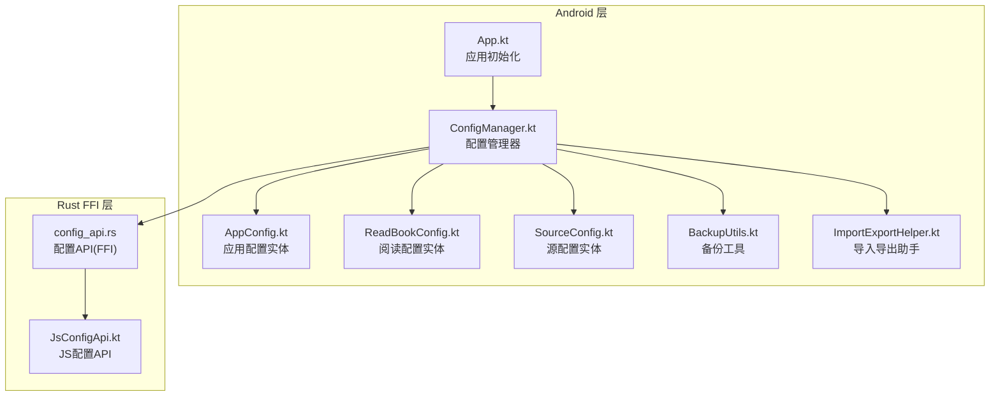
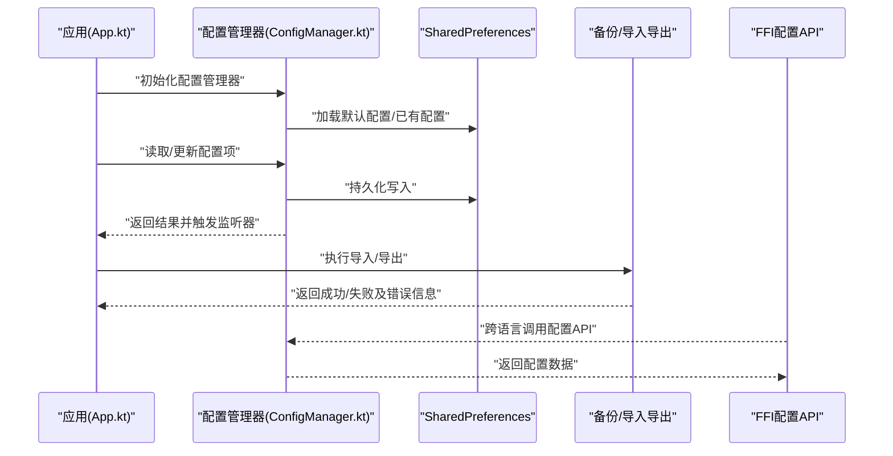
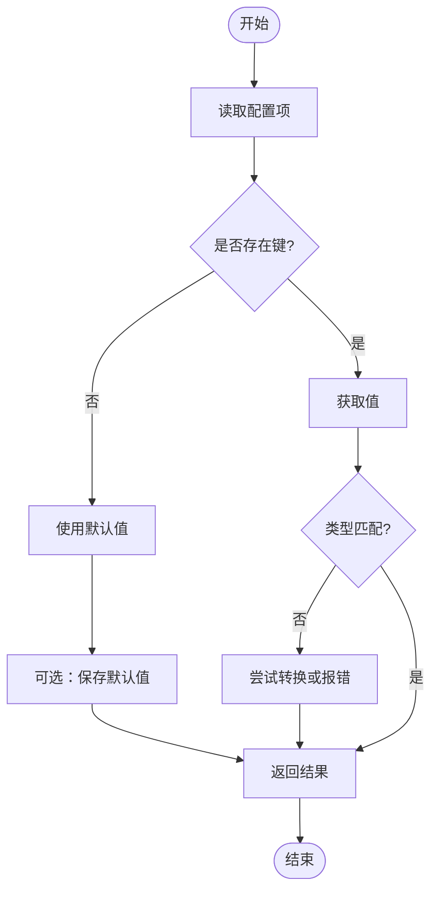
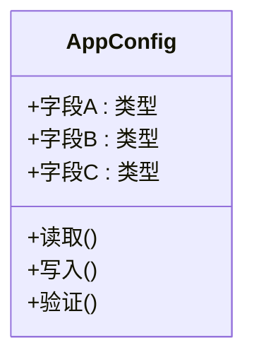
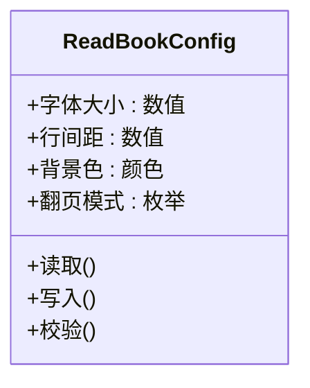
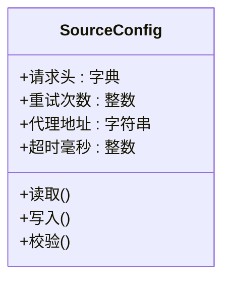
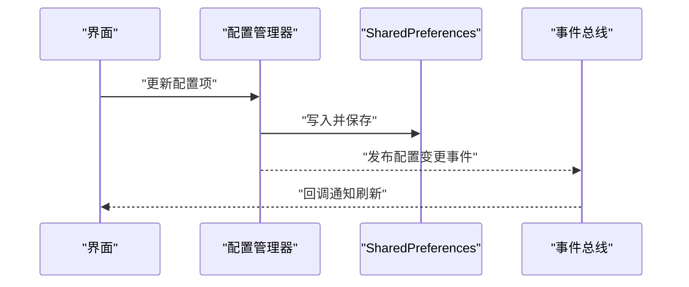
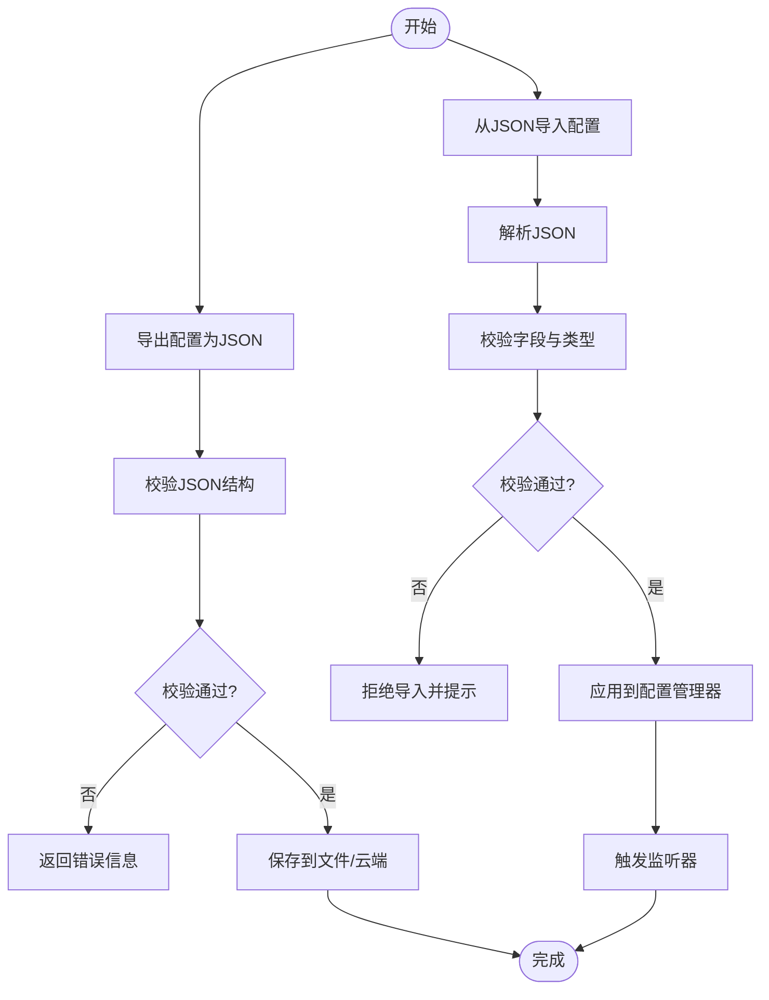
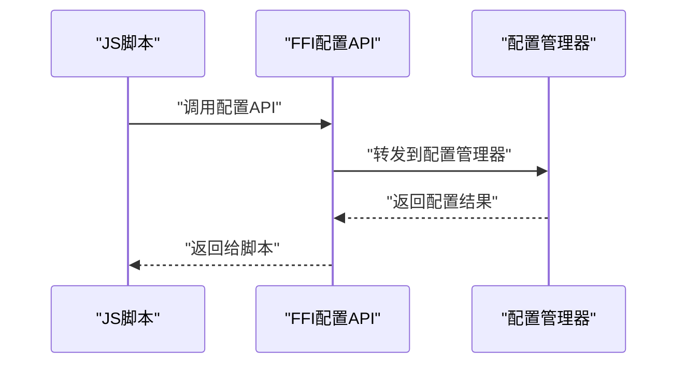
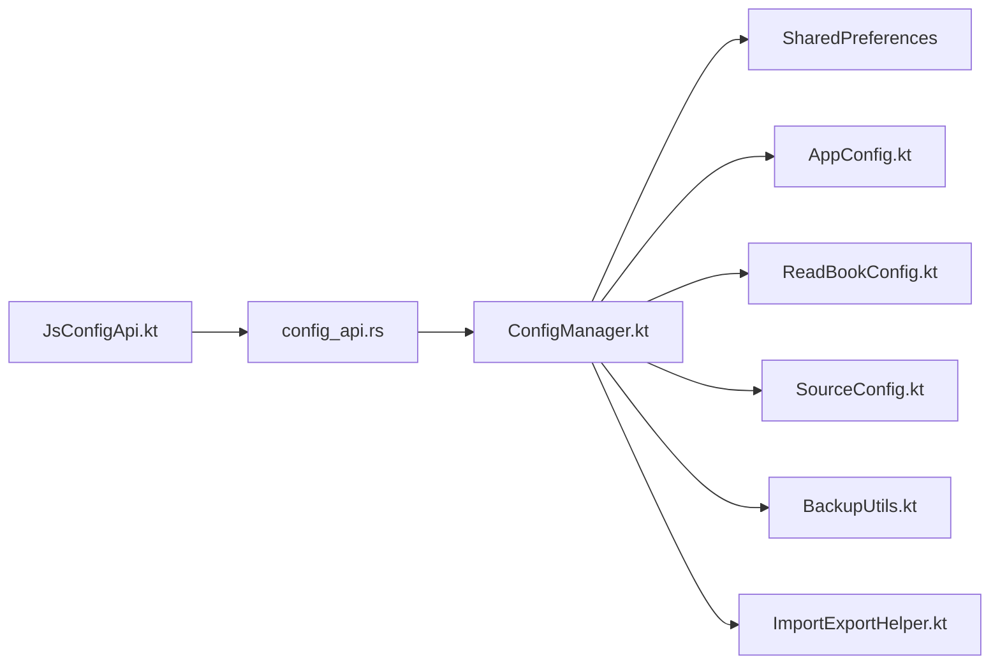

# 配置存储系统

<cite>
**本文引用的文件**   
- [App.kt](file://app/src/main/java/io/legado/app/App.kt)
- [ConfigManager.kt](file://app/src/main/java/io/legado/app/utils/ConfigManager.kt)
- [AppConfig.kt](file://app/src/main/java/io/legado/app/data/entity/AppConfig.kt)
- [ReadBookConfig.kt](file://app/src/main/java/io/legado/app/data/entity/ReadBookConfig.kt)
- [SourceConfig.kt](file://app/src/main/java/io/legado/app/data/entity/SourceConfig.kt)
- [BackupUtils.kt](file://app/src/main/java/io/legado/app/help/BackupUtils.kt)
- [ImportExportHelper.kt](file://app/src/main/java/io/legado/app/help/ImportExportHelper.kt)
- [ConfigApi.kt](file://rust/legado-ffi/src/api/config_api.rs)
- [JsConfigApi.kt](file://rust/legado-js/src/host_api/config_api.rs)
</cite>

## 目录
1. [简介](#简介)
2. [项目结构](#项目结构)
3. [核心组件](#核心组件)
4. [架构总览](#架构总览)
5. [详细组件分析](#详细组件分析)
6. [依赖关系分析](#依赖关系分析)
7. [性能考虑](#性能考虑)
8. [故障排查指南](#故障排查指南)
9. [结论](#结论)
10. [附录](#附录)

## 简介
本文件系统性梳理 Legado 项目的配置存储体系，重点覆盖：
- SharedPreferences 的键值对存储、数据类型支持与默认值设置
- 配置类结构与用途：AppConfig（应用级）、ReadBookConfig（阅读）、SourceConfig（源）
- 配置的持久化机制：自动保存、监听器与事件通知
- 配置的导入导出：JSON 转换、备份恢复、数据校验
- 读写配置、监听变更、处理冲突的实践示例
- 最佳实践与性能优化建议

## 项目结构
配置相关代码主要分布在 Android 层与 Rust FFI 层：
- Android 层负责 SharedPreferences 存取、配置对象封装、导入导出与备份恢复
- Rust FFI 层提供跨语言配置 API，供 JS 引擎或外部调用

**图示来源** 
- [App.kt](file://app/src/main/java/io/legado/app/App.kt)
- [ConfigManager.kt](file://app/src/main/java/io/legado/app/utils/ConfigManager.kt)
- [AppConfig.kt](file://app/src/main/java/io/legado/app/data/entity/AppConfig.kt)
- [ReadBookConfig.kt](file://app/src/main/java/io/legado/app/data/entity/ReadBookConfig.kt)
- [SourceConfig.kt](file://app/src/main/java/io/legado/app/data/entity/SourceConfig.kt)
- [BackupUtils.kt](file://app/src/main/java/io/legado/app/help/BackupUtils.kt)
- [ImportExportHelper.kt](file://app/src/main/java/io/legado/app/help/ImportExportHelper.kt)
- [ConfigApi.kt](file://rust/legado-ffi/src/api/config_api.rs)
- [JsConfigApi.kt](file://rust/legado-js/src/host_api/config_api.rs)

**章节来源**
- [App.kt](file://app/src/main/java/io/legado/app/App.kt)
- [ConfigManager.kt](file://app/src/main/java/io/legado/app/utils/ConfigManager.kt)

## 核心组件
- 配置管理器：统一封装 SharedPreferences 的读写、监听与批量操作，暴露稳定的配置访问接口
- 配置实体：将业务配置映射为强类型对象，便于序列化/反序列化和校验
- 备份与导入导出：基于 JSON 的序列化、校验与恢复流程
- FFI 配置 API：对外暴露配置读取/写入能力，支持跨语言调用

**章节来源**
- [ConfigManager.kt](file://app/src/main/java/io/legado/app/utils/ConfigManager.kt)
- [AppConfig.kt](file://app/src/main/java/io/legado/app/data/entity/AppConfig.kt)
- [ReadBookConfig.kt](file://app/src/main/java/io/legado/app/data/entity/ReadBookConfig.kt)
- [SourceConfig.kt](file://app/src/main/java/io/legado/app/data/entity/SourceConfig.kt)
- [BackupUtils.kt](file://app/src/main/java/io/legado/app/help/BackupUtils.kt)
- [ImportExportHelper.kt](file://app/src/main/java/io/legado/app/help/ImportExportHelper.kt)
- [ConfigApi.kt](file://rust/legado-ffi/src/api/config_api.rs)
- [JsConfigApi.kt](file://rust/legado-js/src/host_api/config_api.rs)

## 架构总览
配置存储的整体流程如下：
- 应用启动时初始化配置管理器与默认配置
- 业务模块通过配置管理器读写配置，触发持久化与监听回调
- 导入导出通过 JSON 序列化进行备份与恢复，并进行数据校验
- FFI 层暴露配置 API，供 JS 或其他宿主环境调用

**图示来源** 
- [App.kt](file://app/src/main/java/io/legado/app/App.kt)
- [ConfigManager.kt](file://app/src/main/java/io/legado/app/utils/ConfigManager.kt)
- [BackupUtils.kt](file://app/src/main/java/io/legado/app/help/BackupUtils.kt)
- [ImportExportHelper.kt](file://app/src/main/java/io/legado/app/help/ImportExportHelper.kt)
- [ConfigApi.kt](file://rust/legado-ffi/src/api/config_api.rs)

## 详细组件分析

### SharedPreferences 使用方式
- 键值对存储：以字符串键对应多种数据类型（布尔、整型、浮点、字符串、集合等）
- 默认值设置：在首次读取时提供默认值，保证配置可用性
- 监听器：注册变化监听，实现配置热更新与事件通知
- 事务性写入：批量更新时使用提交策略，减少磁盘 IO 次数

**图示来源** 
- [ConfigManager.kt](file://app/src/main/java/io/legado/app/utils/ConfigManager.kt)

**章节来源**
- [ConfigManager.kt](file://app/src/main/java/io/legado/app/utils/ConfigManager.kt)

### AppConfig 应用级配置
- 用途：管理应用全局开关、主题、语言、网络参数等
- 结构：包含多个字段，每个字段对应一个配置键，并提供默认值
- 特点：支持序列化/反序列化，便于导入导出与版本迁移

**图示来源** 
- [AppConfig.kt](file://app/src/main/java/io/legado/app/data/entity/AppConfig.kt)

**章节来源**
- [AppConfig.kt](file://app/src/main/java/io/legado/app/data/entity/AppConfig.kt)

### ReadBookConfig 阅读配置
- 用途：管理阅读器字体、行距、背景、翻页模式等阅读体验相关设置
- 结构：按阅读场景分组字段，便于 UI 绑定与快速切换
- 特点：支持默认模板与用户自定义覆盖

**图示来源** 
- [ReadBookConfig.kt](file://app/src/main/java/io/legado/app/data/entity/ReadBookConfig.kt)

**章节来源**
- [ReadBookConfig.kt](file://app/src/main/java/io/legado/app/data/entity/ReadBookConfig.kt)

### SourceConfig 源配置
- 用途：管理数据源的请求头、重试策略、代理、超时等网络相关配置
- 结构：按源维度组织配置，支持多源并存与独立生效
- 特点：具备安全校验与敏感字段脱敏能力

**图示来源** 
- [SourceConfig.kt](file://app/src/main/java/io/legado/app/data/entity/SourceConfig.kt)

**章节来源**
- [SourceConfig.kt](file://app/src/main/java/io/legado/app/data/entity/SourceConfig.kt)

### 配置持久化机制
- 自动保存：每次写入后即时落盘，确保崩溃不丢失
- 监听器：注册配置变化回调，UI 层可实时刷新
- 事件通知：通过事件总线或回调分发配置变更事件

**图示来源** 
- [ConfigManager.kt](file://app/src/main/java/io/legado/app/utils/ConfigManager.kt)

**章节来源**
- [ConfigManager.kt](file://app/src/main/java/io/legado/app/utils/ConfigManager.kt)

### 配置的导入导出
- JSON 格式转换：将配置对象序列化为 JSON，或从 JSON 反序列化为对象
- 备份恢复：全量或增量备份，支持版本兼容与回滚
- 数据校验：导入前进行字段完整性、类型与范围校验，失败则拒绝

**图示来源** 
- [BackupUtils.kt](file://app/src/main/java/io/legado/app/help/BackupUtils.kt)
- [ImportExportHelper.kt](file://app/src/main/java/io/legado/app/help/ImportExportHelper.kt)

**章节来源**
- [BackupUtils.kt](file://app/src/main/java/io/legado/app/help/BackupUtils.kt)
- [ImportExportHelper.kt](file://app/src/main/java/io/legado/app/help/ImportExportHelper.kt)

### FFI 配置 API
- 作用：为 JS 引擎或其他宿主提供统一的配置读写接口
- 能力：读取/写入配置、批量操作、事件订阅
- 安全：限制敏感字段访问，提供白名单机制

**图示来源** 
- [ConfigApi.kt](file://rust/legado-ffi/src/api/config_api.rs)
- [JsConfigApi.kt](file://rust/legado-js/src/host_api/config_api.rs)

**章节来源**
- [ConfigApi.kt](file://rust/legado-ffi/src/api/config_api.rs)
- [JsConfigApi.kt](file://rust/legado-js/src/host_api/config_api.rs)

## 依赖关系分析
- ConfigManager 依赖 SharedPreferences 进行持久化
- 各配置实体（AppConfig、ReadBookConfig、SourceConfig）被 ConfigManager 统一管理
- BackupUtils 与 ImportExportHelper 依赖配置实体进行序列化/反序列化
- FFI 配置 API 依赖 ConfigManager 暴露能力

**图示来源** 
- [ConfigManager.kt](file://app/src/main/java/io/legado/app/utils/ConfigManager.kt)
- [AppConfig.kt](file://app/src/main/java/io/legado/app/data/entity/AppConfig.kt)
- [ReadBookConfig.kt](file://app/src/main/java/io/legado/app/data/entity/ReadBookConfig.kt)
- [SourceConfig.kt](file://app/src/main/java/io/legado/app/data/entity/SourceConfig.kt)
- [BackupUtils.kt](file://app/src/main/java/io/legado/app/help/BackupUtils.kt)
- [ImportExportHelper.kt](file://app/src/main/java/io/legado/app/help/ImportExportHelper.kt)
- [ConfigApi.kt](file://rust/legado-ffi/src/api/config_api.rs)
- [JsConfigApi.kt](file://rust/legado-js/src/host_api/config_api.rs)

**章节来源**
- [ConfigManager.kt](file://app/src/main/java/io/legado/app/utils/ConfigManager.kt)

## 性能考虑
- 批量写入：合并多次写操作，减少 SharedPreferences 的磁盘 IO
- 懒加载：按需加载配置对象，避免启动时大量解析
- 缓存热点：对频繁读的配置项进行内存缓存，降低重复读取开销
- 异步处理：导入导出与大数据量操作放在后台线程，避免阻塞主线程
- 版本迁移：在配置升级时采用增量迁移，避免全量重写

[本节为通用指导，无需具体文件引用]

## 故障排查指南
- 配置未生效：检查键名是否一致、默认值是否正确、监听器是否注册
- 导入失败：查看 JSON 结构是否完整、字段类型是否匹配、校验规则是否通过
- 性能问题：定位频繁读写路径，评估是否可合并或缓存
- 冲突处理：比较新旧配置差异，制定合并策略（优先用户设置或默认值）

**章节来源**
- [ImportExportHelper.kt](file://app/src/main/java/io/legado/app/help/ImportExportHelper.kt)
- [ConfigManager.kt](file://app/src/main/java/io/legado/app/utils/ConfigManager.kt)

## 结论
Legado 的配置存储系统以 SharedPreferences 为核心，结合强类型配置实体与统一的配置管理器，实现了稳定可靠的键值对存储、自动持久化与监听通知。通过 JSON 化的导入导出与严格的校验机制，保障了数据的可移植性与一致性。FFI 配置 API 进一步扩展了跨语言调用能力，满足复杂场景需求。遵循本文的最佳实践与性能建议，可在保证用户体验的同时提升系统的稳定性与可维护性。

[本节为总结，无需具体文件引用]

## 附录
- 读写配置示例：通过配置管理器读取/更新字段，必要时触发监听器刷新 UI
- 监听配置变更：注册监听回调，处理配置变化逻辑
- 处理配置冲突：对比新旧配置，选择合适合并策略（如用户优先、默认回退）
- 备份恢复流程：导出为 JSON 备份，导入时校验并应用，失败回滚

[本节为补充说明，无需具体文件引用]