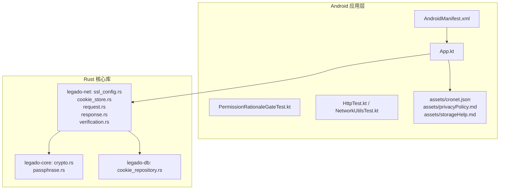
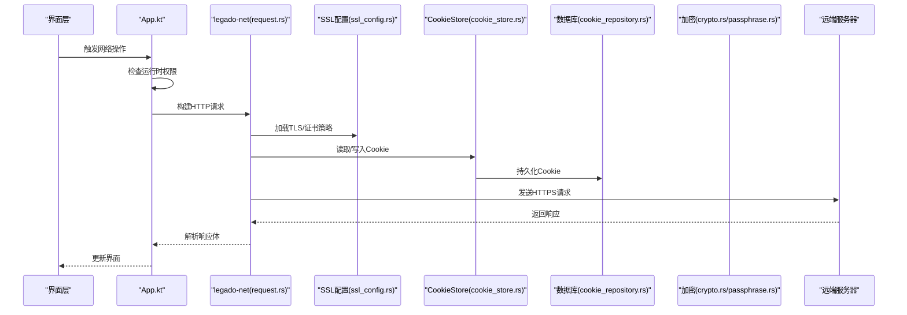
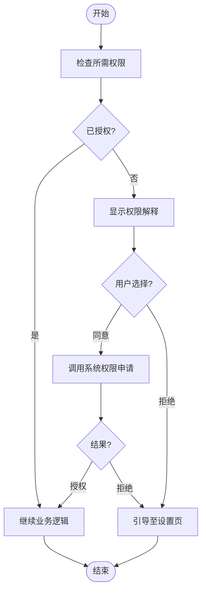
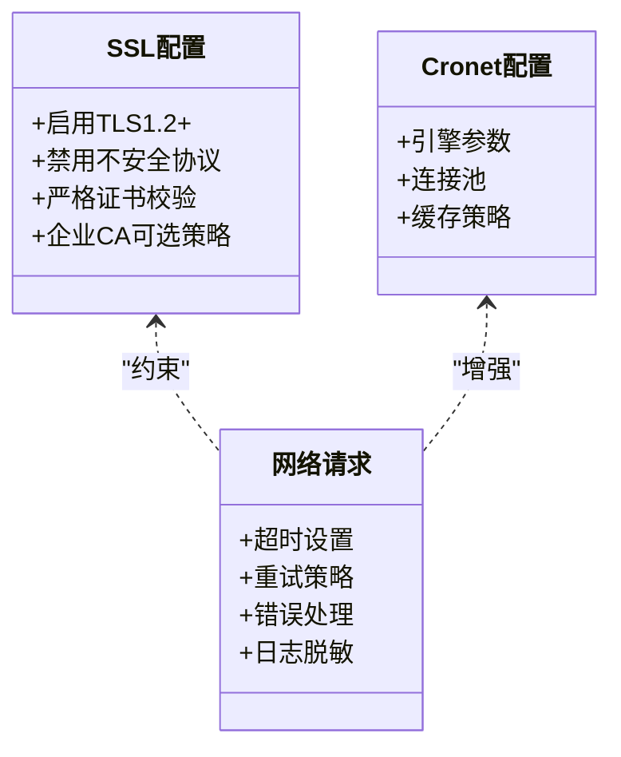
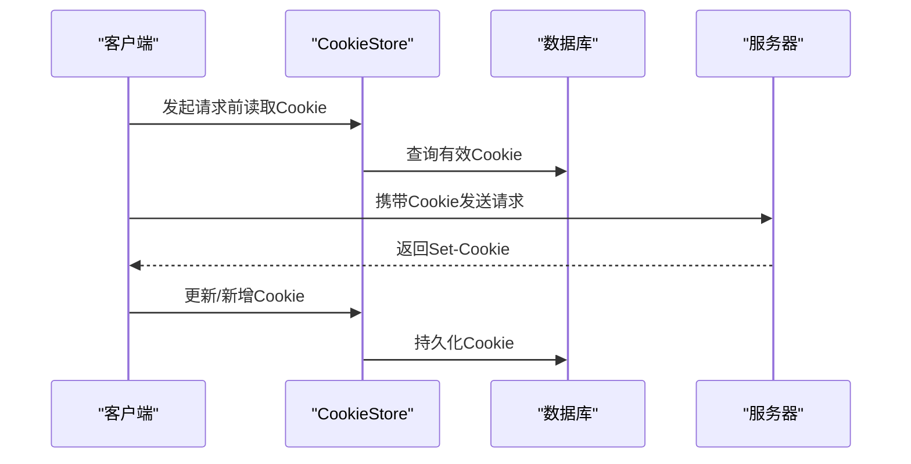
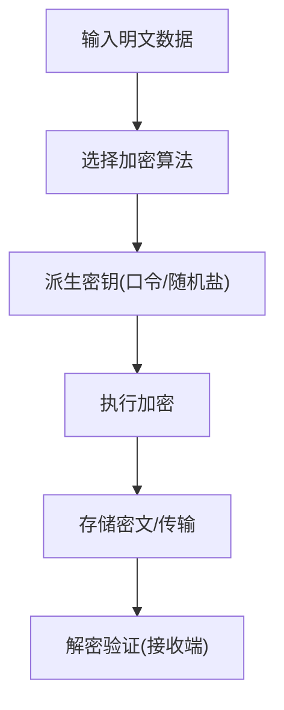
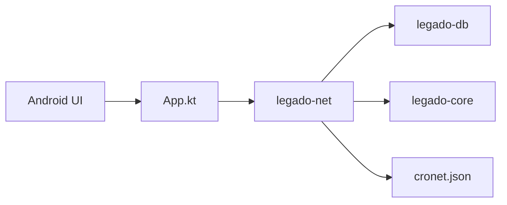

# 权限管理和安全

<cite>
**本文引用的文件**   
- [AndroidManifest.xml](file://app/src/main/AndroidManifest.xml)
- [App.kt](file://app/src/main/java/io/legado/app/App.kt)
- [PermissionRationaleGateTest.kt](file://app/src/test/java/io/legado/app/base/PermissionRationaleGateTest.kt)
- [HttpTest.kt](file://app/src/androidTest/java/io/legado/app/HttpTest.kt)
- [NetworkUtilsTest.kt](file://app/src/test/java/io/legado/app/utils/NetworkUtilsTest.kt)
- [ssl_config.rs](file://rust/legado-net/src/ssl_config.rs)
- [cookie_store.rs](file://rust/legado-net/src/cookie_store.rs)
- [request.rs](file://rust/legado-net/src/request.rs)
- [response.rs](file://rust/legado-net/src/response.rs)
- [verification.rs](file://rust/legado-net/src/verification.rs)
- [crypto.rs](file://rust/legado-core/src/crypto.rs)
- [passphrase.rs](file://rust/legado-core/src/passphrase.rs)
- [cookie_repository.rs](file://rust/legado-db/src/repository/cookie_repository.rs)
- [cronet.json](file://app/src/main/assets/cronet.json)
- [privacyPolicy.md](file://app/src/main/assets/privacyPolicy.md)
- [storageHelp.md](file://app/src/main/assets/storageHelp.md)
</cite>

## 目录
1. [简介](#简介)
2. [项目结构](#项目结构)
3. [核心组件](#核心组件)
4. [架构总览](#架构总览)
5. [详细组件分析](#详细组件分析)
6. [依赖关系分析](#依赖关系分析)
7. [性能考虑](#性能考虑)
8. [故障排查指南](#故障排查指南)
9. [结论](#结论)
10. [附录](#附录)

## 简介
本文件聚焦 Legado 项目的权限管理与安全机制，覆盖 Android 运行时权限申请流程（存储、网络、文件系统访问）、网络安全配置（HTTPS、SSL 证书校验、网络请求安全）、Cookie 管理（会话保持、跨域与安全存储）、主题与用户偏好设置的安全存储，以及隐私保护与数据加密的实现细节。文档以代码级分析与可视化图示为主，辅以最佳实践与常见问题解决方案，帮助开发者快速理解并落地安全方案。

## 项目结构
Legado 采用多模块架构：Android 应用层负责权限申请、UI 交互与系统能力调用；Rust 核心库提供网络、加密、数据库等底层能力；Web 前端用于源码编辑与管理。与权限和安全相关的重点位置包括：
- Android 清单与资源：声明所需权限与网络策略
- 应用初始化：统一权限检查与网络客户端初始化
- Rust 网络层：SSL/TLS 配置、Cookie 持久化、请求/响应处理
- Rust 核心：加密与口令管理
- 数据库层：Cookie 等敏感数据的持久化
- 资产文件：Cronet 配置、隐私政策与存储帮助说明

图表来源
- [AndroidManifest.xml](file://app/src/main/AndroidManifest.xml)
- [App.kt](file://app/src/main/java/io/legado/app/App.kt)
- [ssl_config.rs](file://rust/legado-net/src/ssl_config.rs)
- [cookie_store.rs](file://rust/legado-net/src/cookie_store.rs)
- [request.rs](file://rust/legado-net/src/request.rs)
- [response.rs](file://rust/legado-net/src/response.rs)
- [verification.rs](file://rust/legado-net/src/verification.rs)
- [crypto.rs](file://rust/legado-core/src/crypto.rs)
- [passphrase.rs](file://rust/legado-core/src/passphrase.rs)
- [cookie_repository.rs](file://rust/legado-db/src/repository/cookie_repository.rs)
- [cronet.json](file://app/src/main/assets/cronet.json)
- [privacyPolicy.md](file://app/src/main/assets/privacyPolicy.md)
- [storageHelp.md](file://app/src/main/assets/storageHelp.md)

章节来源
- [AndroidManifest.xml](file://app/src/main/AndroidManifest.xml)
- [App.kt](file://app/src/main/java/io/legado/app/App.kt)

## 核心组件
- 权限申请与提示门控：在 UI 层对运行时权限进行前置检查与解释，确保用户知情同意后再发起申请。
- 网络客户端与安全配置：基于 Cronet/Rust 网络栈，统一配置 HTTPS、证书校验、重试与速率限制。
- Cookie 管理：集中式 Cookie Store，支持会话保持、跨域策略与持久化到数据库。
- 加密与口令：对称/非对称加密工具与口令派生，保障本地敏感数据与传输安全。
- 数据库安全：对 Cookie 等敏感信息进行结构化存储与访问控制。

章节来源
- [PermissionRationaleGateTest.kt](file://app/src/test/java/io/legado/app/base/PermissionRationaleGateTest.kt)
- [ssl_config.rs](file://rust/legado-net/src/ssl_config.rs)
- [cookie_store.rs](file://rust/legado-net/src/cookie_store.rs)
- [request.rs](file://rust/legado-net/src/request.rs)
- [response.rs](file://rust/legado-net/src/response.rs)
- [verification.rs](file://rust/legado-net/src/verification.rs)
- [crypto.rs](file://rust/legado-core/src/crypto.rs)
- [passphrase.rs](file://rust/legado-core/src/passphrase.rs)
- [cookie_repository.rs](file://rust/legado-db/src/repository/cookie_repository.rs)

## 架构总览
下图展示从 Android 层发起网络请求到 Rust 网络栈的完整链路，包含权限检查、SSL 配置、Cookie 存取与响应处理。

图表来源
- [App.kt](file://app/src/main/java/io/legado/app/App.kt)
- [request.rs](file://rust/legado-net/src/request.rs)
- [ssl_config.rs](file://rust/legado-net/src/ssl_config.rs)
- [cookie_store.rs](file://rust/legado-net/src/cookie_store.rs)
- [cookie_repository.rs](file://rust/legado-db/src/repository/cookie_repository.rs)
- [crypto.rs](file://rust/legado-core/src/crypto.rs)
- [passphrase.rs](file://rust/legado-core/src/passphrase.rs)

## 详细组件分析

### Android 运行时权限申请流程
- 存储权限（读写外部存储）：针对 Android 11+ 使用分区存储，优先通过 MediaStore/SAF 访问公共目录；私有目录使用应用沙箱。
- 网络权限：INTERNET 为普通权限，自动授予；如需后台网络或特殊网络行为需额外声明。
- 文件系统访问：对敏感路径（如下载目录）需动态申请 READ_EXTERNAL_STORAGE/WRITE_EXTERNAL_STORAGE（旧版本），新版本建议走 SAF。
- 权限门控与解释：在 UI 层先检查是否已授权，未授权时显示解释文案，再调用系统对话框；拒绝后引导至设置页。

章节来源
- [PermissionRationaleGateTest.kt](file://app/src/test/java/io/legado/app/base/PermissionRationaleGateTest.kt)
- [AndroidManifest.xml](file://app/src/main/AndroidManifest.xml)

### 网络安全配置（HTTPS、SSL 证书验证、请求安全）
- HTTPS 强制：默认启用 TLS 1.2+，禁用不安全协议与弱密码套件。
- 证书校验：严格校验 CA 链，禁止自定义信任管理器绕过校验；必要时可引入企业 CA 但需明确策略。
- 请求安全：统一设置超时、重试、错误码处理与日志脱敏；避免明文传输敏感信息。
- Cronet 配置：通过 assets/cronet.json 指定网络引擎参数，提升性能与稳定性。

图表来源
- [ssl_config.rs](file://rust/legado-net/src/ssl_config.rs)
- [request.rs](file://rust/legado-net/src/request.rs)
- [cronet.json](file://app/src/main/assets/cronet.json)

章节来源
- [ssl_config.rs](file://rust/legado-net/src/ssl_config.rs)
- [request.rs](file://rust/legado-net/src/request.rs)
- [cronet.json](file://app/src/main/assets/cronet.json)

### Cookie 管理机制（会话保持、跨域与安全存储）
- 会话保持：CookieStore 统一管理域名作用域、过期时间与路径匹配，保证跨页面会话一致性。
- 跨域策略：按 RFC 规范处理 SameSite、Domain 与 Path 规则，防止跨站泄露。
- 安全存储：Cookie 持久化到数据库，结合加密字段与访问控制，降低泄露风险。
- 生命周期：根据响应头 Set-Cookie 更新，清理过期项，支持手动清除。

图表来源
- [cookie_store.rs](file://rust/legado-net/src/cookie_store.rs)
- [cookie_repository.rs](file://rust/legado-db/src/repository/cookie_repository.rs)

章节来源
- [cookie_store.rs](file://rust/legado-net/src/cookie_store.rs)
- [cookie_repository.rs](file://rust/legado-db/src/repository/cookie_repository.rs)

### 主题系统与用户偏好设置的安全存储
- 偏好类型：主题、字体、阅读设置等属于非敏感数据，可使用 SharedPreferences 或 Room 轻量存储。
- 安全加固：对可能包含敏感信息的偏好（如登录态、令牌）应加密存储或置于受保护区域。
- 同步与备份：避免将敏感偏好上传至云端；如需备份，需进行端到端加密。

章节来源
- [App.kt](file://app/src/main/java/io/legado/app/App.kt)

### 隐私保护与数据加密实现细节
- 本地加密：使用对称加密算法对敏感数据进行加密，密钥由口令派生，避免硬编码。
- 口令管理：口令哈希与盐值生成，支持升级与迁移。
- 传输加密：全链路 HTTPS，禁止明文传输；必要时增加签名与时间戳防重放。
- 隐私政策：在应用内提供隐私政策说明，明确数据收集与使用范围。

图表来源
- [crypto.rs](file://rust/legado-core/src/crypto.rs)
- [passphrase.rs](file://rust/legado-core/src/passphrase.rs)

章节来源
- [crypto.rs](file://rust/legado-core/src/crypto.rs)
- [passphrase.rs](file://rust/legado-core/src/passphrase.rs)
- [privacyPolicy.md](file://app/src/main/assets/privacyPolicy.md)

## 依赖关系分析
- Android 层依赖 Rust 网络库进行实际 I/O，权限检查在 UI 层完成，网络策略集中在 Rust 侧。
- Cookie 依赖数据库持久化，加密模块为敏感数据提供基础能力。
- Cronet 配置影响网络性能与兼容性，需与 SSL 策略协同。

图表来源
- [App.kt](file://app/src/main/java/io/legado/app/App.kt)
- [request.rs](file://rust/legado-net/src/request.rs)
- [cookie_repository.rs](file://rust/legado-db/src/repository/cookie_repository.rs)
- [crypto.rs](file://rust/legado-core/src/crypto.rs)
- [cronet.json](file://app/src/main/assets/cronet.json)

章节来源
- [App.kt](file://app/src/main/java/io/legado/app/App.kt)
- [request.rs](file://rust/legado-net/src/request.rs)
- [cookie_repository.rs](file://rust/legado-db/src/repository/cookie_repository.rs)
- [crypto.rs](file://rust/legado-core/src/crypto.rs)
- [cronet.json](file://app/src/main/assets/cronet.json)

## 性能考虑
- 网络层：启用连接复用、合理设置超时与重试次数，避免频繁握手；使用 Cronet 提升吞吐。
- Cookie 存储：按需加载与增量更新，减少数据库 IO。
- 加密开销：仅在必要场景使用高强度加密，批量操作时注意线程池与异步处理。
- 内存管理：避免大对象常驻内存，及时释放流与缓冲区。

## 故障排查指南
- 权限问题：确认清单声明与运行时申请顺序；检查用户拒绝后的引导逻辑。
- 网络异常：查看 SSL 证书链是否正确；核对 Cronet 配置与代理设置；检查超时与重试策略。
- Cookie 失效：验证 Domain/Path/SameSite 设置；检查过期时间与清理策略。
- 加密失败：确认密钥派生一致性与盐值存储；检查明文/密文格式。

章节来源
- [HttpTest.kt](file://app/src/androidTest/java/io/legado/app/HttpTest.kt)
- [NetworkUtilsTest.kt](file://app/src/test/java/io/legado/app/utils/NetworkUtilsTest.kt)
- [verification.rs](file://rust/legado-net/src/verification.rs)
- [storageHelp.md](file://app/src/main/assets/storageHelp.md)

## 结论
Legado 在权限管理、网络安全、Cookie 管理与数据加密方面形成了清晰的职责边界与协作机制。Android 层专注权限与交互，Rust 层提供稳定安全的网络与加密能力，数据库层负责敏感数据持久化。遵循本文的最佳实践与排查指南，可有效提升应用的安全性与用户体验。

## 附录
- 最佳实践清单
  - 始终在 UI 层进行权限检查与解释，避免直接调用系统对话框。
  - 强制 HTTPS，禁用不安全协议与弱密码套件。
  - 严格证书校验，不随意信任自签证书。
  - Cookie 按域与作用域管理，定期清理过期项。
  - 敏感数据加密存储，密钥由口令派生且不与数据同存。
  - 提供清晰的隐私政策与用户告知。
- 常见安全问题与解决方案
  - 明文传输：改用 HTTPS 与签名校验。
  - 证书绕过：移除自定义信任管理器，使用系统 CA。
  - Cookie 泄露：限制作用域与 SameSite，避免跨站共享。
  - 权限滥用：最小权限原则，按需申请。