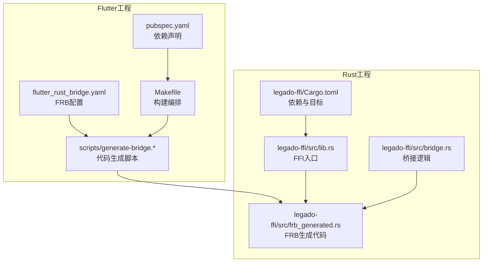
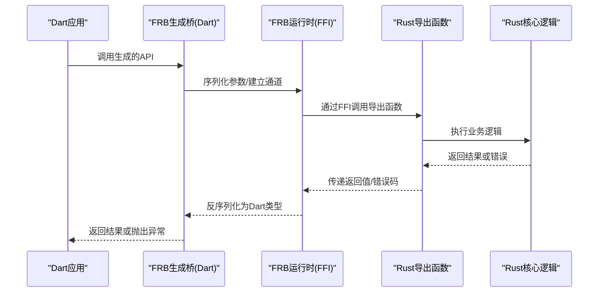
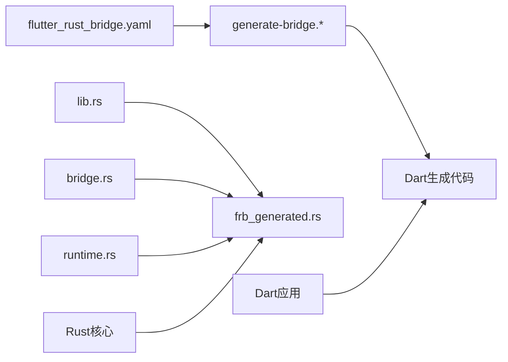

# FFI集成

<cite>
**本文引用的文件**   
- [flutter_rust_bridge.yaml](file://flutter_legado/flutter_rust_bridge.yaml)
- [generate-bridge.sh](file://flutter_legado/scripts/generate-bridge.sh)
- [generate-bridge.ps1](file://flutter_legado/scripts/generate-bridge.ps1)
- [lib.rs](file://rust/legado-ffi/src/lib.rs)
- [bridge.rs](file://rust/legado-ffi/src/bridge.rs)
- [frb_generated.rs](file://rust/legado-ffi/src/frb_generated.rs)
- [error.rs](file://rust/legado-ffi/src/error.rs)
- [runtime.rs](file://rust/legado-ffi/src/runtime.rs)
- [Cargo.toml](file://rust/legado-ffi/Cargo.toml)
- [pubspec.yaml](file://flutter_legado/pubspec.yaml)
- [Makefile](file://flutter_legado/Makefile)
</cite>

## 目录
1. [简介](#简介)
2. [项目结构](#项目结构)
3. [核心组件](#核心组件)
4. [架构总览](#架构总览)
5. [详细组件分析](#详细组件分析)
6. [依赖关系分析](#依赖关系分析)
7. [性能考虑](#性能考虑)
8. [故障排查指南](#故障排查指南)
9. [结论](#结论)
10. [附录](#附录)

## 简介
本文件面向Flutter与Rust的FFI集成，重点围绕Flutter Rust Bridge（FRB）工具链的使用与实践。内容涵盖接口定义、代码生成、类型映射、Rust函数到Dart的绑定过程（数据类型转换、错误处理、异步调用）、FFI接口设计与最佳实践（性能、内存管理、线程安全），以及调试与测试方法（日志记录、错误诊断、单元测试）。同时提供具体集成示例与常见问题解决方案，帮助读者快速落地并稳定维护跨语言边界。

## 项目结构
本项目采用“Flutter + Rust”双端协作模式：
- Flutter侧通过FRB配置与脚本驱动代码生成，并在Dart层使用生成的桥接API。
- Rust侧通过FRB宏与导出函数暴露能力，由构建流程编译为各平台原生库，供Flutter加载。

图表来源
- [flutter_rust_bridge.yaml](file://flutter_legado/flutter_rust_bridge.yaml)
- [generate-bridge.sh](file://flutter_legado/scripts/generate-bridge.sh)
- [generate-bridge.ps1](file://flutter_legado/scripts/generate-bridge.ps1)
- [lib.rs](file://rust/legado-ffi/src/lib.rs)
- [bridge.rs](file://rust/legado-ffi/src/bridge.rs)
- [frb_generated.rs](file://rust/legado-ffi/src/frb_generated.rs)
- [Cargo.toml](file://rust/legado-ffi/Cargo.toml)
- [pubspec.yaml](file://flutter_legado/pubspec.yaml)
- [Makefile](file://flutter_legado/Makefile)

章节来源
- [flutter_rust_bridge.yaml](file://flutter_legado/flutter_rust_bridge.yaml)
- [generate-bridge.sh](file://flutter_legado/scripts/generate-bridge.sh)
- [generate-bridge.ps1](file://flutter_legado/scripts/generate-bridge.ps1)
- [lib.rs](file://rust/legado-ffi/src/lib.rs)
- [bridge.rs](file://rust/legado-ffi/src/bridge.rs)
- [frb_generated.rs](file://rust/legado-ffi/src/frb_generated.rs)
- [Cargo.toml](file://rust/legado-ffi/Cargo.toml)
- [pubspec.yaml](file://flutter_legado/pubspec.yaml)
- [Makefile](file://flutter_legado/Makefile)

## 核心组件
- FRB配置文件：集中定义类型映射、模块划分、生成选项等，是Dart与Rust之间的契约。
- 代码生成脚本：封装FRB CLI调用，统一多平台生成流程，便于CI与本地开发。
- Rust FFI入口：通过FRB宏导出函数与类型，组织业务逻辑与错误模型。
- 生成代码：FRB自动产出Rust侧绑定与Dart侧API，确保两端类型一致。
- 构建编排：在Flutter侧通过Makefile或脚本协调Rust构建与Dart生成。

章节来源
- [flutter_rust_bridge.yaml](file://flutter_legado/flutter_rust_bridge.yaml)
- [generate-bridge.sh](file://flutter_legado/scripts/generate-bridge.sh)
- [generate-bridge.ps1](file://flutter_legado/scripts/generate-bridge.ps1)
- [lib.rs](file://rust/legado-ffi/src/lib.rs)
- [Cargo.toml](file://rust/legado-ffi/Cargo.toml)
- [pubspec.yaml](file://flutter_legado/pubspec.yaml)
- [Makefile](file://flutter_legado/Makefile)

## 架构总览
下图展示从Dart发起调用到Rust执行并返回结果的整体流程，包括类型转换、错误传播与异步回调路径。

图表来源
- [lib.rs](file://rust/legado-ffi/src/lib.rs)
- [bridge.rs](file://rust/legado-ffi/src/bridge.rs)
- [frb_generated.rs](file://rust/legado-ffi/src/frb_generated.rs)

## 详细组件分析

### FRB配置与代码生成
- 配置文件负责声明模块、类型映射、生成目标与插件选项，保证Dart与Rust两侧类型一致性。
- 生成脚本封装FRB命令，支持Windows与Unix环境，统一输出目录与清理策略。
- 建议在CI中强制运行生成步骤，避免手工差异导致的不一致。

章节来源
- [flutter_rust_bridge.yaml](file://flutter_legado/flutter_rust_bridge.yaml)
- [generate-bridge.sh](file://flutter_legado/scripts/generate-bridge.sh)
- [generate-bridge.ps1](file://flutter_legado/scripts/generate-bridge.ps1)

### Rust FFI入口与导出
- 入口文件集中注册FRB宏与导出函数，将业务模块按领域拆分，保持清晰边界。
- 错误模型统一抽象，便于跨语言传播；必要时提供可序列化的错误上下文。
- 生命周期与所有权遵循Rust规则，避免悬垂指针与重复释放。

章节来源
- [lib.rs](file://rust/legado-ffi/src/lib.rs)
- [bridge.rs](file://rust/legado-ffi/src/bridge.rs)
- [error.rs](file://rust/legado-ffi/src/error.rs)

### FRB生成代码与类型映射
- 生成代码包含Rust侧绑定与Dart侧API，自动处理基本类型、集合、枚举与可选值。
- 复杂类型建议拆分为POD结构体，减少跨边界拷贝成本。
- 字符串与字节数组需明确编码约定（如UTF-8），避免乱码与截断。

章节来源
- [frb_generated.rs](file://rust/legado-ffi/src/frb_generated.rs)
- [flutter_rust_bridge.yaml](file://flutter_legado/flutter_rust_bridge.yaml)

### 运行时与错误处理
- 运行时负责FFI通道、线程调度与资源管理，确保跨进程/跨线程安全。
- 错误处理应区分可恢复与不可恢复错误，上层进行友好提示与重试策略。
- 日志与追踪信息应在Rust侧捕获并透传到Dart，便于定位问题。

章节来源
- [runtime.rs](file://rust/legado-ffi/src/runtime.rs)
- [error.rs](file://rust/legado-ffi/src/error.rs)

### 构建编排与依赖声明
- Flutter侧通过Makefile或脚本协调Rust构建与Dart生成，保证产物一致。
- pubspec.yaml声明FRB相关依赖与版本约束，避免升级冲突。
- Cargo.toml指定目标平台、特性开关与优化级别，影响最终二进制大小与性能。

章节来源
- [Makefile](file://flutter_legado/Makefile)
- [pubspec.yaml](file://flutter_legado/pubspec.yaml)
- [Cargo.toml](file://rust/legado-ffi/Cargo.toml)

## 依赖关系分析
下图展示Flutter与Rust侧关键文件的依赖关系，突出FRB生成代码的桥梁作用。

图表来源
- [flutter_rust_bridge.yaml](file://flutter_legado/flutter_rust_bridge.yaml)
- [generate-bridge.sh](file://flutter_legado/scripts/generate-bridge.sh)
- [generate-bridge.ps1](file://flutter_legado/scripts/generate-bridge.ps1)
- [lib.rs](file://rust/legado-ffi/src/lib.rs)
- [bridge.rs](file://rust/legado-ffi/src/bridge.rs)
- [frb_generated.rs](file://rust/legado-ffi/src/frb_generated.rs)
- [runtime.rs](file://rust/legado-ffi/src/runtime.rs)

章节来源
- [flutter_rust_bridge.yaml](file://flutter_legado/flutter_rust_bridge.yaml)
- [generate-bridge.sh](file://flutter_legado/scripts/generate-bridge.sh)
- [generate-bridge.ps1](file://flutter_legado/scripts/generate-bridge.ps1)
- [lib.rs](file://rust/legado-ffi/src/lib.rs)
- [bridge.rs](file://rust/legado-ffi/src/bridge.rs)
- [frb_generated.rs](file://rust/legado-ffi/src/frb_generated.rs)
- [runtime.rs](file://rust/legado-ffi/src/runtime.rs)

## 性能考虑
- 数据拷贝最小化：优先使用零拷贝视图与引用，避免大对象频繁跨边界复制。
- 批量操作：合并多次调用为单次批处理，降低FFI开销。
- 异步与并发：长耗时任务在Rust侧异步执行，通过回调或流式返回，避免阻塞UI线程。
- 内存管理：严格遵循Rust所有权模型，避免不必要的分配与克隆；在Dart侧及时释放引用。
- 序列化优化：选择轻量级格式，减少编解码成本；对热点路径启用缓存。

[本节为通用指导，不直接分析具体文件]

## 故障排查指南
- 类型不匹配：检查FRB配置中的类型映射，确保Dart与Rust两端一致。
- 崩溃与段错误：确认指针生命周期与所有权，避免越界访问与重复释放。
- 异步回调丢失：检查线程切换与事件循环，确保回调在正确上下文中触发。
- 日志缺失：在Rust侧增加结构化日志，结合错误码与上下文信息。
- 构建不一致：在CI中固化生成与构建步骤，确保产物可复现。

章节来源
- [error.rs](file://rust/legado-ffi/src/error.rs)
- [runtime.rs](file://rust/legado-ffi/src/runtime.rs)

## 结论
通过FRB工具链，Flutter与Rust可以高效、安全地集成。关键在于清晰的接口设计、严格的类型映射、完善的错误处理与性能优化。配合自动化生成与构建编排，能够显著提升开发效率与系统稳定性。

[本节为总结性内容，不直接分析具体文件]

## 附录
- 常见集成示例
  - 简单函数绑定：定义Rust导出函数，配置FRB类型映射，生成Dart API后直接调用。
  - 异步调用：使用Future或回调机制，将耗时任务下沉至Rust线程池。
  - 错误传播：定义统一错误类型，携带错误码与消息，Dart侧进行友好提示。
- 常见问题解决方案
  - 字符串乱码：统一UTF-8编码，避免混用不同编码。
  - 内存泄漏：在Rust侧确保RAII语义，在Dart侧及时释放资源。
  - 线程安全：避免共享可变状态，必要时使用锁或消息队列。

[本节为概念性内容，不直接分析具体文件]