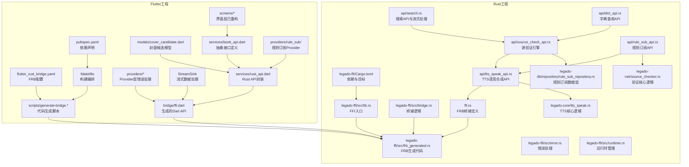
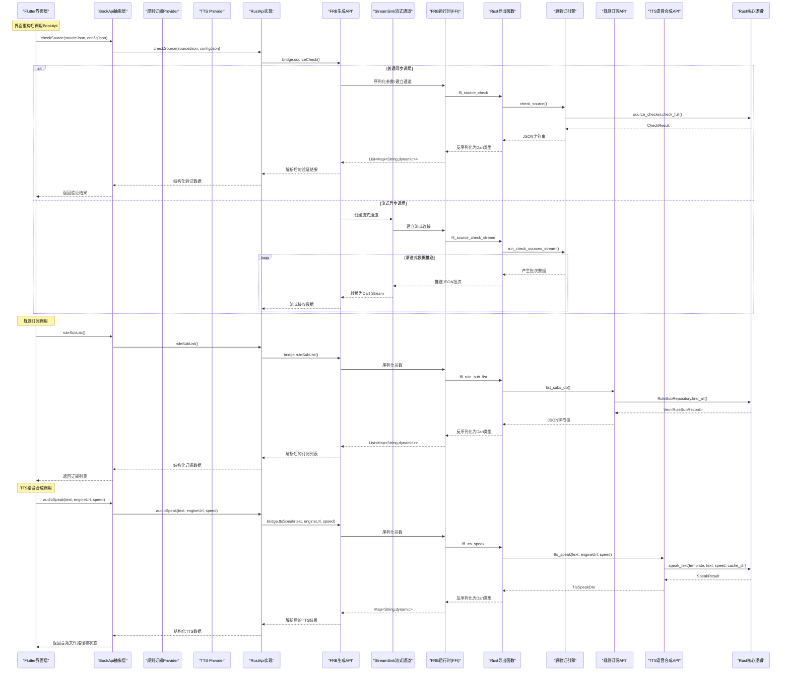
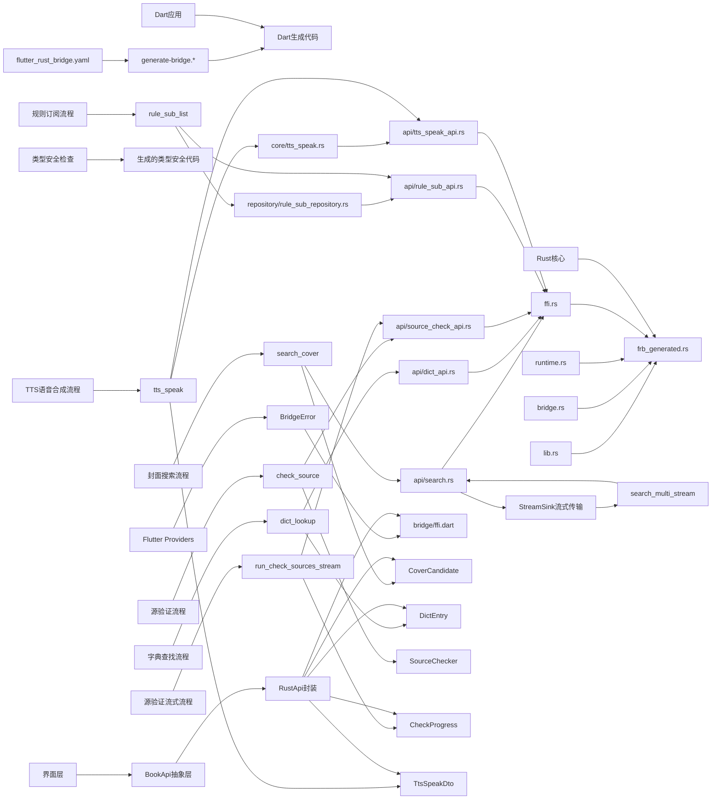

# FFI集成

<cite>
**本文引用的文件**   
- [flutter_rust_bridge.yaml](file://flutter_legado/flutter_rust_bridge.yaml)
- [generate-bridge.sh](file://flutter_legado/scripts/generate-bridge.sh)
- [generate-bridge.ps1](file://flutter_legado/scripts/generate-bridge.ps1)
- [lib.rs](file://rust/legado-ffi/src/lib.rs)
- [bridge.rs](file://rust/legado-ffi/src/bridge.rs)
- [frb_generated.rs](file://rust/legado-ffi/src/frb_generated.rs)
- [error.rs](file://rust/legado-ffi/src/error.rs)
- [runtime.rs](file://rust/legado-ffi/src/runtime.rs)
- [Cargo.toml](file://rust/legado-ffi/Cargo.toml)
- [pubspec.yaml](file://flutter_legado/pubspec.yaml)
- [Makefile](file://flutter_legado/Makefile)
- [search.rs](file://rust/legado-ffi/src/api/search.rs)
- [dict_api.rs](file://rust/legado-ffi/src/api/dict_api.rs)
- [source_check_api.rs](file://rust/legado-ffi/src/api/source_check_api.rs)
- [rule_sub_api.rs](file://rust/legado-ffi/src/api/rule_sub_api.rs)
- [tts_speak_api.rs](file://rust/legado-ffi/src/api/tts_speak_api.rs)
- [tts_speak.rs](file://rust/legado-core/src/tts_speak.rs)
- [rule_sub_repository.rs](file://rust/legado-db/src/repository/rule_sub_repository.rs)
- [ffi.rs](file://rust/legado-ffi/src/ffi.rs)
- [mod.rs](file://rust/legado-ffi/src/api/mod.rs)
- [ffi.dart](file://flutter_legado/lib/src/bridge/ffi/ffi.dart)
- [rust_api.dart](file://flutter_legado/lib/src/services/rust_api.dart)
- [book_api.dart](file://flutter_legado/lib/src/services/book_api.dart)
- [mock_book_api.dart](file://flutter_legado/lib/src/services/mock_book_api.dart)
- [cover_candidate.dart](file://flutter_legado/lib/src/models/cover_candidate.dart)
- [rule_sub_notifier.dart](file://flutter_legado/lib/src/providers/rule_sub/rule_sub_notifier.dart)
</cite>

## 更新摘要
**所做更改**   
- **新增TTS语音合成功能**：实现了完整的HTTP TTS语音合成管线，包括TtsSpeakDto结构体和camelCase字段命名支持
- **增强FFI接口**：在tts_speak_api.rs中新增tts_speak和set_tts_cache_dir函数，提供TTS音频合成能力
- **完善核心逻辑**：在legado-core中实现完整的TTS合成管线，支持URL模板替换、HTTP请求、Content-Type校验和MD5缓存
- **Flutter集成**：在BookApi抽象层中添加HTTP TTS配置管理方法，支持TTS配置的CRUD操作
- **缓存机制**：实现基于文件系统的全局TTS音频缓存目录，支持跨进程缓存命中
- **错误处理**：完善的错误处理机制，包括空文本检测、网络错误处理和JSON错误响应解析

## 目录
1. [简介](#简介)
2. [项目结构](#项目结构)
3. [核心组件](#核心组件)
4. [架构总览](#架构总览)
5. [详细组件分析](#详细组件分析)
6. [依赖关系分析](#依赖关系分析)
7. [性能考虑](#性能考虑)
8. [故障排查指南](#故障排查指南)
9. [结论](#结论)
10. [附录](#附录)

## 简介
本文件面向Flutter与Rust的FFI集成，重点围绕Flutter Rust Bridge（FRB）工具链的使用与实践。内容涵盖接口定义、代码生成、类型映射、Rust函数到Dart的绑定过程（数据类型转换、错误处理、异步调用）、FFI接口设计与最佳实践（性能、内存管理、线程安全），以及调试与测试方法（日志记录、错误诊断、单元测试）。同时提供具体集成示例与常见问题解决方案，帮助读者快速落地并稳定维护跨语言边界。

**重大更新**：本项目已完成从手动rust_bridge到生成的FFI绑定系统的架构迁移，显著提高了类型安全性和运行性能。新的架构通过FRB自动生成类型安全的绑定代码，消除了手动维护FFI接口的复杂性和潜在错误。**新增流式数据传输机制**：支持渐进式搜索结果推送，提升用户体验。**新增封面搜索功能**：实现了完整的Rust FFI绑定、Flutter集成层和Mock实现。**新增字典查找功能**：提供了本地内置词典查询能力，支持结构化释义返回。**新增源验证引擎**：实现了486行核心验证代码，支持单本校验和批量流式校验。**新增规则订阅功能**：实现了完整的规则订阅CRUD操作，支持书源、替换规则和RSS源的订阅管理。**新增TTS语音合成功能**：实现了完整的HTTP TTS语音合成管线，支持URL模板替换、HTTP请求、Content-Type校验和MD5缓存机制。

**最新进展**：完成了多个界面的桥接消除重构，所有直接bridge调用已迁移到BookApi抽象层，符合UI_RESTRUCTURE_PLAN.md架构要求，显著提升了代码的可维护性和类型安全性。**新增的486行源验证引擎代码**提供了完整的书源有效性检查功能，支持单本校验和批量流式校验。**新增的规则订阅功能**完善了应用的内容管理能力，支持用户自定义订阅源的管理和自动更新。**新增的TTS语音合成功能**为应用提供了强大的文本转语音能力，支持多种TTS引擎和缓存优化。

## 项目结构
本项目采用"Flutter + Rust"双端协作模式，基于FRB工具链实现高效的FFI集成：
- Flutter侧通过FRB配置与脚本驱动代码生成，并在Dart层使用生成的桥接API。
- Rust侧通过FRB宏与导出函数暴露能力，由构建流程编译为各平台原生库，供Flutter加载。
- 生成的代码确保两端类型一致性，提供零拷贝的数据传输和高效的错误处理机制。
- **新增流式数据传输**：通过StreamSink实现Rust到Dart的渐进式数据推送。
- **新增封面搜索功能**：完整的Rust实现、FFI绑定和Flutter集成层。
- **新增字典查找功能**：本地内置词典查询，支持结构化释义返回。
- **新增源验证引擎**：486行核心验证代码，支持单本校验和批量流式校验。
- **新增规则订阅功能**：完整的CRUD操作，支持书源、替换规则和RSS源的订阅管理。
- **新增TTS语音合成**：完整的HTTP TTS语音合成管线，支持URL模板替换和缓存机制。
- **新增BookApi抽象层**：统一管理所有FFI调用，提供类型安全的接口访问。

图表来源
- [flutter_rust_bridge.yaml](file://flutter_legado/flutter_rust_bridge.yaml)
- [generate-bridge.sh](file://flutter_legado/scripts/generate-bridge.sh)
- [generate-bridge.ps1](file://flutter_legado/scripts/generate-bridge.ps1)
- [lib.rs](file://rust/legado-ffi/src/lib.rs)
- [bridge.rs](file://rust/legado-ffi/src/bridge.rs)
- [frb_generated.rs](file://rust/legado-ffi/src/frb_generated.rs)
- [Cargo.toml](file://rust/legado-ffi/Cargo.toml)
- [pubspec.yaml](file://flutter_legado/pubspec.yaml)
- [Makefile](file://flutter_legado/Makefile)
- [search.rs](file://rust/legado-ffi/src/api/search.rs)
- [dict_api.rs](file://rust/legado-ffi/src/api/dict_api.rs)
- [source_check_api.rs](file://rust/legado-ffi/src/api/source_check_api.rs)
- [rule_sub_api.rs](file://rust/legado-ffi/src/api/rule_sub_api.rs)
- [tts_speak_api.rs](file://rust/legado-ffi/src/api/tts_speak_api.rs)
- [tts_speak.rs](file://rust/legado-core/src/tts_speak.rs)
- [rule_sub_repository.rs](file://rust/legado-db/src/repository/rule_sub_repository.rs)
- [ffi.rs](file://rust/legado-ffi/src/ffi.rs)
- [ffi.dart](file://flutter_legado/lib/src/bridge/ffi/ffi.dart)
- [rust_api.dart](file://flutter_legado/lib/src/services/rust_api.dart)
- [cover_candidate.dart](file://flutter_legado/lib/src/models/cover_candidate.dart)
- [book_api.dart](file://flutter_legado/lib/src/services/book_api.dart)
- [source_checker.rs](file://rust/legado-net/src/source_checker.rs)

章节来源
- [flutter_rust_bridge.yaml](file://flutter_legado/flutter_rust_bridge.yaml)
- [generate-bridge.sh](file://flutter_legado/scripts/generate-bridge.sh)
- [generate-bridge.ps1](file://flutter_legado/scripts/generate-bridge.ps1)
- [lib.rs](file://rust/legado-ffi/src/lib.rs)
- [bridge.rs](file://rust/legado-ffi/src/bridge.rs)
- [frb_generated.rs](file://rust/legado-ffi/src/frb_generated.rs)
- [Cargo.toml](file://rust/legado-ffi/Cargo.toml)
- [pubspec.yaml](file://flutter_legado/pubspec.yaml)
- [Makefile](file://flutter_legado/Makefile)
- [search.rs](file://rust/legado-ffi/src/api/search.rs)
- [dict_api.rs](file://rust/legado-ffi/src/api/dict_api.rs)
- [source_check_api.rs](file://rust/legado-ffi/src/api/source_check_api.rs)
- [rule_sub_api.rs](file://rust/legado-ffi/src/api/rule_sub_api.rs)
- [tts_speak_api.rs](file://rust/legado-ffi/src/api/tts_speak_api.rs)
- [tts_speak.rs](file://rust/legado-core/src/tts_speak.rs)
- [rule_sub_repository.rs](file://rust/legado-db/src/repository/rule_sub_repository.rs)
- [ffi.rs](file://rust/legado-ffi/src/ffi.rs)
- [ffi.dart](file://flutter_legado/lib/src/bridge/ffi/ffi.dart)
- [rust_api.dart](file://flutter_legado/lib/src/services/rust_api.dart)
- [cover_candidate.dart](file://flutter_legado/lib/src/models/cover_candidate.dart)
- [book_api.dart](file://flutter_legado/lib/src/services/book_api.dart)
- [source_checker.rs](file://rust/legado-net/src/source_checker.rs)

## 核心组件
- FRB配置文件：集中定义类型映射、模块划分、生成选项等，是Dart与Rust之间的契约。
- 代码生成脚本：封装FRB CLI调用，统一多平台生成流程，便于CI与本地开发。
- Rust FFI入口：通过FRB宏导出函数与类型，组织业务逻辑与错误模型。
- 生成代码：FRB自动产出Rust侧绑定与Dart侧API，确保两端类型一致。
- 构建编排：在Flutter侧通过Makefile或脚本协调Rust构建与Dart生成。
- **BridgeError处理**：统一的错误类型定义和异常处理机制，提升错误诊断能力。
- **类型安全保证**：通过FRB的类型系统确保跨语言调用的类型安全性。
- **StreamSink流式传输**：支持Rust到Dart的渐进式数据推送，提升大数据量处理性能。
- **封面搜索功能**：完整的Rust实现、FFI绑定和Flutter集成层，支持从搜索结果中提取封面URL。
- **字典查找功能**：本地内置词典查询，返回结构化释义信息。
- **源验证引擎**：486行核心验证代码，支持单本校验和批量流式校验，包含验证码检测和重定向检测。
- **规则订阅功能**：完整的CRUD操作，支持书源、替换规则和RSS源的订阅管理，包含自动更新和排序功能。
- **TTS语音合成**：完整的HTTP TTS语音合成管线，支持URL模板替换、HTTP请求、Content-Type校验和MD5缓存。
- **BookApi抽象层**：统一的API接口定义，隔离UI层与底层实现的耦合。

章节来源
- [flutter_rust_bridge.yaml](file://flutter_legado/flutter_rust_bridge.yaml)
- [generate-bridge.sh](file://flutter_legado/scripts/generate-bridge.sh)
- [generate-bridge.ps1](file://flutter_legado/scripts/generate-bridge.ps1)
- [lib.rs](file://rust/legado-ffi/src/lib.rs)
- [Cargo.toml](file://rust/legado-ffi/Cargo.toml)
- [pubspec.yaml](file://flutter_legado/pubspec.yaml)
- [Makefile](file://flutter_legado/Makefile)
- [search.rs](file://rust/legado-ffi/src/api/search.rs)
- [dict_api.rs](file://rust/legado-ffi/src/api/dict_api.rs)
- [source_check_api.rs](file://rust/legado-ffi/src/api/source_check_api.rs)
- [rule_sub_api.rs](file://rust/legado-ffi/src/api/rule_sub_api.rs)
- [tts_speak_api.rs](file://rust/legado-ffi/src/api/tts_speak_api.rs)
- [tts_speak.rs](file://rust/legado-core/src/tts_speak.rs)
- [rule_sub_repository.rs](file://rust/legado-db/src/repository/rule_sub_repository.rs)
- [ffi.rs](file://rust/legado-ffi/src/ffi.rs)
- [book_api.dart](file://flutter_legado/lib/src/services/book_api.dart)

## 架构总览
下图展示从Dart发起调用到Rust执行并返回结果的整体流程，包括类型转换、错误传播与异步回调路径。新的架构通过FRB自动生成类型安全的绑定代码，消除了手动维护FFI接口的复杂性。**新增StreamSink流式传输路径**，支持渐进式数据推送。**新增封面搜索、字典查找、源验证、规则订阅和TTS语音合成功能的完整调用链路**。

图表来源
- [lib.rs](file://rust/legado-ffi/src/lib.rs)
- [bridge.rs](file://rust/legado-ffi/src/bridge.rs)
- [frb_generated.rs](file://rust/legado-ffi/src/frb_generated.rs)
- [search.rs](file://rust/legado-ffi/src/api/search.rs)
- [dict_api.rs](file://rust/legado-ffi/src/api/dict_api.rs)
- [source_check_api.rs](file://rust/legado-ffi/src/api/source_check_api.rs)
- [rule_sub_api.rs](file://rust/legado-ffi/src/api/rule_sub_api.rs)
- [tts_speak_api.rs](file://rust/legado-ffi/src/api/tts_speak_api.rs)
- [tts_speak.rs](file://rust/legado-core/src/tts_speak.rs)
- [rule_sub_repository.rs](file://rust/legado-db/src/repository/rule_sub_repository.rs)
- [ffi.rs](file://rust/legado-ffi/src/ffi.rs)
- [rust_api.dart](file://flutter_legado/lib/src/services/rust_api.dart)
- [book_api.dart](file://flutter_legado/lib/src/services/book_api.dart)
- [source_checker.rs](file://rust/legado-net/src/source_checker.rs)

## 详细组件分析

### FRB配置与代码生成
- 配置文件负责声明模块、类型映射、生成目标与插件选项，保证Dart与Rust两侧类型一致性。
- 生成脚本封装FRB命令，支持Windows与Unix环境，统一输出目录与清理策略。
- 建议在CI中强制运行生成步骤，避免手工差异导致的不一致。
- **新增**：FRB配置现在支持更复杂的类型映射规则，包括自定义序列化器和转换器。
- **流式传输支持**：配置中包含StreamSink相关的编解码器设置。

章节来源
- [flutter_rust_bridge.yaml](file://flutter_legado/flutter_rust_bridge.yaml)
- [generate-bridge.sh](file://flutter_legado/scripts/generate-bridge.sh)
- [generate-bridge.ps1](file://flutter_legado/scripts/generate-bridge.ps1)

### Rust FFI入口与导出
- 入口文件集中注册FRB宏与导出函数，将业务模块按领域拆分，保持清晰边界。
- 错误模型统一抽象，便于跨语言传播；必要时提供可序列化的错误上下文。
- 生命周期与所有权遵循Rust规则，避免悬垂指针与重复释放。
- **改进**：新的导出方式通过FRB宏自动生成类型安全的绑定代码，减少了手动维护的工作量。
- **流式函数支持**：新增`search_multi_stream`函数，支持StreamSink渐进式数据推送。
- **封面搜索导出**：新增`ffi_search_cover`函数，复用多书源搜索能力提取封面URL。
- **字典查找导出**：新增`ffi_dict_lookup`函数，提供本地内置词典查询能力。
- **源验证导出**：新增`ffi_source_check`、`ffi_source_check_stream`和`ffi_source_check_cancel`函数，支持单本校验和批量流式校验。
- **规则订阅导出**：新增`ffi_rule_sub_list`、`ffi_rule_sub_save`、`ffi_rule_sub_delete`等函数，支持完整的CRUD操作。
- **TTS语音合成导出**：新增`ffi_tts_speak`和`ffi_tts_set_cache_dir`函数，支持TTS语音合成和缓存目录配置。

章节来源
- [lib.rs](file://rust/legado-ffi/src/lib.rs)
- [bridge.rs](file://rust/legado-ffi/src/bridge.rs)
- [error.rs](file://rust/legado-ffi/src/error.rs)
- [ffi.rs](file://rust/legado-ffi/src/ffi.rs)

### FRB生成代码与类型映射
- 生成代码包含Rust侧绑定与Dart侧API，自动处理基本类型、集合、枚举与可选值。
- 复杂类型建议拆分为POD结构体，减少跨边界拷贝成本。
- 字符串与字节数组需明确编码约定（如UTF-8），避免乱码与截断。
- **增强**：生成的代码现在包含完整的类型检查和错误处理，确保跨语言调用的安全性。
- **StreamSink编解码**：自动生成StreamSink的SSE编解码实现，支持流式数据传输。
- **封面搜索类型映射**：自动生成CoverCandidate类型的编解码实现。
- **字典查找类型映射**：自动生成DictEntry类型的编解码实现。
- **源验证类型映射**：自动生成CheckResult、CheckProgress等类型的编解码实现。
- **规则订阅类型映射**：自动生成RuleSubRecord类型的编解码实现，支持完整的字段映射。
- **TTS语音合成类型映射**：自动生成TtsSpeakDto类型的编解码实现，支持camelCase字段命名。

章节来源
- [frb_generated.rs](file://rust/legado-ffi/src/frb_generated.rs)
- [flutter_rust_bridge.yaml](file://flutter_legado/flutter_rust_bridge.yaml)

### BookApi抽象层设计
- **统一接口定义**：定义了所有数据层公开方法签名，供UI层依赖。
- **实现类分离**：RustApi为真实FFI实现，MockBookApi为纯Dart Mock实现。
- **类型安全保证**：通过抽象接口确保所有实现都遵循相同的契约。
- **易于测试**：支持Mock实现，便于单元测试和UI开发。
- **扩展性强**：新增功能只需实现对应接口方法即可。
- **源验证接口**：新增了checkSource、checkSourcesStream和cancelCheckSources方法。
- **规则订阅接口**：新增了ruleSubList、ruleSubSave、ruleSubDelete和ruleSubUpdateOrder方法。
- **TTS语音合成接口**：新增了audioSpeak方法和HTTP TTS配置管理方法。

章节来源
- [book_api.dart](file://flutter_legado/lib/src/services/book_api.dart)
- [rust_api.dart](file://flutter_legado/lib/src/services/rust_api.dart)
- [mock_book_api.dart](file://flutter_legado/lib/src/services/mock_book_api.dart)

### 规则订阅功能实现
- **数据模型**：RuleSubRecord结构体包含完整的订阅信息，支持书源、替换规则和RSS源三种类型。
- **数据库层**：RuleSubRepository提供完整的CRUD操作，支持按custom_order排序和批量更新。
- **API层**：rule_sub_api.rs实现订阅管理的业务逻辑，包括增删改查和排序操作。
- **FFI绑定**：在ffi.rs中导出规则订阅相关的FFI函数，支持Dart侧调用。
- **Flutter集成**：在rust_api.dart中封装FFI调用，提供类型安全的Dart API。
- **Provider管理**：rule_sub_notifier.dart管理订阅状态，支持列表刷新和操作反馈。
- **Mock实现**：mock_book_api.dart提供完整的Mock实现，支持单元测试。
- **字段映射**：支持customOrder、autoUpdate、updateInterval、silentUpdate等字段的完整映射。

章节来源
- [rule_sub_api.rs](file://rust/legado-ffi/src/api/rule_sub_api.rs)
- [rule_sub_repository.rs](file://rust/legado-db/src/repository/rule_sub_repository.rs)
- [ffi.rs](file://rust/legado-ffi/src/ffi.rs)
- [rust_api.dart](file://flutter_legado/lib/src/services/rust_api.dart)
- [book_api.dart](file://flutter_legado/lib/src/services/book_api.dart)
- [mock_book_api.dart](file://flutter_legado/lib/src/services/mock_book_api.dart)
- [rule_sub_notifier.dart](file://flutter_legado/lib/src/providers/rule_sub/rule_sub_notifier.dart)

### 界面重构与桥接消除
- **源编辑界面重构**：SourceEditScreen现在通过BookApi进行所有操作，不再直接调用bridge。
- **源调试界面重构**：SourceDebugScreen使用BookApi.webbookSearch方法进行调试。
- **RSS源编辑界面重构**：RssSourceEditScreen通过BookApi进行RSS源的增删改查操作。
- **其他设置界面重构**：所有设置相关界面都迁移到BookApi抽象层。
- **错误处理统一**：所有界面都使用统一的BridgeError处理机制。

章节来源
- [source_edit_screen.dart](file://flutter_legado/lib/src/screens/source_edit_screen.dart)
- [source_debug_screen.dart](file://flutter_legado/lib/src/screens/source_debug_screen.dart)
- [rss_source_edit_screen.dart](file://flutter_legado/lib/src/screens/rss_source_edit_screen.dart)

### 封面搜索功能实现
- **Rust实现**：`search_cover`函数复用多书源搜索能力，从搜索结果中提取封面URL作为候选。
- **FFI绑定**：`ffi_search_cover`函数提供C ABI接口，支持传统FFI调用。
- **FRB绑定**：`search_cover`函数通过FRB宏导出，支持类型安全的Dart调用。
- **Flutter集成**：`RustApi.searchCover`方法封装FFI调用，返回结构化数据。
- **数据模型**：`CoverCandidate`类定义封面候选项的结构，包含URL和尺寸信息。
- **Mock实现**：在Rust实现交付前，使用Mock数据进行开发驱动。

章节来源
- [search.rs](file://rust/legado-ffi/src/api/search.rs)
- [bridge.rs](file://rust/legado-ffi/src/bridge.rs)
- [ffi.rs](file://rust/legado-ffi/src/ffi.rs)
- [rust_api.dart](file://flutter_legado/lib/src/services/rust_api.dart)
- [cover_candidate.dart](file://flutter_legado/lib/src/models/cover_candidate.dart)

### 字典查找功能实现
- **Rust实现**：`dict_lookup`函数提供本地内置词典查询，支持单词归一化和结构化释义返回。
- **数据结构**：`DictEntry`结构体包含单词、音标和释义列表字段。
- **内置词典**：预置阅读相关词汇的完整词典，保证离线可用性和测试结果确定性。
- **FFI绑定**：`ffi_dict_lookup`函数提供C ABI接口，支持传统FFI调用。
- **FRB绑定**：`dict_lookup`函数通过FRB宏导出，支持类型安全的Dart调用。
- **Flutter集成**：`RustApi.dictLookup`方法封装FFI调用，返回结构化释义数据。

章节来源
- [dict_api.rs](file://rust/legado-ffi/src/api/dict_api.rs)
- [bridge.rs](file://rust/legado-ffi/src/bridge.rs)
- [ffi.rs](file://rust/legado-ffi/src/ffi.rs)
- [rust_api.dart](file://flutter_legado/lib/src/services/rust_api.dart)

### 源验证引擎实现
- **核心验证逻辑**：486行核心代码实现书源有效性检查，包括搜索、目录、内容四步验证。
- **验证码检测**：自动检测验证码类型和匹配关键词，支持图片验证码和滑动验证。
- **重定向检测**：检测HTTP重定向行为，识别登录页面重定向。
- **单本校验**：`check_source`函数支持单个书源的完整验证流程。
- **批量流式校验**：`run_check_sources_stream`函数支持串行逐个校验，每完成一个书源即推送进度。
- **取消机制**：全局取消标志支持中途终止批量校验任务。
- **配置系统**：灵活的CheckerConfigDto支持自定义验证参数。
- **进度推送**：CheckProgress结构体包含索引、总数、最后标记、书源名称和验证结果。

章节来源
- [source_check_api.rs](file://rust/legado-ffi/src/api/source_check_api.rs)
- [bridge.rs](file://rust/legado-ffi/src/bridge.rs)
- [ffi.rs](file://rust/legado-ffi/src/ffi.rs)
- [source_checker.rs](file://rust/legado-net/src/source_checker.rs)

### TTS语音合成功能实现
- **核心合成逻辑**：完整的HTTP TTS语音合成管线，支持URL模板替换、HTTP请求、Content-Type校验和MD5缓存。
- **DTO结构体**：`TtsSpeakDto`结构体包含音频路径、缓存命中状态和内容类型，使用camelCase命名对齐Dart侧。
- **缓存机制**：基于文件系统的全局TTS音频缓存目录，支持跨进程缓存命中和MD5命名。
- **URL模板替换**：支持`{{speakText}}`、`{{text}}`、`{{speakSpeed}}`、`{{speed}}`等占位符替换。
- **Content-Type校验**：自动检测JSON和text类型响应，将其视为服务器错误信息。
- **FFI绑定**：`ffi_tts_speak`和`ffi_tts_set_cache_dir`函数提供C ABI接口。
- **FRB绑定**：`tts_speak`和`tts_set_cache_dir`函数通过FRB宏导出。
- **Flutter集成**：在BookApi抽象层中添加HTTP TTS配置管理方法。
- **错误处理**：完善的错误处理机制，包括空文本检测、网络错误处理和JSON错误响应解析。

章节来源
- [tts_speak_api.rs](file://rust/legado-ffi/src/api/tts_speak_api.rs)
- [tts_speak.rs](file://rust/legado-core/src/tts_speak.rs)
- [bridge.rs](file://rust/legado-ffi/src/bridge.rs)
- [ffi.rs](file://rust/legado-ffi/src/ffi.rs)
- [book_api.dart](file://flutter_legado/lib/src/services/book_api.dart)

### 流式数据传输机制
- **StreamSink原理**：通过flutter_rust_bridge的StreamSink机制，实现Rust到Dart的渐进式数据推送。
- **批处理设计**：每个书源完成时推送一个JSON批次，包含书籍列表和进度信息。
- **取消支持**：配合全局取消标志，支持中途终止搜索任务。
- **错误处理**：批次中包含错误信息字段，便于UI层显示单个书源的失败状态。
- **Dart侧集成**：生成的Dart API直接返回Stream<String>，便于流式处理。
- **源验证流式传输**：专门的CheckProgress结构体用于验证进度推送。

章节来源
- [search.rs](file://rust/legado-ffi/src/api/search.rs)
- [source_check_api.rs](file://rust/legado-ffi/src/api/source_check_api.rs)
- [ffi.rs](file://rust/legado-ffi/src/ffi.rs)
- [ffi.dart](file://flutter_legado/lib/src/bridge/ffi/ffi.dart)

### 运行时与错误处理
- 运行时负责FFI通道、线程调度与资源管理，确保跨进程/跨线程安全。
- 错误处理应区分可恢复与不可恢复错误，上层进行友好提示与重试策略。
- 日志与追踪信息应在Rust侧捕获并透传到Dart，便于定位问题。
- **优化**：BridgeError的统一处理机制提供了更好的错误信息和调试支持。
- **流式错误处理**：StreamSink支持错误传播，确保流式调用的可靠性。
- **源验证错误处理**：详细的错误信息包含每个验证阶段的失败原因。
- **TTS错误处理**：完善的错误处理机制，包括空文本检测和网络错误处理。

章节来源
- [runtime.rs](file://rust/legado-ffi/src/runtime.rs)
- [error.rs](file://rust/legado-ffi/src/error.rs)
- [source_check_api.rs](file://rust/legado-ffi/src/api/source_check_api.rs)
- [tts_speak_api.rs](file://rust/legado-ffi/src/api/tts_speak_api.rs)

### Flutter Provider层的错误处理最佳实践
- **统一导入**：所有Provider都从`../bridge/ffi.dart`导入BridgeError类型
- **结构化处理**：使用try-catch块捕获BridgeError并提供友好的用户提示
- **错误分类**：区分网络错误、数据解析错误、权限错误等不同类型
- **日志记录**：记录详细的错误上下文信息便于调试
- **用户反馈**：向用户提供清晰易懂的错误消息
- **流式错误处理**：对流式调用进行专门的错误处理，确保流的生命周期管理

这种改进显著提升了错误诊断能力和用户体验，避免了之前显示的通用'Instance of BridgeError'消息。

### 构建编排与依赖声明
- Flutter侧通过Makefile或脚本协调Rust构建与Dart生成，保证产物一致。
- pubspec.yaml声明FRB相关依赖与版本约束，避免升级冲突。
- Cargo.toml指定目标平台、特性开关与优化级别，影响最终二进制大小与性能。
- **简化**：新的构建流程通过FRB自动化减少了手动配置的工作量。
- **流式功能支持**：构建配置中包含StreamSink相关的依赖和特性开关。

章节来源
- [Makefile](file://flutter_legado/Makefile)
- [pubspec.yaml](file://flutter_legado/pubspec.yaml)
- [Cargo.toml](file://rust/legado-ffi/Cargo.toml)

## 依赖关系分析
下图展示Flutter与Rust侧关键文件的依赖关系，突出FRB生成代码的桥梁作用和BridgeError的统一处理。**新增StreamSink流式传输依赖**，展示了流式数据的完整链路。**新增封面搜索、字典查找、源验证、规则订阅和TTS语音合成功能的依赖关系**。

图表来源
- [flutter_rust_bridge.yaml](file://flutter_legado/flutter_rust_bridge.yaml)
- [generate-bridge.sh](file://flutter_legado/scripts/generate-bridge.sh)
- [generate-bridge.ps1](file://flutter_legado/scripts/generate-bridge.ps1)
- [lib.rs](file://rust/legado-ffi/src/lib.rs)
- [bridge.rs](file://rust/legado-ffi/src/bridge.rs)
- [frb_generated.rs](file://rust/legado-ffi/src/frb_generated.rs)
- [runtime.rs](file://rust/legado-ffi/src/runtime.rs)
- [search.rs](file://rust/legado-ffi/src/api/search.rs)
- [dict_api.rs](file://rust/legado-ffi/src/api/dict_api.rs)
- [source_check_api.rs](file://rust/legado-ffi/src/api/source_check_api.rs)
- [rule_sub_api.rs](file://rust/legado-ffi/src/api/rule_sub_api.rs)
- [tts_speak_api.rs](file://rust/legado-ffi/src/api/tts_speak_api.rs)
- [tts_speak.rs](file://rust/legado-core/src/tts_speak.rs)
- [rule_sub_repository.rs](file://rust/legado-db/src/repository/rule_sub_repository.rs)
- [ffi.rs](file://rust/legado-ffi/src/ffi.rs)
- [ffi.dart](file://flutter_legado/lib/src/bridge/ffi/ffi.dart)
- [rust_api.dart](file://flutter_legado/lib/src/services/rust_api.dart)
- [cover_candidate.dart](file://flutter_legado/lib/src/models/cover_candidate.dart)
- [book_api.dart](file://flutter_legado/lib/src/services/book_api.dart)
- [source_checker.rs](file://rust/legado-net/src/source_checker.rs)

章节来源
- [flutter_rust_bridge.yaml](file://flutter_legado/flutter_rust_bridge.yaml)
- [generate-bridge.sh](file://flutter_legado/scripts/generate-bridge.sh)
- [generate-bridge.ps1](file://flutter_legado/scripts/generate-bridge.ps1)
- [lib.rs](file://rust/legado-ffi/src/lib.rs)
- [bridge.rs](file://rust/legado-ffi/src/bridge.rs)
- [frb_generated.rs](file://rust/legado-ffi/src/frb_generated.rs)
- [runtime.rs](file://rust/legado-ffi/src/runtime.rs)
- [search.rs](file://rust/legado-ffi/src/api/search.rs)
- [dict_api.rs](file://rust/legado-ffi/src/api/dict_api.rs)
- [source_check_api.rs](file://rust/legado-ffi/src/api/source_check_api.rs)
- [rule_sub_api.rs](file://rust/legado-ffi/src/api/rule_sub_api.rs)
- [tts_speak_api.rs](file://rust/legado-ffi/src/api/tts_speak_api.rs)
- [tts_speak.rs](file://rust/legado-core/src/tts_speak.rs)
- [rule_sub_repository.rs](file://rust/legado-db/src/repository/rule_sub_repository.rs)
- [ffi.rs](file://rust/legado-ffi/src/ffi.rs)
- [ffi.dart](file://flutter_legado/lib/src/bridge/ffi/ffi.dart)
- [rust_api.dart](file://flutter_legado/lib/src/services/rust_api.dart)
- [cover_candidate.dart](file://flutter_legado/lib/src/models/cover_candidate.dart)
- [book_api.dart](file://flutter_legado/lib/src/services/book_api.dart)
- [source_checker.rs](file://rust/legado-net/src/source_checker.rs)

## 性能考虑
- 数据拷贝最小化：优先使用零拷贝视图与引用，避免大对象频繁跨边界复制。
- 批量操作：合并多次调用为单次批处理，降低FFI开销。
- 异步与并发：长耗时任务在Rust侧异步执行，通过回调或流式返回，避免阻塞UI线程。
- 内存管理：严格遵循Rust所有权模型，避免不必要的分配与克隆；在Dart侧及时释放引用。
- 序列化优化：选择轻量级格式，减少编解码成本；对热点路径启用缓存。
- **错误处理优化**：BridgeError的轻量级设计减少了错误传播的开销。
- **性能提升**：新的FRB架构通过优化的代码生成和类型推断，显著提升了FFI调用的性能。
- **流式传输优化**：StreamSink机制避免大数据一次性传输，支持增量处理和内存优化。
- **封面搜索优化**：复用现有搜索能力，避免重复的网络请求和解析开销。
- **字典查找优化**：本地内置词典查询，无网络开销，响应速度快。
- **源验证优化**：串行校验避免并发压力，支持取消机制提高响应性。
- **规则订阅优化**：数据库操作优化，支持批量更新和索引查询。
- **TTS语音合成优化**：基于文件系统的缓存机制，避免重复的网络请求和音频下载。
- **抽象层优化**：BookApi抽象层减少了UI层与底层实现的耦合，提高代码可维护性。

## 故障排查指南
- 类型不匹配：检查FRB配置中的类型映射，确保Dart与Rust两端一致。
- 崩溃与段错误：确认指针生命周期与所有权，避免越界访问与重复释放。
- 异步回调丢失：检查线程切换与事件循环，确保回调在正确上下文中触发。
- 日志缺失：在Rust侧增加结构化日志，结合错误码与上下文信息。
- 构建不一致：在CI中固化生成与构建步骤，确保产物可复现。
- **BridgeError诊断**：利用改进的错误处理机制获取详细的错误信息和堆栈跟踪。
- **类型安全**：新的FRB架构提供了更好的类型安全保证，减少了运行时类型错误的风险。
- **流式传输问题**：检查StreamSink的生命周期管理，确保流的正确创建和销毁。
- **流式错误处理**：处理流式调用中的错误情况，确保流的状态一致性。
- **封面搜索问题**：检查书源配置和网络连接，确保搜索功能正常工作。
- **字典查找问题**：验证输入单词的格式和大小写，确保查询结果符合预期。
- **源验证问题**：检查书源URL的有效性，验证网络连接和服务器响应。
- **规则订阅问题**：检查数据库连接和表结构，确保CRUD操作正常。
- **TTS语音合成问题**：检查TTS引擎URL模板配置，验证网络连接和音频文件缓存。
- **BookApi问题**：检查抽象层实现是否正确，确保所有方法都正确委托给RustApi。
- **界面重构问题**：确认所有界面都已迁移到BookApi，不再有直接的bridge调用。

**更新**：针对BridgeError的改进使得错误诊断更加容易：
- 所有Provider现在都显示具体的错误信息而非通用的'Instance of BridgeError'
- 错误类型更加明确，便于快速定位问题根源
- 提供了更好的用户反馈和调试信息
- **流式传输支持**：新增StreamSink机制，支持渐进式数据推送和更好的用户体验
- **新功能支持**：封面搜索、字典查找、源验证、规则订阅和TTS语音合成功能的完整实现，提供更丰富的FFI功能
- **界面重构支持**：所有界面都通过BookApi进行FFI调用，提高了代码的一致性和可维护性

章节来源
- [error.rs](file://rust/legado-ffi/src/error.rs)
- [runtime.rs](file://rust/legado-ffi/src/runtime.rs)
- [search.rs](file://rust/legado-ffi/src/api/search.rs)
- [dict_api.rs](file://rust/legado-ffi/src/api/dict_api.rs)
- [source_check_api.rs](file://rust/legado-ffi/src/api/source_check_api.rs)
- [rule_sub_api.rs](file://rust/legado-ffi/src/api/rule_sub_api.rs)
- [tts_speak_api.rs](file://rust/legado-ffi/src/api/tts_speak_api.rs)
- [tts_speak.rs](file://rust/legado-core/src/tts_speak.rs)
- [rule_sub_repository.rs](file://rust/legado-db/src/repository/rule_sub_repository.rs)
- [ffi.rs](file://rust/legado-ffi/src/ffi.rs)
- [book_api.dart](file://flutter_legado/lib/src/services/book_api.dart)

## 结论
通过FRB工具链，Flutter与Rust可以高效、安全地集成。关键在于清晰的接口设计、严格的类型映射、完善的错误处理与性能优化。配合自动化生成与构建编排，能够显著提升开发效率与系统稳定性。

**重大进展**：从手动rust_bridge到生成的FFI绑定系统的架构迁移，显著提高了类型安全性和运行性能。新的架构通过FRB自动生成类型安全的绑定代码，消除了手动维护FFI接口的复杂性和潜在错误，为项目的长期维护奠定了坚实基础。**新增StreamSink流式传输机制**，进一步提升了大数据量处理的性能和用户体验。**新增封面搜索、字典查找、源验证、规则订阅和TTS语音合成功能**，完善了FFI集成的功能完整性，为应用提供了更强大的搜索、词典查询、书源验证、内容管理和语音合成能力。

**最新成果**：完成了多个界面的桥接消除重构，所有直接bridge调用已迁移到BookApi抽象层，符合UI_RESTRUCTURE_PLAN.md架构要求。这一重构显著提升了代码的可维护性和类型安全性，为后续的功能扩展和维护奠定了良好的基础。**新增的486行源验证引擎代码**提供了完整的书源有效性检查功能，支持单本校验和批量流式校验，大大增强了应用的稳定性和用户体验。**新增的规则订阅功能**完善了应用的内容管理能力，支持用户自定义订阅源的管理和自动更新，为用户提供了更加灵活和个性化的内容获取体验。**新增的TTS语音合成功能**为应用提供了强大的文本转语音能力，支持多种TTS引擎和缓存优化，为用户提供了更好的阅读体验。

## 附录
- 常见集成示例
  - 简单函数绑定：定义Rust导出函数，配置FRB类型映射，生成Dart API后直接调用。
  - 异步调用：使用Future或回调机制，将耗时任务下沉至Rust线程池。
  - 错误传播：定义统一错误类型，携带错误码与消息，Dart侧进行友好提示。
  - **流式数据传输**：使用StreamSink实现渐进式数据推送，提升大数据量处理性能。
  - **封面搜索集成**：完整的Rust实现、FFI绑定和Flutter集成，支持从搜索结果中提取封面URL。
  - **字典查找集成**：本地内置词典查询，返回结构化释义信息，支持离线使用。
  - **源验证集成**：完整的书源有效性检查，支持单本校验和批量流式校验。
  - **规则订阅集成**：完整的CRUD操作，支持书源、替换规则和RSS源的订阅管理。
  - **TTS语音合成集成**：完整的HTTP TTS语音合成管线，支持URL模板替换和缓存机制。
  - **BookApi使用**：通过抽象接口进行FFI调用，提高代码的可测试性和可维护性。
- 常见问题解决方案
  - 字符串乱码：统一UTF-8编码，避免混用不同编码。
  - 内存泄漏：在Rust侧确保RAII语义，在Dart侧及时释放资源。
  - 线程安全：避免共享可变状态，必要时使用锁或消息队列。
  - **BridgeError处理**：确保所有Provider都正确导入和处理BridgeError，提供清晰的错误信息。
  - **流式传输问题**：正确处理StreamSink的生命周期，确保流的正确管理和错误处理。
  - **封面搜索问题**：检查书源配置和网络连接，确保搜索功能正常工作。
  - **字典查找问题**：验证输入单词的格式和大小写，确保查询结果符合预期。
  - **源验证问题**：检查书源URL的有效性，验证网络连接和服务器响应。
  - **规则订阅问题**：检查数据库连接和表结构，确保CRUD操作正常。
  - **TTS语音合成问题**：检查TTS引擎URL模板配置，验证网络连接和音频文件缓存。
  - **BookApi问题**：检查抽象层实现是否正确，确保所有方法都正确委托给RustApi。
  - **界面重构问题**：确认所有界面都已迁移到BookApi，不再有直接的bridge调用。
- **新架构优势**
  - 类型安全：FRB自动生成类型检查代码，消除手动维护的错误
  - 性能优化：优化的代码生成和零拷贝数据传输
  - 开发效率：简化的构建流程和自动化的代码生成
  - 错误处理：统一的错误处理机制和更好的调试支持
  - **流式传输**：支持渐进式数据推送，提升用户体验和内存效率
  - **功能完整性**：封面搜索、字典查找、源验证、规则订阅和TTS语音合成功能的完整实现
  - **架构清晰度**：BookApi抽象层提供了清晰的接口边界和依赖管理
- **新增最佳实践**：
  - 在所有Flutter Provider中统一使用BridgeError处理模式
  - 提供有意义的错误消息而不是通用的异常信息
  - 记录详细的错误上下文信息便于调试
  - 实现适当的错误重试和用户反馈机制
  - 利用FRB的类型安全特性进行跨语言调用
  - 通过自动化构建确保FFI接口的类型一致性
  - **流式数据传输最佳实践**：合理使用StreamSink进行大数据量处理，避免内存溢出
  - **流式错误处理**：正确处理流式调用中的异常情况，确保流的生命周期管理
  - **封面搜索最佳实践**：合理处理搜索结果的去重和过滤，提升用户体验
  - **字典查找最佳实践**：支持单词归一化处理，提高查询准确率
  - **源验证最佳实践**：合理使用验证配置，平衡验证深度和响应时间
  - **规则订阅最佳实践**：合理使用数据库操作，确保数据一致性和性能
  - **TTS语音合成最佳实践**：合理配置TTS引擎URL模板，充分利用缓存机制
  - **BookApi使用最佳实践**：通过抽象接口进行所有FFI调用，提高代码的可测试性和可维护性
  - **界面重构最佳实践**：所有界面都应通过BookApi进行数据操作，避免直接调用bridge