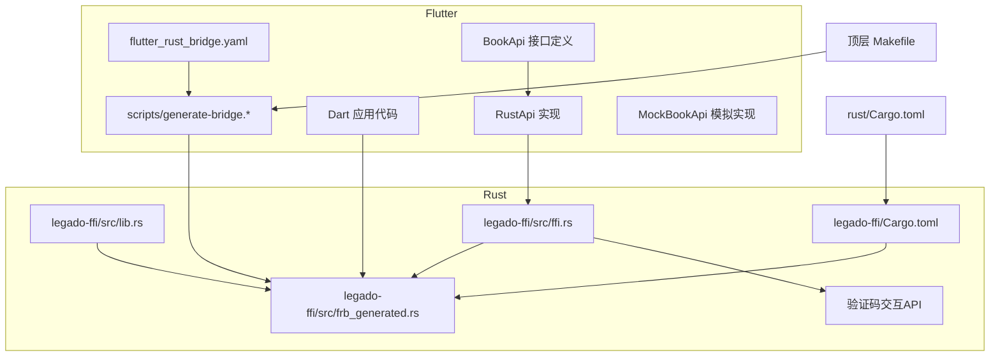
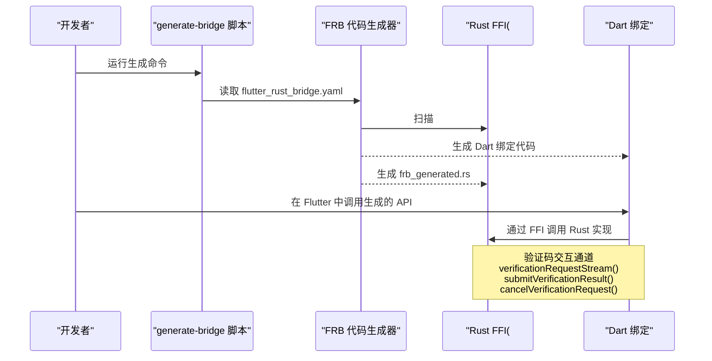
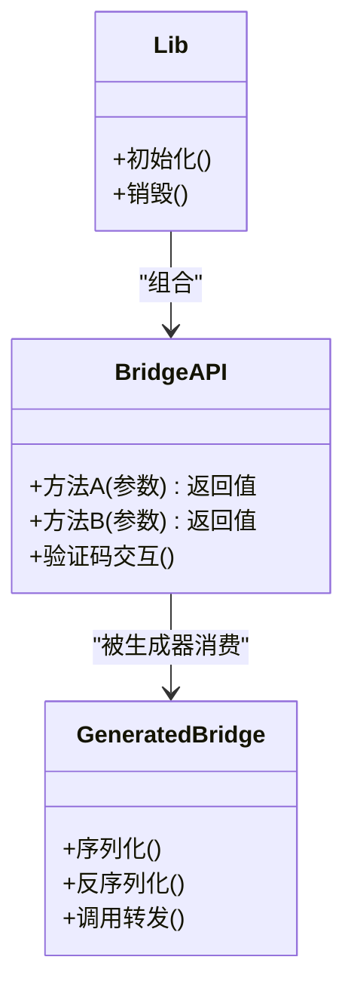
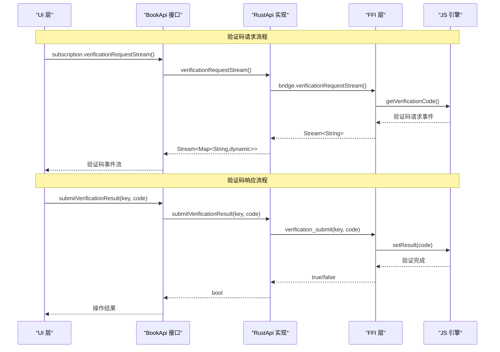
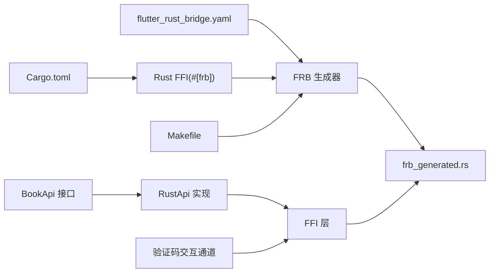

# Flutter Rust Bridge工具

<cite>
**本文引用的文件**   
- [flutter_rust_bridge.yaml](file://flutter_legado/flutter_rust_bridge.yaml)
- [generate-bridge.sh](file://flutter_legado/scripts/generate-bridge.sh)
- [generate-bridge.ps1](file://flutter_legado/scripts/generate-bridge.ps1)
- [lib.rs](file://rust/legado-ffi/src/lib.rs)
- [bridge.rs](file://rust/legado-ffi/src/bridge.rs)
- [frb_generated.rs](file://rust/legado-ffi/src/frb_generated.rs)
- [error.rs](file://rust/legado-ffi/src/error.rs)
- [runtime.rs](file://rust/legado-ffi/src/runtime.rs)
- [api/mod.rs](file://rust/legado-ffi/src/api/mod.rs)
- [Cargo.toml](file://rust/Cargo.toml)
- [Makefile](file://Makefile)
- [book_api.dart](file://flutter_legado/lib/src/services/book_api.dart)
- [rust_api.dart](file://flutter_legado/lib/src/services/rust_api.dart)
- [mock_book_api.dart](file://flutter_legado/lib/src/services/mock_book_api.dart)
- [ffi.dart](file://flutter_legado/lib/src/bridge/ffi.dart)
- [ffi.rs](file://rust/legado-ffi/src/ffi.rs)
</cite>

## 更新摘要
**所做更改**   
- 新增验证码交互通道章节，详细说明verificationRequestStream()、submitVerificationResult()和cancelVerificationRequest()方法
- 更新FFI层实现说明，包含新的验证码相关API
- 扩展Dart侧绑定代码示例，展示验证码流的使用方法
- 添加验证码交互流程图和最佳实践指南

## 目录
1. [简介](#简介)
2. [项目结构](#项目结构)
3. [核心组件](#核心组件)
4. [架构总览](#架构总览)
5. [详细组件分析](#详细组件分析)
6. [验证码交互通道](#验证码交互通道)
7. [依赖关系分析](#依赖关系分析)
8. [性能考虑](#性能考虑)
9. [故障排查指南](#故障排查指南)
10. [结论](#结论)
11. [附录](#附录)

## 简介
本文件面向使用 Flutter + Rust 的开发者，系统化说明本项目中 Flutter Rust Bridge（FRB）的配置、代码生成与使用方式。内容涵盖：
- FRB 配置文件结构与选项（类型映射、代码生成配置等）
- generate-bridge 脚本的使用方法与参数
- Rust 侧 #[frb] 属性注解的使用与参数
- Dart 侧生成的绑定代码结构与调用方式
- 完整配置示例与最佳实践（错误处理、异步调用、内存管理等）
- **新增**：验证码交互通道的完整实现与使用指南

## 项目结构
本项目在 Flutter 工程根目录下维护 FRB 配置文件与生成脚本，Rust 侧通过 FFI 模块暴露接口并生成 frb_generated.rs 供 Dart 调用。关键位置如下：
- Flutter 侧配置与脚本：flutter_legado/flutter_rust_bridge.yaml、flutter_legado/scripts/*
- Rust 侧桥接入口与生成产物：rust/legado-ffi/src/lib.rs、bridge.rs、frb_generated.rs
- Cargo 构建与顶层 Makefile：rust/Cargo.toml、Makefile



**图表来源** 
- [flutter_rust_bridge.yaml](file://flutter_legado/flutter_rust_bridge.yaml)
- [generate-bridge.sh](file://flutter_legado/scripts/generate-bridge.sh)
- [generate-bridge.ps1](file://flutter_legado/scripts/generate-bridge.ps1)
- [lib.rs](file://rust/legado-ffi/src/lib.rs)
- [bridge.rs](file://rust/legado-ffi/src/bridge.rs)
- [frb_generated.rs](file://rust/legado-ffi/src/frb_generated.rs)
- [Cargo.toml](file://rust/Cargo.toml)
- [Makefile](file://Makefile)
- [book_api.dart](file://flutter_legado/lib/src/services/book_api.dart)
- [rust_api.dart](file://flutter_legado/lib/src/services/rust_api.dart)
- [mock_book_api.dart](file://flutter_legado/lib/src/services/mock_book_api.dart)
- [ffi.rs](file://rust/legado-ffi/src/ffi.rs)

**章节来源**
- [flutter_rust_bridge.yaml](file://flutter_legado/flutter_rust_bridge.yaml)
- [generate-bridge.sh](file://flutter_legado/scripts/generate-bridge.sh)
- [generate-bridge.ps1](file://flutter_legado/scripts/generate-bridge.ps1)
- [lib.rs](file://rust/legado-ffi/src/lib.rs)
- [bridge.rs](file://rust/legado-ffi/src/bridge.rs)
- [frb_generated.rs](file://rust/legado-ffi/src/frb_generated.rs)
- [Cargo.toml](file://rust/Cargo.toml)
- [Makefile](file://Makefile)

## 核心组件
- FRB 配置文件：定义类型映射、输出路径、插件与特性开关，驱动代码生成器。
- 生成脚本：封装跨平台命令执行，统一触发 FRB 生成流程。
- Rust FFI 层：通过 #[frb] 注解暴露函数/结构体给 Dart；生成 frb_generated.rs 作为双向桥接。
- Dart 绑定：由 FRB 自动生成，提供类型安全、异步友好的 API 供 Flutter 调用。
- **新增**：验证码交互通道：提供JS引擎与UI之间的验证码请求-响应机制。

**章节来源**
- [flutter_rust_bridge.yaml](file://flutter_legado/flutter_rust_bridge.yaml)
- [generate-bridge.sh](file://flutter_legado/scripts/generate-bridge.sh)
- [generate-bridge.ps1](file://flutter_legado/scripts/generate-bridge.ps1)
- [lib.rs](file://rust/legado-ffi/src/lib.rs)
- [bridge.rs](file://rust/legado-ffi/src/bridge.rs)
- [frb_generated.rs](file://rust/legado-ffi/src/frb_generated.rs)

## 架构总览
下图展示从 Flutter 到 Rust 的调用链路及代码生成过程：



**图表来源** 
- [flutter_rust_bridge.yaml](file://flutter_legado/flutter_rust_bridge.yaml)
- [generate-bridge.sh](file://flutter_legado/scripts/generate-bridge.sh)
- [generate-bridge.ps1](file://flutter_legado/scripts/generate-bridge.ps1)
- [lib.rs](file://rust/legado-ffi/src/lib.rs)
- [bridge.rs](file://rust/legado-ffi/src/bridge.rs)
- [frb_generated.rs](file://rust/legado-ffi/src/frb_generated.rs)

## 详细组件分析

### FRB 配置文件（flutter_rust_bridge.yaml）
- 作用：声明类型映射、输出目录、插件与特性开关，控制代码生成行为。
- 常见选项类别：
  - 类型映射：将 Rust 类型映射为 Dart 类型，支持基础类型、集合、可选值、枚举等。
  - 代码生成：指定 Dart 与 Rust 侧生成路径、命名空间、是否包含调试信息。
  - 插件与特性：启用/禁用特定功能（如异步、错误传播、序列化策略）。
- 建议：
  - 保持类型映射与业务模型一致，避免运行时转换开销。
  - 对大型对象采用流式或分块传输，减少内存峰值。

**章节来源**
- [flutter_rust_bridge.yaml](file://flutter_legado/flutter_rust_bridge.yaml)

### 生成脚本（generate-bridge.sh / generate-bridge.ps1）
- 作用：封装跨平台命令，统一调用 FRB 生成器，处理环境变量与路径。
- 典型流程：
  - 解析参数（目标平台、输出目录、是否清理旧产物）。
  - 调用 FRB CLI 读取配置文件并生成代码。
  - 返回状态码，便于 CI/CD 集成。
- 最佳实践：
  - 在开发时增量生成，在发布前全量清理再生成。
  - 将脚本纳入版本管理，确保团队一致性。

**章节来源**
- [generate-bridge.sh](file://flutter_legado/scripts/generate-bridge.sh)
- [generate-bridge.ps1](file://flutter_legado/scripts/generate-bridge.ps1)

### Rust 侧 FFI 与 #[frb] 注解
- lib.rs：定义 FFI 入口与模块组织，导出需暴露给 Dart 的公共接口。
- ffi.rs：集中定义业务 API 与数据模型，配合 #[frb] 注解暴露给 Dart。
- frb_generated.rs：由 FRB 自动生成的双向桥接代码，负责序列化和调用转发。
- #[frb] 注解要点：
  - 标注函数、结构体、枚举，使其参与代码生成。
  - 可配置参数包括：名称重映射、异步模式、错误传播、内存所有权策略等。
  - 推荐将耗时操作标记为异步，避免阻塞 UI 线程。



**图表来源** 
- [lib.rs](file://rust/legado-ffi/src/lib.rs)
- [bridge.rs](file://rust/legado-ffi/src/bridge.rs)
- [frb_generated.rs](file://rust/legado-ffi/src/frb_generated.rs)

**章节来源**
- [lib.rs](file://rust/legado-ffi/src/lib.rs)
- [bridge.rs](file://rust/legado-ffi/src/bridge.rs)
- [frb_generated.rs](file://rust/legado-ffi/src/frb_generated.rs)

### Dart 侧绑定代码
- 生成位置：由 FRB 根据配置输出至 Flutter 工程指定目录。
- 结构特点：
  - 按模块划分命名空间，对应 Rust 模块。
  - 提供同步与异步两种调用风格（取决于 Rust 端注解）。
  - 自动处理类型转换与错误包装。
- 使用方式：
  - 在 Dart 中直接 import 生成的模块。
  - 调用方法与普通 Dart API 无异，内部通过 FFI 与 Rust 交互。

**章节来源**
- [flutter_rust_bridge.yaml](file://flutter_legado/flutter_rust_bridge.yaml)
- [frb_generated.rs](file://rust/legado-ffi/src/frb_generated.rs)

### 错误处理与异常传播
- Rust 侧：建议使用 Result 类型返回错误，并通过 #[frb] 配置将错误映射为 Dart 异常。
- Dart 侧：捕获异常并进行用户提示或重试逻辑。
- 最佳实践：
  - 区分可恢复与不可恢复错误，提供不同处理分支。
  - 记录上下文信息以便定位问题。

**章节来源**
- [error.rs](file://rust/legado-ffi/src/error.rs)

### 运行时与生命周期管理
- runtime.rs：管理 FFI 生命周期、资源初始化与释放。
- 关键点：
  - 确保在应用启动时初始化，退出时释放资源。
  - 避免跨线程共享未受保护的状态。

**章节来源**
- [runtime.rs](file://rust/legado-ffi/src/runtime.rs)

### API 模块组织
- api/mod.rs：聚合各业务域 API，便于按需启用与模块化。
- 建议：
  - 按功能域拆分模块，降低耦合。
  - 对外只暴露必要接口，隐藏内部实现细节。

**章节来源**
- [api/mod.rs](file://rust/legado-ffi/src/api/mod.rs)

## 验证码交互通道

### 概述
验证码交互通道是 Flutter Rust Bridge 工具的新增功能，用于处理书源 JS 引擎中的验证码请求。该通道实现了完整的请求-响应机制，支持事件流推送、结果提交和请求取消等操作。

### 核心方法

#### verificationRequestStream()
订阅验证码请求事件流，长期存活。当书源 JS 经 `getVerificationCode` 钩子挂起等待时，每个请求会推送一条事件 Map。

**方法签名**：
```dart
Stream<Map<String, dynamic>> verificationRequestStream();
```

**事件字段**：
- `key`：resultKey，用于标识特定的验证码请求
- `source_url`：书源 URL
- `source_name`：书源名称  
- `image_url`：验证码图片地址
- `title`：验证码标题
- `use_browser`：桌面端恒 false（浏览器模式已降级）
- `created_at_ms`：请求创建时间戳

**实现位置**：
- 接口定义：[book_api.dart:124-132](file://flutter_legado/lib/src/services/book_api.dart#L124-L132)
- Rust 实现：[rust_api.dart:311-315](file://flutter_legado/lib/src/services/rust_api.dart#L311-L315)
- FFI 层：[ffi.rs:255-263](file://rust/legado-ffi/src/ffi.rs#L255-L263)

#### submitVerificationResult()
提交验证码结果，唤醒 JS 等待方。对齐 Kotlin `setResult` 语义。

**方法签名**：
```dart
Future<bool> submitVerificationResult(String key, String code);
```

**参数说明**：
- `key`：请求事件中的 resultKey
- `code`：用户输入的验证码

**返回值**：是否命中进行中的请求

**实现位置**：
- 接口定义：[book_api.dart:134-138](file://flutter_legado/lib/src/services/book_api.dart#L134-L138)
- Rust 实现：[rust_api.dart:319-320](file://flutter_legado/lib/src/services/rust_api.dart#L319-L320)
- FFI 层：[ffi.rs:269-271](file://rust/legado-ffi/src/ffi.rs#L269-L271)

#### cancelVerificationRequest()
取消验证码请求，对齐 Kotlin `checkResult` 语义。以空结果唤醒等待方。

**方法签名**：
```dart
Future<bool> cancelVerificationRequest(String key);
```

**参数说明**：
- `key`：resultKey

**返回值**：是否命中请求

**实现位置**：
- 接口定义：[book_api.dart:140-143](file://flutter_legado/lib/src/services/book_api.dart#L140-L143)
- Rust 实现：[rust_api.dart:324-325](file://flutter_legado/lib/src/services/rust_api.dart#L324-L325)
- FFI 层：[ffi.rs:276-278](file://rust/legado-ffi/src/ffi.rs#L276-L278)

### 验证码交互流程



**图表来源** 
- [book_api.dart](file://flutter_legado/lib/src/services/book_api.dart)
- [rust_api.dart](file://flutter_legado/lib/src/services/rust_api.dart)
- [ffi.rs](file://rust/legado-ffi/src/ffi.rs)

### Mock 实现
MockBookApi 提供了验证码交互通道的模拟实现，用于无 DLL 环境下的开发测试：

**实现位置**：[mock_book_api.dart:497-511](file://flutter_legado/lib/src/services/mock_book_api.dart#L497-L511)

**特点**：
- 空流实现：不产生任何验证码请求
- 返回 false：所有提交和取消操作都返回未命中
- 适用于 UI 开发和功能演示

### 使用示例

#### 基本订阅和使用
```dart
// 订阅验证码请求流
final stream = bookApi.verificationRequestStream();
stream.listen((event) {
  // 显示验证码对话框
  showDialog(context: context, builder: (ctx) {
    return VerificationDialog(
      imageUrl: event['image_url'],
      onSubmit: (code) {
        // 提交验证码结果
        bookApi.submitVerificationResult(event['key'], code);
      },
      onCancel: () {
        // 取消验证码请求
        bookApi.cancelVerificationRequest(event['key']);
      },
    );
  });
});
```

#### 错误处理
```dart
try {
  final stream = bookApi.verificationRequestStream();
  await for (final event in stream) {
    // 处理验证码事件
    if (event.containsKey('error')) {
      // 处理错误情况
      print('验证码请求失败: ${event['error']}');
    } else {
      // 正常处理验证码请求
      showVerificationDialog(event);
    }
  }
} catch (e) {
  // 处理流订阅异常
  print('验证码流订阅失败: $e');
}
```

### 最佳实践

#### 资源管理
- 确保在适当时机取消流订阅，避免内存泄漏
- 使用 `StreamSubscription` 的 `cancel()` 方法释放资源

#### 用户体验
- 验证码对话框应支持超时自动关闭
- 提供清晰的错误提示信息
- 支持网络图片加载失败的降级处理

#### 安全性
- 对用户输入的验证码进行基本验证
- 防止重复提交相同的验证码
- 合理设置验证码有效期

**章节来源**
- [book_api.dart](file://flutter_legado/lib/src/services/book_api.dart)
- [rust_api.dart](file://flutter_legado/lib/src/services/rust_api.dart)
- [mock_book_api.dart](file://flutter_legado/lib/src/services/mock_book_api.dart)
- [ffi.rs](file://rust/legado-ffi/src/ffi.rs)

## 依赖关系分析
FRB 依赖 Rust 工具链与 Cargo 包管理，Flutter 侧通过脚本驱动生成。



**图表来源** 
- [flutter_rust_bridge.yaml](file://flutter_legado/flutter_rust_bridge.yaml)
- [Cargo.toml](file://rust/Cargo.toml)
- [Makefile](file://Makefile)
- [frb_generated.rs](file://rust/legado-ffi/src/frb_generated.rs)
- [lib.rs](file://rust/legado-ffi/src/lib.rs)
- [book_api.dart](file://flutter_legado/lib/src/services/book_api.dart)
- [rust_api.dart](file://flutter_legado/lib/src/services/rust_api.dart)
- [ffi.rs](file://rust/legado-ffi/src/ffi.rs)

**章节来源**
- [Cargo.toml](file://rust/Cargo.toml)
- [Makefile](file://Makefile)

## 性能考虑
- 类型映射优化：避免不必要的装箱/拆箱，优先使用原生类型。
- 异步调用：将 CPU 密集或 IO 操作标记为异步，提升响应性。
- 内存管理：大对象分块传输，及时释放不再使用的资源。
- 生成产物缓存：CI 中缓存生成结果，缩短构建时间。
- **验证码流优化**：合理使用流式传输，避免大量并发验证码请求导致内存压力。

## 故障排查指南
- 常见问题：
  - 生成失败：检查 flutter_rust_bridge.yaml 语法与路径是否正确。
  - 类型不匹配：确认 Rust 与 Dart 类型映射一致。
  - 运行时崩溃：检查 FFI 生命周期与资源释放。
  - 验证码流异常：检查流订阅是否正确管理，是否存在内存泄漏。
- 排查步骤：
  - 查看生成脚本输出日志。
  - 验证 frb_generated.rs 是否存在且最新。
  - 在 Rust 侧添加日志定位问题。
  - 检查验证码请求的生命周期管理。

**章节来源**
- [generate-bridge.sh](file://flutter_legado/scripts/generate-bridge.sh)
- [generate-bridge.ps1](file://flutter_legado/scripts/generate-bridge.ps1)
- [error.rs](file://rust/legado-ffi/src/error.rs)

## 结论
通过 FRB 配置文件与生成脚本，可实现 Flutter 与 Rust 之间高效、类型安全的互操作。新增的验证码交互通道进一步完善了 JS 引擎与 UI 层的通信机制，提升了应用的健壮性和用户体验。遵循本文的最佳实践，可显著提升开发效率与运行稳定性。

## 附录
- 常用命令：
  - 生成绑定：运行 generate-bridge 脚本。
  - 清理产物：删除生成目录后重新生成。
- 参考文件：
  - flutter_rust_bridge.yaml：配置中心。
  - frb_generated.rs：生成产物，用于调试与理解映射。
  - **新增**：验证码交互相关 API 文档和示例代码。