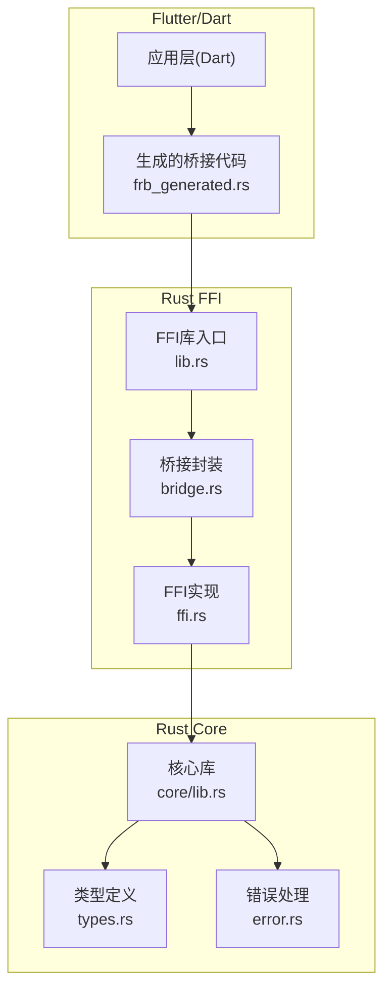
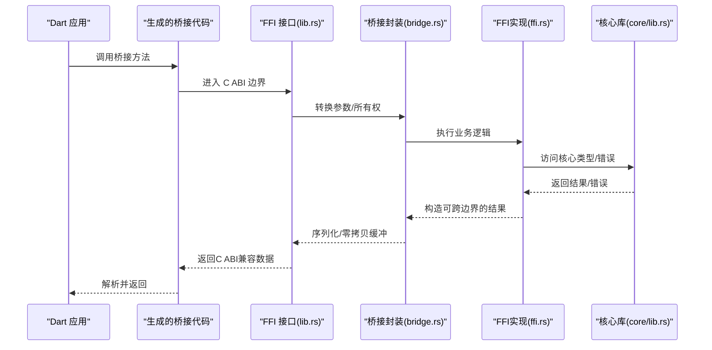
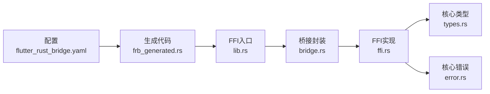

# 内存管理

<cite>
**本文引用的文件**   
- [rust/legado-ffi/src/lib.rs](file://rust/legado-ffi/src/lib.rs)
- [rust/legado-ffi/src/bridge.rs](file://rust/legado-ffi/src/bridge.rs)
- [rust/legado-ffi/src/ffi.rs](file://rust/legado-ffi/src/ffi.rs)
- [rust/legado-ffi/src/frb_generated.rs](file://rust/legado-ffi/src/frb_generated.rs)
- [rust/legado-core/src/lib.rs](file://rust/legado-core/src/lib.rs)
- [rust/legado-core/src/types.rs](file://rust/legado-core/src/types.rs)
- [rust/legado-core/src/error.rs](file://rust/legado-core/src/error.rs)
- [flutter_legado/flutter_rust_bridge.yaml](file://flutter_legado/flutter_rust_bridge.yaml)
</cite>

## 目录
1. [简介](#简介)
2. [项目结构](#项目结构)
3. [核心组件](#核心组件)
4. [架构总览](#架构总览)
5. [详细组件分析](#详细组件分析)
6. [依赖关系分析](#依赖关系分析)
7. [性能考量](#性能考量)
8. [故障排查指南](#故障排查指南)
9. [结论](#结论)
10. [附录](#附录)

## 简介
本技术文档聚焦于 Legado 项目中跨语言边界（Flutter/Dart 与 Rust）的 FFI 内存管理。内容涵盖：
- 数据所有权转移规则、借用检查与生命周期管理
- 大对象高效传递方法（零拷贝、缓冲区管理）
- 内存泄漏检测与预防（RAII 模式、资源清理）
- 垃圾回收器与 Rust 内存模型交互（引用计数、智能指针）
- 内存优化示例与性能分析工具使用建议

## 项目结构
本项目采用多模块 Rust 工程，FFI 层位于 legado-ffi，核心业务逻辑在 legado-core，Dart/Flutter 侧通过 flutter_rust_bridge 生成桥接代码。关键路径如下：
- Rust FFI 入口与导出：legado-ffi/src/lib.rs、bridge.rs、ffi.rs
- Flutter-Rust Bridge 配置与生成：flutter_rust_bridge.yaml、frb_generated.rs
- 核心类型与错误定义：legado-core/src/types.rs、error.rs

**图表来源** 
- [rust/legado-ffi/src/lib.rs](file://rust/legado-ffi/src/lib.rs)
- [rust/legado-ffi/src/bridge.rs](file://rust/legado-ffi/src/bridge.rs)
- [rust/legado-ffi/src/ffi.rs](file://rust/legado-ffi/src/ffi.rs)
- [rust/legado-core/src/lib.rs](file://rust/legado-core/src/lib.rs)
- [rust/legado-core/src/types.rs](file://rust/legado-core/src/types.rs)
- [rust/legado-core/src/error.rs](file://rust/legado-core/src/error.rs)
- [flutter_legado/flutter_rust_bridge.yaml](file://flutter_legado/flutter_rust_bridge.yaml)

**章节来源**
- [rust/legado-ffi/src/lib.rs](file://rust/legado-ffi/src/lib.rs)
- [rust/legado-ffi/src/bridge.rs](file://rust/legado-ffi/src/bridge.rs)
- [rust/legado-ffi/src/ffi.rs](file://rust/legado-ffi/src/ffi.rs)
- [rust/legado-core/src/lib.rs](file://rust/legado-core/src/lib.rs)
- [rust/legado-core/src/types.rs](file://rust/legado-core/src/types.rs)
- [rust/legado-core/src/error.rs](file://rust/legado-core/src/error.rs)
- [flutter_legado/flutter_rust_bridge.yaml](file://flutter_legado/flutter_rust_bridge.yaml)

## 核心组件
- FFI 库入口与导出：负责暴露给 Dart 的函数签名、参数/返回值类型映射以及生命周期约束。
- 桥接封装：将 Rust 内部类型转换为 FFI 安全类型，管理跨边界的数据所有权与生命周期。
- FFI 实现：具体业务调用与底层核心库交互，确保内存安全与错误传播。
- 核心类型与错误：统一的值类型、集合类型与错误类型，便于跨语言一致表达。
- Flutter-Rust Bridge 配置：声明需要桥接的类型与函数，自动生成 frb_generated.rs。

**章节来源**
- [rust/legado-ffi/src/lib.rs](file://rust/legado-ffi/src/lib.rs)
- [rust/legado-ffi/src/bridge.rs](file://rust/legado-ffi/src/bridge.rs)
- [rust/legado-ffi/src/ffi.rs](file://rust/legado-ffi/src/ffi.rs)
- [rust/legado-core/src/types.rs](file://rust/legado-core/src/types.rs)
- [rust/legado-core/src/error.rs](file://rust/legado-core/src/error.rs)
- [flutter_legado/flutter_rust_bridge.yaml](file://flutter_legado/flutter_rust_bridge.yaml)

## 架构总览
下图展示从 Dart 到 Rust 的核心调用链与内存边界：

**图表来源** 
- [rust/legado-ffi/src/lib.rs](file://rust/legado-ffi/src/lib.rs)
- [rust/legado-ffi/src/bridge.rs](file://rust/legado-ffi/src/bridge.rs)
- [rust/legado-ffi/src/ffi.rs](file://rust/legado-ffi/src/ffi.rs)
- [rust/legado-core/src/lib.rs](file://rust/legado-core/src/lib.rs)

## 详细组件分析

### FFI 库入口与导出（lib.rs）
- 职责：定义对外暴露的函数签名，明确输入输出类型与生命周期；必要时标注 unsafe 边界。
- 关键点：
  - 参数与返回值需为 C ABI 兼容类型或受控的智能指针包装。
  - 对可变借用与生命周期进行严格约束，避免悬垂指针。
  - 统一错误返回策略（如 Result 转错误码或错误对象）。

**章节来源**
- [rust/legado-ffi/src/lib.rs](file://rust/legado-ffi/src/lib.rs)

### 桥接封装（bridge.rs）
- 职责：在 FFI 与核心库之间做类型转换、所有权转移与生命周期管理。
- 关键点：
  - 使用智能指针（如 Box、Arc、Rc）控制所有权与共享。
  - 对大对象采用零拷贝视图（如切片、字符串视图）减少复制。
  - 显式释放外部分配内存（如 C 分配的缓冲区），遵循 RAII 原则。

**章节来源**
- [rust/legado-ffi/src/bridge.rs](file://rust/legado-ffi/src/bridge.rs)

### FFI 实现（ffi.rs）
- 职责：实现具体的跨语言调用逻辑，协调核心库与上层。
- 关键点：
  - 将 Dart 传入的字节/字符串转为 Rust 类型，必要时进行编码校验。
  - 对返回的大块数据采用缓冲区复用或流式处理，降低峰值内存。
  - 错误信息统一格式化并安全地传回 Dart。

**章节来源**
- [rust/legado-ffi/src/ffi.rs](file://rust/legado-ffi/src/ffi.rs)

### 核心类型与错误（types.rs、error.rs）
- 职责：定义跨语言一致的数值、文本、集合与错误类型。
- 关键点：
  - 文本类型优先使用 UTF-8 视图，避免不必要的拷贝。
  - 错误类型包含上下文信息，便于定位问题。
  - 集合类型提供迭代与批量操作接口，支持分片处理以降低内存压力。

**章节来源**
- [rust/legado-core/src/types.rs](file://rust/legado-core/src/types.rs)
- [rust/legado-core/src/error.rs](file://rust/legado-core/src/error.rs)

### Flutter-Rust Bridge 配置（flutter_rust_bridge.yaml）
- 职责：声明需要桥接的类型与函数，驱动代码生成。
- 关键点：
  - 指定哪些 Rust 类型需要被 Dart 可见，以及是否需要自定义序列化。
  - 控制生成代码的命名空间与模块划分。
  - 通过配置启用零拷贝或缓冲池等高级特性（若框架支持）。

**章节来源**
- [flutter_legado/flutter_rust_bridge.yaml](file://flutter_legado/flutter_rust_bridge.yaml)

### 生成代码（frb_generated.rs）
- 职责：由配置自动生成的桥接代码，负责 Dart 与 Rust 之间的调用与数据转换。
- 关键点：
  - 将 Dart 类型映射为 Rust 类型，处理生命周期与所有权。
  - 对大对象采用直接内存视图或分块传输，避免堆分配开销。
  - 异常与错误通过约定格式传递，保证两端一致性。

**章节来源**
- [rust/legado-ffi/src/frb_generated.rs](file://rust/legado-ffi/src/frb_generated.rs)

## 依赖关系分析
- FFI 层依赖核心库的类型与错误定义，确保跨语言一致性。
- 桥接封装依赖 FFI 实现与核心库，承担所有权与生命周期管理。
- 生成代码依赖配置与 FFI 接口，自动化桥接流程。

**图表来源** 
- [flutter_legado/flutter_rust_bridge.yaml](file://flutter_legado/flutter_rust_bridge.yaml)
- [rust/legado-ffi/src/frb_generated.rs](file://rust/legado-ffi/src/frb_generated.rs)
- [rust/legado-ffi/src/lib.rs](file://rust/legado-ffi/src/lib.rs)
- [rust/legado-ffi/src/bridge.rs](file://rust/legado-ffi/src/bridge.rs)
- [rust/legado-ffi/src/ffi.rs](file://rust/legado-ffi/src/ffi.rs)
- [rust/legado-core/src/types.rs](file://rust/legado-core/src/types.rs)
- [rust/legado-core/src/error.rs](file://rust/legado-core/src/error.rs)

**章节来源**
- [flutter_legado/flutter_rust_bridge.yaml](file://flutter_legado/flutter_rust_bridge.yaml)
- [rust/legado-ffi/src/frb_generated.rs](file://rust/legado-ffi/src/frb_generated.rs)
- [rust/legado-ffi/src/lib.rs](file://rust/legado-ffi/src/lib.rs)
- [rust/legado-ffi/src/bridge.rs](file://rust/legado-ffi/src/bridge.rs)
- [rust/legado-ffi/src/ffi.rs](file://rust/legado-ffi/src/ffi.rs)
- [rust/legado-core/src/types.rs](file://rust/legado-core/src/types.rs)
- [rust/legado-core/src/error.rs](file://rust/legado-core/src/error.rs)

## 性能考量
- 零拷贝策略：
  - 使用切片与字符串视图在跨边界时避免数据复制。
  - 对大块二进制数据采用直接内存视图或流式读取。
- 缓冲区管理：
  - 复用固定大小缓冲区，减少频繁分配与释放。
  - 合理设置批处理大小，平衡吞吐与内存占用。
- 并发与锁：
  - 使用线程安全的智能指针（Arc）共享只读数据。
  - 对可变状态加锁或使用消息队列隔离。
- 内存监控：
  - 结合系统工具（如 Android Profiler、Valgrind）观察峰值与泄漏。
  - 在关键路径插入统计点，记录分配次数与大小。

[本节为通用指导，不直接分析具体文件]

## 故障排查指南
- 常见内存问题：
  - 悬垂指针：确保所有引用在生命周期内有效，避免返回局部变量引用。
  - 双重释放：遵循 RAII，避免手动释放已交由智能指针管理的内存。
  - 缓冲区溢出：严格校验输入长度，使用安全 API 进行读写。
- 调试技巧：
  - 启用 Rust 的调试断言与日志，定位异常路径。
  - 使用内存分析工具捕获分配栈，识别热点与泄漏点。
  - 在 FFI 边界打印关键参数与返回值，验证数据一致性。

**章节来源**
- [rust/legado-core/src/error.rs](file://rust/legado-core/src/error.rs)

## 结论
Legado 项目的 FFI 内存管理通过严格的类型系统、智能指针与零拷贝策略，实现了高效且安全的跨语言数据交换。借助 flutter_rust_bridge 的代码生成与配置化桥接，开发者可在保持性能的同时，降低内存管理与生命周期控制的复杂度。建议在生产环境中持续监控内存行为，并结合性能分析工具优化关键路径。

[本节为总结性内容，不直接分析具体文件]

## 附录
- 最佳实践清单：
  - 始终使用智能指针管理所有权，避免裸指针。
  - 对大对象采用视图或流式处理，减少复制。
  - 统一错误类型与传播机制，便于追踪问题。
  - 定期运行内存分析，发现潜在泄漏与热点。
- 推荐工具：
  - Android Profiler：观察 Java/Kotlin 与原生内存。
  - Valgrind/Memcheck：检测 C/C++ 内存问题。
  - Rust 内置工具：cargo-miri、cargo-flamegraph 用于模拟与火焰图分析。

[本节为补充信息，不直接分析具体文件]