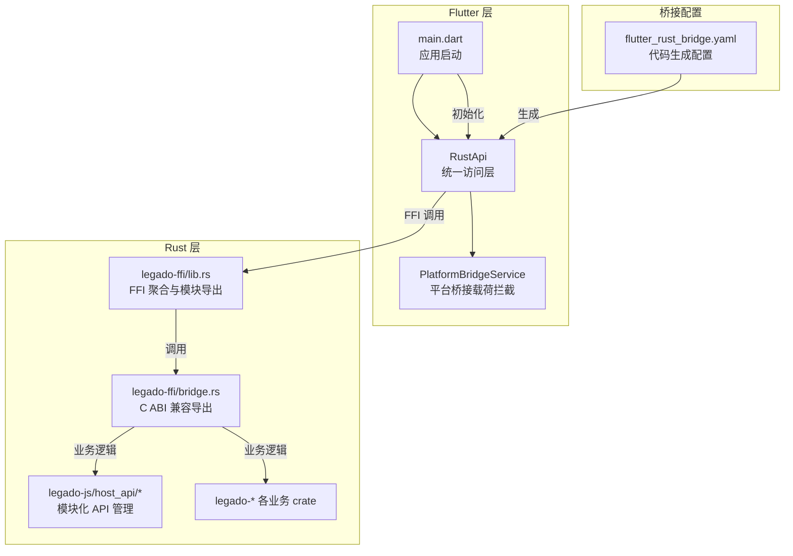
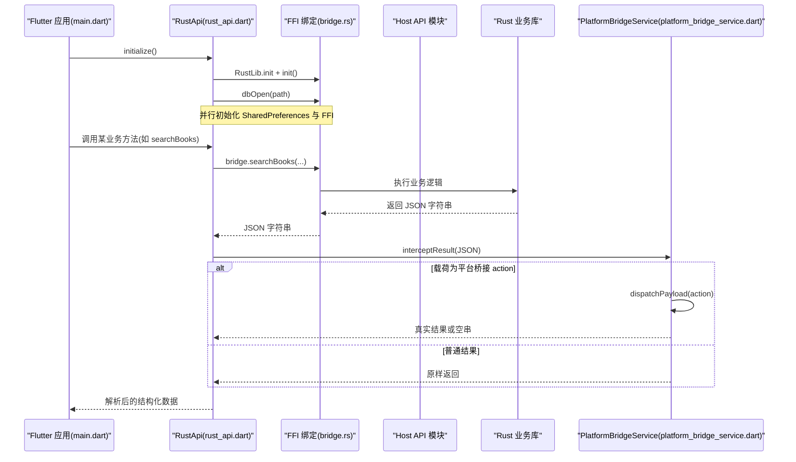
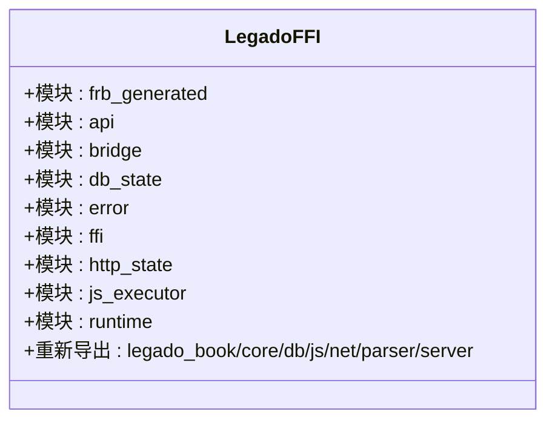
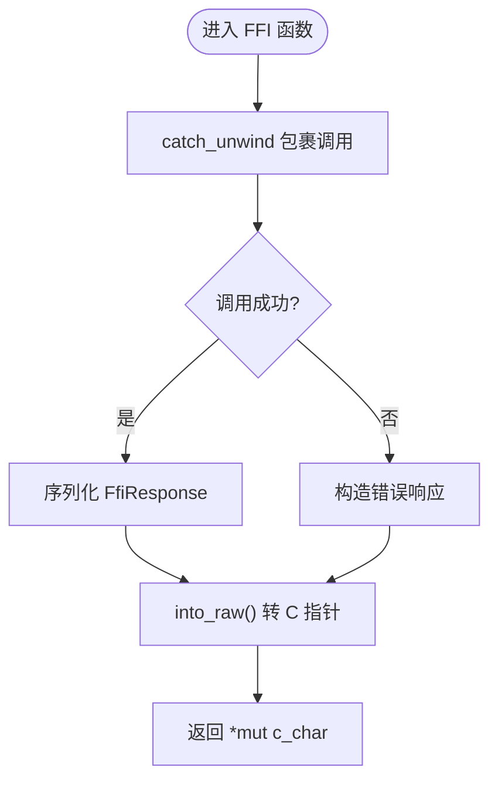
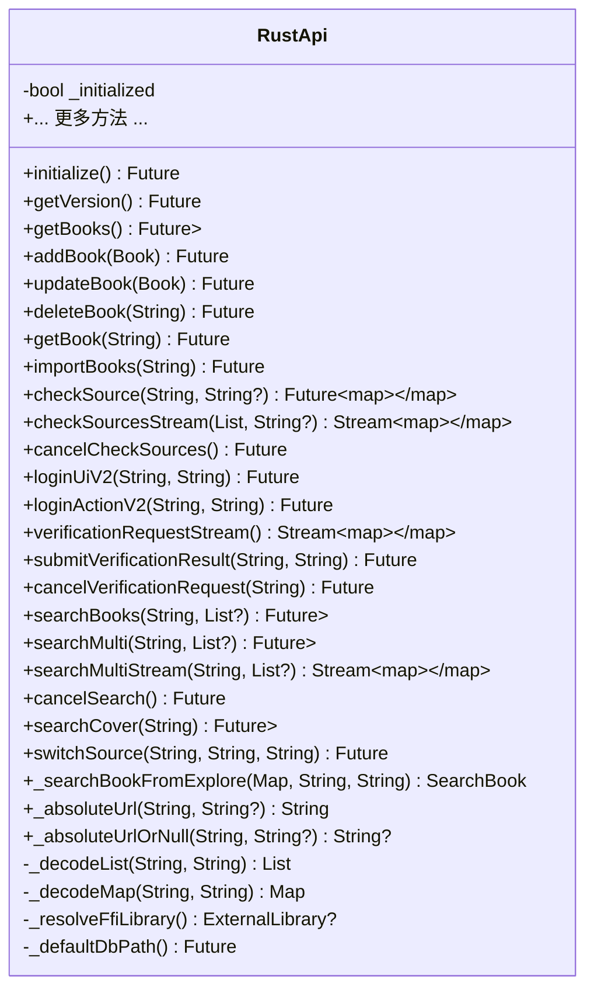
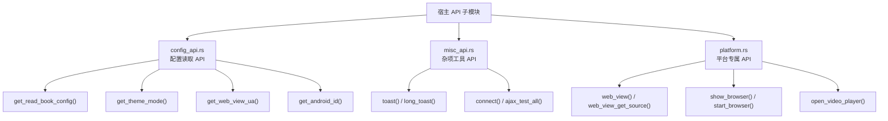
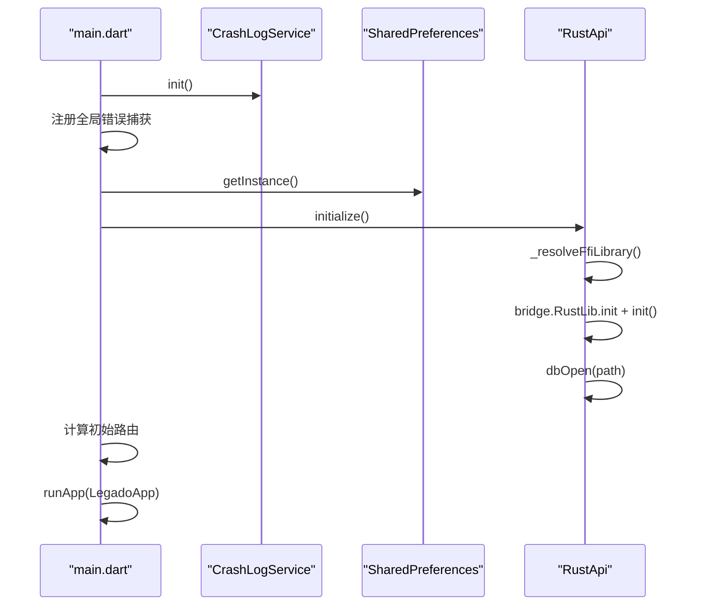
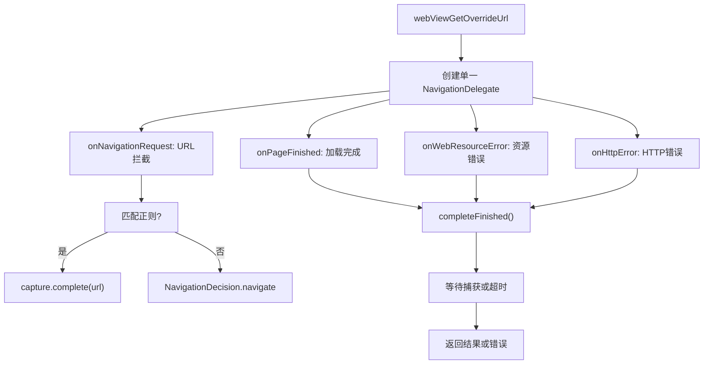
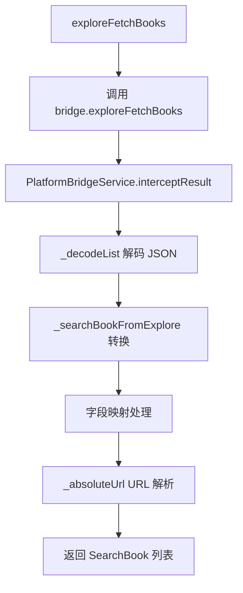
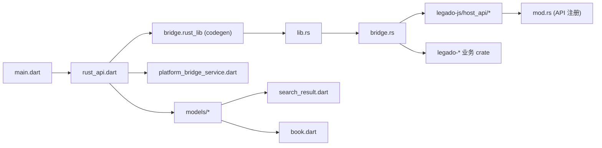

# 平台桥接服务

<cite>
**本文引用的文件**
- [README.md](file://README.md)
- [flutter_rust_bridge.yaml](file://flutter_legado/flutter_rust_bridge.yaml)
- [lib.rs](file://rust/legado-ffi/src/lib.rs)
- [bridge.rs](file://rust/legado-ffi/src/bridge.rs)
- [main.dart](file://flutter_legado/lib/main.dart)
- [rust_api.dart](file://flutter_legado/lib/src/services/rust_api.dart)
- [platform_bridge_service.dart](file://flutter_legado/lib/src/services/platform_bridge_service.dart)
- [browser_screen.dart](file://flutter_legado/lib/src/screens/browser_screen.dart)
- [rss_article_detail_screen.dart](file://flutter_legado/lib/src/screens/rss_article_detail_screen.dart)
- [config_api.rs](file://rust\legado-js\src\host_api\config_api.rs)
- [misc_api.rs](file://rust\legado-js\src\host_api\misc_api.rs)
- [platform.rs](file://rust\legado-js\src\host_api\platform.rs)
- [mod.rs](file://rust\legado-js\src\host_api\mod.rs)
- [models.dart](file://flutter_legado/lib/src/models/models.dart)
- [search_result.dart](file://flutter_legado/lib/src/models/search_result.dart)
- [book.dart](file://flutter_legado/lib/src/models/book.dart)
</cite>

## 更新摘要
**变更内容**   
- 更新了 rust_api.dart 中的发现页搜索结果处理，新增 _searchBookFromExplore 方法用于 WebSearchResult 到 SearchBook 的字段映射
- 添加了 URL 解析工具方法 _absoluteUrl 和 _absoluteUrlOrNull，用于处理相对路径 URL 转换为绝对路径
- 改进了 Rust snake_case 与 Flutter camelCase 之间的字段映射兼容性处理
- 增强了发现分类书籍列表抓取时的数据归一化逻辑

## 目录
1. [简介](#简介)
2. [项目结构](#项目结构)
3. [核心组件](#核心组件)
4. [架构总览](#架构总览)
5. [详细组件分析](#详细组件分析)
6. [依赖关系分析](#依赖关系分析)
7. [性能考量](#性能考量)
8. [故障排查指南](#故障排查指南)
9. [结论](#结论)
10. [附录](#附录)

## 简介
本文件聚焦于 Legado 项目的"平台桥接服务"，即 Flutter（Dart）与 Rust 核心引擎之间的跨语言桥接体系。该体系通过 flutter_rust_bridge 生成 Dart 绑定，配合 C ABI 兼容层与统一的 FFI 响应封装，实现数据库、书源、搜索、阅读、RSS、验证码交互、JS 执行等能力的稳定调用；同时提供"平台桥接载荷拦截"机制，将 Rust 侧 JS 运行时对 WebView/浏览器/视频播放器等平台能力请求统一在 Flutter 层落地执行，保证无头或桌面环境下的降级策略与行为一致性。

**更新** 本次更新反映了 rust_api.dart 中新增的发现页搜索结果处理方法，以及 URL 解析工具的增强功能，解决了 Rust 返回的 WebSearchResult 与 Flutter 期望的 SearchBook 之间的字段映射问题。

## 项目结构
- Rust 侧：
  - legado-ffi：FFI 出口与聚合层，暴露统一 API，包含 flutter_rust_bridge 生成的绑定入口与旧式 C ABI 兼容导出。
  - legado-js：JavaScript 宿主 API 模块，按功能分类组织（config_api、misc_api、platform 等）。
  - 其他 crate（core/parser/net/js/book/db/server）：被 FFI 层聚合复用。
- Flutter 侧：
  - flutter_rust_bridge 配置：指定输入 crate、输出目录与入口类名。
  - RustApi：Dart 侧统一访问层，封装所有 FFI 调用、JSON 解码与错误处理。
  - PlatformBridgeService：平台桥接载荷拦截与分发服务，负责 WebView/浏览器/视频播放等动作的执行与降级。
  - main.dart：应用启动流程，并行初始化 SharedPreferences 与 Rust FFI，并处理 FFI 初始化失败的回退 UI。



**图表来源**
- [flutter_rust_bridge.yaml:1-10](file://flutter_legado/flutter_rust_bridge.yaml#L1-L10)
- [lib.rs:1-32](file://rust/legado-ffi/src/lib.rs#L1-L32)
- [bridge.rs:1-120](file://rust/legado-ffi/src/bridge.rs#L1-L120)
- [main.dart:17-86](file://flutter_legado/lib/main.dart#L17-L86)
- [rust_api.dart:1-120](file://flutter_legado/lib/src/services/rust_api.dart#L1-L120)
- [mod.rs:1-52](file://rust\legado-js\src\host_api\mod.rs#L1-L52)

章节来源
- [README.md:10-26](file://README.md#L10-L26)
- [flutter_rust_bridge.yaml:1-10](file://flutter_legado/flutter_rust_bridge.yaml#L1-L10)
- [lib.rs:1-32](file://rust/legado-ffi/src/lib.rs#L1-L32)
- [bridge.rs:1-120](file://rust/legado-ffi/src/bridge.rs#L1-L120)
- [main.dart:17-86](file://flutter_legado/lib/main.dart#L17-L86)
- [rust_api.dart:1-120](file://flutter_legado/lib/src/services/rust_api.dart#L1-L120)
- [mod.rs:1-52](file://rust\legado-js\src\host_api\mod.rs#L1-L52)

## 核心组件
- Rust FFI 聚合层（lib.rs）
  - 职责：聚合各业务 crate，暴露统一模块入口，供 flutter_rust_bridge 生成 Dart 绑定。
  - 关键点：frb_generated 自动注入、模块重新导出、允许宏/unsafe 警告抑制。
- C ABI 兼容层（bridge.rs）
  - 职责：以 C ABI 导出函数，统一 JSON 序列化响应，catch_unwind 防止 panic 越界。
  - 关键点：FfiResponse 统一封装、c_char_to_str/c_char_to_cstr 安全转换、各业务 FFI 函数均包裹 to_ffi_response。
- Flutter 统一访问层（rust_api.dart）
  - 职责：封装所有 bridge.* 调用，统一 JSON 解码与类型校验，提供 BookApi 契约方法。
  - 关键点：initialize 并行初始化、_decodeList/_decodeMap 强类型守卫、流式接口（Stream）支持。
- 平台桥接载荷拦截（platform_bridge_service.dart）
  - 职责：识别并执行 Rust 侧返回的"平台桥接载荷"，包括 webView/webViewGetSource/webViewGetOverrideUrl/openBrowser/startBrowser/openUrl/openVideoPlayer。
  - 关键点：isPlatformBridgePayload/parsePayload/interceptResult/dispatchPayload，WebView 超时与降级策略。
- JavaScript 宿主 API 模块化管理
  - 职责：按功能分类组织平台相关 API，包括配置读取（config_api）、杂项工具（misc_api）、平台专属功能（platform）。
  - 关键点：模块化设计便于维护，批次3治理已移除无用存根函数。

**更新** 新增了 rust_api.dart 中发现页搜索结果处理和 URL 解析功能的说明。

章节来源
- [lib.rs:1-32](file://rust/legado-ffi/src/lib.rs#L1-L32)
- [bridge.rs:1-120](file://rust/legado-ffi/src/bridge.rs#L1-L120)
- [rust_api.dart:1-120](file://flutter_legado/lib/src/services/rust_api.dart#L1-L120)
- [platform_bridge_service.dart:1-120](file://flutter_legado/lib/src/services/platform_bridge_service.dart#L1-L120)
- [mod.rs:1-52](file://rust\legado-js\src\host_api\mod.rs#L1-L52)

## 架构总览
下图展示从 Flutter 启动到 Rust FFI 调用的关键路径，以及平台桥接载荷拦截点的位置。



**图表来源**
- [main.dart:17-86](file://flutter_legado/lib/main.dart#L17-L86)
- [rust_api.dart:20-120](file://flutter_legado/lib/src/services/rust_api.dart#L20-L120)
- [bridge.rs:85-120](file://rust/legado-ffi/src/bridge.rs#L85-L120)
- [platform_bridge_service.dart:100-160](file://flutter_legado/lib/src/services/platform_bridge_service.dart#L100-L160)

## 详细组件分析

### Rust FFI 聚合层（lib.rs）
- 设计要点
  - 使用 flutter_rust_bridge 宏自动生成 frb_generated 模块，暴露 Dart 可调用函数。
  - 重新导出各业务 crate，便于 codegen 与外部统一访问。
  - 关闭不必要的 clippy 警告，保持生成代码整洁。
- 复杂度与影响
  - 作为聚合层，耦合度低、内聚度高，新增业务只需在对应 crate 中实现并在 lib.rs 重新导出即可。



**图表来源**
- [lib.rs:1-32](file://rust/legado-ffi/src/lib.rs#L1-L32)

章节来源
- [lib.rs:1-32](file://rust/legado-ffi/src/lib.rs#L1-L32)

### C ABI 兼容层（bridge.rs）
- 设计要点
  - 统一响应结构 FfiResponse<T>，code/data/error 三字段，序列化后通过 *mut c_char 传递。
  - 所有 FFI 函数用 catch_unwind 包装，避免 panic 跨越边界导致崩溃。
  - 提供 c_char_to_str/to_c_char 工具函数，确保 UTF-8 安全转换。
- 典型流程（以书架列表为例）
  - ffi_bookshelf_list -> to_ffi_response(catch_unwind(api::bookshelf::list_books)) -> 返回 JSON。



**图表来源**
- [bridge.rs:16-67](file://rust/legado-ffi/src/bridge.rs#L16-L67)
- [bridge.rs:132-145](file://rust/legado-ffi/src/bridge.rs#L132-L145)

章节来源
- [bridge.rs:1-120](file://rust/legado-ffi/src/bridge.rs#L1-L120)

### Flutter 统一访问层（rust_api.dart）
- 设计要点
  - initialize：并行初始化 SharedPreferences 与 Rust FFI，失败时回退 Mock 模式。
  - _decodeList/_decodeMap：强类型守卫，避免 Rust 返回结构漂移导致的运行时崩溃。
  - Stream 接口：searchMultiStream、verificationRequestStream 等，支持渐进式/事件驱动。
  - 平台桥接拦截：loginUiV2/loginActionV2 等方法通过 PlatformBridgeService.interceptResult 包装返回值。
  - **新增功能**：_searchBookFromExplore 方法用于将 Rust 返回的 WebSearchResult 转换为 SearchBook，支持 snake_case 和 camelCase 字段映射。
  - **URL 解析工具**：_absoluteUrl 和 _absoluteUrlOrNull 方法用于处理相对路径 URL 转换为绝对路径。
- 复杂度与影响
  - 高内聚的 JSON 解码与错误处理，降低上层调用方的心智负担；流式接口提升用户体验。
  - 新的字段映射和 URL 解析功能增强了发现页搜索结果的兼容性处理。



**图表来源**
- [rust_api.dart:1-200](file://flutter_legado/lib/src/services/rust_api.dart#L1-L200)
- [rust_api.dart:200-500](file://flutter_legado/lib/src/services/rust_api.dart#L200-L500)
- [rust_api.dart:500-800](file://flutter_legado/lib/src/services/rust_api.dart#L500-L800)
- [rust_api.dart:1265-1312](file://flutter_legado/lib/src/services/rust_api.dart#L1265-L1312)

章节来源
- [rust_api.dart:1-200](file://flutter_legado/lib/src/services/rust_api.dart#L1-L200)
- [rust_api.dart:200-500](file://flutter_legado/lib/src/services/rust_api.dart#L200-L500)
- [rust_api.dart:500-800](file://flutter_legado/lib/src/services/rust_api.dart#L500-L800)
- [rust_api.dart:1265-1312](file://flutter_legado/lib/src/services/rust_api.dart#L1265-L1312)

### 平台桥接载荷拦截（platform_bridge_service.dart）
- 设计要点
  - supportedActions：定义支持的 7 个 action（webView/webViewGetSource/webViewGetOverrideUrl/openBrowser/startBrowser/openUrl/openVideoPlayer）。
  - parsePayload：判定字符串是否为桥接载荷（JSON 对象且 action 合法）。
  - interceptResult：FFI 结果管线拦截点，载荷则执行并回传真实结果，否则原样返回。
  - dispatchPayload：按 action 分发执行，结果类返回真实结果，动作类 fire-and-forget 返回空串。
  - WebView 能力检测与降级：桌面端返回 [ERROR] 提示，内置浏览器由 BrowserScreen 降级为 url_launcher。
- **WebView 导航代理系统重构**
  - 单一 NavigationDelegate：合并跳转拦截与加载完成等待，避免多个嵌套代理相互覆盖。
  - 消除竞态条件：不再二次调用 _loadAndWaitFinished 重设委托，避免 onNavigationRequest 捕获委托被覆盖。
  - JavaScript 注入优化：触发型 JS 在首次加载到达终态后执行，无需二次加载，解决超时问题。
  - 统一事件处理：onNavigationRequest、onPageFinished、onWebResourceError、onHttpError 共用同一委托。

**更新** 新增了 WebView 导航代理系统重构的详细说明，反映了架构的重大改进。

```mermaid
flowchart TD
A["interceptResult(raw)"] --> B{"是否桥接载荷?"}
B --> |否| Z["返回 raw"]
B --> |是| C["dispatchPayload(payload)"]
C --> D{"action 类型"}
D --> |结果类(webView*)| E["_runWebViewAction(...)"]
D --> |动作类(openBrowser/startBrowser/openUrl/openVideoPlayer)| F["_showBrowser/_startBrowser/_openUrl/_openVideoPlayer"]
E --> G["返回真实结果或 [ERROR]"]
F --> H["返回空串"]
G --> I["结束"]
H --> I
Z --> I
```

**图表来源**
- [platform_bridge_service.dart:80-160](file://flutter_legado/lib/src/services/platform_bridge_service.dart#L80-L160)
- [platform_bridge_service.dart:160-210](file://flutter_legado/lib/src/services/platform_bridge_service.dart#L160-L210)
- [platform_bridge_service.dart:400-500](file://flutter_legado/lib/src/services/platform_bridge_service.dart#L400-L500)

章节来源
- [platform_bridge_service.dart:1-200](file://flutter_legado/lib/src/services/platform_bridge_service.dart#L1-L200)
- [platform_bridge_service.dart:200-503](file://flutter_legado/lib/src/services/platform_bridge_service.dart#L200-L503)

### JavaScript 宿主 API 模块化管理
- 设计要点
  - 按功能分类组织：config_api（配置读取）、misc_api（杂项工具）、platform（平台专属）。
  - 批次3治理：移除了无调用点的同名降级桩函数，保持代码简洁。
  - 模块化注册：通过 mod.rs 统一管理所有宿主 API 的注册。
- 已移除的死代码存根函数
  - android_id：设备标识获取，已由 config_api 中的 get_android_id 替代。
  - get_web_view_ua：WebView User-Agent 获取，已由 config_api 中的 get_web_view_ua 替代。
  - get_read_book_config：阅读配置获取，已由 config_api 中的 get_read_book_config 替代。
  - get_theme_mode：主题模式获取，已由 config_api 中的 get_theme_mode 替代。
  - toast：日志输出，已由 misc_api 中的 toast 替代。
- 典型流程（配置读取）
  - config_api.get_read_book_config() -> 返回默认 JSON 配置。



**图表来源**
- [mod.rs:1-52](file://rust\legado-js\src\host_api\mod.rs#L1-L52)
- [config_api.rs:1-132](file://rust\legado-js\src\host_api\config_api.rs#L1-L132)
- [misc_api.rs:1-464](file://rust\legado-js\src\host_api\misc_api.rs#L1-L464)
- [platform.rs:1-377](file://rust\legado-js\src\host_api\platform.rs#L1-L377)

章节来源
- [mod.rs:1-52](file://rust\legado-js\src\host_api\mod.rs#L1-L52)
- [config_api.rs:1-132](file://rust\legado-js\src\host_api\config_api.rs#L1-L132)
- [misc_api.rs:1-464](file://rust\legado-js\src\host_api\misc_api.rs#L1-L464)
- [platform.rs:1-377](file://rust\legado-js\src\host_api\platform.rs#L1-L377)

### Flutter 启动与 FFI 初始化（main.dart）
- 设计要点
  - 并行初始化 SharedPreferences 与 Rust FFI，缩短冷启动时间。
  - USE_MOCK 环境变量控制 Mock 模式，跳过 Rust 引擎初始化。
  - FFI 初始化失败时显示错误页面，提示构建步骤。
- 关键路径
  - main -> CrashLogService.init -> FlutterError.onError -> Future.wait([SharedPreferences.getInstance(), realApi.initialize()]) -> runApp(LegadoApp)。



**图表来源**
- [main.dart:17-86](file://flutter_legado/lib/main.dart#L17-L86)
- [rust_api.dart:20-100](file://flutter_legado/lib/src/services/rust_api.dart#L20-L100)

章节来源
- [main.dart:17-86](file://flutter_legado/lib/main.dart#L17-L86)
- [rust_api.dart:20-100](file://flutter_legado/lib/src/services/rust_api.dart#L20-L100)

### WebView 导航代理系统重构
- **重构背景**
  - 旧实现在 JavaScript 非空时二次调用 _loadAndWaitFinished 重设委托，覆盖了 onNavigationRequest 捕获委托并二次加载。
  - 导致 JavaScript 分支嗅探必超时，存在竞态条件和多个嵌套代理相互覆盖的问题。
- **重构方案**
  - 合并为单个 NavigationDelegate：跳转拦截（capture）与加载终态等待共用同一委托。
  - 避免相互覆盖：不再重设、不二次 _load，确保事件处理的稳定性。
  - JavaScript 注入优化：触发型 JS 在首次加载到达终态后执行以诱发目标跳转，无二次加载。
- **技术实现**
  - 单一委托处理：onNavigationRequest、onPageFinished、onWebResourceError、onHttpError 统一处理。
  - 超时控制：使用 Completer 和 TimeoutException 确保操作不会无限等待。
  - 错误处理：任何异常都捕获并返回错误信息，保证链路稳定性。

**更新** 新增了 WebView 导航代理系统重构的详细技术分析。



**图表来源**
- [platform_bridge_service.dart:306-363](file://flutter_legado/lib/src/services/platform_bridge_service.dart#L306-L363)

章节来源
- [platform_bridge_service.dart:306-363](file://flutter_legado/lib/src/services/platform_bridge_service.dart#L306-L363)

### 发现页搜索结果处理增强
- **新增功能**
  - _searchBookFromExplore 方法：将 Rust 返回的 WebSearchResult 转换为 SearchBook 对象。
  - 支持 snake_case 和 camelCase 两种字段命名约定的兼容处理。
  - origin/originName 字段从所属书源补齐，确保详情页能正确联网获取目录和封面。
- **URL 解析工具**
  - _absoluteUrl 方法：将相对路径 URL 转换为绝对路径，基于书源基地址进行解析。
  - _absoluteUrlOrNull 方法：可空版本的 URL 解析，保持封面 URL 的可空语义。
  - 支持 data: 协议和已包含协议的 URL 直接返回。
- **数据归一化处理**
  - 发现分类返回的书籍列表经过统一格式化处理，确保与 SearchBook.fromJson 期望的字段一致。
  - 处理了 Rust 侧 WebSearchResult 与 Flutter 侧 SearchBook 之间的字段映射差异。

**更新** 新增了发现页搜索结果处理和 URL 解析功能的详细说明。



**图表来源**
- [rust_api.dart:1225-1260](file://flutter_legado/lib/src/services/rust_api.dart#L1225-L1260)
- [rust_api.dart:1265-1312](file://flutter_legado/lib/src/services/rust_api.dart#L1265-L1312)

章节来源
- [rust_api.dart:1225-1260](file://flutter_legado/lib/src/services/rust_api.dart#L1225-L1260)
- [rust_api.dart:1265-1312](file://flutter_legado/lib/src/services/rust_api.dart#L1265-L1312)

## 依赖关系分析
- Flutter 侧依赖
  - rust_api.dart 依赖 flutter_rust_bridge 生成的绑定（bridge.rust_lib），并通过 PlatformBridgeService 拦截平台相关载荷。
  - main.dart 依赖 RustApi 进行 FFI 初始化与业务调用。
  - models 层提供 SearchResult、Book 等数据模型定义。
- Rust 侧依赖
  - bridge.rs 依赖各业务 crate（bookshelf/source/search/reader/rss 等），统一通过 FfiResponse 返回。
  - lib.rs 聚合各 crate，供 flutter_rust_bridge 生成绑定。
  - legado-js 模块通过 mod.rs 统一管理宿主 API 注册。
- 外部依赖
  - flutter_rust_bridge.yaml 指定输入 crate 与输出目录，确保 Dart 绑定与 Rust 接口一致。



**图表来源**
- [flutter_rust_bridge.yaml:1-10](file://flutter_legado/flutter_rust_bridge.yaml#L1-L10)
- [lib.rs:1-32](file://rust/legado-ffi/src/lib.rs#L1-L32)
- [bridge.rs:1-120](file://rust/legado-ffi/src/bridge.rs#L1-L120)
- [rust_api.dart:1-120](file://flutter_legado/lib/src/services/rust_api.dart#L1-L120)
- [platform_bridge_service.dart:1-120](file://flutter_legado/lib/src/services/platform_bridge_service.dart#L1-L120)
- [main.dart:17-86](file://flutter_legado/lib/main.dart#L17-L86)
- [mod.rs:1-52](file://rust\legado-js\src\host_api\mod.rs#L1-L52)
- [models.dart:1-17](file://flutter_legado/lib/src/models/models.dart#L1-L17)

章节来源
- [flutter_rust_bridge.yaml:1-10](file://flutter_legado/flutter_rust_bridge.yaml#L1-L10)
- [lib.rs:1-32](file://rust/legado-ffi/src/lib.rs#L1-L32)
- [bridge.rs:1-120](file://rust/legado-ffi/src/bridge.rs#L1-L120)
- [rust_api.dart:1-120](file://flutter_legado/lib/src/services/rust_api.dart#L1-L120)
- [platform_bridge_service.dart:1-120](file://flutter_legado/lib/src/services/platform_bridge_service.dart#L1-L120)
- [main.dart:17-86](file://flutter_legado/lib/main.dart#L17-L86)
- [mod.rs:1-52](file://rust\legado-js\src\host_api\mod.rs#L1-L52)
- [models.dart:1-17](file://flutter_legado/lib/src/models/models.dart#L1-L17)

## 性能考量
- 并行初始化：main.dart 中 SharedPreferences 与 Rust FFI 并行初始化，减少冷启动耗时。
- JSON 解码守卫：rust_api.dart 的 _decodeList/_decodeMap 提前校验类型，避免后续链路的重复解析与异常分支。
- 流式接口：searchMultiStream、verificationRequestStream 等采用 Stream，避免一次性大数据量阻塞。
- WebView 超时：platform_bridge_service.dart 设置 _webViewTimeout=60s，避免长时间等待。
- 动态库加载策略：rust_api.dart 的 _resolveFfiLibrary 多路径搜索 DLL，提高跨平台加载成功率。
- 模块化 API 管理：legado-js 的模块化设计减少了不必要的依赖和内存占用。
- **WebView 导航代理优化**：单一 NavigationDelegate 减少了委托切换开销，消除了竞态条件导致的重复加载。
- **URL 解析优化**：_absoluteUrl 方法使用 Uri.parse().resolve() 高效处理相对路径转换，避免重复计算。

**更新** 新增了 URL 解析优化的性能考量说明。

## 故障排查指南
- FFI 初始化失败
  - 现象：启动时显示"Rust 引擎初始化失败"页面。
  - 排查：确认已构建 Rust FFI 动态库（cargo build -p legado-ffi），检查 _resolveFfiLibrary 路径策略。
  - 参考：[main.dart:88-136](file://flutter_legado/lib/main.dart#L88-L136)、[rust_api.dart:39-94](file://flutter_legado/lib/src/services/rust_api.dart#L39-L94)
- JSON 解码异常
  - 现象：_decodeList/_decodeMap 抛出 FormatException。
  - 排查：检查 Rust 侧返回结构是否与 Dart 期望一致，查看原始 JSON 前 120 字符定位问题。
  - 参考：[rust_api.dart:108-130](file://flutter_legado/lib/src/services/rust_api.dart#L108-L130)
- 平台桥接载荷未执行
  - 现象：webView 相关 action 返回空串或 [ERROR]。
  - 排查：确认 isPlatformBridgePayload 判定逻辑、supportedActions 集合、WebView 能力检测。
  - 参考：[platform_bridge_service.dart:80-120](file://flutter_legado/lib/src/services/platform_bridge_service.dart#L80-L120)
- WebView 导航代理超时
  - 现象：webViewGetOverrideUrl 等待跳转超时，JavaScript 注入失败。
  - 排查：确认单一 NavigationDelegate 是否正确设置，检查 onNavigationRequest 拦截逻辑，验证 JavaScript 执行时机。
  - 参考：[platform_bridge_service.dart:306-363](file://flutter_legado/lib/src/services/platform_bridge_service.dart#L306-L363)
- 验证码通道无响应
  - 现象：verificationRequestStream 无事件或 submitVerificationResult 无效。
  - 排查：检查 Rust 侧 verification_api 状态管理、Dart 侧订阅生命周期。
  - 参考：[bridge.rs:345-382](file://rust/legado-ffi/src/bridge.rs#L345-L382)、[rust_api.dart:333-355](file://flutter_legado/lib/src/services/rust_api.dart#L333-355)
- 宿主 API 模块调用失败
  - 现象：config_api/misc_api/platform 模块函数调用异常。
  - 排查：确认模块注册是否正确，检查批次3治理后函数是否存在。
  - 参考：[mod.rs:1-52](file://rust\legado-js\src\host_api\mod.rs#L1-L52)、[config_api.rs:1-132](file://rust\legado-js\src\host_api\config_api.rs#L1-L132)
- **发现页搜索结果处理异常**
  - 现象：发现分类书籍列表显示不完整或详情页无法获取目录/封面。
  - 排查：检查 _searchBookFromExplore 方法的字段映射逻辑，确认 origin/originName 是否正确补齐。
  - 参考：[rust_api.dart:1265-1291](file://flutter_legado/lib/src/services/rust_api.dart#L1265-L1291)
- **URL 解析错误**
  - 现象：relative URL 导致网络请求失败或 reqwest builder error。
  - 排查：检查 _absoluteUrl 方法的 URL 解析逻辑，确认 base URL 是否正确传入。
  - 参考：[rust_api.dart:1296-1312](file://flutter_legado/lib/src/services/rust_api.dart#L1296-L1312)

**更新** 新增了发现页搜索结果处理和 URL 解析相关的故障排查指南。

章节来源
- [main.dart:88-136](file://flutter_legado/lib/main.dart#L88-136)
- [rust_api.dart:108-130](file://flutter_legado/lib/src/services/rust_api.dart#L108-L130)
- [platform_bridge_service.dart:80-120](file://flutter_legado/lib/src/services/platform_bridge_service.dart#L80-L120)
- [bridge.rs:345-382](file://rust/legado-ffi/src/bridge.rs#L345-L382)
- [rust_api.dart:333-355](file://flutter_legado/lib/src/services/rust_api.dart#L333-355)
- [mod.rs:1-52](file://rust\legado-js\src\host_api\mod.rs#L1-L52)
- [config_api.rs:1-132](file://rust\legado-js\src\host_api\config_api.rs#L1-L132)
- [rust_api.dart:1265-1291](file://flutter_legado/lib/src/services/rust_api.dart#L1265-L1291)
- [rust_api.dart:1296-1312](file://flutter_legado/lib/src/services/rust_api.dart#L1296-L1312)

## 结论
Legado 的平台桥接服务通过 flutter_rust_bridge 与 C ABI 兼容层，构建了稳定高效的 Flutter-Rust 通信管道。RustApi 提供统一的业务访问接口，PlatformBridgeService 解决平台能力差异与降级问题，main.dart 保障启动性能与容错体验。整体架构清晰、扩展性强，适合跨平台阅读器场景的持续演进。

**更新** 本次更新通过 rust_api.dart 中发现页搜索结果处理增强和 URL 解析工具改进，进一步提升了系统的兼容性和稳定性。新的 _searchBookFromExplore 方法和 URL 解析工具有效解决了 Rust 返回数据与 Flutter 期望格式之间的映射问题，确保了发现页功能的完整性和可靠性。

## 附录
- 快速开始与环境要求参见 README.md。
- 代码生成命令：cd flutter_legado && dart run flutter_rust_bridge_codegen generate。
- 版本与发布规范参见 README.md 版本章节。
- 宿主 API 模块管理：legado-js 通过 mod.rs 统一管理所有宿主 API 的注册和分发。
- **WebView 导航代理重构**：v2.0.2 版本引入了单一 NavigationDelegate 设计，消除了竞态条件和超时问题。
- **发现页搜索结果处理增强**：新增 _searchBookFromExplore 方法，支持 Rust snake_case 和 Flutter camelCase 字段映射兼容。
- **URL 解析工具**：新增 _absoluteUrl 和 _absoluteUrlOrNull 方法，用于处理相对路径 URL 转换为绝对路径。

**更新** 新增了发现页搜索结果处理和 URL 解析工具的附录说明。

章节来源
- [README.md:30-53](file://README.md#L30-L53)
- [flutter_rust_bridge.yaml:1-10](file://flutter_legado/flutter_rust_bridge.yaml#L1-L10)
- [README.md:69-75](file://README.md#L69-L75)
- [mod.rs:1-52](file://rust\legado-js\src\host_api\mod.rs#L1-L52)
- [platform_bridge_service.dart:306-363](file://flutter_legado/lib/src/services/platform_bridge_service.dart#L306-L363)
- [rust_api.dart:1265-1312](file://flutter_legado/lib/src/services/rust_api.dart#L1265-L1312)