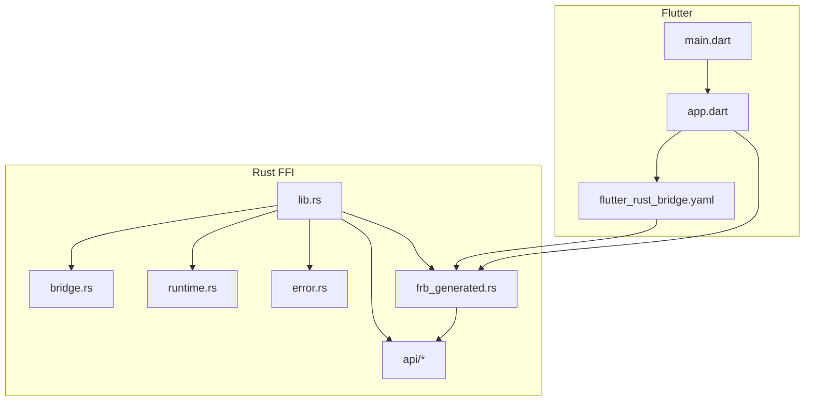
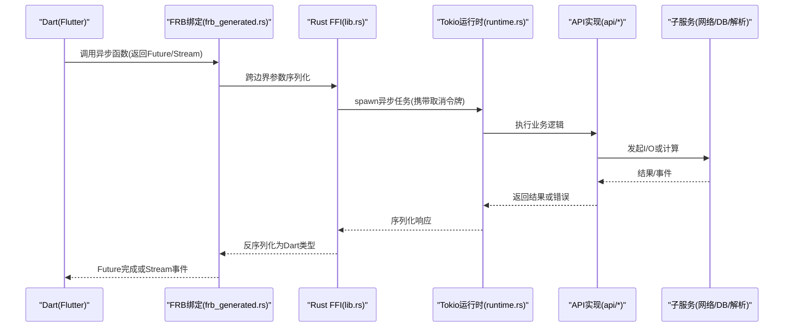
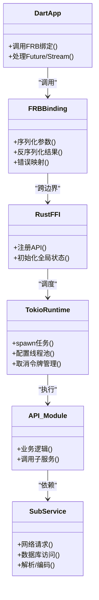
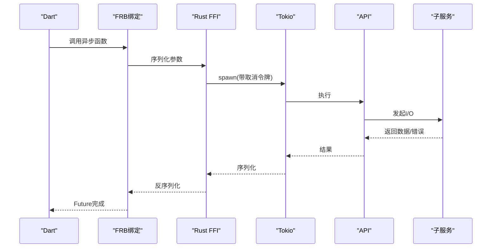
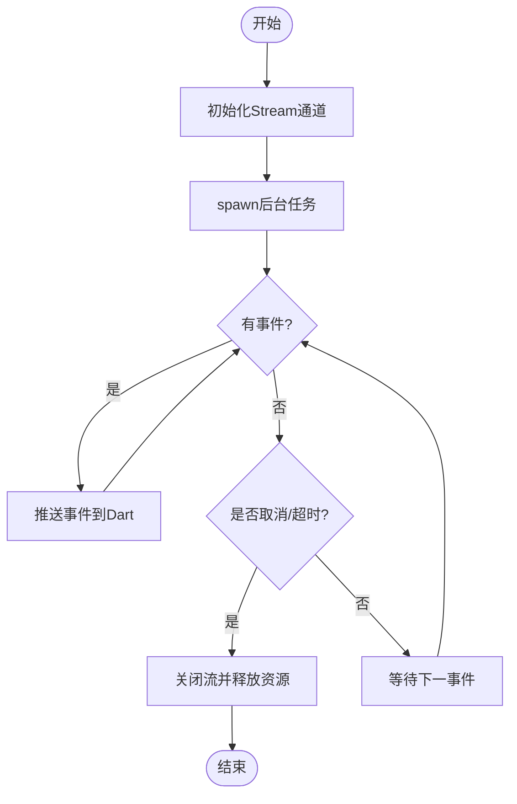
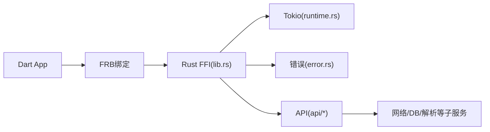

# 异步调用机制

<cite>
**本文引用的文件**   
- [flutter_rust_bridge.yaml](file://flutter_legado/flutter_rust_bridge.yaml)
- [lib.rs](file://rust/legado-ffi/src/lib.rs)
- [bridge.rs](file://rust/legado-ffi/src/bridge.rs)
- [runtime.rs](file://rust/legado-ffi/src/runtime.rs)
- [error.rs](file://rust/legado-ffi/src/error.rs)
- [frb_generated.rs](file://rust/legado-ffi/src/frb_generated.rs)
- [api/mod.rs](file://rust/legado-ffi/src/api/mod.rs)
- [audio_api.rs](file://rust/legado-ffi/src/api/audio_api.rs)
- [bookshelf.rs](file://rust/legado-ffi/src/api/bookshelf.rs)
- [search.rs](file://rust/legado-ffi/src/api/search.rs)
- [config_api.rs](file://rust/legado-ffi/src/api/config_api.rs)
- [cache_api.rs](file://rust/legado-ffi/src/api/cache_api.rs)
- [main.dart](file://flutter_legado/lib/main.dart)
- [app.dart](file://flutter_legado/lib/app.dart)
</cite>

## 目录
1. [简介](#简介)
2. [项目结构](#项目结构)
3. [核心组件](#核心组件)
4. [架构总览](#架构总览)
5. [详细组件分析](#详细组件分析)
6. [依赖分析](#依赖分析)
7. [性能考虑](#性能考虑)
8. [故障排查指南](#故障排查指南)
9. [结论](#结论)
10. [附录](#附录)

## 简介
本文件面向在 Flutter/Dart 与 Rust 之间通过 FFI 进行异步调用的开发者，系统性说明：
- Rust 中的异步函数如何暴露给 Dart 调用（Future 与 Stream）
- 异步生命周期管理（任务取消、超时、错误传播）
- 并发限制与最佳实践（线程池配置、资源竞争避免）
- 性能优化技巧（批量操作、缓存策略）
- 完整示例与调试方法

本项目采用 flutter_rust_bridge（FRB）作为桥接层，Rust 侧使用 tokio 运行时处理异步 I/O，Dart 侧通过 FRB 生成的绑定将 Future/Stream 映射为 Dart 的 Future/Stream。

## 项目结构
- Flutter 端入口与配置
  - lib/main.dart：应用启动与初始化
  - lib/app.dart：应用装配与路由
  - flutter_rust_bridge.yaml：FRB 代码生成配置（包含模块导出、类型映射、异步模式等）
- Rust 端 FFI 层
  - rust/legado-ffi/src/lib.rs：FFI 模块入口，注册 API 与全局状态
  - rust/legado-ffi/src/bridge.rs：FRB 桥接辅助（如上下文、序列化、错误转换）
  - rust/legado-ffi/src/runtime.rs：运行时与线程池配置（tokio 实例、调度器）
  - rust/legado-ffi/src/error.rs：错误模型与跨语言错误传播
  - rust/legado-ffi/src/frb_generated.rs：FRB 自动生成的 Dart/Rust 绑定
  - rust/legado-ffi/src/api/*：按功能域划分的 API 实现（音频、书架、搜索、配置、缓存等）

图表来源
- [main.dart](file://flutter_legado/lib/main.dart)
- [app.dart](file://flutter_legado/lib/app.dart)
- [flutter_rust_bridge.yaml](file://flutter_legado/flutter_rust_bridge.yaml)
- [lib.rs](file://rust/legado-ffi/src/lib.rs)
- [bridge.rs](file://rust/legado-ffi/src/bridge.rs)
- [runtime.rs](file://rust/legado-ffi/src/runtime.rs)
- [error.rs](file://rust/legado-ffi/src/error.rs)
- [frb_generated.rs](file://rust/legado-ffi/src/frb_generated.rs)
- [api/mod.rs](file://rust/legado-ffi/src/api/mod.rs)

章节来源
- [flutter_rust_bridge.yaml](file://flutter_legado/flutter_rust_bridge.yaml)
- [lib.rs](file://rust/legado-ffi/src/lib.rs)
- [bridge.rs](file://rust/legado-ffi/src/bridge.rs)
- [runtime.rs](file://rust/legado-ffi/src/runtime.rs)
- [error.rs](file://rust/legado-ffi/src/error.rs)
- [frb_generated.rs](file://rust/legado-ffi/src/frb_generated.rs)
- [api/mod.rs](file://rust/legado-ffi/src/api/mod.rs)

## 核心组件
- FRB 配置与代码生成
  - flutter_rust_bridge.yaml：声明要导出的 Rust 模块、函数签名、类型映射以及异步行为（Future/Stream）。构建时生成 frb_generated.rs 及 Dart 绑定。
- Rust FFI 入口与运行时
  - lib.rs：集中注册 API，初始化全局状态（数据库连接、网络客户端、JS 引擎池等），暴露给 Dart。
  - runtime.rs：创建并持有 tokio 运行时实例，提供线程池大小、IO 线程数、阻塞线程池规模等关键参数。
  - bridge.rs：封装跨语言数据转换、错误包装、上下文传递（如请求 ID、追踪信息）。
  - error.rs：定义统一错误类型，支持从 Rust Error 到 Dart 异常的映射。
- API 模块
  - api/*：按业务域组织异步函数，内部可调用网络、数据库、解析、媒体等子系统。

章节来源
- [flutter_rust_bridge.yaml](file://flutter_legado/flutter_rust_bridge.yaml)
- [lib.rs](file://rust/legado-ffi/src/lib.rs)
- [runtime.rs](file://rust/legado-ffi/src/runtime.rs)
- [bridge.rs](file://rust/legado-ffi/src/bridge.rs)
- [error.rs](file://rust/legado-ffi/src/error.rs)
- [api/mod.rs](file://rust/legado-ffi/src/api/mod.rs)

## 架构总览
下图展示一次典型的异步 FFI 调用流程：Dart 发起调用 → FRB 生成绑定 → Rust 进入 tokio 异步任务 → 执行具体 API → 返回结果或流式事件 → 错误与取消信号沿调用链回传。

图表来源
- [frb_generated.rs](file://rust/legado-ffi/src/frb_generated.rs)
- [lib.rs](file://rust/legado-ffi/src/lib.rs)
- [runtime.rs](file://rust/legado-ffi/src/runtime.rs)
- [api/mod.rs](file://rust/legado-ffi/src/api/mod.rs)

## 详细组件分析

### FRB 配置与代码生成
- 作用
  - 声明需要暴露给 Dart 的 Rust 函数与类型
  - 指定异步模式（Future 对应 Dart Future，Stream 对应 Dart Stream）
  - 控制序列化方式、错误映射、回调风格
- 关键点
  - 确保所有异步函数返回 Result<T, Error> 以便统一错误传播
  - 对大对象或流式数据优先使用 Stream，减少内存峰值
  - 合理设置类型映射，避免不必要的拷贝

章节来源
- [flutter_rust_bridge.yaml](file://flutter_legado/flutter_rust_bridge.yaml)
- [frb_generated.rs](file://rust/legado-ffi/src/frb_generated.rs)

### Rust FFI 入口与运行时
- lib.rs
  - 集中注册 API，初始化全局单例（如 DB、网络客户端、JS 引擎池）
  - 提供进程级初始化与清理钩子
- runtime.rs
  - 创建 tokio 运行时，配置线程池大小、IO 线程、阻塞线程池
  - 暴露获取当前运行时的方法，供各 API 使用
- bridge.rs
  - 统一错误包装与转换，便于 Dart 侧捕获
  - 提供上下文透传（如请求 ID、日志标签）

章节来源
- [lib.rs](file://rust/legado-ffi/src/lib.rs)
- [runtime.rs](file://rust/legado-ffi/src/runtime.rs)
- [bridge.rs](file://rust/legado-ffi/src/bridge.rs)

### 错误模型与传播
- error.rs
  - 定义统一的错误枚举，区分网络、解析、IO、业务错误
  - 提供 From/Into 实现以适配不同层的错误类型
  - 在 FRB 层将 Rust 错误转换为 Dart 异常，保留堆栈与消息

章节来源
- [error.rs](file://rust/legado-ffi/src/error.rs)

### API 模块与异步函数
- api/mod.rs
  - 聚合各业务域 API，统一导出
- audio_api.rs / bookshelf.rs / search.rs / config_api.rs / cache_api.rs
  - 每个模块负责特定领域的异步接口
  - 典型模式：接收参数 → 校验 → 调用子服务 → 返回 Result 或 Stream

章节来源
- [api/mod.rs](file://rust/legado-ffi/src/api/mod.rs)
- [audio_api.rs](file://rust/legado-ffi/src/api/audio_api.rs)
- [bookshelf.rs](file://rust/legado-ffi/src/api/bookshelf.rs)
- [search.rs](file://rust/legado-ffi/src/api/search.rs)
- [config_api.rs](file://rust/legado-ffi/src/api/config_api.rs)
- [cache_api.rs](file://rust/legado-ffi/src/api/cache_api.rs)

### 类图（概念映射）
以下类图用于理解各组件职责与关系（非严格代码类，而是概念映射）：

图表来源
- [lib.rs](file://rust/legado-ffi/src/lib.rs)
- [runtime.rs](file://rust/legado-ffi/src/runtime.rs)
- [api/mod.rs](file://rust/legado-ffi/src/api/mod.rs)

### 时序图（一次 Future 调用）

图表来源
- [frb_generated.rs](file://rust/legado-ffi/src/frb_generated.rs)
- [lib.rs](file://rust/legado-ffi/src/lib.rs)
- [runtime.rs](file://rust/legado-ffi/src/runtime.rs)
- [api/mod.rs](file://rust/legado-ffi/src/api/mod.rs)

### 流程图（Stream 事件推送）

图表来源
- [runtime.rs](file://rust/legado-ffi/src/runtime.rs)
- [api/mod.rs](file://rust/legado-ffi/src/api/mod.rs)

## 依赖分析
- 耦合与内聚
  - lib.rs 高内聚地管理全局状态与 API 注册，降低跨模块耦合
  - runtime.rs 独立管理运行时与线程池，便于替换与测试
  - error.rs 抽象错误模型，提升错误处理的内聚性
- 外部依赖
  - tokio：异步运行时与任务调度
  - serde：序列化/反序列化
  - FRB：自动生成绑定，屏蔽底层 FFI 细节
- 潜在循环依赖
  - 通过模块化 api/* 避免循环引用；全局状态通过单例或上下文注入

图表来源
- [lib.rs](file://rust/legado-ffi/src/lib.rs)
- [runtime.rs](file://rust/legado-ffi/src/runtime.rs)
- [error.rs](file://rust/legado-ffi/src/error.rs)
- [api/mod.rs](file://rust/legado-ffi/src/api/mod.rs)

章节来源
- [lib.rs](file://rust/legado-ffi/src/lib.rs)
- [runtime.rs](file://rust/legado-ffi/src/runtime.rs)
- [error.rs](file://rust/legado-ffi/src/error.rs)
- [api/mod.rs](file://rust/legado-ffi/src/api/mod.rs)

## 性能考虑
- 线程池与调度
  - 根据设备 CPU 核数与 I/O 密集程度调整 IO 线程与阻塞线程池大小
  - 避免在阻塞线程中执行 CPU 密集型任务，应使用 spawn_blocking 或专用计算线程池
- 批量操作
  - 将多次小查询合并为批量写入/读取，减少锁与序列化开销
  - 使用事务提交批量更新，降低磁盘抖动
- 缓存策略
  - 热点数据（如配置、封面、搜索结果）使用内存缓存，配合 TTL 与 LRU 淘汰
  - 对重复网络请求增加去重与共享订阅（基于请求键）
- 流式处理
  - 大文件下载/解析使用 Stream 分块处理，降低峰值内存
  - 背压控制：Dart 侧按需消费，避免积压
- 序列化优化
  - 选择轻量序列化格式（如 bincode/serde_json 视场景而定）
  - 避免在大对象上频繁复制，尽量使用引用或零拷贝策略

[本节为通用指导，不直接分析具体文件]

## 故障排查指南
- 常见问题
  - 任务未取消：检查取消令牌是否正确传递并在关键路径上监听
  - 超时未生效：确认超时设置在 tokio 层与业务层均正确配置
  - 错误丢失：确保所有分支都返回 Result，并在 FRB 层映射为 Dart 异常
  - 死锁/饥饿：避免长时间持有全局锁，拆分临界区
- 调试方法
  - 启用详细日志（请求 ID、耗时、线程名）
  - 使用 tokio-console 或 tracing 收集运行时指标
  - 在 Dart 侧打印 Future/Stream 的生命周期事件（onDone、onError）
- 定位步骤
  - 复现最小用例，隔离问题模块
  - 逐步注释 API 调用，缩小范围
  - 检查线程池利用率与队列长度

章节来源
- [error.rs](file://rust/legado-ffi/src/error.rs)
- [runtime.rs](file://rust/legado-ffi/src/runtime.rs)
- [bridge.rs](file://rust/legado-ffi/src/bridge.rs)

## 结论
通过 FRB 与 tokio，Legado 实现了高效、可控的 Rust-Dart 异步 FFI 调用。关键在于：
- 明确异步边界与生命周期（取消、超时、错误）
- 合理的线程池与资源管理
- 批量与缓存优化
- 完善的错误模型与调试手段

遵循上述实践，可在保证稳定性的同时获得良好的性能表现。

[本节为总结，不直接分析具体文件]

## 附录
- 快速上手
  - 在 flutter_rust_bridge.yaml 中声明需导出的 Rust 函数与类型
  - 构建后在 Dart 侧直接使用 FRB 生成的 Future/Stream 接口
  - 在 Rust 侧使用 tokio::spawn 执行异步任务，并通过 Result 返回错误
- 参考文件
  - 入口与配置：lib.rs、flutter_rust_bridge.yaml
  - 运行时与错误：runtime.rs、error.rs
  - API 示例：api/* 下的各模块

[本节为补充信息，不直接分析具体文件]