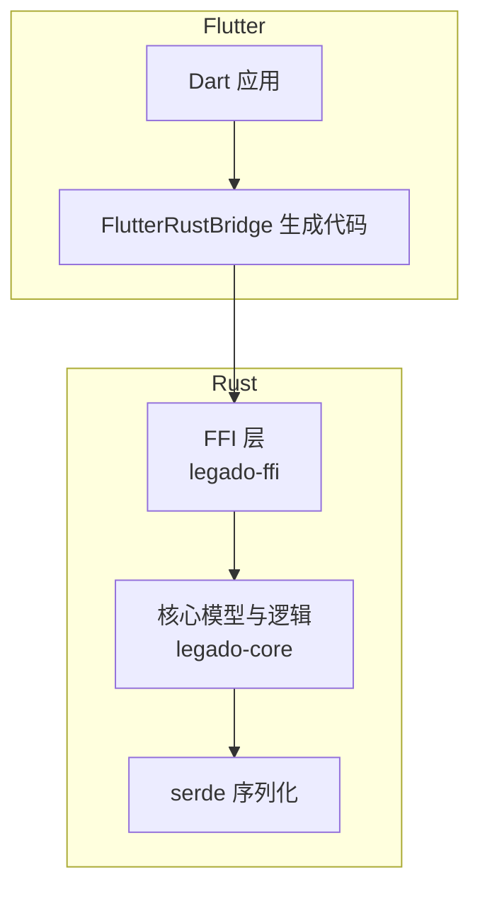
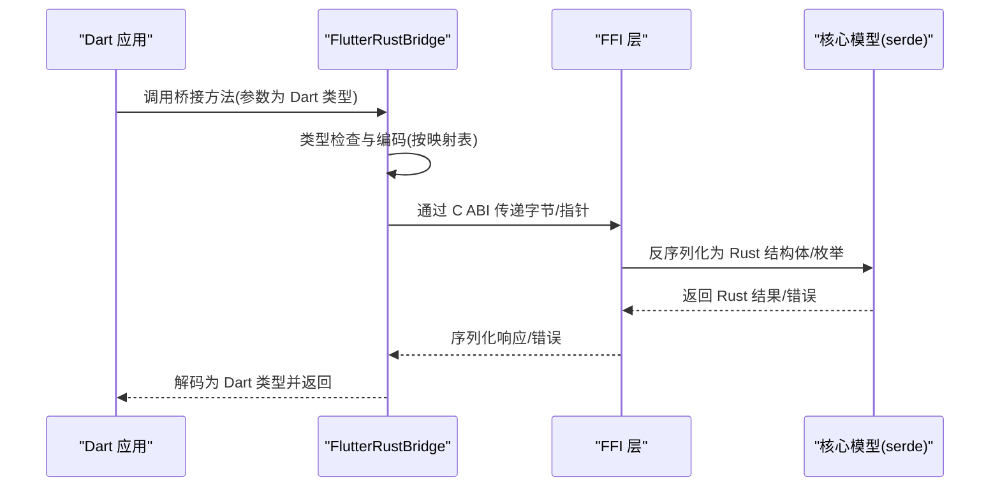

# 数据类型映射

<cite>
**本文引用的文件**   
- [flutter_rust_bridge.yaml](file://flutter_legado/flutter_rust_bridge.yaml)
- [pubspec.yaml](file://flutter_legado/pubspec.yaml)
- [Cargo.toml](file://rust/Cargo.toml)
- [lib.rs](file://rust/legado-ffi/src/lib.rs)
- [bridge.rs](file://rust/legado-ffi/src/bridge.rs)
- [frb_generated.rs](file://rust/legado-ffi/src/frb_generated.rs)
- [error.rs](file://rust/legado-ffi/src/error.rs)
- [types.rs](file://rust/legado-core/src/types.rs)
- [book.rs](file://rust/legado-core/src/models/book.rs)
- [book_source.rs](file://rust/legado-core/src/models/book_source.rs)
- [misc.rs](file://rust/legado-core/src/models/misc.rs)
- [read_state.rs](file://rust/legado-core/src/read_state.rs)
- [audio.rs](file://rust/legado-core/src/audio.rs)
- [download_manager.rs](file://rust/legado-core/src/download_manager.rs)
- [cache_book.rs](file://rust/legado-core/src/cache_book.rs)
- [reading_stats.rs](file://rust/legado-core/src/reading_stats.rs)
- [auto_task.rs](file://rust/legado-core/src/auto_task.rs)
- [review.rs](file://rust/legado-core/src/review.rs)
- [source_lock.rs](file://rust/legado-core/src/source_lock.rs)
- [passphrase.rs](file://rust/legado-core/src/passphrase.rs)
- [chinese_convert.rs](file://rust/legado-core/src/chinese_convert.rs)
- [content_processor.rs](file://rust/legado-core/src/content_processor.rs)
- [cron.rs](file://rust/legado-core/src/cron.rs)
- [crypto.rs](file://rust/legado-core/src/crypto.rs)
- [debug_session.rs](file://rust/legado-core/src/debug_session.rs)
- [layout.rs](file://rust/legado-core/src/layout.rs)
- [query_ttf.rs](file://rust/legado-core/src/query_ttf.rs)
- [search_engine.rs](file://rust/legado-core/src/search_engine.rs)
- [source_matcher.rs](file://rust/legado-core/src/source_matcher.rs)
- [toc_updater.rs](file://rust/legado-core/src/toc_updater.rs)
- [api/mod.rs](file://rust/legado-ffi/src/api/mod.rs)
- [bookshelf.rs](file://rust/legado-ffi/src/api/bookshelf.rs)
- [config_api.rs](file://rust/legado-ffi/src/api/config_api.rs)
- [reader.rs](file://rust/legado-ffi/src/api/reader.rs)
- [search.rs](file://rust/legado-ffi/src/api/search.rs)
- [rss.rs](file://rust/legado-ffi/src/api/rss.rs)
- [user_api.rs](file://rust/legado-ffi/src/api/user_api.rs)
- [backup_api.rs](file://rust/legado-ffi/src/api/backup_api.rs)
- [book_export.rs](file://rust/legado-ffi/src/api/book_export.rs)
- [book_group_api.rs](file://rust/legado-ffi/src/api/book_group_api.rs)
- [bookmark_api.rs](file://rust/legado-ffi/src/api/bookmark_api.rs)
- [cache_api.rs](file://rust/legado-ffi/src/api/cache_api.rs)
- [http_tts_api.rs](file://rust/legado-ffi/src/api/http_tts_api.rs)
- [read_record_api.rs](file://rust/legado-ffi/src/api/read_record_api.rs)
- [reading_stats_api.rs](file://rust/legado-ffi/src/api/reading_stats_api.rs)
- [replace_rule_api.rs](file://rust/legado-ffi/src/api/replace_rule_api.rs)
- [rss_star_api.rs](file://rust/legado-ffi/src/api/rss_star_api.rs)
- [search_history_api.rs](file://rust/legado-ffi/src/api/search_history_api.rs)
- [server_api.rs](file://rust/legado-ffi/src/api/server_api.rs)
- [source.rs](file://rust/legado-ffi/src/api/source.rs)
- [source_switch.rs](file://rust/legado-ffi/src/api/source_switch.rs)
- [txt_search_api.rs](file://rust/legado-ffi/src/api/txt_search_api.rs)
- [web_book.rs](file://rust/legado-ffi/src/api/web_book.rs)
</cite>

## 目录
1. [简介](#简介)
2. [项目结构](#项目结构)
3. [核心组件](#核心组件)
4. [架构总览](#架构总览)
5. [详细组件分析](#详细组件分析)
6. [依赖关系分析](#依赖关系分析)
7. [性能考虑](#性能考虑)
8. [故障排查指南](#故障排查指南)
9. [结论](#结论)
10. [附录](#附录)

## 简介
本文件系统性梳理 Flutter 与 Rust 之间的数据类型映射规则，覆盖基本类型、复杂类型（结构体、枚举、集合）、可选与结果类型、元组等高级类型的自动映射与自定义序列化策略。文档基于仓库中 FlutterRustBridge 配置、Rust 侧模型定义与 FFI 暴露的 API 进行归纳，帮助读者在跨语言边界安全、高效地传递数据。

## 项目结构
本项目采用 Flutter + Rust 的双端工程：
- Flutter 侧通过 flutter_rust_bridge 生成桥接代码，负责 Dart ↔ Rust 的类型转换与调用。
- Rust 侧使用 serde 进行序列化和反序列化，并通过 FFI 暴露 API。
- 核心业务模型集中在 legado-core，FFI 接口集中在 legado-ffi，Flutter 配置与生成脚本位于 flutter_legado。

**图示来源** 
- [flutter_rust_bridge.yaml](file://flutter_legado/flutter_rust_bridge.yaml)
- [Cargo.toml](file://rust/Cargo.toml)
- [lib.rs](file://rust/legado-ffi/src/lib.rs)

**章节来源**
- [flutter_rust_bridge.yaml](file://flutter_legado/flutter_rust_bridge.yaml)
- [Cargo.toml](file://rust/Cargo.toml)
- [lib.rs](file://rust/legado-ffi/src/lib.rs)

## 核心组件
- FlutterRustBridge 配置与生成：控制 Dart/Rust 类型映射、同步/异步调用、错误传播方式。
- Rust 模型与序列化：使用 serde 的 Serialize/Deserialize trait 实现结构体、枚举、集合等的编解码。
- FFI API 暴露：将 Rust 函数以 C ABI 暴露给 FlutterRustBridge，统一错误处理与返回值。

关键要点
- 基本类型：整数、浮点、布尔、字符串在 FlutterRustBridge 中具备稳定的自动映射。
- 复杂类型：结构体与枚举需实现 Serialize/Deserialize；集合类型（Vec、HashMap、Option、Result）由 serde 与 FRB 共同支持。
- 可选与结果类型：Option 映射为可空值或默认值；Result 映射为错误对象或成功包装。
- 自定义类型：通过 derive(Serialize, Deserialize) 或手动实现 trait 完成。

**章节来源**
- [flutter_rust_bridge.yaml](file://flutter_legado/flutter_rust_bridge.yaml)
- [types.rs](file://rust/legado-core/src/types.rs)
- [error.rs](file://rust/legado-ffi/src/error.rs)

## 架构总览
下图展示从 Flutter 到 Rust 的数据流转路径，以及类型映射的关键节点。

**图示来源** 
- [bridge.rs](file://rust/legado-ffi/src/bridge.rs)
- [frb_generated.rs](file://rust/legado-ffi/src/frb_generated.rs)
- [error.rs](file://rust/legado-ffi/src/error.rs)

## 详细组件分析

### 基本数据类型映射
- 整数：i8/i16/i32/i64/u8/u16/u32/u64 与 Dart 的 int 对应，注意溢出与范围校验。
- 浮点数：f32/f64 与 Dart 的 double 对应，精度差异需关注。
- 布尔：bool 与 Dart 的 bool 直接映射。
- 字符串：String/&str 与 Dart 的 String 映射，注意 UTF-8 编码与内存拷贝开销。

实践建议
- 大整数优先使用 i64/u64，避免平台差异。
- 浮点计算尽量在 Rust 侧完成，减少精度损失。
- 长字符串传输建议使用流式或分块策略。

**章节来源**
- [flutter_rust_bridge.yaml](file://flutter_legado/flutter_rust_bridge.yaml)
- [types.rs](file://rust/legado-core/src/types.rs)

### 复杂数据类型映射
- 结构体：需 derive(Serialize, Deserialize)，字段名可通过 #[serde(rename)] 调整。
- 枚举：derive(Serialize, Deserialize) 支持 Tagged/Untagged 模式，推荐 Tagged 便于扩展。
- 集合：Vec<T>、HashMap<K,V>、HashSet<T> 等，T/K/V 需满足 Serialize/Deserialize。
- 嵌套结构：递归结构需确保终止条件与大小限制，防止栈溢出。

示例参考
- 书籍模型、源模型、阅读状态等均在 core 模块中以结构体形式定义并实现序列化。

**章节来源**
- [book.rs](file://rust/legado-core/src/models/book.rs)
- [book_source.rs](file://rust/legado-core/src/models/book_source.rs)
- [misc.rs](file://rust/legado-core/src/models/misc.rs)
- [read_state.rs](file://rust/legado-core/src/read_state.rs)

### 可选类型与结果类型
- Option<T>：映射为 Dart 的可空类型或默认值，建议在 API 设计时明确缺省语义。
- Result<T,E>：映射为错误对象或成功包装，错误类型 E 需实现 Serialize/Deserialize。
- 常见模式：函数返回 Result，上层统一处理错误分支。

**章节来源**
- [error.rs](file://rust/legado-ffi/src/error.rs)
- [types.rs](file://rust/legado-core/src/types.rs)

### 元组与其他高级类型
- 元组：(A,B,C) 可映射为 Dart 的 List 或自定义类，建议优先使用结构体提升可读性。
- 日期时间：chrono::DateTime 需配合 serde 的格式化策略。
- 二进制数据：Vec<u8> 通常以 Base64 或原始字节数组传输，注意内存与编码。

**章节来源**
- [types.rs](file://rust/legado-core/src/types.rs)

### 自定义类型映射
- 实现 Serialize/Deserialize：对第三方类型或特殊格式，手动实现 trait 或使用 #[serde(with="...")]。
- 字段级定制：#[serde(default)]、#[serde(skip)]、#[serde(flatten)] 等属性控制行为。
- 版本兼容：通过 #[serde(tag="...")] 与 #[serde(deny_unknown_fields)] 平衡兼容性与严格性。

**章节来源**
- [types.rs](file://rust/legado-core/src/types.rs)

### API 层的类型契约
- FFI 函数签名应清晰表达输入输出类型，避免隐式转换。
- 错误类型集中管理，便于前端统一处理。
- 大型对象传输建议分页或增量更新。

**章节来源**
- [api/mod.rs](file://rust/legado-ffi/src/api/mod.rs)
- [bookshelf.rs](file://rust/legado-ffi/src/api/bookshelf.rs)
- [config_api.rs](file://rust/legado-ffi/src/api/config_api.rs)
- [reader.rs](file://rust/legado-ffi/src/api/reader.rs)
- [search.rs](file://rust/legado-ffi/src/api/search.rs)
- [rss.rs](file://rust/legado-ffi/src/api/rss.rs)
- [user_api.rs](file://rust/legado-ffi/src/api/user_api.rs)
- [backup_api.rs](file://rust/legado-ffi/src/api/backup_api.rs)
- [book_export.rs](file://rust/legado-ffi/src/api/book_export.rs)
- [book_group_api.rs](file://rust/legado-ffi/src/api/book_group_api.rs)
- [bookmark_api.rs](file://rust/legado-ffi/src/api/bookmark_api.rs)
- [cache_api.rs](file://rust/legado-ffi/src/api/cache_api.rs)
- [http_tts_api.rs](file://rust/legado-ffi/src/api/http_tts_api.rs)
- [read_record_api.rs](file://rust/legado-ffi/src/api/read_record_api.rs)
- [reading_stats_api.rs](file://rust/legado-ffi/src/api/reading_stats_api.rs)
- [replace_rule_api.rs](file://rust/legado-ffi/src/api/replace_rule_api.rs)
- [rss_star_api.rs](file://rust/legado-ffi/src/api/rss_star_api.rs)
- [search_history_api.rs](file://rust/legado-ffi/src/api/search_history_api.rs)
- [server_api.rs](file://rust/legado-ffi/src/api/server_api.rs)
- [source.rs](file://rust/legado-ffi/src/api/source.rs)
- [source_switch.rs](file://rust/legado-ffi/src/api/source_switch.rs)
- [txt_search_api.rs](file://rust/legado-ffi/src/api/txt_search_api.rs)
- [web_book.rs](file://rust/legado-ffi/src/api/web_book.rs)

## 依赖关系分析
- FlutterRustBridge 依赖 dart:ffi 与生成的桥接代码，负责类型编码与调用调度。
- Rust FFI 依赖 serde 与具体业务模型，确保数据结构一致。
- 核心模型依赖 chrono、uuid、regex 等常用库，影响序列化策略与性能。

**图示来源** 
- [pubspec.yaml](file://flutter_legado/pubspec.yaml)
- [Cargo.toml](file://rust/Cargo.toml)
- [lib.rs](file://rust/legado-ffi/src/lib.rs)

**章节来源**
- [pubspec.yaml](file://flutter_legado/pubspec.yaml)
- [Cargo.toml](file://rust/Cargo.toml)

## 性能考虑
- 避免频繁的大对象拷贝：使用引用与零拷贝策略，必要时分块传输。
- 合理选择序列化格式：JSON 通用但体积较大，二进制如 bincode 更高效但兼容性差。
- 控制递归深度与集合大小：防止栈溢出与内存峰值过高。
- 缓存热点数据：在 Rust 侧维护短期缓存，减少重复计算与网络 IO。

[本节为通用指导，不直接分析具体文件]

## 故障排查指南
常见问题与定位步骤
- 类型不匹配：检查 FlutterRustBridge 配置与 Rust 模型字段类型是否一致。
- 序列化失败：确认结构体是否实现 Serialize/Deserialize，字段命名与 rename 是否正确。
- 运行时崩溃：查看 FFI 错误日志，定位异常类型与堆栈。
- 性能问题：使用 profiling 工具分析 CPU 与内存占用，优化热点路径。

建议工具
- Rust 侧启用日志与断言，捕获边界情况。
- Flutter 侧打印桥接调用耗时与错误信息。
- 使用单元测试覆盖关键类型转换路径。

**章节来源**
- [error.rs](file://rust/legado-ffi/src/error.rs)
- [frb_generated.rs](file://rust/legado-ffi/src/frb_generated.rs)

## 结论
通过 FlutterRustBridge 与 serde 的组合，项目实现了稳定高效的跨语言类型映射。遵循本文的映射规则与实践建议，可在保证类型安全的前提下提升开发效率与运行性能。建议在新增 API 时同步更新映射文档与测试用例，确保长期一致性。

[本节为总结性内容，不直接分析具体文件]

## 附录
- 快速参考：基本类型、集合、可选与结果的映射速查表。
- 最佳实践：命名规范、错误处理、性能优化清单。
- 示例路径：各 API 模块的文件路径，便于查阅具体实现。

[本节为补充信息，不直接分析具体文件]