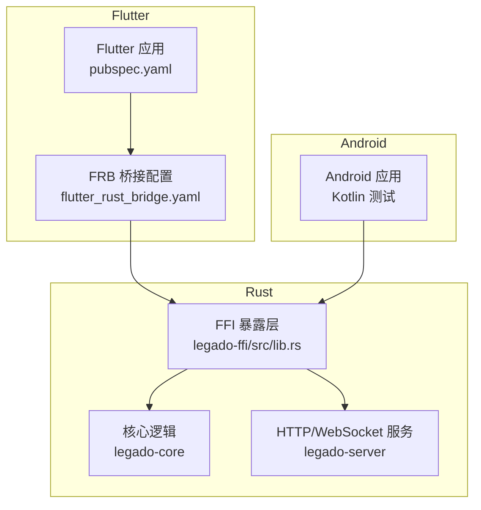
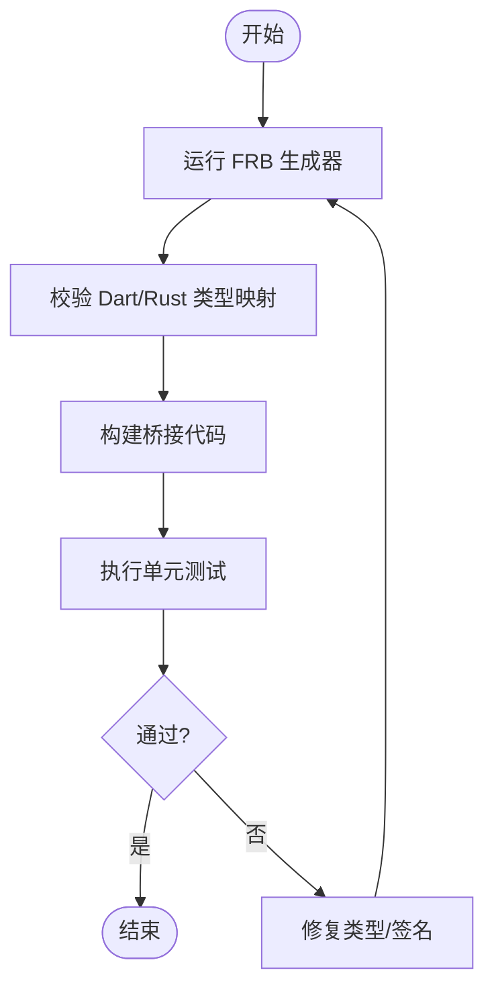
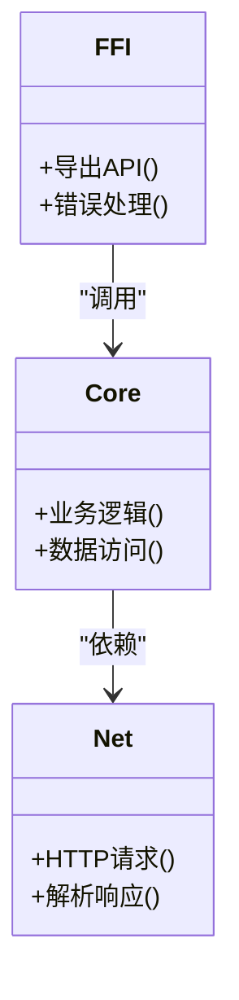
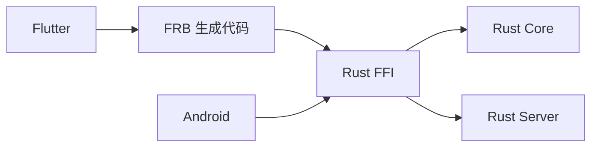

# 调试与测试

<cite>
**本文引用的文件**   
- [README.md](file://README.md)
- [Makefile](file://Makefile)
- [flutter_legado/Makefile](file://flutter_legado/Makefile)
- [flutter_legado/flutter_rust_bridge.yaml](file://flutter_legado/flutter_rust_bridge.yaml)
- [rust/Cargo.toml](file://rust/Cargo.toml)
- [rust/legado-ffi/src/lib.rs](file://rust/legado-ffi/src/lib.rs)
- [rust/legado-ffi/src/bridge.rs](file://rust/legado-ffi/src/bridge.rs)
- [rust/legado-core/src/debug_session.rs](file://rust/legado-core/src/debug_session.rs)
- [rust/legado-server/src/server.rs](file://rust/legado-server/src/server.rs)
- [app/src/androidTest/java/io/legado/app/AndroidJsTest.kt](file://app/src/androidTest/java/io/legado/app/AndroidJsTest.kt)
- [app/src/test/java/io/legado/app/JsTest.kt](file://app/src/test/java/io/legado/app/JsTest.kt)
- [app/src/test/java/io/legado/app/RuntimeConcurrencyTest.kt](file://app/src/test/java/io/legado/app/RuntimeConcurrencyTest.kt)
- [flutter_legado/pubspec.yaml](file://flutter_legado/pubspec.yaml)
- [flutter_legado/test/unit/bookshelf_provider_test.dart](file://flutter_legado/test/unit/bookshelf_provider_test.dart)
- [flutter_legado/test/widget/bookshelf_test.dart](file://flutter_legado/test/widget/bookshelf_test.dart)
</cite>

## 目录
1. [简介](#简介)
2. [项目结构](#项目结构)
3. [核心组件](#核心组件)
4. [架构总览](#架构总览)
5. [详细组件分析](#详细组件分析)
6. [依赖分析](#依赖分析)
7. [性能考虑](#性能考虑)
8. [故障排查指南](#故障排查指南)
9. [结论](#结论)
10. [附录](#附录)

## 简介
本指南面向需要在 Legado 项目中开展 FFI（Flutter/Rust/Android）集成调试与测试的工程师。内容涵盖：
- 跨语言调试设置：断点、变量查看、调用栈跟踪
- 日志记录最佳实践：结构化日志、性能监控、错误追踪
- 单元测试编写：模拟外部依赖、异步调用验证、错误处理验证
- 集成测试策略：端到端测试、性能基准测试、兼容性测试
- 完整测试示例与自动化流程配置

## 项目结构
Legado 采用多语言、多模块工程组织方式，关键目录与职责如下：
- app：Android 应用层，包含 Kotlin 单元测试与 Android 仪器化测试
- flutter_legado：Flutter 前端，使用 Flutter Rust Bridge（FRB）与 Rust FFI 交互
- rust：Rust 核心库与 FFI 暴露层，包含 legado-ffi、legado-core、legado-server 等模块
- modules：Android 侧子模块（如 book、rhino、web）



**图表来源** 
- [flutter_legado/pubspec.yaml](file://flutter_legado/pubspec.yaml)
- [flutter_legado/flutter_rust_bridge.yaml](file://flutter_legado/flutter_rust_bridge.yaml)
- [rust/legado-ffi/src/lib.rs](file://rust/legado-ffi/src/lib.rs)
- [rust/Cargo.toml](file://rust/Cargo.toml)

**章节来源**
- [README.md](file://README.md)
- [Makefile](file://Makefile)
- [flutter_legado/Makefile](file://flutter_legado/Makefile)

## 核心组件
- Flutter-Rust Bridge（FRB）：通过配置文件生成桥接代码，实现 Flutter 与 Rust 的高效互操作
- Rust FFI 层：统一对外暴露 API，封装业务逻辑与网络、数据库、解析等能力
- Android 测试：Kotlin 单测与仪器化测试覆盖 JS 引擎、网络、迁移等场景
- Web 服务器：提供 HTTP/WebSocket 接口，便于调试与集成测试

**章节来源**
- [flutter_legado/flutter_rust_bridge.yaml](file://flutter_legado/flutter_rust_bridge.yaml)
- [rust/legado-ffi/src/lib.rs](file://rust/legado-ffi/src/lib.rs)
- [rust/legado-core/src/debug_session.rs](file://rust/legado-core/src/debug_session.rs)
- [rust/legado-server/src/server.rs](file://rust/legado-server/src/server.rs)
- [app/src/androidTest/java/io/legado/app/AndroidJsTest.kt](file://app/src/androidTest/java/io/legado/app/AndroidJsTest.kt)
- [app/src/test/java/io/legado/app/JsTest.kt](file://app/src/test/java/io/legado/app/JsTest.kt)

## 架构总览
下图展示 Flutter 调用 Rust FFI 的典型路径，以及 Android 侧对 FFI 的访问方式。

```mermaid
sequenceDiagram
participant UI as "Flutter UI"
participant FRB as "FRB 桥接"
participant FFI as "Rust FFI"
participant CORE as "Rust Core"
participant NET as "Rust 网络/解析"
participant AND as "Android 应用"
UI->>FRB : 调用生成的方法
FRB->>FFI : 序列化参数并跨进程/跨语言调用
FFI->>CORE : 执行业务逻辑
CORE->>NET : 发起请求/解析数据
NET-->>CORE : 返回结果
CORE-->>FFI : 封装为 FFI 安全类型
FFI-->>FRB : 反序列化为 Dart 类型
FRB-->>UI : 回调结果或异常
AND->>FFI : 直接调用 FFI可选
```

**图表来源** 
- [flutter_legado/flutter_rust_bridge.yaml](file://flutter_legado/flutter_rust_bridge.yaml)
- [rust/legado-ffi/src/bridge.rs](file://rust/legado-ffi/src/bridge.rs)
- [rust/legado-ffi/src/lib.rs](file://rust/legado-ffi/src/lib.rs)

## 详细组件分析

### Flutter-Rust Bridge（FRB）调试与测试
- 生成桥接代码：通过配置文件定义 Dart 与 Rust 的类型映射与方法签名，构建时自动生成桥接代码
- 调试要点：
  - 在 Rust 侧打断点，确认参数序列化/反序列化是否正确
  - 在 Flutter 侧检查生成的方法是否按预期抛出异常或返回空值
- 测试要点：
  - 使用 Flutter 单元测试验证输入输出契约
  - 针对边界条件（空值、超长字符串、特殊字符）构造用例



**图表来源** 
- [flutter_legado/flutter_rust_bridge.yaml](file://flutter_legado/flutter_rust_bridge.yaml)
- [flutter_legado/Makefile](file://flutter_legado/Makefile)

**章节来源**
- [flutter_legado/flutter_rust_bridge.yaml](file://flutter_legado/flutter_rust_bridge.yaml)
- [flutter_legado/Makefile](file://flutter_legado/Makefile)

### Rust FFI 层调试与测试
- 断点与变量查看：
  - 使用 Rust 调试器（如 lldb 或 IDE 内置调试器）在 FFI 入口与核心函数处设置断点
  - 检查传入参数的类型转换与内存布局是否符合预期
- 调用栈跟踪：
  - 启用调试符号，确保堆栈信息可读
  - 结合日志定位跨语言调用失败点
- 错误处理：
  - 将 Rust 错误转换为 FFI 安全的错误码或 Result 类型
  - 在 Flutter/Android 侧捕获并上报错误



**图表来源** 
- [rust/legado-ffi/src/lib.rs](file://rust/legado-ffi/src/lib.rs)
- [rust/legado-ffi/src/bridge.rs](file://rust/legado-ffi/src/bridge.rs)

**章节来源**
- [rust/legado-ffi/src/lib.rs](file://rust/legado-ffi/src/lib.rs)
- [rust/legado-ffi/src/bridge.rs](file://rust/legado-ffi/src/bridge.rs)

### Android 侧测试（Kotlin）
- 单元测试：
  - 使用 JUnit 与 Mock 框架模拟外部依赖（网络、文件系统）
  - 验证异步调用与错误处理路径
- 仪器化测试：
  - 在真实设备或模拟器上运行，覆盖 JS 引擎、网络、迁移等场景
- 调试技巧：
  - 使用 Logcat 过滤关键字段，结合断点定位问题

**章节来源**
- [app/src/test/java/io/legado/app/JsTest.kt](file://app/src/test/java/io/legado/app/JsTest.kt)
- [app/src/test/java/io/legado/app/RuntimeConcurrencyTest.kt](file://app/src/test/java/io/legado/app/RuntimeConcurrencyTest.kt)
- [app/src/androidTest/java/io/legado/app/AndroidJsTest.kt](file://app/src/androidTest/java/io/legado/app/AndroidJsTest.kt)

### Flutter 侧测试（Dart）
- 单元测试：
  - 使用 mockito 模拟 Provider、网络服务等依赖
  - 验证状态变化与用户交互逻辑
- Widget 测试：
  - 模拟用户操作，断言 UI 行为符合预期
- 异步测试：
  - 使用 testAsync 或 Future 相关工具验证异步流程

**章节来源**
- [flutter_legado/test/unit/bookshelf_provider_test.dart](file://flutter_legado/test/unit/bookshelf_provider_test.dart)
- [flutter_legado/test/widget/bookshelf_test.dart](file://flutter_legado/test/widget/bookshelf_test.dart)

## 依赖分析
- Flutter 依赖 FRB 生成的桥接代码，间接依赖 Rust FFI
- Rust FFI 依赖 core、net、server 等模块
- Android 应用可直接调用 FFI 或通过 JNI 桥接



**图表来源** 
- [rust/Cargo.toml](file://rust/Cargo.toml)
- [flutter_legado/pubspec.yaml](file://flutter_legado/pubspec.yaml)

**章节来源**
- [rust/Cargo.toml](file://rust/Cargo.toml)
- [flutter_legado/pubspec.yaml](file://flutter_legado/pubspec.yaml)

## 性能考虑
- 减少跨语言调用频率：批量处理数据，避免频繁序列化/反序列化
- 使用零拷贝技术：在 Rust 侧尽量传递引用，避免不必要的内存分配
- 异步优化：在 Rust 中使用 tokio 或 async-std，Flutter 侧使用 isolate 或 compute
- 监控指标：收集调用耗时、内存占用、错误率等指标，用于性能分析

## 故障排查指南
- 常见问题：
  - 类型不匹配：检查 FRB 配置中的类型映射
  - 内存泄漏：使用 Rust 的内存分析工具（如 Valgrind）和 Flutter 的 DevTools
  - 异步竞态：确保线程安全，避免共享可变状态
- 调试步骤：
  - 在 FFI 入口设置断点，逐步执行
  - 打印结构化日志，包含请求 ID、时间戳、错误码
  - 使用网络抓包工具（如 Wireshark）分析 HTTP/WebSocket 流量

## 结论
通过合理的调试设置、日志记录与测试策略，可以有效提升 Legado 项目中 FFI 集成的稳定性与可维护性。建议团队遵循本文档的最佳实践，持续优化性能与用户体验。

## 附录
- 自动化测试流程：
  - 使用 CI/CD 管道运行单元测试与集成测试
  - 生成测试报告并归档，便于回溯与分析
- 参考命令：
  - 运行 Flutter 测试：flutter test
  - 运行 Rust 测试：cargo test
  - 运行 Android 测试：./gradlew connectedAndroidTest