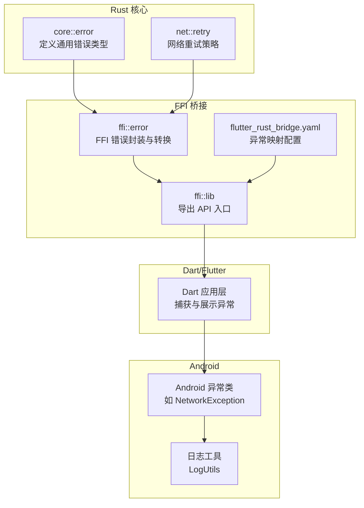
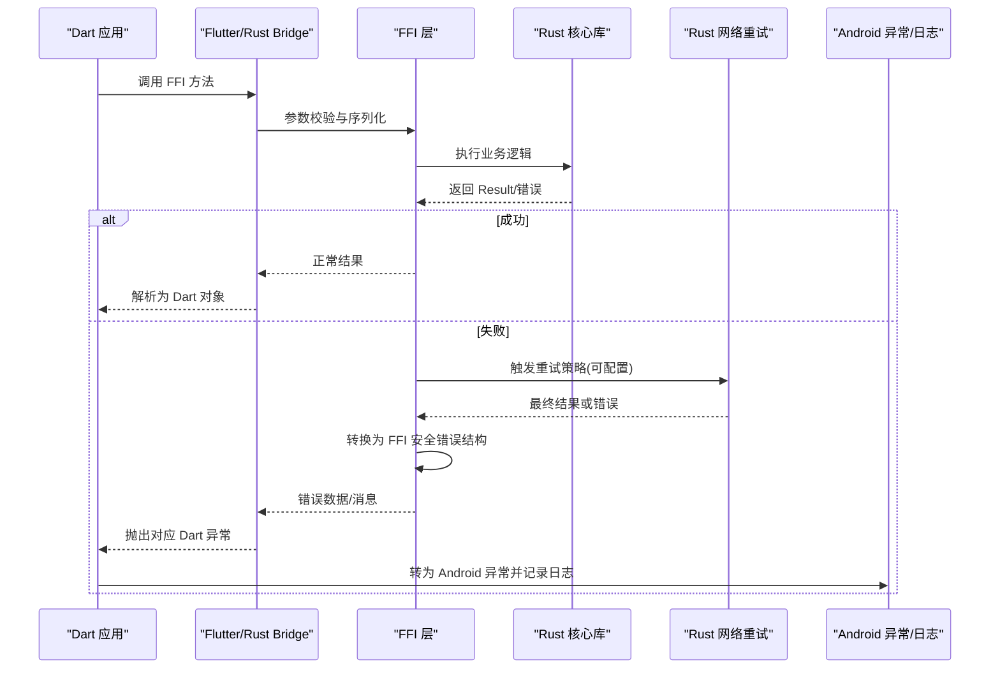
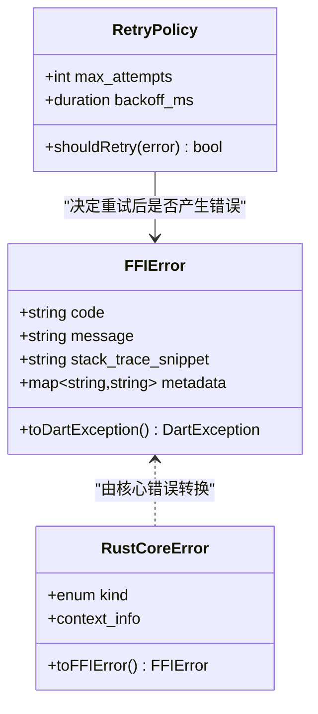
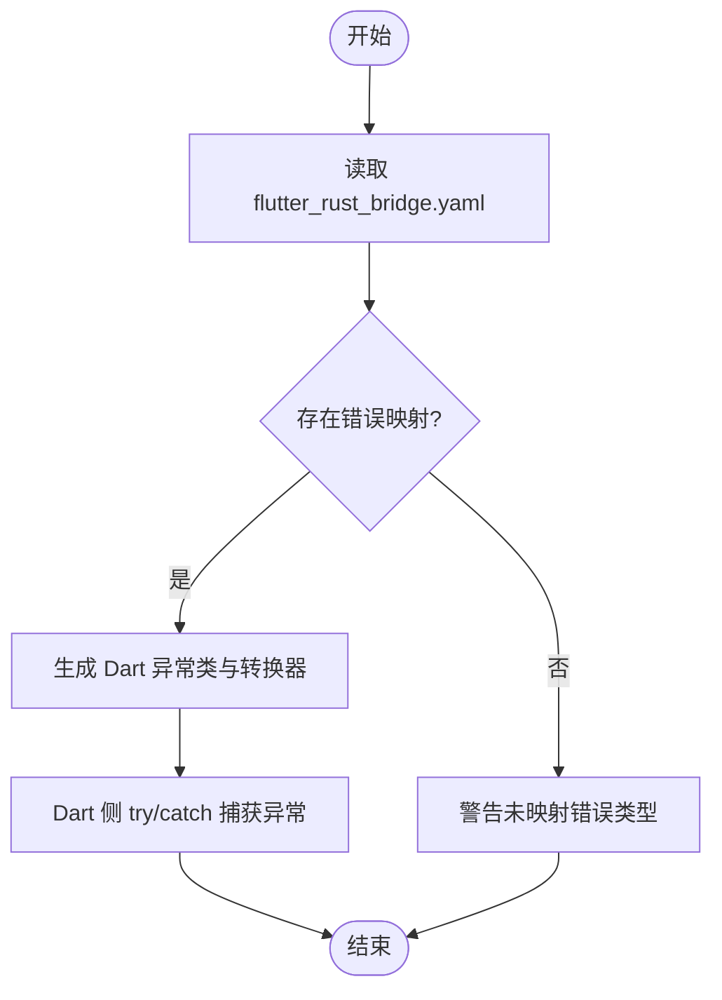
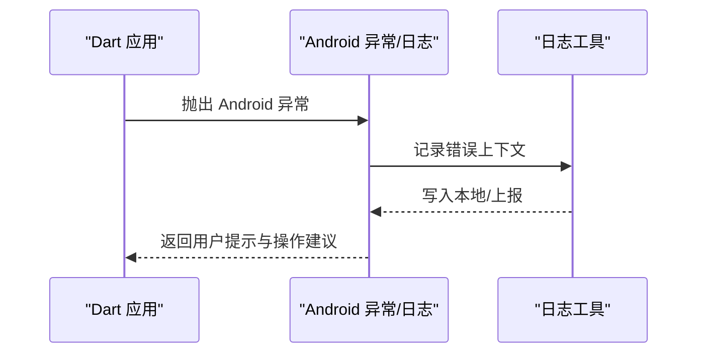
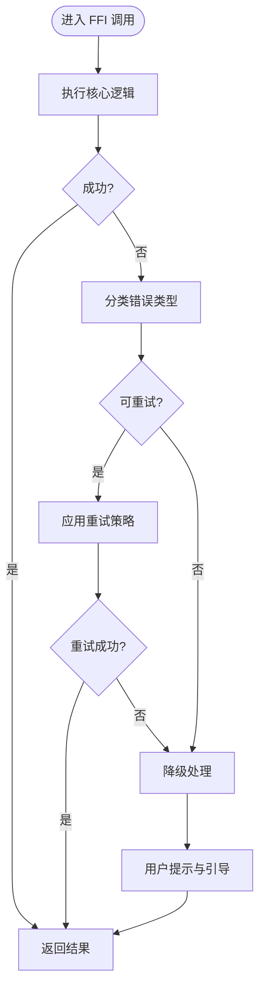
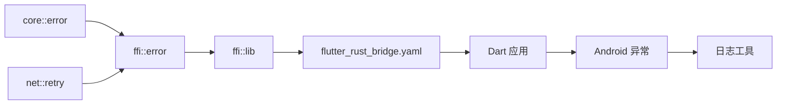

# 错误处理机制

<cite>
**本文引用的文件**   
- [rust/legado-core/src/error.rs](file://rust/legado-core/src/error.rs)
- [rust/legado-ffi/src/error.rs](file://rust/legado-ffi/src/error.rs)
- [rust/legado-ffi/src/lib.rs](file://rust/legado-ffi/src/lib.rs)
- [rust/legado-net/src/retry.rs](file://rust/legado-net/src/retry.rs)
- [flutter_legado/flutter_rust_bridge.yaml](file://flutter_legado/flutter_rust_bridge.yaml)
- [app/src/main/java/io/legado/app/exception/NetworkException.kt](file://app/src/main/java/io/legado/app/exception/NetworkException.kt)
- [app/src/main/java/io/legado/app/utils/LogUtils.java](file://app/src/main/java/io/legado/app/utils/LogUtils.java)
</cite>

## 目录
1. [简介](#简介)
2. [项目结构](#项目结构)
3. [核心组件](#核心组件)
4. [架构总览](#架构总览)
5. [详细组件分析](#详细组件分析)
6. [依赖关系分析](#依赖关系分析)
7. [性能考虑](#性能考虑)
8. [故障排查指南](#故障排查指南)
9. [结论](#结论)
10. [附录](#附录)

## 简介
本文件聚焦于 Legado 项目中 FFI（Rust ↔ Dart/Android）的错误处理机制，系统性阐述 Rust 错误类型到 Dart 异常的映射规则、自定义错误的处理方式、异常传播与栈跟踪保留策略、错误恢复（重试、降级、用户提示）、日志记录与调试信息收集方法，并提供完整示例与最佳实践。目标是帮助开发者在跨语言边界上构建稳定、可观测且用户体验友好的错误处理体系。

## 项目结构
Legado 的 FFI 错误处理涉及以下关键位置：
- Rust 侧核心错误定义与通用工具
- FFI 桥接层对错误的统一封装与转换
- Flutter/Rust Bridge 配置（用于生成绑定与异常映射）
- Android 侧异常类型与日志工具

**图表来源** 
- [rust/legado-core/src/error.rs](file://rust/legado-core/src/error.rs)
- [rust/legado-net/src/retry.rs](file://rust/legado-net/src/retry.rs)
- [rust/legado-ffi/src/error.rs](file://rust/legado-ffi/src/error.rs)
- [rust/legado-ffi/src/lib.rs](file://rust/legado-ffi/src/lib.rs)
- [flutter_legado/flutter_rust_bridge.yaml](file://flutter_legado/flutter_rust_bridge.yaml)
- [app/src/main/java/io/legado/app/exception/NetworkException.kt](file://app/src/main/java/io/legado/app/exception/NetworkException.kt)
- [app/src/main/java/io/legado/app/utils/LogUtils.java](file://app/src/main/java/io/legado/app/utils/LogUtils.java)

**章节来源**
- [rust/legado-core/src/error.rs](file://rust/legado-core/src/error.rs)
- [rust/legado-ffi/src/error.rs](file://rust/legado-ffi/src/error.rs)
- [rust/legado-ffi/src/lib.rs](file://rust/legado-ffi/src/lib.rs)
- [flutter_legado/flutter_rust_bridge.yaml](file://flutter_legado/flutter_rust_bridge.yaml)
- [app/src/main/java/io/legado/app/exception/NetworkException.kt](file://app/src/main/java/io/legado/app/exception/NetworkException.kt)
- [app/src/main/java/io/legado/app/utils/LogUtils.java](file://app/src/main/java/io/legado/app/utils/LogUtils.java)

## 核心组件
- Rust 核心错误模型：集中定义领域错误枚举与错误链，便于跨模块复用与语义化表达。
- FFI 错误封装：将 Rust 错误转换为 FFI 安全的数据结构或字符串描述，确保跨语言传递时不崩溃。
- Flutter/Rust Bridge 配置：通过 flutter_rust_bridge 声明异常映射，使 Dart 侧能按类型捕获并格式化错误。
- Android 异常与日志：将 Dart 层异常进一步转译为 Android 异常类型，并通过日志工具持久化与上报。

**章节来源**
- [rust/legado-core/src/error.rs](file://rust/legado-core/src/error.rs)
- [rust/legado-ffi/src/error.rs](file://rust/legado-ffi/src/error.rs)
- [rust/legado-ffi/src/lib.rs](file://rust/legado-ffi/src/lib.rs)
- [flutter_legado/flutter_rust_bridge.yaml](file://flutter_legado/flutter_rust_bridge.yaml)
- [app/src/main/java/io/legado/app/exception/NetworkException.kt](file://app/src/main/java/io/legado/app/exception/NetworkException.kt)
- [app/src/main/java/io/legado/app/utils/LogUtils.java](file://app/src/main/java/io/legado/app/utils/LogUtils.java)

## 架构总览
下图展示了从 Rust 调用到 Dart/Android 的错误传播路径，包括重试与降级策略的介入点。

**图表来源** 
- [rust/legado-core/src/error.rs](file://rust/legado-core/src/error.rs)
- [rust/legado-net/src/retry.rs](file://rust/legado-net/src/retry.rs)
- [rust/legado-ffi/src/error.rs](file://rust/legado-ffi/src/error.rs)
- [rust/legado-ffi/src/lib.rs](file://rust/legado-ffi/src/lib.rs)
- [flutter_legado/flutter_rust_bridge.yaml](file://flutter_legado/flutter_rust_bridge.yaml)
- [app/src/main/java/io/legado/app/exception/NetworkException.kt](file://app/src/main/java/io/legado/app/exception/NetworkException.kt)
- [app/src/main/java/io/legado/app/utils/LogUtils.java](file://app/src/main/java/io/legado/app/utils/LogUtils.java)

## 详细组件分析

### Rust 核心错误模型
- 设计要点
  - 使用枚举表达领域错误，包含上下文信息（如请求 ID、HTTP 状态码、错误码等）。
  - 支持错误链与原因追溯，便于上层进行差异化处理。
  - 提供 From/Into 实现以与其他错误类型互操作。
- 复杂度与性能
  - 错误枚举构造为 O(1)，携带少量元数据；避免在大对象中复制错误。
  - 错误链仅在需要时展开，减少序列化开销。
- 优化建议
  - 对频繁发生的错误采用轻量级错误类型，降低分配。
  - 使用静态错误码与本地化键值分离，避免重复字符串分配。

**章节来源**
- [rust/legado-core/src/error.rs](file://rust/legado-core/src/error.rs)

### FFI 错误封装与转换
- 设计要点
  - 所有 FFI 导出函数必须返回“可序列化”的结果或错误描述，禁止跨边界泄露未处理异常。
  - 将 Rust 错误转换为统一的 FFI 错误结构（含错误码、消息、堆栈摘要），供 Dart 侧捕获。
  - 对自定义错误进行白名单映射，限制可暴露字段，防止敏感信息泄漏。
- 异常传播与栈跟踪
  - 在 FFI 层捕获并格式化栈跟踪片段，附加到错误结构中；避免长堆栈影响性能。
  - 根据错误类别决定是否保留完整堆栈（仅调试模式）。
- 自定义错误处理
  - 通过 flutter_rust_bridge 配置声明 Dart 异常类型与 Rust 错误枚举的映射关系。
  - 在 FFI 层做类型判别与字段过滤，确保 Dart 侧能正确实例化异常。

**图表来源** 
- [rust/legado-ffi/src/error.rs](file://rust/legado-ffi/src/error.rs)
- [rust/legado-core/src/error.rs](file://rust/legado-core/src/error.rs)
- [rust/legado-net/src/retry.rs](file://rust/legado-net/src/retry.rs)

**章节来源**
- [rust/legado-ffi/src/error.rs](file://rust/legado-ffi/src/error.rs)
- [rust/legado-core/src/error.rs](file://rust/legado-core/src/error.rs)
- [rust/legado-net/src/retry.rs](file://rust/legado-net/src/retry.rs)

### Flutter/Rust Bridge 异常映射配置
- 设计要点
  - 在 flutter_rust_bridge.yaml 中声明 Rust 错误枚举与 Dart 异常类的映射。
  - 指定字段映射与命名转换规则，保证 Dart 侧异常属性一致。
  - 启用“严格模式”以避免未声明映射导致的运行时异常。
- 使用流程
  - 生成代码时将 Rust 错误转换为 Dart 异常类型。
  - Dart 侧通过 try/catch 捕获具体异常类型，进行差异化处理。

**图表来源** 
- [flutter_legado/flutter_rust_bridge.yaml](file://flutter_legado/flutter_rust_bridge.yaml)

**章节来源**
- [flutter_legado/flutter_rust_bridge.yaml](file://flutter_legado/flutter_rust_bridge.yaml)

### Android 异常与日志集成
- 设计要点
  - Dart 异常被转译为 Android 异常类型（如 NetworkException），便于原生层统一处理。
  - 日志工具记录错误上下文（时间戳、线程、设备信息、错误码、消息片段）。
  - 可选上报至远程日志服务，附带脱敏后的堆栈摘要。
- 用户体验优化
  - 对用户可见的错误提供友好提示与操作建议（重试、切换网络、检查权限）。
  - 对不可恢复错误提供反馈入口，引导用户提交问题报告。

**图表来源** 
- [app/src/main/java/io/legado/app/exception/NetworkException.kt](file://app/src/main/java/io/legado/app/exception/NetworkException.kt)
- [app/src/main/java/io/legado/app/utils/LogUtils.java](file://app/src/main/java/io/legado/app/utils/LogUtils.java)

**章节来源**
- [app/src/main/java/io/legado/app/exception/NetworkException.kt](file://app/src/main/java/io/legado/app/exception/NetworkException.kt)
- [app/src/main/java/io/legado/app/utils/LogUtils.java](file://app/src/main/java/io/legado/app/utils/LogUtils.java)

### 错误恢复策略（重试、降级、用户提示）
- 重试机制
  - 基于指数退避与最大尝试次数，针对网络超时、限流等可恢复错误自动重试。
  - 区分“幂等”与“非幂等”操作，避免副作用放大。
- 降级处理
  - 当核心功能不可用时，返回缓存或简化版本数据，保障基本可用性。
  - 对 UI 层提供占位内容与加载态，提升感知流畅度。
- 用户提示
  - 根据错误类别给出明确提示与操作按钮（重试、设置、反馈）。
  - 避免重复弹窗，合并同类错误提示。

**图表来源** 
- [rust/legado-net/src/retry.rs](file://rust/legado-net/src/retry.rs)
- [rust/legado-ffi/src/error.rs](file://rust/legado-ffi/src/error.rs)

**章节来源**
- [rust/legado-net/src/retry.rs](file://rust/legado-net/src/retry.rs)
- [rust/legado-ffi/src/error.rs](file://rust/legado-ffi/src/error.rs)

## 依赖关系分析
- 耦合与内聚
  - Rust 核心错误模块高内聚，对外暴露稳定的错误枚举与转换接口。
  - FFI 错误封装低耦合，仅依赖核心错误与重试策略，便于替换与扩展。
- 外部依赖
  - Flutter/Rust Bridge 配置驱动 Dart 异常生成，需保持与 Rust 错误枚举同步。
  - Android 异常与日志工具作为下游消费者，需兼容不同平台特性。
- 循环依赖
  - 通过分层与接口隔离避免循环依赖；错误类型单向流向 FFI 与上层。

**图表来源** 
- [rust/legado-core/src/error.rs](file://rust/legado-core/src/error.rs)
- [rust/legado-net/src/retry.rs](file://rust/legado-net/src/retry.rs)
- [rust/legado-ffi/src/error.rs](file://rust/legado-ffi/src/error.rs)
- [rust/legado-ffi/src/lib.rs](file://rust/legado-ffi/src/lib.rs)
- [flutter_legado/flutter_rust_bridge.yaml](file://flutter_legado/flutter_rust_bridge.yaml)
- [app/src/main/java/io/legado/app/exception/NetworkException.kt](file://app/src/main/java/io/legado/app/exception/NetworkException.kt)
- [app/src/main/java/io/legado/app/utils/LogUtils.java](file://app/src/main/java/io/legado/app/utils/LogUtils.java)

**章节来源**
- [rust/legado-core/src/error.rs](file://rust/legado-core/src/error.rs)
- [rust/legado-net/src/retry.rs](file://rust/legado-net/src/retry.rs)
- [rust/legado-ffi/src/error.rs](file://rust/legado-ffi/src/error.rs)
- [rust/legado-ffi/src/lib.rs](file://rust/legado-ffi/src/lib.rs)
- [flutter_legado/flutter_rust_bridge.yaml](file://flutter_legado/flutter_rust_bridge.yaml)
- [app/src/main/java/io/legado/app/exception/NetworkException.kt](file://app/src/main/java/io/legado/app/exception/NetworkException.kt)
- [app/src/main/java/io/legado/app/utils/LogUtils.java](file://app/src/main/java/io/legado/app/utils/LogUtils.java)

## 性能考虑
- 错误对象大小与分配
  - 控制错误结构体大小，避免携带大对象；必要时使用引用或延迟加载。
  - 在高频路径上使用轻量错误类型，减少 GC 压力。
- 栈跟踪成本
  - 仅在调试或关键错误时收集完整堆栈；发布版仅保留摘要。
  - 对堆栈信息进行压缩与去重，降低序列化与传输开销。
- 重试与背压
  - 合理设置重试上限与退避间隔，避免雪崩效应。
  - 结合速率限制与熔断策略，保护后端资源。
- 日志与上报
  - 异步写入日志，避免阻塞主流程。
  - 对日志内容进行脱敏与采样，控制存储与带宽占用。

[本节为通用指导，无需特定文件来源]

## 故障排查指南
- 常见问题定位
  - 确认 flutter_rust_bridge.yaml 中的错误映射是否完整，缺失映射会导致 Dart 侧无法正确捕获异常。
  - 检查 FFI 层是否正确将 Rust 错误转换为 FFI 安全结构，避免跨边界崩溃。
  - 验证 Android 异常类型与日志记录是否包含必要上下文（错误码、消息、时间戳）。
- 调试技巧
  - 开启 Rust 调试模式以保留更详细的堆栈信息。
  - 在 FFI 层增加结构化日志，记录输入参数与中间状态。
  - 使用 Android 日志工具聚合错误事件，便于离线分析与复现。
- 恢复与回滚
  - 对非幂等操作，失败时应回滚已变更状态，保证一致性。
  - 提供用户可操作的恢复步骤（重试、切换网络、清除缓存）。

**章节来源**
- [flutter_legado/flutter_rust_bridge.yaml](file://flutter_legado/flutter_rust_bridge.yaml)
- [rust/legado-ffi/src/error.rs](file://rust/legado-ffi/src/error.rs)
- [app/src/main/java/io/legado/app/utils/LogUtils.java](file://app/src/main/java/io/legado/app/utils/LogUtils.java)

## 结论
Legado 的 FFI 错误处理通过分层设计与统一封装，实现了从 Rust 核心错误到 Dart/Android 异常的可靠映射与传播。借助 flutter_rust_bridge 的配置化映射、FFI 层的错误安全转换、以及 Android 侧的异常与日志集成，系统在稳定性、可观测性与用户体验方面取得了良好平衡。配合合理的重试、降级与用户提示策略，能够在复杂网络与资源受限环境下提供稳健的服务体验。

[本节为总结性内容，无需特定文件来源]

## 附录
- 最佳实践清单
  - 始终在 FFI 边界捕获并转换错误，禁止未处理异常跨语言传播。
  - 使用 flutter_rust_bridge 显式声明错误映射，保持 Rust 与 Dart 类型同步。
  - 对敏感信息脱敏后再记录与上报，遵循隐私与安全规范。
  - 为可恢复错误提供重试与降级路径，提升系统韧性。
  - 对用户可见错误提供清晰提示与操作建议，改善交互体验。
- 参考实现路径
  - Rust 核心错误定义：[rust/legado-core/src/error.rs](file://rust/legado-core/src/error.rs)
  - FFI 错误封装与转换：[rust/legado-ffi/src/error.rs](file://rust/legado-ffi/src/error.rs)
  - 网络重试策略：[rust/legado-net/src/retry.rs](file://rust/legado-net/src/retry.rs)
  - Flutter/Rust Bridge 配置：[flutter_legado/flutter_rust_bridge.yaml](file://flutter_legado/flutter_rust_bridge.yaml)
  - Android 异常与日志：[app/src/main/java/io/legado/app/exception/NetworkException.kt](file://app/src/main/java/io/legado/app/exception/NetworkException.kt)、[app/src/main/java/io/legado/app/utils/LogUtils.java](file://app/src/main/java/io/legado/app/utils/LogUtils.java)