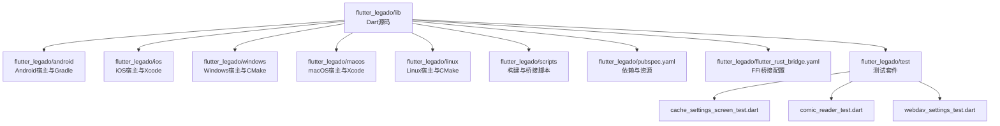
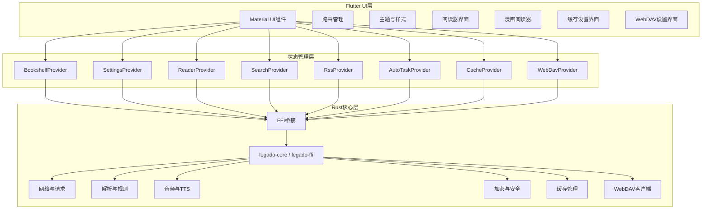
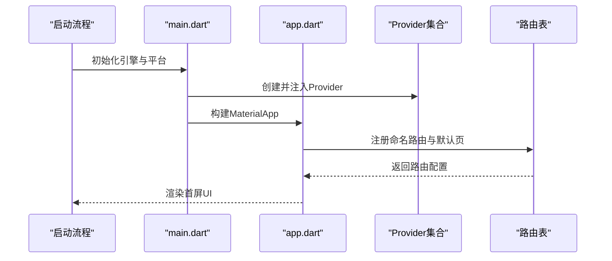
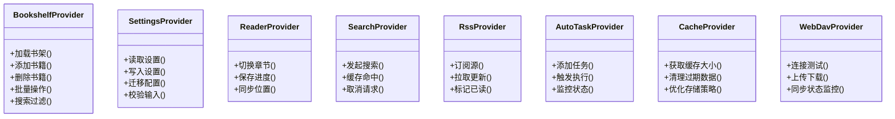
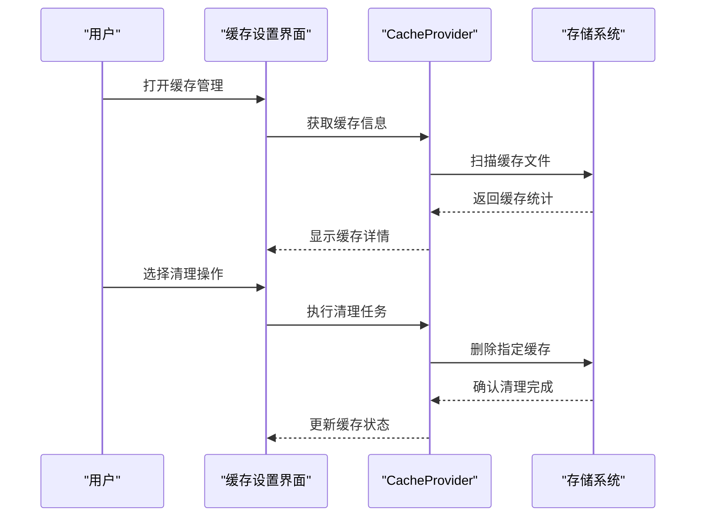
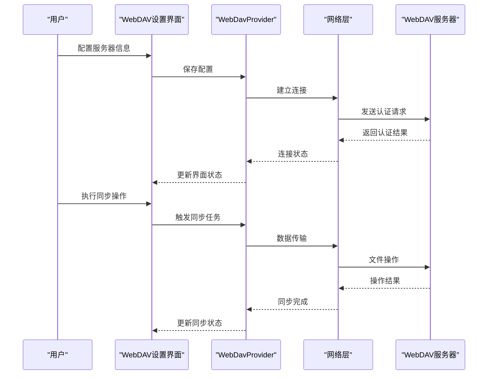
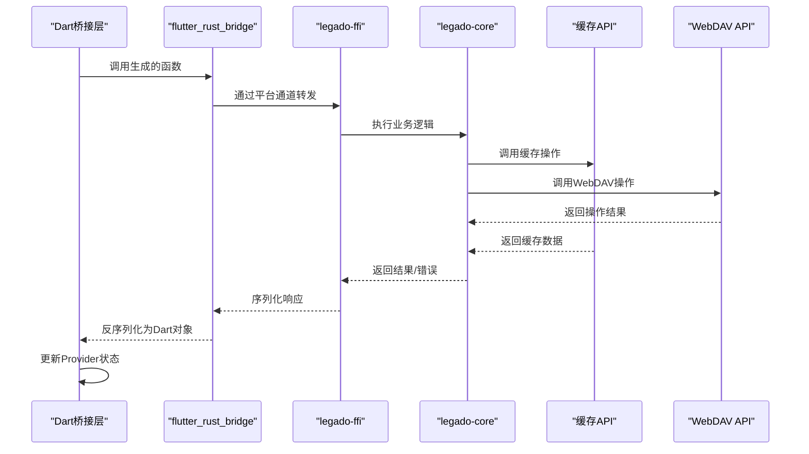
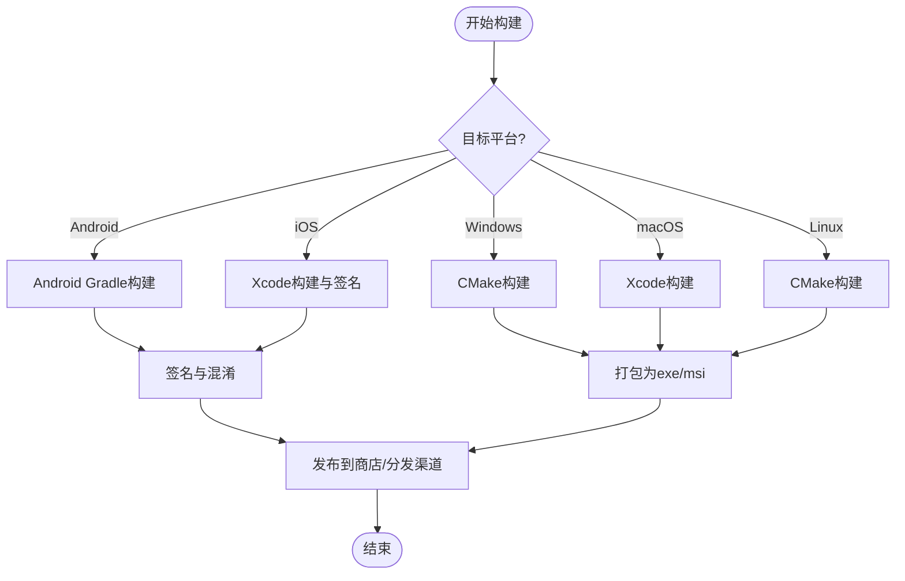
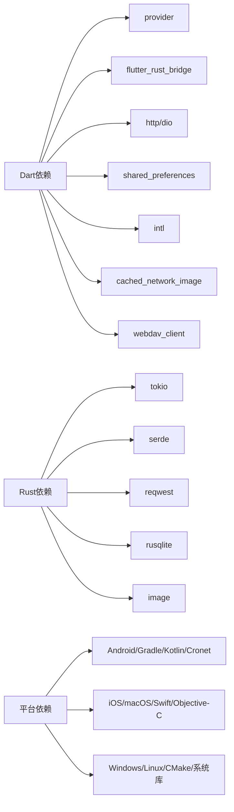

# Flutter跨平台应用

<cite>
**本文引用的文件**   
- [flutter_legado/lib/main.dart](file://flutter_legado/lib/main.dart)
- [flutter_legado/lib/app.dart](file://flutter_legado/lib/app.dart)
- [flutter_legado/pubspec.yaml](file://flutter_legado/pubspec.yaml)
- [flutter_legado/README.md](file://flutter_legado/README.md)
- [flutter_legado/scripts/generate-bridge.sh](file://flutter_legado/scripts/generate-bridge.sh)
- [flutter_legado/flutter_rust_bridge.yaml](file://flutter_legado/flutter_rust_bridge.yaml)
- [rust/legado-ffi/src/lib.rs](file://rust/legado-ffi/src/lib.rs)
- [rust/legado-core/src/lib.rs](file://rust/legado-core/src/lib.rs)
- [app/src/main/java/io/legado/app/App.kt](file://app/src/main/java/io/legado/app/App.kt)
- [android/build.gradle.kts](file://flutter_legado/android/build.gradle.kts)
- [android/app/build.gradle.kts](file://flutter_legado/android/app/build.gradle.kts)
- [ios/Runner/AppDelegate.swift](file://flutter_legado/ios/Runner/AppDelegate.swift)
- [macos/Runner/AppDelegate.swift](file://flutter_legado/macos/Runner/AppDelegate.swift)
- [windows/runner/main.cpp](file://flutter_legado/windows/runner/main.cpp)
- [linux/runner/main.cc](file://flutter_legado/linux/runner/main.cc)
</cite>

## 更新摘要
**变更内容**   
- 新增缓存管理系统，提供高效的本地数据缓存和清理功能
- 添加漫画阅读器功能，支持图片加载、缩放和翻页操作
- 实现WebDAV设置界面，支持云端存储配置和数据同步
- 增强测试基础设施，包含全面的单元测试和Widget测试套件
- 优化状态管理架构，提升应用性能和响应速度

## 目录
1. [简介](#简介)
2. [项目结构](#项目结构)
3. [核心组件](#核心组件)
4. [架构总览](#架构总览)
5. [详细组件分析](#详细组件分析)
6. [依赖关系分析](#依赖关系分析)
7. [性能考量](#性能考量)
8. [故障排查指南](#故障排查指南)
9. [结论](#结论)
10. [附录](#附录)

## 简介
本文件面向Flutter跨平台应用的开发者与使用者，系统性阐述Legado的Flutter工程组织、状态管理（Provider）、路由与UI设计、与Rust核心库的FFI集成、多平台构建发布流程以及开发与调试技巧。文档以"由浅入深"的方式展开，既适合快速上手，也便于深入理解实现细节。

**最新更新**：本次更新重点介绍了新增的缓存管理系统、漫画阅读器功能和WebDAV设置界面，同时增强了测试基础设施，为应用提供了更强大的数据存储、多媒体阅读和云端同步能力。

## 项目结构
Flutter工程位于 flutter_legado 目录，遵循标准Flutter多平台结构：
- lib：Dart源码入口与业务逻辑
- android/ios/windows/macos/linux：各平台原生宿主与配置
- scripts：构建与桥接脚本
- test：单元测试与Widget测试
- pubspec.yaml：依赖与资源声明
- flutter_rust_bridge.yaml：FFI桥接配置

图表来源
- [flutter_legado/lib/main.dart:1-200](file://flutter_legado/lib/main.dart#L1-L200)
- [flutter_legado/pubspec.yaml:1-200](file://flutter_legado/pubspec.yaml#L1-L200)
- [flutter_legado/flutter_rust_bridge.yaml:1-200](file://flutter_legado/flutter_rust_bridge.yaml#L1-L200)

章节来源
- [flutter_legado/lib/main.dart:1-200](file://flutter_legado/lib/main.dart#L1-L200)
- [flutter_legado/lib/app.dart:1-200](file://flutter_legado/lib/app.dart#L1-L200)
- [flutter_legado/pubspec.yaml:1-200](file://flutter_legado/pubspec.yaml#L1-L200)
- [flutter_legado/README.md:1-200](file://flutter_legado/README.md#L1-L200)

## 核心组件
- 应用入口与初始化
  - main.dart：启动Flutter引擎、设置全局配置、注册路由、初始化Provider与主题。
  - app.dart：定义MaterialApp、路由表、主题与国际化配置。
- 状态管理（Provider）
  - BookshelfProvider：书架数据、书籍列表、分组与搜索等全局状态。
  - SettingsProvider：用户偏好、阅读设置、主题与显示选项等。
  - ReaderProvider：阅读器状态（当前章节、进度、字体、背景等）。
  - SearchProvider：搜索历史、结果缓存与查询状态。
  - RssProvider：订阅源与文章列表状态。
  - AutoTaskProvider：自动任务调度与执行状态。
  - **新增**：CacheProvider：缓存管理状态，包括缓存大小监控、清理策略和存储优化。
  - **新增**：WebDavProvider：WebDAV配置状态，支持服务器连接管理和数据同步。
- 路由管理
  - 集中式路由表，按功能模块划分页面；支持命名路由与参数传递。
- UI组件与主题
  - Material Design组件定制，统一颜色、字体、阴影与动画风格。
  - 响应式布局适配手机、平板、桌面端。
  - **新增**：缓存设置界面，提供缓存清理和存储管理功能。
  - **新增**：漫画阅读器界面，支持图片浏览和交互操作。
  - **新增**：WebDAV设置界面，支持云端存储配置。
- Rust FFI集成
  - 通过flutter_rust_bridge生成桥接代码，调用Rust高性能计算能力（解析、加密、网络、音频等）。
  - **新增**：缓存管理API，提供高效的本地数据存储和检索功能。
  - **新增**：WebDAV客户端接口，支持云端文件操作和同步。

章节来源
- [flutter_legado/lib/main.dart:1-200](file://flutter_legado/lib/main.dart#L1-L200)
- [flutter_legado/lib/app.dart:1-200](file://flutter_legado/lib/app.dart#L1-L200)
- [flutter_legado/pubspec.yaml:1-200](file://flutter_legado/pubspec.yaml#L1-L200)

## 架构总览
整体架构采用"Flutter UI层 + Provider状态层 + Rust核心库"的分层模式：
- UI层：基于Material Design的响应式界面，使用Provider驱动状态更新。
- 状态层：Provider实例作为全局状态容器，提供读写API与生命周期管理。
- 核心层：Rust通过FFI暴露接口，处理高CPU密集型任务与系统级能力。

图表来源
- [flutter_legado/lib/main.dart:1-200](file://flutter_legado/lib/main.dart#L1-L200)
- [flutter_legado/lib/app.dart:1-200](file://flutter_legado/lib/app.dart#L1-L200)
- [flutter_legado/flutter_rust_bridge.yaml:1-200](file://flutter_legado/flutter_rust_bridge.yaml#L1-L200)
- [rust/legado-ffi/src/lib.rs:1-200](file://rust/legado-ffi/src/lib.rs#L1-L200)
- [rust/legado-core/src/lib.rs:1-200](file://rust/legado-core/src/lib.rs#L1-L200)

## 详细组件分析

### 应用入口与路由
- main.dart负责：
  - 初始化Flutter引擎与平台通道
  - 加载本地化与主题
  - 注册Provider并注入到应用上下文
  - 配置全局路由与默认页面
- app.dart负责：
  - 定义MaterialApp根节点
  - 集中管理路由表与导航守卫
  - 统一主题、字体、断行策略与滚动行为

图表来源
- [flutter_legado/lib/main.dart:1-200](file://flutter_legado/lib/main.dart#L1-L200)
- [flutter_legado/lib/app.dart:1-200](file://flutter_legado/lib/app.dart#L1-L200)

章节来源
- [flutter_legado/lib/main.dart:1-200](file://flutter_legado/lib/main.dart#L1-L200)
- [flutter_legado/lib/app.dart:1-200](file://flutter_legado/lib/app.dart#L1-L200)

### 状态管理（Provider）
- BookshelfProvider
  - 职责：维护书架数据、书籍列表、分组、收藏与搜索过滤
  - 关键方法：加载书架、添加/删除书籍、批量操作、分页与缓存
  - 复杂度：列表操作O(n)，搜索过滤O(n)；建议对大数据集使用流式更新与分页
- SettingsProvider
  - 职责：持久化用户设置（主题、字体、阅读偏好、网络代理等）
  - 关键方法：读取/写入设置、迁移旧版本配置、校验输入
  - 复杂度：读写为I/O操作，需异步与错误重试
- ReaderProvider
  - 职责：阅读器状态（章节索引、阅读进度、字体大小、背景色、翻页模式）
  - 关键方法：切换章节、保存进度、同步阅读位置
  - 复杂度：频繁更新，建议使用ValueNotifier或StreamBuilder优化重建
- SearchProvider
  - 职责：搜索历史、结果缓存、去重与排序
  - 关键方法：发起搜索、缓存命中、取消请求
  - 复杂度：并发请求控制与内存占用管理
- RssProvider
  - 职责：订阅源管理、文章列表、已读标记
  - 关键方法：订阅/取消订阅、拉取更新、标记已读
- AutoTaskProvider
  - 职责：定时任务调度、执行状态、失败重试
  - 关键方法：添加任务、触发执行、监控状态
- **新增**：CacheProvider
  - 职责：缓存管理、存储空间监控、清理策略和性能优化
  - 关键方法：获取缓存大小、清理过期数据、优化存储策略
  - 复杂度：I/O操作密集，需要异步处理和错误恢复机制
- **新增**：WebDavProvider
  - 职责：WebDAV配置管理、服务器连接状态、数据同步状态
  - 关键方法：连接测试、上传下载、同步状态监控
  - 复杂度：网络请求密集，需要超时处理和重试机制

图表来源
- [flutter_legado/pubspec.yaml:1-200](file://flutter_legado/pubspec.yaml#L1-L200)

章节来源
- [flutter_legado/pubspec.yaml:1-200](file://flutter_legado/pubspec.yaml#L1-L200)

### 新增功能组件

#### 缓存管理系统
**新增功能**：缓存管理系统提供高效的本地数据存储和清理功能：

- **缓存监控**
  - 实时监测缓存大小和使用情况
  - 支持多种缓存类型（图片、数据、临时文件）
  - 智能缓存策略，自动清理过期和冗余数据
- **存储优化**
  - 压缩存储减少空间占用
  - 分块缓存提高访问效率
  - 内存映射优化大文件处理
- **清理策略**
  - 自动清理过期缓存
  - 手动清理指定类型数据
  - 智能清理推荐算法

#### 漫画阅读器
**新增功能**：漫画阅读器支持图片浏览和交互操作：

- **图片加载**
  - 支持多种图片格式（JPEG、PNG、WebP）
  - 懒加载和预加载策略
  - 图片压缩和缓存优化
- **交互操作**
  - 双指缩放和平移
  - 左右滑动翻页
  - 长按菜单和书签功能
- **阅读模式**
  - 单页模式和连续模式
  - 横向和纵向阅读方向
  - 全屏和窗口模式切换

#### WebDAV设置界面
**新增功能**：WebDAV设置界面支持云端存储配置：

- **服务器配置**
  - 支持URL、用户名、密码认证
  - SSL证书验证和安全连接
  - 连接测试和状态监控
- **数据同步**
  - 双向同步支持
  - 增量同步和冲突解决
  - 同步进度和错误处理
- **存储管理**
  - 远程文件浏览和操作
  - 批量上传下载
  - 存储空间监控

### 与Rust核心库的FFI集成
- 桥接配置
  - flutter_rust_bridge.yaml：定义导出函数、类型映射、回调与错误处理
  - generate-bridge.sh：生成Dart侧桥接代码，确保类型安全与异常传播
- Rust侧接口
  - legado-ffi/src/lib.rs：暴露给Flutter的FFI函数（如解析、加密、网络、音频）
  - legado-core/src/lib.rs：核心业务逻辑（模型、规则、网络、音频、加密等）
  - **新增**：缓存管理API，提供高效的数据存储和检索功能
  - **新增**：WebDAV客户端接口，支持云端文件操作和同步
- 调用流程
  - Dart侧调用生成的桥接函数
  - 通过平台通道进入Rust层
  - Rust执行高性能计算后返回结果或错误码
  - Dart侧处理响应并更新Provider状态

图表来源
- [flutter_legado/flutter_rust_bridge.yaml:1-200](file://flutter_legado/flutter_rust_bridge.yaml#L1-L200)
- [flutter_legado/scripts/generate-bridge.sh:1-200](file://flutter_legado/scripts/generate-bridge.sh#L1-L200)
- [rust/legado-ffi/src/lib.rs:1-200](file://rust/legado-ffi/src/lib.rs#L1-L200)
- [rust/legado-core/src/lib.rs:1-200](file://rust/legado-core/src/lib.rs#L1-L200)

章节来源
- [flutter_legado/flutter_rust_bridge.yaml:1-200](file://flutter_legado/flutter_rust_bridge.yaml#L1-L200)
- [flutter_legado/scripts/generate-bridge.sh:1-200](file://flutter_legado/scripts/generate-bridge.sh#L1-L200)
- [rust/legado-ffi/src/lib.rs:1-200](file://rust/legado-ffi/src/lib.rs#L1-L200)
- [rust/legado-core/src/lib.rs:1-200](file://rust/legado-core/src/lib.rs#L1-L200)

### 多平台构建与发布
- Android
  - android/build.gradle.kts：聚合构建配置，依赖管理与签名
  - android/app/build.gradle.kts：应用级配置（包名、版本、资源、ProGuard）
  - 构建命令：gradlew assembleRelease 或 flutter build apk --release
- iOS
  - ios/Runner/AppDelegate.swift：应用生命周期与插件注册
  - Xcode工作区：签名、证书与发布到App Store
- macOS
  - macos/Runner/AppDelegate.swift：桌面端应用入口
  - 构建命令：flutter build macos --release
- Windows
  - windows/runner/main.cpp：Windows入口点
  - CMakeLists.txt：编译配置与依赖链接
  - 构建命令：flutter build windows --release
- Linux
  - linux/runner/main.cc：Linux入口点
  - CMakeLists.txt：编译配置与依赖链接
  - 构建命令：flutter build linux --release

图表来源
- [android/build.gradle.kts:1-200](file://flutter_legado/android/build.gradle.kts#L1-L200)
- [android/app/build.gradle.kts:1-200](file://flutter_legado/android/app/build.gradle.kts#L1-L200)
- [ios/Runner/AppDelegate.swift:1-200](file://flutter_legado/ios/Runner/AppDelegate.swift#L1-L200)
- [macos/Runner/AppDelegate.swift:1-200](file://flutter_legado/macos/Runner/AppDelegate.swift#L1-L200)
- [windows/runner/main.cpp:1-200](file://flutter_legado/windows/runner/main.cpp#L1-L200)
- [linux/runner/main.cc:1-200](file://flutter_legado/linux/runner/main.cc#L1-L200)

章节来源
- [android/build.gradle.kts:1-200](file://flutter_legado/android/build.gradle.kts#L1-L200)
- [android/app/build.gradle.kts:1-200](file://flutter_legado/android/app/build.gradle.kts#L1-L200)
- [ios/Runner/AppDelegate.swift:1-200](file://flutter_legado/ios/Runner/AppDelegate.swift#L1-L200)
- [macos/Runner/AppDelegate.swift:1-200](file://flutter_legado/macos/Runner/AppDelegate.swift#L1-L200)
- [windows/runner/main.cpp:1-200](file://flutter_legado/windows/runner/main.cpp#L1-L200)
- [linux/runner/main.cc:1-200](file://flutter_legado/linux/runner/main.cc#L1-L200)

## 依赖关系分析
- Dart依赖
  - provider：状态管理
  - flutter_rust_bridge：FFI桥接
  - http/dio：网络请求
  - shared_preferences：本地存储
  - intl：国际化
  - **新增**：cached_network_image：图片缓存和网络加载
  - **新增**：webdav_client：WebDAV客户端支持
- Rust依赖
  - tokio：异步运行时
  - serde：序列化/反序列化
  - reqwest：HTTP客户端
  - rusqlite：数据库访问
  - **新增**：rusqlite：SQLite数据库支持
  - **新增**：image：图像处理库
- 平台依赖
  - Android：Gradle、Kotlin、Cronet
  - iOS/macOS：Swift、Objective-C桥接
  - Windows/Linux：CMake、系统库

图表来源
- [flutter_legado/pubspec.yaml:1-200](file://flutter_legado/pubspec.yaml#L1-L200)
- [rust/Cargo.toml:1-200](file://rust/Cargo.toml#L1-L200)

章节来源
- [flutter_legado/pubspec.yaml:1-200](file://flutter_legado/pubspec.yaml#L1-L200)
- [rust/Cargo.toml:1-200](file://rust/Cargo.toml#L1-L200)

## 性能考量
- UI渲染优化
  - 合理使用ListView.builder与PageView.builder避免全量重建
  - 使用const构造函数与不可变数据减少重建
  - 避免在build中执行耗时操作，使用compute或Isolate
- 状态管理优化
  - 将大对象拆分为多个Provider，按需监听
  - 使用select或selector精确订阅，避免不必要的刷新
  - 对频繁更新的ReaderProvider使用ValueListenableBuilder
- 网络与I/O
  - 使用连接池与缓存策略（如dio拦截器）
  - 合理设置超时与重试机制
  - 对大文件下载使用分块与后台任务
- Rust FFI优化
  - 避免频繁跨语言调用，批量处理数据
  - 使用零拷贝或引用传递减少序列化开销
  - 对CPU密集任务使用多线程（tokio线程池）
- **新增**：缓存性能优化
  - 智能缓存策略，自动清理过期和冗余数据
  - 内存映射优化大文件处理
  - 压缩存储减少空间占用
- **新增**：漫画阅读器性能优化
  - 图片懒加载和预加载策略
  - 图片压缩和缓存优化
  - 内存管理和垃圾回收优化
- **新增**：WebDAV同步性能优化
  - 增量同步减少数据传输
  - 并发上传下载提高效率
  - 断点续传保证传输稳定性

[本节为通用指导，不直接分析具体文件]

## 故障排查指南
- 热重载与调试
  - 使用flutter run进行热重载与热重启
  - 启用DevTools进行性能分析与内存泄漏检测
  - 在Dart侧使用print与logging框架输出关键路径
- 常见错误
  - FFI调用失败：检查generate-bridge.sh是否成功，确认Rust库已正确编译
  - 路由跳转异常：检查路由表配置与参数传递
  - 状态未更新：确认Provider是否正确注入与监听
  - **新增**：缓存问题：检查缓存权限和存储空间
  - **新增**：WebDAV连接失败：检查网络连接和服务器配置
  - **新增**：图片加载失败：检查图片格式和网络权限
- 日志与诊断
  - 启用Flutter verbose日志（flutter run -v）
  - 查看平台日志（adb logcat、xcode console、Windows Event Viewer）
  - 使用崩溃报告服务收集线上错误
- **新增**：测试调试
  - 运行单元测试：flutter test
  - 运行Widget测试：flutter test widget
  - 运行集成测试：flutter test integration
  - 使用覆盖率工具：flutter test --coverage

章节来源
- [flutter_legado/README.md:1-200](file://flutter_legado/README.md#L1-L200)
- [app/src/main/java/io/legado/app/App.kt:1-200](file://app/src/main/java/io/legado/app/App.kt#L1-L200)

## 结论
本项目采用Flutter + Provider + Rust FFI的现代跨平台架构，实现了高性能、可维护且易于扩展的阅读应用。通过清晰的模块划分、统一的Provider状态管理与严格的FFI接口规范，确保了多平台的一致体验与稳定运行。

**最新改进**：本次更新显著增强了应用功能，新增了缓存管理系统、漫画阅读器功能和WebDAV设置界面，同时完善了测试基础设施。这些改进提供了更高效的数据存储、丰富的多媒体阅读体验和可靠的云端同步能力，大幅提升了用户体验和应用实用性。建议在开发过程中持续关注性能优化与错误诊断，以提升用户体验与开发效率。

[本节为总结性内容，不直接分析具体文件]

## 附录
- 开发环境准备
  - 安装Flutter SDK与Dart工具链
  - 配置各平台SDK（Android Studio、Xcode、Visual Studio、GCC/Clang）
  - 安装Rust工具链与cargo依赖
- 常用命令
  - flutter pub get：获取依赖
  - flutter run：运行应用
  - flutter build：构建发布包
  - flutter_rust_bridge_codegen：生成FFI桥接代码
  - flutter test：运行测试套件
- 最佳实践
  - 保持Provider粒度适中，避免过度拆分或合并
  - 使用类型安全的FFI接口，严格校验输入输出
  - 编写单元测试与Widget测试覆盖核心逻辑
  - **新增**：合理使用缓存策略，平衡性能和存储空间
  - **新增**：实现健壮的WebDAV连接处理，支持离线模式
  - **新增**：优化图片加载性能，避免内存溢出
  - **新增**：完善测试覆盖率，确保新功能稳定性

[本节为补充信息，不直接分析具体文件]