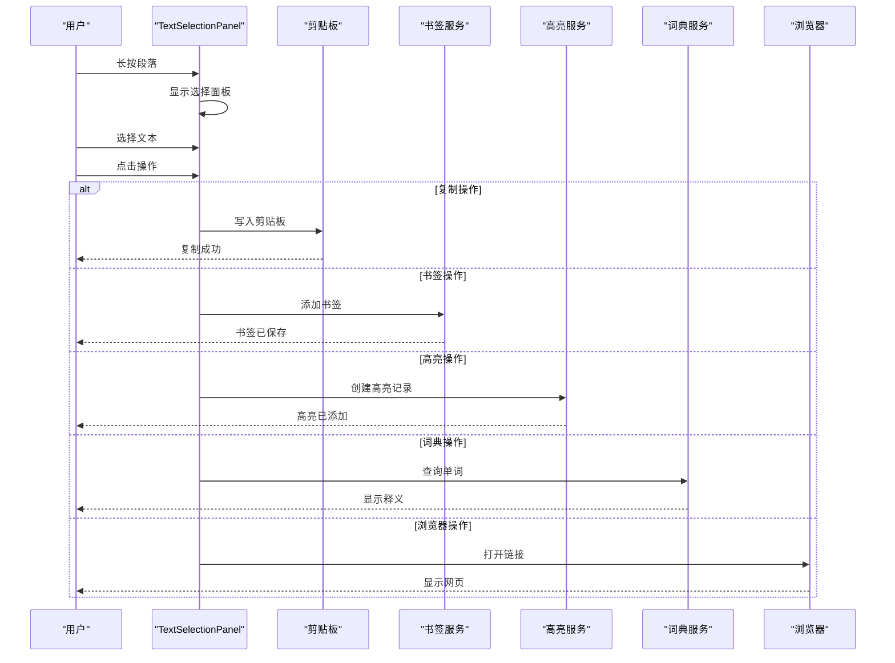
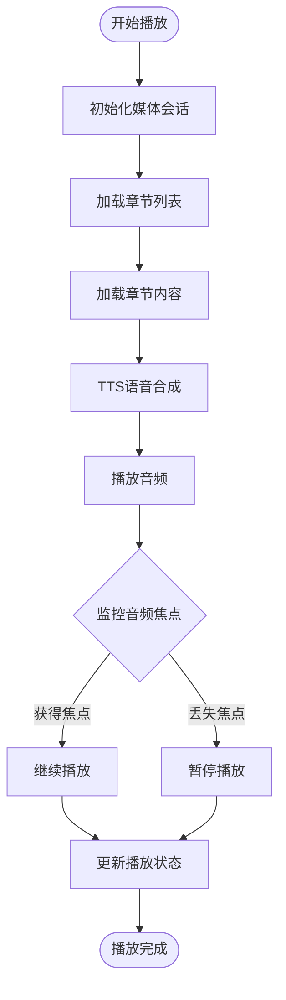
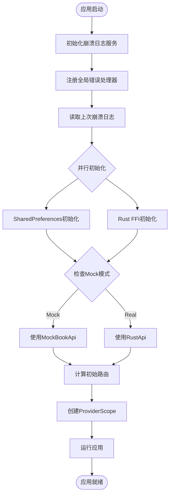
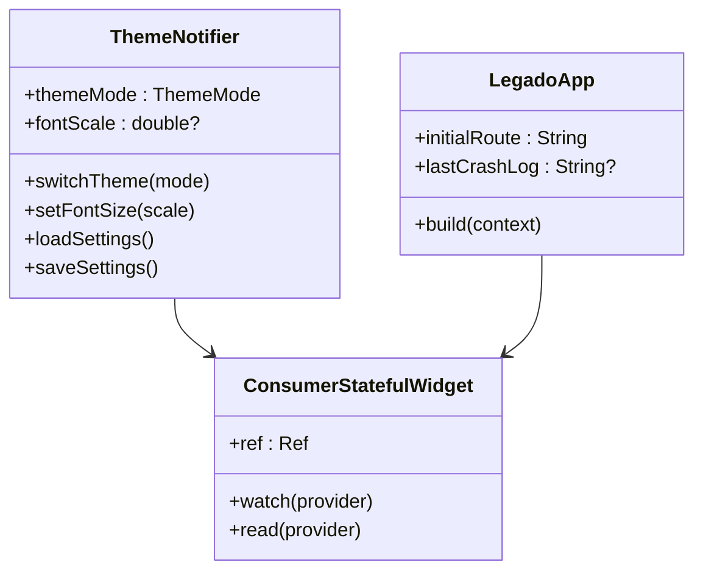
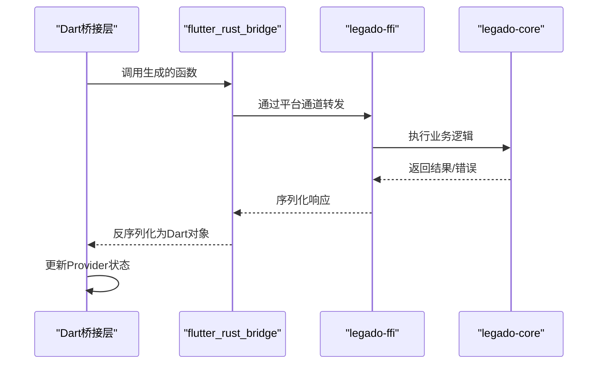
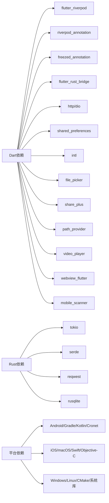

# Flutter跨平台应用

<cite>
**本文引用的文件**   
- [flutter_legado/lib/main.dart](file://flutter_legado/lib/main.dart)
- [flutter_legado/lib/app.dart](file://flutter_legado/lib/app.dart)
- [flutter_legado/pubspec.yaml](file://flutter_legado/pubspec.yaml)
- [flutter_legado/README.md](file://flutter_legado/README.md)
- [flutter_legado/flutter_rust_bridge.yaml](file://flutter_legado/flutter_rust_bridge.yaml)
- [rust/legado-ffi/src/lib.rs](file://rust/legado-ffi/src/lib.rs)
- [rust/legado-core/src/lib.rs](file://rust/legado-core/src/lib.rs)
- [flutter_legado/lib/src/models/rss_article.dart](file://flutter_legado/lib/src/models/rss_article.dart)
- [flutter_legado/lib/src/models/models.dart](file://flutter_legado/lib/src/models/models.dart)
- [flutter_legado/lib/src/services/rust_api.dart](file://flutter_legado/lib/src/services/rust_api.dart)
- [flutter_legado/lib/src/screens/rss_article_detail_screen.dart](file://flutter_legado/lib/src/screens/rss_article_detail_screen.dart)
- [flutter_legado/lib/src/screens/rss_articles_screen.dart](file://flutter_legado/lib/src/screens/rss_articles_screen.dart)
- [flutter_legado/lib/src/models/reading_stats_today.dart](file://flutter_legado/lib/src/models/reading_stats_today.dart)
- [flutter_legado/lib/src/models/search_result.dart](file://flutter_legado/lib/src/models/search_result.dart)
- [flutter_legado/lib/src/providers/reading_stats/reading_stats_notifier.dart](file://flutter_legado/lib/src/providers/reading_stats/reading_stats_notifier.dart)
- [flutter_legado/lib/src/providers/audio/audio_notifier.dart](file://flutter_legado/lib/src/providers/audio/audio_notifier.dart)
- [flutter_legado/lib/src/providers/audio/audio_state.dart](file://flutter_legado/lib/src/providers/audio/audio_state.dart)
- [flutter_legado/lib/src/screens/audio_screen.dart](file://flutter_legado/lib/src/screens/audio_screen.dart)
- [flutter_legado/lib/src/widgets/reader/text_selection_panel.dart](file://flutter_legado/lib/src/widgets/reader/text_selection_panel.dart)
- [flutter_legado/lib/src/widgets/reader/read_aloud_bar.dart](file://flutter_legado/lib/src/widgets/reader/read_aloud_bar.dart)
</cite>

## 更新摘要
**变更内容**   
- **版本升级至2.0.1+3**：应用版本号更新，包含重要的UI增强功能
- **文本选择功能实现**：新增阅读器正文长按选择功能，支持9项操作菜单（替换、复制、书签、高亮、朗读、词典、搜正文、浏览器、分享）
- **音频阅读能力增强**：完整的听书播放器实现，支持后台播放、媒体按钮控制、TTS配置管理
- **Riverpod状态管理优化**：AudioNotifier基于Riverpod重构，提供类型安全的状态管理
- **UI组件现代化**：Material Design组件定制，响应式布局适配多平台

## 目录
1. [简介](#简介)
2. [项目结构](#项目结构)
3. [核心组件](#核心组件)
4. [架构总览](#架构总览)
5. [详细组件分析](#详细组件分析)
6. [依赖关系分析](#依赖关系分析)
7. [性能考量](#性能考量)
8. [故障排查指南](#故障排查指南)
9. [结论](#结论)
10. [附录](#附录)

## 简介
本文件面向Flutter跨平台应用的开发者与使用者，系统性阐述Legado的Flutter工程组织、状态管理（Riverpod）、路由与UI设计、与Rust核心库的FFI集成、多平台构建发布流程以及开发与调试技巧。文档以"由浅入深"的方式展开，既适合快速上手，也便于深入理解实现细节。

**最新更新**：版本升级至2.0.1+3，重点实现了文本选择和音频阅读两大核心功能。文本选择功能提供长按段落后的9项操作菜单，包括替换、复制、书签、高亮、朗读、词典、搜正文、浏览器和分享功能。音频阅读功能实现了完整的听书播放器，支持后台播放、媒体按钮控制、TTS配置管理和章节导航。这些功能通过Riverpod状态管理进行统一协调，提供了流畅的用户体验。

## 项目结构
Flutter工程位于 flutter_legado 目录，遵循标准Flutter多平台结构：
- lib：Dart源码入口与业务逻辑，包含Riverpod状态管理和ConsumerStatefulWidget
- android/ios/windows/macos/linux：各平台原生宿主与配置
- scripts：构建与桥接脚本
- test：单元测试与Widget测试
- pubspec.yaml：依赖与资源声明，包含Riverpod相关依赖
- flutter_rust_bridge.yaml：FFI桥接配置

```mermaid
graph TB
A["flutter_legado/lib<br/>Dart源码与Riverpod集成"] --> B["flutter_legado/android<br/>Android宿主与Gradle"]
A --> C["flutter_legado/ios<br/>iOS宿主与Xcode"]
A --> D["flutter_legado/windows<br/>Windows宿主与CMake"]
A --> E["flutter_legado/macos<br/>macOS宿主与Xcode"]
A --> F["flutter_legado/linux<br/>Linux宿主与CMake"]
A --> G["flutter_legado/scripts<br/>构建与桥接脚本"]
A --> H["flutter_legado/pubspec.yaml<br/>依赖与Riverpod配置"]
A --> I["flutter_legado/flutter_rust_bridge.yaml<br/>FFI桥接配置"]
A --> J["flutter_legado/test<br/>测试套件"]
A --> K["main.dart<br/>Riverpod入口"]
A --> L["app.dart<br/>ConsumerStatefulWidget"]
A --> M["src/providers/<br/>状态管理层"]
A --> N["src/services/<br/>服务层"]
A --> O["src/models/<br/>数据模型层"]
A --> P["src/screens/<br/>页面组件"]
A --> Q["src/widgets/<br/>通用组件"]
O --> R["rss_article.dart<br/>RSS文章模型"]
O --> S["models.dart<br/>统一导出接口"]
O --> T["reading_stats_today.dart<br/>阅读统计模型"]
O --> U["search_result.dart<br/>搜索结果模型"]
P --> V["audio_screen.dart<br/>听书播放页面"]
Q --> W["text_selection_panel.dart<br/>文本选择面板"]
Q --> X["read_aloud_bar.dart<br/>朗读控制条"]
```

图表来源
- [flutter_legado/lib/main.dart:1-136](file://flutter_legado/lib/main.dart#L1-L136)
- [flutter_legado/lib/app.dart:1-71](file://flutter_legado/lib/app.dart#L1-L71)
- [flutter_legado/pubspec.yaml:1-53](file://flutter_legado/pubspec.yaml#L1-L53)
- [flutter_legado/flutter_rust_bridge.yaml:1-200](file://flutter_legado/flutter_rust_bridge.yaml#L1-L200)
- [flutter_legado/lib/src/models/models.dart:1-16](file://flutter_legado/lib/src/models/models.dart#L1-L16)
- [flutter_legado/lib/src/screens/audio_screen.dart:1-605](file://flutter_legado/lib/src/screens/audio_screen.dart#L1-L605)
- [flutter_legado/lib/src/widgets/reader/text_selection_panel.dart:1-430](file://flutter_legado/lib/src/widgets/reader/text_selection_panel.dart#L1-L430)
- [flutter_legado/lib/src/widgets/reader/read_aloud_bar.dart:1-265](file://flutter_legado/lib/src/widgets/reader/read_aloud_bar.dart#L1-L265)

章节来源
- [flutter_legado/lib/main.dart:1-136](file://flutter_legado/lib/main.dart#L1-L136)
- [flutter_legado/lib/app.dart:1-71](file://flutter_legado/lib/app.dart#L1-L71)
- [flutter_legado/pubspec.yaml:1-53](file://flutter_legado/pubspec.yaml#L1-L53)
- [flutter_legado/README.md:1-268](file://flutter_legado/README.md#L1-L268)

## 核心组件
- **应用入口与Riverpod初始化**
  - main.dart：启动Flutter引擎、设置全局配置、注册ProviderScope、初始化崩溃日志服务
  - 使用ProviderScope包裹整个应用，提供Riverpod全局作用域
  - 支持Mock模式和真实Rust API的动态切换
- **ConsumerStatefulWidget应用**
  - app.dart：LegadoApp继承ConsumerStatefulWidget，集成Riverpod状态管理
  - 主题状态管理：通过ThemeNotifier驱动亮/暗/跟随系统主题切换
  - 字体缩放控制：支持全局字体大小调节
  - 崩溃日志弹窗：首帧渲染后检查并显示上次崩溃记录
- **Riverpod状态管理**
  - ThemeNotifier：基于Riverpod的Notifer实现主题状态管理
  - AudioNotifier：基于Riverpod的Notifer实现音频播放状态管理
  - Provider目录结构：src/providers/下组织所有状态管理逻辑
  - 不可变状态：使用freezed生成类型安全的状态结构
- **服务层**
  - CrashLogService：崩溃日志和应用日志管理
  - BookApi接口：抽象Rust API调用，支持Mock和真实实现
  - RustApi：实际的Rust FFI封装
  - MockBookApi：开发时使用的Mock实现
- **模型层**
  - ReadingStatsToday：今日阅读统计模型，定义在独立的reading_stats_today.dart文件中
  - SearchResult：搜索结果包装模型，定义在独立的search_result.dart文件中
  - models.dart：统一的模型导出接口，集中管理所有数据模型
  - AudioState：听书播放器状态模型，使用freezed生成不可变状态
  - 其他核心模型：Book、BookChapter、BookSource、RssFeedArticle等
- **路由管理**
  - 集中式路由表，按功能模块划分页面
  - 命名路由与参数传递
  - 欢迎页逻辑：根据用户偏好决定初始路由
- **UI组件与主题**
  - Material Design组件定制，统一颜色、字体、阴影与动画风格
  - 响应式布局适配手机、平板、桌面端
  - 全局滚动行为：BouncingScrollPhysics对齐安卓原版体验
  - **新增**：TextSelectionPanel文本选择面板，支持9项操作菜单
  - **新增**：ReadAloudBar朗读控制条，提供音频播放控制界面
  - **新增**：AudioScreen听书播放页面，完整的音频播放UI

章节来源
- [flutter_legado/lib/main.dart:1-136](file://flutter_legado/lib/main.dart#L1-L136)
- [flutter_legado/lib/app.dart:1-71](file://flutter_legado/lib/app.dart#L1-L71)
- [flutter_legado/pubspec.yaml:1-53](file://flutter_legado/pubspec.yaml#L1-L53)
- [flutter_legado/lib/src/providers/audio/audio_notifier.dart:1-358](file://flutter_legado/lib/src/providers/audio/audio_notifier.dart#L1-L358)
- [flutter_legado/lib/src/screens/audio_screen.dart:1-605](file://flutter_legado/lib/src/screens/audio_screen.dart#L1-L605)
- [flutter_legado/lib/src/widgets/reader/text_selection_panel.dart:1-430](file://flutter_legado/lib/src/widgets/reader/text_selection_panel.dart#L1-L430)
- [flutter_legado/lib/src/widgets/reader/read_aloud_bar.dart:1-265](file://flutter_legado/lib/src/widgets/reader/read_aloud_bar.dart#L1-L265)

## 架构总览
整体架构采用"Flutter UI层 + Riverpod状态层 + 模型层 + Rust核心库"的分层模式：
- UI层：基于Material Design的响应式界面，使用ConsumerStatefulWidget和Riverpod驱动状态更新
- 状态层：Riverpod Notifier实例作为状态容器，提供读写API与生命周期管理
- 模型层：集中化的数据模型定义，通过models.dart统一导出接口
- 核心层：Rust通过FFI暴露接口，处理高CPU密集型任务与系统级能力

```mermaid
graph TB
subgraph "Flutter UI层"
UI["ConsumerStatefulWidget"]
Router["路由管理"]
Theme["主题与样式"]
Reader["阅读器界面"]
BottomNav["底部导航栏"]
Settings["设置界面"]
AudioUI["AudioScreen<br/>听书播放界面"]
TextSel["TextSelectionPanel<br/>文本选择面板"]
end
subgraph "Riverpod状态层"
ThemeNotifier["ThemeNotifier"]
BookshelfProvider["BookshelfProvider"]
ReaderProvider["ReaderProvider"]
SearchProvider["SearchProvider"]
SourceProvider["SourceProvider"]
SyncProvider["SyncProvider"]
AudioProvider["AudioNotifier<br/>音频状态管理"]
AutoTaskProvider["AutoTaskProvider"]
BookmarkProvider["BookmarkProvider"]
DiscoverProvider["DiscoverProvider"]
ReplaceRuleProvider["ReplaceRuleProvider"]
RssProvider["RssProvider"]
ReadingStatsProvider["ReadingStatsProvider"]
end
subgraph "模型层"
Models["models.dart<br/>统一导出接口"]
ReadingStatsModel["ReadingStatsToday<br/>阅读统计模型"]
SearchResultModel["SearchResult<br/>搜索结果模型"]
AudioStateModel["AudioState<br/>音频播放状态"]
RssModel["RssFeedArticle<br/>RSS文章模型"]
BookModel["Book<br/>书籍模型"]
ChapterModel["BookChapter<br/>章节模型"]
SourceModel["BookSource<br/>源模型"]
end
subgraph "服务层"
CrashLogService["CrashLogService"]
BookApi["BookApi接口"]
RustApi["RustApi实现"]
MockBookApi["MockBookApi"]
AudioService["AudioService<br/>音频服务"]
end
subgraph "Rust核心层"
FFI["FFI桥接"]
Core["legado-core / legado-ffi"]
Net["网络与请求"]
Parse["解析与规则"]
Audio["音频与TTS"]
Crypto["加密与安全"]
end
UI --> ThemeNotifier
UI --> BookshelfProvider
UI --> ReaderProvider
UI --> SearchProvider
UI --> SourceProvider
UI --> SyncProvider
UI --> AudioProvider
UI --> AutoTaskProvider
UI --> BookmarkProvider
UI --> DiscoverProvider
UI --> ReplaceRuleProvider
UI --> RssProvider
UI --> ReadingStatsProvider
AudioUI --> AudioProvider
TextSel --> ReaderProvider
ThemeNotifier --> UI
BookshelfProvider --> Models
ReaderProvider --> Models
SearchProvider --> Models
SourceProvider --> Models
SyncProvider --> Models
AudioProvider --> AudioStateModel
AutoTaskProvider --> Models
BookmarkProvider --> Models
DiscoverProvider --> Models
ReplaceRuleProvider --> Models
RssProvider --> Models
ReadingStatsProvider --> Models
Models --> BookApi
BookApi --> RustApi
BookApi --> MockBookApi
AudioService --> AudioProvider
RustApi --> FFI
MockBookApi --> Core
FFI --> Core
Core --> Net
Core --> Parse
Core --> Audio
Core --> Crypto
```

图表来源
- [flutter_legado/lib/main.dart:1-136](file://flutter_legado/lib/main.dart#L1-L136)
- [flutter_legado/lib/app.dart:1-71](file://flutter_legado/lib/app.dart#L1-L71)
- [flutter_legado/pubspec.yaml:1-53](file://flutter_legado/pubspec.yaml#L1-L53)
- [flutter_legado/flutter_rust_bridge.yaml:1-200](file://flutter_legado/flutter_rust_bridge.yaml#L1-L200)
- [rust/legado-ffi/src/lib.rs:1-200](file://rust/legado-ffi/src/lib.rs#L1-L200)
- [rust/legado-core/src/lib.rs:1-200](file://rust/legado-core/src/lib.rs#L1-L200)
- [flutter_legado/lib/src/models/models.dart:1-16](file://flutter_legado/lib/src/models/models.dart#L1-L16)
- [flutter_legado/lib/src/providers/audio/audio_notifier.dart:1-358](file://flutter_legado/lib/src/providers/audio/audio_notifier.dart#L1-L358)
- [flutter_legado/lib/src/providers/audio/audio_state.dart:1-144](file://flutter_legado/lib/src/providers/audio/audio_state.dart#L1-L144)

## 详细组件分析

### 文本选择功能实现
**重大更新**：新增了完整的文本选择功能，对标Android原版的TextActionMenu实现：

- **TextSelectionPanel组件**
  - 长按段落后弹出底部面板，展示选中文本和操作菜单
  - 支持9项操作：替换、复制、书签、高亮、朗读、词典、搜正文、浏览器、分享
  - 使用SelectableText实现原生文本选择，支持拖拽手柄精细调整选区
  - 高亮配色支持5种颜色，持久化最后使用的高亮颜色
- **操作流程**
  - 长按正文段落 → 弹出选择面板 → 显示整段文本供精细选择
  - 用户可选择整段或精确选区 → 执行相应操作
  - 复制操作直接写入剪贴板，书签操作保存到数据库
  - 高亮操作创建BookHighlight记录，支持多种颜色
- **与现有功能集成**
  - 书签功能复用BookmarkNotifier，保持数据一致性
  - 词典功能复用DictNotifier，查询经BookApi委托Rust
  - 搜索功能跳转到SearchContentScreen，支持正文搜索
  - 浏览器功能支持绝对URL直接打开或网页搜索

**Section sources**   
- [flutter_legado/lib/src/widgets/reader/text_selection_panel.dart:1-430](file://flutter_legado/lib/src/widgets/reader/text_selection_panel.dart#L1-L430)

### 音频阅读功能增强
**重大更新**：实现了完整的听书播放器功能，支持后台播放和TTS合成：

- **AudioNotifier状态管理**
  - 基于Riverpod的Notifer类，职责严格限定
  - 管理播放状态机（idle/playing/paused/loading/error）
  - 处理媒体会话（后台播放 + 媒体按钮 + 焦点管理）
  - 管理TTS配置与播放模式（顺序/单曲循环/随机）
- **AudioScreen播放界面**
  - 完整的播放控制界面，支持章节列表浏览
  - 定时停止功能，支持预设时间和自定义时长
  - 进度条显示当前播放位置
  - 设置面板支持语速、音调、音量调节
- **ReadAloudBar朗读控制条**
  - 阅读器内嵌的朗读控制面板
  - 实时显示朗读状态和章节信息
  - 提供播放控制和语速调节
  - 支持目录查看和转后台功能
- **音频服务集成**
  - 支持Android MediaSession后台播放
  - 监听媒体按钮事件（播放/暂停/上一章/下一章/停止）
  - 处理音频焦点变化（获得/丢失/暂时丢失）
  - 与系统通知栏集成，显示播放控制

**Section sources**   
- [flutter_legado/lib/src/providers/audio/audio_notifier.dart:1-358](file://flutter_legado/lib/src/providers/audio/audio_notifier.dart#L1-L358)
- [flutter_legado/lib/src/screens/audio_screen.dart:1-605](file://flutter_legado/lib/src/screens/audio_screen.dart#L1-L605)
- [flutter_legado/lib/src/widgets/reader/read_aloud_bar.dart:1-265](file://flutter_legado/lib/src/widgets/reader/read_aloud_bar.dart#L1-L265)
- [flutter_legado/lib/src/providers/audio/audio_state.dart:1-144](file://flutter_legado/lib/src/providers/audio/audio_state.dart#L1-L144)

### 应用启动流程优化
**重大更新**：应用启动流程经过全面优化，支持并行初始化和错误处理：

- **并行初始化策略**
  - SharedPreferences与Rust FFI初始化并行执行
  - 减少应用启动时间，提升用户体验
  - 错误隔离，单个初始化失败不影响其他功能
- **崩溃日志优先初始化**
  - CrashLogService最先初始化，确保后续异常可被捕获
  - 全局错误处理器注册，包括Flutter框架异常和Dart异步异常
  - Zone级异常兜底，防止未捕获异常导致应用崩溃
- **Mock模式支持**
  - 通过USE_MOCK环境变量控制Mock和真实API切换
  - 开发时使用MockBookApi，生产环境使用RustApi
  - 统一的BookApi接口，保持代码一致性

**Section sources**   
- [flutter_legado/lib/main.dart:18-86](file://flutter_legado/lib/main.dart#L18-L86)

### 主题与国际化系统
**更新**：主题系统已完全迁移至Riverpod状态管理：

- **ThemeNotifier实现**
  - 基于Riverpod的Notifer类
  - 支持主题模式的动态切换
  - 字体缩放的统一管理
  - 持久化存储用户偏好
- **Material Design集成**
  - 亮色和暗色主题完整支持
  - 自定义颜色方案和字体配置
  - 响应式设计适配不同屏幕尺寸
- **国际化支持**
  - 中英文双语切换
  - 语言偏好持久化
  - 动态语言切换无需重启

**Section sources**   
- [flutter_legado/lib/app.dart:12-71](file://flutter_legado/lib/app.dart#L12-L71)

### 与Rust核心库的FFI集成
- **桥接配置**
  - flutter_rust_bridge.yaml：定义导出函数、类型映射、回调与错误处理
  - generate-bridge.sh：生成Dart侧桥接代码，确保类型安全与异常传播
- **Rust侧接口**
  - legado-ffi/src/lib.rs：暴露给Flutter的FFI函数（如解析、加密、网络、音频）
  - legado-core/src/lib.rs：核心业务逻辑（模型、规则、网络、音频、加密等）
- **调用流程**
  - Dart侧调用生成的桥接函数
  - 通过平台通道进入Rust层
  - Rust执行高性能计算后返回结果或错误码
  - Dart侧处理响应并更新Provider状态

图表来源
- [flutter_legado/flutter_rust_bridge.yaml:1-200](file://flutter_legado/flutter_rust_bridge.yaml#L1-L200)
- [rust/legado-ffi/src/lib.rs:1-200](file://rust/legado-ffi/src/lib.rs#L1-L200)
- [rust/legado-core/src/lib.rs:1-200](file://rust/legado-core/src/lib.rs#L1-L200)

### 多平台构建与发布
- **Android**
  - android/build.gradle.kts：聚合构建配置，依赖管理与签名
  - android/app/build.gradle.kts：应用级配置（包名、版本、资源、ProGuard）
  - 构建命令：gradlew assembleRelease 或 flutter build apk --release
- **iOS**
  - ios/Runner/AppDelegate.swift：应用生命周期与插件注册
  - Xcode工作区：签名、证书与发布到App Store
- **macOS**
  - macos/Runner/AppDelegate.swift：桌面端应用入口
  - 构建命令：flutter build macos --release
- **Windows**
  - windows/runner/main.cpp：Windows入口点
  - CMakeLists.txt：编译配置与依赖链接
  - 构建命令：flutter build windows --release
- **Linux**
  - linux/runner/main.cc：Linux入口点
  - CMakeLists.txt：编译配置与依赖链接
  - 构建命令：flutter build linux --release

图表来源
- [android/build.gradle.kts:1-200](file://flutter_legado/android/build.gradle.kts#L1-L200)
- [android/app/build.gradle.kts:1-200](file://flutter_legado/android/app/build.gradle.kts#L1-L200)
- [ios/Runner/AppDelegate.swift:1-200](file://flutter_legado/ios/Runner/AppDelegate.swift#L1-L200)
- [macos/Runner/AppDelegate.swift:1-200](file://flutter_legado/macos/Runner/AppDelegate.swift#L1-L200)
- [windows/runner/main.cpp:1-200](file://flutter_legado/windows/runner/main.cpp#L1-L200)
- [linux/runner/main.cc:1-200](file://flutter_legado/linux/runner/main.cc#L1-L200)

## 依赖关系分析
- **Dart依赖**
  - flutter_riverpod：Riverpod状态管理核心库
  - riverpod_annotation：Riverpod注解支持
  - freezed_annotation：不可变状态生成
  - flutter_rust_bridge：FFI桥接
  - http/dio：网络请求
  - shared_preferences：本地存储
  - intl：国际化
  - file_picker：文件选择
  - share_plus：系统分享
  - path_provider：路径管理
  - video_player：视频播放
  - webview_flutter：WebView支持
  - mobile_scanner：二维码扫描
- **Rust依赖**
  - tokio：异步运行时
  - serde：序列化/反序列化
  - reqwest：HTTP客户端
  - rusqlite：数据库访问
- **平台依赖**
  - Android：Gradle、Kotlin、Cronet
  - iOS/macOS：Swift、Objective-C桥接
  - Windows/Linux：CMake、系统库

图表来源
- [flutter_legado/pubspec.yaml:1-53](file://flutter_legado/pubspec.yaml#L1-L53)
- [rust/Cargo.toml:1-200](file://rust/Cargo.toml#L1-L200)

章节来源
- [flutter_legado/pubspec.yaml:1-53](file://flutter_legado/pubspec.yaml#L1-L53)
- [rust/Cargo.toml:1-200](file://rust/Cargo.toml#L1-L200)

## 性能考量
- **UI渲染优化**
  - 合理使用ListView.builder与PageView.builder避免全量重建
  - 使用const构造函数与不可变数据减少重建
  - 避免在build中执行耗时操作，使用compute或Isolate
- **Riverpod状态管理优化**
  - 将大对象拆分为多个Provider，按需监听
  - 使用select或selector精确订阅，避免不必要的刷新
  - 对频繁更新的ReaderProvider使用ValueListenableBuilder
  - ConsumerStatefulWidget提供更精确的状态订阅，减少不必要的重建
  - **新增**：AudioNotifier使用freezed生成不可变状态，提高性能
- **网络与I/O**
  - 使用连接池与缓存策略（如dio拦截器）
  - 合理设置超时与重试机制
  - 对大文件下载使用分块与后台任务
- **Rust FFI优化**
  - 避免频繁跨语言调用，批量处理数据
  - 使用零拷贝或引用传递减少序列化开销
  - 对CPU密集任务使用多线程（tokio线程池）
- **启动性能优化**
  - 并行初始化SharedPreferences与Rust FFI
  - 崩溃日志服务优先初始化
  - Mock模式支持快速开发调试
- **内存管理优化**
  - Riverpod自动管理状态生命周期
  - 及时释放不需要的Provider
  - 避免内存泄漏和循环引用
  - **新增**：音频播放完成后及时释放媒体会话资源
- **模型层优化**
  - 通过models.dart统一导出，减少重复导入
  - 轻量级的数据模型定义，避免不必要的计算
  - 支持按需加载，提高内存效率
  - **新增**：ReadingStatsToday和SearchResult模型独立化，减少服务层耦合
  - **新增**：AudioState使用freezed生成，避免状态同步问题

## 故障排查指南
- **热重载与调试**
  - 使用flutter run进行热重载与热重启
  - 启用DevTools进行性能分析与内存泄漏检测
  - 在Dart侧使用print与logging框架输出关键路径
- **常见错误**
  - FFI调用失败：检查generate-bridge.sh是否成功，确认Rust库已正确编译
  - 路由跳转异常：检查路由表配置与参数传递
  - 状态未更新：确认Provider是否正确注入与监听
  - **新增**：Riverpod状态问题：检查ConsumerStatefulWidget是否正确使用ref
  - **新增**：ProviderScope未正确配置：确保应用根节点包裹ProviderScope
  - **新增**：Freezed状态生成失败：运行flutter pub run build_runner build
  - **新增**：主题状态未生效：检查ThemeNotifier是否正确初始化
  - **新增**：Mock模式问题：确认USE_MOCK环境变量设置正确
  - **新增**：模型导入错误：检查models.dart是否正确导出ReadingStatsToday和SearchResult
  - **新增**：分层依赖问题：确保UI层不直接依赖rust_api.dart
  - **新增**：阅读统计功能异常：检查ReadingStatsNotifier是否正确初始化
  - **新增**：音频播放问题：检查AudioNotifier是否正确初始化媒体会话
  - **新增**：文本选择功能异常：检查TextSelectionPanel是否正确集成到阅读器
  - **新增**：后台播放失效：确认Android权限配置和MediaSession初始化
- **日志与诊断**
  - 启用Flutter verbose日志（flutter run -v）
  - 查看平台日志（adb logcat、xcode console、Windows Event Viewer）
  - 使用崩溃报告服务收集线上错误
  - **新增**：使用CrashLogService.exportLogsToFile()导出完整诊断信息
  - **新增**：检查Riverpod状态树，使用devtools调试状态变化
  - **新增**：验证模型层依赖关系，确保分层架构正确
  - **新增**：检查ReadingStatsToday和SearchResult模型的导入和使用
  - **新增**：调试音频播放状态，检查媒体会话生命周期
  - **新增**：验证文本选择功能，检查SelectableText集成
- **测试调试**
  - 运行单元测试：flutter test
  - 运行Widget测试：flutter test widget
  - 运行集成测试：flutter test integration
  - 使用覆盖率工具：flutter test --coverage
  - **新增**：测试Riverpod状态管理逻辑
  - **新增**：测试ConsumerStatefulWidget的状态流转和边界情况
  - **新增**：验证模型层导入和使用是否正确
  - **新增**：测试阅读统计功能的并行加载和错误处理
  - **新增**：测试音频播放器的状态转换和错误处理
  - **新增**：测试文本选择面板的各项操作功能

章节来源
- [flutter_legado/README.md:1-268](file://flutter_legado/README.md#L1-L268)

## 结论
本项目采用Flutter + Riverpod + Rust FFI的现代跨平台架构，实现了高性能、可维护且易于扩展的阅读应用。通过清晰的模块划分、统一的状态管理与严格的FFI接口规范，确保了多平台的一致体验与稳定运行。

**最新改进**：版本2.0.1+3引入了两项重大功能增强。文本选择功能实现了完整的长按选择操作，支持9项常用操作（替换、复制、书签、高亮、朗读、词典、搜正文、浏览器、分享），为用户提供便捷的文本处理能力。音频阅读功能实现了完整的听书播放器，支持后台播放、媒体按钮控制、TTS配置管理和章节导航，为用户提供了丰富的听觉阅读体验。这些功能通过Riverpod状态管理进行统一协调，配合Material Design的现代化UI设计，显著提升了用户体验。建议在后续开发中持续关注这些功能的稳定性和性能优化。

## 附录
- **开发环境准备**
  - 安装Flutter SDK与Dart工具链
  - 配置各平台SDK（Android Studio、Xcode、Visual Studio、GCC/Clang）
  - 安装Rust工具链与cargo依赖
  - **新增**：安装Riverpod相关工具和依赖
- **常用命令**
  - flutter pub get：获取依赖
  - flutter run：运行应用
  - flutter build：构建发布包
  - flutter_rust_bridge_codegen：生成FFI桥接代码
  - flutter test：运行测试套件
  - **新增**：flutter pub run build_runner build：生成Freezed代码
  - **新增**：使用CrashLogService进行日志导出和诊断
- **最佳实践**
  - 保持Provider粒度适中，避免过度拆分或合并
  - 使用类型安全的FFI接口，严格校验输入输出
  - 编写单元测试与Widget测试覆盖核心逻辑
  - **新增**：优先使用Riverpod进行复杂状态管理
  - **新增**：使用freezed生成不可变状态，确保类型安全
  - **新增**：确保备份恢复功能的完整性和数据一致性
  - **新增**：实现完善的错误处理和用户反馈机制
  - **新增**：优化大文件操作的内存使用和性能
  - **新增**：实施全面的日志记录和诊断功能
  - **新增**：定期测试WebDAV连接和同步功能的稳定性
  - **新增**：关注用户数据的安全性和隐私保护
  - **新增**：实施全面的测试策略确保代码质量
  - **新增**：持续优化数据导出和日志管理的性能和用户体验
  - **新增**：合理使用ConsumerStatefulWidget避免不必要的重建
  - **新增**：利用Riverpod的自动生命周期管理优化内存使用
  - **新增**：严格遵循分层架构原则，确保模型层独立性
  - **新增**：通过models.dart统一管理所有数据模型导入
  - **新增**：避免UI层直接依赖服务层，保持架构清晰
  - **新增**：确保ReadingStatsToday和SearchResult模型的正确使用
  - **新增**：验证阅读统计功能的并行加载和错误处理
  - **新增**：测试音频播放器的完整功能链路
  - **新增**：验证文本选择功能的各项操作正确性
  - **新增**：确保后台播放功能的稳定性和兼容性